# AI分析引擎

<cite>
**本文档引用的文件**
- [analyzer.py](file://src/analyzer.py)
- [stock_analyzer.py](file://src/stock_analyzer.py)
- [market_analyzer.py](file://src/market_analyzer.py)
- [config.py](file://src/config.py)
- [formatters.py](file://src/formatters.py)
- [search_service.py](file://src/search_service.py)
- [analysis.py](file://api/v1/endpoints/analysis.py)
- [analysis.py](file://api/v1/schemas/analysis.py)
- [base.py](file://data_provider/base.py)
- [paul_tudor_jones.py](file://src/agents/experts/paul_tudor_jones.py)
- [consensus_engine.py](file://src/agents/consensus_engine.py)
- [performance_tracker.py](file://src/services/performance_tracker.py)
</cite>

## 更新摘要
**所做更改**
- 新增专家委员会分析模式章节，详细介绍多专家并发分析架构
- 新增异步专家调用机制章节，说明并发执行和性能优化策略
- 更新AI模型集成架构，增加专家委员会模式下的模型调用流程
- 新增专家权重计算和动态调整机制说明
- 更新分析流程图，包含专家委员会分析模式

## 目录
1. [简介](#简介)
2. [项目结构](#项目结构)
3. [核心组件](#核心组件)
4. [架构总览](#架构总览)
5. [详细组件分析](#详细组件分析)
6. [专家委员会分析模式](#专家委员会分析模式)
7. [异步专家调用机制](#异步专家调用机制)
8. [依赖关系分析](#依赖关系分析)
9. [性能考量](#性能考量)
10. [故障排查指南](#故障排查指南)
11. [结论](#结论)
12. [附录](#附录)

## 简介
本项目是一个面向A股市场的AI智能分析引擎，集成了Gemini与OpenAI兼容API，结合技术面、消息面与市场情绪，提供个股与大盘的智能分析报告。系统采用模块化设计，支持异步任务队列、多数据源策略、多搜索引擎、格式化与推送等能力，具备良好的扩展性与可维护性。

**更新** 新增专家委员会分析模式，通过多专家并发分析和可信度加权聚合，提供更全面的投资决策支持。

## 项目结构
项目采用分层架构，核心模块包括：
- AI分析层：封装Gemini/OpenAI调用、提示词工程与结果解析
- 技术分析层：基于用户交易理念实现的趋势、量价、支撑压力、MACD、RSI等指标计算
- 搜索服务层：统一接入Bocha、Tavily、SerpAPI、Brave等搜索引擎
- 数据提供层：多数据源策略（Akshare、Tushare、Yfinance等）自动切换
- API层：FastAPI接口，支持异步分析、任务流与SSE推送
- 格式化与推送：Markdown到平台特定格式转换、分页与长度控制
- 专家委员会层：多专家并发分析与可信度加权聚合

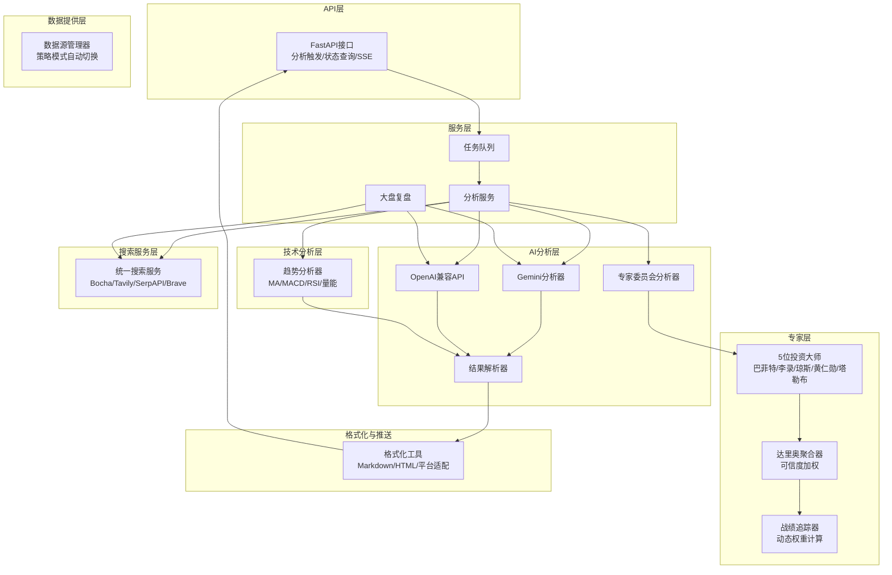

**图表来源**
- [analysis.py:68-159](file://api/v1/endpoints/analysis.py#L68-L159)
- [analyzer.py:334-800](file://src/analyzer.py#L334-L800)
- [analyzer.py:1066-1162](file://src/analyzer.py#L1066-L1162)
- [stock_analyzer.py:171-262](file://src/stock_analyzer.py#L171-L262)
- [search_service.py:144-255](file://src/search_service.py#L144-L255)
- [base.py:464-800](file://data_provider/base.py#L464-L800)

**章节来源**
- [analysis.py:68-159](file://api/v1/endpoints/analysis.py#L68-L159)
- [analyzer.py:334-800](file://src/analyzer.py#L334-L800)
- [analyzer.py:1066-1162](file://src/analyzer.py#L1066-L1162)
- [stock_analyzer.py:171-262](file://src/stock_analyzer.py#L171-L262)
- [search_service.py:144-255](file://src/search_service.py#L144-L255)
- [base.py:464-800](file://data_provider/base.py#L464-L800)

## 核心组件
- AI分析器（Gemini/OpenAI兼容）：封装系统提示词、模型初始化、重试与降级、参数适配与错误处理
- 趋势分析器：基于用户交易理念的多指标融合评分体系，输出买入/持有/卖出信号
- 搜索服务：统一接口对接多家搜索引擎，支持多Key负载均衡与故障转移
- 数据源管理器：策略模式实现多数据源自动切换与失败回退
- 专家委员会分析器：多专家并发分析与可信度加权聚合，提供权威投资决策
- API接口：异步任务队列、SSE实时推送、任务状态查询与历史回放
- 格式化工具：Markdown到平台特定格式转换、分页与长度控制

**章节来源**
- [analyzer.py:334-800](file://src/analyzer.py#L334-L800)
- [analyzer.py:1066-1162](file://src/analyzer.py#L1066-L1162)
- [stock_analyzer.py:171-262](file://src/stock_analyzer.py#L171-L262)
- [search_service.py:144-255](file://src/search_service.py#L144-L255)
- [base.py:464-800](file://data_provider/base.py#L464-L800)
- [analysis.py:68-159](file://api/v1/endpoints/analysis.py#L68-L159)
- [analysis.py:27-291](file://api/v1/schemas/analysis.py#L27-L291)

## 架构总览
系统采用"API触发 → 任务队列 → 分析服务 → AI/技术/搜索 → 专家委员会 → 结果解析 → 格式化 → 推送"的流水线式架构。AI分析器优先使用Gemini，若不可用则自动降级至OpenAI兼容API；技术分析器独立于AI，提供稳健的量化信号；搜索服务为AI提供外部新闻与消息面数据；专家委员会分析器通过多专家并发分析和可信度加权，提供权威的投资决策支持；数据源管理器保障行情数据的稳定性与可用性。

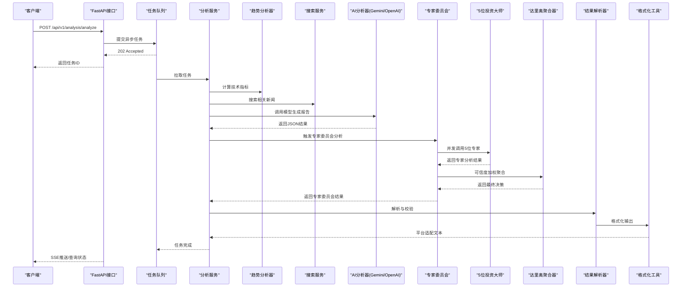

**图表来源**
- [analysis.py:68-159](file://api/v1/endpoints/analysis.py#L68-L159)
- [analyzer.py:334-800](file://src/analyzer.py#L334-L800)
- [analyzer.py:1066-1162](file://src/analyzer.py#L1066-L1162)
- [stock_analyzer.py:171-262](file://src/stock_analyzer.py#L171-L262)
- [search_service.py:144-255](file://src/search_service.py#L144-L255)

## 详细组件分析

### AI模型集成架构（Gemini/OpenAI兼容）
- 模型选择策略：优先使用Gemini，若初始化失败或API Key无效则自动降级至OpenAI兼容API；支持自定义base_url与模型名称
- 提示词工程：采用"决策仪表盘"格式，包含核心结论、数据透视、情报与作战计划四大模块
- 重试与降级：指数退避重试、Token参数兼容适配、限流处理、主备模型切换
- 结果解析：使用JSON修复与结构化解析，确保鲁棒性

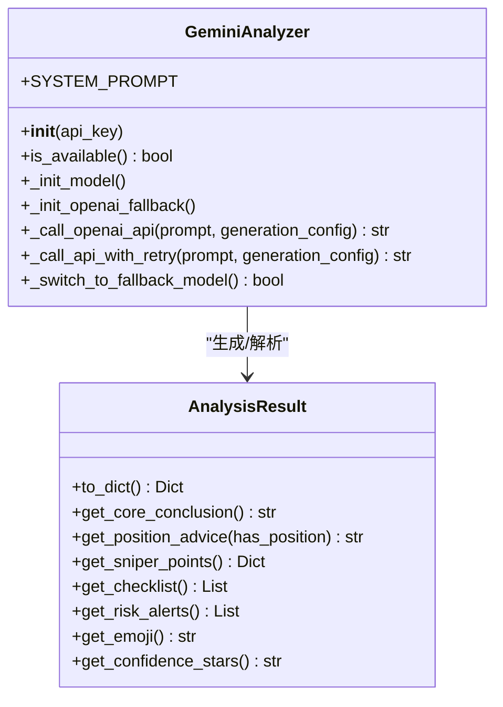

**图表来源**
- [analyzer.py:334-800](file://src/analyzer.py#L334-L800)

**章节来源**
- [analyzer.py:334-800](file://src/analyzer.py#L334-L800)

### 股票分析算法（技术指标与信号生成）
- 趋势判断：基于MA5/MA10/MA20排列与间距变化，区分强势多头、多头排列、盘整、空头排列等状态
- 乖离率：严格控制不追高，结合趋势强度进行阈值补偿
- 量价分析：偏好缩量回调，放量上涨次之，放量下跌风险最高
- 支撑压力：MA5/MA10回踩支撑，MA20重要支撑位
- 指标融合：MACD零轴上金叉、RSI超买超卖、多头排列等综合评分，输出买入/持有/卖出信号

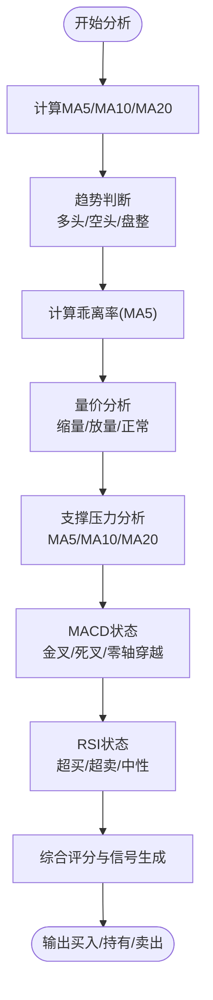

**图表来源**
- [stock_analyzer.py:205-262](file://src/stock_analyzer.py#L205-L262)

**章节来源**
- [stock_analyzer.py:171-262](file://src/stock_analyzer.py#L171-L262)

### 搜索服务与新闻整合
- 多引擎支持：Bocha、Tavily、SerpAPI、Brave等，统一接口与结果格式
- 负载均衡：多Key轮询，错误计数与熔断保护
- 结果增强：网页正文抓取与摘要拼接，时间范围过滤
- 缓存与重试：瞬时网络错误重试，结果上下文注入

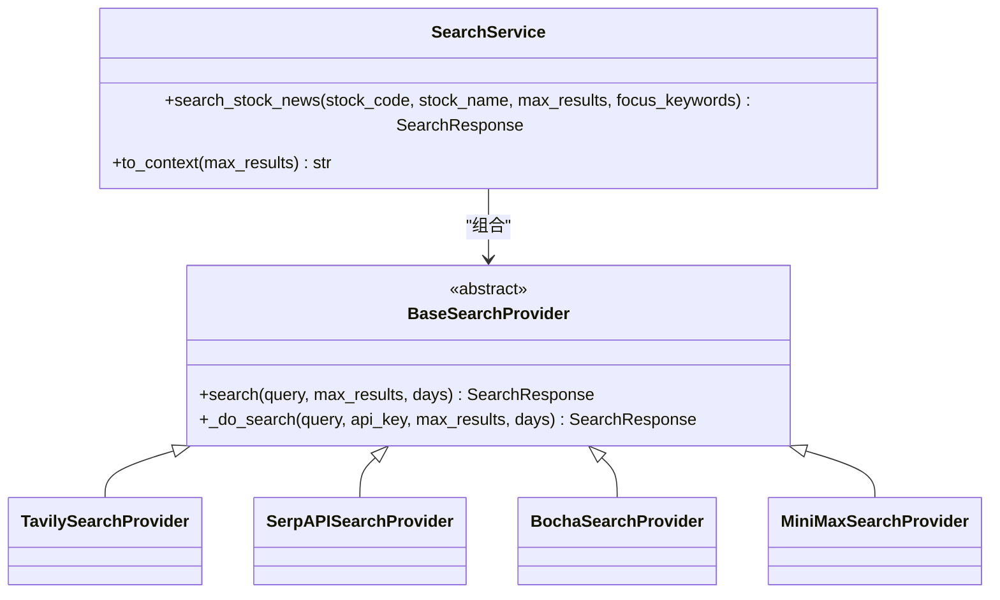

**图表来源**
- [search_service.py:144-255](file://src/search_service.py#L144-L255)

**章节来源**
- [search_service.py:144-255](file://src/search_service.py#L144-L255)

### 大盘复盘分析
- 数据来源：指数、涨跌统计、板块排行，优先使用数据源管理器
- 新闻搜索：多关键词组合搜索，聚合热点与风险
- 报告生成：AI生成或模板生成，结构化注入数据表格

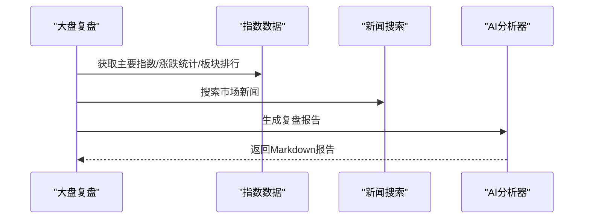

**图表来源**
- [market_analyzer.py:78-125](file://src/market_analyzer.py#L78-L125)

**章节来源**
- [market_analyzer.py:78-125](file://src/market_analyzer.py#L78-L125)

### API与任务流
- 异步分析：提交任务 → 队列调度 → SSE推送状态 → 历史查询
- 任务管理：重复提交防护、状态统计、SSE事件流
- 报告构建：从AI结果与上下文快照构建结构化报告

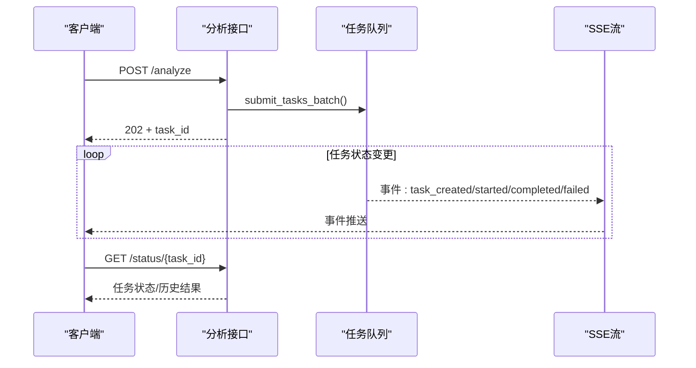

**图表来源**
- [analysis.py:68-159](file://api/v1/endpoints/analysis.py#L68-L159)
- [analysis.py:376-440](file://api/v1/endpoints/analysis.py#L376-L440)
- [analysis.py:460-571](file://api/v1/endpoints/analysis.py#L460-L571)

**章节来源**
- [analysis.py:68-159](file://api/v1/endpoints/analysis.py#L68-L159)
- [analysis.py:376-440](file://api/v1/endpoints/analysis.py#L376-L440)
- [analysis.py:460-571](file://api/v1/endpoints/analysis.py#L460-L571)
- [analysis.py:27-291](file://api/v1/schemas/analysis.py#L27-L291)

### 格式化与可视化
- Markdown到HTML转换：表格、代码块、列表等增强渲染
- 平台适配：飞书Markdown转换、表格转条目列表、分页标记
- 消息分片：按字节/字数智能切分，避免截断多字节字符

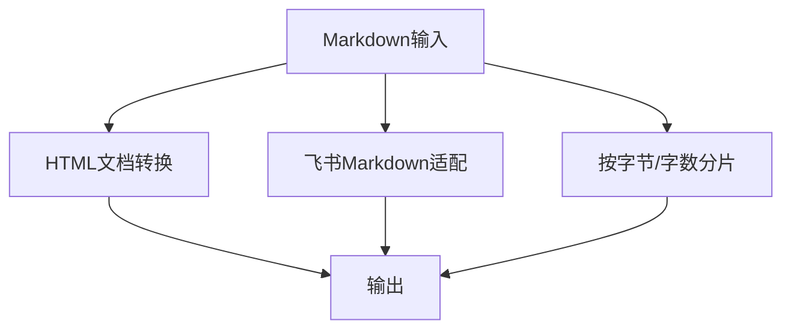

**图表来源**
- [formatters.py:98-224](file://src/formatters.py#L98-L224)
- [formatters.py:401-494](file://src/formatters.py#L401-L494)
- [formatters.py:291-375](file://src/formatters.py#L291-L375)

**章节来源**
- [formatters.py:98-224](file://src/formatters.py#L98-L224)
- [formatters.py:401-494](file://src/formatters.py#L401-L494)
- [formatters.py:291-375](file://src/formatters.py#L291-L375)

## 专家委员会分析模式

### 多专家并发分析架构
专家委员会分析模式通过同时调用5位顶级投资专家，提供多维度的投资决策支持。系统采用并发执行策略，在120秒超时时间内收集所有专家的分析结果，然后通过达里奥聚合器进行可信度加权聚合。

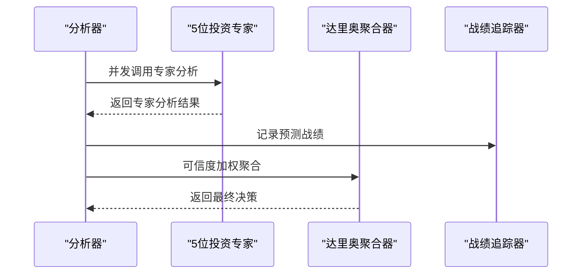

**图表来源**
- [analyzer.py:1105-1162](file://src/analyzer.py#L1105-L1162)
- [consensus_engine.py:45-84](file://src/agents/consensus_engine.py#L45-L84)
- [performance_tracker.py:45-107](file://src/services/performance_tracker.py#L45-L107)

### 专家委员会成员
系统内置5位顶级投资专家，每位专家都有独特的分析视角和专业领域：

- **巴菲特**：价值投资大师，专注于基本面分析和长期投资价值
- **李录**： Berkshire Hathaway合作伙伴，擅长中国股市分析
- **保罗·都铎·琼斯**：量化交易专家，专注于技术分析和动量交易
- **黄仁勋**：英伟达CEO，科技股分析专家
- **塔勒布**：不确定性专家，专注于风险管理

### 可信度加权聚合机制
达里奥聚合器采用"极度求真"和"极度透明"的原则，基于历史战绩可信度对专家意见进行加权聚合：

- **权重计算**：`权重 = (胜率 + 0.1) ^ 1.5`，保证即使胜率为0也有微弱存在感
- **归一化处理**：所有权重之和为1.0，确保聚合结果的合理性
- **动态调整**：基于30天内的战绩计算，支持专家能力的动态变化

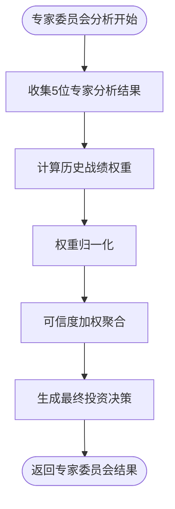

**图表来源**
- [consensus_engine.py:13-43](file://src/agents/consensus_engine.py#L13-L43)
- [performance_tracker.py:63-107](file://src/services/performance_tracker.py#L63-L107)

**章节来源**
- [analyzer.py:1105-1162](file://src/analyzer.py#L1105-L1162)
- [consensus_engine.py:7-84](file://src/agents/consensus_engine.py#L7-L84)
- [performance_tracker.py:9-194](file://src/services/performance_tracker.py#L9-L194)
- [paul_tudor_jones.py:4-47](file://src/agents/experts/paul_tudor_jones.py#L4-L47)

## 异步专家调用机制

### 并发执行策略
专家委员会分析采用异步并发执行机制，通过`asyncio.gather()`实现5位专家的并行调用：

- **超时控制**：120秒超时限制，防止长时间阻塞
- **错误处理**：单个专家调用失败不影响其他专家的执行
- **结果聚合**：使用`asyncio.wait_for()`等待所有专家响应

### 异步调用实现
系统通过`_call_expert_async`方法实现专家的异步调用，该方法使用LiteLLM API：

- **线程池执行**：使用`run_in_executor`在独立线程中执行同步API调用
- **JSON解析**：自动处理Markdown代码块包装的JSON输出
- **错误恢复**：专家调用失败时返回中性信号和错误说明

### 性能优化策略
- **并发限制**：5位专家同时执行，充分利用系统资源
- **超时保护**：120秒超时确保系统稳定性
- **资源隔离**：每个专家调用在独立线程中执行，避免相互影响

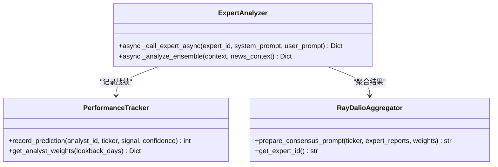

**图表来源**
- [analyzer.py:1067-1162](file://src/analyzer.py#L1067-L1162)
- [performance_tracker.py:45-107](file://src/services/performance_tracker.py#L45-L107)
- [consensus_engine.py:45-84](file://src/agents/consensus_engine.py#L45-L84)

**章节来源**
- [analyzer.py:1067-1162](file://src/analyzer.py#L1067-L1162)
- [performance_tracker.py:45-107](file://src/services/performance_tracker.py#L45-L107)
- [consensus_engine.py:45-84](file://src/agents/consensus_engine.py#L45-L84)

## 依赖关系分析
- 配置管理：全局单例配置，支持环境变量与默认值，集中管理AI、搜索、通知、数据源等参数
- 数据源策略：策略模式管理多数据源，自动失败切换与优先级排序
- 搜索服务：抽象基类 + 多实现，统一接口与错误处理
- 专家委员会：多专家并发分析与可信度加权聚合
- API层：Pydantic模型定义请求/响应，SSE事件流与任务状态管理

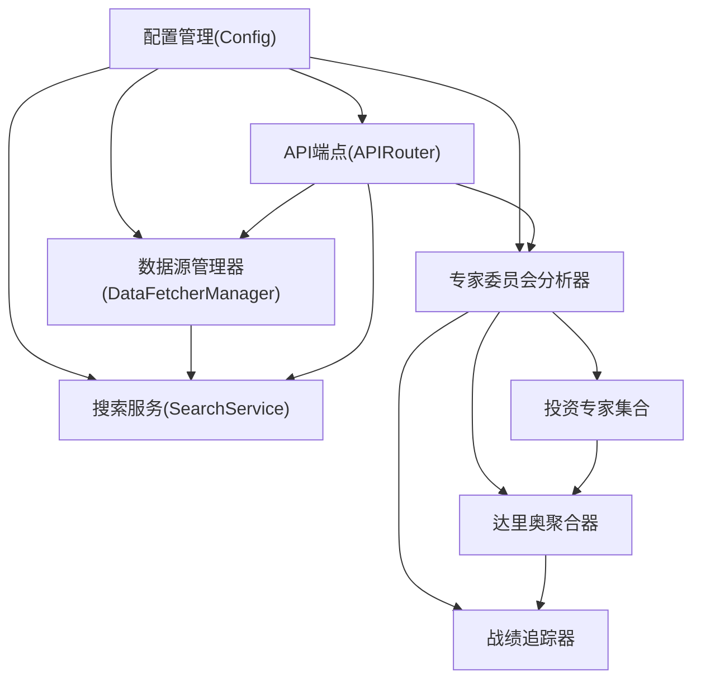

**图表来源**
- [config.py:31-231](file://src/config.py#L31-L231)
- [base.py:464-800](file://data_provider/base.py#L464-L800)
- [search_service.py:144-255](file://src/search_service.py#L144-L255)
- [analysis.py:68-159](file://api/v1/endpoints/analysis.py#L68-L159)
- [analyzer.py:1066-1162](file://src/analyzer.py#L1066-L1162)

**章节来源**
- [config.py:31-231](file://src/config.py#L31-L231)
- [base.py:464-800](file://data_provider/base.py#L464-L800)
- [search_service.py:144-255](file://src/search_service.py#L144-L255)
- [analysis.py:68-159](file://api/v1/endpoints/analysis.py#L68-L159)
- [analyzer.py:1066-1162](file://src/analyzer.py#L1066-L1162)

## 性能考量
- 模型调用优化：指数退避重试、主备模型切换、参数适配（max_tokens/max_completion_tokens）
- 搜索性能：瞬时错误重试、多Key负载均衡、熔断保护、网页正文抓取限制
- 数据获取：策略模式自动切换、随机抖动防封、数据清洗与指标计算合并
- 推送与格式化：分片与分页、平台适配、HTML转换缓存
- **专家委员会性能**：并发执行优化、超时控制、错误隔离、动态权重计算

**更新** 新增专家委员会分析的性能考量，包括并发执行优化、超时控制和动态权重计算。

## 故障排查指南
- AI模型不可用：检查Gemini/OpenAI API Key、base_url、温度参数与限流；查看日志中的重试与降级记录
- 搜索失败：确认搜索引擎Key配置、配额与网络；检查瞬时错误重试与熔断状态
- 数据源失败：查看数据源优先级与切换日志；确认Tushare Token与代理设置
- API任务冲突：重复提交会被拒绝；使用任务ID查询状态或SSE流获取实时进度
- 格式化异常：检查Markdown结构与平台适配规则；确认分片边界与编码
- **专家委员会超时**：检查LiteLLM配置、网络连接和模型可用性；查看专家调用日志
- **权重计算异常**：确认SQLite数据库可用性和权限；检查战绩记录完整性

**更新** 新增专家委员会分析相关的故障排查指南。

**章节来源**
- [analyzer.py:567-787](file://src/analyzer.py#L567-L787)
- [search_service.py:52-75](file://src/search_service.py#L52-L75)
- [base.py:735-779](file://data_provider/base.py#L735-L779)
- [analysis.py:161-233](file://api/v1/endpoints/analysis.py#L161-L233)
- [analyzer.py:1144-1148](file://src/analyzer.py#L1144-L1148)
- [performance_tracker.py:23-25](file://src/services/performance_tracker.py#L23-L25)

## 结论
本AI分析引擎通过模块化设计实现了AI与技术分析的深度融合，具备高可用、可扩展与可维护的特点。Gemini与OpenAI兼容API的双栈支持提升了鲁棒性；多数据源与搜索引擎策略保障了数据质量与时效性；完善的异步任务与SSE推送提升了用户体验。

**更新** 新增的专家委员会分析模式进一步增强了系统的分析能力，通过多专家并发分析和可信度加权聚合，为用户提供更加权威和全面的投资决策支持。异步专家调用机制确保了系统的高性能和稳定性，支持复杂的多专家协作场景。

建议在生产环境中结合监控与日志完善可观测性，并持续优化提示词与指标权重以提升分析质量。专家委员会模式的引入为系统提供了更接近专业投资机构决策流程的能力。

## 附录

### 分析流程详细步骤
- 输入：股票代码/列表、报告类型、是否异步、是否强制刷新
- 处理：技术指标计算、新闻搜索、AI模型调用、专家委员会分析、结果解析与格式化
- 输出：结构化报告、SSE事件流、历史查询接口

**更新** 在原有分析流程基础上增加了专家委员会分析步骤。

**章节来源**
- [analysis.py:88-159](file://api/v1/endpoints/analysis.py#L88-L159)
- [stock_analyzer.py:205-262](file://src/stock_analyzer.py#L205-L262)
- [search_service.py:208-255](file://src/search_service.py#L208-L255)
- [analyzer.py:788-800](file://src/analyzer.py#L788-L800)
- [analyzer.py:1105-1162](file://src/analyzer.py#L1105-L1162)

### AI模型配置指南
- Gemini：API Key、模型名称、备选模型、温度、请求间隔、重试次数与延迟、自定义endpoint
- OpenAI兼容：API Key、base_url、模型名称、温度、参数适配（max_tokens/max_completion_tokens）
- **专家委员会**：LiteLLM配置、模型路由、并发执行参数

**更新** 新增专家委员会相关的模型配置指南。

**章节来源**
- [config.py:53-70](file://src/config.py#L53-L70)
- [analyzer.py:531-620](file://src/analyzer.py#L531-L620)
- [analyzer.py:1067-1104](file://src/analyzer.py#L1067-L1104)

### 参数调优建议
- 温度参数：0.7为默认平衡值，追求稳定性可降低，追求多样性可提高
- 重试策略：指数退避与最大重试次数需结合限流策略调整
- 指标阈值：乖离率阈值可随趋势强度补偿；量价偏好可根据市场风格调整
- **专家权重**：根据历史战绩调整权重衰减系数；监控专家表现动态变化

**更新** 新增专家委员会相关的参数调优建议。

**章节来源**
- [config.py:57-63](file://src/config.py#L57-L63)
- [stock_analyzer.py:583-745](file://src/stock_analyzer.py#L583-L745)
- [performance_tracker.py:99-101](file://src/services/performance_tracker.py#L99-L101)

### 效果验证方法
- 回测验证：启用回测引擎，设定评估窗口与中性带宽，对比策略收益与风险指标
- 准确性评估：对比AI建议与后续价格走势，计算胜率、盈亏比与最大回撤
- 持续改进：收集错误案例，迭代提示词与指标权重，定期评估模型表现
- **专家委员会评估**：基于战绩追踪器的胜率统计，评估专家权重计算效果

**更新** 新增专家委员会分析的效果验证方法。

**章节来源**
- [config.py:140-146](file://src/config.py#L140-L146)
- [performance_tracker.py:109-155](file://src/services/performance_tracker.py#L109-L155)

### 开发者扩展指南
- 新增AI模型：实现OpenAI兼容接口或扩展Gemini适配器，遵循参数适配与错误处理规范
- 自定义技术指标：在趋势分析器中扩展指标计算与评分逻辑，保持与现有评分体系一致
- 新增数据源：实现BaseFetcher接口，设置优先级，加入策略管理器
- 新增搜索引擎：实现BaseSearchProvider接口，支持多Key轮询与熔断保护
- **新增专家**：实现专家接口，添加到专家委员会配置中，支持自定义分析逻辑
- **专家权重**：扩展战绩追踪器，支持新的权重计算算法

**更新** 新增专家委员会相关的开发者扩展指南。

**章节来源**
- [analyzer.py:567-620](file://src/analyzer.py#L567-L620)
- [stock_analyzer.py:233-262](file://src/stock_analyzer.py#L233-L262)
- [base.py:233-462](file://data_provider/base.py#L233-L462)
- [search_service.py:144-207](file://src/search_service.py#L144-L207)
- [consensus_engine.py:7-84](file://src/agents/consensus_engine.py#L7-L84)
- [performance_tracker.py:9-194](file://src/services/performance_tracker.py#L9-L194)