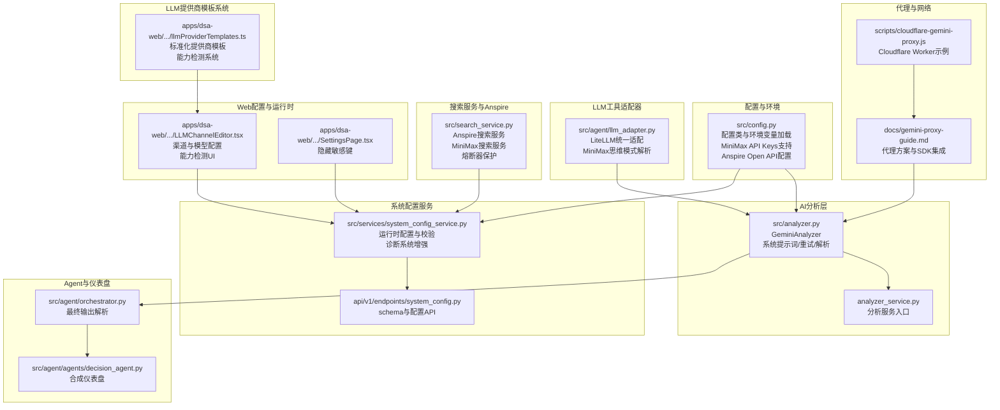
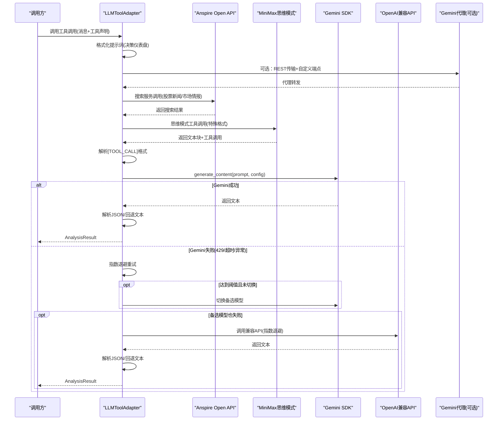
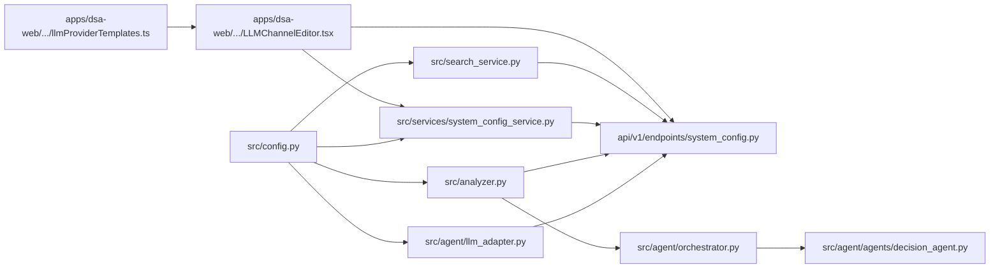

# AI模型集成

<cite>
**本文引用的文件**
- [src/config.py](file://src/config.py)
- [src/analyzer.py](file://src/analyzer.py)
- [analyzer_service.py](file://analyzer_service.py)
- [src/agent/llm_adapter.py](file://src/agent/llm_adapter.py)
- [src/search_service.py](file://src/search_service.py)
- [src/services/system_config_service.py](file://src/services/system_config_service.py)
- [docs/gemini-proxy-guide.md](file://docs/gemini-proxy-guide.md)
- [scripts/cloudflare-gemini-proxy.js](file://scripts/cloudflare-gemini-proxy.js)
- [apps/dsa-web/src/components/settings/LLMChannelEditor.tsx](file://apps/dsa-web/src/components/settings/LLMChannelEditor.tsx)
- [apps/dsa-web/src/pages/SettingsPage.tsx](file://apps/dsa-web/src/pages/SettingsPage.tsx)
- [api/v1/endpoints/system_config.py](file://api/v1/endpoints/system_config.py)
- [src/agent/orchestrator.py](file://src/agent/orchestrator.py)
- [src/agent/agents/decision_agent.py](file://src/agent/agents/decision_agent.py)
- [apps/dsa-web/src/components/settings/llmProviderTemplates.ts](file://apps/dsa-web/src/components/settings/llmProviderTemplates.ts)
- [tests/test_anspire_search.py](file://tests/test_anspire_search.py)
</cite>

## 更新摘要
**所做更改**
- 新增Anspire Open API支持作为LLM提供商和网络搜索服务
- 添加LLM提供商模板系统，支持标准化渠道配置
- 增强诊断功能，提供详细的错误分类和故障排查指导
- 更新配置管理以支持新的提供商和搜索服务

## 目录
1. [简介](#简介)
2. [项目结构](#项目结构)
3. [核心组件](#核心组件)
4. [架构总览](#架构总览)
5. [详细组件分析](#详细组件分析)
6. [依赖分析](#依赖分析)
7. [性能考虑](#性能考虑)
8. [故障排查指南](#故障排查指南)
9. [结论](#结论)
10. [附录](#附录)

## 简介
本文件面向开发者与运维人员，系统化梳理本项目的AI模型集成模块，重点覆盖以下方面：
- Gemini与OpenAI兼容API的双模型架构设计与初始化流程
- MiniMax模型支持与思维模式工具调用解析，包括特殊工具调用格式'[TOOL_CALL]{...}[/TOOL_CALL]'
- **新增** Anspire Open API支持作为一站式模型+搜索服务提供商
- **新增** LLM提供商模板系统，提供标准化渠道配置和能力检测
- 配置管理、API密钥处理与代理访问
- 错误恢复与重试机制、限流处理与性能优化
- 模型选择逻辑、版本兼容性与API端点配置
- 系统提示词构建与优化策略（决策仪表盘格式规范与输出约束）
- 模型配置指南、参数调优建议与成本控制方案
- 新模型接入与现有模型替换的技术指导

## 项目结构
AI模型集成相关的核心代码分布在如下位置：
- 配置与环境变量：src/config.py
- AI分析器与提示词：src/analyzer.py
- 分析服务入口：analyzer_service.py
- LLM工具适配器：src/agent/llm_adapter.py（新增MiniMax支持）
- **新增** 搜索服务与Anspire集成：src/search_service.py
- **新增** LLM提供商模板系统：apps/dsa-web/src/components/settings/llmProviderTemplates.ts
- 代理与网络访问：docs/gemini-proxy-guide.md、scripts/cloudflare-gemini-proxy.js
- Web配置界面与运行时模型管理：apps/dsa-web/.../LLMChannelEditor.tsx、SettingsPage.tsx
- 运行时配置服务与API：src/services/system_config_service.py、api/v1/endpoints/system_config.py
- Agent编排与仪表盘：src/agent/orchestrator.py、src/agent/agents/decision_agent.py

**图表来源**
- [src/config.py:1-580](file://src/config.py#L1-L580)
- [src/analyzer.py:1-1539](file://src/analyzer.py#L1-L1539)
- [analyzer_service.py:1-135](file://analyzer_service.py#L1-L135)
- [src/agent/llm_adapter.py:1-573](file://src/agent/llm_adapter.py#L1-L573)
- [src/search_service.py:1060-1259](file://src/search_service.py#L1060-L1259)
- [apps/dsa-web/src/components/settings/llmProviderTemplates.ts:51-235](file://apps/dsa-web/src/components/settings/llmProviderTemplates.ts#L51-L235)
- [docs/gemini-proxy-guide.md:1-397](file://docs/gemini-proxy-guide.md#L1-L397)
- [scripts/cloudflare-gemini-proxy.js:1-64](file://scripts/cloudflare-gemini-proxy.js#L1-L64)
- [apps/dsa-web/src/components/settings/LLMChannelEditor.tsx:354-900](file://apps/dsa-web/src/components/settings/LLMChannelEditor.tsx#L354-L900)
- [apps/dsa-web/src/pages/SettingsPage.tsx:75-119](file://apps/dsa-web/src/pages/SettingsPage.tsx#L75-L119)
- [src/services/system_config_service.py:55-295](file://src/services/system_config_service.py#L55-L295)
- [api/v1/endpoints/system_config.py:189-214](file://api/v1/endpoints/system_config.py#L189-L214)
- [src/agent/orchestrator.py:579-645](file://src/agent/orchestrator.py#L579-L645)
- [src/agent/agents/decision_agent.py:164-190](file://src/agent/agents/decision_agent.py#L164-L190)

**章节来源**
- [src/config.py:1-580](file://src/config.py#L1-L580)
- [src/analyzer.py:1-1539](file://src/analyzer.py#L1-L1539)
- [analyzer_service.py:1-135](file://analyzer_service.py#L1-L135)
- [src/agent/llm_adapter.py:1-573](file://src/agent/llm_adapter.py#L1-L573)
- [src/search_service.py:1060-1259](file://src/search_service.py#L1060-L1259)
- [apps/dsa-web/src/components/settings/llmProviderTemplates.ts:51-235](file://apps/dsa-web/src/components/settings/llmProviderTemplates.ts#L51-L235)
- [docs/gemini-proxy-guide.md:1-397](file://docs/gemini-proxy-guide.md#L1-L397)
- [scripts/cloudflare-gemini-proxy.js:1-64](file://scripts/cloudflare-gemini-proxy.js#L1-L64)
- [apps/dsa-web/src/components/settings/LLMChannelEditor.tsx:354-900](file://apps/dsa-web/src/components/settings/LLMChannelEditor.tsx#L354-L900)
- [apps/dsa-web/src/pages/SettingsPage.tsx:75-119](file://apps/dsa-web/src/pages/SettingsPage.tsx#L75-L119)
- [src/services/system_config_service.py:55-295](file://src/services/system_config_service.py#L55-L295)
- [api/v1/endpoints/system_config.py:189-214](file://api/v1/endpoints/system_config.py#L189-L214)
- [src/agent/orchestrator.py:579-645](file://src/agent/orchestrator.py#L579-L645)
- [src/agent/agents/decision_agent.py:164-190](file://src/agent/agents/decision_agent.py#L164-L190)

## 核心组件
- 配置管理（Config）：集中管理AI模型相关配置，包括Gemini主备模型、温度参数、重试与限流参数、代理端点、OpenAI兼容API等；支持MiniMax API Keys配置；支持Anspire Open API配置；支持从.env加载与热更新。
- LLMToolAdapter：统一的LiteLLM工具调用适配器，新增MiniMax思维模式支持，包括特殊工具调用格式解析与成本计算注册。
- **新增** AnspireSearchProvider：Anspire Open API的网络搜索服务，提供实时智能搜索引擎，支持股票新闻和市场情报搜索。
- **新增** LLM提供商模板系统：提供标准化的提供商配置模板，包括协议、基础URL、模型占位符、能力标签等，支持能力检测和故障排查。
- GeminiAnalyzer：封装Gemini与OpenAI兼容API的调用、重试、模型切换、仪表盘解析与提示词格式化。
- 分析服务入口（analyzer_service.py）：对外提供分析接口，统一调度分析流程与通知。
- MiniMax搜索服务：提供MiniMax Web Search能力，包含熔断器保护机制。
- 代理与网络：提供Gemini代理方案与SDK集成方式，支持REST传输与自定义端点。
- Web配置界面：提供渠道与模型配置、主备模型选择、运行时校验与保存。
- 运行时配置服务：提供配置schema、校验与热重载，保障运行时一致性。
- Agent编排与仪表盘：在Agent层面解析与合成决策仪表盘，提供回退与规范化输出。

**章节来源**
- [src/config.py:31-194](file://src/config.py#L31-L194)
- [src/agent/llm_adapter.py:133-573](file://src/agent/llm_adapter.py#L133-L573)
- [src/search_service.py:1060-1259](file://src/search_service.py#L1060-L1259)
- [apps/dsa-web/src/components/settings/llmProviderTemplates.ts:51-235](file://apps/dsa-web/src/components/settings/llmProviderTemplates.ts#L51-L235)
- [src/analyzer.py:334-1004](file://src/analyzer.py#L334-L1004)
- [analyzer_service.py:26-135](file://analyzer_service.py#L26-L135)
- [src/search_service.py:1249-1479](file://src/search_service.py#L1249-L1479)
- [docs/gemini-proxy-guide.md:229-342](file://docs/gemini-proxy-guide.md#L229-L342)
- [apps/dsa-web/src/components/settings/LLMChannelEditor.tsx:354-900](file://apps/dsa-web/src/components/settings/LLMChannelEditor.tsx#L354-L900)
- [src/services/system_config_service.py:55-295](file://src/services/system_config_service.py#L55-L295)
- [src/agent/orchestrator.py:579-645](file://src/agent/orchestrator.py#L579-L645)

## 架构总览
双模型架构采用"Gemini优先、OpenAI兼容API备选"的策略，通过配置驱动与运行时校验实现主备切换与故障转移。新增的MiniMax支持通过统一的LLMToolAdapter适配，提供思维模式下的特殊工具调用格式解析。**新增的Anspire Open API提供一站式模型+搜索服务，通过LLM提供商模板系统实现标准化配置和能力检测。** 系统提示词采用"决策仪表盘"格式，强制输出结构化JSON，便于Agent解析与UI渲染。

**图表来源**
- [src/agent/llm_adapter.py:470-573](file://src/agent/llm_adapter.py#L470-L573)
- [src/analyzer.py:817-878](file://src/analyzer.py#L817-L878)
- [src/analyzer.py:880-1004](file://src/analyzer.py#L880-L1004)
- [src/search_service.py:1060-1259](file://src/search_service.py#L1060-L1259)
- [docs/gemini-proxy-guide.md:229-342](file://docs/gemini-proxy-guide.md#L229-L342)

## 详细组件分析

### 配置管理与API密钥处理
- 配置项涵盖：
  - Gemini主模型、备选模型、温度、请求间隔、最大重试、重试延时、自定义API端点
  - OpenAI兼容API的Key、Base URL、模型、温度
  - MiniMax API Keys支持，用于搜索服务与工具调用
  - **新增** Anspire Open API配置：ANSPIRE_API_KEYS、ANSPIRE_LLM_ENABLED、ANSPIRE_LLM_BASE_URL、ANSPIRE_LLM_MODEL
  - 代理HTTP/HTTPS、NO_PROXY自动合并国内域名
- 加载优先级：系统环境变量 > .env > 默认值；支持热读取STOCK_LIST等配置。
- 密钥有效性校验：过滤占位符与长度，避免无效Key导致初始化失败。
- 代理配置：当配置HTTP_PROXY时，自动设置NO_PROXY以排除国内数据源域名，避免行情接口失败。

**章节来源**
- [src/config.py:31-194](file://src/config.py#L31-L194)
- [src/config.py:256-437](file://src/config.py#L256-L437)
- [src/config.py:504](file://src/config.py#L504)
- [src/config.py:1150-1190](file://src/config.py#L1150-L1190)
- [src/config.py:1031-1032](file://src/config.py#L1031-L1032)

### LLM工具适配器与MiniMax支持
- 统一适配层：通过LiteLLM提供跨提供商的工具调用接口，支持所有主流LLM提供商。
- MiniMax思维模式支持：
  - 自定义模型定价注册，防止成本计算错误
  - 思维模式激活payload处理，避免重复激活
  - 特殊工具调用格式解析：`[TOOL_CALL]{tool => "name", args => {--arg1 "value"}}[/TOOL_CALL]`
  - 内容块格式处理：支持choice.level和message.level两种content_blocks格式
- 错误处理：RateLimitError、ContextWindowExceededError等异常的优雅处理与回退。
- 性能优化：Router负载均衡、超时控制、令牌计数统计。

**章节来源**
- [src/agent/llm_adapter.py:133-573](file://src/agent/llm_adapter.py#L133-L573)
- [src/agent/llm_adapter.py:64-88](file://src/agent/llm_adapter.py#L64-L88)
- [src/agent/llm_adapter.py:470-573](file://src/agent/llm_adapter.py#L470-L573)
- [src/agent/llm_adapter.py:533-553](file://src/agent/llm_adapter.py#L533-L553)

### **新增** Anspire Open API与搜索服务集成
- AnspireSearchProvider：
  - 面向AI生态的下一代实时智能搜索引擎，结果精准、响应快速
  - 适用于股票新闻和市场情报搜索，支持时间范围过滤
  - API端点：https://plugin.anspire.cn/api/ntsearch/search
  - 支持多API Key轮询，自动故障转移
  - 错误处理：401无效Key、403余额不足、400参数错误等状态码分类
- 配置支持：
  - ANSPIRE_API_KEYS：支持多个API Key，逗号分隔
  - ANSPIRE_LLM_ENABLED：控制Anspire LLM通道启用状态
  - ANSPIRE_LLM_BASE_URL：Anspire LLM网关基础URL，默认https://open-gateway.anspire.cn/v6
  - ANSPIRE_LLM_MODEL：默认模型 Doubao-Seed-2.0-lite
- 与现有架构集成：
  - 当未配置其他OpenAI兼容API Key时，自动使用ANSPIRE_API_KEYS作为遗留兼容提供程序
  - 通过LLM提供商模板系统标准化配置

**章节来源**
- [src/search_service.py:1060-1259](file://src/search_service.py#L1060-L1259)
- [src/config.py:1150-1190](file://src/config.py#L1150-L1190)
- [tests/test_anspire_search.py:1-200](file://tests/test_anspire_search.py#L1-L200)
- [tests/test_anspire_search.py:255-524](file://tests/test_anspire_search.py#L255-L524)

### **新增** LLM提供商模板系统
- 模板结构：
  - channelId：提供商唯一标识符（如'anspire'）
  - label：提供商显示名称
  - protocol：通信协议（openai、deepseek、gemini等）
  - baseUrl：API基础URL
  - placeholderModels：模型名称占位符
  - capabilities：能力标签集合
- 支持的提供商模板：
  - aihubmix、anspire、deepseek、dashscope、zhipu、moonshot、minimax、volcengine、siliconflow、openrouter、gemini、anthropic、openai、ollama、custom
- 能力检测系统：
  - 支持JSON格式、工具调用、流式传输、视觉能力等检测
  - 提供详细的错误分类和故障排查指导
  - 与Web界面集成，提供可视化的能力检测结果

**章节来源**
- [apps/dsa-web/src/components/settings/llmProviderTemplates.ts:51-235](file://apps/dsa-web/src/components/settings/llmProviderTemplates.ts#L51-L235)
- [apps/dsa-web/src/components/settings/LLMChannelEditor.tsx:17-24](file://apps/dsa-web/src/components/settings/LLMChannelEditor.tsx#L17-L24)
- [apps/dsa-web/src/components/settings/LLMChannelEditor.tsx:837-855](file://apps/dsa-web/src/components/settings/LLMChannelEditor.tsx#L837-L855)

### Gemini与OpenAI兼容API集成
- 初始化优先级：Gemini > OpenAI兼容API
- Gemini初始化：
  - 从配置读取主模型与备选模型，系统提示词注入
  - 支持REST传输与自定义端点（代理），避免gRPC不支持自定义端点
  - 主模型初始化失败时自动切换至备选模型
- OpenAI兼容API：
  - 动态导入OpenAI SDK，支持自定义base_url
  - 参数适配：max_tokens/max_completion_tokens兼容性处理
  - 指数退避重试，限流检测与错误日志
  - **新增** 支持Anspire Open API作为兼容提供程序
- 双模型切换策略：
  - Gemini内部重试达到阈值后尝试切换备选模型
  - 若Gemini完全失败，转为OpenAI兼容API

**章节来源**
- [src/analyzer.py:531-673](file://src/analyzer.py#L531-L673)
- [src/analyzer.py:674-698](file://src/analyzer.py#L674-L698)
- [src/analyzer.py:788-878](file://src/analyzer.py#L788-L878)
- [src/analyzer.py:817-878](file://src/analyzer.py#L817-L878)
- [src/config.py:1150-1190](file://src/config.py#L1150-L1190)
- [docs/gemini-proxy-guide.md:229-342](file://docs/gemini-proxy-guide.md#L229-L342)

### MiniMax搜索服务与熔断器保护
- 搜索能力：基于MiniMax Coding Plan API提供结构化有机搜索结果。
- 时间范围过滤：通过查询增强和客户端日期过滤实现时间范围限制。
- 熔断器机制：连续3次失败后进入300秒冷却期，保护系统免受上游故障影响。
- 错误处理：HTTP状态码检查、JSON响应解析、网络异常捕获。

**章节来源**
- [src/search_service.py:1249-1479](file://src/search_service.py#L1249-L1479)

### 系统提示词与决策仪表盘格式
- 提示词结构：
  - 交易理念与评分标准（严进策略、趋势交易、效率优先、买点偏好、风险排查）
  - 输出格式：决策仪表盘JSON，包含核心结论、数据透视、舆情情报、作战计划
  - 强制输出约束：股票名称、核心结论、持仓分类建议、具体狙击点位、检查清单
- 解析与回退：
  - 优先解析JSON，失败时尝试从纯文本提取关键信息
  - 通过json-repair与正则修复常见格式问题
- Agent层面：
  - Orchestrator优先解析/规范化仪表盘，否则回退为纯文本摘要
  - Decision Agent在非聊天模式下合成仪表盘JSON

**章节来源**
- [src/analyzer.py:354-529](file://src/analyzer.py#L354-L529)
- [src/analyzer.py:1298-1467](file://src/analyzer.py#L1298-L1467)
- [src/agent/orchestrator.py:579-645](file://src/agent/orchestrator.py#L579-L645)
- [src/agent/agents/decision_agent.py:164-190](file://src/agent/agents/decision_agent.py#L164-L190)

### 重试机制、限流处理与性能优化
- 重试策略：
  - Gemini：指数退避（最大60秒），限流检测（429/quota/rate），达到阈值后切换备选模型
  - OpenAI兼容API：指数退避，参数兼容性自动切换（max_tokens↔max_completion_tokens）
  - MiniMax：熔断器保护，连续失败后冷却
  - **新增** Anspire：多Key轮询，自动故障转移
- 请求间隔与限流：
  - 配置gemini_request_delay减少请求频率，降低429概率
  - gemini_max_retries与gemini_retry_delay控制整体重试上限与基础延时
- 性能优化：
  - REST传输与自定义端点（代理）避免gRPC限制
  - 批量分析时按delay_between间隔等待，避免速率限制
  - 代理平台选择（Netlify Edge Functions）兼顾可用性与成本

**章节来源**
- [src/analyzer.py:817-878](file://src/analyzer.py#L817-L878)
- [src/analyzer.py:703-787](file://src/analyzer.py#L703-L787)
- [src/analyzer.py:1469-1496](file://src/analyzer.py#L1469-L1496)
- [src/search_service.py:1265-1267](file://src/search_service.py#L1265-L1267)
- [src/search_service.py:1060-1259](file://src/search_service.py#L1060-L1259)
- [docs/gemini-proxy-guide.md:387-397](file://docs/gemini-proxy-guide.md#L387-L397)

### 模型选择逻辑、版本兼容性与API端点配置
- 模型选择：
  - 主模型优先，失败后自动切换备选模型
  - Web界面支持主模型与备选模型选择，校验有效性
  - MiniMax通过"minimax/"前缀标识，支持思维模式工具调用
  - **新增** Anspire通过"anspire/"前缀标识，支持一站式模型+搜索服务
- 版本兼容性：
  - Gemini SDK通过REST传输与client_options.api_endpoint支持代理
  - OpenAI兼容API自动适配参数差异
  - MiniMax通过LiteLLM统一适配，支持自定义模型定价
  - **新增** Anspire通过OpenAI兼容协议实现无缝集成
- API端点配置：
  - Gemini：GEMINI_API_KEY + GEMINI_API_BASE（可选代理）
  - OpenAI：OPENAI_API_KEY + OPENAI_BASE_URL（可选）
  - MiniMax：MINIMAX_API_KEYS（搜索服务）
  - **新增** Anspire：ANSPIRE_API_KEYS + ANSPIRE_LLM_BASE_URL（默认https://open-gateway.anspire.cn/v6）

**章节来源**
- [src/analyzer.py:620-673](file://src/analyzer.py#L620-L673)
- [src/analyzer.py:703-787](file://src/analyzer.py#L703-L787)
- [src/agent/llm_adapter.py:64-88](file://src/agent/llm_adapter.py#L64-L88)
- [src/config.py:1150-1190](file://src/config.py#L1150-L1190)
- [apps/dsa-web/src/components/settings/LLMChannelEditor.tsx:354-900](file://apps/dsa-web/src/components/settings/LLMChannelEditor.tsx#L354-L900)

### 运行时配置与Web界面
- 运行时配置服务：
  - 提供配置schema、校验与热重载，触发相关单例重置
  - MiniMax模型定价注册，防止成本计算错误
  - **新增** 增强的诊断系统，提供详细的错误分类和故障排查指导
- Web界面：
  - 隐藏敏感键（如GEMINI_API_KEY、OPENAI_API_KEY、MINIMAX_API_KEYS、ANSPIRE_API_KEYS）在通用表单中
  - 支持LLM渠道管理、主备模型选择与保存
  - **新增** 能力检测功能，支持JSON格式、工具调用、流式传输等能力验证
  - 与后端system_config API联动

**章节来源**
- [src/services/system_config_service.py:55-295](file://src/services/system_config_service.py#L55-L295)
- [src/services/system_config_service.py:430-434](file://src/services/system_config_service.py#L430-L434)
- [src/services/system_config_service.py:1152-1189](file://src/services/system_config_service.py#L1152-L1189)
- [src/services/system_config_service.py:2700-2950](file://src/services/system_config_service.py#L2700-L2950)
- [apps/dsa-web/src/pages/SettingsPage.tsx:75-119](file://apps/dsa-web/src/pages/SettingsPage.tsx#L75-L119)
- [apps/dsa-web/src/components/settings/LLMChannelEditor.tsx:354-900](file://apps/dsa-web/src/components/settings/LLMChannelEditor.tsx#L354-L900)
- [apps/dsa-web/src/components/settings/LLMChannelEditor.tsx:798-1515](file://apps/dsa-web/src/components/settings/LLMChannelEditor.tsx#L798-L1515)
- [api/v1/endpoints/system_config.py:189-214](file://api/v1/endpoints/system_config.py#L189-L214)

### 代理配置与网络访问
- 代理方案：
  - Netlify Edge Functions与Cloudflare Workers示例
  - REST传输+自定义端点，支持CORS与错误处理
- 网络访问：
  - 通过GEMINI_API_BASE指向代理URL
  - SDK配置时强制REST传输以支持自定义端点

**章节来源**
- [docs/gemini-proxy-guide.md:229-342](file://docs/gemini-proxy-guide.md#L229-L342)
- [scripts/cloudflare-gemini-proxy.js:39-64](file://scripts/cloudflare-gemini-proxy.js#L39-L64)

## 依赖分析
- 组件耦合：
  - LLMToolAdapter依赖Config与环境变量，通过LiteLLM提供统一接口
  - GeminiAnalyzer依赖LLMToolAdapter与配置，耦合度低，便于替换与扩展
  - **新增** AnspireSearchProvider独立于LLM适配器，直接通过HTTP API调用
  - **新增** LLM提供商模板系统通过Web界面与运行时配置服务解耦
  - 分析服务入口通过依赖注入支持测试与扩展
  - Web配置界面与运行时配置服务通过API交互，保持前后端解耦
- 外部依赖：
  - google-generativeai（REST传输与client_options）
  - openai（兼容API）
  - litellm（统一LLM接口）
  - json-repair（JSON修复）
  - **新增** requests库（Anspire搜索API调用）
- 潜在循环依赖：
  - 未发现循环依赖；各模块职责清晰，通过配置中心与服务层解耦

**图表来源**
- [src/config.py:1-580](file://src/config.py#L1-L580)
- [src/agent/llm_adapter.py:1-573](file://src/agent/llm_adapter.py#L1-L573)
- [src/analyzer.py:1-1539](file://src/analyzer.py#L1-L1539)
- [src/search_service.py:1060-1259](file://src/search_service.py#L1060-L1259)
- [src/services/system_config_service.py:55-295](file://src/services/system_config_service.py#L55-L295)
- [api/v1/endpoints/system_config.py:189-214](file://api/v1/endpoints/system_config.py#L189-L214)
- [apps/dsa-web/src/components/settings/LLMChannelEditor.tsx:354-900](file://apps/dsa-web/src/components/settings/LLMChannelEditor.tsx#L354-L900)
- [apps/dsa-web/src/components/settings/llmProviderTemplates.ts:51-235](file://apps/dsa-web/src/components/settings/llmProviderTemplates.ts#L51-L235)
- [src/agent/orchestrator.py:579-645](file://src/agent/orchestrator.py#L579-L645)
- [src/agent/agents/decision_agent.py:164-190](file://src/agent/agents/decision_agent.py#L164-L190)

## 性能考虑
- 重试与退避：指数退避降低峰值请求压力，配合gemini_request_delay减少429概率
- 传输协议：REST传输避免gRPC限制，提升代理场景可用性
- 批量分析：按delay_between间隔等待，避免并发限流
- 代理平台：Netlify Edge Functions在可用性与成本间取得平衡
- MiniMax熔断器：防止上游故障影响系统稳定性
- **新增** Anspire多Key轮询：提高可用性和可靠性
- **新增** 能力检测缓存：减少重复检测开销
- 日志与可观测性：INFO级别记录关键信息，DEBUG级别保留完整上下文，便于定位性能瓶颈

## 故障排查指南
- Gemini初始化失败：
  - 检查GEMINI_API_KEY是否有效（非占位符、长度>10）
  - 确认GEMINI_API_BASE是否指向可用代理（REST传输）
  - 查看日志中"主模型初始化失败→切换备选模型"的提示
- 429限流：
  - 增大gemini_request_delay与gemini_retry_delay
  - 检查代理域名是否被GFW阻断（参考代理文档）
- OpenAI兼容API失败：
  - 确认OPENAI_API_KEY与OPENAI_BASE_URL配置
  - 观察参数兼容性错误（max_tokens/max_completion_tokens自动切换）
  - **新增** 检查ANSPIRE_API_KEYS配置，确认Anspire LLM通道启用状态
- MiniMax工具调用失败：
  - 检查MINIMAX_API_KEYS配置
  - 验证思维模式工具调用格式：`[TOOL_CALL]{tool => "name", args => {--arg1 "value"}}[/TOOL_CALL]`
  - 查看熔断器状态，等待冷却期结束
- **新增** Anspire搜索失败：
  - 检查ANSPIRE_API_KEYS配置，支持多个Key轮询
  - 401：确认API Key有效性和权限
  - 403：检查余额和配额限制
  - 400：验证请求参数格式
  - 超时：检查网络连接和代理配置
- **新增** 能力检测失败：
  - 使用LLM Channel Editor的"测试连接"功能
  - 查看详细的错误分类和故障排查建议
  - 检查提供商模板配置是否正确
- 仪表盘解析失败：
  - 检查AI输出是否符合JSON格式规范
  - 使用json-repair修复常见问题
  - 回退到纯文本摘要，结合Agent回退逻辑

**章节来源**
- [src/analyzer.py:531-673](file://src/analyzer.py#L531-L673)
- [src/analyzer.py:788-878](file://src/analyzer.py#L788-L878)
- [src/analyzer.py:1298-1467](file://src/analyzer.py#L1298-L1467)
- [src/agent/llm_adapter.py:533-553](file://src/agent/llm_adapter.py#L533-L553)
- [src/search_service.py:1294-1307](file://src/search_service.py#L1294-L1307)
- [src/search_service.py:1060-1259](file://src/search_service.py#L1060-L1259)
- [src/services/system_config_service.py:2700-2950](file://src/services/system_config_service.py#L2700-L2950)
- [apps/dsa-web/src/components/settings/LLMChannelEditor.tsx:798-1515](file://apps/dsa-web/src/components/settings/LLMChannelEditor.tsx#L798-L1515)
- [docs/gemini-proxy-guide.md:322-342](file://docs/gemini-proxy-guide.md#L322-L342)

## 结论
本项目的AI模型集成模块通过双模型架构与完善的配置体系，实现了高可用、可扩展与可维护的智能分析能力。**新增的Anspire Open API支持通过一体化的模型+搜索服务，为用户提供更全面的AI能力。LLM提供商模板系统的引入，标准化了渠道配置和能力检测流程，大大提升了系统的易用性和可维护性。** 新增的MiniMax支持通过统一的LLMToolAdapter适配，提供思维模式下的特殊工具调用格式解析，增强了系统的工具调用能力。Gemini优先、OpenAI兼容API备选的设计在复杂网络环境下提供了稳健的故障转移机制；严格的系统提示词与仪表盘格式规范确保了输出的一致性与可解析性；运行时配置与Web界面进一步提升了运维效率与安全性。建议在生产环境中结合代理方案、合理的重试与限流策略、MiniMax熔断器保护、**Anspire多Key轮询机制**，以及**LLM提供商模板系统的能力检测功能**，与持续的成本监控，以获得最佳的稳定性与性价比。

## 附录

### 模型配置指南
- Gemini主模型与备选模型：在配置中指定主模型与备选模型名称，初始化失败时自动切换
- OpenAI兼容API：配置OPENAI_API_KEY与OPENAI_BASE_URL，支持多种兼容服务
- MiniMax模型：通过"minimax/"前缀标识，配置MINIMAX_API_KEYS用于搜索与工具调用
- **新增** Anspire Open API：配置ANSPIRE_API_KEYS，支持多个Key轮询，自动启用LLM通道
- 温度参数：gemini_temperature、openai_temperature、llm_temperature统一控制输出随机性
- 重试与限流：gemini_max_retries、gemini_retry_delay、gemini_request_delay
- 代理端点：GEMINI_API_BASE指向代理URL，强制REST传输

**章节来源**
- [src/config.py:54-70](file://src/config.py#L54-L70)
- [src/config.py:504](file://src/config.py#L504)
- [src/config.py:1150-1190](file://src/config.py#L1150-L1190)
- [src/analyzer.py:620-673](file://src/analyzer.py#L620-L673)
- [src/agent/llm_adapter.py:64-88](file://src/agent/llm_adapter.py#L64-L88)
- [docs/gemini-proxy-guide.md:229-342](file://docs/gemini-proxy-guide.md#L229-L342)

### 参数调优建议
- 温度：0.3-0.7平衡创造性与稳定性；过高可能导致输出分散
- 重试：适度增大gemini_retry_delay，避免频繁重试引发上游限流
- 请求间隔：gemini_request_delay建议≥2秒，结合业务并发调整
- MiniMax：合理设置思维模式工具调用的max_tokens，避免输出截断
- **新增** Anspire：配置多个API Key以提高可用性，合理设置搜索结果数量
- 代理：优先选择Netlify Edge Functions，确保CORS与错误处理完善

**章节来源**
- [src/config.py:58-63](file://src/config.py#L58-L63)
- [src/agent/llm_adapter.py:389-393](file://src/agent/llm_adapter.py#L389-L393)
- [src/search_service.py:1060-1259](file://src/search_service.py#L1060-L1259)
- [docs/gemini-proxy-guide.md:387-397](file://docs/gemini-proxy-guide.md#L387-L397)

### 成本控制方案
- 代理成本：Netlify Edge Functions提供较高带宽额度，适合中小规模部署
- 模型选择：优先使用轻量模型（如gemini-2.5-flash）以降低token消耗
- MiniMax成本：官方定价$0.3/M输入tokens，$1.2/M输出tokens，注意思维模式的高输出消耗
- **新增** Anspire成本：根据实际使用量计费，支持多Key轮询提高资源利用率
- 限流与降噪：合理设置gemini_request_delay与gemini_max_retries，减少无效重试
- 监控与告警：结合日志与代理平台监控，及时发现异常并优化

**章节来源**
- [src/agent/llm_adapter.py:66-88](file://src/agent/llm_adapter.py#L66-L88)
- [src/search_service.py:1060-1259](file://src/search_service.py#L1060-L1259)
- [docs/gemini-proxy-guide.md:387-397](file://docs/gemini-proxy-guide.md#L387-L397)

### 新模型接入与替换指导
- 新模型接入：
  - 在Web界面添加渠道与模型，或通过YAML高级配置（参考LLM配置指南）
  - 对于MiniMax等特殊格式模型，需注册自定义模型定价
  - **新增** 使用LLM提供商模板系统，标准化配置流程
  - 校验主模型与备选模型的有效性，确保运行时可用
- 替换现有模型：
  - 更新主模型名称，保持备选模型作为兜底
  - 对于思维模式模型，确保工具调用格式兼容性
  - **新增** 通过能力检测功能验证新模型的功能完整性
  - 通过system_config API进行运行时配置更新与校验
  - 观察日志与Agent输出，确认仪表盘解析正常

**章节来源**
- [apps/dsa-web/src/components/settings/LLMChannelEditor.tsx:354-900](file://apps/dsa-web/src/components/settings/LLMChannelEditor.tsx#L354-L900)
- [src/services/system_config_service.py:748-769](file://src/services/system_config_service.py#L748-L769)
- [src/agent/llm_adapter.py:150-165](file://src/agent/llm_adapter.py#L150-L165)
- [apps/dsa-web/src/components/settings/llmProviderTemplates.ts:51-235](file://apps/dsa-web/src/components/settings/llmProviderTemplates.ts#L51-L235)
- [api/v1/endpoints/system_config.py:189-214](file://api/v1/endpoints/system_config.py#L189-L214)