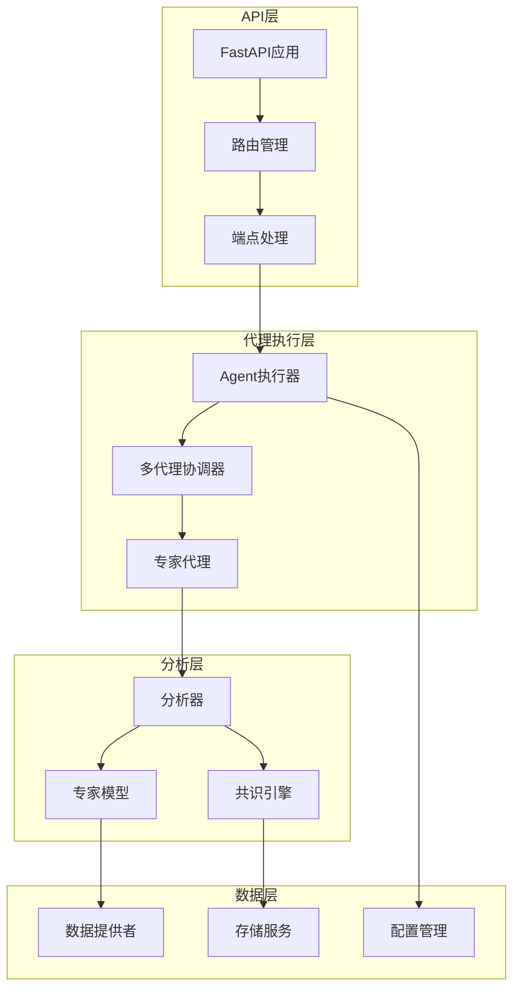
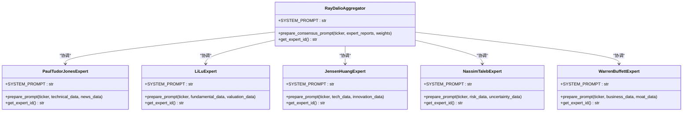
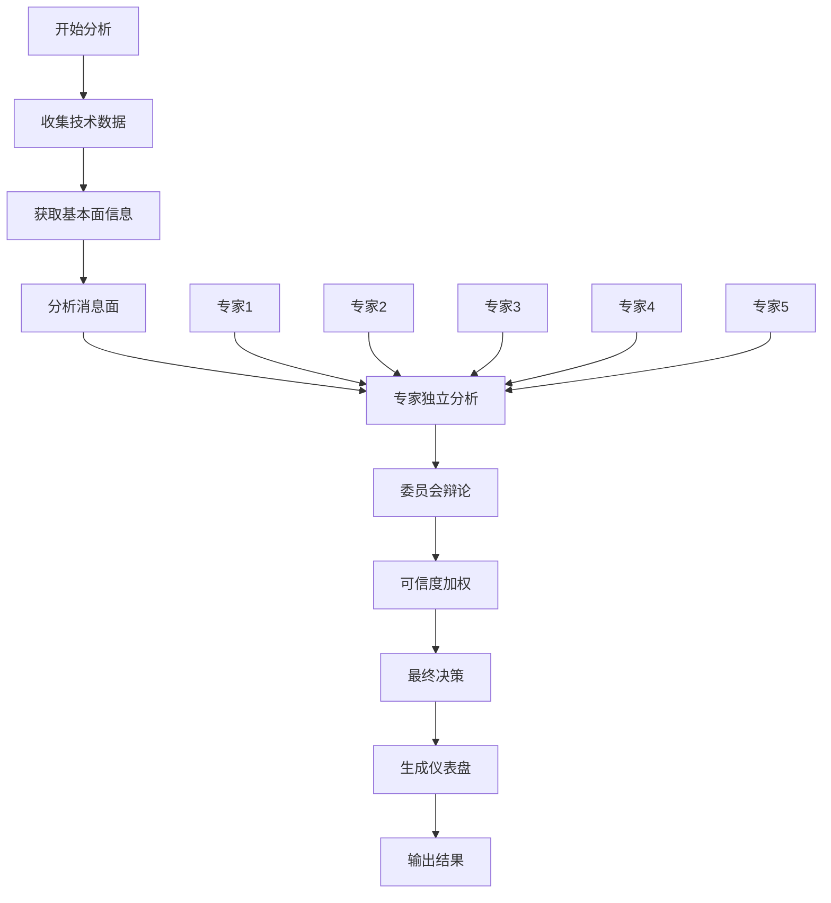
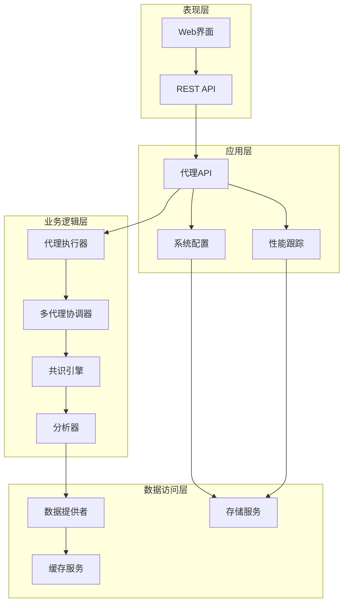
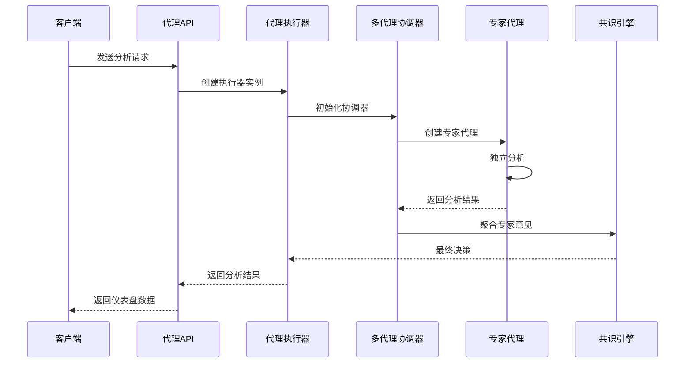
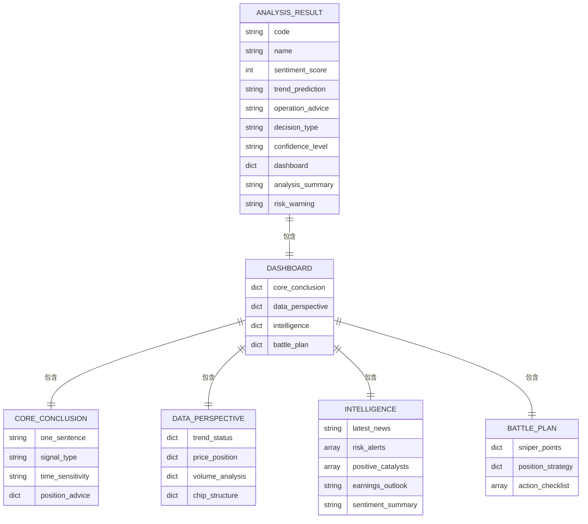
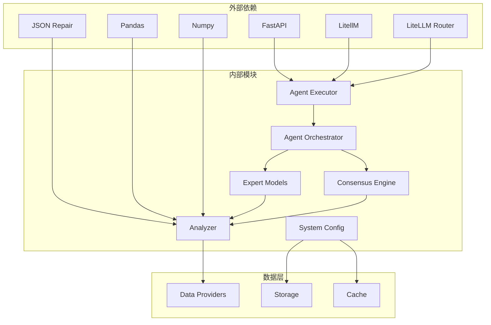

# 专家委员会系统

<cite>
**本文档引用的文件**
- [README.md](file://README.md)
- [api/app.py](file://api/app.py)
- [api/v1/router.py](file://api/v1/router.py)
- [api/v1/endpoints/agent.py](file://api/v1/endpoints/agent.py)
- [src/agent/orchestrator.py](file://src/agent/orchestrator.py)
- [src/agent/executor.py](file://src/agent/executor.py)
- [src/agents/experts/paul_tudor_jones.py](file://src/agents/experts/paul_tudor_jones.py)
- [src/agents/experts/li_lu.py](file://src/agents/experts/li_lu.py)
- [src/agents/experts/jensen_huang.py](file://src/agents/experts/jensen_huang.py)
- [src/agents/experts/nassim_taleb.py](file://src/agents/experts/nassim_taleb.py)
- [src/agents/experts/warren_buffett.py](file://src/agents/experts/warren_buffett.py)
- [src/agents/consensus_engine.py](file://src/agents/consensus_engine.py)
- [src/analyzer.py](file://src/analyzer.py)
- [src/core/market_strategy.py](file://src/core/market_strategy.py)
- [src/webui_frontend.py](file://src/webui_frontend.py)
- [server.py](file://server.py)
- [pyproject.toml](file://pyproject.toml)
</cite>

## 目录
1. [简介](#简介)
2. [项目结构](#项目结构)
3. [核心组件](#核心组件)
4. [架构概览](#架构概览)
5. [详细组件分析](#详细组件分析)
6. [依赖关系分析](#依赖关系分析)
7. [性能考虑](#性能考虑)
8. [故障排除指南](#故障排除指南)
9. [结论](#结论)

## 简介

专家委员会系统是一个基于人工智能的股票智能分析平台，集成了多位顶级投资专家的智慧，为用户提供全面、客观的投资决策支持。该系统通过模拟投资委员会的形式，让不同的专家从各自的专业角度对股票进行分析，最终由委员会主席进行综合裁决。

### 主要特性

- **多专家协作**：集成巴菲特、李录、琼斯、黄仁勋、塔勒布五位顶级专家的分析能力
- **委员会决策机制**：通过可信度加权的方式实现专家间的辩论与最终裁决
- **AI驱动分析**：基于决策仪表盘的结构化分析报告
- **多市场支持**：支持A股、港股、美股等多个市场的股票分析
- **实时数据整合**：整合技术面、基本面、消息面等多维度数据

## 项目结构



**图表来源**
- [api/app.py:1-209](file://api/app.py#L1-L209)
- [api/v1/router.py:1-72](file://api/v1/router.py#L1-L72)
- [src/agent/orchestrator.py:1-800](file://src/agent/orchestrator.py#L1-L800)

**章节来源**
- [README.md:1-519](file://README.md#L1-L519)
- [api/app.py:1-209](file://api/app.py#L1-L209)
- [api/v1/router.py:1-72](file://api/v1/router.py#L1-L72)

## 核心组件

### 专家委员会架构

专家委员会系统的核心在于模拟真实的投资委员会运作机制，通过五个专业领域的专家共同参与分析决策：



**图表来源**
- [src/agents/consensus_engine.py:1-84](file://src/agents/consensus_engine.py#L1-L84)
- [src/agents/experts/paul_tudor_jones.py:1-47](file://src/agents/experts/paul_tudor_jones.py#L1-L47)
- [src/agents/experts/li_lu.py:1-47](file://src/agents/experts/li_lu.py#L1-L47)
- [src/agents/experts/jensen_huang.py:1-47](file://src/agents/experts/jensen_huang.py#L1-L47)
- [src/agents/experts/nassim_taleb.py:1-47](file://src/agents/experts/nassim_taleb.py#L1-L47)
- [src/agents/experts/warren_buffett.py:1-47](file://src/agents/experts/warren_buffett.py#L1-L47)

### 决策仪表盘系统

系统采用结构化的决策仪表盘格式，确保分析结果的标准化和可比较性：



**图表来源**
- [src/analyzer.py:562-800](file://src/analyzer.py#L562-L800)
- [src/agent/orchestrator.py:357-578](file://src/agent/orchestrator.py#L357-L578)

**章节来源**
- [src/agents/consensus_engine.py:1-84](file://src/agents/consensus_engine.py#L1-L84)
- [src/agents/experts/paul_tudor_jones.py:1-47](file://src/agents/experts/paul_tudor_jones.py#L1-L47)
- [src/agents/experts/li_lu.py:1-47](file://src/agents/experts/li_lu.py#L1-L47)
- [src/agents/experts/jensen_huang.py:1-47](file://src/agents/experts/jensen_huang.py#L1-L47)
- [src/agents/experts/nassim_taleb.py:1-47](file://src/agents/experts/nassim_taleb.py#L1-L47)
- [src/agents/experts/warren_buffett.py:1-47](file://src/agents/experts/warren_buffett.py#L1-L47)

## 架构概览

专家委员会系统采用分层架构设计，确保各个组件的职责清晰分离：



**图表来源**
- [api/app.py:48-204](file://api/app.py#L48-L204)
- [api/v1/router.py:16-71](file://api/v1/router.py#L16-L71)
- [src/agent/orchestrator.py:73-101](file://src/agent/orchestrator.py#L73-L101)
- [src/agent/executor.py:428-454](file://src/agent/executor.py#L428-L454)

**章节来源**
- [api/app.py:1-209](file://api/app.py#L1-L209)
- [api/v1/router.py:1-72](file://api/v1/router.py#L1-L72)
- [src/agent/orchestrator.py:1-800](file://src/agent/orchestrator.py#L1-L800)
- [src/agent/executor.py:1-659](file://src/agent/executor.py#L1-L659)

## 详细组件分析

### 代理执行器

代理执行器是整个系统的核心协调组件，负责管理代理的生命周期和执行流程：



**图表来源**
- [src/agent/executor.py:455-498](file://src/agent/executor.py#L455-L498)
- [src/agent/orchestrator.py:275-296](file://src/agent/orchestrator.py#L275-L296)
- [api/v1/endpoints/agent.py:171-213](file://api/v1/endpoints/agent.py#L171-L213)

### 专家分析流程

每个专家都有其独特的分析方法和专业领域：

| 专家 | 专业领域 | 分析重点 | 权重分配 |
|------|----------|----------|----------|
| 巴菲特 | 价值投资 | 企业基本面、护城河、管理层 | 20% |
| 李录 | 价值投资 | 中国股市、长期投资 | 15% |
| 琼斯 | 技术分析 | 趋势、动量、技术指标 | 25% |
| 黄仁勋 | 科技创新 | 半导体、AI、技术趋势 | 20% |
| 塔勒布 | 风险管理 | 尾部风险、不确定性 | 20% |

**章节来源**
- [src/agents/experts/paul_tudor_jones.py:1-47](file://src/agents/experts/paul_tudor_jones.py#L1-L47)
- [src/agents/experts/li_lu.py:1-47](file://src/agents/experts/li_lu.py#L1-L47)
- [src/agents/experts/jensen_huang.py:1-47](file://src/agents/experts/jensen_huang.py#L1-L47)
- [src/agents/experts/nassim_taleb.py:1-47](file://src/agents/experts/nassim_taleb.py#L1-L47)
- [src/agents/experts/warren_buffett.py:1-47](file://src/agents/experts/warren_buffett.py#L1-L47)

### 决策仪表盘结构

系统采用标准化的决策仪表盘格式，确保分析结果的一致性和可读性：



**图表来源**
- [src/analyzer.py:344-501](file://src/analyzer.py#L344-L501)

**章节来源**
- [src/analyzer.py:344-800](file://src/analyzer.py#L344-L800)

### API接口设计

系统提供RESTful API接口，支持多种分析模式和数据查询：

```mermaid
graph LR
subgraph "代理相关接口"
A[/api/v1/agent/chat] --> B[聊天对话]
C[/api/v1/agent/research] --> D[深度研究]
E[/api/v1/agent/skills] --> F[技能列表]
G[/api/v1/agent/models] --> H[模型部署]
end
subgraph "专家相关接口"
I[/api/v1/agent/experts/performance] --> J[专家战绩]
end
subgraph "会话管理"
K[/api/v1/agent/chat/sessions] --> L[会话列表]
M[/api/v1/agent/chat/sessions/{id}] --> N[会话详情]
O[/api/v1/agent/chat/sessions/{id}] --> P[删除会话]
end
```

**图表来源**
- [api/v1/router.py:25-71](file://api/v1/router.py#L25-L71)
- [api/v1/endpoints/agent.py:171-294](file://api/v1/endpoints/agent.py#L171-L294)

**章节来源**
- [api/v1/router.py:1-72](file://api/v1/router.py#L1-L72)
- [api/v1/endpoints/agent.py:1-490](file://api/v1/endpoints/agent.py#L1-L490)

## 依赖关系分析

系统采用模块化设计，各组件之间通过清晰的接口进行通信：



**图表来源**
- [pyproject.toml:1-81](file://pyproject.toml#L1-L81)
- [src/agent/executor.py:22-26](file://src/agent/executor.py#L22-L26)
- [src/analyzer.py:32-58](file://src/analyzer.py#L32-L58)

**章节来源**
- [pyproject.toml:1-81](file://pyproject.toml#L1-L81)
- [src/agent/executor.py:1-659](file://src/agent/executor.py#L1-L659)
- [src/analyzer.py:1-800](file://src/analyzer.py#L1-L800)

## 性能考虑

系统在设计时充分考虑了性能优化和资源管理：

### 并发处理
- 支持多代理并行执行
- 异步任务队列管理
- 连接池优化数据库连接

### 缓存策略
- 专家模型结果缓存
- 频繁查询数据缓存
- 前端静态资源缓存

### 资源限制
- 代理执行超时控制
- 工具调用频率限制
- 内存使用监控

## 故障排除指南

### 常见问题及解决方案

| 问题类型 | 症状 | 可能原因 | 解决方案 |
|----------|------|----------|----------|
| 代理执行失败 | 分析超时或错误 | LLM API限制、网络问题 | 检查API密钥、网络连接、重试机制 |
| 专家模型不可用 | 专家分析返回空结果 | 模型配置错误、参数不匹配 | 验证模型配置、检查专家提示词 |
| 数据获取失败 | 技术指标或基本面数据缺失 | 数据源不可用、API限制 | 切换数据源、调整请求频率 |
| 性能问题 | 响应时间过长 | 资源不足、并发过高 | 增加资源、优化查询、启用缓存 |

### 调试工具

系统提供了丰富的调试和监控工具：

- **性能跟踪**：记录代理执行时间和资源使用情况
- **错误日志**：详细的错误堆栈和上下文信息
- **API监控**：接口调用统计和响应时间分析
- **配置验证**：实时配置变更验证和回滚机制

**章节来源**
- [src/agent/orchestrator.py:400-443](file://src/agent/orchestrator.py#L400-L443)
- [src/agent/executor.py:591-633](file://src/agent/executor.py#L591-L633)

## 结论

专家委员会系统通过模拟真实的投资委员会运作，成功地将多位顶级专家的智慧整合到一个统一的分析平台上。该系统不仅提供了全面的技术分析能力，更重要的是通过专家间的辩论和最终裁决，为用户提供了更加客观和平衡的投资决策支持。

### 系统优势

1. **多元化视角**：涵盖技术分析、基本面分析、风险管理等多个维度
2. **可信度加权**：基于历史表现的权重分配，提高决策质量
3. **标准化输出**：统一的决策仪表盘格式，便于比较和追踪
4. **可扩展性**：模块化设计支持新专家和新功能的添加
5. **性能优化**：多层缓存和异步处理确保系统响应速度

### 未来发展

系统在未来的发展中可以进一步增强以下方面：

- **机器学习集成**：利用历史数据分析优化专家权重
- **实时数据流**：支持更频繁的数据更新和分析
- **个性化定制**：根据不同用户的风险偏好调整分析参数
- **移动端支持**：提供移动应用以支持随时随地的分析需求

通过持续的优化和改进，专家委员会系统将成为投资者不可或缺的智能决策助手。