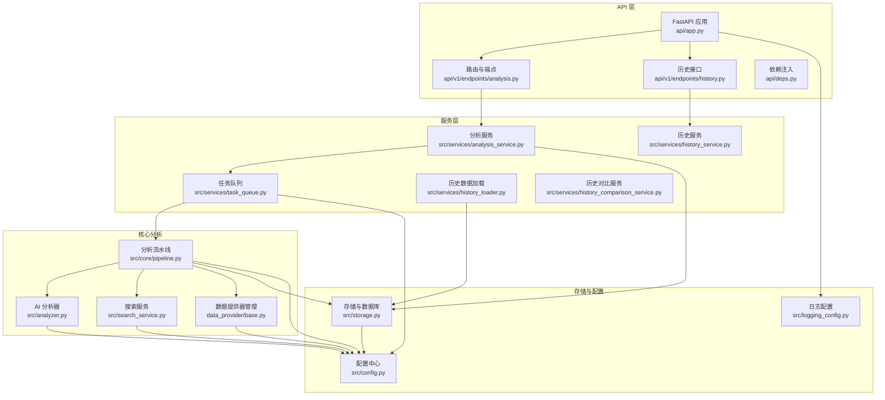
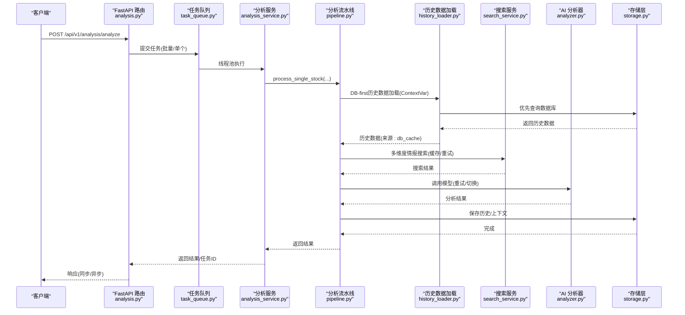
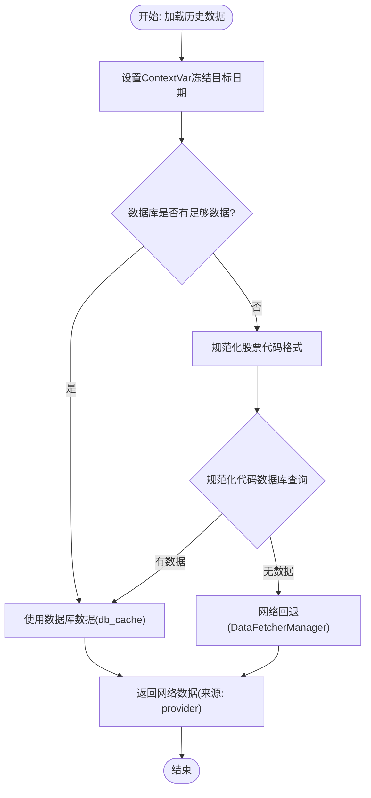
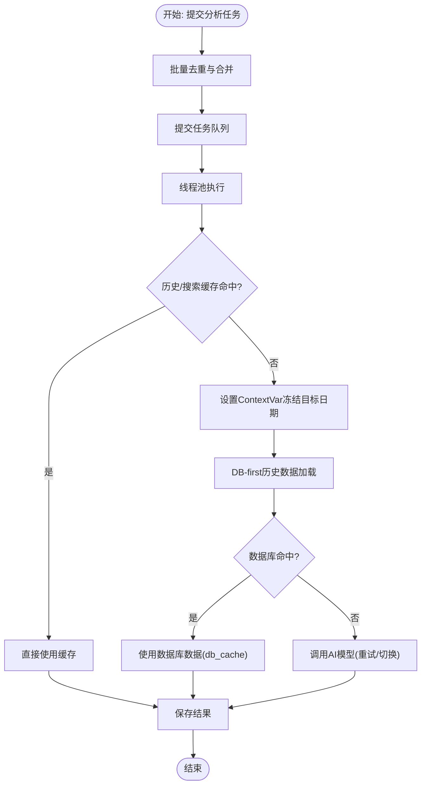
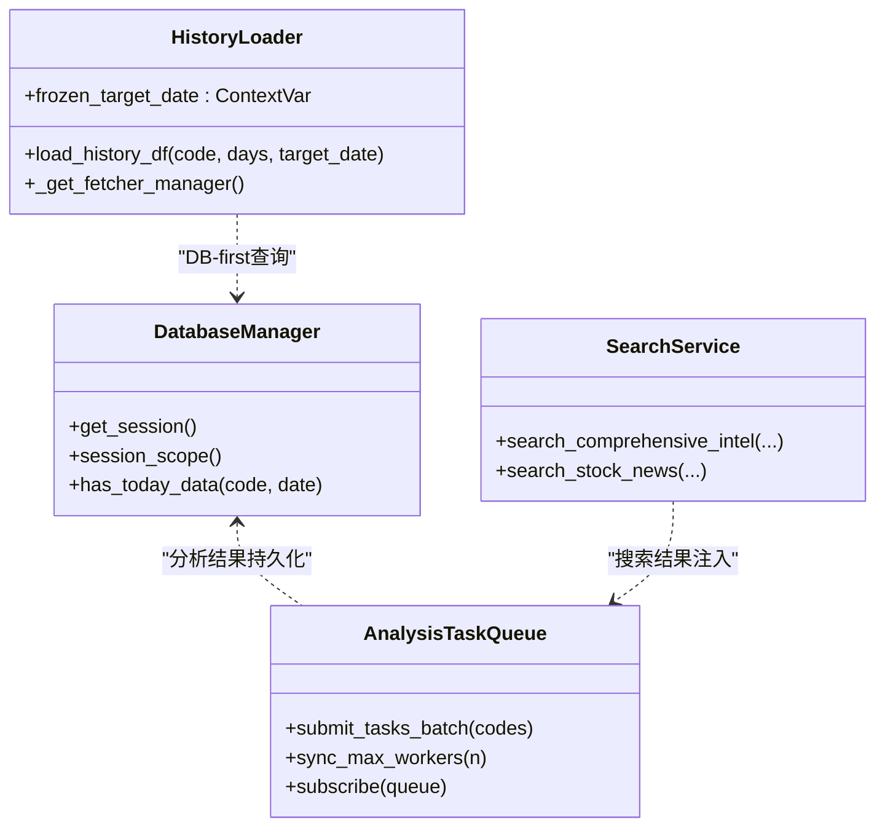
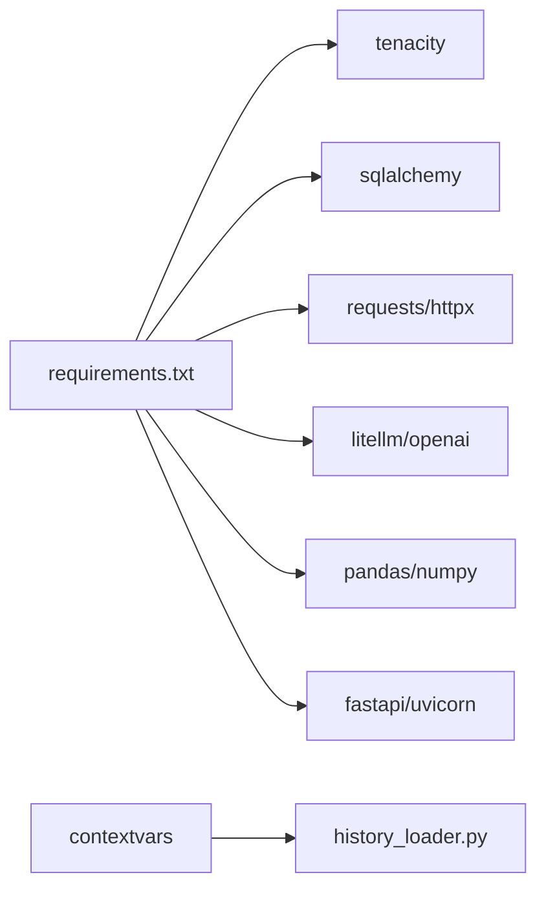

# 性能优化

<cite>
**本文引用的文件**
- [src/config.py](file://src/config.py)
- [api/app.py](file://api/app.py)
- [api/deps.py](file://api/deps.py)
- [api/v1/endpoints/analysis.py](file://api/v1/endpoints/analysis.py)
- [api/v1/endpoints/history.py](file://api/v1/endpoints/history.py)
- [src/services/analysis_service.py](file://src/services/analysis_service.py)
- [src/services/history_loader.py](file://src/services/history_loader.py)
- [src/services/history_service.py](file://src/services/history_service.py)
- [src/services/history_comparison_service.py](file://src/services/history_comparison_service.py)
- [src/services/task_queue.py](file://src/services/task_queue.py)
- [src/core/pipeline.py](file://src/core/pipeline.py)
- [src/analyzer.py](file://src/analyzer.py)
- [src/agent/tools/analysis_tools.py](file://src/agent/tools/analysis_tools.py)
- [src/search_service.py](file://src/search_service.py)
- [data_provider/base.py](file://data_provider/base.py)
- [src/storage.py](file://src/storage.py)
- [src/enums.py](file://src/enums.py)
- [src/logging_config.py](file://src/logging_config.py)
- [requirements.txt](file://requirements.txt)
</cite>

## 更新摘要
**变更内容**
- 新增历史数据加载服务的性能优化策略章节
- 更新AI模型调用优化部分，增加ContextVar机制
- 新增DB-first方法和网络回退机制的详细说明
- 更新性能监控与指标采集，增加历史数据加载统计

## 目录
1. [简介](#简介)
2. [项目结构](#项目结构)
3. [核心组件](#核心组件)
4. [架构总览](#架构总览)
5. [详细组件分析](#详细组件分析)
6. [依赖分析](#依赖分析)
7. [性能考量](#性能考量)
8. [故障排查指南](#故障排查指南)
9. [结论](#结论)
10. [附录](#附录)

## 简介
本文件面向AI分析引擎的性能优化，围绕以下主题展开：AI模型调用的请求合并与批量处理、缓存机制；API调用的连接池与超时控制、并发控制；内存与资源管理；网络请求优化（代理、SSL、DNS）；性能监控与指标采集；成本控制（调用次数、模型选择、资源使用）；以及开发者识别与解决性能瓶颈的方法论。

**更新** 新增历史数据加载服务的性能优化策略，包括DB-first方法、ContextVar机制、网络回退机制等，显著减少HTTP请求和提升分析可靠性。

## 项目结构
系统采用分层架构：Web API 层（FastAPI）、服务层（分析服务、任务队列、历史数据服务）、核心分析流水线（数据获取、趋势分析、AI分析、通知）、数据提供层（多数据源策略与自动切换）、存储层（SQLite + SQLAlchemy 连接池）、搜索服务（多搜索引擎 + 缓存）。

**图表来源**
- [api/app.py:48-204](file://api/app.py#L48-L204)
- [api/v1/endpoints/analysis.py:65-694](file://api/v1/endpoints/analysis.py#L65-L694)
- [api/v1/endpoints/history.py:1-462](file://api/v1/endpoints/history.py#L1-L462)
- [src/services/analysis_service.py:29-171](file://src/services/analysis_service.py#L29-L171)
- [src/services/history_loader.py:1-115](file://src/services/history_loader.py#L1-L115)
- [src/services/history_service.py:1-919](file://src/services/history_service.py#L1-L919)
- [src/services/history_comparison_service.py:1-97](file://src/services/history_comparison_service.py#L1-L97)
- [src/services/task_queue.py:108-666](file://src/services/task_queue.py#L108-L666)
- [src/core/pipeline.py:48-800](file://src/core/pipeline.py#L48-L800)
- [src/analyzer.py:334-800](file://src/analyzer.py#L334-L800)
- [src/search_service.py:1-800](file://src/search_service.py#L1-L800)
- [data_provider/base.py:464-800](file://data_provider/base.py#L464-L800)
- [src/storage.py:623-746](file://src/storage.py#L623-L746)
- [src/config.py:31-580](file://src/config.py#L31-L580)
- [src/logging_config.py:52-156](file://src/logging_config.py#L52-L156)

**章节来源**
- [api/app.py:48-204](file://api/app.py#L48-L204)
- [api/v1/endpoints/analysis.py:65-694](file://api/v1/endpoints/analysis.py#L65-L694)
- [api/v1/endpoints/history.py:1-462](file://api/v1/endpoints/history.py#L1-L462)
- [src/services/analysis_service.py:29-171](file://src/services/analysis_service.py#L29-L171)
- [src/services/history_loader.py:1-115](file://src/services/history_loader.py#L1-L115)
- [src/services/history_service.py:1-919](file://src/services/history_service.py#L1-L919)
- [src/services/history_comparison_service.py:1-97](file://src/services/history_comparison_service.py#L1-L97)
- [src/services/task_queue.py:108-666](file://src/services/task_queue.py#L108-L666)
- [src/core/pipeline.py:48-800](file://src/core/pipeline.py#L48-L800)
- [src/analyzer.py:334-800](file://src/analyzer.py#L334-L800)
- [src/search_service.py:1-800](file://src/search_service.py#L1-L800)
- [data_provider/base.py:464-800](file://data_provider/base.py#L464-L800)
- [src/storage.py:623-746](file://src/storage.py#L623-L746)
- [src/config.py:31-580](file://src/config.py#L31-L580)
- [src/logging_config.py:52-156](file://src/logging_config.py#L52-L156)

## 核心组件
- 配置中心：集中管理AI模型、API Key、并发、代理、缓存、限流等参数，支持从 .env 动态加载与校验。
- API 层：提供分析触发、任务状态查询、SSE 实时流，内置CORS与认证中间件。
- 任务队列：线程池并发执行分析任务，防重复提交，SSE 广播状态变更，内存中维护有限历史。
- 分析流水线：统一协调数据获取、趋势分析、新闻情报、AI分析、结果持久化。
- AI 分析器：封装 Gemini/OpenAI 兼容调用，指数退避重试、模型切换、代理与自定义端点支持。
- 搜索服务：多搜索引擎（Bocha/Tavily/Brave/SerpAPI）负载均衡与故障转移，结果缓存与正文抓取。
- 数据提供器：策略模式管理多数据源，自动故障切换与随机抖动防封禁。
- 存储层：SQLite + SQLAlchemy 连接池，事务封装，断点续传与历史数据管理。
- **历史数据加载服务**：DB-first方法、ContextVar机制、网络回退机制，显著减少HTTP请求。

**更新** 新增历史数据加载服务，采用DB-first方法和ContextVar机制，通过网络回退机制提升分析可靠性。

**章节来源**
- [src/config.py:31-580](file://src/config.py#L31-L580)
- [api/app.py:48-204](file://api/app.py#L48-L204)
- [src/services/task_queue.py:108-666](file://src/services/task_queue.py#L108-L666)
- [src/core/pipeline.py:48-800](file://src/core/pipeline.py#L48-L800)
- [src/analyzer.py:334-800](file://src/analyzer.py#L334-L800)
- [src/search_service.py:1-800](file://src/search_service.py#L1-L800)
- [data_provider/base.py:464-800](file://data_provider/base.py#L464-L800)
- [src/storage.py:623-746](file://src/storage.py#L623-L746)
- [src/services/history_loader.py:1-115](file://src/services/history_loader.py#L1-L115)

## 架构总览
AI分析引擎的性能优化贯穿请求链路：API 层负责并发与限流；服务层与任务队列负责请求合并与批量执行；流水线层整合数据与AI调用；存储层提供断点续传与历史复用；搜索层提供缓存与多源负载均衡；配置中心统一参数与代理设置；**历史数据加载服务提供DB-first优化策略**。

**图表来源**
- [api/v1/endpoints/analysis.py:68-301](file://api/v1/endpoints/analysis.py#L68-L301)
- [src/services/task_queue.py:260-533](file://src/services/task_queue.py#L260-L533)
- [src/services/analysis_service.py:40-105](file://src/services/analysis_service.py#L40-L105)
- [src/core/pipeline.py:183-429](file://src/core/pipeline.py#L183-L429)
- [src/services/history_loader.py:62-115](file://src/services/history_loader.py#L62-L115)
- [src/search_service.py:208-254](file://src/search_service.py#L208-L254)
- [src/analyzer.py:788-800](file://src/analyzer.py#L788-L800)
- [src/storage.py:747-777](file://src/storage.py#L747-L777)

## 详细组件分析

### 历史数据加载服务优化：DB-first方法与ContextVar机制
- **DB-first方法**
  - 历史数据加载采用DB-first策略，优先从数据库获取历史K线数据，只有在数据库无足够数据时才回退到网络数据源。
  - 支持两种股票代码格式：规范化的股票代码和带前缀的股票代码，自动进行回退查找。
  - 数据完整性检查：要求数据库返回至少30%的有效数据点才能满足分析需求。
- **ContextVar机制**
  - 使用Python的ContextVar在多线程环境中传播冻结的目标日期，确保同一批分析使用统一的参考日期。
  - 在Agent模式下，通过`set_frozen_target_date`设置目标日期，`get_frozen_target_date`在各个工具线程中获取。
  - 支持线程安全的ContextVar生命周期管理，通过token机制进行重置。
- **网络回退机制**
  - 当数据库查询失败或无足够数据时，自动回退到DataFetcherManager网络数据源。
  - 回退过程中保持原有的股票代码格式，避免重复转换造成的性能损耗。
  - 提供优雅的失败处理，当双路径都失败时返回None和"none"标识。

**图表来源**
- [src/services/history_loader.py:25-40](file://src/services/history_loader.py#L25-L40)
- [src/services/history_loader.py:62-115](file://src/services/history_loader.py#L62-L115)
- [src/core/pipeline.py:1235-1284](file://src/core/pipeline.py#L1235-L1284)

**章节来源**
- [src/services/history_loader.py:1-115](file://src/services/history_loader.py#L1-L115)
- [src/core/pipeline.py:1235-1284](file://src/core/pipeline.py#L1235-L1284)
- [src/agent/tools/analysis_tools.py:17-22](file://src/agent/tools/analysis_tools.py#L17-L22)

### AI模型调用优化：请求合并、批量处理与缓存
- 请求合并与批量处理
  - API 层支持批量分析请求，统一去重与提交至任务队列，避免重复任务与并发冲突。
  - 任务队列使用线程池并发执行，最大并发由配置决定，支持动态调整。
- 缓存机制
  - 搜索服务具备结果缓存（内存缓存 + TTL），命中即返回，降低重复搜索成本。
  - 数据提供器对基本面数据进行缓存与裁剪，避免高预算请求污染低预算场景。
  - 分析流水线对历史数据采用断点续传（has_today_data），避免重复网络请求。
  - **历史数据加载服务**采用DB-first策略，显著减少HTTP请求次数。
- 模型调用优化
  - AI 分析器支持 Gemini 与 OpenAI 兼容模型，自动重试与指数退避，失败后切换备选模型。
  - 支持自定义 Gemini 端点（代理访问），并兼容 OpenAI 格式参数与不同SDK版本差异。
  - 配置中心提供请求间隔、最大重试次数、重试基础延时等参数，缓解限流与抖动。

**图表来源**
- [api/v1/endpoints/analysis.py:161-232](file://api/v1/endpoints/analysis.py#L161-L232)
- [src/services/task_queue.py:296-361](file://src/services/task_queue.py#L296-L361)
- [src/services/history_loader.py:62-115](file://src/services/history_loader.py#L62-L115)
- [src/search_service.py:1727-1755](file://src/search_service.py#L1727-L1755)
- [data_provider/base.py:572-610](file://data_provider/base.py#L572-L610)
- [src/core/pipeline.py:128-182](file://src/core/pipeline.py#L128-L182)
- [src/analyzer.py:788-800](file://src/analyzer.py#L788-L800)

**章节来源**
- [api/v1/endpoints/analysis.py:161-232](file://api/v1/endpoints/analysis.py#L161-L232)
- [src/services/task_queue.py:131-231](file://src/services/task_queue.py#L131-L231)
- [src/services/history_loader.py:1-115](file://src/services/history_loader.py#L1-L115)
- [src/search_service.py:1727-1755](file://src/search_service.py#L1727-L1755)
- [data_provider/base.py:572-610](file://data_provider/base.py#L572-L610)
- [src/core/pipeline.py:128-182](file://src/core/pipeline.py#L128-L182)
- [src/analyzer.py:788-800](file://src/analyzer.py#L788-L800)

### API调用优化：连接池、超时与并发控制
- 连接池与超时
  - 存储层使用 SQLAlchemy 创建引擎并启用 pool_pre_ping，保证连接健康，避免僵尸连接。
  - 搜索服务对瞬时网络错误（SSL/连接/超时/编码错误）进行重试，GET/POST 均有指数退避。
  - **历史数据加载服务**使用Singleton模式管理DataFetcherManager，避免重复创建带来的性能损耗。
- 并发控制
  - 任务队列最大并发由配置决定，支持运行时同步调整；繁忙时延迟应用新并发设置。
  - API 层使用线程池执行分析任务，避免阻塞请求；SSE 广播事件通过事件循环安全投递。
  - **ContextVar机制**确保多线程环境下的一致性，避免数据竞争。
- 防重复与幂等
  - 任务队列对同一股票分析进行防重复提交，返回明确错误码与现有任务ID。

**图表来源**
- [src/storage.py:623-746](file://src/storage.py#L623-L746)
- [src/services/task_queue.py:131-231](file://src/services/task_queue.py#L131-L231)
- [src/services/history_loader.py:25-56](file://src/services/history_loader.py#L25-L56)
- [src/search_service.py:1-800](file://src/search_service.py#L1-L800)

**章节来源**
- [src/storage.py:623-746](file://src/storage.py#L623-L746)
- [src/services/task_queue.py:131-231](file://src/services/task_queue.py#L131-L231)
- [src/services/history_loader.py:1-115](file://src/services/history_loader.py#L1-L115)
- [src/search_service.py:52-75](file://src/search_service.py#L52-L75)

### 内存管理与资源释放：模型实例、临时对象与GC
- 线程池与资源释放
  - 任务队列使用线程池执行分析，异常时取消Future并回滚已创建任务，避免半提交状态。
  - 存储层在进程退出时注册清理钩子，dispose 引擎释放连接池资源。
  - **历史数据加载服务**使用Lock保护Singleton实例创建，避免竞态条件。
- 临时对象与上下文
  - 分析流水线在增强上下文时移除 None 值，减少上下文体积；对实时行情与趋势分析结果进行必要字段提取。
  - 搜索服务对网页正文抓取设置超时与长度限制，避免过大文本占用内存。
  - **ContextVar机制**提供线程安全的上下文传递，避免全局变量的竞争访问。
- GC 与缓存
  - 搜索与基本面缓存具备 TTL 与容量裁剪，定期清理过期条目，防止内存膨胀。
  - **历史数据加载服务**的DB-first策略减少网络数据的内存占用。

**章节来源**
- [src/services/task_queue.py:363-373](file://src/services/task_queue.py#L363-L373)
- [src/storage.py:696-712](file://src/storage.py#L696-L712)
- [src/core/pipeline.py:431-593](file://src/core/pipeline.py#L431-L593)
- [src/search_service.py:77-104](file://src/search_service.py#L77-L104)
- [data_provider/base.py:585-610](file://data_provider/base.py#L585-L610)
- [src/services/history_loader.py:45-56](file://src/services/history_loader.py#L45-L56)

### 网络请求优化：代理、SSL与DNS
- 代理与域名白名单
  - 配置中心在设置 HTTP/HTTPS 代理时，自动合并国内数据源域名至 NO_PROXY，避免行情获取失败。
- SSL 与超时
  - 搜索服务对瞬时 SSL/网络错误进行重试；请求超时参数可配置，正文抓取亦有超时限制。
  - **历史数据加载服务**在网络回退时使用DataFetcherManager的统一错误处理。
- DNS 与连接
  - 存储层启用 pool_pre_ping，提升连接稳定性；FastAPI 应用层通过中间件与静态托管优化请求处理。

**章节来源**
- [src/config.py:259-299](file://src/config.py#L259-L299)
- [src/search_service.py:52-75](file://src/search_service.py#L52-L75)
- [src/storage.py:657-662](file://src/storage.py#L657-L662)
- [api/app.py:78-106](file://api/app.py#L78-L106)

### 性能监控与指标采集
- 日志与可观测性
  - 统一日志格式与分级输出（控制台/常规日志/调试日志），降低第三方库噪声。
  - 分析流水线与搜索服务记录耗时、结果数量、错误类型，便于定位瓶颈。
  - **历史数据加载服务**记录DB命中率、网络回退次数、ContextVar使用情况。
- 指标建议
  - 响应时间：API 路由、任务队列执行、AI调用、搜索服务、**历史数据加载服务**。
  - 吞吐量：单位时间内完成的任务数、搜索请求数、AI调用次数、**历史数据加载请求数**。
  - 错误率：4xx/5xx、搜索失败率、AI限流/错误率、数据库写入失败率、**历史数据加载失败率**。
  - 缓存命中率：搜索缓存命中/过期/淘汰统计、**历史数据DB缓存命中率**。
  - 资源使用：CPU/内存/GC 次数、连接池活跃/空闲数、线程池排队长度、**ContextVar上下文数量**。

**章节来源**
- [src/logging_config.py:52-156](file://src/logging_config.py#L52-L156)
- [src/core/pipeline.py:310-347](file://src/core/pipeline.py#L310-L347)
- [src/search_service.py:208-254](file://src/search_service.py#L208-L254)
- [src/services/history_loader.py:97-114](file://src/services/history_loader.py#L97-L114)

### 成本控制：调用次数、模型选择与资源使用
- 调用次数限制
  - 搜索服务对瞬时网络错误重试，避免重复请求；任务队列防重复提交，减少无效调用。
  - **历史数据加载服务**通过DB-first策略显著减少HTTP请求次数，修复Issue #1066。
- 模型选择优化
  - 配置中心提供主备模型与温度参数，AI 分析器在限流或错误时自动切换模型。
- 资源使用监控
  - 任务队列与线程池并发数可动态调整；存储层连接池参数可调；搜索缓存容量与TTL可控。
  - **ContextVar机制**减少全局状态管理的资源消耗。

**章节来源**
- [src/search_service.py:52-75](file://src/search_service.py#L52-L75)
- [src/services/task_queue.py:184-231](file://src/services/task_queue.py#L184-L231)
- [src/analyzer.py:674-698](file://src/analyzer.py#L674-L698)
- [src/config.py:53-70](file://src/config.py#L53-L70)
- [src/services/history_loader.py:7-8](file://src/services/history_loader.py#L7-L8)

### 瓶颈识别与解决方案
- 常见瓶颈
  - 搜索服务慢：检查缓存命中率、搜索引擎配额、超时与重试策略。
  - AI 调用慢/限流：调整请求间隔、重试参数、模型切换策略、代理端点。
  - 数据源不稳定：启用自动故障切换与随机抖动；检查 NO_PROXY 配置。
  - 数据库写入慢：检查连接池参数、事务批量提交、索引与唯一约束。
  - **历史数据加载慢**：检查DB缓存命中率、ContextVar设置、网络回退频率。
- 诊断步骤
  - 启用调试日志，观察耗时与错误类型。
  - 使用任务队列统计与SSE事件流，定位卡顿阶段。
  - 对比缓存命中与未命中路径，评估缓存策略有效性。
  - 逐步提高并发，观察吞吐与错误率变化，找到最优并发点。
  - **监控历史数据加载服务的DB命中率和网络回退次数**。

**章节来源**
- [src/logging_config.py:52-156](file://src/logging_config.py#L52-L156)
- [src/services/task_queue.py:419-436](file://src/services/task_queue.py#L419-L436)
- [api/v1/endpoints/analysis.py:376-440](file://api/v1/endpoints/analysis.py#L376-L440)
- [src/services/history_loader.py:97-114](file://src/services/history_loader.py#L97-L114)

## 依赖分析
- 第三方依赖与性能相关的关键模块
  - tenacity：指数退避重试，用于网络与AI调用。
  - SQLAlchemy：连接池与事务管理，影响数据库性能。
  - requests/httpx：网络请求与代理支持，影响搜索与外部API。
  - litellm/openai：统一LLM客户端，支持多种模型与代理。
  - pandas/numpy：数据分析与指标计算，影响CPU与内存。
  - fastapi/uvicorn：Web框架与ASGI服务器，影响并发与延迟。
  - **contextvars**：线程安全的上下文传递，用于历史数据加载服务。

**图表来源**
- [requirements.txt:1-65](file://requirements.txt#L1-L65)

**章节来源**
- [requirements.txt:1-65](file://requirements.txt#L1-L65)

## 性能考量
- 并发与限流
  - 任务队列并发数与最大工作线程数需与硬件资源匹配；API 层避免阻塞操作，使用线程池执行耗时任务。
- 缓存策略
  - 搜索与基本面缓存结合 TTL 与容量裁剪，平衡命中率与内存占用。
  - **历史数据加载服务**采用DB-first策略，显著提升缓存命中率。
- 超时与重试
  - 合理设置请求超时与重试上限，避免雪崩效应；对瞬时错误进行指数退避。
- 数据源与代理
  - 通过 NO_PROXY 白名单避免国内数据源走代理；代理端点与自定义API基址提升可用性。
- 存储与索引
  - 使用连接池与 pre_ping；合理设计索引与唯一约束，避免重复写入与锁竞争。
- **ContextVar机制**
  - 在多线程环境中提供线程安全的上下文传递，避免全局状态竞争。
  - 减少不必要的全局变量访问，提升并发性能。

## 故障排查指南
- AI 调用失败/限流
  - 检查重试参数与模型切换日志；确认代理与自定义端点配置；核对API Key有效性。
- 搜索服务异常
  - 查看瞬时错误重试日志；确认搜索引擎配额与Key；检查超时与正文抓取限制。
- 数据库写入失败
  - 检查连接池状态与事务提交；核对唯一约束冲突；关注日志中的SQL异常。
- 任务队列堆积
  - 调整并发数；检查任务状态与SSE事件流；定位卡顿阶段。
- **历史数据加载失败**
  - 检查DB缓存命中率；确认ContextVar设置是否正确；验证网络回退机制。
  - 查看历史数据加载服务的日志，确认DB查询和网络回退的执行情况。

**章节来源**
- [src/analyzer.py:788-800](file://src/analyzer.py#L788-L800)
- [src/search_service.py:52-75](file://src/search_service.py#L52-L75)
- [src/storage.py:657-662](file://src/storage.py#L657-L662)
- [src/services/task_queue.py:419-436](file://src/services/task_queue.py#L419-L436)
- [src/services/history_loader.py:97-114](file://src/services/history_loader.py#L97-L114)

## 结论
通过在API层进行请求合并与批量处理、在任务队列中实施并发控制与防重复提交、在分析流水线中引入缓存与断点续传、在网络层优化代理与超时、在存储层启用连接池与事务管理、在配置中心统一参数与可观测性，以及**在历史数据加载服务中采用DB-first方法、ContextVar机制和网络回退机制**，AI分析引擎可在保证稳定性的同时显著提升性能与成本效率。历史数据加载服务的优化策略显著减少了HTTP请求次数，提升了分析可靠性，特别是在Agent模式下表现尤为突出。建议持续监控关键指标，迭代优化缓存与并发策略，以适配业务增长与外部环境变化。

## 附录
- 关键配置项（节选）
  - AI模型与限流：gemini_*、openai_*、gemini_max_retries、gemini_retry_delay、gemini_request_delay
  - 并发与代理：max_workers、http_proxy、https_proxy、NO_PROXY
  - 缓存与断点续传：realtime_cache_ttl、save_context_snapshot、has_today_data
  - 搜索缓存：search_service 缓存TTL与容量裁剪
  - **历史数据加载**：DB-first策略、ContextVar冻结目标日期、网络回退机制
- 建议的监控指标
  - 响应时间（API/任务队列/搜索/AI/历史数据加载）
  - 吞吐量（任务/搜索/调用/历史数据加载）
  - 错误率（4xx/5xx/限流/失败/历史数据加载失败）
  - 缓存命中率与淘汰率（搜索缓存/历史数据DB缓存）
  - 资源使用（CPU/内存/连接池/线程池/ContextVar上下文）
  - **历史数据加载统计**：DB命中率、网络回退次数、ContextVar使用情况

**章节来源**
- [src/config.py:53-70](file://src/config.py#L53-L70)
- [src/config.py:151-156](file://src/config.py#L151-L156)
- [src/config.py:426-436](file://src/config.py#L426-L436)
- [src/search_service.py:1727-1755](file://src/search_service.py#L1727-L1755)
- [src/services/history_loader.py:7-8](file://src/services/history_loader.py#L7-L8)