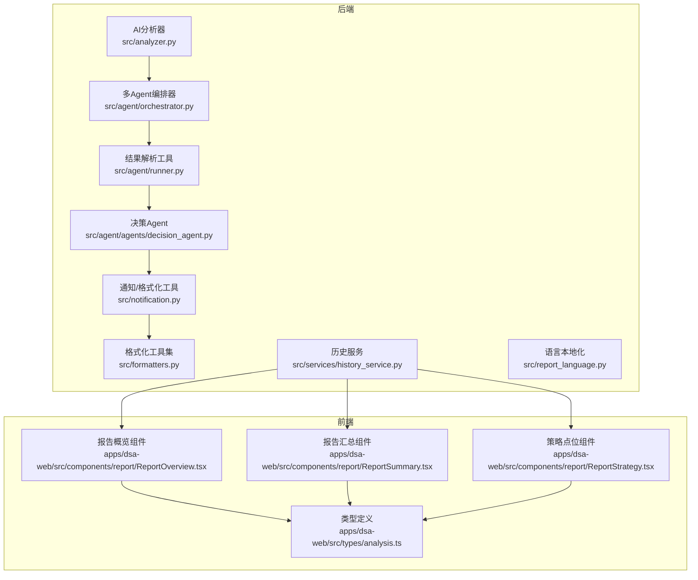
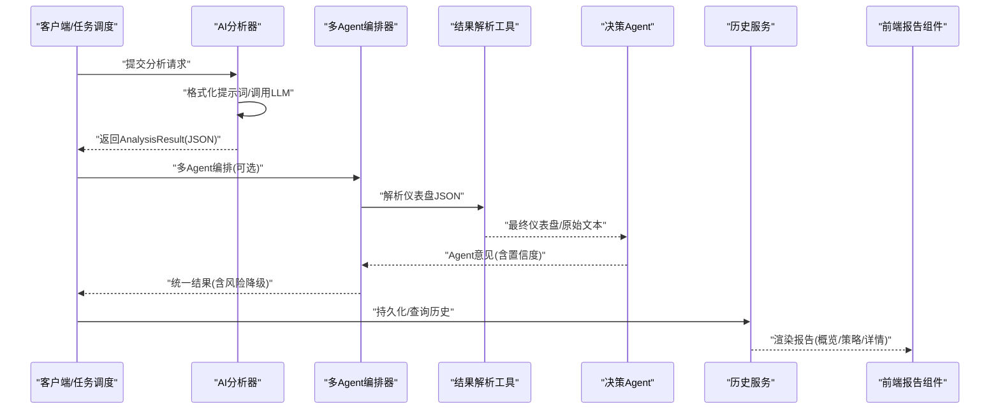
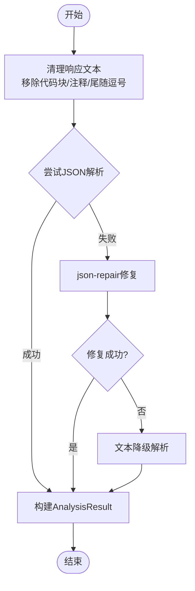
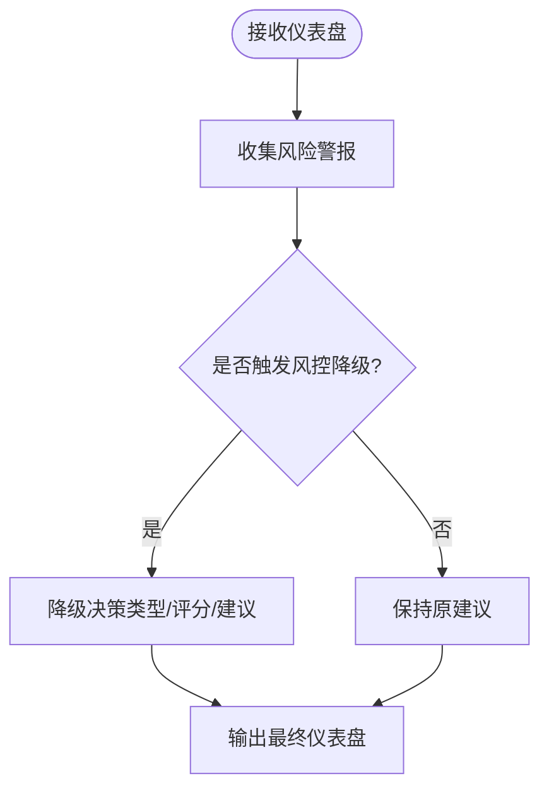
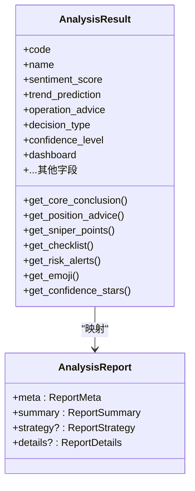
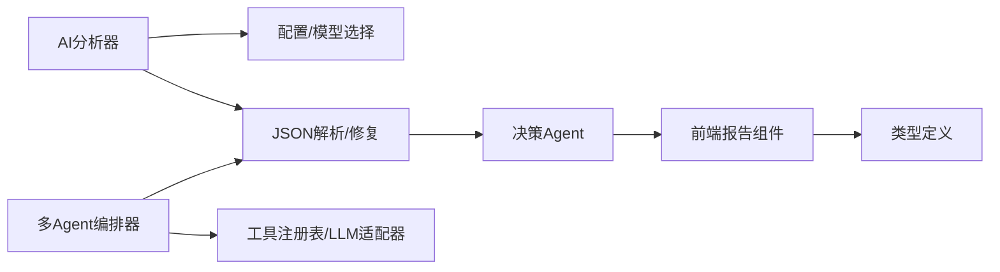

# 结果解释器

<cite>
**本文档引用的文件**
- [analyzer.py](file://src/analyzer.py)
- [orchestrator.py](file://src/agent/orchestrator.py)
- [runner.py](file://src/agent/runner.py)
- [decision_agent.py](file://src/agent/agents/decision_agent.py)
- [formatters.py](file://src/formatters.py)
- [notification.py](file://src/notification.py)
- [ReportOverview.tsx](file://apps/dsa-web/src/components/report/ReportOverview.tsx)
- [ReportSummary.tsx](file://apps/dsa-web/src/components/report/ReportSummary.tsx)
- [ReportStrategy.tsx](file://apps/dsa-web/src/components/report/ReportStrategy.tsx)
- [analysis.ts](file://apps/dsa-web/src/types/analysis.ts)
- [history_service.py](file://src/services/history_service.py)
- [report_language.py](file://src/report_language.py)
</cite>

## 目录
1. [简介](#简介)
2. [项目结构](#项目结构)
3. [核心组件](#核心组件)
4. [架构总览](#架构总览)
5. [详细组件分析](#详细组件分析)
6. [依赖分析](#依赖分析)
7. [性能考虑](#性能考虑)
8. [故障排除指南](#故障排除指南)
9. [结论](#结论)
10. [附录](#附录)

## 简介
本文件面向开发者与产品使用者，系统性阐述“AI分析结果解释器”的设计与实现，涵盖：
- AnalysisResult数据类的设计与字段语义
- 决策仪表盘结构与生成逻辑
- 结果格式化、JSON解析修复与数据清洗
- 置信度评估、风险提示与操作建议生成算法
- 业务规则与决策逻辑（评分区间策略）
- 结果可视化与用户界面集成
- 扩展点与解释规则定制指南

## 项目结构
围绕“结果解释器”的核心代码分布在后端Python与前端TypeScript两大侧：
- 后端：AI分析器、多Agent编排器、结果解析与格式化
- 前端：报告组件、类型定义与UI集成

图表来源
- [analyzer.py](file://src/analyzer.py)
- [orchestrator.py](file://src/agent/orchestrator.py)
- [runner.py](file://src/agent/runner.py)
- [decision_agent.py](file://src/agent/agents/decision_agent.py)
- [notification.py](file://src/notification.py)
- [formatters.py](file://src/formatters.py)
- [history_service.py](file://src/services/history_service.py)
- [ReportOverview.tsx](file://apps/dsa-web/src/components/report/ReportOverview.tsx)
- [ReportSummary.tsx](file://apps/dsa-web/src/components/report/ReportSummary.tsx)
- [ReportStrategy.tsx](file://apps/dsa-web/src/components/report/ReportStrategy.tsx)
- [analysis.ts](file://apps/dsa-web/src/types/analysis.ts)

章节来源
- [analyzer.py](file://src/analyzer.py)
- [orchestrator.py](file://src/agent/orchestrator.py)
- [runner.py](file://src/agent/runner.py)
- [decision_agent.py](file://src/agent/agents/decision_agent.py)
- [formatters.py](file://src/formatters.py)
- [notification.py](file://src/notification.py)
- [ReportOverview.tsx](file://apps/dsa-web/src/components/report/ReportOverview.tsx)
- [ReportSummary.tsx](file://apps/dsa-web/src/components/report/ReportSummary.tsx)
- [ReportStrategy.tsx](file://apps/dsa-web/src/components/report/ReportStrategy.tsx)
- [analysis.ts](file://apps/dsa-web/src/types/analysis.ts)
- [history_service.py](file://src/services/history_service.py)
- [report_language.py](file://src/report_language.py)

## 核心组件
- AnalysisResult数据类：封装决策仪表盘与分析摘要，提供核心指标、仪表盘模块访问器与可视化辅助方法。
- 决策仪表盘：包含核心结论、数据透视、舆情情报、作战计划四大模块，驱动置信度、风险提示与操作建议。
- AI分析器：负责调用LLM、格式化提示词、解析JSON、修复异常、构建市场快照。
- 多Agent编排器：协调技术、情报、风控、策略与决策Agent，合并意见、应用风险降级与降级标记。
- 前端报告组件：将AnalysisResult映射到UI，渲染概览、策略点位与详情。

章节来源
- [analyzer.py](file://src/analyzer.py)
- [orchestrator.py](file://src/agent/orchestrator.py)
- [decision_agent.py](file://src/agent/agents/decision_agent.py)
- [ReportOverview.tsx](file://apps/dsa-web/src/components/report/ReportOverview.tsx)
- [ReportStrategy.tsx](file://apps/dsa-web/src/components/report/ReportStrategy.tsx)
- [analysis.ts](file://apps/dsa-web/src/types/analysis.ts)

## 架构总览
AI分析流程从后端到前端的关键路径如下：

图表来源
- [analyzer.py](file://src/analyzer.py)
- [orchestrator.py](file://src/agent/orchestrator.py)
- [runner.py](file://src/agent/runner.py)
- [decision_agent.py](file://src/agent/agents/decision_agent.py)
- [history_service.py](file://src/services/history_service.py)
- [ReportSummary.tsx](file://apps/dsa-web/src/components/report/ReportSummary.tsx)

## 详细组件分析

### AnalysisResult数据类与字段语义
- 核心指标
  - sentiment_score：综合评分（0-100），用于情绪标签与置信度映射
  - trend_prediction：趋势预测（强烈看多/看多/震荡/看空/强烈看空）
  - operation_advice：操作建议（买入/加仓/持有/减仓/卖出/观望）
  - decision_type：决策类型（buy/hold/sell），用于统计与风控降级
  - confidence_level：置信度（高/中/低）
- 决策仪表盘
  - dashboard：包含core_conclusion、data_perspective、intelligence、battle_plan四大模块
- 走势与分析
  - trend_analysis、short_term_outlook、medium_term_outlook
- 技术面与基本面
  - technical_analysis、ma_analysis、volume_analysis、pattern_analysis
  - fundamental_analysis、sector_position、company_highlights
- 情绪与消息
  - news_summary、market_sentiment、hot_topics
- 元数据与价格快照
  - analysis_summary、key_points、risk_warning、buy_reason
  - market_snapshot、raw_response、search_performed、data_sources、success、error_message
  - current_price、change_pct

辅助方法
- get_core_conclusion：从仪表盘提取一句话核心结论
- get_position_advice(has_position)：区分空仓/持仓的建议
- get_sniper_points：提取狙击点位（理想买入、次优买入、止损、止盈）
- get_checklist：提取检查清单
- get_risk_alerts：提取风险警报
- get_emoji：根据建议或评分映射emoji
- get_confidence_stars：置信度星级展示

章节来源
- [analyzer.py](file://src/analyzer.py)

### 决策仪表盘结构与生成逻辑
- 核心结论（core_conclusion）
  - one_sentence：一句话结论
  - signal_type：信号类型（买入/持有/卖出/风险）
  - time_sensitivity：时效性（立即/今日内/本周内/不急）
  - position_advice：空仓/持仓差异化建议
- 数据透视（data_perspective）
  - trend_status：均线排列、多头/空头、趋势强度、趋势评分
  - price_position：当前价、MA5/10/20、乖离率、支撑/压力
  - volume_analysis：量比、量能状态、换手率、量能解读
  - chip_structure：获利比例、平均成本、筹码集中度、筹码健康度
- 舆情情报（intelligence）
  - latest_news、risk_alerts、positive_catalysts、earnings_outlook、sentiment_summary
- 作战计划（battle_plan）
  - sniper_points：理想买入、次优买入、止损、止盈
  - position_strategy：建议仓位、分批建仓、风控策略
  - action_checklist：逐项检查（✅/⚠️/❌）

AI分析器通过系统提示词强制输出上述结构；若AI输出非JSON或不完整，解析器会尝试修复与降级。

章节来源
- [analyzer.py](file://src/analyzer.py)
- [orchestrator.py](file://src/agent/orchestrator.py)
- [decision_agent.py](file://src/agent/agents/decision_agent.py)

### 结果格式化处理：JSON解析修复、数据清洗与结构标准化
- JSON解析修复
  - 移除markdown代码块标记、注释、尾随逗号，修正布尔值大小写
  - 使用json-repair库进行结构修复
  - 支持多种提取策略：代码块、裸JSON、brace-delimited子串
- 文本降级解析
  - 当无法提取JSON时，基于关键词识别情绪倾向，构造最低可用结果
- 结构标准化
  - 仪表盘字段缺失时填充默认值，决策类型根据操作建议推断
  - 名称修正：优先采用AI返回的正确中文名

图表来源
- [analyzer.py](file://src/analyzer.py)
- [runner.py](file://src/agent/runner.py)

章节来源
- [analyzer.py](file://src/analyzer.py)
- [runner.py](file://src/agent/runner.py)

### 置信度评估、风险提示与操作建议生成算法
- 置信度
  - 来源于sentiment_score：confidence = min(1.0, score / 100)
  - 也可来自confidence_level（高/中/低）映射为星级
- 风险提示
  - 来自仪表盘intelligence.risk_alerts与风控Agent意见
  - 编排器应用风控降级规则：强风控可将买入降为持有，或进一步降级
- 操作建议
  - 优先采用仪表盘operation_advice
  - 若为空，依据decision_type与position_advice推断
  - 支持“空仓/持仓”差异化建议

图表来源
- [orchestrator.py](file://src/agent/orchestrator.py)
- [decision_agent.py](file://src/agent/agents/decision_agent.py)

章节来源
- [orchestrator.py](file://src/agent/orchestrator.py)
- [decision_agent.py](file://src/agent/agents/decision_agent.py)
- [notification.py](file://src/notification.py)

### 业务规则与决策逻辑（评分区间策略）
- 强烈买入（80-100分）：多头排列、低乖离率、缩量回调/放量突破、筹码健康、利好催化
- 买入（60-79分）：多头排列或弱势多头、乖离率<5%、量能正常、允许一项次要条件不满足
- 观望（40-59分）：追高风险（乖离率>5%）、均线缠绕、有风险事件
- 卖出/减仓（0-39分）：空头排列、跌破MA20、放量下跌、重大利空

章节来源
- [analyzer.py](file://src/analyzer.py)

### 结果可视化支持与用户界面集成
- 前端类型定义
  - AnalysisReport/Meta/Summary/Strategy/Details等类型与后端AnalysisResult对齐
  - 情绪标签与颜色映射（getSentimentLabel/getSentimentColor）
- 报告组件
  - ReportOverview：股票信息、关键结论、操作建议、趋势预测、情绪评分仪表
  - ReportStrategy：策略点位（理想买入、次优买入、止损、止盈）
  - ReportSummary：整合概览、策略、资讯、详情四区
- 数据映射
  - 后端AnalysisResult经历史服务/API映射为前端AnalysisReport
  - UI组件通过ReportLanguage与本地化文本渲染

图表来源
- [analyzer.py](file://src/analyzer.py)
- [analysis.ts](file://apps/dsa-web/src/types/analysis.ts)

章节来源
- [analysis.ts](file://apps/dsa-web/src/types/analysis.ts)
- [ReportOverview.tsx](file://apps/dsa-web/src/components/report/ReportOverview.tsx)
- [ReportStrategy.tsx](file://apps/dsa-web/src/components/report/ReportStrategy.tsx)
- [ReportSummary.tsx](file://apps/dsa-web/src/components/report/ReportSummary.tsx)
- [history_service.py](file://src/services/history_service.py)

### 开发者扩展与解释规则定制指南
- 扩展仪表盘字段
  - 在AI系统提示词中新增字段，并在解析器中补充默认值与校验
  - 在AnalysisResult中添加字段与访问器方法
- 自定义置信度映射
  - 修改confidence_level到星级映射，或基于业务规则调整score->confidence
- 风控降级策略
  - 在编排器中扩展风险标志吸收与降级逻辑（如多级降级、阈值调整）
- 本地化与UI适配
  - 通过report_language.py与前端语言映射，新增语言支持
  - 在前端组件中扩展字段渲染与样式

章节来源
- [analyzer.py](file://src/analyzer.py)
- [orchestrator.py](file://src/agent/orchestrator.py)
- [report_language.py](file://src/report_language.py)
- [analysis.ts](file://apps/dsa-web/src/types/analysis.ts)

## 依赖分析
- 后端依赖
  - AI分析器依赖配置与LLM客户端（Gemini/OpenAI兼容）
  - 多Agent编排器依赖工具注册表与LLM适配器
  - 结果解析工具依赖json-repair与正则提取
- 前端依赖
  - 类型定义与UI组件依赖一致的数据契约
  - 语言本地化与颜色映射函数

图表来源
- [analyzer.py](file://src/analyzer.py)
- [orchestrator.py](file://src/agent/orchestrator.py)
- [runner.py](file://src/agent/runner.py)
- [decision_agent.py](file://src/agent/agents/decision_agent.py)
- [analysis.ts](file://apps/dsa-web/src/types/analysis.ts)

章节来源
- [analyzer.py](file://src/analyzer.py)
- [orchestrator.py](file://src/agent/orchestrator.py)
- [runner.py](file://src/agent/runner.py)
- [decision_agent.py](file://src/agent/agents/decision_agent.py)
- [analysis.ts](file://apps/dsa-web/src/types/analysis.ts)

## 性能考虑
- API调用重试与指数退避，降低限流影响
- 批量分析时设置请求间隔，避免并发限速
- 响应文本预览与完整日志分离，平衡可观测性与开销
- 前端组件按需渲染，避免一次性渲染大量历史记录

## 故障排除指南
- AI响应非JSON或格式异常
  - 检查解析策略链：代码块→裸JSON→修复→brace-delimited
  - 查看日志中的响应预览与完整响应，定位问题片段
- 置信度与建议不一致
  - 确认sentiment_score与operation_advice来源，必要时以建议为准
  - 检查风控降级是否生效
- 前端显示异常
  - 核对AnalysisResult到AnalysisReport映射字段
  - 检查语言本地化与颜色映射函数

章节来源
- [analyzer.py](file://src/analyzer.py)
- [runner.py](file://src/agent/runner.py)
- [orchestrator.py](file://src/agent/orchestrator.py)
- [notification.py](file://src/notification.py)

## 结论
结果解释器通过严格的仪表盘结构、稳健的JSON解析与修复、以及多Agent编排与风控降级机制，实现了从AI输出到可解释、可落地的交易建议闭环。前端组件以类型安全的方式呈现核心结论、策略点位与详情，支持多语言与本地化。开发者可在不破坏契约的前提下扩展字段、调整置信度与风控策略，并完善UI展示。

## 附录
- 术语
  - 仪表盘：AI输出的结构化分析容器，包含四大模块
  - 置信度：基于评分或人工设定的可信度等级
  - 风控降级：在高风险情况下对建议进行下调的规则
- 参考
  - 系统提示词与评分标准位于AI分析器中
  - 前端类型与组件位于apps/dsa-web目录