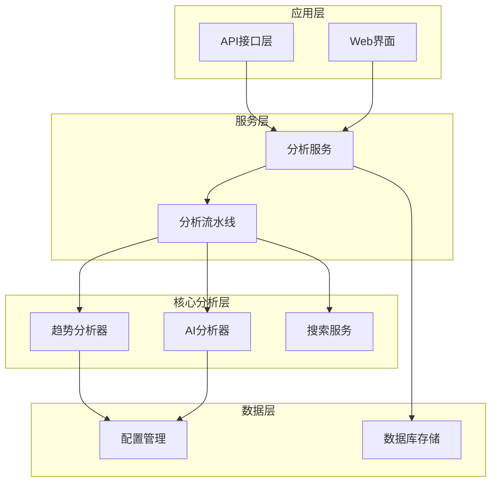
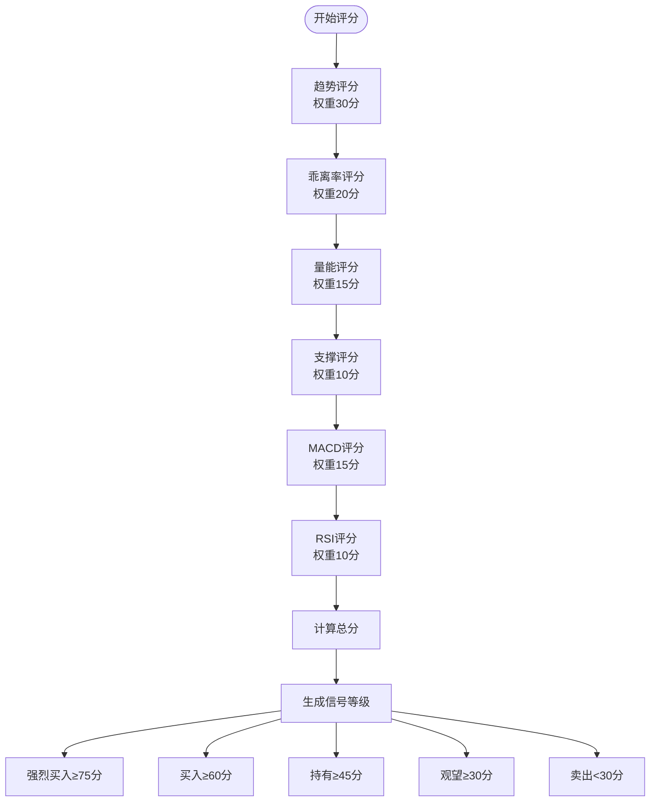
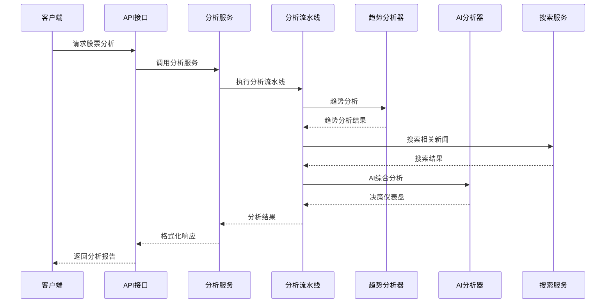
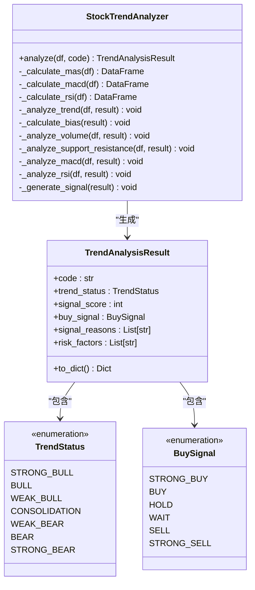
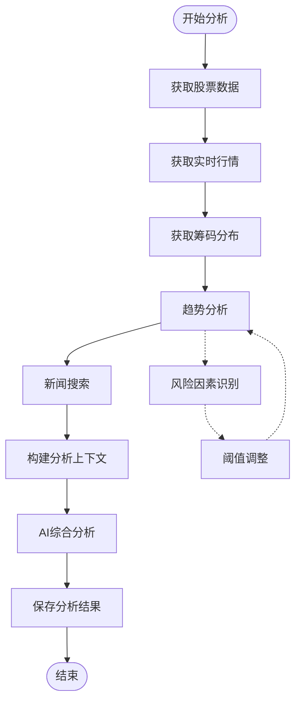
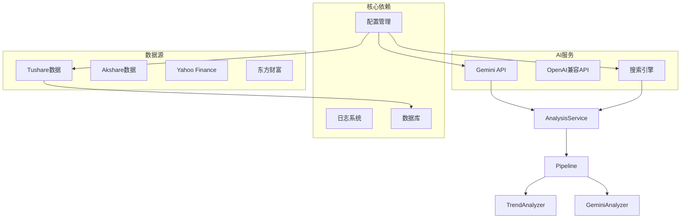

# 信号生成系统

<cite>
**本文档引用的文件**
- [src/stock_analyzer.py](file://src/stock_analyzer.py)
- [src/analyzer.py](file://src/analyzer.py)
- [src/core/pipeline.py](file://src/core/pipeline.py)
- [src/services/analysis_service.py](file://src/services/analysis_service.py)
- [src/config.py](file://src/config.py)
- [src/enums.py](file://src/enums.py)
- [src/search_service.py](file://src/search_service.py)
- [scripts/t0_backtest.py](file://scripts/t0_backtest.py)
</cite>

## 目录
1. [简介](#简介)
2. [项目结构](#项目结构)
3. [核心组件](#核心组件)
4. [架构概览](#架构概览)
5. [详细组件分析](#详细组件分析)
6. [依赖关系分析](#依赖关系分析)
7. [性能考虑](#性能考虑)
8. [故障排除指南](#故障排除指南)
9. [结论](#结论)
10. [附录](#附录)

## 简介

信号生成系统是一个基于趋势交易理念的智能股票分析平台，采用"严进策略、趋势交易、效率优先、买点偏好"四大交易原则，结合技术面和消息面分析，为用户提供科学的投资决策支持。

系统的核心特色包括：
- **综合评分算法**：基于多因子权重分配的100分制评分体系
- **信号等级划分**：明确的买入/卖出信号阈值标准
- **风险因素识别**：趋势反转、超买超卖、量价背离等风险检测
- **双模分析引擎**：传统技术分析与AI决策仪表盘双重分析模式
- **回测验证框架**：完整的性能评估和阈值调优支持

## 项目结构

**图表来源**
- [src/core/pipeline.py:48-120](file://src/core/pipeline.py#L48-L120)
- [src/services/analysis_service.py:29-47](file://src/services/analysis_service.py#L29-L47)

**章节来源**
- [src/core/pipeline.py:48-120](file://src/core/pipeline.py#L48-L120)
- [src/services/analysis_service.py:29-47](file://src/services/analysis_service.py#L29-L47)

## 核心组件

### 趋势分析器 (StockTrendAnalyzer)

趋势分析器是信号生成系统的核心组件，基于严格的交易理念实现：

**交易理念原则**：
1. **严进策略**：不追高，偏离MA5超过5%严禁追高
2. **趋势交易**：MA5>MA10>MA20多头排列，顺势而为
3. **效率优先**：关注筹码结构好的股票
4. **买点偏好**：在MA5/MA10附近回踩买入

**技术标准**：
- 多头排列：MA5 > MA10 > MA20
- 乖离率：(Close - MA5) / MA5 < 5%（不追高）
- 量能形态：缩量回调优先

**章节来源**
- [src/stock_analyzer.py:17-25](file://src/stock_analyzer.py#L17-L25)
- [src/stock_analyzer.py:171-204](file://src/stock_analyzer.py#L171-L204)

### 综合评分算法

系统采用100分制综合评分体系，各因子权重分配如下：

**图表来源**
- [src/stock_analyzer.py:583-745](file://src/stock_analyzer.py#L583-L745)

**章节来源**
- [src/stock_analyzer.py:583-745](file://src/stock_analyzer.py#L583-L745)

### 信号等级划分标准

| 信号等级 | 分数范围 | 趋势要求 | 乖离率要求 | 量能要求 | 适用场景 |
|---------|---------|---------|-----------|---------|----------|
| 强烈买入 | 75-100分 | 多头排列或强势多头 | <-3%回踩 | 缩量回调/放量突破 | 最佳入场时机 |
| 买入 | 60-74分 | 多头排列或弱势多头 | -3%~-5% | 放量上涨/正常量能 | 一般入场时机 |
| 持有 | 45-59分 | 多头排列 | 2%~5% | 正常量能 | 持有观察 |
| 观望 | 30-44分 | 趋势不明/空头排列 | >5%追高 | 放量下跌/重大利空 | 等待时机 |
| 卖出 | <30分 | 空头排列 | - | 放量下跌/重大利空 | 离场信号 |

**章节来源**
- [src/stock_analyzer.py:732-744](file://src/stock_analyzer.py#L732-L744)

### 风险因素识别算法

系统通过多维度指标识别潜在风险：

**趋势反转风险检测**：
- 空头排列（MA5<MA10<MA20）
- MA间距缩小或反向扩大
- 趋势强度下降

**超买超卖风险检测**：
- RSI>70（超买）
- RSI<30（超卖）
- RSI中长期背离

**量价背离风险检测**：
- 放量下跌
- 缩量上涨
- 量能与价格走势不匹配

**章节来源**
- [src/stock_analyzer.py:543-582](file://src/stock_analyzer.py#L543-L582)

## 架构概览

**图表来源**
- [src/core/pipeline.py:183-430](file://src/core/pipeline.py#L183-L430)
- [src/services/analysis_service.py:40-104](file://src/services/analysis_service.py#L40-L104)

**章节来源**
- [src/core/pipeline.py:183-430](file://src/core/pipeline.py#L183-L430)
- [src/services/analysis_service.py:40-104](file://src/services/analysis_service.py#L40-L104)

## 详细组件分析

### 趋势分析器类结构

**图表来源**
- [src/stock_analyzer.py:82-168](file://src/stock_analyzer.py#L82-L168)
- [src/stock_analyzer.py:32-60](file://src/stock_analyzer.py#L32-L60)

**章节来源**
- [src/stock_analyzer.py:82-168](file://src/stock_analyzer.py#L82-L168)
- [src/stock_analyzer.py:32-60](file://src/stock_analyzer.py#L32-L60)

### AI分析器决策仪表盘

AI分析器采用决策仪表盘模式，提供更全面的分析视角：

**核心模块**：
1. **核心结论**：一句话明确的操作建议
2. **数据透视**：趋势状态、价格位置、量能分析、筹码结构
3. **舆情情报**：最新消息、风险预警、利好催化、业绩预期
4. **作战计划**：狙击点位、仓位策略、风控措施

**评分标准**：
- 强烈买入（80-100分）：多头排列、低乖离率、缩量回调、筹码集中、消息面利好
- 买入（60-79分）：多头排列或弱势多头、乖离率<5%、量能正常
- 观望（40-59分）：乖离率>5%、均线缠绕、有风险事件
- 卖出（0-39分）：空头排列、跌破MA20、放量下跌、重大利空

**章节来源**
- [src/analyzer.py:334-530](file://src/analyzer.py#L334-L530)

### 分析流水线工作流程

**图表来源**
- [src/core/pipeline.py:128-430](file://src/core/pipeline.py#L128-L430)

**章节来源**
- [src/core/pipeline.py:128-430](file://src/core/pipeline.py#L128-L430)

## 依赖关系分析

**图表来源**
- [src/config.py:31-200](file://src/config.py#L31-L200)
- [src/core/pipeline.py:83-102](file://src/core/pipeline.py#L83-L102)

**章节来源**
- [src/config.py:31-200](file://src/config.py#L31-L200)
- [src/core/pipeline.py:83-102](file://src/core/pipeline.py#L83-L102)

## 性能考虑

### 并发控制与资源管理

系统采用线程池并发控制，最大并发数默认为3，防止API限流和封禁：

- **最大并发数**：3个线程
- **请求间隔**：0.0秒（可根据需要调整）
- **重试机制**：最多3次重试，指数退避
- **熔断保护**：搜索引擎API错误超过阈值时熔断

### 数据缓存策略

- **实时行情缓存**：600秒TTL
- **搜索结果缓存**：基于URL的简单缓存
- **分析结果缓存**：数据库持久化存储

### 性能优化建议

1. **阈值调优**：
   - 乖离率阈值：默认5%，可根据市场波动性调整
   - 量能判断阈值：0.7（缩量）和1.5（放量）
   - 趋势强度阈值：70分以上为强势趋势

2. **因子权重调整**：
   - 趋势因子：30分（最重要）
   - 乖离率因子：20分（严格控制追高）
   - 量能因子：15分（反映市场情绪）
   - 支撑因子：10分（技术面支撑）
   - 技术指标因子：20分（MACD+RSI）

**章节来源**
- [src/config.py:152-194](file://src/config.py#L152-L194)
- [src/stock_analyzer.py:184-200](file://src/stock_analyzer.py#L184-L200)

## 故障排除指南

### 常见问题诊断

**AI分析器不可用**：
- 检查Gemini API Key配置
- 验证网络代理设置
- 查看API限流状态

**数据获取失败**：
- 检查Tushare Token配置
- 验证数据源可用性
- 查看请求频率限制

**信号准确性问题**：
- 调整乖离率阈值
- 优化因子权重分配
- 检查市场环境变化

### 调试工具

系统提供详细的日志记录和错误处理机制：

- **详细错误信息**：完整的异常堆栈跟踪
- **性能监控**：各模块执行时间和内存使用
- **配置验证**：启动时自动验证配置完整性

**章节来源**
- [src/core/pipeline.py:426-429](file://src/core/pipeline.py#L426-L429)
- [src/config.py:507-546](file://src/config.py#L507-L546)

## 结论

信号生成系统通过严谨的交易理念和科学的量化分析，为投资者提供了可靠的投资决策支持。系统的核心优势包括：

1. **理论基础扎实**：基于四大交易原则构建的分析框架
2. **技术实现先进**：结合传统技术分析和AI决策仪表盘
3. **风险管理完善**：多维度风险识别和预警机制
4. **可扩展性强**：模块化设计便于功能扩展和维护

建议用户根据自身风险承受能力和市场环境，合理调整阈值和权重参数，以获得最佳的投资效果。

## 附录

### 信号评分体系详解

| 因子类别 | 评分标准 | 权重 | 说明 |
|---------|---------|------|------|
| 趋势分析 | 多头排列30分，空头排列0分 | 30% | 趋势是最重要的信号因子 |
| 乖离率 | -3%以下20分，-5%以下16分，>5%4分 | 20% | 控制追高风险 |
| 量能分析 | 缩量回调15分，放量上涨12分，正常10分 | 15% | 反映市场情绪 |
| 技术支撑 | MA5支撑5分，MA10支撑5分 | 10% | 技术面支撑确认 |
| MACD指标 | 金叉零轴15分，金叉12分，多头8分 | 15% | 动量指标确认 |
| RSI指标 | 超卖10分，强势8分，中性5分 | 10% | 超买超卖预警 |

### 回测验证流程

系统提供完整的回测验证框架：

1. **数据准备**：获取历史OHLC数据
2. **策略实现**：基于信号生成逻辑实现交易策略
3. **回测执行**：模拟历史交易过程
4. **结果分析**：计算各项性能指标
5. **参数优化**：调整阈值和权重参数

**章节来源**
- [scripts/t0_backtest.py:128-420](file://scripts/t0_backtest.py#L128-L420)