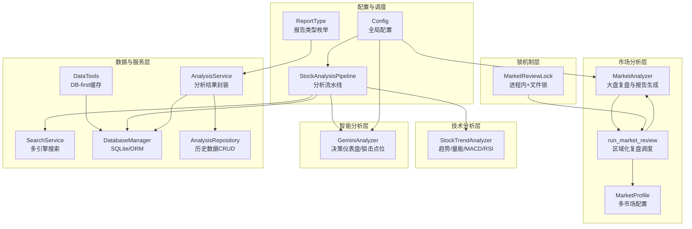
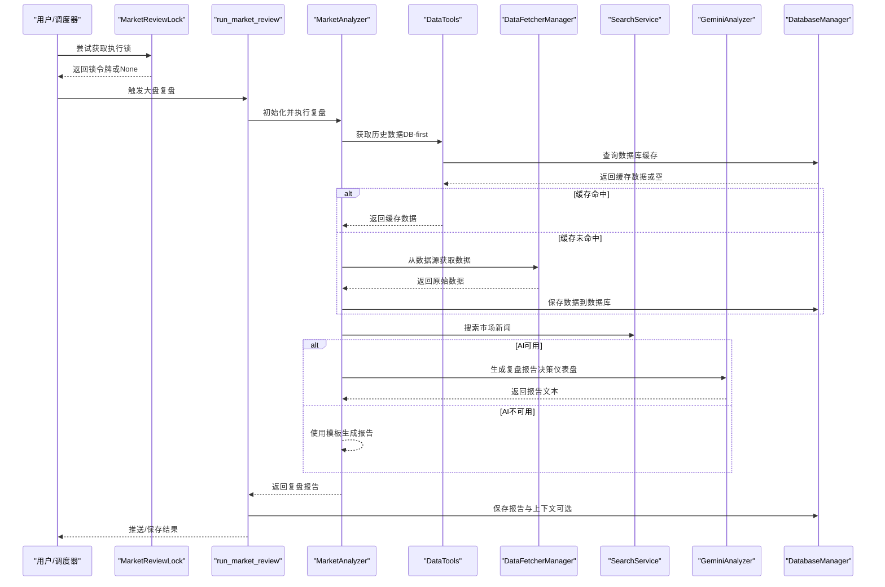
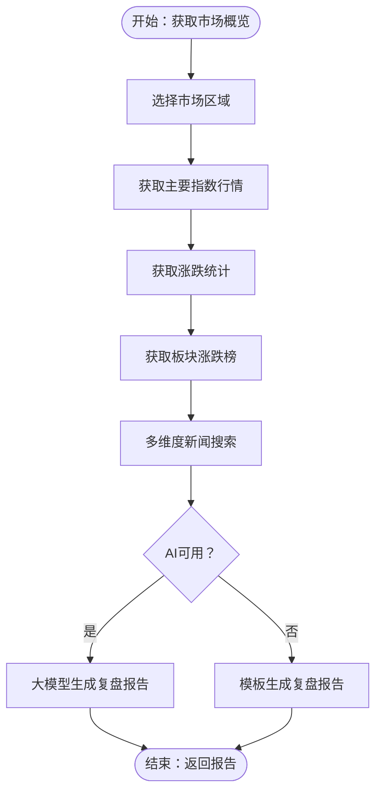
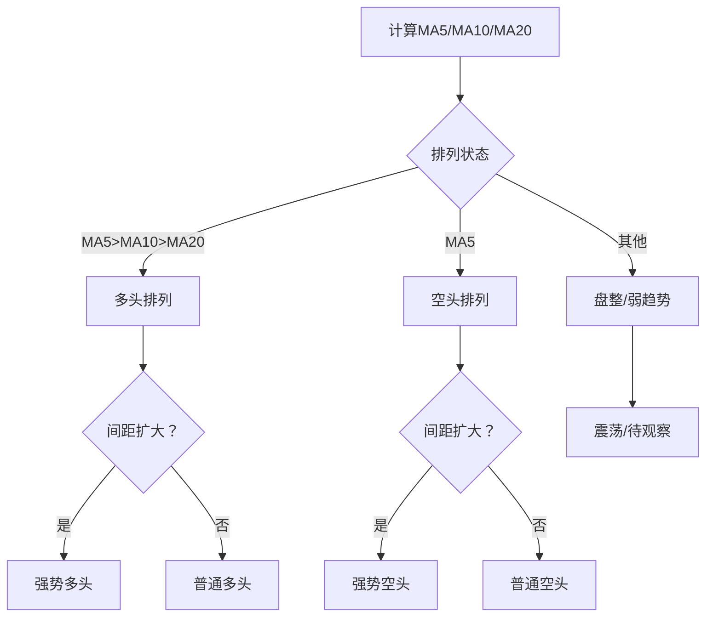
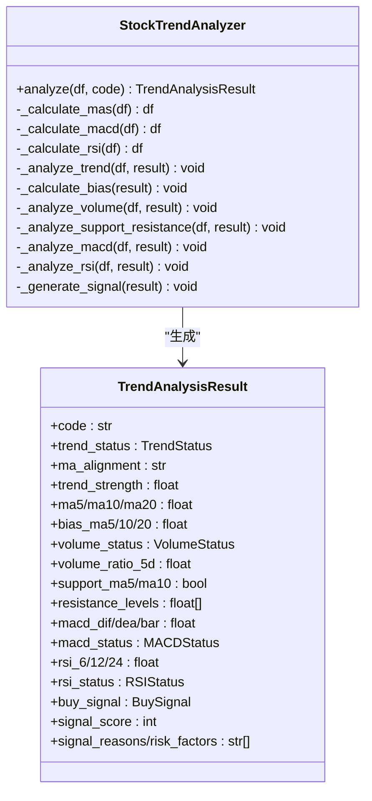
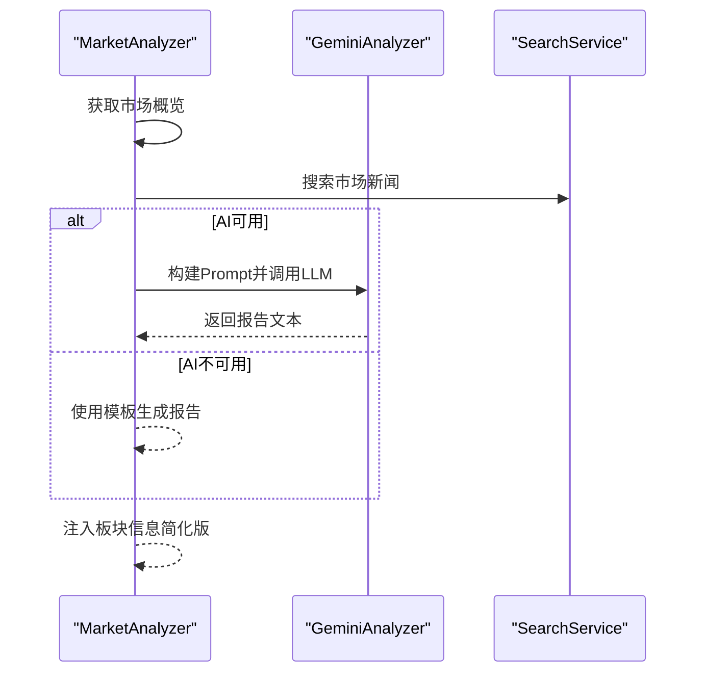
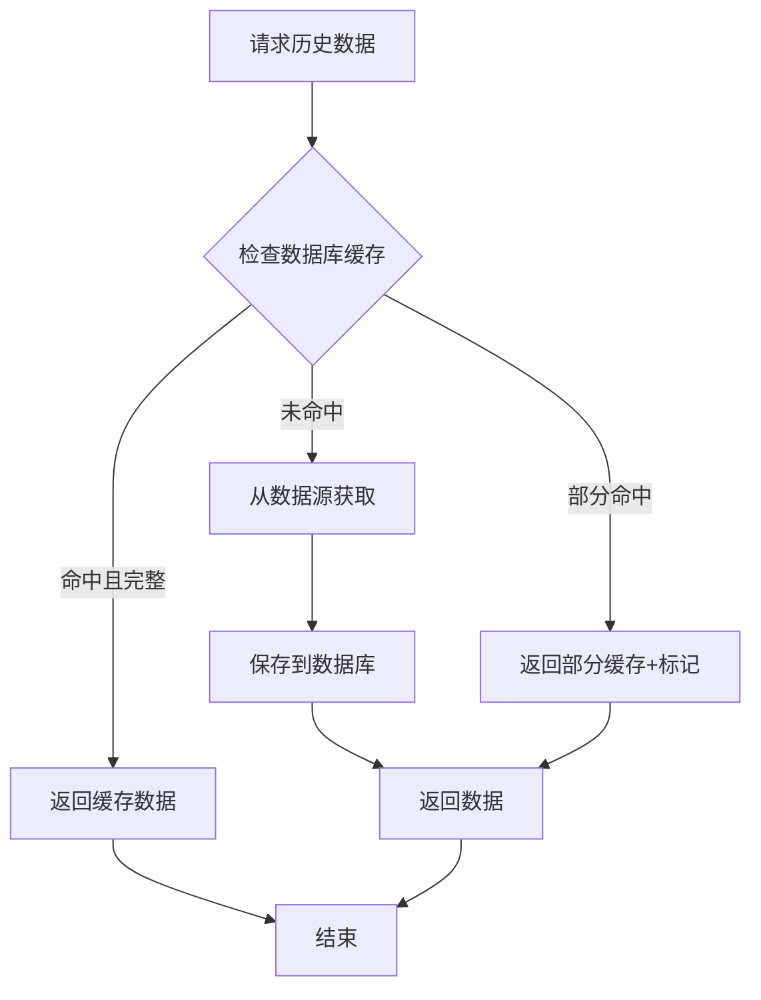
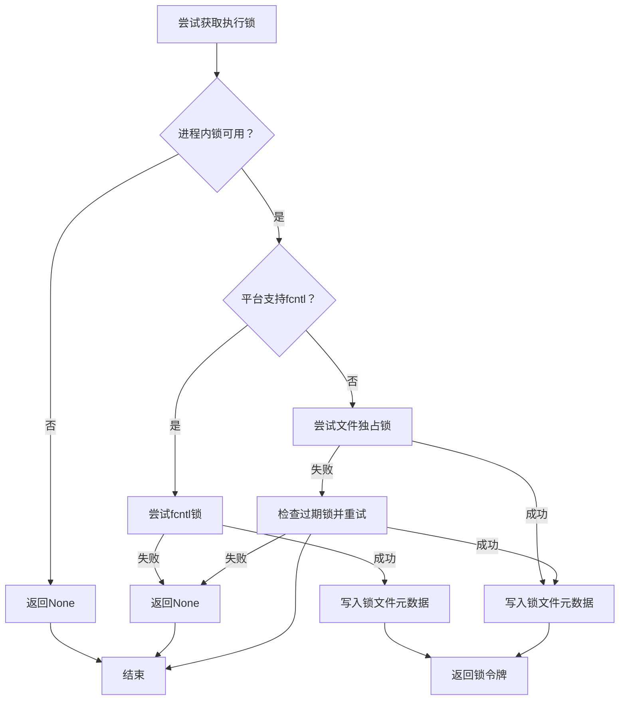
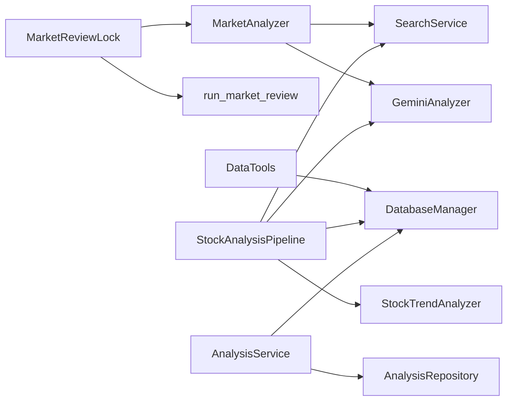

# 市场分析算法

<cite>
**本文档引用的文件**
- [src/market_analyzer.py](file://src/market_analyzer.py)
- [src/core/market_review.py](file://src/core/market_review.py)
- [src/core/market_profile.py](file://src/core/market_profile.py)
- [src/core/market_review_lock.py](file://src/core/market_review_lock.py)
- [src/stock_analyzer.py](file://src/stock_analyzer.py)
- [src/analyzer.py](file://src/analyzer.py)
- [src/core/pipeline.py](file://src/core/pipeline.py)
- [src/search_service.py](file://src/search_service.py)
- [src/config.py](file://src/config.py)
- [src/enums.py](file://src/enums.py)
- [src/storage.py](file://src/storage.py)
- [src/services/analysis_service.py](file://src/services/analysis_service.py)
- [src/repositories/analysis_repo.py](file://src/repositories/analysis_repo.py)
- [src/agent/tools/data_tools.py](file://src/agent/tools/data_tools.py)
- [data_provider/akshare_fetcher.py](file://data_provider/akshare_fetcher.py)
- [tests/test_data_tools_daily_history_cache.py](file://tests/test_data_tools_daily_history_cache.py)
- [tests/test_market_review_lock.py](file://tests/test_market_review_lock.py)
- [tests/test_yfinance_hk_indices.py](file://tests/test_yfinance_hk_indices.py)
- [data_provider/realtime_types.py](file://data_provider/realtime_types.py)
</cite>

## 更新摘要
**所做更改**
- 新增香港市场支持章节，包含市场配置、数据源适配和指数识别
- 更新历史数据优化章节，详细说明DB-first缓存机制和缓存策略
- 新增市场审查锁定机制章节，描述进程内和文件锁双重保护
- 更新数据源可靠性增强章节，包含熔断器机制和备用链路
- 扩展适用场景与局限性章节，增加多市场支持说明

## 目录
1. [简介](#简介)
2. [项目结构](#项目结构)
3. [核心组件](#核心组件)
4. [架构总览](#架构总览)
5. [详细组件分析](#详细组件分析)
6. [依赖关系分析](#依赖关系分析)
7. [性能考虑](#性能考虑)
8. [故障排查指南](#故障排查指南)
9. [结论](#结论)
10. [附录](#附录)

## 简介
本文件面向市场分析算法模块，系统化梳理并解释以下核心能力：
- 市场整体趋势分析：大盘指数趋势判断、板块轮动检测、市场情绪分析
- 市场周期识别：牛市、熊市、震荡市等阶段判定标准
- 市场风险评估：系统性风险监测、流动性风险评估、波动率预测
- 市场结构分析：支撑压力位识别、关键点位突破检测、趋势延续性判断
- 参数配置与回测：参数配置指南、历史数据回测方法、预测准确性评估
- 适用场景与局限性：算法适用边界与潜在风险提示

**更新** 新增香港市场支持、历史数据优化（DB-first缓存）、市场审查锁定机制和数据源可靠性增强

本模块采用"数据驱动 + 多源情报 + 大模型融合"的架构，既提供可解释的量化技术分析，也结合新闻与消息面进行综合判断。

## 项目结构
围绕市场分析算法的关键文件组织如下：
- 市场层面：大盘复盘与市场概览
  - MarketAnalyzer：获取主要指数、涨跌统计、板块排行、新闻搜索、生成复盘报告
  - market_review：按区域（A股/港股/美股/两者）执行大盘复盘并推送
  - market_profile：多市场区域配置管理
- 技术分析：趋势交易理念与信号生成
  - StockTrendAnalyzer：基于MA5/MA10/MA20、MACD、RSI、量能等生成买卖信号
- 智能分析：大模型决策仪表盘
  - GeminiAnalyzer：封装LLM调用，输出决策仪表盘与狙击点位
- 数据与服务：数据获取、搜索、存储、回测
  - DataFetcherManager（通过导入使用）、SearchService、DatabaseManager、AnalysisService、AnalysisRepository
  - data_tools：历史数据缓存工具，支持DB-first策略
- 锁机制：防止重复执行的锁定机制
  - market_review_lock：进程内和文件锁双重保护
- 配置与枚举：统一配置、报告类型枚举

**图表来源**
- [src/market_analyzer.py:78-528](file://src/market_analyzer.py#L78-L528)
- [src/core/market_review.py:27-119](file://src/core/market_review.py#L27-L119)
- [src/core/market_profile.py:56-76](file://src/core/market_profile.py#L56-L76)
- [src/core/market_review_lock.py:144-205](file://src/core/market_review_lock.py#L144-L205)
- [src/agent/tools/data_tools.py:303-341](file://src/agent/tools/data_tools.py#L303-L341)

**章节来源**
- [src/market_analyzer.py:1-557](file://src/market_analyzer.py#L1-L557)
- [src/core/market_review.py:1-150](file://src/core/market_review.py#L1-L150)
- [src/core/market_profile.py:1-77](file://src/core/market_profile.py#L1-L77)
- [src/core/market_review_lock.py:1-228](file://src/core/market_review_lock.py#L1-L228)
- [src/agent/tools/data_tools.py:300-499](file://src/agent/tools/data_tools.py#L300-L499)

## 核心组件
- MarketAnalyzer：负责获取主要指数、涨跌统计、板块排行、新闻搜索，并生成简洁/模板化复盘报告；支持注入AI分析器进行大模型生成。
- StockTrendAnalyzer：基于交易理念（严进策略、趋势交易、效率优先、买点偏好）实现量化信号生成，覆盖均线、MACD、RSI、量能、支撑压力等。
- GeminiAnalyzer：封装LLM调用（Gemini/OpenAI兼容），输出决策仪表盘（核心结论、数据透视、情报、作战计划），并提供狙击点位与风控清单。
- StockAnalysisPipeline：分析流水线，协调数据获取、趋势分析、新闻搜索、AI分析、结果保存与通知。
- SearchService：统一多搜索引擎（Bocha/Tavily/SerpAPI/Brave/SearXNG）接口，支持多Key负载均衡与故障转移。
- DatabaseManager/AnalysisService/AnalysisRepository：数据库与历史数据访问层，支持分析结果持久化与查询。
- DataTools：历史数据缓存工具，采用DB-first策略，优先使用数据库缓存，失败时回退到数据源获取。
- MarketReviewLock：市场复盘执行锁，结合进程内锁和文件锁，防止重复执行。
- MarketProfile：多市场区域配置，支持A股、港股、美股区域化设置。
- Config/ReportType：统一配置与报告类型枚举，保证一致性与可维护性。

**章节来源**
- [src/market_analyzer.py:78-528](file://src/market_analyzer.py#L78-L528)
- [src/stock_analyzer.py:171-848](file://src/stock_analyzer.py#L171-L848)
- [src/analyzer.py:334-800](file://src/analyzer.py#L334-L800)
- [src/core/pipeline.py:48-127](file://src/core/pipeline.py#L48-L127)
- [src/search_service.py:1-2568](file://src/search_service.py#L1-L2568)
- [src/storage.py:623-800](file://src/storage.py#L623-L800)
- [src/services/analysis_service.py:29-171](file://src/services/analysis_service.py#L29-L171)
- [src/repositories/analysis_repo.py:21-131](file://src/repositories/analysis_repo.py#L21-L131)
- [src/config.py:31-580](file://src/config.py#L31-L580)
- [src/enums.py:13-51](file://src/enums.py#L13-L51)
- [src/agent/tools/data_tools.py:300-499](file://src/agent/tools/data_tools.py#L300-L499)
- [src/core/market_review_lock.py:144-205](file://src/core/market_review_lock.py#L144-L205)
- [src/core/market_profile.py:56-76](file://src/core/market_profile.py#L56-L76)

## 架构总览
市场分析算法采用"流水线 + 多源数据 + 大模型融合"的架构：
- 数据层：统一数据源管理（DataFetcherManager），自动故障切换；实时行情/筹码/基本面聚合。
- 搜索层：多搜索引擎统一接口，支持时间窗与多Key负载均衡。
- 分析层：技术分析（趋势/量能/MACD/RSI）与AI分析（决策仪表盘）双通道。
- 存储层：SQLite + ORM，支持分析历史、新闻情报、回测结果等。
- 缓存层：DB-first缓存策略，优先使用数据库缓存，提升响应速度。
- 锁机制层：进程内锁+文件锁双重保护，防止重复执行。
- 服务层：分析服务封装、历史数据CRUD、回测引擎集成。

**图表来源**
- [src/core/market_review_lock.py:144-205](file://src/core/market_review_lock.py#L144-L205)
- [src/market_analyzer.py:103-528](file://src/market_analyzer.py#L103-L528)
- [src/agent/tools/data_tools.py:303-341](file://src/agent/tools/data_tools.py#L303-L341)
- [src/analyzer.py:334-800](file://src/analyzer.py#L334-L800)
- [src/search_service.py:1-2568](file://src/search_service.py#L1-L2568)
- [src/storage.py:623-800](file://src/storage.py#L623-L800)

## 详细组件分析

### 市场整体趋势分析与情绪
- 指数趋势判断：通过主要指数（上证、深证、创业板等）的涨跌、振幅、成交额等指标，快速刻画市场强弱。
- 板块轮动检测：基于板块涨跌榜，识别领涨/领跌板块，辅助判断资金流向与热点轮动。
- 市场情绪分析：结合新闻摘要、AI情绪标签与技术指标状态，输出简洁的市场情绪总结与要点。

**图表来源**
- [src/market_analyzer.py:103-270](file://src/market_analyzer.py#L103-L270)
- [src/core/market_review.py:27-119](file://src/core/market_review.py#L27-L119)

**章节来源**
- [src/market_analyzer.py:78-528](file://src/market_analyzer.py#L78-L528)
- [src/core/market_review.py:27-119](file://src/core/market_review.py#L27-L119)

### 市场周期识别（牛市/熊市/震荡）
- 周期判定依据：以均线排列为核心（MA5>MA10>MA20为多头排列，反之为空头排列），结合均线间距变化衡量趋势强度；在区间内进一步细分为强势/弱势多头/空头与盘整。
- 严进策略：限制追高（MA5乖离率阈值），避免在高位介入。
- 量能配合：偏好缩量回调，放量上涨次之，放量下跌风险最高。

**图表来源**
- [src/stock_analyzer.py:339-391](file://src/stock_analyzer.py#L339-L391)

**章节来源**
- [src/stock_analyzer.py:171-848](file://src/stock_analyzer.py#L171-L848)

### 市场风险评估（系统性/流动性/波动率）
- 系统性风险监测：通过空头排列、MACD死叉/下穿零轴、RSI超买/超卖、放量下跌等信号识别系统性下行风险。
- 流动性风险评估：关注量比、换手率、缩量/放量状态，结合板块涨跌榜判断资金活跃度。
- 波动率预测：基于历史价格序列（滚动窗口）与技术指标（如ATR/布林带宽度）进行粗略估计（当前实现以技术面信号为主，未直接输出波动率数值）。

**章节来源**
- [src/stock_analyzer.py:409-582](file://src/stock_analyzer.py#L409-L582)
- [src/core/pipeline.py:183-429](file://src/core/pipeline.py#L183-L429)

### 市场结构分析（支撑/压力/突破/延续）
- 支撑压力位识别：以MA5/MA10/MA20为关键支撑/压力位，结合近期高点形成短期压力。
- 关键点位突破检测：通过价格与均线距离、量能配合与MACD信号共同确认突破有效性。
- 趋势延续性判断：结合均线间距变化、MACD零轴穿越、RSI中性/超买/超卖状态综合判断。

**图表来源**
- [src/stock_analyzer.py:82-168](file://src/stock_analyzer.py#L82-L168)
- [src/stock_analyzer.py:205-745](file://src/stock_analyzer.py#L205-L745)

**章节来源**
- [src/stock_analyzer.py:171-848](file://src/stock_analyzer.py#L171-L848)

### 大盘复盘与报告生成（AI/模板）
- AI生成：构建Prompt，注入指数、涨跌统计、板块排行与新闻摘要，调用Gemini/OpenAI生成简洁Markdown报告；支持将板块信息注入到特定位置。
- 模板生成：在AI不可用时，基于上证指数涨跌幅与成交额等关键指标，生成极简版市场速报。

**图表来源**
- [src/market_analyzer.py:271-506](file://src/market_analyzer.py#L271-L506)
- [src/analyzer.py:334-800](file://src/analyzer.py#L334-L800)
- [src/search_service.py:1-2568](file://src/search_service.py#L1-L2568)

**章节来源**
- [src/market_analyzer.py:271-506](file://src/market_analyzer.py#L271-L506)
- [src/analyzer.py:334-800](file://src/analyzer.py#L334-L800)

### 搜索服务与多引擎负载均衡
- 支持Bocha、Tavily、SerpAPI、Brave、SearXNG等搜索引擎，具备多Key轮询与错误计数熔断机制。
- 支持时间窗过滤（如最近1/7/30天），提升时效性与相关性。
- 提供统一SearchResult/SearchResponse结构，便于后续格式化与持久化。

**章节来源**
- [src/search_service.py:1-800](file://src/search_service.py#L1-L800)

### 历史数据优化（DB-first缓存策略）
**更新** 新增DB-first缓存策略，显著提升历史数据获取性能

- DB-first缓存机制：优先从数据库缓存获取历史数据，若缓存命中则直接返回，无需网络请求。
- 缓存策略：支持部分缓存（缓存记录少于请求天数）和完整缓存两种模式。
- 失败回退：数据库读取异常或缓存过期时，自动回退到数据源获取。
- 代码标准化：支持多种股票代码格式（如HK01810、1810.HK）的标准化处理。
- 最大化利用：当多个候选代码（如HK01810和1810.HK）同时存在时，优先选择数据更完整的候选。

**图表来源**
- [src/agent/tools/data_tools.py:303-341](file://src/agent/tools/data_tools.py#L303-L341)
- [tests/test_data_tools_daily_history_cache.py:87-121](file://tests/test_data_tools_daily_history_cache.py#L87-L121)

**章节来源**
- [src/agent/tools/data_tools.py:300-499](file://src/agent/tools/data_tools.py#L300-L499)
- [tests/test_data_tools_daily_history_cache.py:50-231](file://tests/test_data_tools_daily_history_cache.py#L50-L231)

### 市场审查锁定机制
**更新** 新增市场审查锁定机制，防止重复执行

- 双重锁保护：结合进程内锁和文件锁，确保同一主机上的进程不会重复执行。
- 过期清理：支持过期锁文件的自动清理和恢复。
- 跨平台支持：Linux使用fcntl锁，Windows使用文件独占锁。
- 元数据管理：锁文件包含进程ID和启动时间，便于状态追踪。
- TTL控制：锁文件超过24小时自动视为过期。

**图表来源**
- [src/core/market_review_lock.py:144-205](file://src/core/market_review_lock.py#L144-L205)
- [tests/test_market_review_lock.py:31-96](file://tests/test_market_review_lock.py#L31-L96)

**章节来源**
- [src/core/market_review_lock.py:1-228](file://src/core/market_review_lock.py#L1-L228)
- [tests/test_market_review_lock.py:1-143](file://tests/test_market_review_lock.py#L1-L143)

### 数据源可靠性增强
**更新** 新增熔断器机制和备用链路，提升数据源可靠性

- 熔断器机制：连续失败达到阈值后进入熔断状态，冷却时间后半开探测。
- 备用链路：主数据源失败时自动切换到备用数据源。
- 状态机管理：CLOSED→OPEN→HALF_OPEN的完整状态转换。
- 并发安全：多线程环境下状态一致性保证。
- 清晰的错误处理：详细的失败原因记录和恢复机制。

**章节来源**
- [data_provider/realtime_types.py:271-306](file://data_provider/realtime_types.py#L271-L306)
- [data_provider/akshare_fetcher.py:1390-1444](file://data_provider/akshare_fetcher.py#L1390-L1444)

### 多市场支持（A股/港股/美股）
**更新** 新增香港市场支持，扩展多区域分析能力

- 市场配置：MarketProfile定义各市场的指数代码、新闻关键词和提示语。
- 指数识别：支持HSI（恒生指数）、HSTECH（恒生科技指数）、HSCEI（国企指数）等港股主要指数。
- 区域切换：通过region参数在cn/hk/us之间切换，支持both和逗号分隔的组合模式。
- 代码适配：支持HK01810、1810.HK等多种港股代码格式。
- 数据源适配：akshare_fetcher支持港股实时行情获取，包含备用接口切换。

**章节来源**
- [src/core/market_profile.py:56-76](file://src/core/market_profile.py#L56-L76)
- [src/core/market_review.py:79-91](file://src/core/market_review.py#L79-L91)
- [data_provider/akshare_fetcher.py:1390-1444](file://data_provider/akshare_fetcher.py#L1390-L1444)
- [tests/test_yfinance_hk_indices.py:102-134](file://tests/test_yfinance_hk_indices.py#L102-L134)

### 分析流水线与历史数据
- StockAnalysisPipeline：串联数据获取、趋势分析、新闻搜索、AI分析、结果保存与通知。
- AnalysisService/AnalysisRepository：封装分析结果的格式化、持久化与查询。
- DatabaseManager：统一ORM模型（StockDaily、AnalysisHistory、BacktestResult等），支持断点续传与历史回溯。

**章节来源**
- [src/core/pipeline.py:48-800](file://src/core/pipeline.py#L48-L800)
- [src/services/analysis_service.py:29-171](file://src/services/analysis_service.py#L29-L171)
- [src/repositories/analysis_repo.py:21-131](file://src/repositories/analysis_repo.py#L21-L131)
- [src/storage.py:623-800](file://src/storage.py#L623-L800)

## 依赖关系分析
- 组件耦合与内聚
  - MarketAnalyzer与SearchService/GeminiAnalyzer松耦合，通过接口注入实现可插拔。
  - StockTrendAnalyzer独立性强，仅依赖pandas/numpy与配置参数，便于单元测试与复用。
  - Pipeline作为编排器，协调多模块协作，保持较高内聚与清晰边界。
  - MarketReviewLock提供跨模块的执行控制，确保系统稳定性。
- 外部依赖
  - 搜索引擎API（Bocha/Tavily/SerpAPI等）与LLM API（Gemini/OpenAI）为可配置外部依赖。
  - 数据源（Akshare/Tushare/Yfinance等）通过DataFetcherManager自动切换，降低单一依赖风险。
  - SQLite数据库提供本地缓存和持久化存储。
- 循环依赖
  - 未发现循环导入；模块间通过函数/类接口交互，避免循环依赖。

**图表来源**
- [src/market_analyzer.py:78-528](file://src/market_analyzer.py#L78-L528)
- [src/core/pipeline.py:48-127](file://src/core/pipeline.py#L48-L127)
- [src/stock_analyzer.py:171-848](file://src/stock_analyzer.py#L171-L848)
- [src/analyzer.py:334-800](file://src/analyzer.py#L334-L800)
- [src/search_service.py:1-2568](file://src/search_service.py#L1-L2568)
- [src/storage.py:623-800](file://src/storage.py#L623-L800)
- [src/services/analysis_service.py:29-171](file://src/services/analysis_service.py#L29-L171)
- [src/repositories/analysis_repo.py:21-131](file://src/repositories/analysis_repo.py#L21-L131)
- [src/core/market_review_lock.py:144-205](file://src/core/market_review_lock.py#L144-L205)
- [src/agent/tools/data_tools.py:303-341](file://src/agent/tools/data_tools.py#L303-L341)

**章节来源**
- [src/market_analyzer.py:78-528](file://src/market_analyzer.py#L78-L528)
- [src/core/pipeline.py:48-127](file://src/core/pipeline.py#L48-L127)
- [src/stock_analyzer.py:171-848](file://src/stock_analyzer.py#L171-L848)
- [src/analyzer.py:334-800](file://src/analyzer.py#L334-L800)
- [src/search_service.py:1-2568](file://src/search_service.py#L1-L2568)
- [src/storage.py:623-800](file://src/storage.py#L623-L800)
- [src/services/analysis_service.py:29-171](file://src/services/analysis_service.py#L29-L171)
- [src/repositories/analysis_repo.py:21-131](file://src/repositories/analysis_repo.py#L21-L131)
- [src/core/market_review_lock.py:144-205](file://src/core/market_review_lock.py#L144-L205)
- [src/agent/tools/data_tools.py:303-341](file://src/agent/tools/data_tools.py#L303-L341)

## 性能考虑
- 并发与限流
  - 最大并发数（max_workers）受配置控制，避免API限流与封禁风险。
  - 实时行情/搜索等外部调用具备指数退避与熔断保护。
- 数据缓存与断点续传
  - 数据库层实现has_today_data断点续传，减少重复网络请求。
  - 实时行情缓存（ttl）与熔断器冷却时间降低调用频次。
  - **新增** DB-first缓存策略显著减少网络请求，提升响应速度。
- 指标计算复杂度
  - 均线/EMA/RSI/MACD等滚动计算为O(n)，在合理窗口内可接受；建议控制历史数据长度以平衡精度与性能。
- 锁机制性能
  - **新增** 双重锁机制在保证安全性的同时，尽量减少锁竞争影响。

**章节来源**
- [src/config.py:152-194](file://src/config.py#L152-L194)
- [src/storage.py:747-776](file://src/storage.py#L747-L776)
- [src/stock_analyzer.py:264-337](file://src/stock_analyzer.py#L264-L337)
- [src/core/market_review_lock.py:21-23](file://src/core/market_review_lock.py#L21-L23)

## 故障排查指南
- AI不可用
  - 现象：大模型生成失败或未配置，回落到模板报告。
  - 处理：检查Gemini/OpenAI API Key与网络代理配置；确认模型名称与重试参数。
- 搜索服务不可用
  - 现象：未配置搜索引擎Key，新闻搜索为空。
  - 处理：配置至少一个搜索引擎Key（Bocha/Tavily/SerpAPI/Brave），检查网络与配额。
- 数据源失败
  - 现象：指数/涨跌统计/板块排行为空。
  - 处理：检查DataFetcherManager自动切换逻辑与网络连通性；必要时手动切换数据源优先级。
- **新增** DB-first缓存问题
  - 现象：历史数据获取缓慢或失败。
  - 处理：检查数据库连接状态，确认缓存表结构正确；验证代码标准化逻辑。
- **新增** 市场审查锁问题
  - 现象：市场复盘无法执行或重复执行。
  - 处理：检查market_review.lock文件状态，清理过期锁文件；确认进程权限。
- 回测与历史数据
  - 现象：回测结果缺失或不完整。
  - 处理：确认AnalysisHistory/BacktestResult表结构与索引；检查eval_window_days与engine版本配置。

**章节来源**
- [src/analyzer.py:531-787](file://src/analyzer.py#L531-L787)
- [src/search_service.py:1-2568](file://src/search_service.py#L1-L2568)
- [src/storage.py:272-393](file://src/storage.py#L272-L393)
- [src/services/analysis_service.py:106-171](file://src/services/analysis_service.py#L106-L171)
- [src/agent/tools/data_tools.py:303-341](file://src/agent/tools/data_tools.py#L303-L341)
- [src/core/market_review_lock.py:186-191](file://src/core/market_review_lock.py#L186-L191)

## 结论
本模块通过"技术面量化 + 多源情报 + 大模型融合"的方式，实现了从市场概览到个股分析的全链路能力。其优势在于：
- 可解释性强：趋势/量能/MACD/RSI等指标明确，便于理解与二次开发。
- 可靠性高：多引擎/多数据源自动切换、熔断与重试机制完善。
- 可扩展性好：模块化设计，支持按需启用AI与高级功能。
- **新增** 多市场支持：全面支持A股、港股、美股三大市场分析。
- **新增** 性能优化：DB-first缓存策略显著提升历史数据获取速度。
- **新增** 系统稳定性：双重锁机制防止重复执行，提升系统可靠性。

局限性与注意事项：
- 模型输出依赖外部API稳定性与配额；需合理配置重试与代理。
- 技术指标为滞后指标，需结合消息面与宏观环境综合判断。
- 回测与预测准确性依赖历史数据质量与参数设定，需定期校准。
- **新增** 多市场数据源差异：不同市场的数据质量和可用性可能存在差异。

## 附录

### 市场分析参数配置指南
- AI与模型
  - Gemini/OpenAI API Key、模型名称、温度、重试次数与延迟
- 搜索引擎
  - Bocha/Tavily/SerpAPI/Brave等Key配置，支持多Key轮询
- 实时数据
  - 实时行情开关、数据源优先级、缓存TTL、熔断冷却
- 并发与限流
  - 最大并发数、请求间隔、重试参数
- 回测
  - 回测窗口天数、最小数据年龄、中性带宽、引擎版本
- **新增** 多市场配置
  - market_review_region：支持cn/hk/us/both及逗号分隔组合
  - 数据源优先级：针对不同市场的数据源配置

**章节来源**
- [src/config.py:31-580](file://src/config.py#L31-L580)
- [src/core/market_review.py:74-78](file://src/core/market_review.py#L74-L78)

### 历史数据回测方法
- 数据准备：通过StockAnalysisPipeline获取分析历史（AnalysisHistory），包含建议点位（理想买入/次优买入/止损/止盈）。
- 回测执行：按eval_window_days窗口模拟持有收益，统计方向准确率、胜率、平均回报与目标价命中率。
- 结果汇总：BacktestSummary按股票/全局维度汇总指标，支持诊断字段导出。

**章节来源**
- [src/storage.py:272-393](file://src/storage.py#L272-L393)
- [src/services/analysis_service.py:106-171](file://src/services/analysis_service.py#L106-L171)

### 市场预测准确性评估
- 指标体系
  - 方向准确率（预期方向与实际涨跌对比）
  - 胜率（模拟交易中盈利占比）
  - 平均回报（股票回报与模拟回报）
  - 目标价命中率（止盈/止损触发频率与时滞）
- 评估建议
  - 使用不同窗口（如10/14/20日）对比稳健性
  - 分阶段评估（牛市/熊市/震荡）以观察适用性
  - 结合诊断字段（advice_breakdown/agnostics）定位薄弱环节

**章节来源**
- [src/storage.py:340-393](file://src/storage.py#L340-L393)

### 适用场景与局限性
- 适用场景
  - 日常市场监控与快速复盘
  - 个股趋势初筛与买卖信号参考
  - 基于消息面的综合研判辅助
  - **新增** 多市场投资组合监控
- 局限性
  - 技术指标滞后，需结合消息面与宏观
  - 外部API稳定性与配额限制影响输出
  - 回测依赖历史样本，需动态校准参数
  - **新增** 不同市场数据质量差异可能影响分析准确性
  - **新增** 多市场切换时的代码标准化处理复杂性

**章节来源**
- [src/stock_analyzer.py:171-848](file://src/stock_analyzer.py#L171-L848)
- [src/analyzer.py:334-800](file://src/analyzer.py#L334-L800)
- [src/market_analyzer.py:78-528](file://src/market_analyzer.py#L78-L528)
- [src/core/market_profile.py:56-76](file://src/core/market_profile.py#L56-L76)