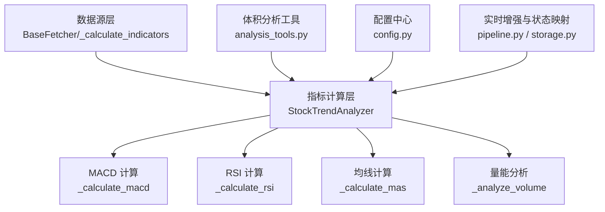
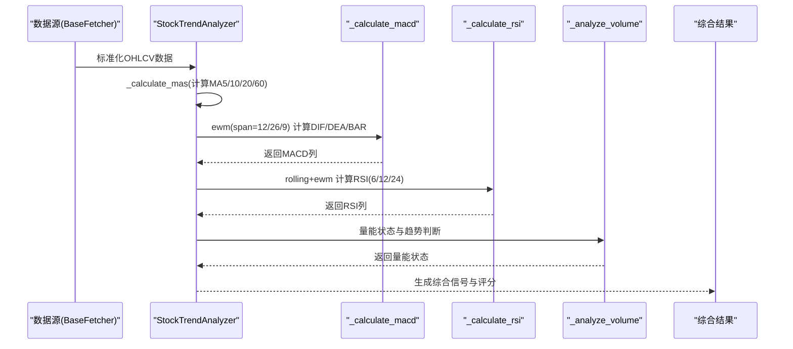
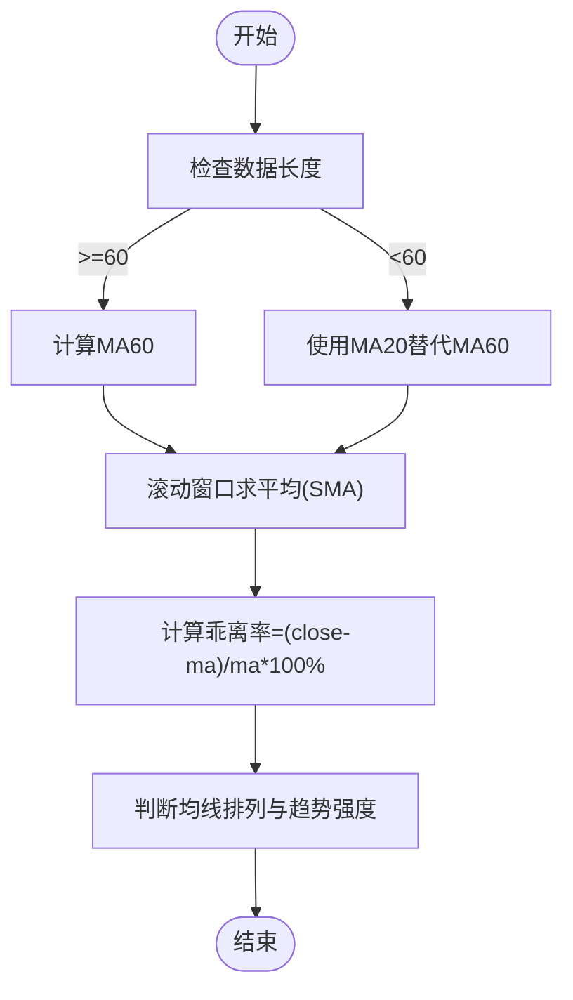
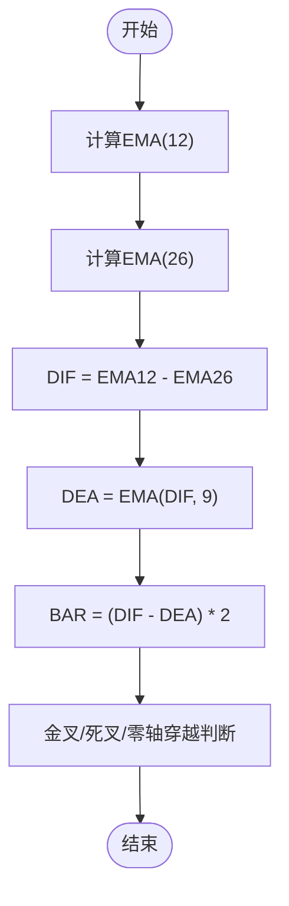
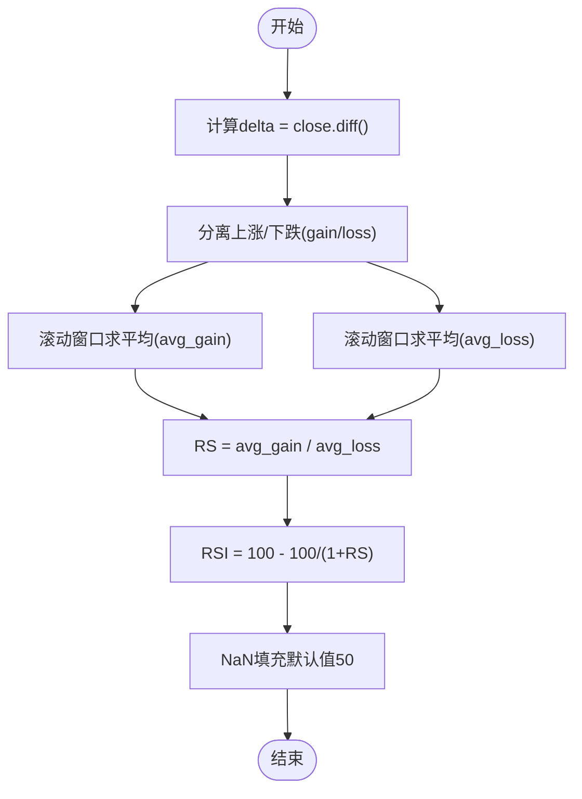
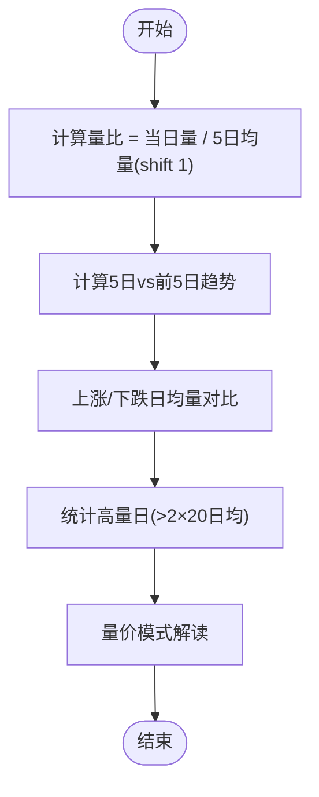
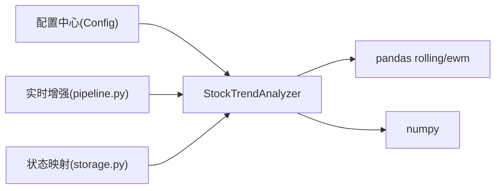

# 技术指标计算

<cite>
**本文引用的文件**
- [stock_analyzer.py](file://src/stock_analyzer.py)
- [base.py](file://data_provider/base.py)
- [analysis_tools.py](file://src/agent/tools/analysis_tools.py)
- [config.py](file://src/config.py)
- [pipeline.py](file://src/core/pipeline.py)
- [storage.py](file://src/storage.py)
</cite>

## 目录
1. [简介](#简介)
2. [项目结构](#项目结构)
3. [核心组件](#核心组件)
4. [架构总览](#架构总览)
5. [详细组件分析](#详细组件分析)
6. [依赖关系分析](#依赖关系分析)
7. [性能考量](#性能考量)
8. [故障排查指南](#故障排查指南)
9. [结论](#结论)

## 简介
本文件面向技术指标计算模块，系统性梳理并解释以下指标的计算公式、实现逻辑与工程实践要点：
- 移动平均线（MA5、MA10、MA20、MA60）
- MACD（EMA快线、EMA慢线、信号线DEA、柱状图BAR）
- RSI（相对强弱指数）
- 成交量相关指标（量比、量价关系）

同时提供参数配置指南、数值范围解释、典型形态识别、性能优化技巧与数值稳定性处理方法，帮助开发者与使用者高效理解与应用。

## 项目结构
技术指标计算分布在以下模块：
- 指标主流程与综合分析：src/stock_analyzer.py
- 数据层与指标计算：data_provider/base.py
- 体积分析工具：src/agent/tools/analysis_tools.py
- 配置中心：src/config.py
- 实时指标增强与状态映射：src/core/pipeline.py、src/storage.py

图表来源
- [stock_analyzer.py:205-262](file://src/stock_analyzer.py#L205-L262)
- [base.py:421-449](file://data_provider/base.py#L421-L449)
- [analysis_tools.py:233-323](file://src/agent/tools/analysis_tools.py#L233-L323)
- [config.py:32-244](file://src/config.py#L32-L244)
- [pipeline.py:844-878](file://src/core/pipeline.py#L844-L878)
- [storage.py:1462-1481](file://src/storage.py#L1462-L1481)

章节来源
- [stock_analyzer.py:205-262](file://src/stock_analyzer.py#L205-L262)
- [base.py:421-449](file://data_provider/base.py#L421-L449)
- [analysis_tools.py:233-323](file://src/agent/tools/analysis_tools.py#L233-L323)
- [config.py:32-244](file://src/config.py#L32-L244)
- [pipeline.py:844-878](file://src/core/pipeline.py#L844-L878)
- [storage.py:1462-1481](file://src/storage.py#L1462-L1481)

## 核心组件
- StockTrendAnalyzer：负责趋势与指标综合分析，包含均线、MACD、RSI、量能、支撑压力、买卖信号生成等。
- BaseFetcher：在数据标准化后统一计算基础指标（MA5/10/20、量比），便于不同数据源的一致性。
- analysis_tools：提供体积分析工具，补充量价关系与趋势确认。
- 配置中心：提供全局参数（如乖离阈值）读取，支持运行时热更新。

章节来源
- [stock_analyzer.py:171-262](file://src/stock_analyzer.py#L171-L262)
- [base.py:421-449](file://data_provider/base.py#L421-L449)
- [analysis_tools.py:233-323](file://src/agent/tools/analysis_tools.py#L233-L323)
- [config.py:560-562](file://src/config.py#L560-L562)

## 架构总览
指标计算采用“数据标准化 + 指标独立计算 + 综合评分”的分层架构：
- 数据层：统一列名、清洗、排序、缺失值处理
- 指标层：滚动窗口/指数平滑计算，独立维护周期参数
- 分析层：结合趋势、量能、支撑压力、MACD/RSI状态生成买卖信号

图表来源
- [stock_analyzer.py:226-231](file://src/stock_analyzer.py#L226-L231)
- [stock_analyzer.py:264-302](file://src/stock_analyzer.py#L264-L302)
- [stock_analyzer.py:304-337](file://src/stock_analyzer.py#L304-L337)
- [stock_analyzer.py:409-445](file://src/stock_analyzer.py#L409-L445)

## 详细组件分析

### 移动平均线（MA5/10/20/60）
- 计算方式
  - 简单移动平均（SMA）：使用滚动窗口求平均，窗口大小分别为5、10、20、60。
  - MA60在数据长度不足60时回退至MA20，保证分析连续性。
- 实现要点
  - 使用pandas rolling(window=N).mean()实现SMA。
  - MA60在数据不足时以MA20替代，避免空值导致的分析中断。
- 参数与范围
  - 窗口：5/10/20/60；数值单位与价格一致。
  - 偏离度（乖离率）：(close - maN)/maN × 100%，用于判断是否追高。
- 形态识别
  - 多头排列：MA5 > MA10 > MA20；空头排列：MA5 < MA10 < MA20；缠绕：均线收敛。
  - 间距扩大/缩小用于区分强弱趋势。

图表来源
- [stock_analyzer.py:264-274](file://src/stock_analyzer.py#L264-L274)
- [stock_analyzer.py:392-407](file://src/stock_analyzer.py#L392-L407)
- [storage.py:1462-1481](file://src/storage.py#L1462-L1481)
- [pipeline.py:844-863](file://src/core/pipeline.py#L844-L863)

章节来源
- [stock_analyzer.py:264-274](file://src/stock_analyzer.py#L264-L274)
- [stock_analyzer.py:392-407](file://src/stock_analyzer.py#L392-L407)
- [storage.py:1462-1481](file://src/storage.py#L1462-L1481)
- [pipeline.py:844-863](file://src/core/pipeline.py#L844-L863)

### MACD（指数移动平均）
- 计算步骤
  - EMA快线：close的指数移动平均（span=12）
  - EMA慢线：close的指数移动平均（span=26）
  - DIF = EMA快线 - EMA慢线
  - DEA（信号线）：DIF的指数移动平均（span=9）
  - BAR = (DIF - DEA) × 2
- 实现要点
  - 使用pandas ewm(span=N, adjust=False)实现指数平滑。
  - adjust=False确保与标准MACD公式一致。
- 参数与范围
  - 快线：12；慢线：26；信号线：9；BAR系数：2。
  - DIF/DEA/BAR为数值，正负表示多空力量。
- 形态识别
  - 零轴上金叉：最强买入信号
  - 金叉：DIF上穿DEA
  - 死叉：DIF下穿DEA
  - 多头/空头：DIF与DEA同号
  - 上/下穿零轴：趋势转折信号

图表来源
- [stock_analyzer.py:276-302](file://src/stock_analyzer.py#L276-L302)

章节来源
- [stock_analyzer.py:276-302](file://src/stock_analyzer.py#L276-L302)

### RSI（相对强弱指数）
- 计算步骤
  - 计算价格变化delta = close.diff()
  - 分离上涨gain = delta.where(delta>0, 0)，下跌loss = -delta.where(delta<0, 0)
  - 计算周期平均上涨avg_gain与平均下跌avg_loss（滚动窗口）
  - RS = avg_gain / avg_loss
  - RSI = 100 - (100 / (1 + RS))
  - 对NaN填充默认中性值50
- 实现要点
  - 使用rolling(window=N).mean()计算avg_gain/avg_loss
  - 周期：短期6、中期12、长期24
- 参数与范围
  - 超买：RSI > 70；超卖：RSI < 30；中性：40-60
- 形态识别
  - 强势：RSI在60以上，多头力量充足
  - 弱势：RSI在30-40，关注反弹
  - 超卖：RSI在30以下，反弹机会大

图表来源
- [stock_analyzer.py:304-337](file://src/stock_analyzer.py#L304-L337)

章节来源
- [stock_analyzer.py:304-337](file://src/stock_analyzer.py#L304-L337)

### 成交量指标（量比、量价关系）
- 量比（Volume Ratio）
  - 计算：当日成交量 / 5日平均成交量
  - 数据源层：在标准化后计算，使用shift(1)对齐前5日均量
- 量价关系分析
  - 按上涨/下跌日分别计算平均成交量，比较“上涨放量、下跌缩量”程度
  - 近期5日与前5日成交量趋势对比，计算趋势百分比
  - 高量日（日成交量 > 2×20日均量）统计
  - 量价模式解读：量价配合良好、量价背离、近期明显放量/缩量、中性
- 实现要点
  - 使用rolling(window=N, min_periods=1).mean()处理首期空值
  - 通过fillna(1.0)避免初始量比异常

图表来源
- [base.py:421-449](file://data_provider/base.py#L421-L449)
- [analysis_tools.py:274-322](file://src/agent/tools/analysis_tools.py#L274-L322)

章节来源
- [base.py:421-449](file://data_provider/base.py#L421-L449)
- [analysis_tools.py:274-322](file://src/agent/tools/analysis_tools.py#L274-L322)

## 依赖关系分析
- 指标计算依赖pandas rolling/ewm与numpy运算
- 配置中心提供乖离阈值等参数，支持运行时读取
- 实时增强通过pipeline在开盘期间用实时报价更新最后一条数据，确保指标使用最新价格

图表来源
- [config.py:560-562](file://src/config.py#L560-L562)
- [stock_analyzer.py:205-262](file://src/stock_analyzer.py#L205-L262)
- [pipeline.py:865-878](file://src/core/pipeline.py#L865-L878)
- [storage.py:1462-1481](file://src/storage.py#L1462-L1481)

章节来源
- [config.py:560-562](file://src/config.py#L560-L562)
- [stock_analyzer.py:205-262](file://src/stock_analyzer.py#L205-L262)
- [pipeline.py:865-878](file://src/core/pipeline.py#L865-L878)
- [storage.py:1462-1481](file://src/storage.py#L1462-L1481)

## 性能考量
- 指标计算复杂度
  - SMA/EMA：O(N)线性扫描，窗口大小固定，适合大数据集
  - RSI：两次rolling(window=N)+逐点计算，整体O(N)
- 优化建议
  - 使用pandas内置rolling/ewm，避免Python循环
  - 控制窗口大小与数据长度，减少不必要的计算
  - 对于批量分析，尽量复用DataFrame列，避免重复构造
  - 在实时场景中，仅对新增行增量计算，而非全量重算
- 数值稳定性
  - RSI中avg_loss可能为0，需避免除零；当前以fillna(50)兜底
  - 量比中分母为0时使用fillna(1.0)，避免异常
  - 乖离率NaN时以0处理，避免评分异常

章节来源
- [stock_analyzer.py:327-331](file://src/stock_analyzer.py#L327-L331)
- [base.py:440-442](file://data_provider/base.py#L440-L442)
- [stock_analyzer.py:619-620](file://src/stock_analyzer.py#L619-L620)

## 故障排查指南
- 数据不足
  - 均线/RSI/MACD/量能分析需要足够数据长度，否则返回“数据不足”
- 量比异常
  - 初始量比可能为NaN，使用fillna(1.0)处理
- RSI异常
  - avg_loss为0时RSI为无穷大，使用fillna(50)兜底
- 实时指标更新
  - 非交易日或报价无效时不更新；检查quote.price有效性
- 乖离率异常
  - NaN或None时以0处理，避免评分异常

章节来源
- [stock_analyzer.py:489-491](file://src/stock_analyzer.py#L489-L491)
- [stock_analyzer.py:552-554](file://src/stock_analyzer.py#L552-L554)
- [base.py:440-442](file://data_provider/base.py#L440-L442)
- [stock_analyzer.py:619-620](file://src/stock_analyzer.py#L619-L620)
- [pipeline.py:865-878](file://src/core/pipeline.py#L865-L878)

## 结论
本模块以清晰的分层架构实现了主流技术指标的工程化落地：
- MA系列提供趋势基础，结合乖离率规避追高
- MACD提供多空力量与转折信号
- RSI提供超买/超卖与趋势强度参考
- 成交量指标强化趋势确认与资金面判断
- 配置中心与实时增强提升了可配置性与时效性
- 性能与稳定性方面通过pandas原生函数与兜底策略保障