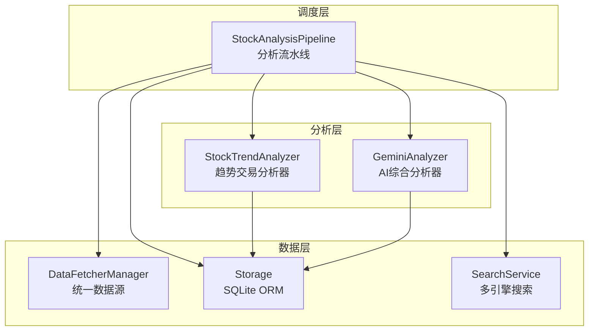
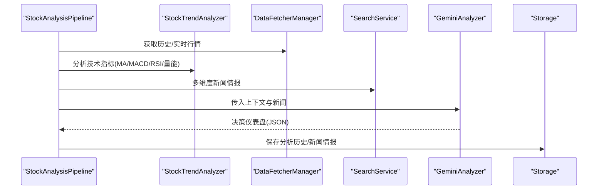
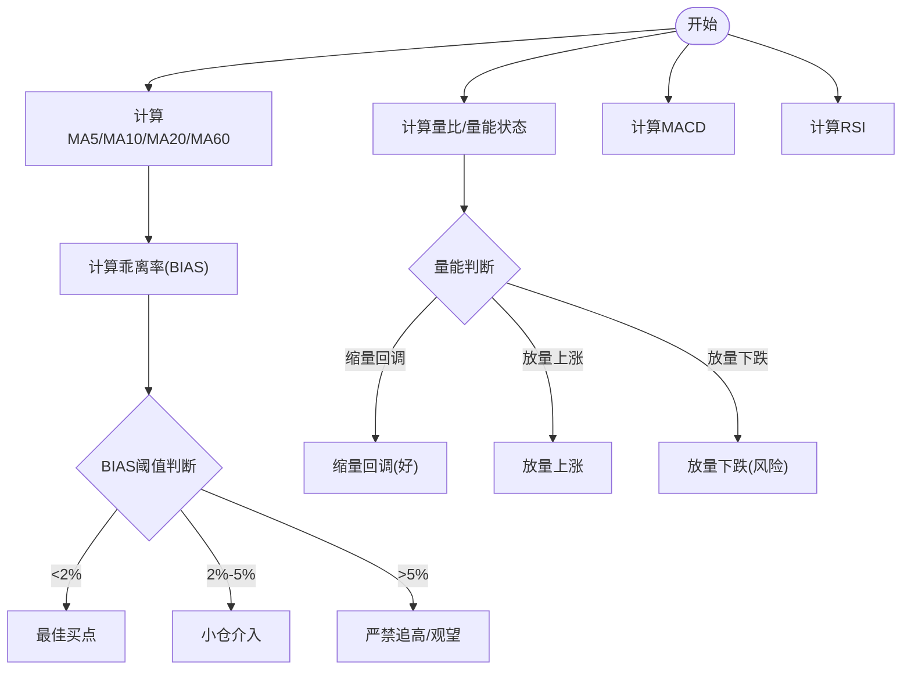
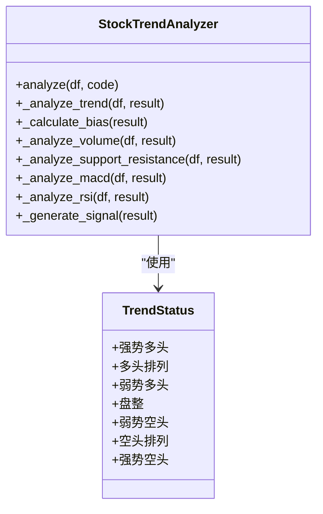
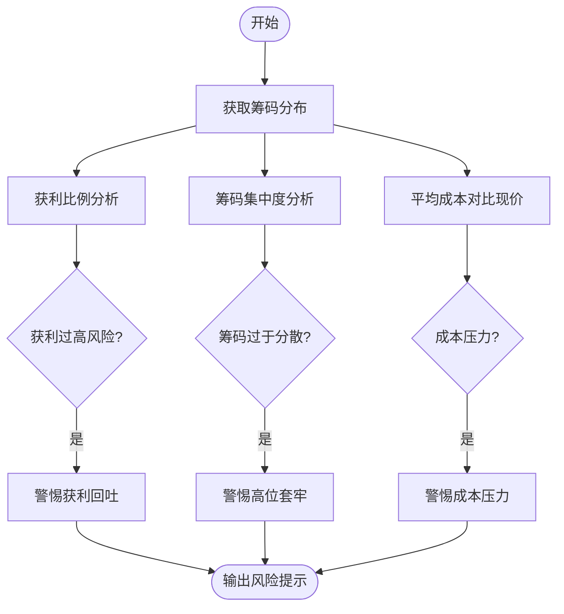
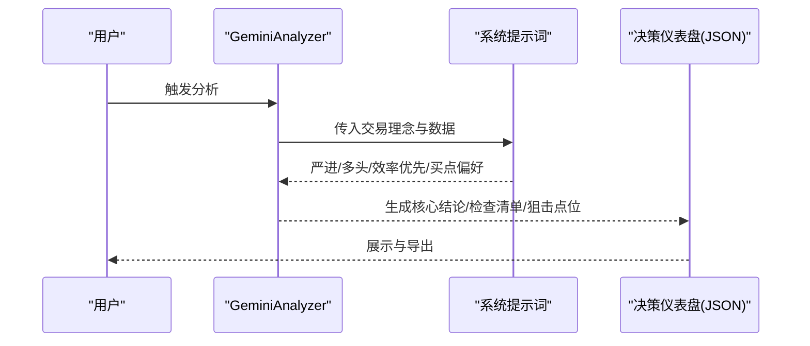
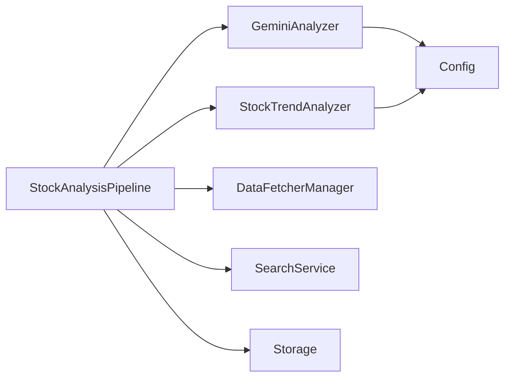

# 股票分析算法

<cite>
**本文引用的文件**
- [analyzer.py](file://src/analyzer.py)
- [stock_analyzer.py](file://src/stock_analyzer.py)
- [pipeline.py](file://src/core/pipeline.py)
- [config.py](file://src/config.py)
- [storage.py](file://src/storage.py)
- [market_analyzer.py](file://src/market_analyzer.py)
- [enums.py](file://src/enums.py)
- [search_service.py](file://src/search_service.py)
- [LLM配置指南.md](file://docs/LLM_CONFIG_GUIDE.md)
</cite>

## 目录
1. [简介](#简介)
2. [项目结构](#项目结构)
3. [核心组件](#核心组件)
4. [架构总览](#架构总览)
5. [详细组件分析](#详细组件分析)
6. [依赖关系分析](#依赖关系分析)
7. [性能考虑](#性能考虑)
8. [故障排查指南](#故障排查指南)
9. [结论](#结论)
10. [附录](#附录)

## 简介
本文件面向开发者与算法工程师，系统化梳理“股票分析算法模块”的实现与使用，覆盖以下主题：
- 技术指标计算：MA5/MA10/MA20、乖离率、量比、换手率等
- 趋势分析：多头排列检测、趋势强度评估、方向性判断
- 风险评估：筹码结构分析、获利比例、风险预警
- 交易理念量化：严进策略、效率优先、买点偏好、检查清单
- 参数配置与阈值调优：可调参数、默认阈值、性能优化
- 算法扩展与改进：新增指标与策略的集成方法

## 项目结构
本模块围绕“趋势交易分析器 + AI综合分析器 + 数据管线 + 存储层”组织，核心文件与职责如下：
- 趋势交易分析器：计算均线、MACD、RSI、量能、支撑压力、生成买入信号
- AI综合分析器：封装系统提示词与交易理念，结合技术面与消息面生成决策仪表盘
- 数据管线：统一调度数据获取、实时行情、筹码、趋势分析、新闻情报、AI分析与历史落库
- 存储层：SQLite ORM模型，支持断点续传、历史回测与审计

图表来源
- [stock_analyzer.py:171-745](file://src/stock_analyzer.py#L171-L745)
- [analyzer.py:334-800](file://src/analyzer.py#L334-L800)
- [pipeline.py:48-430](file://src/core/pipeline.py#L48-L430)
- [storage.py:623-746](file://src/storage.py#L623-L746)
- [search_service.py:1-200](file://src/search_service.py#L1-L200)

章节来源
- [pipeline.py:48-430](file://src/core/pipeline.py#L48-L430)
- [stock_analyzer.py:171-745](file://src/stock_analyzer.py#L171-L745)
- [analyzer.py:334-800](file://src/analyzer.py#L334-L800)
- [storage.py:623-746](file://src/storage.py#L623-L746)
- [search_service.py:1-200](file://src/search_service.py#L1-L200)

## 核心组件
- 趋势交易分析器（StockTrendAnalyzer）
  - 计算MA5/MA10/MA20/MA60、MACD、RSI
  - 乖离率计算与严进策略阈值
  - 量能分析（量比、缩量/放量）
  - 支撑压力（MA5/MA10/MA20）
  - 买入信号生成（综合评分与阈值）
- AI综合分析器（GeminiAnalyzer）
  - 系统提示词：严进策略、多头排列、效率优先、买点偏好、风险排查
  - 决策仪表盘：核心结论、数据透视、情报、作战计划
- 数据管线（StockAnalysisPipeline）
  - 实时行情、筹码分布、趋势分析、新闻情报、AI分析、历史落库
- 存储层（Storage）
  - 股票日线、新闻情报、分析历史、回测结果、LLM用量等

章节来源
- [stock_analyzer.py:171-745](file://src/stock_analyzer.py#L171-L745)
- [analyzer.py:334-800](file://src/analyzer.py#L334-L800)
- [pipeline.py:48-430](file://src/core/pipeline.py#L48-L430)
- [storage.py:623-746](file://src/storage.py#L623-L746)

## 架构总览
整体流程：数据管线获取历史与实时数据，趋势分析器计算技术指标，AI分析器结合消息面生成决策仪表盘，最终落库并支持回测。

图表来源
- [pipeline.py:183-430](file://src/core/pipeline.py#L183-L430)
- [stock_analyzer.py:205-262](file://src/stock_analyzer.py#L205-L262)
- [analyzer.py:334-800](file://src/analyzer.py#L334-L800)
- [storage.py:208-270](file://src/storage.py#L208-L270)

## 详细组件分析

### 技术指标计算与阈值判断
- 移动平均线（MA5/MA10/MA20/MA60）
  - 计算逻辑：滚动均值，MA60在数据不足时以MA20替代
  - 用途：多头/空头排列、趋势强度、支撑压力
- 乖离率（BIAS）
  - 公式：(现价 - MA5)/MA5 × 100%
  - 严进策略阈值：BIAS > 5% 禁止追高；BIAS ∈ [2%,5%] 小仓介入；BIAS < 2% 最佳买点
  - 强势趋势补偿：STRONG_BULL且强度≥70时放宽阈值
- 量比与换手率
  - 量比：当日成交量/5日均量
  - 缩量/放量阈值：量比 ≤ 0.7 缩量；量比 ≥ 1.5 放量
  - 量能状态：缩量回调（好）、放量上涨、放量下跌（风险）
- 换手率
  - 由实时行情提供，用于衡量流动性与活跃度
- MACD
  - 快慢线与柱状图，零轴穿越、金叉/死叉、多头/空头状态
- RSI
  - 短/中/长期RSI，超买/超卖阈值（70/30）

图表来源
- [stock_analyzer.py:264-337](file://src/stock_analyzer.py#L264-L337)
- [stock_analyzer.py:392-446](file://src/stock_analyzer.py#L392-L446)
- [stock_analyzer.py:480-582](file://src/stock_analyzer.py#L480-L582)

章节来源
- [stock_analyzer.py:264-337](file://src/stock_analyzer.py#L264-L337)
- [stock_analyzer.py:392-446](file://src/stock_analyzer.py#L392-L446)
- [stock_analyzer.py:480-582](file://src/stock_analyzer.py#L480-L582)

### 趋势分析算法
- 多头/空头排列
  - MA5 > MA10 > MA20：多头排列；MA5 < MA10 < MA20：空头排列
  - 发散判断：近期均线间距扩大视为强势
- 趋势强度
  - 基于均线间距变化率与相对幅度，给出0-100分制强度
- 方向性判断
  - 强势多头、多头、弱势多头、盘整、弱势空头、空头、强势空头

图表来源
- [stock_analyzer.py:32-41](file://src/stock_analyzer.py#L32-L41)
- [stock_analyzer.py:339-391](file://src/stock_analyzer.py#L339-L391)

章节来源
- [stock_analyzer.py:339-391](file://src/stock_analyzer.py#L339-L391)

### 风险评估算法
- 筹码结构
  - 获利比例、平均成本、筹码集中度（90%/70%）
  - 筹码健康度：健康/一般/警惕
- 风险预警
  - 股东/高管减持、业绩预亏/大幅下滑、监管处罚/立案调查、行业政策利空、大额解禁
- 严进策略与效率优先
  - 严进：BIAS阈值控制；效率优先：关注筹码集中度与获利比例

图表来源
- [analyzer.py:355-529](file://src/analyzer.py#L355-L529)

章节来源
- [analyzer.py:355-529](file://src/analyzer.py#L355-L529)

### 交易理念的量化实现
- 严进策略（不追高）
  - BIAS阈值：默认5%，STRONG_BULL且强度≥70时放宽
- 趋势交易（顺势而为）
  - 多头排列：MA5 > MA10 > MA20；均线发散优于粘合
- 效率优先（筹码结构）
  - 筹码集中度<15%视为集中；获利比例70-90%需警惕
- 买点偏好（回踩支撑）
  - 缩量回踩MA5/MA10；跌破MA20观望
- 决策仪表盘
  - 核心结论、数据透视、情报、作战计划、检查清单

图表来源
- [analyzer.py:355-529](file://src/analyzer.py#L355-L529)
- [analyzer.py:529-800](file://src/analyzer.py#L529-L800)

章节来源
- [analyzer.py:355-529](file://src/analyzer.py#L355-L529)
- [analyzer.py:529-800](file://src/analyzer.py#L529-L800)

### 算法参数配置与阈值调优
- 可调参数
  - BIAS阈值：从配置读取（默认5%），强势趋势可放宽
  - 量比阈值：缩量0.7、放量1.5
  - MA支撑容忍度：2%
  - RSI超买/超卖阈值：70/30
- 配置入口
  - 通过配置类读取环境变量，支持热更新股票池
- 调优建议
  - 严进策略：在震荡市提高BIAS阈值，降低追高风险
  - 量能偏好：优先缩量回调，过滤放量假突破
  - 筹码效率：关注90%集中度与获利比例，避免高位筹码密集

章节来源
- [stock_analyzer.py:184-200](file://src/stock_analyzer.py#L184-L200)
- [stock_analyzer.py:617-663](file://src/stock_analyzer.py#L617-L663)
- [config.py:31-580](file://src/config.py#L31-L580)

### 算法性能优化与复杂度
- 计算复杂度
  - 均线：O(N×窗口)；MACD/RSI：O(N×周期)；量能：O(N)
- 优化策略
  - 断点续传：按自然日检查已有数据，避免重复抓取
  - 实时增强：仅在开启实时行情时合并今日OHLC与趋势MA
  - 并发控制：最大工作线程数可控，避免API限流
  - 缓存与熔断：实时行情缓存、搜索引擎熔断器
- 存储优化
  - 唯一索引与复合索引，加速查询与去重
  - 分表与归档：分析历史、回测结果按时间分区

章节来源
- [pipeline.py:128-182](file://src/core/pipeline.py#L128-L182)
- [pipeline.py:280-296](file://src/core/pipeline.py#L280-L296)
- [storage.py:747-800](file://src/storage.py#L747-L800)

### 新算法添加与改进指导
- 新增技术指标
  - 在趋势分析器中增加计算步骤与结果字段，更新评分权重
  - 在AI提示词中补充解释与阈值说明
- 新增交易理念
  - 在系统提示词中新增理念与阈值，更新检查清单
- 新增数据源
  - 通过数据管线注入，保持上下文结构一致性
- 回测与验证
  - 使用历史回测引擎评估新策略的胜率、准确率与收益

章节来源
- [stock_analyzer.py:583-745](file://src/stock_analyzer.py#L583-L745)
- [analyzer.py:355-529](file://src/analyzer.py#L355-L529)
- [pipeline.py:48-120](file://src/core/pipeline.py#L48-L120)

## 依赖关系分析
- 组件耦合
  - 趋势分析器与存储层：通过历史数据DataFrame交互
  - 数据管线与AI分析器：统一上下文增强与结果落库
  - 搜索服务与AI分析器：新闻情报注入与格式化
- 外部依赖
  - 大模型（Gemini/OpenAI兼容）：通过配置与重试机制保障可用性
  - 多搜索引擎：Bocha/Tavily/SerpAPI/Brave等，负载均衡与熔断保护

图表来源
- [pipeline.py:48-120](file://src/core/pipeline.py#L48-L120)
- [analyzer.py:531-620](file://src/analyzer.py#L531-L620)
- [config.py:31-580](file://src/config.py#L31-L580)

章节来源
- [pipeline.py:48-120](file://src/core/pipeline.py#L48-L120)
- [analyzer.py:531-620](file://src/analyzer.py#L531-L620)
- [config.py:31-580](file://src/config.py#L31-L580)

## 性能考虑
- 并发与限流
  - 最大工作线程数与请求间隔，避免API限流
  - 搜索引擎重试与熔断，提升稳定性
- 数据缓存
  - 实时行情缓存与冷却时间，降低重复请求
- 存储索引
  - 复合索引与唯一约束，提升查询与插入性能
- 回测引擎
  - 可配置评估窗口与引擎版本，平衡精度与性能

## 故障排查指南
- AI分析不可用
  - 检查Gemini/OpenAI Key配置与网络代理设置
  - 查看重试与模型切换日志
- 搜索服务异常
  - 多Key负载均衡与错误计数，检查配额与网络
- 实时行情/筹码获取失败
  - 数据源优先级与熔断冷却时间，必要时关闭实时增强
- 配置校验
  - 使用配置校验函数输出缺失项提示

章节来源
- [analyzer.py:567-620](file://src/analyzer.py#L567-L620)
- [search_service.py:52-75](file://src/search_service.py#L52-L75)
- [config.py:507-546](file://src/config.py#L507-L546)

## 结论
本模块将“严进策略、趋势交易、效率优先、买点偏好”等交易理念以算法形式落地，结合趋势指标与消息面生成可执行的决策仪表盘。通过可调阈值、多数据源与AI融合，既保证策略一致性，也兼顾实盘鲁棒性。建议在实盘前进行充分的历史回测与参数调优，并持续监控AI可用性与数据源稳定性。

## 附录
- 报告类型
  - 精简/完整/简洁三种报告类型，适配不同场景
- LLM配置
  - 支持多渠道与YAML高级配置，满足不同部署需求

章节来源
- [enums.py:13-51](file://src/enums.py#L13-L51)
- [LLM配置指南.md:1-204](file://docs/LLM_CONFIG_GUIDE.md#L1-L204)