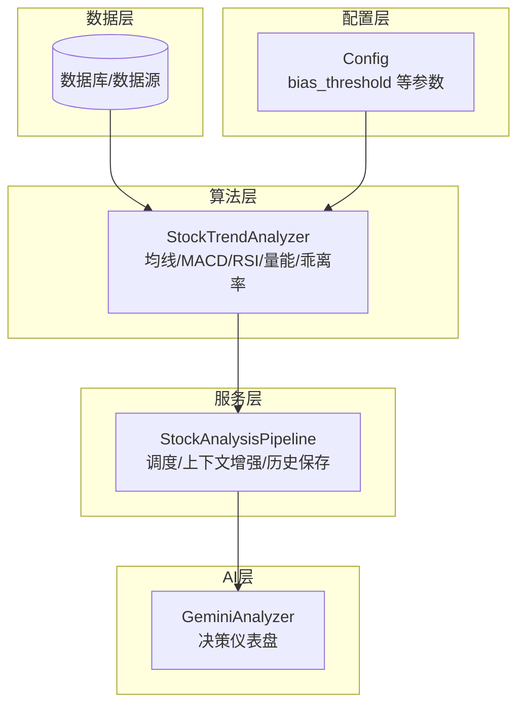
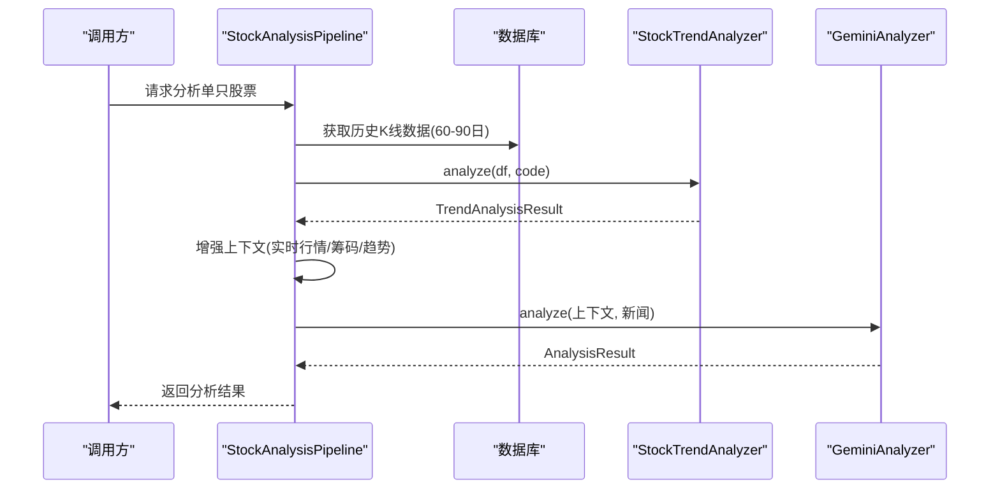
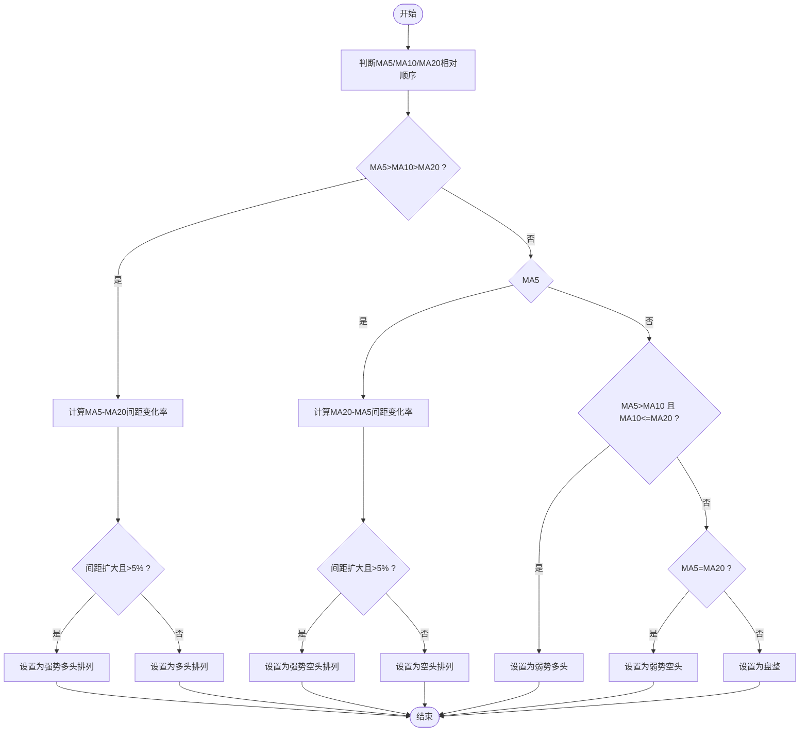
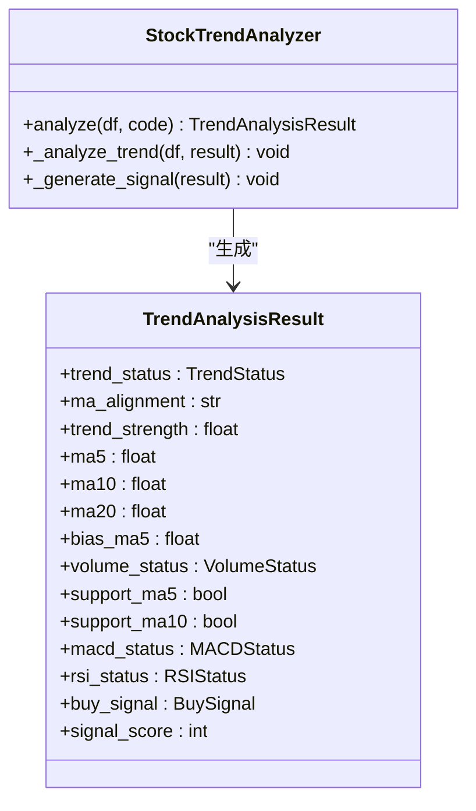
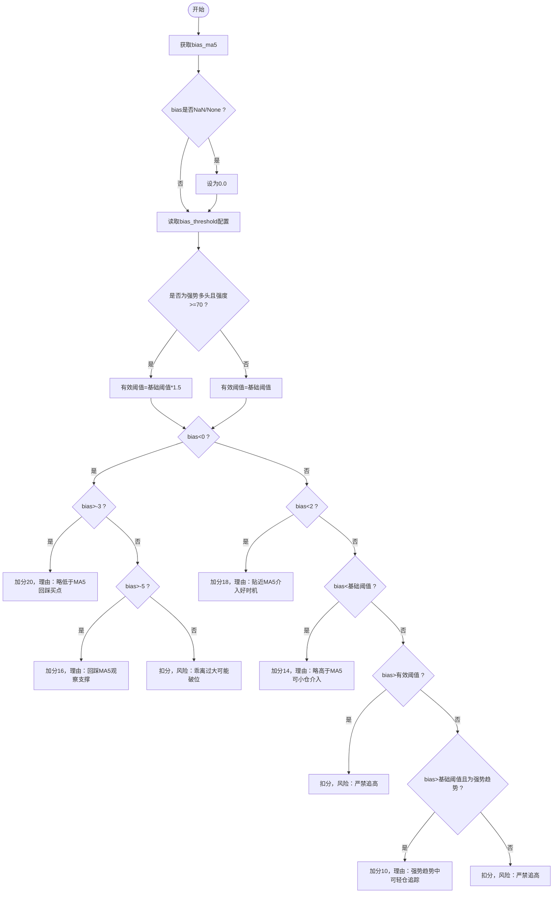
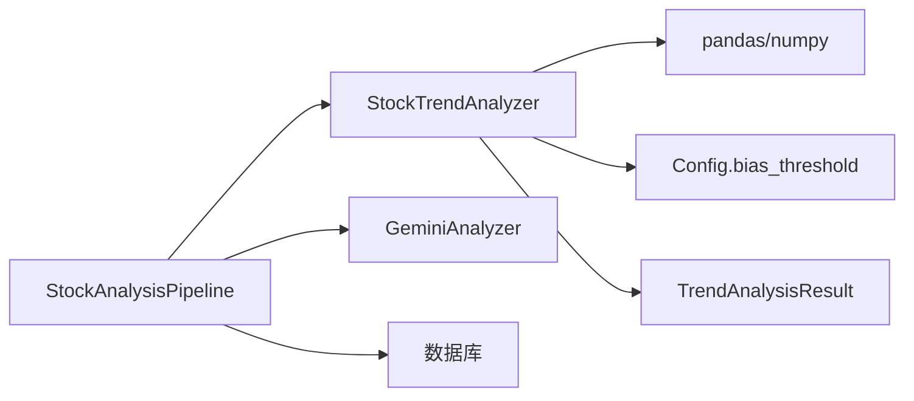

# 趋势分析算法

<cite>
**本文档引用的文件**
- [stock_analyzer.py](file://src/stock_analyzer.py)
- [analyzer.py](file://src/analyzer.py)
- [pipeline.py](file://src/core/pipeline.py)
- [config.py](file://src/config.py)
- [analysis_service.py](file://src/services/analysis_service.py)
- [storage.py](file://src/storage.py)
- [test_stock_analyzer_bias.py](file://tests/test_stock_analyzer_bias.py)
</cite>

## 目录
1. [简介](#简介)
2. [项目结构](#项目结构)
3. [核心组件](#核心组件)
4. [架构总览](#架构总览)
5. [详细组件分析](#详细组件分析)
6. [依赖关系分析](#依赖关系分析)
7. [性能考量](#性能考量)
8. [故障排除指南](#故障排除指南)
9. [结论](#结论)
10. [附录](#附录)

## 简介
本文件针对趋势分析算法模块进行深入技术文档编写，重点覆盖：
- 均线排列判断算法：多头排列(MA5>MA10>MA20)、空头排列(MA5<MA10<MA20)与盘整状态的判定逻辑
- 趋势强度评估：均线间距扩大检测、趋势持续性判断与强度评分计算
- 趋势状态分类体系：强势多头、多头排列、弱势多头、盘整、弱势空头、空头排列、强势空头的定义与判断标准
- 时间窗口选择、历史数据验证与异常值处理机制
- 趋势参数调优指南与准确性验证方法

## 项目结构
趋势分析算法位于核心分析模块中，采用分层设计：
- 数据层：从数据库或数据源获取历史K线数据
- 算法层：StockTrendAnalyzer 实现均线、MACD、RSI、量能等指标计算与趋势判断
- 服务层：Pipeline 调度器整合实时行情、筹码分布、趋势分析结果，并驱动AI综合分析
- 配置层：通过 Config 管理参数阈值（如乖离率阈值）

**图表来源**
- [stock_analyzer.py:171-848](file://src/stock_analyzer.py#L171-L848)
- [pipeline.py:48-120](file://src/core/pipeline.py#L48-L120)
- [config.py:31-580](file://src/config.py#L31-L580)
- [analyzer.py:334-530](file://src/analyzer.py#L334-L530)

**章节来源**
- [stock_analyzer.py:1-18](file://src/stock_analyzer.py#L1-L18)
- [pipeline.py:48-120](file://src/core/pipeline.py#L48-L120)
- [config.py:31-120](file://src/config.py#L31-L120)

## 核心组件
- StockTrendAnalyzer：实现均线排列判断、趋势强度评估、乖离率计算、量能分析、支撑压力识别、MACD与RSI分析以及综合信号生成
- TrendAnalysisResult：封装趋势分析结果，包含趋势状态、强度、均线数据、乖离率、量能、支撑压力、MACD/RSI状态及最终买卖信号
- Config：提供 bias_threshold 等关键参数，影响乖离率阈值与信号生成
- StockAnalysisPipeline：在分析流程中调用趋势分析器，整合实时行情与筹码分布，驱动AI分析

**章节来源**
- [stock_analyzer.py:32-169](file://src/stock_analyzer.py#L32-L169)
- [config.py:31-120](file://src/config.py#L31-L120)
- [pipeline.py:87-120](file://src/core/pipeline.py#L87-L120)

## 架构总览
趋势分析算法在整体分析流程中的位置如下：

**图表来源**
- [pipeline.py:280-430](file://src/core/pipeline.py#L280-L430)
- [stock_analyzer.py:205-262](file://src/stock_analyzer.py#L205-L262)
- [analyzer.py:334-530](file://src/analyzer.py#L334-L530)

## 详细组件分析

### 均线排列判断算法
- 多头排列(MA5>MA10>MA20)：判断当前MA5、MA10、MA20三线的相对位置，若满足严格递减则进入多头排列
- 空头排列(MA5<MA10<MA20)：判断当前三线严格递增则进入空头排列
- 盘整状态：其他情况（如MA5在MA10两侧、MA10与MA20粘合等）归类为盘整
- 强势/弱势区分：在多头/空头排列基础上，进一步比较最近5根K线的MA5-MA20间距变化率，若间距扩大且超过阈值（5%）则标记为强势；否则为普通排列

**图表来源**
- [stock_analyzer.py:339-391](file://src/stock_analyzer.py#L339-L391)

**章节来源**
- [stock_analyzer.py:339-391](file://src/stock_analyzer.py#L339-L391)

### 趋势强度评估算法
- 均线间距扩大检测：通过比较当前MA5-MA20与前5根K线的MA5-MA20间距变化率，若当前间距大于前值且超过5%，则认为趋势发散，强度提升
- 趋势持续性判断：基于间距变化率的持续性（连续多日扩大）与绝对幅度（>5%）共同决定强度等级
- 强度评分计算：不同趋势状态赋予不同基础分值，结合乖离率、量能、支撑有效性、MACD与RSI等因子进行加权，最终得到0-100的综合评分

**图表来源**
- [stock_analyzer.py:82-169](file://src/stock_analyzer.py#L82-L169)
- [stock_analyzer.py:205-262](file://src/stock_analyzer.py#L205-L262)

**章节来源**
- [stock_analyzer.py:339-391](file://src/stock_analyzer.py#L339-L391)
- [stock_analyzer.py:583-745](file://src/stock_analyzer.py#L583-L745)

### 趋势状态分类体系
- 强势多头：MA5>MA10>MA20 且间距扩大且>5%，强度90
- 多头排列：MA5>MA10>MA20，强度75
- 弱势多头：MA5>MA10 但 MA10≤MA20，强度55
- 盘整：其他情况，强度50
- 弱势空头：MA5<MA10 但 MA10≥MA20，强度40
- 空头排列：MA5<MA10<MA20，强度25
- 强势空头：MA5<MA10<MA20 且间距扩大且>5%，强度10

**章节来源**
- [stock_analyzer.py:32-41](file://src/stock_analyzer.py#L32-L41)
- [stock_analyzer.py:339-391](file://src/stock_analyzer.py#L339-L391)

### 乖离率与追高策略
- 乖离率计算：(现价 - MA5) / MA5 × 100%
- 严进策略：乖离率超过阈值（默认5%，可通过配置调整）不追高
- 强势趋势补偿：当处于强势多头且强度≥70时，有效阈值提高至1.5倍（如原阈值5%，则有效阈值7.5%），允许适度偏高乖离

**图表来源**
- [stock_analyzer.py:617-663](file://src/stock_analyzer.py#L617-L663)
- [test_stock_analyzer_bias.py:75-179](file://tests/test_stock_analyzer_bias.py#L75-L179)

**章节来源**
- [stock_analyzer.py:392-408](file://src/stock_analyzer.py#L392-L408)
- [stock_analyzer.py:617-663](file://src/stock_analyzer.py#L617-L663)
- [test_stock_analyzer_bias.py:75-179](file://tests/test_stock_analyzer_bias.py#L75-L179)

### 量能分析与支撑压力
- 量能状态：缩量回调（最佳）、放量上涨、量能正常、缩量上涨、放量下跌（最差）
- 支撑压力：MA5/MA10/MA20附近回踩视为支撑；近期高点作为压力位
- 量比阈值：当日成交量/5日均量，缩量阈值0.7，放量阈值1.5

**章节来源**
- [stock_analyzer.py:409-479](file://src/stock_analyzer.py#L409-L479)

### MACD与RSI辅助判断
- MACD：零轴上金叉（最强）、金叉、多头、上穿零轴、死叉、空头、下穿零轴等状态
- RSI：超买（>70）、强势（50-70）、中性（40-60）、弱势（30-40）、超卖（<30）

**章节来源**
- [stock_analyzer.py:480-582](file://src/stock_analyzer.py#L480-L582)

### 时间窗口选择与历史数据验证
- 时间窗口：趋势分析使用约60个交易日的历史数据（MA60需要至少60根K线），并以最近5根K线进行间距变化率对比
- 历史数据验证：若数据不足（如少于20条）则返回风险提示并终止分析
- 异常值处理：对NaN/None的乖离率进行防御性置零；对量比/价格等缺失字段进行安全处理

**章节来源**
- [stock_analyzer.py:218-222](file://src/stock_analyzer.py#L218-L222)
- [stock_analyzer.py:619-620](file://src/stock_analyzer.py#L619-L620)

### 参数调优指南
- 乖离率阈值（bias_threshold）：默认5%，可通过配置调整；在强势多头场景下自动放宽至7.5%
- 量能阈值：缩量0.7、放量1.5，可根据市场风格调整
- 趋势强度阈值：间距扩大>5%判定为发散，可按回测结果微调
- 评分权重：趋势基础分30分、乖离率20分、量能15分、支撑10分、MACD15分、RSI10分，合计100分

**章节来源**
- [config.py:31-120](file://src/config.py#L31-L120)
- [stock_analyzer.py:599-745](file://src/stock_analyzer.py#L599-L745)

### 准确性验证方法
- 单元测试：针对乖离率边界条件（NaN、负值、边界值）进行测试，验证信号分支与风险提示
- 回测验证：结合历史数据对不同趋势状态下的胜率、盈亏比进行统计评估
- A/B测试：在不同市场环境下对比不同参数组合的表现

**章节来源**
- [test_stock_analyzer_bias.py:75-179](file://tests/test_stock_analyzer_bias.py#L75-L179)

## 依赖关系分析

**图表来源**
- [stock_analyzer.py:19-27](file://src/stock_analyzer.py#L19-L27)
- [pipeline.py:87-120](file://src/core/pipeline.py#L87-L120)
- [config.py:31-120](file://src/config.py#L31-L120)

**章节来源**
- [stock_analyzer.py:19-27](file://src/stock_analyzer.py#L19-L27)
- [pipeline.py:87-120](file://src/core/pipeline.py#L87-L120)

## 性能考量
- 计算复杂度：均线滚动计算O(N×窗口)，MACD/RSI O(N)，整体O(N)
- 内存占用：DataFrame缓存近60-90日数据，建议在大数据量场景下分批处理
- 并发控制：Pipeline通过ThreadPoolExecutor控制最大并发，避免API限流
- 缓存策略：实时行情与筹码分布采用熔断保护与缓存，减少重复请求

[本节为通用指导，无需特定文件引用]

## 故障排除指南
- 数据不足：若历史数据少于20条，分析器会返回风险提示，建议延长回溯周期
- 乖离率异常：NaN/None将被置零处理，避免影响整体评分
- 量能缺失：若当日量能缺失，量能分析将降级为“量能正常”，不影响趋势判断
- 参数不生效：确认配置文件中 bias_threshold 已正确设置并被读取

**章节来源**
- [stock_analyzer.py:218-222](file://src/stock_analyzer.py#L218-L222)
- [stock_analyzer.py:619-620](file://src/stock_analyzer.py#L619-L620)

## 结论
本趋势分析算法以MA5/MA10/MA20为核心，结合间距扩大检测、量能形态、支撑压力、MACD与RSI等多因子，形成稳健的趋势判断与信号生成体系。通过可调参数与严格的异常处理机制，能够在不同市场环境下保持较高稳定性与可解释性。

[本节为总结性内容，无需特定文件引用]

## 附录
- 趋势状态与强度对照表：见“趋势状态分类体系”
- 参数配置参考：见“参数调优指南”
- 测试用例参考：见“准确性验证方法”

[本节为补充内容，无需特定文件引用]