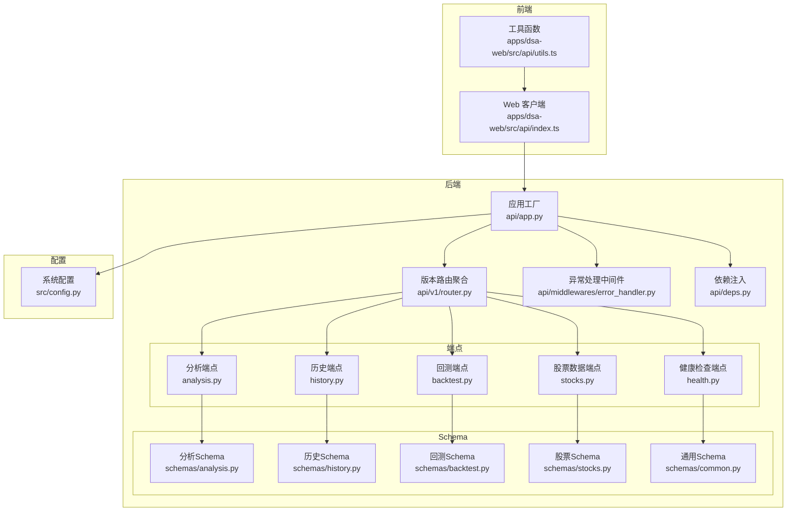
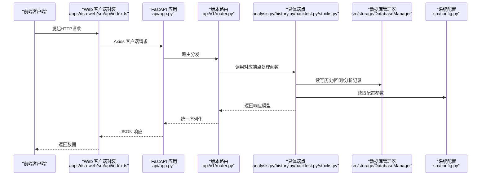
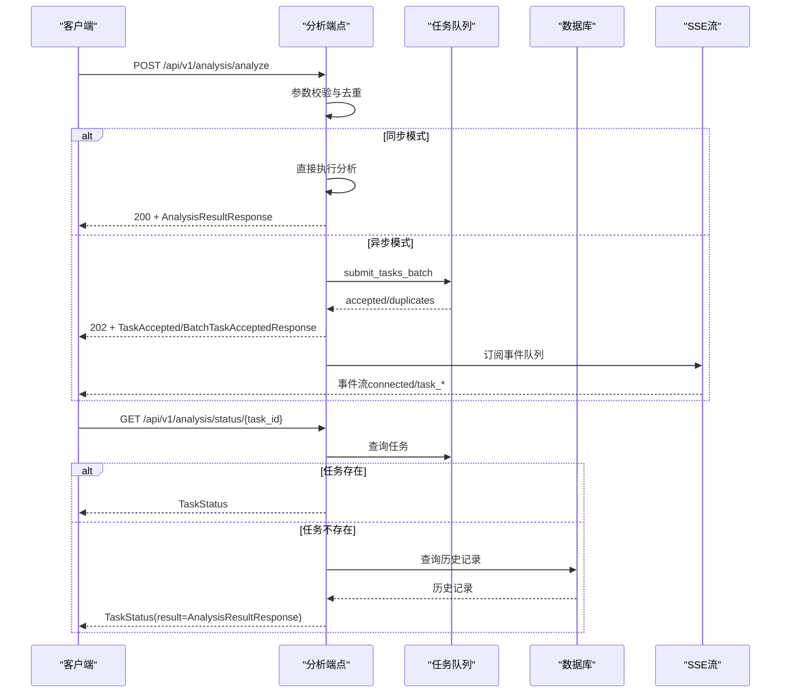
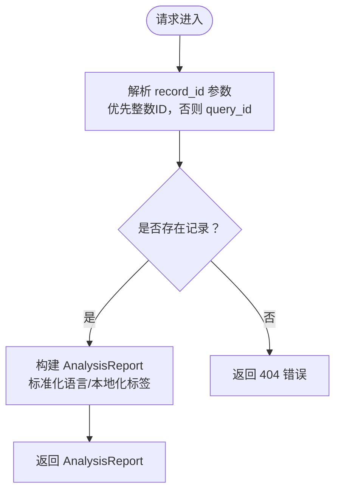
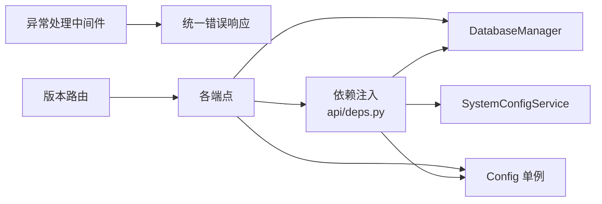

# API参考文档

<cite>
**本文档引用的文件**
- [api/app.py](file://api/app.py)
- [api/v1/router.py](file://api/v1/router.py)
- [api/deps.py](file://api/deps.py)
- [api/middlewares/error_handler.py](file://api/middlewares/error_handler.py)
- [api/v1/endpoints/analysis.py](file://api/v1/endpoints/analysis.py)
- [api/v1/endpoints/history.py](file://api/v1/endpoints/history.py)
- [api/v1/endpoints/backtest.py](file://api/v1/endpoints/backtest.py)
- [api/v1/endpoints/stocks.py](file://api/v1/endpoints/stocks.py)
- [api/v1/endpoints/health.py](file://api/v1/endpoints/health.py)
- [api/v1/schemas/analysis.py](file://api/v1/schemas/analysis.py)
- [api/v1/schemas/history.py](file://api/v1/schemas/history.py)
- [api/v1/schemas/backtest.py](file://api/v1/schemas/backtest.py)
- [api/v1/schemas/stocks.py](file://api/v1/schemas/stocks.py)
- [api/v1/schemas/common.py](file://api/v1/schemas/common.py)
- [src/config.py](file://src/config.py)
- [apps/dsa-web/src/api/index.ts](file://apps/dsa-web/src/api/index.ts)
- [apps/dsa-web/src/api/utils.ts](file://apps/dsa-web/src/api/utils.ts)
</cite>

## 目录
1. [简介](#简介)
2. [项目结构](#项目结构)
3. [核心组件](#核心组件)
4. [架构总览](#架构总览)
5. [详细组件分析](#详细组件分析)
6. [依赖分析](#依赖分析)
7. [性能考虑](#性能考虑)
8. [故障排查指南](#故障排查指南)
9. [结论](#结论)
10. [附录](#附录)

## 简介
本文件为“每日股票分析”系统的完整API参考文档，覆盖分析接口、历史查询接口、回测接口、股票数据接口的REST规范，包括HTTP方法、URL模式、请求/响应模式、认证方式、参数定义、数据类型、验证规则、默认值、错误码说明、异常处理机制、版本控制策略与兼容性、使用限制与性能考虑，以及前端集成示例与最佳实践。

## 项目结构
- 后端采用 FastAPI，版本化路由位于 `/api/v1`，包含分析、历史、回测、股票数据、健康检查等子模块。
- 中间件提供统一异常处理与CORS配置。
- 依赖注入模块提供数据库会话、配置与系统服务的共享实例。
- 前端位于 `apps/dsa-web`，通过Axios客户端访问后端API。

**图表来源**
- [api/app.py:1-209](file://api/app.py#L1-L209)
- [api/v1/router.py:1-72](file://api/v1/router.py#L1-L72)
- [api/middlewares/error_handler.py:1-129](file://api/middlewares/error_handler.py#L1-L129)
- [api/deps.py:1-72](file://api/deps.py#L1-L72)
- [api/v1/endpoints/analysis.py:1-694](file://api/v1/endpoints/analysis.py#L1-L694)
- [api/v1/endpoints/history.py:1-452](file://api/v1/endpoints/history.py#L1-L452)
- [api/v1/endpoints/backtest.py:1-161](file://api/v1/endpoints/backtest.py#L1-L161)
- [api/v1/endpoints/stocks.py:1-390](file://api/v1/endpoints/stocks.py#L1-L390)
- [api/v1/endpoints/health.py:1-35](file://api/v1/endpoints/health.py#L1-L35)
- [api/v1/schemas/analysis.py:1-291](file://api/v1/schemas/analysis.py#L1-L291)
- [api/v1/schemas/history.py:1-211](file://api/v1/schemas/history.py#L1-L211)
- [api/v1/schemas/backtest.py:1-95](file://api/v1/schemas/backtest.py#L1-L95)
- [api/v1/schemas/stocks.py:1-112](file://api/v1/schemas/stocks.py#L1-L112)
- [api/v1/schemas/common.py:1-79](file://api/v1/schemas/common.py#L1-L79)
- [src/config.py:1-580](file://src/config.py#L1-L580)
- [apps/dsa-web/src/api/index.ts:1-30](file://apps/dsa-web/src/api/index.ts#L1-L30)
- [apps/dsa-web/src/api/utils.ts:1-14](file://apps/dsa-web/src/api/utils.ts#L1-L14)

**章节来源**
- [api/app.py:1-209](file://api/app.py#L1-L209)
- [api/v1/router.py:1-72](file://api/v1/router.py#L1-L72)

## 核心组件
- 应用工厂与生命周期：创建FastAPI实例、注册CORS、认证中间件、路由与错误处理器；挂载静态资源与SPA回退。
- 版本路由聚合：统一前缀 `/api/v1`，聚合各模块路由。
- 依赖注入：提供数据库会话、配置与系统服务实例。
- 全局异常处理：统一HTTP异常、请求验证异常与通用异常的响应格式。
- 健康检查：对外暴露 `/api/health` 与 `/api/v1/health`。

**章节来源**
- [api/app.py:48-204](file://api/app.py#L48-L204)
- [api/v1/router.py:14-71](file://api/v1/router.py#L14-L71)
- [api/deps.py:23-72](file://api/deps.py#L23-L72)
- [api/middlewares/error_handler.py:70-129](file://api/middlewares/error_handler.py#L70-L129)
- [api/v1/endpoints/health.py:21-34](file://api/v1/endpoints/health.py#L21-L34)

## 架构总览
系统采用前后端分离架构，后端提供REST API，前端通过Axios客户端发起请求。后端通过依赖注入获取数据库会话与配置，统一异常处理保证错误响应一致性。

**图表来源**
- [apps/dsa-web/src/api/index.ts:5-29](file://apps/dsa-web/src/api/index.ts#L5-L29)
- [api/app.py:48-204](file://api/app.py#L48-L204)
- [api/v1/router.py:14-71](file://api/v1/router.py#L14-L71)
- [api/v1/endpoints/analysis.py:88-300](file://api/v1/endpoints/analysis.py#L88-L300)
- [api/v1/endpoints/history.py:59-125](file://api/v1/endpoints/history.py#L59-L125)
- [api/v1/endpoints/backtest.py:38-57](file://api/v1/endpoints/backtest.py#L38-L57)
- [api/v1/endpoints/stocks.py:253-308](file://api/v1/endpoints/stocks.py#L253-L308)
- [src/config.py:232-244](file://src/config.py#L232-L244)

## 详细组件分析

### 分析接口
- 触发分析：POST `/api/v1/analysis/analyze`
  - 请求体：AnalyzeRequest（支持单只或批量股票，报告类型、是否强制刷新、是否异步）
  - 响应：AnalysisResultResponse（同步）或 TaskAccepted/BatchTaskAcceptedResponse（异步）
  - 状态码：200（同步完成）、202（异步已接受）、400/409/500
  - 特性：防重复提交、异步队列、SSE实时推送
- 查询任务状态：GET `/api/v1/analysis/status/{task_id}`
  - 响应：TaskStatus（包含进度、结果或错误）
  - 状态码：200/404/500
- 任务列表：GET `/api/v1/analysis/tasks`
  - 查询参数：status（逗号分隔）、limit（1-100）
  - 响应：TaskListResponse
- 任务SSE流：GET `/api/v1/analysis/tasks/stream`
  - 事件类型：connected、task_created、task_started、task_completed、task_failed、heartbeat

**图表来源**
- [api/v1/endpoints/analysis.py:72-570](file://api/v1/endpoints/analysis.py#L72-L570)
- [api/v1/schemas/analysis.py:27-291](file://api/v1/schemas/analysis.py#L27-L291)

**章节来源**
- [api/v1/endpoints/analysis.py:72-570](file://api/v1/endpoints/analysis.py#L72-L570)
- [api/v1/schemas/analysis.py:27-291](file://api/v1/schemas/analysis.py#L27-L291)

### 历史查询接口
- 历史列表：GET `/api/v1/history`
  - 查询参数：stock_code、start_date、end_date、page（≥1）、limit（1-100）
  - 响应：HistoryListResponse
- 删除历史记录：DELETE `/api/v1/history`
  - 请求体：DeleteHistoryRequest（record_ids）
  - 响应：DeleteHistoryResponse
- 历史详情：GET `/api/v1/history/{record_id_or_query_id}`
  - 响应：AnalysisReport（含meta/summary/strategy/details）
- 关联新闻：GET `/api/v1/history/{record_id_or_query_id}/news?limit=1-100`
  - 响应：NewsIntelResponse
- Markdown报告：GET `/api/v1/history/{record_id_or_query_id}/markdown`
  - 响应：MarkdownReportResponse

**图表来源**
- [api/v1/endpoints/history.py:184-327](file://api/v1/endpoints/history.py#L184-L327)
- [api/v1/schemas/history.py:112-211](file://api/v1/schemas/history.py#L112-L211)

**章节来源**
- [api/v1/endpoints/history.py:49-452](file://api/v1/endpoints/history.py#L49-L452)
- [api/v1/schemas/history.py:17-211](file://api/v1/schemas/history.py#L17-L211)

### 回测接口
- 触发回测：POST `/api/v1/backtest/run`
  - 请求体：BacktestRunRequest（code、force、eval_window_days、min_age_days、limit）
  - 响应：BacktestRunResponse（processed/saved/completed/insufficient/errors）
- 回测结果：GET `/api/v1/backtest/results?code=&eval_window_days=&page=&limit=1-200`
  - 响应：BacktestResultsResponse
- 整体表现：GET `/api/v1/backtest/performance?eval_window_days=`
  - 响应：PerformanceMetrics
- 单股表现：GET `/api/v1/backtest/performance/{code}?eval_window_days=`
  - 响应：PerformanceMetrics

**章节来源**
- [api/v1/endpoints/backtest.py:28-161](file://api/v1/endpoints/backtest.py#L28-L161)
- [api/v1/schemas/backtest.py:11-95](file://api/v1/schemas/backtest.py#L11-L95)

### 股票数据接口
- 图片提取股票代码：POST `/api/v1/stocks/extract-from-image`
  - 表单字段：file（JPEG/PNG/WebP/GIF，≤5MB），include_raw（是否包含原始LLM响应）
  - 响应：ExtractFromImageResponse（codes/items/raw_text）
- 解析导入：POST `/api/v1/stocks/parse-import`
  - 支持：multipart/form-data（file）或 application/json（{"text": "..." }）
  - 响应：ExtractFromImageResponse
- 实时行情：GET `/api/v1/stocks/{stock_code}/quote`
  - 响应：StockQuote
- 历史K线：GET `/api/v1/stocks/{stock_code}/history?period=(daily|weekly|monthly)&days=1-365`
  - 响应：StockHistoryResponse

**章节来源**
- [api/v1/endpoints/stocks.py:47-390](file://api/v1/endpoints/stocks.py#L47-L390)
- [api/v1/schemas/stocks.py:17-112](file://api/v1/schemas/stocks.py#L17-L112)

### 健康检查接口
- GET `/api/health` 与 GET `/api/v1/health`
  - 响应：HealthResponse（status、timestamp）

**章节来源**
- [api/app.py:161-173](file://api/app.py#L161-L173)
- [api/v1/endpoints/health.py:21-34](file://api/v1/endpoints/health.py#L21-L34)
- [api/v1/schemas/common.py:32-45](file://api/v1/schemas/common.py#L32-L45)

## 依赖分析
- 端点依赖：各端点通过依赖注入获取数据库管理器、配置与系统服务实例。
- 异常处理：全局中间件捕获未处理异常，统一返回 ErrorResponse 格式。
- CORS：支持多Origin白名单，可通过环境变量扩展或允许全部（开发/演示）。
- 认证：可选运行时认证（通过WebUI设置页面启用/关闭），认证中间件在应用工厂中注册。

**图表来源**
- [api/deps.py:23-72](file://api/deps.py#L23-L72)
- [api/middlewares/error_handler.py:70-129](file://api/middlewares/error_handler.py#L70-L129)
- [api/app.py:108-115](file://api/app.py#L108-L115)

**章节来源**
- [api/deps.py:23-72](file://api/deps.py#L23-L72)
- [api/middlewares/error_handler.py:70-129](file://api/middlewares/error_handler.py#L70-L129)
- [api/app.py:82-106](file://api/app.py#L82-L106)

## 性能考虑
- 异步分析：POST /api/v1/analysis/analyze 支持异步模式，避免阻塞请求。
- SSE 实时推送：/api/v1/analysis/tasks/stream 提供低延迟状态更新。
- 任务队列：防重复提交与批量处理，减少重复工作。
- 数据库访问：端点通过依赖注入获取会话，避免跨请求共享状态。
- 前端缓存：Axios客户端设置超时与凭证，合理利用浏览器缓存与静态资源。

**章节来源**
- [api/v1/endpoints/analysis.py:157-232](file://api/v1/endpoints/analysis.py#L157-L232)
- [apps/dsa-web/src/api/index.ts:5-12](file://apps/dsa-web/src/api/index.ts#L5-L12)

## 故障排查指南
- 通用错误响应：统一包含 error、message、detail 字段，便于前端解析。
- HTTP异常：HTTPException 将被转换为 JSONResponse，detail 若为dict则原样透传。
- 请求验证异常：422，detail为验证错误数组。
- 未处理异常：500，记录堆栈并在调试模式下返回detail。
- 常见问题定位：
  - 参数校验失败：检查请求体与查询参数类型、范围与必填项。
  - 资源不存在：确认ID或query_id正确，或记录是否过期。
  - 服务器内部错误：查看后端日志与堆栈信息。

**章节来源**
- [api/middlewares/error_handler.py:82-128](file://api/middlewares/error_handler.py#L82-L128)

## 结论
本API文档提供了从接口规范到实现细节的完整参考，涵盖分析、历史、回测与股票数据四大模块，明确了参数、响应、错误与异常处理机制。版本化路由与统一异常处理保障了系统的稳定性与可维护性。前端通过Axios客户端可无缝对接，配合SSE与异步任务实现高效的数据分析与展示。

## 附录

### API版本控制与兼容性
- 版本前缀：/api/v1
- 版本策略：遵循语义化版本，新增字段向后兼容，移除字段需在新版本中处理。
- 兼容性：历史接口保留，新增接口以新路径提供，避免破坏既有客户端。

**章节来源**
- [api/v1/router.py:17-71](file://api/v1/router.py#L17-L71)

### 认证与安全
- 认证方式：可选运行时认证（通过WebUI设置页面启用/关闭）。
- CORS：允许Origin白名单，开发/演示可开启全部允许（谨慎使用）。
- 前端凭证：Axios客户端设置 withCredentials 与 Content-Type。

**章节来源**
- [api/app.py:71-106](file://api/app.py#L71-L106)
- [apps/dsa-web/src/api/index.ts:5-12](file://apps/dsa-web/src/api/index.ts#L5-L12)

### 使用限制与速率限制
- 速率限制：系统配置中包含请求间隔、重试与并发限制参数，建议结合上游数据源限流策略使用。
- 并发控制：max_workers 控制并发，避免上游API限流或封禁。
- 代理与NO_PROXY：自动设置国内数据源排除，避免代理导致的行情获取失败。

**章节来源**
- [src/config.py:182-194](file://src/config.py#L182-L194)
- [src/config.py:259-299](file://src/config.py#L259-L299)

### 前端集成示例与最佳实践
- 客户端封装：基于Axios，设置baseURL、超时、withCredentials与Content-Type。
- 错误处理：拦截401重定向登录，统一解析错误。
- 数据转换：将snake_case键转换为camelCase，适配TS类型。

**章节来源**
- [apps/dsa-web/src/api/index.ts:5-29](file://apps/dsa-web/src/api/index.ts#L5-L29)
- [apps/dsa-web/src/api/utils.ts:8-13](file://apps/dsa-web/src/api/utils.ts#L8-L13)