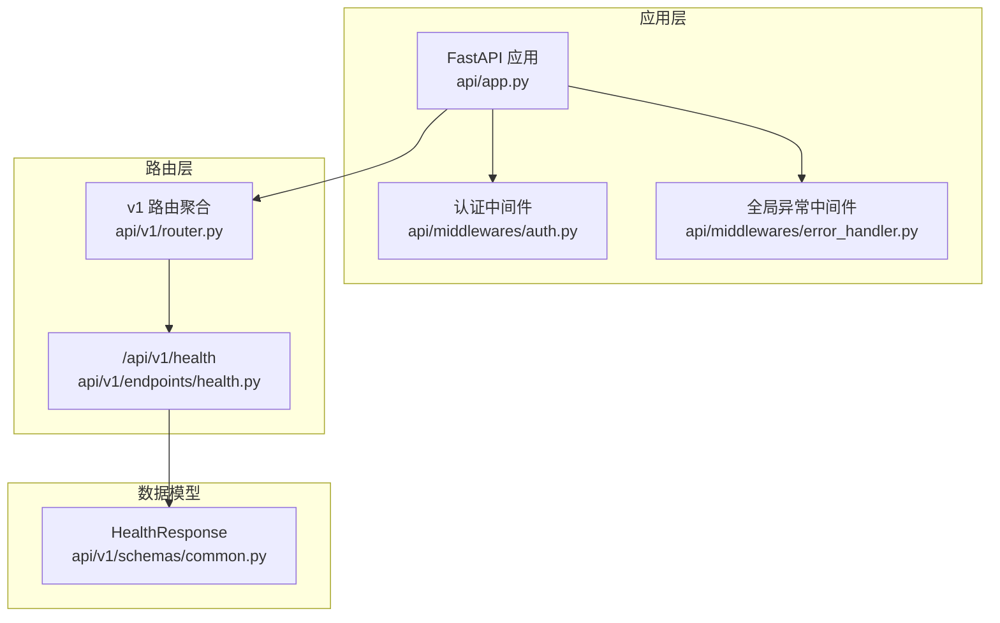
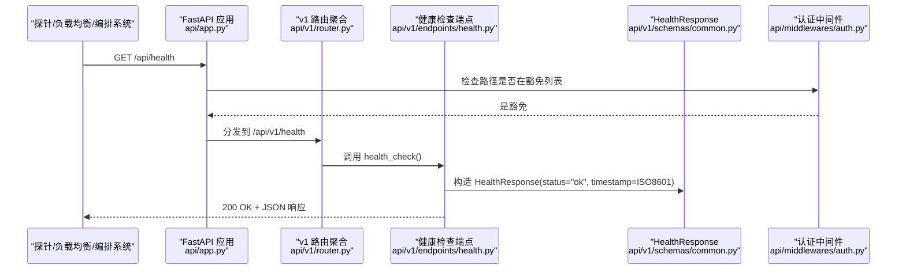
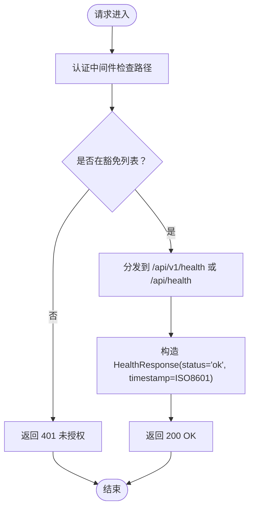
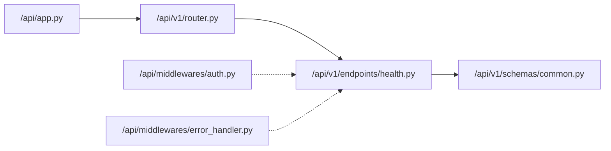

# 健康检查接口

<cite>
**本文引用的文件**
- [api/v1/endpoints/health.py](file://api/v1/endpoints/health.py)
- [api/app.py](file://api/app.py)
- [api/v1/router.py](file://api/v1/router.py)
- [api/v1/schemas/common.py](file://api/v1/schemas/common.py)
- [api/middlewares/auth.py](file://api/middlewares/auth.py)
- [api/middlewares/error_handler.py](file://api/middlewares/error_handler.py)
- [docs/architecture/api_spec.json](file://docs/architecture/api_spec.json)
- [docker/docker-compose.yml](file://docker/docker-compose.yml)
</cite>

## 目录
1. [简介](#简介)
2. [项目结构](#项目结构)
3. [核心组件](#核心组件)
4. [架构总览](#架构总览)
5. [详细组件分析](#详细组件分析)
6. [依赖关系分析](#依赖关系分析)
7. [性能考量](#性能考量)
8. [故障排除指南](#故障排除指南)
9. [结论](#结论)
10. [附录](#附录)

## 简介
本文件为健康检查API接口的权威参考文档，聚焦于 GET /api/health 的完整规范，包括请求与响应、状态码、错误处理机制、时间戳格式、服务器状态验证方法，并提供 curl 与 Python requests 示例及在负载均衡、容器编排与监控系统中的典型应用场景。该接口用于被外部系统（如负载均衡器、容器编排平台、监控探针等）定期探测服务可用性与基本健康状态。

## 项目结构
健康检查接口在本项目中以两种形式存在：
- v1 版本路由：/api/v1/health
- 应用根注册：/api/health

两者均返回一致的健康响应模型，且不受认证中间件影响（健康检查路径在认证豁免列表中）。

图表来源
- [api/app.py:161-173](file://api/app.py#L161-L173)
- [api/v1/router.py:17](file://api/v1/router.py#L17)
- [api/v1/endpoints/health.py:21-34](file://api/v1/endpoints/health.py#L21-L34)
- [api/v1/schemas/common.py:32-44](file://api/v1/schemas/common.py#L32-L44)
- [api/middlewares/auth.py:19-27](file://api/middlewares/auth.py#L19-L27)

章节来源
- [api/app.py:161-173](file://api/app.py#L161-L173)
- [api/v1/router.py:17](file://api/v1/router.py#L17)
- [api/v1/endpoints/health.py:21-34](file://api/v1/endpoints/health.py#L21-L34)
- [api/v1/schemas/common.py:32-44](file://api/v1/schemas/common.py#L32-L44)
- [api/middlewares/auth.py:19-27](file://api/middlewares/auth.py#L19-L27)

## 核心组件
- 健康检查端点
  - 路径：/api/v1/health 或 /api/health
  - 方法：GET
  - 响应模型：HealthResponse
  - 认证豁免：健康检查路径在认证中间件豁免列表中，无需登录即可访问
- 响应模型 HealthResponse
  - 字段：status（字符串）、timestamp（字符串，ISO 8601 格式，可选）
  - 示例：见 OpenAPI 规范中的 HealthResponse 示例
- 应用入口与注册
  - 应用在创建时同时注册了 /api/health 与 v1 路由，确保两种访问路径均可使用
- 错误处理
  - 未处理异常会被全局异常中间件捕获并返回统一格式的错误响应（通常为 500）

章节来源
- [api/v1/endpoints/health.py:21-34](file://api/v1/endpoints/health.py#L21-L34)
- [api/v1/schemas/common.py:32-44](file://api/v1/schemas/common.py#L32-L44)
- [api/app.py:161-173](file://api/app.py#L161-L173)
- [api/middlewares/error_handler.py:70-129](file://api/middlewares/error_handler.py#L70-L129)

## 架构总览
健康检查接口在整个系统中的调用链如下：

图表来源
- [api/app.py:161-173](file://api/app.py#L161-L173)
- [api/v1/router.py:17](file://api/v1/router.py#L17)
- [api/v1/endpoints/health.py:21-34](file://api/v1/endpoints/health.py#L21-L34)
- [api/v1/schemas/common.py:32-44](file://api/v1/schemas/common.py#L32-L44)
- [api/middlewares/auth.py:19-27](file://api/middlewares/auth.py#L19-L27)

## 详细组件分析

### 健康检查端点（GET /api/health）
- 请求
  - 方法：GET
  - 路径：/api/health 或 /api/v1/health
  - 查询参数：无
  - 请求体：无
- 响应
  - 状态码：200
  - 响应体：HealthResponse
    - status：字符串，固定为 "ok"
    - timestamp：字符串，ISO 8601 时间戳（可选）
- 认证
  - 路径在认证中间件豁免列表中，无需登录即可访问
- 错误处理
  - 该端点本身不抛出业务异常；若发生未处理异常，将由全局异常中间件统一返回 500

图表来源
- [api/middlewares/auth.py:19-27](file://api/middlewares/auth.py#L19-L27)
- [api/app.py:161-173](file://api/app.py#L161-L173)
- [api/v1/endpoints/health.py:21-34](file://api/v1/endpoints/health.py#L21-L34)
- [api/v1/schemas/common.py:32-44](file://api/v1/schemas/common.py#L32-L44)

章节来源
- [api/v1/endpoints/health.py:21-34](file://api/v1/endpoints/health.py#L21-L34)
- [api/v1/schemas/common.py:32-44](file://api/v1/schemas/common.py#L32-L44)
- [api/middlewares/auth.py:19-27](file://api/middlewares/auth.py#L19-L27)

### 响应模型 HealthResponse
- 字段定义
  - status：字符串，表示服务状态，示例值为 "ok"
  - timestamp：字符串，ISO 8601 时间戳，可选
- 示例
  - 参考 OpenAPI 规范中的 HealthResponse 示例

章节来源
- [api/v1/schemas/common.py:32-44](file://api/v1/schemas/common.py#L32-L44)
- [docs/architecture/api_spec.json:600-615](file://docs/architecture/api_spec.json#L600-L615)

### 认证豁免策略
- 豁免路径集合包含 /api/health 与 /health，确保健康检查不受认证开关影响
- 该策略在运行时生效，即使认证被启用，健康检查仍可正常访问

章节来源
- [api/middlewares/auth.py:19-27](file://api/middlewares/auth.py#L19-L27)

### OpenAPI 规范映射
- 路径：/api/health
- 方法：GET
- 标签：Health
- 响应：200，HealthResponse
- 该规范由 docs/architecture/api_spec.json 提供

章节来源
- [docs/architecture/api_spec.json:58-78](file://docs/architecture/api_spec.json#L58-L78)

## 依赖关系分析
- 端点对模型的依赖
  - 健康检查端点依赖 HealthResponse 模型进行序列化
- 应用注册与路由
  - 应用在创建时同时注册了 /api/health 与 v1 路由，保证两种路径均可访问
- 中间件影响
  - 认证中间件对 /api/health 路径豁免，不影响健康检查
  - 全局异常中间件对健康检查端点不产生特殊处理，异常将统一返回 500

图表来源
- [api/v1/endpoints/health.py:16](file://api/v1/endpoints/health.py#L16)
- [api/v1/schemas/common.py:32-44](file://api/v1/schemas/common.py#L32-L44)
- [api/app.py:161-173](file://api/app.py#L161-L173)
- [api/v1/router.py:17](file://api/v1/router.py#L17)
- [api/middlewares/auth.py:19-27](file://api/middlewares/auth.py#L19-L27)
- [api/middlewares/error_handler.py:70-129](file://api/middlewares/error_handler.py#L70-L129)

章节来源
- [api/v1/endpoints/health.py:16](file://api/v1/endpoints/health.py#L16)
- [api/v1/schemas/common.py:32-44](file://api/v1/schemas/common.py#L32-L44)
- [api/app.py:161-173](file://api/app.py#L161-L173)
- [api/v1/router.py:17](file://api/v1/router.py#L17)
- [api/middlewares/auth.py:19-27](file://api/middlewares/auth.py#L19-L27)
- [api/middlewares/error_handler.py:70-129](file://api/middlewares/error_handler.py#L70-L129)

## 性能考量
- 健康检查为轻量级接口，不涉及数据库或外部服务调用，响应延迟极低
- 建议探针间隔根据部署环境调整：容器编排中通常 5–10 秒一次；生产环境可适当拉长
- 在高并发场景下，建议将健康检查与业务接口分离，避免相互影响

## 故障排除指南
- 无法访问 /api/health
  - 确认应用已启动并监听正确端口
  - 检查网络连通性与防火墙策略
  - 若使用容器编排，确认端口映射与服务发现配置正确
- 返回 401 未授权
  - 健康检查路径应在认证豁免列表中，若出现 401，检查认证中间件配置
- 返回 500 内部错误
  - 查看应用日志，定位未处理异常
  - 检查全局异常中间件是否正常注册
- 时间戳格式不符预期
  - HealthResponse 的 timestamp 为 ISO 8601 字符串，确保客户端按字符串解析

章节来源
- [api/middlewares/auth.py:19-27](file://api/middlewares/auth.py#L19-L27)
- [api/middlewares/error_handler.py:70-129](file://api/middlewares/error_handler.py#L70-L129)

## 结论
GET /api/health 提供了稳定、轻量的健康检查能力，适用于负载均衡、容器编排与监控系统。其设计遵循最小权限原则与统一响应模型，便于自动化集成与运维监控。

## 附录

### 接口规范摘要
- 路径：/api/health 或 /api/v1/health
- 方法：GET
- 认证：豁免（无需登录）
- 成功响应：200，JSON，包含 status 与 timestamp
- 错误响应：500（未处理异常时）

章节来源
- [api/v1/endpoints/health.py:21-34](file://api/v1/endpoints/health.py#L21-L34)
- [api/v1/schemas/common.py:32-44](file://api/v1/schemas/common.py#L32-L44)
- [api/middlewares/auth.py:19-27](file://api/middlewares/auth.py#L19-L27)
- [api/middlewares/error_handler.py:70-129](file://api/middlewares/error_handler.py#L70-L129)

### curl 示例
- 基本访问
  - curl -i http://localhost:8000/api/health
- 指定主机与端口
  - curl -i http://<主机>:<端口>/api/health

章节来源
- [api/app.py:161-173](file://api/app.py#L161-L173)

### Python requests 示例
- 基本访问
  - import requests
  - r = requests.get("http://localhost:8000/api/health")
  - print(r.status_code, r.json())

章节来源
- [api/app.py:161-173](file://api/app.py#L161-L173)

### 常见集成场景
- 负载均衡器
  - 将 /api/health 作为健康探针路径，周期性探测后端实例可用性
- 容器编排（Kubernetes / Docker Compose）
  - 使用 liveness/readiness 探针指向 /api/health
  - 参考 docker-compose.yml 中的服务与端口配置
- 监控系统
  - Prometheus/Grafana 等通过 /api/health 的可用性与响应时间进行告警与可视化

章节来源
- [docker/docker-compose.yml:62-69](file://docker/docker-compose.yml#L62-L69)