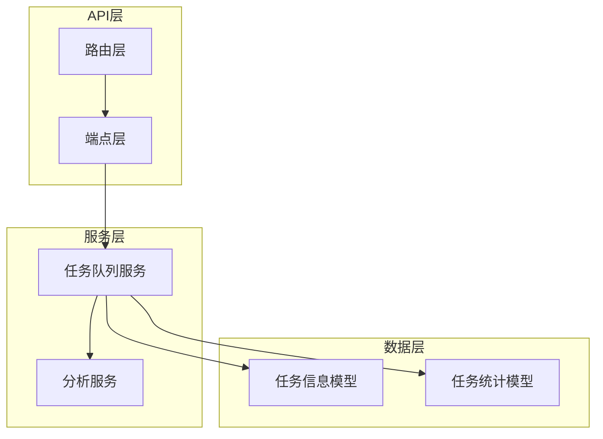
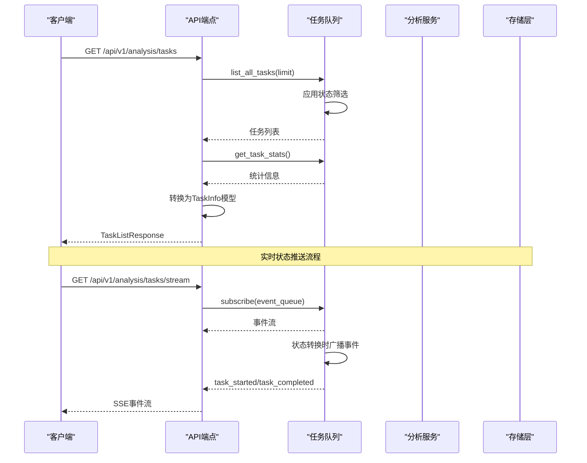
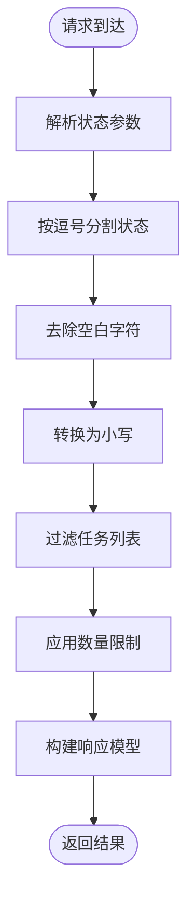
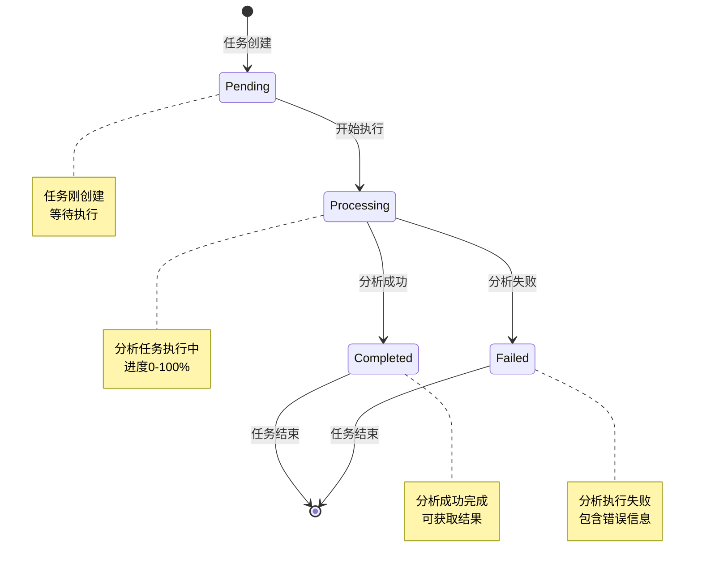
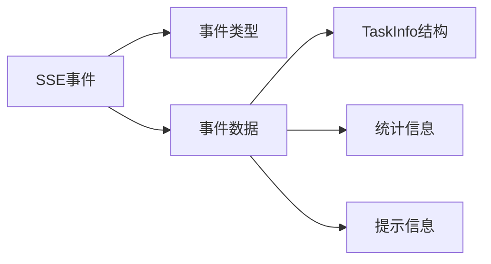
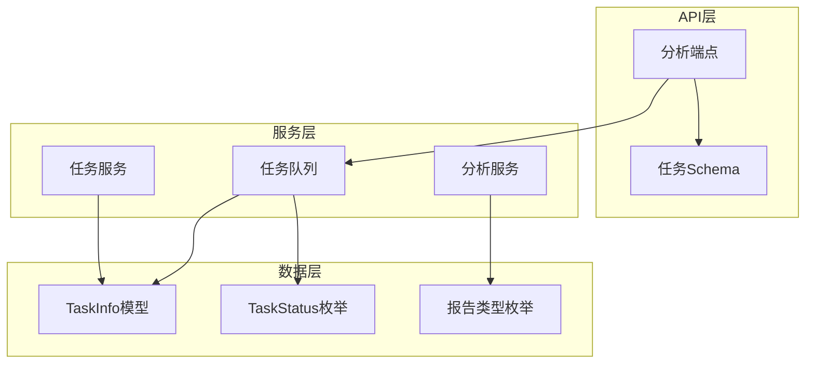

# 任务管理接口

<cite>
**本文档引用的文件**
- [analysis.py](file://api/v1/endpoints/analysis.py)
- [analysis.py](file://api/v1/schemas/analysis.py)
- [task_queue.py](file://src/services/task_queue.py)
- [analysis_service.py](file://src/services/analysis_service.py)
- [enums.py](file://src/enums.py)
- [router.py](file://api/v1/router.py)
</cite>

## 目录
1. [简介](#简介)
2. [项目结构](#项目结构)
3. [核心组件](#核心组件)
4. [架构概览](#架构概览)
5. [详细组件分析](#详细组件分析)
6. [依赖关系分析](#依赖关系分析)
7. [性能考虑](#性能考虑)
8. [故障排除指南](#故障排除指南)
9. [结论](#结论)

## 简介
本文档详细分析了股票分析系统的任务管理接口，重点介绍GET /api/v1/analysis/tasks任务列表查询接口。该接口提供了强大的任务状态筛选功能、数量限制控制和完整的任务信息展示。系统采用异步任务队列架构，支持实时状态推送和任务状态转换管理。

## 项目结构
任务管理接口位于API版本化架构中，采用清晰的分层设计：

**图表来源**
- [analysis.py:307-370](file://api/v1/endpoints/analysis.py#L307-L370)
- [task_queue.py:108-158](file://src/services/task_queue.py#L108-L158)

**章节来源**
- [analysis.py:1-694](file://api/v1/endpoints/analysis.py#L1-L694)
- [router.py:1-72](file://api/v1/router.py#L1-L72)

## 核心组件
任务管理接口围绕以下核心组件构建：

### 任务状态枚举
系统定义了标准的任务状态枚举，确保状态转换的一致性和可预测性：

| 状态值 | 描述 | 用途 |
|--------|------|------|
| `pending` | 等待执行 | 任务刚创建时的状态 |
| `processing` | 执行中 | 分析任务正在处理 |
| `completed` | 已完成 | 分析任务成功完成 |
| `failed` | 失败 | 分析任务执行失败 |

### 任务信息模型
TaskInfo模型提供了完整的任务详情结构，包含所有必要的状态信息和元数据。

### 任务列表响应
TaskListResponse模型封装了任务列表查询的完整响应格式，包括统计信息和任务详情。

**章节来源**
- [analysis.py:19-25](file://api/v1/schemas/analysis.py#L19-L25)
- [analysis.py:218-253](file://api/v1/schemas/analysis.py#L218-L253)
- [analysis.py:255-272](file://api/v1/schemas/analysis.py#L255-L272)

## 架构概览
任务管理接口采用分层架构设计，实现了清晰的关注点分离：

**图表来源**
- [analysis.py:307-370](file://api/v1/endpoints/analysis.py#L307-L370)
- [analysis.py:384-440](file://api/v1/endpoints/analysis.py#L384-L440)

## 详细组件分析

### 任务列表查询接口
GET /api/v1/analysis/tasks接口提供了灵活的任务查询能力：

#### 参数规范
- **status参数**：支持逗号分隔的多状态筛选，如`status=pending,processing`
- **limit参数**：数量限制，范围1-100，默认20
- **分页机制**：基于任务创建时间倒序排列

#### 状态筛选机制

**图表来源**
- [analysis.py:316-370](file://api/v1/endpoints/analysis.py#L316-L370)

#### 任务详情结构(TaskInfo)
TaskInfo模型定义了任务的完整信息结构：

| 字段名 | 类型 | 必填 | 描述 |
|--------|------|------|------|
| task_id | string | ✓ | 任务唯一标识符 |
| stock_code | string | ✓ | 股票代码 |
| stock_name | string | ✗ | 股票名称 |
| status | TaskStatusEnum | ✓ | 任务状态 |
| progress | integer | ✓ | 进度百分比(0-100) |
| message | string | ✗ | 状态消息 |
| report_type | string | ✓ | 报告类型 |
| created_at | string | ✓ | 创建时间 |
| started_at | string | ✗ | 开始执行时间 |
| completed_at | string | ✗ | 完成时间 |
| error | string | ✗ | 错误信息 |

#### 任务列表响应(TaskListResponse)
TaskListResponse模型提供了完整的任务列表响应格式：

| 字段名 | 类型 | 必填 | 描述 |
|--------|------|------|------|
| total | integer | ✓ | 任务总数 |
| pending | integer | ✓ | 等待中任务数 |
| processing | integer | ✓ | 处理中任务数 |
| tasks | List[TaskInfo] | ✓ | 任务列表 |

#### 任务状态对象(TaskStatus)
TaskStatus模型定义了单个任务的状态信息：

| 字段名 | 类型 | 必填 | 描述 |
|--------|------|------|------|
| task_id | string | ✓ | 任务ID |
| status | string | ✓ | 任务状态(pending/processing/completed/failed) |
| progress | integer | ✗ | 进度百分比(0-100) |
| result | AnalysisResultResponse | ✗ | 分析结果(仅completed时存在) |
| error | string | ✗ | 错误信息(仅failed时存在) |

**章节来源**
- [analysis.py:307-370](file://api/v1/endpoints/analysis.py#L307-L370)
- [analysis.py:218-272](file://api/v1/schemas/analysis.py#L218-L272)

### 任务状态转换规则
系统实现了严格的任务状态转换规则，确保状态转换的正确性和一致性：

**图表来源**
- [task_queue.py:34-40](file://src/services/task_queue.py#L34-L40)
- [task_queue.py:440-533](file://src/services/task_queue.py#L440-L533)

#### 状态转换流程
1. **Pending状态**：任务创建时的初始状态
2. **Processing状态**：任务开始执行时的状态转换
3. **Completed状态**：分析成功完成时的状态转换
4. **Failed状态**：分析执行失败时的状态转换

**章节来源**
- [task_queue.py:440-533](file://src/services/task_queue.py#L440-L533)

### 实时状态推送
系统提供了Server-Sent Events(SSE)实时推送功能：

#### 支持的事件类型
- `connected`: 连接成功事件
- `task_created`: 新任务创建事件
- `task_started`: 任务开始执行事件
- `task_completed`: 任务完成事件
- `task_failed`: 任务失败事件
- `heartbeat`: 心跳事件(每30秒)

#### SSE事件格式

**图表来源**
- [analysis.py:384-440](file://api/v1/endpoints/analysis.py#L384-L440)

**章节来源**
- [analysis.py:376-440](file://api/v1/endpoints/analysis.py#L376-L440)

## 依赖关系分析

### 组件依赖图

**图表来源**
- [analysis.py:25-62](file://api/v1/endpoints/analysis.py#L25-L62)
- [task_queue.py:24-40](file://src/services/task_queue.py#L24-L40)

### 关键依赖关系
1. **API端点依赖任务队列**：查询接口直接依赖任务队列服务
2. **Schema依赖枚举类型**：模型定义依赖状态枚举和报告类型枚举
3. **服务层依赖配置**：分析服务依赖系统配置和报告类型
4. **任务队列依赖分析服务**：执行任务时调用分析服务

**章节来源**
- [analysis.py:25-62](file://api/v1/endpoints/analysis.py#L25-L62)
- [task_queue.py:473-482](file://src/services/task_queue.py#L473-L482)

## 性能考虑

### 查询优化策略
1. **数量限制**：limit参数限制最大返回数量(1-100)，防止大量数据传输
2. **状态筛选**：支持多状态筛选，减少不必要的数据处理
3. **内存管理**：任务队列维护历史任务数量上限，避免内存泄漏
4. **并发控制**：可配置的最大工作线程数，平衡系统负载

### 最佳实践建议
1. **合理设置limit值**：根据页面显示需求设置合适的limit值
2. **使用状态筛选**：针对特定状态进行查询，提高响应速度
3. **定期清理历史任务**：利用系统自动清理机制，保持队列性能
4. **监控任务统计**：关注pending和processing状态的任务数量

### 性能监控指标
- 任务队列长度
- 平均处理时间
- 成功/失败率
- 内存使用情况

## 故障排除指南

### 常见问题及解决方案
1. **任务状态查询异常**
   - 检查任务ID是否有效
   - 确认任务是否仍在队列中
   - 查看系统日志获取详细错误信息

2. **SSE连接中断**
   - 检查网络连接稳定性
   - 确认服务器SSE配置
   - 验证防火墙设置

3. **状态筛选无效**
   - 确认状态值格式正确
   - 检查逗号分隔符使用
   - 验证状态值大小写

### 错误处理机制
系统提供了完善的错误处理机制：
- HTTP状态码标准化
- 详细的错误信息描述
- 日志记录和追踪
- 自动重试机制

**章节来源**
- [analysis.py:563-570](file://api/v1/endpoints/analysis.py#L563-L570)
- [analysis.py:553-561](file://api/v1/endpoints/analysis.py#L553-L561)

## 结论
任务管理接口提供了完整的异步任务管理能力，具有以下特点：

1. **功能完整性**：支持任务状态筛选、数量限制和实时推送
2. **架构清晰**：分层设计确保了良好的可维护性
3. **性能优化**：合理的限制和清理机制保证系统性能
4. **扩展性强**：模块化设计便于功能扩展和维护

该接口为股票分析系统的任务管理提供了坚实的技术基础，支持高效的异步任务处理和实时状态监控。