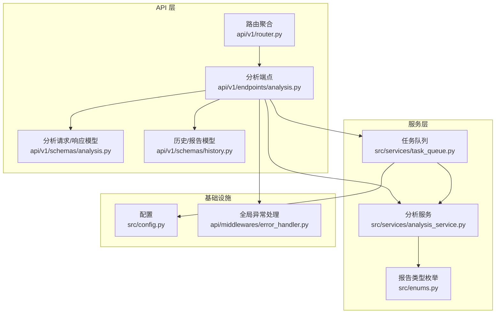
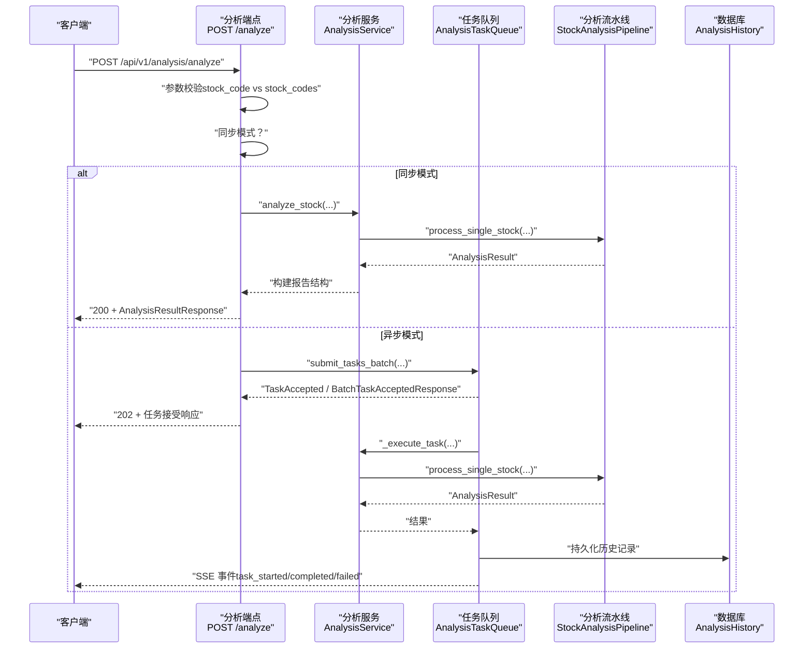
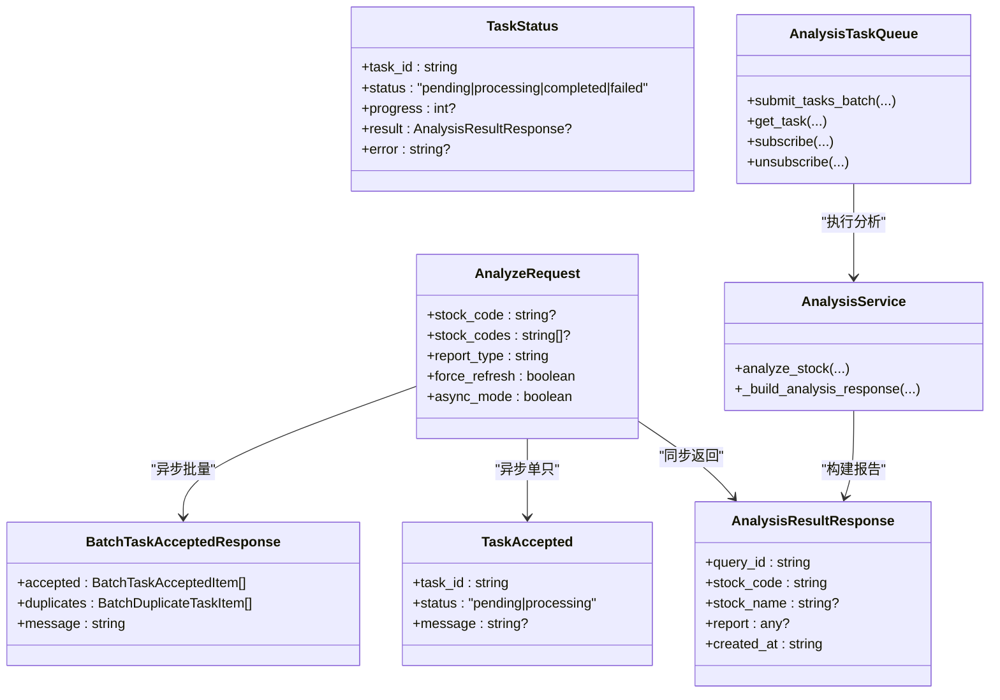

# 分析接口

<cite>
**本文档引用的文件**
- [analysis.py](file://api/v1/endpoints/analysis.py)
- [analysis.py](file://api/v1/schemas/analysis.py)
- [history.py](file://api/v1/schemas/history.py)
- [analysis_service.py](file://src/services/analysis_service.py)
- [task_queue.py](file://src/services/task_queue.py)
- [enums.py](file://src/enums.py)
- [error_handler.py](file://api/middlewares/error_handler.py)
- [router.py](file://api/v1/router.py)
- [config.py](file://src/config.py)
</cite>

## 目录
1. [简介](#简介)
2. [项目结构](#项目结构)
3. [核心组件](#核心组件)
4. [架构总览](#架构总览)
5. [详细组件分析](#详细组件分析)
6. [依赖关系分析](#依赖关系分析)
7. [性能考量](#性能考量)
8. [故障排查指南](#故障排查指南)
9. [结论](#结论)
10. [附录](#附录)

## 简介
本文件为“股票分析API接口组”的完整参考文档，重点覆盖以下内容：
- POST /api/v1/analysis/analyze 触发分析接口的完整规范：请求体参数（stock_code vs stock_codes 二选一）、报告类型选择、强制刷新选项、异步模式配置
- 分析结果的同步返回格式与异步任务接受的 TaskAccepted/批量响应结构
- 任务状态查询接口 GET /api/v1/analysis/status/{task_id}
- SSE 实时流接口 GET /api/v1/analysis/tasks/stream 的事件类型与数据格式
- 完整的请求/响应示例、错误码说明（400 参数错误、409 重复任务、500 服务器错误）与异常处理策略
- 批量分析、缓存策略与性能优化建议

## 项目结构
分析接口位于 API v1 路由下，核心文件组织如下：
- 路由聚合：api/v1/router.py
- 分析端点：api/v1/endpoints/analysis.py
- 请求/响应模型：api/v1/schemas/analysis.py、api/v1/schemas/history.py
- 服务层：src/services/analysis_service.py
- 任务队列：src/services/task_queue.py
- 枚举与配置：src/enums.py、src/config.py
- 全局异常处理：api/middlewares/error_handler.py

图表来源
- [router.py:17-35](file://api/v1/router.py#L17-L35)
- [analysis.py:65-66](file://api/v1/endpoints/analysis.py#L65-L66)
- [analysis.py:27-62](file://api/v1/schemas/analysis.py#L27-L62)
- [history.py:112-197](file://api/v1/schemas/history.py#L112-L197)
- [analysis_service.py:29-105](file://src/services/analysis_service.py#L29-L105)
- [task_queue.py:108-159](file://src/services/task_queue.py#L108-L159)
- [enums.py:13-51](file://src/enums.py#L13-L51)
- [config.py:32-231](file://src/config.py#L32-L231)
- [error_handler.py:24-67](file://api/middlewares/error_handler.py#L24-L67)

章节来源
- [router.py:17-35](file://api/v1/router.py#L17-L35)
- [analysis.py:65-66](file://api/v1/endpoints/analysis.py#L65-L66)

## 核心组件
- 分析端点（POST /api/v1/analysis/analyze）：负责参数校验、同步/异步分流、批量提交与 SSE 事件广播
- 分析服务（AnalysisService）：封装分析流程、构建报告结构、调用流水线与持久化
- 任务队列（AnalysisTaskQueue）：线程池执行、防重复提交、SSE 事件广播、任务状态持久化
- 请求/响应模型：统一定义 AnalyzeRequest、AnalysisResultResponse、TaskAccepted、TaskStatus 等
- 全局异常处理：统一 HTTP 异常与未处理异常的响应格式

章节来源
- [analysis.py:72-158](file://api/v1/endpoints/analysis.py#L72-L158)
- [analysis_service.py:29-105](file://src/services/analysis_service.py#L29-L105)
- [task_queue.py:108-159](file://src/services/task_queue.py#L108-L159)
- [analysis.py:27-216](file://api/v1/schemas/analysis.py#L27-L216)
- [error_handler.py:24-129](file://api/middlewares/error_handler.py#L24-L129)

## 架构总览
POST /api/v1/analysis/analyze 的典型调用链路如下：

图表来源
- [analysis.py:88-158](file://api/v1/endpoints/analysis.py#L88-L158)
- [analysis_service.py:40-105](file://src/services/analysis_service.py#L40-L105)
- [task_queue.py:296-361](file://src/services/task_queue.py#L296-L361)
- [analysis.py:65-110](file://api/v1/schemas/analysis.py#L65-L110)

## 详细组件分析

### POST /api/v1/analysis/analyze 接口规范
- 方法与路径：POST /api/v1/analysis/analyze
- 功能：触发股票分析，支持同步与异步模式；异步模式下相同股票代码不允许重复提交
- 请求体参数
  - stock_code: 单只股票代码（与 stock_codes 二选一）
  - stock_codes: 多只股票代码列表（与 stock_code 二选一）
  - report_type: 报告类型，取值范围："simple"、"detailed"、"full"、"brief"
  - force_refresh: 是否强制刷新（忽略缓存），布尔值
  - async_mode: 是否使用异步模式，布尔值
- 响应
  - 同步模式（async_mode=false）：返回 200 + AnalysisResultResponse
  - 异步模式（async_mode=true）：返回 202 + TaskAccepted（单只）或 BatchTaskAcceptedResponse（批量）
  - 参数错误：返回 400 + ErrorResponse
  - 重复任务：返回 409 + DuplicateTaskErrorResponse
  - 服务器错误：返回 500 + ErrorResponse

请求体示例（JSON）
- 同步单只：{"stock_code":"600519","report_type":"detailed","force_refresh":false,"async_mode":false}
- 异步单只：{"stock_code":"600519","report_type":"simple","force_refresh":true,"async_mode":true}
- 异步批量：{"stock_codes":["600519","000858"],"report_type":"brief","force_refresh":false,"async_mode":true}

响应示例（同步）
- 200 + AnalysisResultResponse
  - query_id: 分析记录唯一标识
  - stock_code: 股票代码
  - stock_name: 股票名称（可选）
  - report: AnalysisReport（见附录）
  - created_at: ISO 时间戳

响应示例（异步单只）
- 202 + TaskAccepted
  - task_id: 任务 ID
  - status: "pending" 或 "processing"
  - message: 提示信息

响应示例（异步批量）
- 202 + BatchTaskAcceptedResponse
  - accepted: 成功提交的任务列表（每项含 task_id、stock_code、status、message）
  - duplicates: 重复而跳过的任务列表（每项含 stock_code、existing_task_id、message）
  - message: 汇总信息

章节来源
- [analysis.py:72-158](file://api/v1/endpoints/analysis.py#L72-L158)
- [analysis.py:27-110](file://api/v1/schemas/analysis.py#L27-L110)
- [analysis.py:152-180](file://api/v1/schemas/analysis.py#L152-L180)

### 任务状态查询接口
- 方法与路径：GET /api/v1/analysis/status/{task_id}
- 功能：根据 task_id 查询单个任务的状态
- 响应
  - 进行中：返回 TaskStatus（包含 status、progress、error）
  - 已完成：返回 TaskStatus（result 为 AnalysisResultResponse）

响应示例
- 进行中：{"task_id":"...","status":"processing","progress":30,"result":null,"error":null}
- 已完成：{"task_id":"...","status":"completed","progress":100,"result":AnalysisResultResponse,"error":null}

章节来源
- [analysis.py:460-570](file://api/v1/endpoints/analysis.py#L460-L570)
- [analysis.py:182-216](file://api/v1/schemas/analysis.py#L182-L216)

### SSE 实时流接口
- 方法与路径：GET /api/v1/analysis/tasks/stream
- 功能：通过 Server-Sent Events 实时推送任务状态变化
- 事件类型
  - connected：连接成功，数据包含 message
  - task_created：新任务创建，数据为 TaskInfo
  - task_started：任务开始执行，数据为 TaskInfo
  - task_completed：任务完成，数据为 TaskInfo
  - task_failed：任务失败，数据为 TaskInfo
  - heartbeat：心跳事件，每 30 秒发送一次，数据包含 timestamp
- 响应格式
  - Content-Type: text/event-stream
  - 每条事件以 event: type 和 data: {...} 表示，末尾两个换行分隔

章节来源
- [analysis.py:376-440](file://api/v1/endpoints/analysis.py#L376-L440)
- [analysis.py:218-253](file://api/v1/schemas/analysis.py#L218-L253)

### 分析结果数据结构
- AnalysisResultResponse
  - query_id、stock_code、stock_name、report、created_at
- AnalysisReport（report 字段）
  - meta：query_id、stock_code、stock_name、report_type、report_language、created_at、current_price、change_pct、model_used
  - summary：analysis_summary、operation_advice、trend_prediction、sentiment_score、sentiment_label
  - strategy：ideal_buy、secondary_buy、stop_loss、take_profit
  - details：news_content、raw_result、context_snapshot、financial_report、dividend_metrics

章节来源
- [analysis.py:65-89](file://api/v1/schemas/analysis.py#L65-L89)
- [history.py:112-197](file://api/v1/schemas/history.py#L112-L197)

### 错误码与异常处理
- 400 参数错误
  - 场景：未提供 stock_code 或 stock_codes；同步模式传入多只股票；参数验证失败
  - 响应：ErrorResponse（包含 error、message、detail）
- 409 重复任务
  - 场景：异步模式下相同股票代码正在分析中
  - 响应：DuplicateTaskErrorResponse（包含 error、message、stock_code、existing_task_id）
- 500 服务器错误
  - 场景：分析失败、查询状态失败、未处理异常
  - 响应：ErrorResponse（包含 error、message、detail）

章节来源
- [analysis.py:122-154](file://api/v1/endpoints/analysis.py#L122-L154)
- [analysis.py:197-232](file://api/v1/endpoints/analysis.py#L197-L232)
- [analysis.py:258-300](file://api/v1/endpoints/analysis.py#L258-L300)
- [analysis.py:563-570](file://api/v1/endpoints/analysis.py#L563-L570)
- [error_handler.py:82-129](file://api/middlewares/error_handler.py#L82-L129)

### 批量分析与防重复提交
- 批量提交
  - 支持 stock_codes 数组，自动去重与规范化
  - 返回 BatchTaskAcceptedResponse，区分 accepted 与 duplicates
- 防重复提交
  - 在 submit_tasks_batch 中检查正在分析中的股票代码，若重复则返回 DuplicateTaskError
  - 单只股票重复时返回 409，兼容旧版响应格式

章节来源
- [analysis.py:161-232](file://api/v1/endpoints/analysis.py#L161-L232)
- [task_queue.py:296-361](file://src/services/task_queue.py#L296-L361)
- [task_queue.py:96-106](file://src/services/task_queue.py#L96-L106)

### 报告类型与语言
- 报告类型映射
  - API 输入："simple"、"detailed"、"full"、"brief"
  - 内部枚举：ReportType（SIMPLE、FULL、BRIEF）
  - "detailed" 映射为 FULL
- 报告语言
  - 从 meta、上下文快照或配置中归一化，支持 zh/en

章节来源
- [analysis.py:40-48](file://api/v1/schemas/analysis.py#L40-L48)
- [enums.py:13-51](file://src/enums.py#L13-L51)
- [analysis.py:634-643](file://api/v1/endpoints/analysis.py#L634-L643)

## 依赖关系分析
- 分析端点依赖
  - 请求/响应模型：AnalyzeRequest、AnalysisResultResponse、TaskAccepted、TaskStatus、TaskInfo、BatchTaskAcceptedResponse、DuplicateTaskErrorResponse
  - 服务层：AnalysisService（同步模式）、AnalysisTaskQueue（异步模式）
  - 配置：Config（并发、缓存等）
- 任务队列依赖
  - AnalysisService（执行分析）
  - AnalysisResult（持久化历史记录）
- 全局异常处理
  - 统一捕获 HTTPException、RequestValidationError、Exception，并返回标准化错误响应

图表来源
- [analysis.py:27-216](file://api/v1/schemas/analysis.py#L27-L216)
- [analysis_service.py:29-171](file://src/services/analysis_service.py#L29-L171)
- [task_queue.py:108-159](file://src/services/task_queue.py#L108-L159)

章节来源
- [analysis.py:27-216](file://api/v1/schemas/analysis.py#L27-L216)
- [analysis_service.py:29-171](file://src/services/analysis_service.py#L29-L171)
- [task_queue.py:108-159](file://src/services/task_queue.py#L108-L159)

## 性能考量
- 并发与限流
  - 任务队列最大并发数受配置 max_workers 控制，可通过同步调整接口在空闲时生效
  - 建议合理设置 max_workers，避免数据源限流与封禁风险
- 缓存策略
  - 实时行情缓存 TTL 与熔断器冷却时间可在配置中调整
  - 强制刷新（force_refresh=true）将忽略缓存，适合需要最新数据的场景
- 批量分析
  - 异步批量提交可显著提升吞吐，注意避免重复任务导致的 409
- SSE 心跳
  - 30 秒心跳保证连接存活，前端需正确处理心跳事件

章节来源
- [task_queue.py:184-231](file://src/services/task_queue.py#L184-L231)
- [config.py:152-178](file://src/config.py#L152-L178)
- [analysis.py:380-439](file://api/v1/endpoints/analysis.py#L380-L439)

## 故障排查指南
- 常见问题
  - 400 参数错误：检查 stock_code 与 stock_codes 是否二选一、report_type 是否合法、async_mode 与批量是否匹配
  - 409 重复任务：确认目标股票是否已有进行中的任务；必要时查询状态或等待完成
  - 500 服务器错误：查看日志定位具体异常；确认 AI 模型、数据源 API Key、搜索引擎 Key 配置是否正确
- 建议步骤
  - 先使用同步模式验证参数与数据源连通性
  - 再切换异步模式进行批量分析
  - 使用 GET /api/v1/analysis/tasks/stream 实时监控任务状态
  - 使用 GET /api/v1/analysis/status/{task_id} 查询已完成任务的历史结果

章节来源
- [analysis.py:122-154](file://api/v1/endpoints/analysis.py#L122-L154)
- [analysis.py:197-232](file://api/v1/endpoints/analysis.py#L197-L232)
- [analysis.py:563-570](file://api/v1/endpoints/analysis.py#L563-L570)
- [error_handler.py:82-129](file://api/middlewares/error_handler.py#L82-L129)

## 结论
本文档提供了 POST /api/v1/analysis/analyze 的完整接口规范与实现细节，涵盖同步/异步模式、批量分析、SSE 实时流、错误处理与性能优化建议。建议在生产环境中结合配置参数与缓存策略，合理设置并发与限流，确保稳定性与吞吐量的平衡。

## 附录

### 请求/响应示例（摘要）
- 同步单只
  - 请求：{"stock_code":"600519","report_type":"detailed","force_refresh":false,"async_mode":false}
  - 响应：200 + AnalysisResultResponse
- 异步单只
  - 请求：{"stock_code":"600519","report_type":"simple","force_refresh":true,"async_mode":true}
  - 响应：202 + TaskAccepted
- 异步批量
  - 请求：{"stock_codes":["600519","000858"],"report_type":"brief","force_refresh":false,"async_mode":true}
  - 响应：202 + BatchTaskAcceptedResponse
- 任务状态
  - 请求：GET /api/v1/analysis/status/{task_id}
  - 响应：TaskStatus（进行中或已完成）

章节来源
- [analysis.py:72-158](file://api/v1/endpoints/analysis.py#L72-L158)
- [analysis.py:65-110](file://api/v1/schemas/analysis.py#L65-L110)
- [analysis.py:182-216](file://api/v1/schemas/analysis.py#L182-L216)