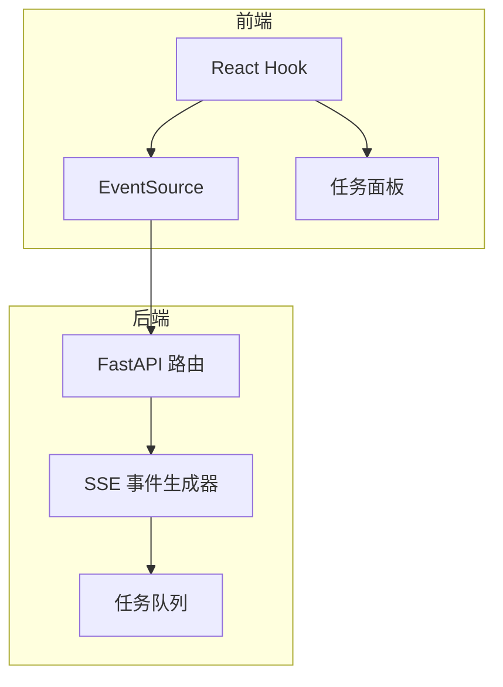
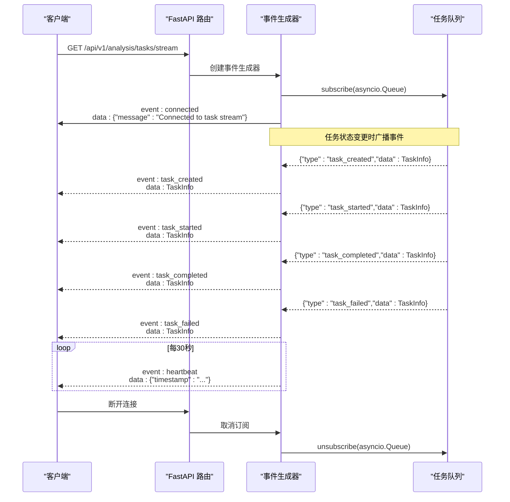
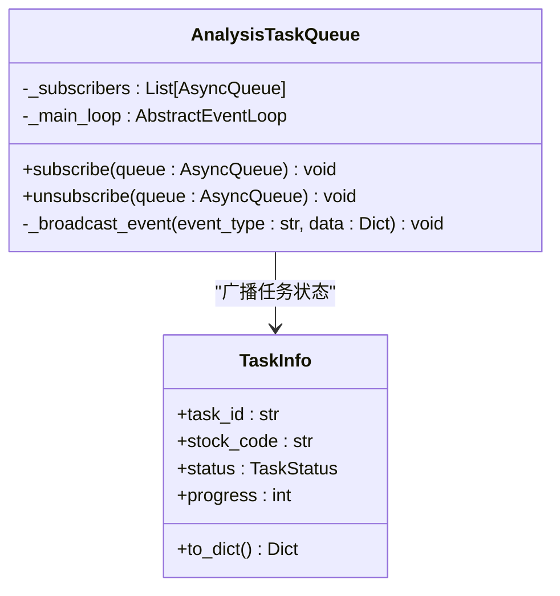
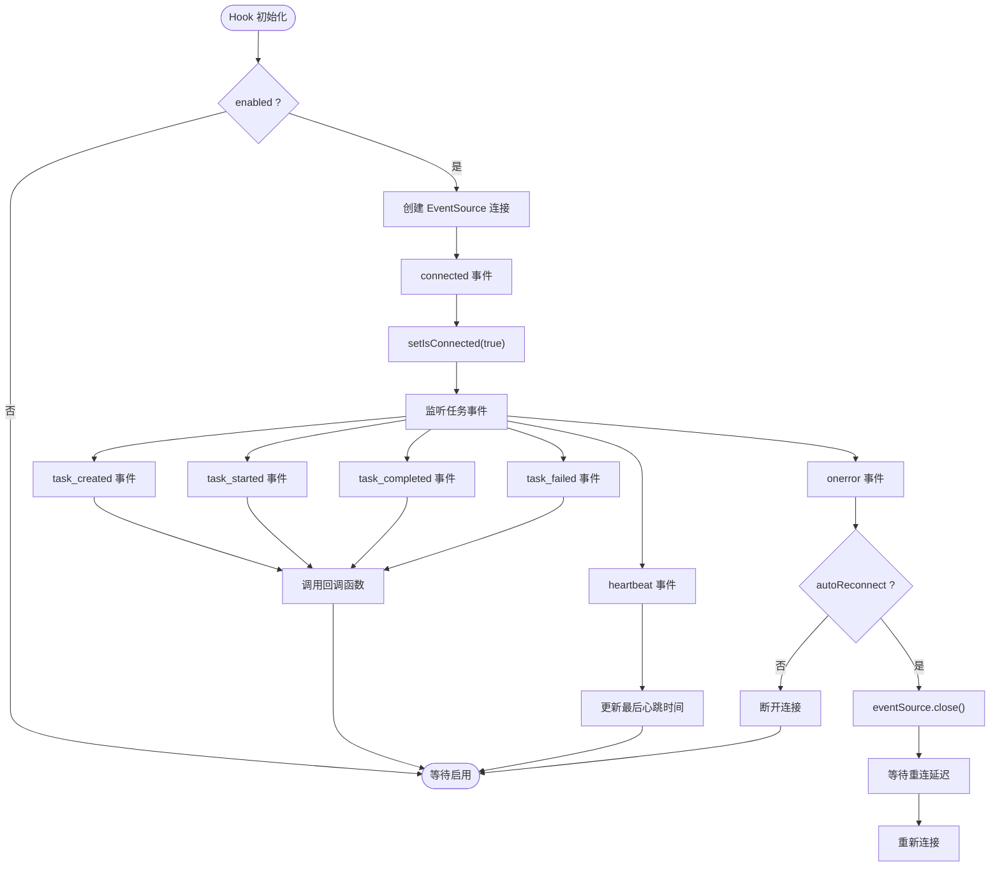
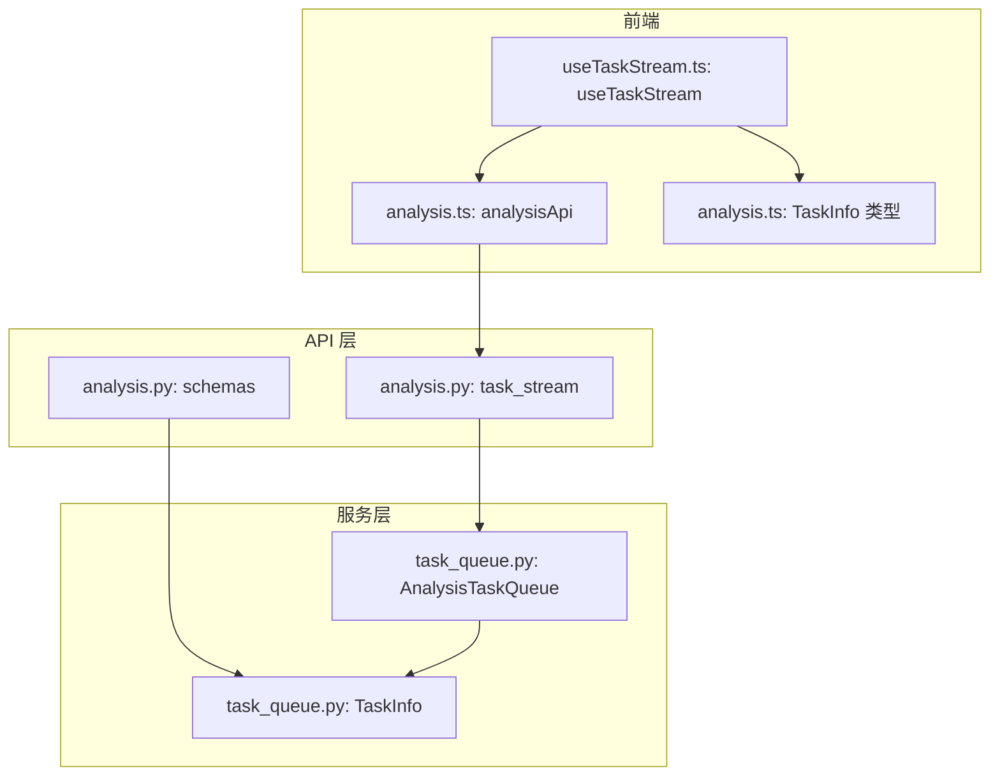

# 实时流接口

<cite>
**本文档引用的文件**
- [analysis.py](file://api/v1/endpoints/analysis.py)
- [task_queue.py](file://src/services/task_queue.py)
- [analysis.ts](file://apps/dsa-web/src/api/analysis.ts)
- [useTaskStream.ts](file://apps/dsa-web/src/hooks/useTaskStream.ts)
- [analysis.ts](file://apps/dsa-web/src/types/analysis.ts)
- [api_spec.json](file://docs/architecture/api_spec.json)
</cite>

## 目录
1. [简介](#简介)
2. [项目结构](#项目结构)
3. [核心组件](#核心组件)
4. [架构总览](#架构总览)
5. [详细组件分析](#详细组件分析)
6. [依赖关系分析](#依赖关系分析)
7. [性能考虑](#性能考虑)
8. [故障排除指南](#故障排除指南)
9. [结论](#结论)

## 简介
本文档详细描述了股票分析系统中实时流接口 GET /api/v1/analysis/tasks/stream 的完整规范，包括：
- 事件类型定义：connected（连接成功）、task_created（任务创建）、task_started（任务开始）、task_completed（任务完成）、task_failed（任务失败）、heartbeat（心跳）
- 事件数据格式：每个事件包含事件类型和数据负载
- SSE 连接建立、事件订阅和连接断开处理流程
- 前端集成示例：React Hook、JavaScript EventSource、Node.js 实现、Python requests-toolbelt 示例
- 连接超时处理、重连机制和错误恢复策略

## 项目结构
实时流接口位于 FastAPI 应用的分析模块中，采用异步任务队列与 SSE 事件流相结合的设计：
- 后端：FastAPI 路由处理 SSE 请求，异步生成事件流
- 任务队列：维护任务生命周期，负责事件广播
- 前端：React Hook 使用 EventSource 订阅事件流



**图表来源**
- [analysis.py:376-458](file://api/v1/endpoints/analysis.py#L376-L458)
- [task_queue.py:568-635](file://src/services/task_queue.py#L568-L635)
- [useTaskStream.ts:146-254](file://apps/dsa-web/src/hooks/useTaskStream.ts#L146-L254)

**章节来源**
- [analysis.py:1-17](file://api/v1/endpoints/analysis.py#L1-L17)
- [task_queue.py:108-158](file://src/services/task_queue.py#L108-L158)

## 核心组件
- FastAPI 路由：提供 /api/v1/analysis/tasks/stream 接口，返回 text/event-stream 媒体类型
- 事件生成器：异步生成 SSE 事件，包含连接成功、任务状态变更和心跳事件
- 任务队列：维护任务状态，向订阅者广播事件
- 前端 Hook：封装 EventSource，提供自动重连、断开连接等能力

**章节来源**
- [analysis.py:376-458](file://api/v1/endpoints/analysis.py#L376-L458)
- [task_queue.py:568-635](file://src/services/task_queue.py#L568-L635)
- [useTaskStream.ts:1-59](file://apps/dsa-web/src/hooks/useTaskStream.ts#L1-L59)

## 架构总览
实时流接口采用“发布-订阅”模式：
- 任务队列作为发布者，将任务状态变更广播给所有订阅者
- SSE 事件生成器作为订阅者，将事件转换为标准的 SSE 格式
- 前端通过 EventSource 订阅事件流，实时更新 UI



**图表来源**
- [analysis.py:384-439](file://api/v1/endpoints/analysis.py#L384-L439)
- [task_queue.py:570-629](file://src/services/task_queue.py#L570-L629)

## 详细组件分析

### 事件类型与数据格式
实时流接口支持以下事件类型：
- connected：连接成功事件，数据包含连接消息
- task_created：新任务创建事件，数据为任务详情
- task_started：任务开始执行事件，数据为任务详情
- task_completed：任务完成事件，数据为任务详情
- task_failed：任务失败事件，数据为任务详情
- heartbeat：心跳事件，数据包含当前时间戳

事件数据格式遵循标准的 SSE 格式：
- event: 事件类型
- data: JSON 序列化的数据负载
- 以两个换行符结尾

**章节来源**
- [analysis.py:388-394](file://api/v1/endpoints/analysis.py#L388-L394)
- [analysis.py:442-453](file://api/v1/endpoints/analysis.py#L442-L453)
- [api_spec.json:203-222](file://docs/architecture/api_spec.json#L203-L222)

### SSE 连接建立流程
1. 客户端发起 GET 请求到 /api/v1/analysis/tasks/stream
2. 服务器创建事件生成器协程
3. 生成 connected 事件，通知客户端连接成功
4. 列举当前进行中的任务，逐个发送 task_created 事件
5. 订阅任务队列事件，开始接收实时事件
6. 设置 30 秒超时，超时发送 heartbeat 事件

**章节来源**
- [analysis.py:399-429](file://api/v1/endpoints/analysis.py#L399-L429)

### 事件订阅与广播机制
任务队列采用线程池执行任务，并通过 asyncio 事件循环安全地向订阅者广播事件：
- subscribe：添加订阅者到队列列表，捕获当前事件循环
- _broadcast_event：使用 call_soon_threadsafe 将事件放入 asyncio 队列
- unsubscribe：从订阅者列表移除



**图表来源**
- [task_queue.py:568-635](file://src/services/task_queue.py#L568-L635)
- [task_queue.py:42-94](file://src/services/task_queue.py#L42-L94)

**章节来源**
- [task_queue.py:568-635](file://src/services/task_queue.py#L568-L635)

### 连接断开处理
当客户端断开连接时：
- 事件生成器捕获 CancelledError 异常
- finally 块中执行 unsubscribe，清理订阅者
- 释放资源，结束事件流

**章节来源**
- [analysis.py:425-429](file://api/v1/endpoints/analysis.py#L425-L429)

### 前端集成示例

#### React Hook 实现
前端提供了完整的 React Hook 来管理 SSE 连接：
- 自动连接：enabled 为 true 时自动建立连接
- 事件监听：监听 task_created、task_started、task_completed、task_failed、heartbeat 事件
- 自动重连：onerror 事件中根据配置自动重连
- 手动控制：提供 reconnect 和 disconnect 方法



**图表来源**
- [useTaskStream.ts:146-254](file://apps/dsa-web/src/hooks/useTaskStream.ts#L146-L254)

**章节来源**
- [useTaskStream.ts:1-59](file://apps/dsa-web/src/hooks/useTaskStream.ts#L1-L59)
- [useTaskStream.ts:146-254](file://apps/dsa-web/src/hooks/useTaskStream.ts#L146-L254)

#### JavaScript EventSource 示例
```javascript
// 基本连接
const eventSource = new EventSource('/api/v1/analysis/tasks/stream');

eventSource.addEventListener('connected', (e) => {
  console.log('连接成功:', e.data);
});

eventSource.addEventListener('task_created', (e) => {
  const task = JSON.parse(e.data);
  console.log('任务创建:', task);
});

eventSource.addEventListener('task_started', (e) => {
  const task = JSON.parse(e.data);
  console.log('任务开始:', task);
});

eventSource.addEventListener('task_completed', (e) => {
  const task = JSON.parse(e.data);
  console.log('任务完成:', task);
});

eventSource.addEventListener('task_failed', (e) => {
  const task = JSON.parse(e.data);
  console.log('任务失败:', task);
});

eventSource.addEventListener('heartbeat', (e) => {
  const heartbeat = JSON.parse(e.data);
  console.log('心跳:', heartbeat.timestamp);
});

eventSource.onerror = (error) => {
  console.log('连接错误:', error);
  eventSource.close();
};
```

**章节来源**
- [useTaskStream.ts:162-203](file://apps/dsa-web/src/hooks/useTaskStream.ts#L162-L203)

#### Node.js 实现示例
```javascript
const EventSource = require('eventsource');
const axios = require('axios');

// 使用 eventsource 库
const eventSource = new EventSource('http://localhost:8000/api/v1/analysis/tasks/stream');

eventSource.onmessage = (event) => {
  console.log('收到消息:', event.data);
};

eventSource.onerror = (error) => {
  console.log('连接错误:', error);
  eventSource.close();
};

// 使用 axios + fetch-event-source
async function subscribeWithAxios() {
  const response = await axios.get('http://localhost:8000/api/v1/analysis/tasks/stream', {
    responseType: 'stream'
  });

  response.data.on('data', (chunk) => {
    console.log('收到数据块:', chunk.toString());
  });
}
```

**章节来源**
- [analysis.ts:127-131](file://apps/dsa-web/src/api/analysis.ts#L127-L131)

#### Python requests-toolbelt 示例
```python
import requests
from requests_toolbelt.streaming_iterator import StreamingIterator

# 使用 requests-toolbelt
url = 'http://localhost:8000/api/v1/analysis/tasks/stream'

with requests.get(url, stream=True) as response:
    response.raise_for_status()
    
    for line in response.iter_lines():
        if line:
            decoded_line = line.decode('utf-8')
            print(f"收到行: {decoded_line}")
```

**章节来源**
- [analysis.ts:127-131](file://apps/dsa-web/src/api/analysis.ts#L127-L131)

### 连接超时处理与心跳机制
- 心跳间隔：30 秒发送一次 heartbeat 事件
- 超时检测：事件生成器等待事件时设置 30 秒超时
- 心跳数据：包含当前 ISO 时间戳
- 作用：保持连接活跃，检测网络中断

**章节来源**
- [analysis.py:417-424](file://api/v1/endpoints/analysis.py#L417-L424)

### 重连机制与错误恢复
前端 Hook 提供了完善的重连机制：
- 自动重连：onerror 事件中根据配置自动重连
- 重连延迟：可配置重连延迟时间（毫秒）
- 手动重连：提供 reconnect 方法
- 断开连接：提供 disconnect 方法，清理定时器和 EventSource
- 生命周期管理：在 useEffect 中正确清理资源

**章节来源**
- [useTaskStream.ts:192-203](file://apps/dsa-web/src/hooks/useTaskStream.ts#L192-L203)
- [useTaskStream.ts:216-226](file://apps/dsa-web/src/hooks/useTaskStream.ts#L216-L226)
- [useTaskStream.ts:229-232](file://apps/dsa-web/src/hooks/useTaskStream.ts#L229-L232)

## 依赖关系分析



**图表来源**
- [analysis.py:52-56](file://api/v1/endpoints/analysis.py#L52-L56)
- [task_queue.py:108-158](file://src/services/task_queue.py#L108-L158)
- [analysis.ts:15-132](file://apps/dsa-web/src/api/analysis.ts#L15-L132)
- [useTaskStream.ts:1-59](file://apps/dsa-web/src/hooks/useTaskStream.ts#L1-L59)

**章节来源**
- [analysis.py:52-56](file://api/v1/endpoints/analysis.py#L52-L56)
- [task_queue.py:108-158](file://src/services/task_queue.py#L108-L158)

## 性能考虑
- 异步处理：使用 asyncio 队列和线程池，避免阻塞事件循环
- 跨线程安全：使用 call_soon_threadsafe 确保事件广播的线程安全
- 资源管理：及时清理订阅者，防止内存泄漏
- 心跳机制：30 秒心跳减少不必要的数据传输
- 连接保持：设置适当的 HTTP 头部，禁用缓冲，保持长连接

## 故障排除指南
- 连接失败：检查 API 地址是否正确，确认 CORS 配置
- 无事件接收：确认任务队列中有正在进行的任务，检查订阅逻辑
- 心跳频繁：检查客户端网络状况，确认心跳间隔设置
- 内存泄漏：确保在组件卸载时调用 disconnect 方法
- 重复任务：检查防重复提交逻辑，避免同时分析同一股票

**章节来源**
- [useTaskStream.ts:216-226](file://apps/dsa-web/src/hooks/useTaskStream.ts#L216-L226)
- [task_queue.py:590-600](file://src/services/task_queue.py#L590-L600)

## 结论
实时流接口通过 SSE 技术实现了高效的双向通信，结合异步任务队列提供了可靠的事件驱动架构。前端 Hook 封装了完整的连接管理、事件处理和重连机制，为用户提供了流畅的实时体验。该设计具有良好的扩展性和稳定性，能够满足股票分析系统的实时需求。