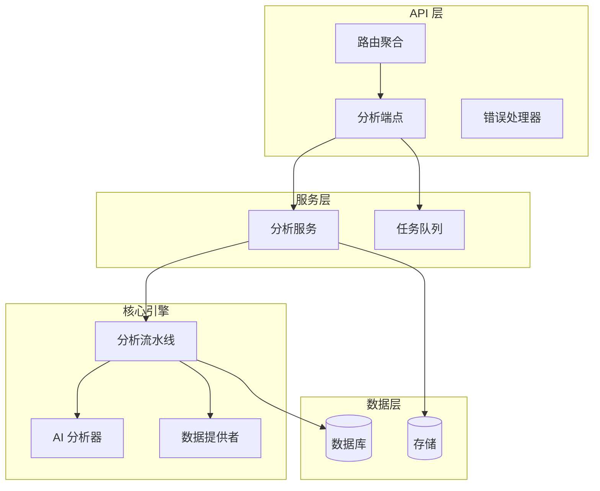
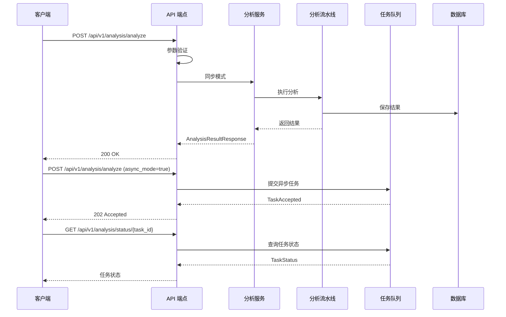
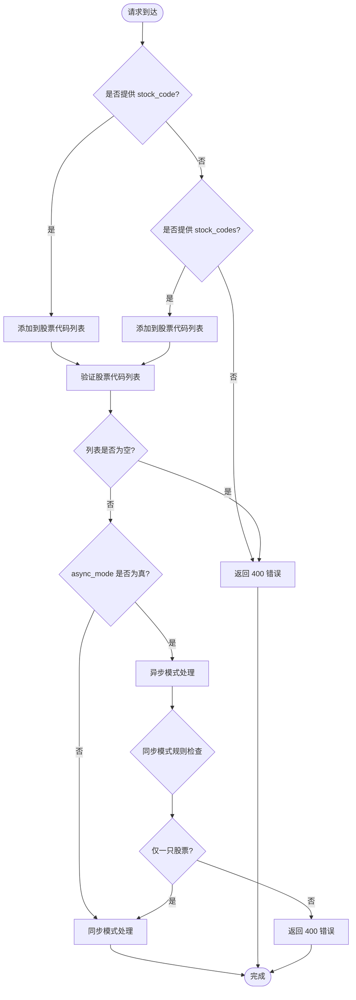
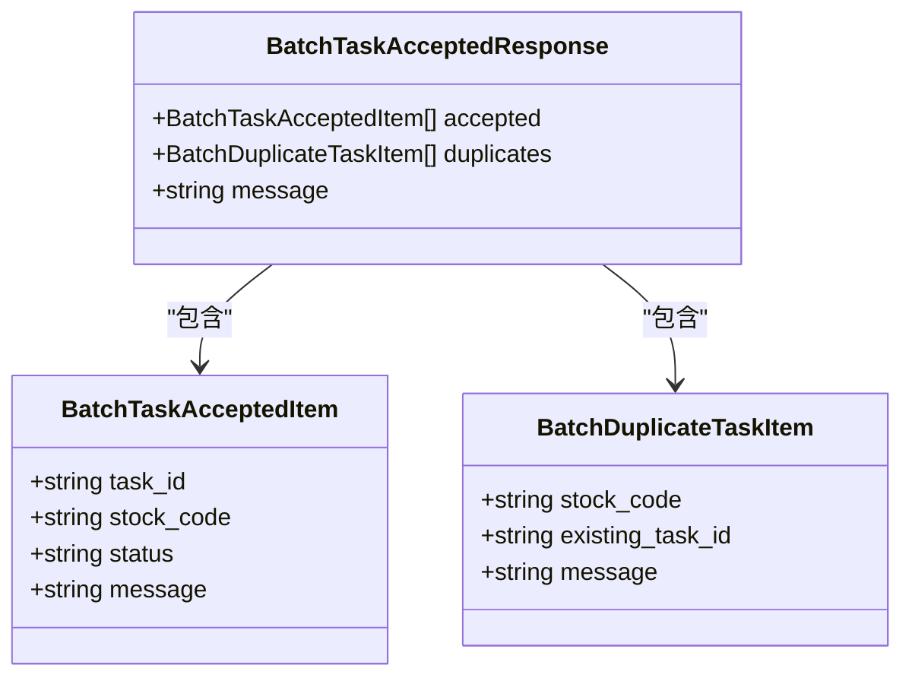
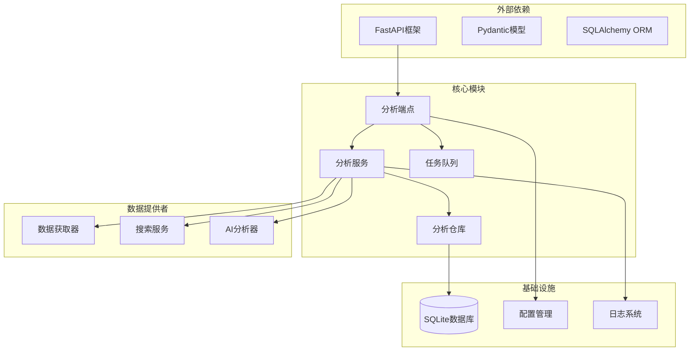
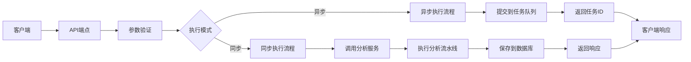

# 触发分析接口

<cite>
**本文档引用的文件**
- [analysis.py](file://api/v1/endpoints/analysis.py)
- [analysis.py](file://api/v1/schemas/analysis.py)
- [analysis_service.py](file://src/services/analysis_service.py)
- [enums.py](file://src/enums.py)
- [pipeline.py](file://src/core/pipeline.py)
- [error_handler.py](file://api/middlewares/error_handler.py)
- [router.py](file://api/v1/router.py)
- [history.py](file://api/v1/schemas/history.py)
- [config.py](file://src/config.py)
</cite>

## 目录
1. [简介](#简介)
2. [项目结构](#项目结构)
3. [核心组件](#核心组件)
4. [架构概览](#架构概览)
5. [详细组件分析](#详细组件分析)
6. [依赖分析](#依赖分析)
7. [性能考虑](#性能考虑)
8. [故障排除指南](#故障排除指南)
9. [结论](#结论)

## 简介
本文档详细描述了触发股票分析接口的完整规范，重点关注 POST /api/v1/analysis/analyze 端点。该接口支持同步和异步两种模式，提供灵活的分析参数配置，并包含完整的错误处理机制。

## 项目结构
分析接口位于 API v1 版本中，采用模块化设计：

**图表来源**
- [router.py:17-35](file://api/v1/router.py#L17-L35)
- [analysis.py:65-694](file://api/v1/endpoints/analysis.py#L65-L694)

**章节来源**
- [router.py:12-72](file://api/v1/router.py#L12-L72)

## 核心组件
分析接口涉及以下核心组件：

### 请求模型
- **AnalyzeRequest**: 定义分析请求的输入参数
- **AnalysisResultResponse**: 同步模式下的完整响应结构
- **TaskAccepted**: 异步模式下的任务接受响应
- **TaskStatus**: 任务状态查询响应

### 服务组件
- **AnalysisService**: 封装分析业务逻辑
- **StockAnalysisPipeline**: 核心分析流水线
- **TaskQueue**: 异步任务队列管理

**章节来源**
- [analysis.py:27-63](file://api/v1/schemas/analysis.py#L27-L63)
- [analysis_service.py:29-171](file://src/services/analysis_service.py#L29-L171)

## 架构概览
分析接口采用分层架构设计，支持同步和异步两种执行模式：

**图表来源**
- [analysis.py:88-301](file://api/v1/endpoints/analysis.py#L88-L301)
- [analysis_service.py:40-105](file://src/services/analysis_service.py#L40-L105)

## 详细组件分析

### 接口规范

#### 基本信息
- **HTTP 方法**: POST
- **路径**: `/api/v1/analysis/analyze`
- **鉴权**: 未指定（根据项目配置）
- **内容类型**: `application/json`

#### 请求参数

##### 必填参数
- **stock_code** (可选): 单只股票代码
  - 类型: `string`
  - 示例: `"600519"`
  - 约束: 与 `stock_codes` 二选一
  
- **stock_codes** (可选): 多只股票代码数组
  - 类型: `array[string]`
  - 示例: `["600519", "000858"]`
  - 约束: 与 `stock_code` 二选一

##### 可选参数
- **report_type** (可选): 报告类型
  - 类型: `string`
  - 默认值: `"detailed"`
  - 可选值: `"simple"`, `"detailed"`, `"full"`, `"brief"`
  - 描述: 简化/详细报告类型
  
- **force_refresh** (可选): 强制刷新
  - 类型: `boolean`
  - 默认值: `true`
  - 描述: 是否忽略缓存强制刷新数据
  
- **async_mode** (可选): 异步模式
  - 类型: `boolean`
  - 默认值: `false`
  - 描述: 是否使用异步模式执行分析

#### 参数验证规则

**图表来源**
- [analysis.py:115-155](file://api/v1/endpoints/analysis.py#L115-L155)

**章节来源**
- [analysis.py:27-63](file://api/v1/schemas/analysis.py#L27-L63)
- [analysis.py:115-155](file://api/v1/endpoints/analysis.py#L115-L155)

### 同步模式响应结构

#### AnalysisResultResponse
同步模式下返回完整的分析结果：

| 字段名 | 类型 | 必填 | 描述 |
|--------|------|------|------|
| query_id | string | 是 | 分析记录唯一标识 |
| stock_code | string | 是 | 股票代码 |
| stock_name | string | 否 | 股票名称 |
| report | object | 否 | 分析报告对象 |
| created_at | string | 是 | 创建时间（ISO 8601格式） |

#### 分析报告结构
报告对象包含以下子结构：

##### ReportMeta
| 字段名 | 类型 | 必填 | 描述 |
|--------|------|------|------|
| query_id | string | 是 | 查询ID |
| stock_code | string | 是 | 股票代码 |
| stock_name | string | 否 | 股票名称 |
| report_type | string | 否 | 报告类型 |
| report_language | string | 否 | 报告语言 |
| created_at | string | 否 | 创建时间 |
| current_price | number | 否 | 当前价格 |
| change_pct | number | 否 | 涨跌幅(%) |
| model_used | string | 否 | 使用的模型 |

##### ReportSummary
| 字段名 | 类型 | 必填 | 描述 |
|--------|------|------|------|
| analysis_summary | string | 否 | 关键结论 |
| operation_advice | string | 否 | 操作建议 |
| trend_prediction | string | 否 | 趋势预测 |
| sentiment_score | integer | 否 | 情绪评分(0-100) |
| sentiment_label | string | 否 | 情绪标签 |

##### ReportStrategy (可选)
| 字段名 | 类型 | 必填 | 描述 |
|--------|------|------|------|
| ideal_buy | string | 否 | 理想买入价 |
| secondary_buy | string | 否 | 第二买入价 |
| stop_loss | string | 否 | 止损价 |
| take_profit | string | 否 | 止盈价 |

##### ReportDetails (可选)
| 字段名 | 类型 | 必填 | 描述 |
|--------|------|------|------|
| news_content | string | 否 | 新闻摘要 |
| raw_result | object | 否 | 原始分析结果 |
| context_snapshot | object | 否 | 分析时上下文快照 |
| financial_report | object | 否 | 结构化财报摘要 |
| dividend_metrics | object | 否 | 结构化分红指标 |

**章节来源**
- [analysis.py:65-89](file://api/v1/schemas/analysis.py#L65-L89)
- [history.py:112-197](file://api/v1/schemas/history.py#L112-L197)

### 异步模式响应格式

#### TaskAccepted
单只股票异步分析的响应格式：

| 字段名 | 类型 | 必填 | 描述 |
|--------|------|------|------|
| task_id | string | 是 | 任务ID，用于状态查询 |
| status | string | 是 | 任务状态（pending/processing） |
| message | string | 否 | 提示信息 |

#### BatchTaskAcceptedResponse
批量股票异步分析的响应格式：

| 字段名 | 类型 | 必填 | 描述 |
|--------|------|------|------|
| accepted | array | 是 | 成功提交的任务列表 |
| duplicates | array | 是 | 重复而跳过的任务列表 |
| message | string | 是 | 汇总信息 |

##### BatchTaskAcceptedItem

**图表来源**
- [analysis.py:112-180](file://api/v1/schemas/analysis.py#L112-L180)

**章节来源**
- [analysis.py:91-232](file://api/v1/endpoints/analysis.py#L91-L232)

### 错误处理机制

#### HTTP 状态码
- **200**: 分析完成（同步模式）
- **202**: 任务已接受（异步模式）
- **400**: 请求参数错误
- **409**: 股票正在分析中，拒绝重复提交
- **500**: 分析失败

#### 错误响应格式
所有错误响应遵循统一格式：

| 字段名 | 类型 | 必填 | 描述 |
|--------|------|------|------|
| error | string | 是 | 错误类型标识 |
| message | string | 是 | 错误详细信息 |
| detail | string | 否 | 详细错误信息（调试模式下） |

#### 重复任务错误
当异步模式下对同一股票重复提交分析请求时，返回 `DuplicateTaskErrorResponse`：

| 字段名 | 类型 | 必填 | 描述 |
|--------|------|------|------|
| error | string | 是 | 错误类型："duplicate_task" |
| message | string | 是 | 错误信息 |
| stock_code | string | 是 | 股票代码 |
| existing_task_id | string | 是 | 已存在的任务ID |

**章节来源**
- [analysis.py:75-84](file://api/v1/endpoints/analysis.py#L75-L84)
- [analysis.py:274-291](file://api/v1/schemas/analysis.py#L274-L291)
- [error_handler.py:24-129](file://api/middlewares/error_handler.py#L24-L129)

### 报告类型映射
API 层的报告类型参数与内部枚举的映射关系：

| API 参数值 | 内部枚举值 | 描述 |
|------------|------------|------|
| `"simple"` | `SIMPLE` | 精简报告 |
| `"detailed"` | `FULL` | 完整报告 |
| `"full"` | `FULL` | 完整报告 |
| `"brief"` | `BRIEF` | 简洁报告 |

**章节来源**
- [analysis.py:40-44](file://api/v1/schemas/analysis.py#L40-L44)
- [enums.py:13-42](file://src/enums.py#L13-L42)

## 依赖分析

### 组件间依赖关系

**图表来源**
- [analysis.py:25-61](file://api/v1/endpoints/analysis.py#L25-L61)
- [analysis_service.py:17-26](file://src/services/analysis_service.py#L17-L26)

### 数据流分析
分析请求的数据流向：

**图表来源**
- [analysis.py:88-301](file://api/v1/endpoints/analysis.py#L88-L301)

**章节来源**
- [analysis.py:161-232](file://api/v1/endpoints/analysis.py#L161-L232)

## 性能考虑
- **并发控制**: 通过 `max_workers` 配置控制最大并发数
- **缓存策略**: 支持强制刷新和缓存机制
- **异步处理**: 异步模式避免阻塞请求处理
- **资源管理**: 合理的内存和数据库连接管理

## 故障排除指南

### 常见问题及解决方案

#### 参数验证错误
**症状**: 返回 400 错误
**可能原因**:
- 未提供股票代码参数
- 同时提供了 `stock_code` 和 `stock_codes`
- 股票代码格式不正确

**解决方法**:
- 确保只提供一个参数：`stock_code` 或 `stock_codes`
- 验证股票代码格式
- 检查参数类型和格式

#### 重复任务错误
**症状**: 返回 409 错误
**可能原因**:
- 同一股票正在分析中
- 重复提交相同的分析请求

**解决方法**:
- 等待现有任务完成
- 使用不同的股票代码
- 检查任务状态

#### 分析失败
**症状**: 返回 500 错误
**可能原因**:
- 数据源访问失败
- AI分析器异常
- 数据库连接问题

**解决方法**:
- 检查数据源配置
- 查看日志文件
- 重试请求

**章节来源**
- [error_handler.py:24-129](file://api/middlewares/error_handler.py#L24-L129)
- [analysis.py:290-301](file://api/v1/endpoints/analysis.py#L290-L301)

## 结论
触发股票分析接口提供了灵活的分析能力，支持同步和异步两种执行模式。通过合理的参数验证、错误处理和响应格式设计，确保了接口的可靠性和易用性。异步模式特别适合批量分析场景，而同步模式适用于需要即时结果的场景。