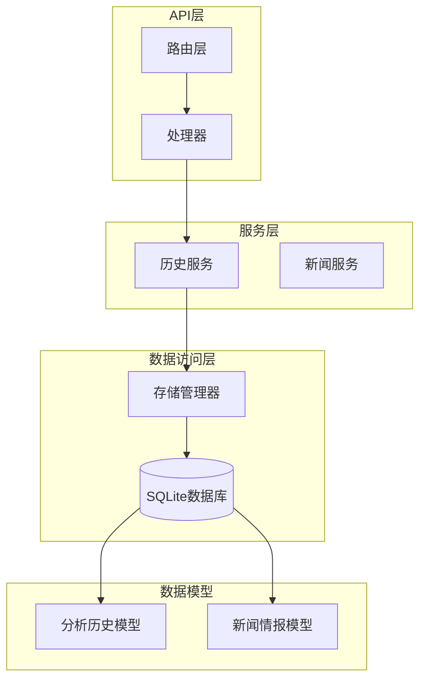
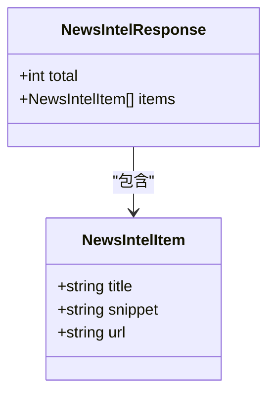
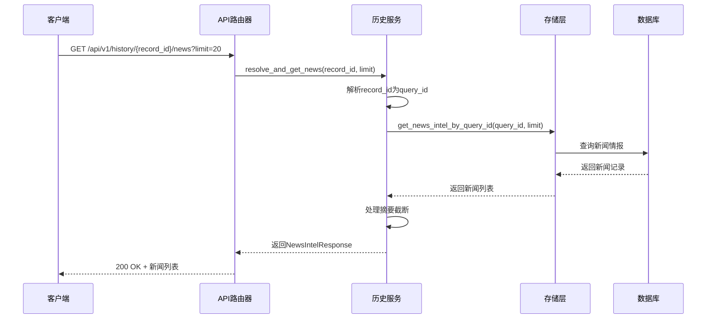
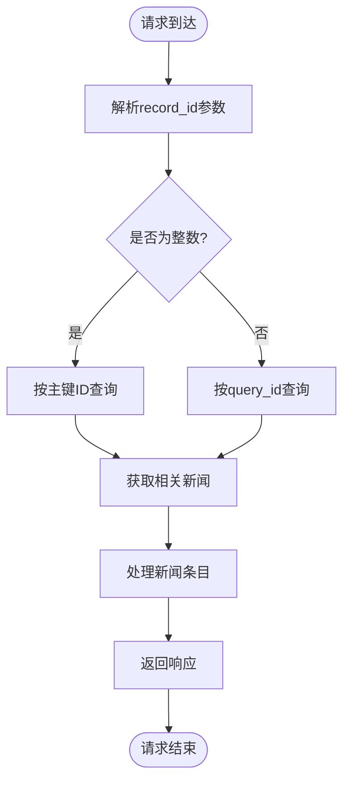
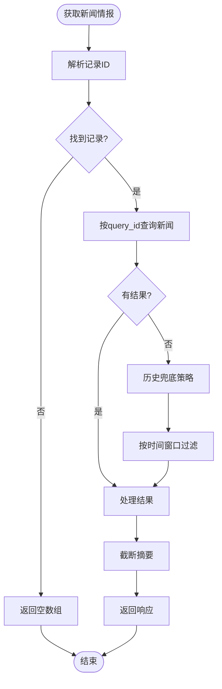
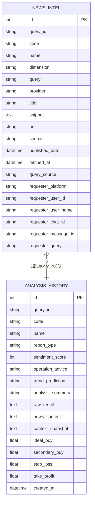
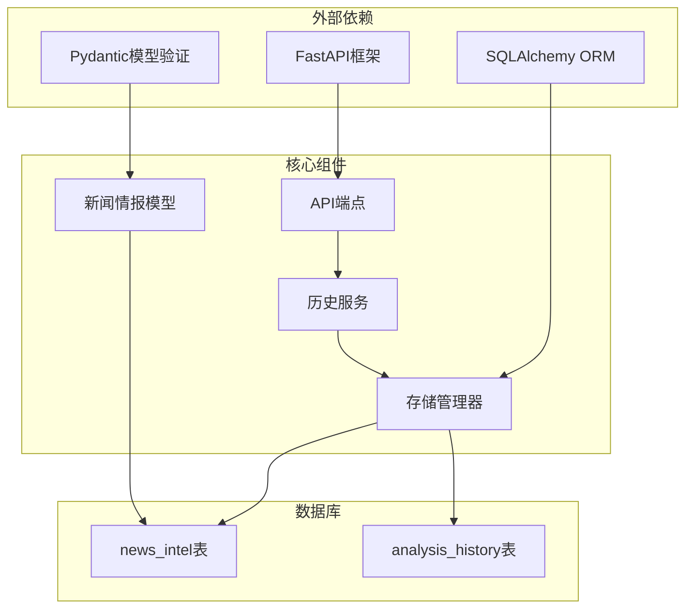
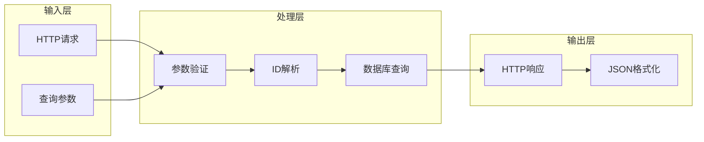

# 关联新闻查询接口

<cite>
**本文档引用的文件**
- [history.py](file://api/v1/endpoints/history.py)
- [history.py](file://api/v1/schemas/history.py)
- [history_service.py](file://src/services/history_service.py)
- [storage.py](file://src/storage.py)
- [test_news_intel.py](file://tests/test_news_intel.py)
</cite>

## 目录
1. [简介](#简介)
2. [项目结构](#项目结构)
3. [核心组件](#核心组件)
4. [架构概览](#架构概览)
5. [详细组件分析](#详细组件分析)
6. [依赖关系分析](#依赖关系分析)
7. [性能考虑](#性能考虑)
8. [故障排除指南](#故障排除指南)
9. [结论](#结论)

## 简介

本文档详细描述了历史报告关联新闻查询接口的完整规范。该接口允许用户根据历史分析记录获取相关的新闻情报，为投资决策提供实时市场信息支持。

## 项目结构

该功能位于系统的API层，采用分层架构设计：

**图表来源**
- [history.py:330-385](file://api/v1/endpoints/history.py#L330-L385)
- [history_service.py:48-63](file://src/services/history_service.py#L48-L63)
- [storage.py:135-181](file://src/storage.py#L135-L181)

**章节来源**
- [history.py:1-50](file://api/v1/endpoints/history.py#L1-L50)
- [history_service.py:1-50](file://src/services/history_service.py#L1-L50)

## 核心组件

### 接口规范

**端点**: `GET /api/v1/history/{record_id}/news`

**路径参数**:
- `record_id`: 分析历史记录的主键ID或query_id（字符串形式）

**查询参数**:
- `limit`: 返回数量限制（1-100，默认20）

**响应模型**: `NewsIntelResponse`

**章节来源**
- [history.py:330-385](file://api/v1/endpoints/history.py#L330-L385)

### 响应结构定义

**图表来源**
- [history.py:97-110](file://api/v1/schemas/history.py#L97-L110)
- [history.py:80-95](file://api/v1/schemas/history.py#L80-L95)

**章节来源**
- [history.py:80-110](file://api/v1/schemas/history.py#L80-L110)

## 架构概览

该接口采用典型的三层架构模式：

**图表来源**
- [history.py:340-385](file://api/v1/endpoints/history.py#L340-L385)
- [history_service.py:179-199](file://src/services/history_service.py#L179-L199)
- [storage.py:1032-1056](file://src/storage.py#L1032-L1056)

## 详细组件分析

### API端点实现

#### 路由定义
接口在API路由器中定义，支持灵活的record_id解析：

**图表来源**
- [history.py:340-385](file://api/v1/endpoints/history.py#L340-L385)
- [history_service.py:137-158](file://src/services/history_service.py#L137-L158)

#### 参数验证机制
- `record_id`: 支持整数主键ID或字符串query_id
- `limit`: 数值范围验证（1-100），默认20

**章节来源**
- [history.py:340-385](file://api/v1/endpoints/history.py#L340-L385)

### 服务层逻辑

#### 新闻情报获取策略

**图表来源**
- [history_service.py:308-341](file://src/services/history_service.py#L308-L341)
- [history_service.py:369-421](file://src/services/history_service.py#L369-L421)

#### 历史兜底策略
当直接按query_id查询无结果时，系统会：
1. 查找分析历史记录
2. 获取同股票近期新闻
3. 按分析时间窗口精确匹配
4. 应用新闻时效性过滤

**章节来源**
- [history_service.py:369-421](file://src/services/history_service.py#L369-L421)

### 数据模型设计

#### 新闻情报数据模型

**图表来源**
- [storage.py:135-181](file://src/storage.py#L135-L181)
- [storage.py:1108-1148](file://src/storage.py#L1108-L1148)

**章节来源**
- [storage.py:135-181](file://src/storage.py#L135-L181)

### 错误处理机制

#### 空结果处理
- 当记录不存在时：返回200状态码，空数组
- 当查询无结果时：返回200状态码，空数组

#### 服务器错误处理
- 数据库异常：抛出HTTP 500错误
- 参数验证失败：抛出HTTP 400错误
- 记录不存在：抛出HTTP 404错误

**章节来源**
- [history.py:377-385](file://api/v1/endpoints/history.py#L377-L385)
- [history_service.py:190-198](file://src/services/history_service.py#L190-L198)

## 依赖关系分析

### 组件耦合关系

**图表来源**
- [history.py:15-42](file://api/v1/endpoints/history.py#L15-L42)
- [history_service.py:30-62](file://src/services/history_service.py#L30-L62)
- [storage.py:44-51](file://src/storage.py#L44-L51)

### 数据流分析

**图表来源**
- [history.py:340-385](file://api/v1/endpoints/history.py#L340-L385)
- [history_service.py:179-199](file://src/services/history_service.py#L179-L199)

**章节来源**
- [history.py:330-385](file://api/v1/endpoints/history.py#L330-L385)
- [history_service.py:179-200](file://src/services/history_service.py#L179-L200)

## 性能考虑

### 查询优化策略

1. **索引优化**
   - `news_intel.query_id` 索引支持快速查找
   - `news_intel.code + news_intel.published_date` 复合索引优化时间范围查询
   - `analysis_history.query_id` 索引支持历史记录关联

2. **查询限制**
   - 默认限制20条记录，最大100条
   - 使用LIMIT子句避免大量数据传输

3. **内存管理**
   - 流式查询避免大结果集内存占用
   - 摘要截断减少文本传输量

### 缓存策略

- **历史兜底查询**：基于分析时间窗口的本地缓存
- **URL去重**：数据库层面的URL唯一约束
- **时间过滤**：应用新闻时效性过滤减少无关数据

## 故障排除指南

### 常见问题及解决方案

#### 1. 查询无结果
**症状**: 返回空数组
**原因**: 
- 记录ID不存在
- 新闻情报尚未生成
- 新闻已过期被过滤

**解决方法**:
- 验证record_id的有效性
- 检查分析历史记录是否存在
- 确认新闻情报收集流程正常

#### 2. 服务器错误
**症状**: HTTP 500错误
**原因**:
- 数据库连接异常
- SQL查询语法错误
- 内存不足

**解决方法**:
- 检查数据库连接状态
- 查看服务器日志
- 优化查询条件

#### 3. 参数验证错误
**症状**: HTTP 400错误
**原因**:
- limit参数超出范围
- record_id格式不正确

**解决方法**:
- 确保limit在1-100范围内
- 验证record_id格式

**章节来源**
- [history.py:117-125](file://api/v1/endpoints/history.py#L117-L125)
- [history.py:377-385](file://api/v1/endpoints/history.py#L377-L385)

### 测试验证

系统包含完整的单元测试，验证新闻情报的存储和查询逻辑：

- URL去重机制测试
- 无URL情况下的兜底键测试  
- 最近新闻查询测试

**章节来源**
- [test_news_intel.py:51-160](file://tests/test_news_intel.py#L51-L160)

## 结论

历史报告关联新闻查询接口提供了完整的新闻情报检索能力，具有以下特点：

1. **灵活的查询方式**：支持通过主键ID或query_id查询
2. **强大的容错机制**：历史兜底策略确保新闻情报的可用性
3. **严格的参数控制**：范围验证保证系统稳定性
4. **高效的性能表现**：索引优化和查询限制提升响应速度
5. **完善的错误处理**：清晰的错误信息帮助问题诊断

该接口为投资决策提供了及时、准确的市场信息支持，是整个分析系统的重要组成部分。