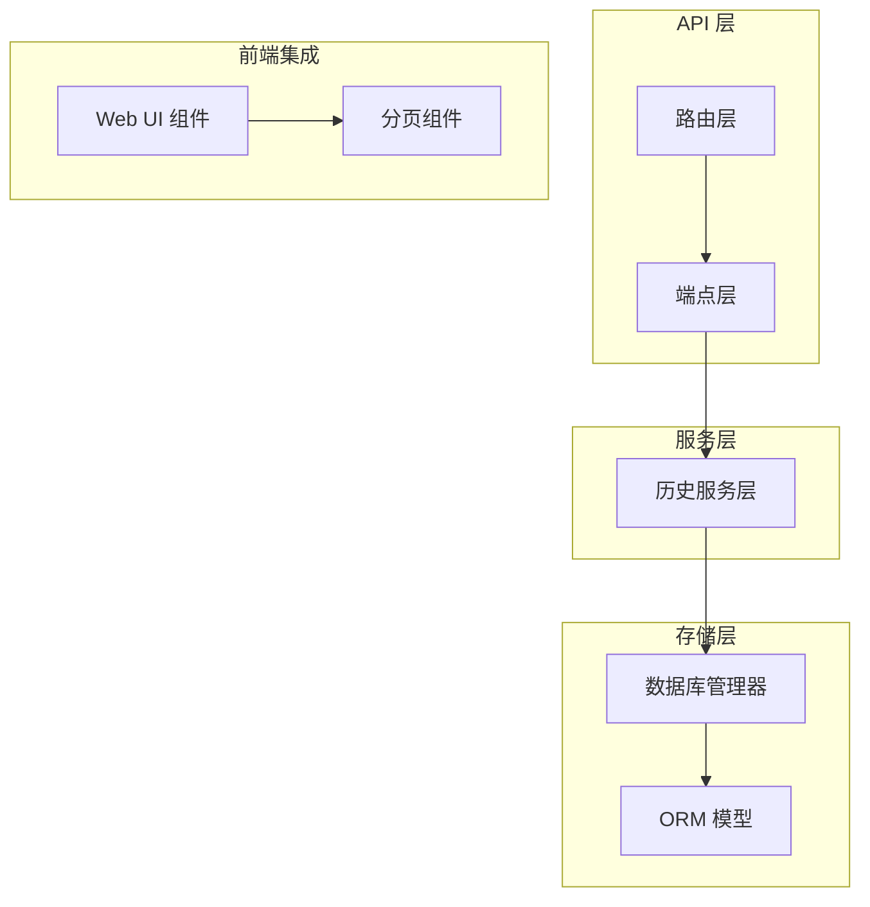
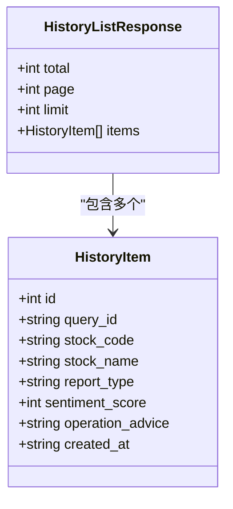
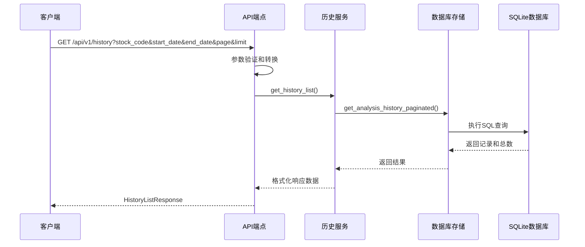
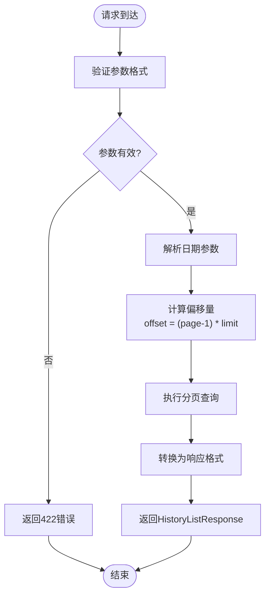
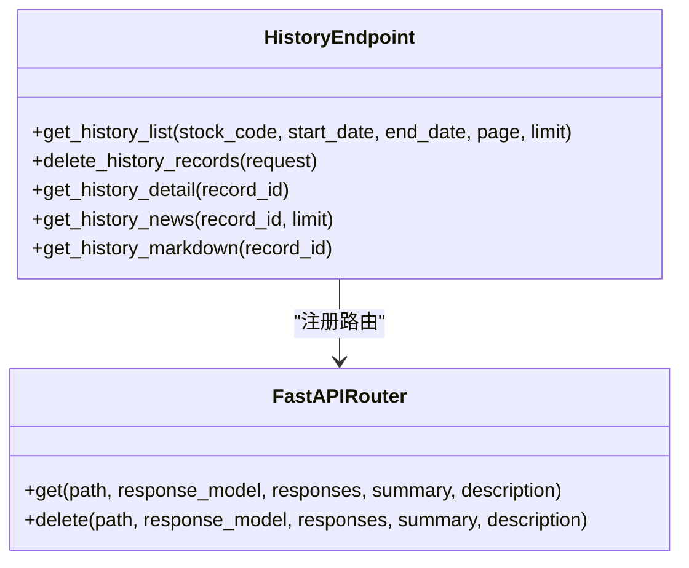
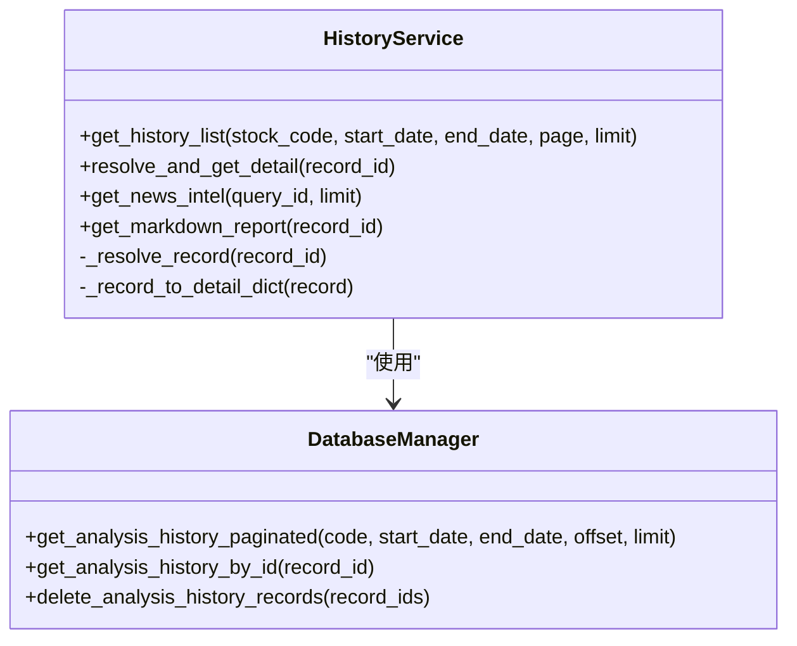
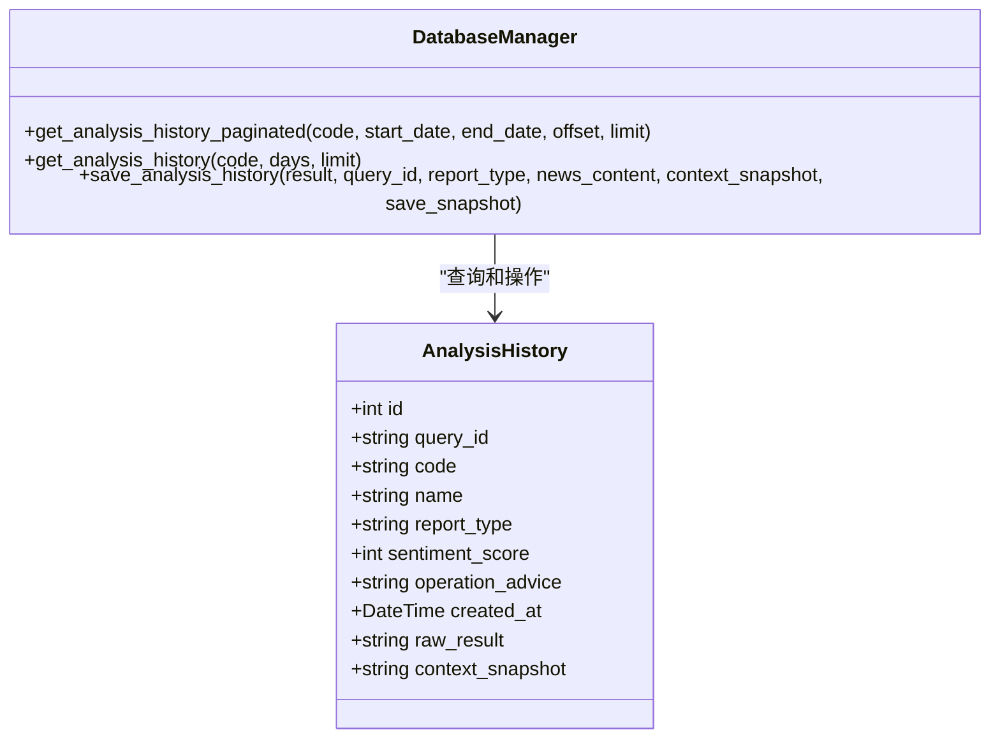
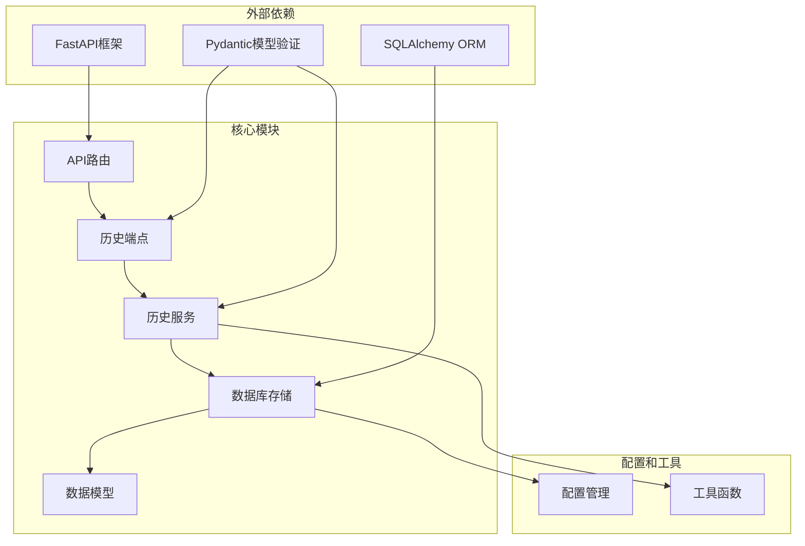
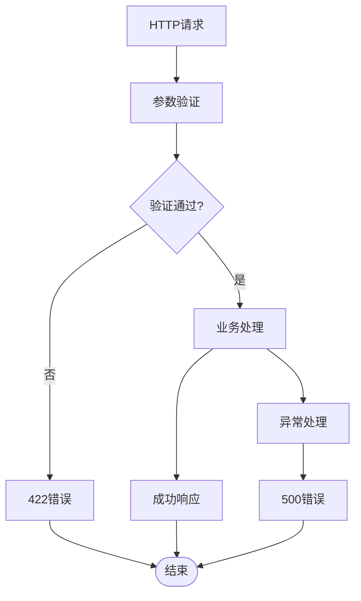
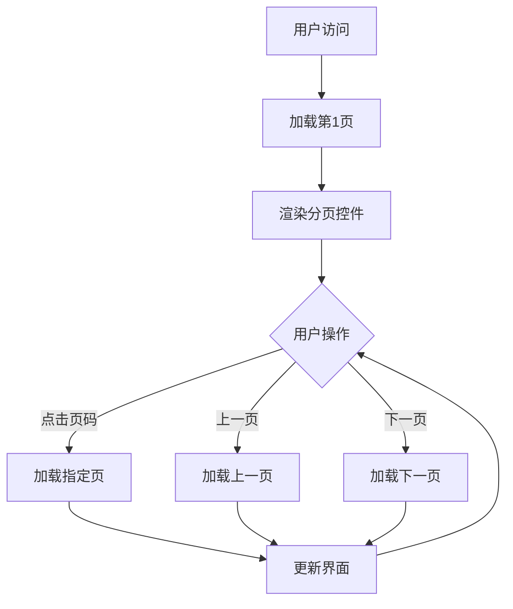

# 历史列表查询接口

<cite>
**本文档引用的文件**
- [api/v1/endpoints/history.py](file://api/v1/endpoints/history.py)
- [api/v1/schemas/history.py](file://api/v1/schemas/history.py)
- [src/services/history_service.py](file://src/services/history_service.py)
- [src/storage.py](file://src/storage.py)
- [api/v1/router.py](file://api/v1/router.py)
- [apps/dsa-web/src/components/common/Pagination.tsx](file://apps/dsa-web/src/components/common/Pagination.tsx)
</cite>

## 目录
1. [简介](#简介)
2. [项目结构](#项目结构)
3. [核心组件](#核心组件)
4. [架构概览](#架构概览)
5. [详细组件分析](#详细组件分析)
6. [依赖关系分析](#依赖关系分析)
7. [性能考虑](#性能考虑)
8. [故障排除指南](#故障排除指南)
9. [结论](#结论)

## 简介
本文档详细描述了历史记录列表查询接口的完整规范，包括 GET /api/v1/history 接口的参数格式、验证规则、分页机制、响应结构等。该接口支持按股票代码和日期范围进行筛选，并提供了完整的分页查询能力。

## 项目结构
历史记录查询功能位于 API v1 版本中，采用分层架构设计：

**图表来源**
- [api/v1/router.py:17-41](file://api/v1/router.py#L17-L41)
- [api/v1/endpoints/history.py:46-46](file://api/v1/endpoints/history.py#L46-L46)
- [src/services/history_service.py:48-62](file://src/services/history_service.py#L48-L62)

**章节来源**
- [api/v1/router.py:17-41](file://api/v1/router.py#L17-L41)
- [api/v1/endpoints/history.py:46-46](file://api/v1/endpoints/history.py#L46-L46)

## 核心组件

### 接口规范
- **端点**: GET /api/v1/history
- **功能**: 分页获取历史分析记录摘要
- **支持筛选**: 股票代码、开始日期、结束日期
- **分页机制**: page(从1开始)、limit(1-100)、total

### 参数定义
| 参数名 | 类型 | 必填 | 默认值 | 说明 |
|--------|------|------|--------|------|
| stock_code | string | 否 | - | 股票代码筛选条件 |
| start_date | string | 否 | - | 开始日期，格式: YYYY-MM-DD |
| end_date | string | 否 | - | 结束日期，格式: YYYY-MM-DD |
| page | integer | 是 | 1 | 页码，从1开始 |
| limit | integer | 是 | 20 | 每页数量，1-100 |

### 响应结构

**图表来源**
- [api/v1/schemas/history.py:49-65](file://api/v1/schemas/history.py#L49-L65)
- [api/v1/schemas/history.py:17-46](file://api/v1/schemas/history.py#L17-L46)

**章节来源**
- [api/v1/endpoints/history.py:59-126](file://api/v1/endpoints/history.py#L59-L126)
- [api/v1/schemas/history.py:49-65](file://api/v1/schemas/history.py#L49-L65)

## 架构概览

### 请求处理流程

**图表来源**
- [api/v1/endpoints/history.py:83-116](file://api/v1/endpoints/history.py#L83-L116)
- [src/services/history_service.py:64-136](file://src/services/history_service.py#L64-L136)
- [src/storage.py:1150-1202](file://src/storage.py#L1150-L1202)

### 数据流图

**图表来源**
- [api/v1/endpoints/history.py:83-116](file://api/v1/endpoints/history.py#L83-L116)
- [src/services/history_service.py:85-135](file://src/services/history_service.py#L85-L135)

**章节来源**
- [src/services/history_service.py:64-136](file://src/services/history_service.py#L64-L136)
- [src/storage.py:1150-1202](file://src/storage.py#L1150-L1202)

## 详细组件分析

### API端点实现
API端点负责参数接收、验证和响应转换：

**图表来源**
- [api/v1/endpoints/history.py:49-452](file://api/v1/endpoints/history.py#L49-L452)

### 服务层逻辑
服务层封装了业务逻辑和数据处理：

**图表来源**
- [src/services/history_service.py:48-62](file://src/services/history_service.py#L48-L62)
- [src/storage.py:1150-1202](file://src/storage.py#L1150-L1202)

### 存储层实现
存储层处理数据库操作和查询优化：

**图表来源**
- [src/storage.py:1150-1202](file://src/storage.py#L1150-L1202)

**章节来源**
- [api/v1/endpoints/history.py:59-126](file://api/v1/endpoints/history.py#L59-L126)
- [src/services/history_service.py:64-136](file://src/services/history_service.py#L64-L136)
- [src/storage.py:1150-1202](file://src/storage.py#L1150-L1202)

## 依赖关系分析

### 组件依赖图

**图表来源**
- [api/v1/router.py:14-41](file://api/v1/router.py#L14-L41)
- [api/v1/endpoints/history.py:15-42](file://api/v1/endpoints/history.py#L15-L42)
- [src/services/history_service.py:18-34](file://src/services/history_service.py#L18-L34)

### 错误处理机制

**图表来源**
- [api/v1/endpoints/history.py:117-125](file://api/v1/endpoints/history.py#L117-L125)

**章节来源**
- [api/v1/endpoints/history.py:117-125](file://api/v1/endpoints/history.py#L117-L125)

## 性能考虑

### 查询优化策略
1. **索引优化**: 数据库表已建立适当的索引
   - `code` 字段索引用于股票代码筛选
   - `created_at` 字段索引用于时间范围查询
   - 复合索引优化常用查询组合

2. **分页优化**: 
   - 使用 `LIMIT` 和 `OFFSET` 实现高效分页
   - 先查询总数再查询数据，避免全表扫描

3. **内存优化**:
   - 流式查询减少内存占用
   - 按需加载数据，避免不必要的字段

### 大数据量处理策略
1. **分页大小控制**: 限制每页最大100条记录
2. **时间范围限制**: 建议使用合理的日期范围缩小查询范围
3. **索引利用**: 确保查询条件能够有效利用数据库索引

### 前端分页最佳实践

**图表来源**
- [apps/dsa-web/src/components/common/Pagination.tsx:55-110](file://apps/dsa-web/src/components/common/Pagination.tsx#L55-L110)

**章节来源**
- [apps/dsa-web/src/components/common/Pagination.tsx:55-110](file://apps/dsa-web/src/components/common/Pagination.tsx#L55-L110)

## 故障排除指南

### 常见问题及解决方案

#### 参数验证错误
- **症状**: 返回422状态码
- **原因**: 参数格式不正确或超出范围
- **解决**: 检查参数格式是否符合要求

#### 数据库查询错误
- **症状**: 返回500状态码
- **原因**: 数据库连接问题或查询异常
- **解决**: 检查数据库连接状态和查询语句

#### 日期格式错误
- **症状**: 日期参数被忽略
- **原因**: 日期格式不符合YYYY-MM-DD格式
- **解决**: 确保日期格式严格遵循YYYY-MM-DD

### 调试建议
1. **启用日志**: 查看服务器端日志获取详细错误信息
2. **参数检查**: 验证所有输入参数的有效性
3. **数据库监控**: 监控数据库查询性能和连接状态

**章节来源**
- [api/v1/endpoints/history.py:117-125](file://api/v1/endpoints/history.py#L117-L125)
- [src/services/history_service.py:133-135](file://src/services/history_service.py#L133-L135)

## 结论
历史记录列表查询接口提供了完整的分页查询能力，支持多种筛选条件和灵活的参数配置。通过合理的架构设计和性能优化策略，该接口能够高效处理大量历史数据查询需求。建议在实际使用中遵循参数格式规范，合理设置分页参数，并结合前端分页组件实现良好的用户体验。