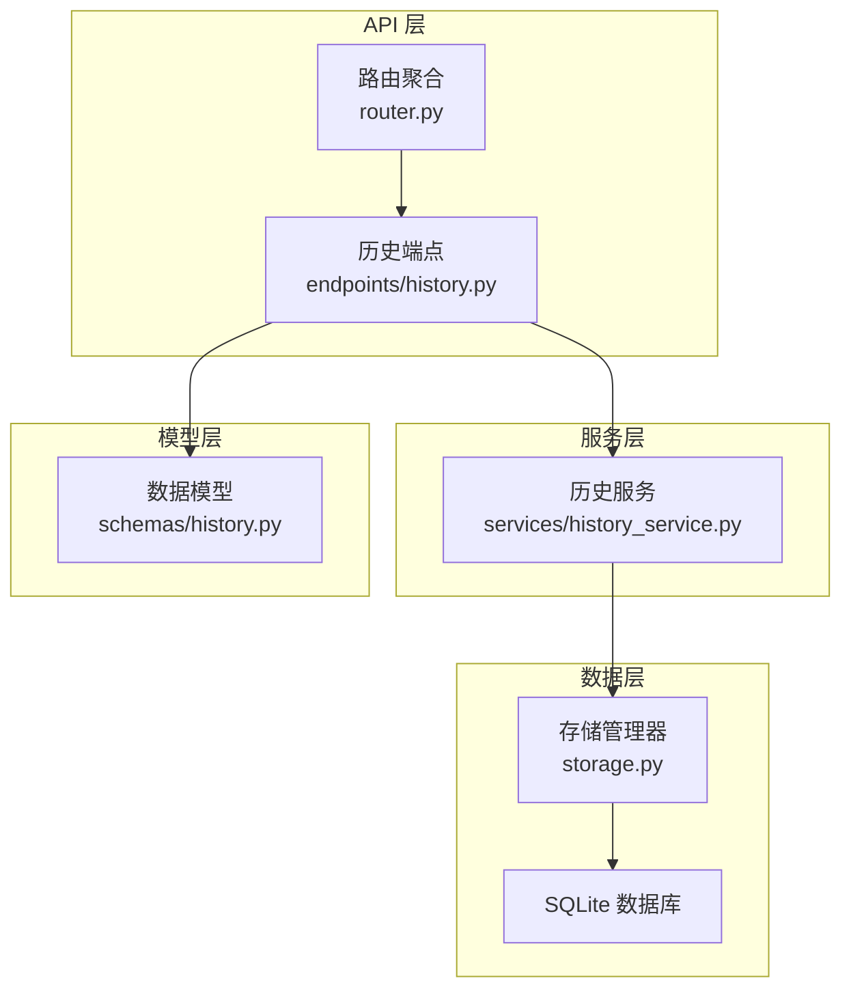
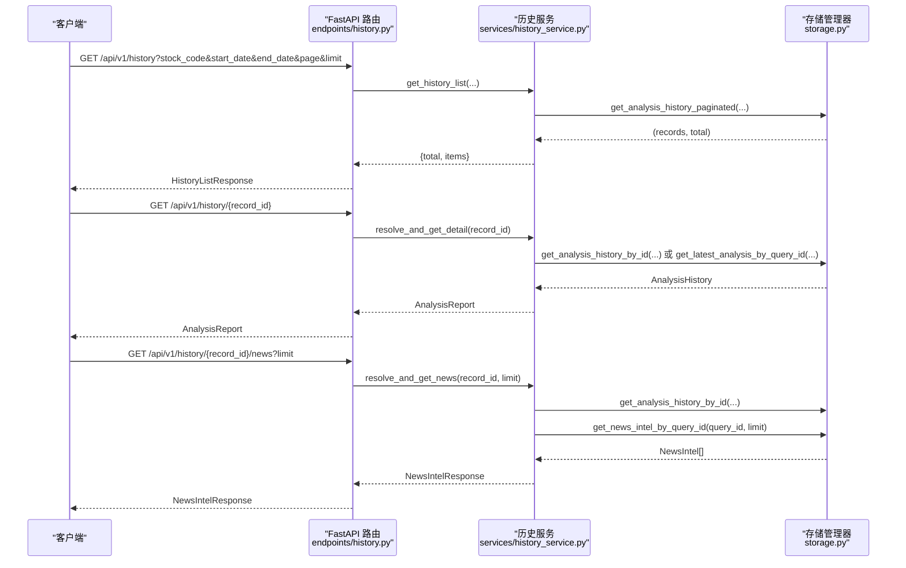
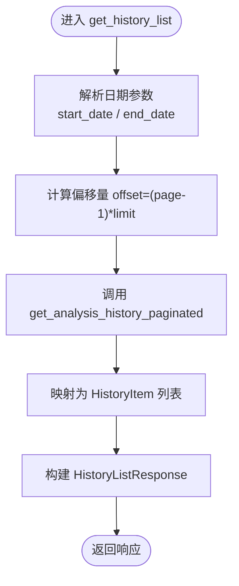
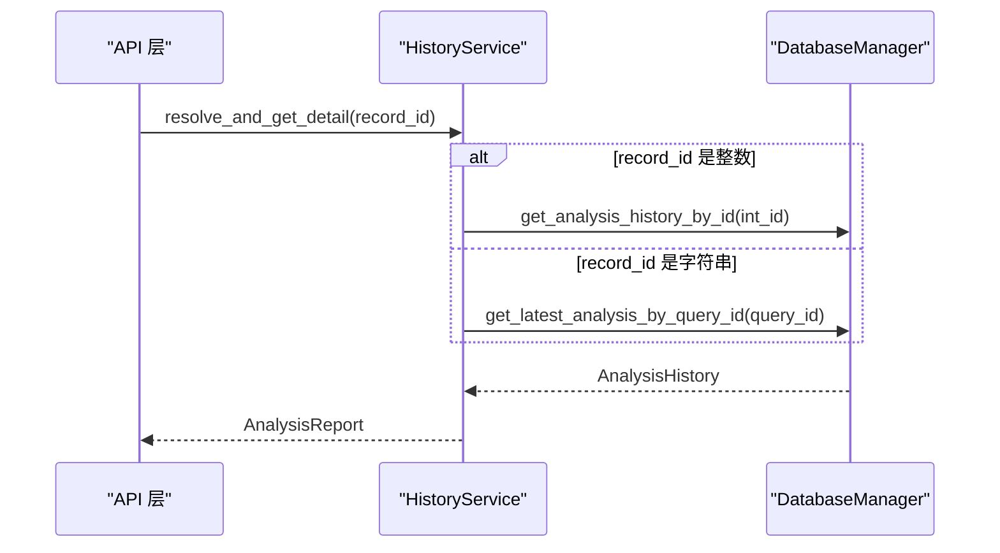
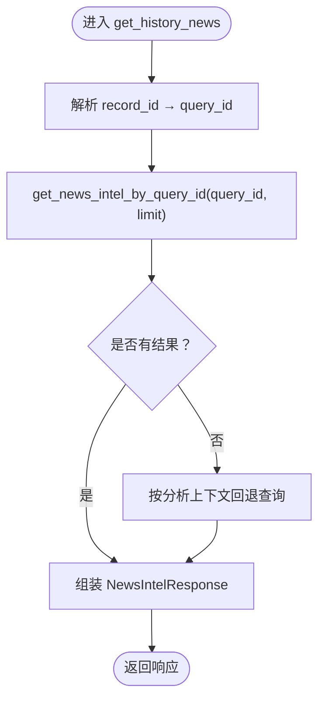
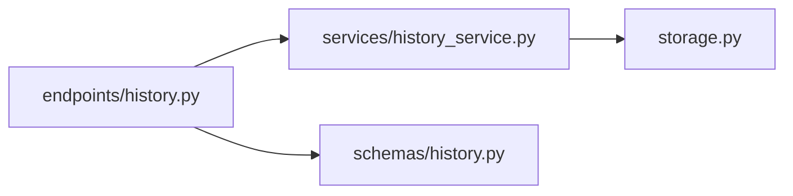

# 历史查询接口

<cite>
**本文档引用的文件**
- [history.py](file://api/v1/endpoints/history.py)
- [history.py](file://api/v1/schemas/history.py)
- [history_service.py](file://src/services/history_service.py)
- [storage.py](file://src/storage.py)
- [router.py](file://api/v1/router.py)
- [analysis_repo.py](file://src/repositories/analysis_repo.py)
- [config.py](file://src/config.py)
- [test_analysis_history.py](file://tests/test_analysis_history.py)
</cite>

## 目录
1. [简介](#简介)
2. [项目结构](#项目结构)
3. [核心组件](#核心组件)
4. [架构总览](#架构总览)
5. [详细组件分析](#详细组件分析)
6. [依赖关系分析](#依赖关系分析)
7. [性能考虑](#性能考虑)
8. [故障排查指南](#故障排查指南)
9. [结论](#结论)
10. [附录](#附录)

## 简介
本文件为历史查询API接口组的完整参考文档，覆盖以下接口：
- GET /api/v1/history：历史记录列表查询（支持股票筛选、日期范围过滤、分页）
- GET /api/v1/history/{record_id}：历史报告详情查询（支持主键ID或query_id）
- GET /api/v1/history/{record_id}/news：历史报告关联新闻查询（支持limit）

并提供HistoryListResponse、HistoryItem、AnalysisReport、NewsIntelResponse等数据模型的字段说明与示例，以及性能优化与缓存策略建议。

## 项目结构
历史查询接口位于API v1版本，路由前缀为/api/v1，具体组织如下：
- 路由聚合：在router.py中统一挂载history子路由
- 控制器：在endpoints/history.py中定义各端点
- 数据模型：在schemas/history.py中定义Pydantic模型
- 业务服务：在services/history_service.py中封装查询逻辑
- 数据访问：在storage.py中提供数据库查询方法
- 仓储层：在repositories/analysis_repo.py中提供分析历史的CRUD封装

图表来源
- [router.py:17-41](file://api/v1/router.py#L17-L41)
- [history.py:46-452](file://api/v1/endpoints/history.py#L46-L452)
- [history_service.py:48-919](file://src/services/history_service.py#L48-L919)
- [storage.py:623-1202](file://src/storage.py#L623-L1202)
- [history.py:17-211](file://api/v1/schemas/history.py#L17-L211)

章节来源
- [router.py:17-41](file://api/v1/router.py#L17-L41)
- [history.py:46-452](file://api/v1/endpoints/history.py#L46-L452)

## 核心组件
- 历史列表查询接口
  - 方法：GET
  - 路径：/api/v1/history
  - 查询参数：
    - stock_code：股票代码筛选（可选）
    - start_date：开始日期（YYYY-MM-DD，可选）
    - end_date：结束日期（YYYY-MM-DD，可选）
    - page：页码（从1开始，必填，默认1）
    - limit：每页数量（1-100，必填，默认20）
  - 响应：HistoryListResponse
- 历史详情查询接口
  - 方法：GET
  - 路径：/api/v1/history/{record_id}
  - 路径参数：record_id（整数主键ID或字符串query_id）
  - 响应：AnalysisReport
- 历史新闻查询接口
  - 方法：GET
  - 路径：/api/v1/history/{record_id}/news
  - 路径参数：record_id（整数主键ID或字符串query_id）
  - 查询参数：limit（1-100，默认20）
  - 响应：NewsIntelResponse

章节来源
- [history.py:49-126](file://api/v1/endpoints/history.py#L49-L126)
- [history.py:173-327](file://api/v1/endpoints/history.py#L173-L327)
- [history.py:330-385](file://api/v1/endpoints/history.py#L330-L385)

## 架构总览
历史查询接口的典型调用流程如下：

图表来源
- [history.py:59-126](file://api/v1/endpoints/history.py#L59-L126)
- [history.py:184-327](file://api/v1/endpoints/history.py#L184-L327)
- [history.py:340-385](file://api/v1/endpoints/history.py#L340-L385)
- [history_service.py:64-136](file://src/services/history_service.py#L64-L136)
- [history_service.py:160-199](file://src/services/history_service.py#L160-L199)
- [history_service.py:308-341](file://src/services/history_service.py#L308-L341)
- [storage.py:1150-1202](file://src/storage.py#L1150-L1202)
- [storage.py:1204-1267](file://src/storage.py#L1204-L1267)
- [storage.py:1032-1056](file://src/storage.py#L1032-L1056)

## 详细组件分析

### 历史列表查询接口（GET /api/v1/history）
- 功能概述
  - 支持按股票代码、日期范围进行筛选
  - 支持分页（page从1开始，limit 1-100）
  - 返回历史记录摘要列表
- 参数与校验
  - stock_code：字符串，可选
  - start_date：字符串，格式YYYY-MM-DD，可选
  - end_date：字符串，格式YYYY-MM-DD，可选
  - page：整数，≥1，默认1
  - limit：整数，1-100，默认20
- 处理流程
  - 调用HistoryService.get_history_list
  - 服务层解析日期参数，计算offset=(page-1)*limit
  - 调用DatabaseManager.get_analysis_history_paginated
  - 将ORM记录映射为HistoryItem列表
  - 组装HistoryListResponse返回
- 错误处理
  - 服务层捕获异常并返回空列表
  - API层捕获异常并返回500及错误详情

图表来源
- [history.py:59-126](file://api/v1/endpoints/history.py#L59-L126)
- [history_service.py:64-136](file://src/services/history_service.py#L64-L136)
- [storage.py:1150-1202](file://src/storage.py#L1150-L1202)

章节来源
- [history.py:49-126](file://api/v1/endpoints/history.py#L49-L126)
- [history_service.py:64-136](file://src/services/history_service.py#L64-L136)
- [storage.py:1150-1202](file://src/storage.py#L1150-L1202)

### 历史详情查询接口（GET /api/v1/history/{record_id}）
- 功能概述
  - 支持通过主键ID或query_id查询历史报告详情
  - 自动解析record_id：优先尝试整数主键，否则按query_id查询
  - 返回AnalysisReport，包含元信息、概览、策略、详情等
- 参数与解析
  - 路径参数：record_id（字符串，整数或query_id）
- 处理流程
  - HistoryService.resolve_and_get_detail
  - 若record_id为整数：优先按主键查询
  - 否则按query_id查询最新记录
  - 从context_snapshot或fallback_fundamental提取实时价格与涨跌幅
  - 规范化报告语言、本地化文本
  - 组装ReportMeta、ReportSummary、ReportStrategy、ReportDetails
- 错误处理
  - 未找到记录：返回404及错误详情
  - 服务器异常：返回500及错误详情

图表来源
- [history.py:184-327](file://api/v1/endpoints/history.py#L184-L327)
- [history_service.py:160-177](file://src/services/history_service.py#L160-L177)
- [history_service.py:137-159](file://src/services/history_service.py#L137-L159)
- [storage.py:1204-1267](file://src/storage.py#L1204-L1267)

章节来源
- [history.py:173-327](file://api/v1/endpoints/history.py#L173-L327)
- [history_service.py:137-177](file://src/services/history_service.py#L137-L177)
- [storage.py:1204-1267](file://src/storage.py#L1204-L1267)

### 历史新闻查询接口（GET /api/v1/history/{record_id}/news）
- 功能概述
  - 根据record_id解析为query_id，查询关联新闻情报
  - 支持limit参数限制返回数量（1-100）
  - 返回NewsIntelResponse，包含total与items
- 参数与解析
  - 路径参数：record_id（整数主键ID或字符串query_id）
  - 查询参数：limit（1-100，默认20）
- 处理流程
  - HistoryService.resolve_and_get_news
  - 解析record_id→query_id
  - 调用get_news_intel_by_query_id
  - 截断摘要至200字符
  - 组装NewsIntelResponse
- 回退机制
  - 若直接查询无结果，按分析上下文回退：同股票近N日新闻，按分析时间窗口过滤

图表来源
- [history.py:340-385](file://api/v1/endpoints/history.py#L340-L385)
- [history_service.py:179-199](file://src/services/history_service.py#L179-L199)
- [history_service.py:308-341](file://src/services/history_service.py#L308-L341)
- [history_service.py:369-421](file://src/services/history_service.py#L369-L421)
- [storage.py:1032-1056](file://src/storage.py#L1032-L1056)

章节来源
- [history.py:330-385](file://api/v1/endpoints/history.py#L330-L385)
- [history_service.py:179-199](file://src/services/history_service.py#L179-L199)
- [history_service.py:308-421](file://src/services/history_service.py#L308-L421)
- [storage.py:1032-1056](file://src/storage.py#L1032-L1056)

### 数据模型详解

#### HistoryListResponse
- 字段
  - total: 整数，总记录数
  - page: 整数，当前页码（从1开始）
  - limit: 整数，每页数量
  - items: HistoryItem数组
- 示例
  - total: 100
  - page: 1
  - limit: 20
  - items: []

章节来源
- [history.py:49-66](file://api/v1/schemas/history.py#L49-L66)

#### HistoryItem
- 字段
  - id: 整数，分析历史记录主键ID（可选）
  - query_id: 字符串，分析记录关联的query_id
  - stock_code: 字符串，股票代码
  - stock_name: 字符串，股票名称（可选）
  - report_type: 字符串，报告类型（可选）
  - sentiment_score: 整数，情绪评分(0-100)（可选）
  - operation_advice: 字符串，操作建议（可选）
  - created_at: 字符串，创建时间（可选）
- 示例
  - id: 1234
  - query_id: "abc123"
  - stock_code: "600519"
  - stock_name: "贵州茅台"
  - report_type: "detailed"
  - sentiment_score: 75
  - operation_advice: "持有"
  - created_at: "2024-01-01T12:00:00"

章节来源
- [history.py:17-47](file://api/v1/schemas/history.py#L17-L47)

#### AnalysisReport
- 字段
  - meta: ReportMeta，元信息
  - summary: ReportSummary，概览区
  - strategy: ReportStrategy（可选），策略点位区
  - details: ReportDetails（可选），详情区
- 示例
  - meta: {query_id, stock_code, stock_name, report_type, report_language, created_at}
  - summary: {analysis_summary, operation_advice, trend_prediction, sentiment_score, sentiment_label}
  - strategy: {ideal_buy, secondary_buy, stop_loss, take_profit}
  - details: null

章节来源
- [history.py:163-198](file://api/v1/schemas/history.py#L163-L198)

#### ReportMeta
- 字段
  - id: 整数，分析历史记录主键ID（可选）
  - query_id: 字符串，分析记录关联的query_id
  - stock_code: 字符串，股票代码
  - stock_name: 字符串，股票名称（可选）
  - report_type: 字符串，报告类型（可选）
  - report_language: 字符串，报告输出语言（zh/en）（可选）
  - created_at: 字符串，创建时间（可选）
  - current_price: 浮点数，分析时股价（可选）
  - change_pct: 浮点数，分析时涨跌幅(%)（可选）
  - model_used: 字符串，分析使用的LLM模型（可选）

章节来源
- [history.py:112-127](file://api/v1/schemas/history.py#L112-L127)

#### ReportSummary
- 字段
  - analysis_summary: 字符串，关键结论（可选）
  - operation_advice: 字符串，操作建议（可选）
  - trend_prediction: 字符串，趋势预测（可选）
  - sentiment_score: 整数，情绪评分(0-100)（可选）
  - sentiment_label: 字符串，情绪标签（可选）

章节来源
- [history.py:129-142](file://api/v1/schemas/history.py#L129-L142)

#### ReportStrategy
- 字段
  - ideal_buy: 字符串，理想买入价（可选）
  - secondary_buy: 字符串，第二买入价（可选）
  - stop_loss: 字符串，止损价（可选）
  - take_profit: 字符串，止盈价（可选）

章节来源
- [history.py:144-151](file://api/v1/schemas/history.py#L144-L151)

#### ReportDetails
- 字段
  - news_content: 字符串，新闻摘要（可选）
  - raw_result: 任意JSON，原始分析结果（可选）
  - context_snapshot: 任意JSON，分析时上下文快照（可选）
  - financial_report: 任意JSON，结构化财报摘要（来自fundamental_context，可选）
  - dividend_metrics: 任意JSON，结构化分红指标（含TTM口径）（可选）

章节来源
- [history.py:153-161](file://api/v1/schemas/history.py#L153-L161)

#### NewsIntelResponse
- 字段
  - total: 整数，新闻条数
  - items: NewsIntelItem数组
- 示例
  - total: 2
  - items: []

章节来源
- [history.py:97-110](file://api/v1/schemas/history.py#L97-L110)

#### NewsIntelItem
- 字段
  - title: 字符串，新闻标题
  - snippet: 字符串，新闻摘要（最多200字，默认空字符串）
  - url: 字符串，新闻链接
- 示例
  - title: "公司发布业绩快报，营收同比增长 20%"
  - snippet: "公司公告显示，季度营收同比增长 20%..."
  - url: "https://example.com/news/123"

章节来源
- [history.py:80-95](file://api/v1/schemas/history.py#L80-L95)

## 依赖关系分析
- 控制器到服务层
  - endpoints/history.py依赖services/history_service.py提供的查询方法
- 服务层到数据层
  - history_service.py依赖storage.py的数据库查询方法
- 数据层到数据库
  - storage.py通过SQLAlchemy ORM访问SQLite数据库
- 模型到控制器
  - schemas/history.py定义的Pydantic模型作为响应体

图表来源
- [history.py:18-31](file://api/v1/endpoints/history.py#L18-L31)
- [history_service.py:30-31](file://src/services/history_service.py#L30-L31)
- [storage.py:623-675](file://src/storage.py#L623-L675)
- [history.py:14-14](file://api/v1/schemas/history.py#L14-L14)

章节来源
- [history.py:18-31](file://api/v1/endpoints/history.py#L18-L31)
- [history_service.py:30-31](file://src/services/history_service.py#L30-L31)
- [storage.py:623-675](file://src/storage.py#L623-L675)
- [history.py:14-14](file://api/v1/schemas/history.py#L14-L14)

## 性能考虑
- 分页与索引
  - 历史列表查询使用offset/limit分页，数据库层通过created_at降序排序并返回总数
  - AnalysisHistory表在code、created_at上建立索引，提升按股票与时间的查询效率
- 日期范围过滤
  - start_date与end_date分别转为“00:00:00”与“23:59:59”边界，确保包含当天数据
- 新闻查询回退
  - 当query_id无直接结果时，按分析时间窗口与股票代码回退查询，避免空结果
- 缓存策略建议
  - 实时行情缓存：配置realtime_cache_ttl（秒），减少外部数据源压力
  - 本地缓存：对热点历史记录详情可采用进程内缓存（需评估内存占用与一致性）
  - 数据库层面：确保SQLite连接池健康检查（pool_pre_ping），避免长时间空闲连接失效
- 限流与重试
  - 配置gemini_request_delay、gemini_max_retries等参数，避免外部API限流
- 批量删除回测关联
  - 删除历史记录时自动清理关联回测结果，避免外键约束失败

章节来源
- [storage.py:1150-1202](file://src/storage.py#L1150-L1202)
- [storage.py:1204-1267](file://src/storage.py#L1204-L1267)
- [history_service.py:369-421](file://src/services/history_service.py#L369-L421)
- [config.py:426-437](file://src/config.py#L426-L437)

## 故障排查指南
- 常见错误
  - 404 未找到：record_id不存在或解析失败
  - 500 服务器错误：查询过程中发生异常
- 排查步骤
  - 检查record_id格式：整数主键或query_id字符串
  - 核对日期格式：start_date/end_date必须为YYYY-MM-DD
  - 核对分页参数：page≥1，limit在1-100范围内
  - 查看服务层日志：history_service.py中捕获的异常信息
- 单元测试参考
  - 测试历史详情解析与本地化：tests/test_analysis_history.py
  - 测试新闻回退策略：tests/test_analysis_history.py

章节来源
- [history.py:117-126](file://api/v1/endpoints/history.py#L117-L126)
- [history.py:210-218](file://api/v1/endpoints/history.py#L210-L218)
- [history.py:377-385](file://api/v1/endpoints/history.py#L377-L385)
- [test_analysis_history.py:297-362](file://tests/test_analysis_history.py#L297-L362)
- [test_analysis_history.py:363-510](file://tests/test_analysis_history.py#L363-L510)

## 结论
历史查询API接口组提供了完整的股票分析历史查询能力，涵盖列表、详情与关联新闻三类接口，并通过清晰的数据模型与完善的错误处理保障稳定性。结合数据库索引、分页查询与新闻回退策略，可在保证查询效率的同时提升用户体验。建议在生产环境中配合缓存与限流策略，进一步优化性能与可靠性。

## 附录
- 路由前缀：/api/v1
- 历史端点挂载：router.py中include_router(/history)
- 数据模型定义：schemas/history.py
- 服务实现：services/history_service.py
- 数据访问：storage.py

章节来源
- [router.py:37-41](file://api/v1/router.py#L37-L41)
- [history.py:17-211](file://api/v1/schemas/history.py#L17-L211)
- [history_service.py:48-919](file://src/services/history_service.py#L48-L919)
- [storage.py:623-1202](file://src/storage.py#L623-L1202)