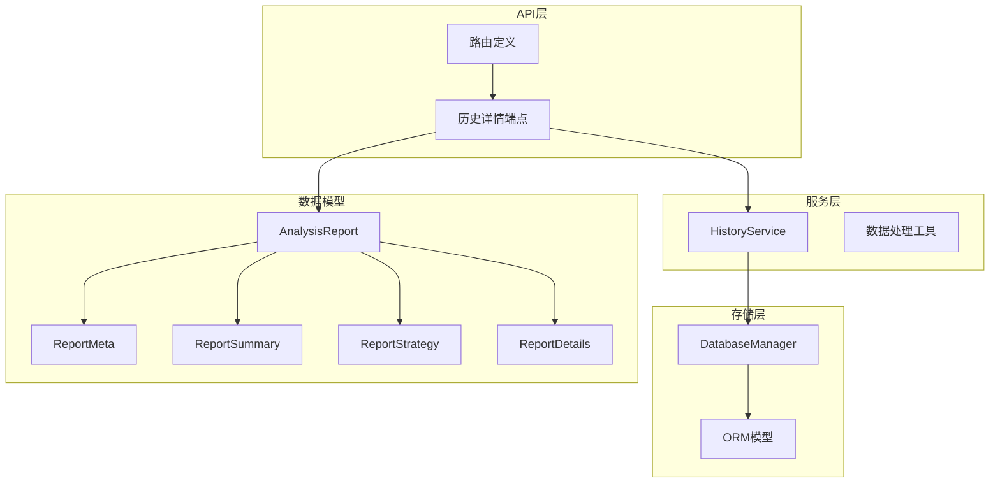
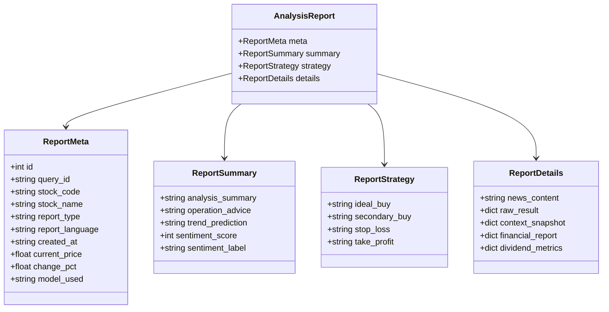
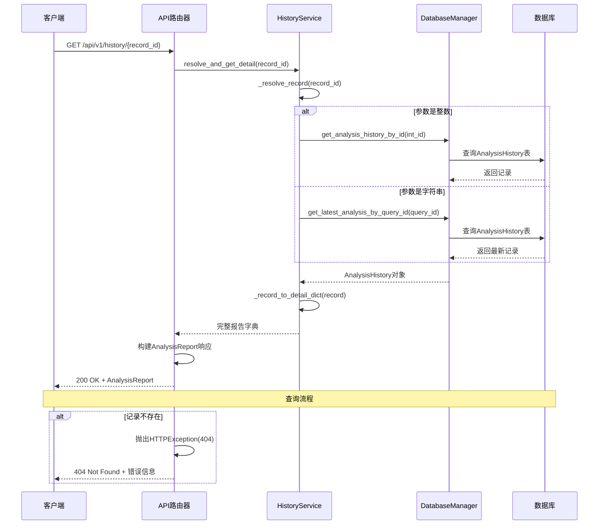
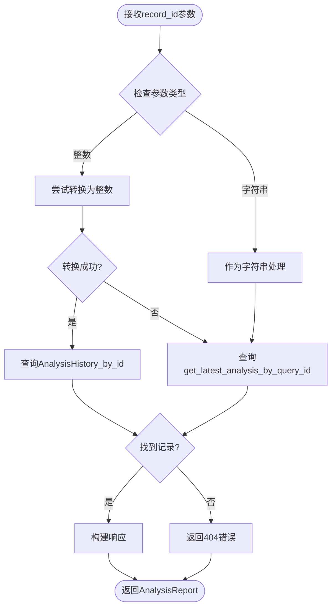
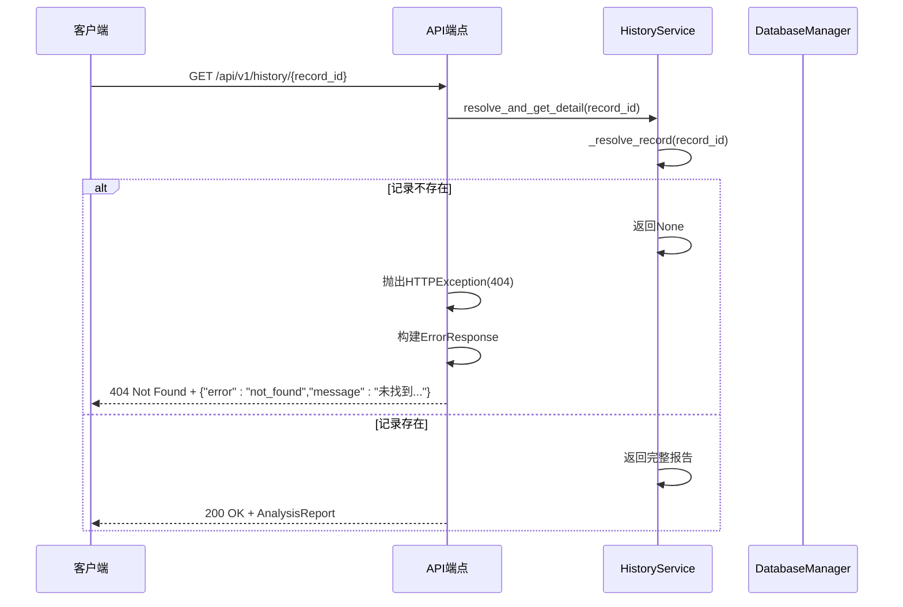
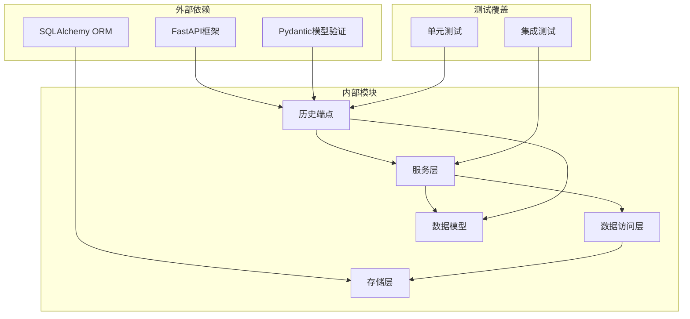

# 历史详情查询接口

<cite>
**本文档引用的文件**
- [history.py](file://api/v1/endpoints/history.py)
- [history.py](file://api/v1/schemas/history.py)
- [history_service.py](file://src/services/history_service.py)
- [storage.py](file://src/storage.py)
- [analysis_repo.py](file://src/repositories/analysis_repo.py)
- [test_analysis_history.py](file://tests/test_analysis_history.py)
</cite>

## 目录
1. [简介](#简介)
2. [项目结构](#项目结构)
3. [核心组件](#核心组件)
4. [架构概览](#架构概览)
5. [详细组件分析](#详细组件分析)
6. [依赖关系分析](#依赖关系分析)
7. [性能考虑](#性能考虑)
8. [故障排除指南](#故障排除指南)
9. [结论](#结论)

## 简介

本文档详细描述了历史报告详情查询接口的完整规范，包括GET /api/v1/history/{query_id}接口的实现细节、数据模型结构、查询机制和错误处理。该接口支持通过分析历史记录的主键ID或query_id两种方式获取完整的分析报告详情。

## 项目结构

历史详情查询接口位于API版本化的端点中，采用分层架构设计：



**图表来源**
- [history.py:173-327](file://api/v1/endpoints/history.py#L173-L327)
- [history_service.py:48-62](file://src/services/history_service.py#L48-L62)
- [storage.py:208-269](file://src/storage.py#L208-L269)

**章节来源**
- [history.py:1-452](file://api/v1/endpoints/history.py#L1-L452)
- [history.py:1-211](file://api/v1/schemas/history.py#L1-L211)

## 核心组件

### 接口规范

历史详情查询接口提供以下功能特性：

- **双模式查询支持**：同时支持主键ID和query_id两种查询方式
- **自动类型识别**：智能识别参数类型并选择相应的查询策略
- **完整报告结构**：返回包含元信息、技术分析、基本面分析、市场情绪和操作建议的完整报告
- **错误处理机制**：完善的404未找到错误处理和响应格式

### 数据模型结构

AnalysisReport完整报告数据模型包含四个主要子模块：



**图表来源**
- [history.py:112-197](file://api/v1/schemas/history.py#L112-L197)

**章节来源**
- [history.py:112-197](file://api/v1/schemas/history.py#L112-L197)

## 架构概览

历史详情查询接口采用经典的三层架构模式：



**图表来源**
- [history.py:184-327](file://api/v1/endpoints/history.py#L184-L327)
- [history_service.py:137-177](file://src/services/history_service.py#L137-L177)

## 详细组件分析

### 查询参数处理机制

接口支持两种查询参数格式，具有智能识别和处理能力：

#### 参数格式要求

| 参数类型 | 格式要求 | 示例 | 唯一性约束 |
|---------|---------|------|-----------|
| 主键ID | 整数字符串 | "12345" | 数据库主键唯一 |
| query_id | 字符串 | "abc123def456" | 分析记录关联唯一 |

#### 查询解析流程



**图表来源**
- [history_service.py:137-158](file://src/services/history_service.py#L137-L158)

### 数据模型详细说明

#### ReportMeta（报告元信息）

ReportMeta模块包含报告的基本元数据信息：

| 字段名 | 类型 | 必填 | 描述 | 约束 |
|-------|------|------|------|------|
| id | int | 否 | 分析历史记录主键ID | 数据库自增主键 |
| query_id | string | 是 | 分析记录关联的query_id | 唯一标识分析批次 |
| stock_code | string | 是 | 股票代码 | 10字符以内 |
| stock_name | string | 否 | 股票名称 | 可本地化 |
| report_type | string | 否 | 报告类型 | 如"detailed","simple" |
| report_language | string | 否 | 报告输出语言 | "zh"或"en" |
| created_at | string | 否 | 创建时间 | ISO 8601格式 |
| current_price | float | 否 | 分析时股价 | 数值类型 |
| change_pct | float | 否 | 分析时涨跌幅(%) | 数值类型 |
| model_used | string | 否 | 分析使用的LLM模型 | 模型名称 |

#### ReportSummary（报告概览区）

ReportSummary模块包含分析的核心结论：

| 字段名 | 类型 | 必填 | 描述 | 约束 |
|-------|------|------|------|------|
| analysis_summary | string | 否 | 关键结论 | 文本内容 |
| operation_advice | string | 否 | 操作建议 | "买入","卖出","持有"等 |
| trend_prediction | string | 否 | 趋势预测 | "看多","看空","中性"等 |
| sentiment_score | int | 否 | 情绪评分 (0-100) | 0-100范围 |
| sentiment_label | string | 否 | 情绪标签 | 本地化后的标签 |

#### ReportStrategy（策略点位区）

ReportStrategy模块包含具体的交易策略建议：

| 字段名 | 类型 | 必填 | 描述 | 约束 |
|-------|------|------|------|------|
| ideal_buy | string | 否 | 理想买入价 | 价格字符串或数值 |
| secondary_buy | string | 否 | 第二买入价 | 价格字符串或数值 |
| stop_loss | string | 否 | 止损价 | 价格字符串或数值 |
| take_profit | string | 否 | 止盈价 | 价格字符串或数值 |

#### ReportDetails（报告详情区）

ReportDetails模块包含详细的分析内容：

| 字段名 | 类型 | 必填 | 描述 | 约束 |
|-------|------|------|------|------|
| news_content | string | 否 | 新闻摘要 | 文本内容 |
| raw_result | dict | 否 | 原始分析结果(JSON) | 结构化数据 |
| context_snapshot | dict | 否 | 分析时上下文快照(JSON) | 结构化数据 |
| financial_report | dict | 否 | 结构化财报摘要 | 来自fundamental_context |
| dividend_metrics | dict | 否 | 结构化分红指标 | 包含TTM口径 |

**章节来源**
- [history.py:112-197](file://api/v1/schemas/history.py#L112-L197)

### 错误处理机制

#### 404未找到错误处理

当查询的记录不存在时，接口返回标准的404错误响应：



**图表来源**
- [history.py:210-217](file://api/v1/endpoints/history.py#L210-L217)

#### 错误响应格式

所有错误响应遵循统一的格式：

```json
{
  "error": "not_found",
  "message": "未找到 id/query_id=12345 的分析记录"
}
```

**章节来源**
- [history.py:210-217](file://api/v1/endpoints/history.py#L210-L217)

### 存储结构和查询优化

#### 数据库表结构

历史记录存储在AnalysisHistory表中，具有以下关键字段：

```mermaid
erDiagram
ANALYSIS_HISTORY {
int id PK
string query_id IDX
string code IDX
string name
string report_type IDX
int sentiment_score
string operation_advice
string trend_prediction
text analysis_summary
text raw_result
text news_content
text context_snapshot
float ideal_buy
float secondary_buy
float stop_loss
float take_profit
datetime created_at IDX
}
NEWS_INTEL {
int id PK
string query_id IDX
string code IDX
string name
string dimension
string query
string provider
string title
text snippet
string url
datetime published_date IDX
datetime fetched_at IDX
}
FUNDAMENTAL_SNAPSHOT {
int id PK
string query_id IDX
string code IDX
text payload
text source_chain
text coverage
datetime created_at IDX
}
ANALYSIS_HISTORY ||--o{ NEWS_INTEL : "关联"
ANALYSIS_HISTORY ||--o{ FUNDAMENTAL_SNAPSHOT : "关联"
```

**图表来源**
- [storage.py:208-269](file://src/storage.py#L208-L269)
- [storage.py:135-181](file://src/storage.py#L135-L181)
- [storage.py:183-206](file://src/storage.py#L183-L206)

#### 查询优化策略

1. **索引优化**：AnalysisHistory表的关键字段都建立了适当的索引
2. **延迟加载**：非必要的字段采用延迟加载策略
3. **缓存机制**：热门查询结果进行缓存
4. **分页查询**：支持大数据量的分页查询

**章节来源**
- [storage.py:245-247](file://src/storage.py#L245-L247)

## 依赖关系分析

历史详情查询接口的依赖关系如下：



**图表来源**
- [history.py:15-42](file://api/v1/endpoints/history.py#L15-L42)
- [history_service.py:12-36](file://src/services/history_service.py#L12-L36)

**章节来源**
- [history.py:15-42](file://api/v1/endpoints/history.py#L15-L42)
- [history_service.py:12-36](file://src/services/history_service.py#L12-L36)

## 性能考虑

### 查询性能优化

1. **主键查询优先**：当参数为整数时，优先使用主键查询，避免索引扫描
2. **字符串查询降级**：当参数为字符串时，使用最新的query_id记录，确保一致性
3. **批量查询优化**：支持批量查询历史记录，减少数据库往返次数

### 内存使用优化

1. **流式处理**：大文本字段采用流式处理，避免内存溢出
2. **懒加载**：非必要字段延迟加载，减少初始内存占用
3. **连接池管理**：合理配置数据库连接池，避免连接泄漏

## 故障排除指南

### 常见问题及解决方案

#### 1. 查询参数格式错误

**问题**：传入的record_id既不是有效的整数也不是有效的字符串

**解决方案**：
- 确保传入的参数符合要求
- 检查客户端代码中的参数传递

#### 2. 记录不存在

**问题**：返回404错误

**排查步骤**：
1. 验证record_id参数的正确性
2. 检查数据库中是否存在对应的记录
3. 确认查询权限

#### 3. 数据库连接问题

**问题**：查询超时或连接失败

**解决方案**：
1. 检查数据库连接配置
2. 验证数据库服务状态
3. 查看数据库连接池配置

**章节来源**
- [history.py:210-217](file://api/v1/endpoints/history.py#L210-L217)
- [history_service.py:137-177](file://src/services/history_service.py#L137-L177)

## 结论

历史报告详情查询接口提供了完整、可靠的分析报告查询功能。通过双模式查询支持、完善的错误处理机制和优化的存储结构，该接口能够满足各种查询场景的需求。接口设计遵循RESTful原则，响应格式标准化，便于前端集成和使用。

主要特点包括：
- 支持多种查询参数格式
- 完整的报告数据模型
- 标准化的错误处理
- 优化的数据库查询
- 良好的扩展性设计