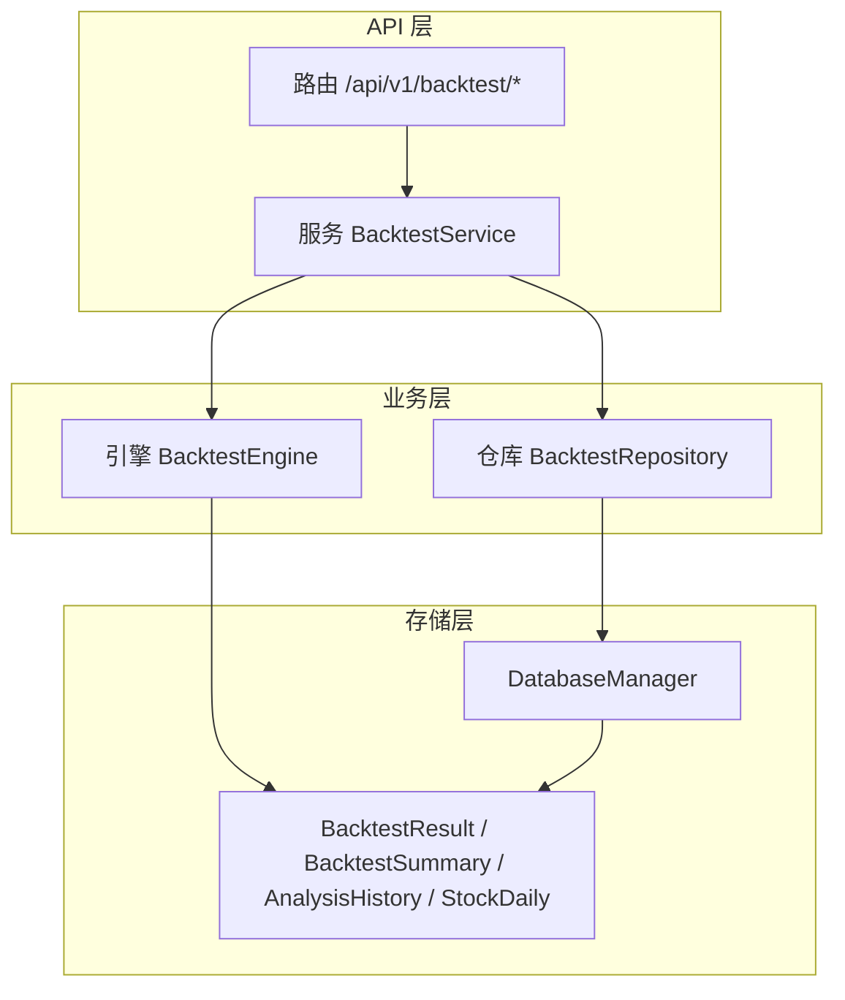
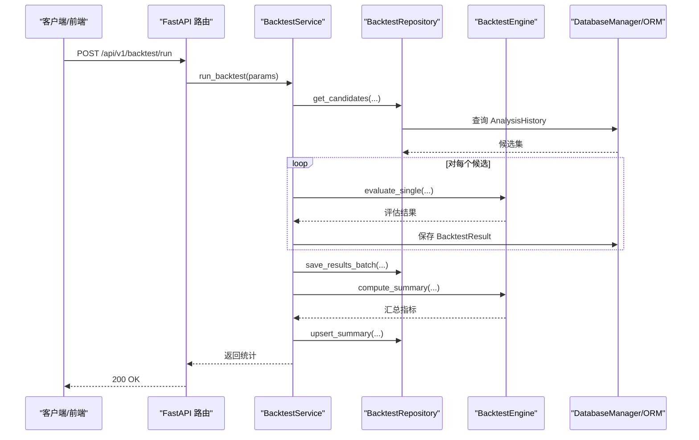
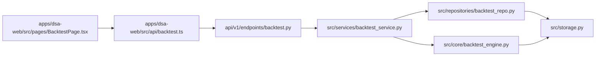
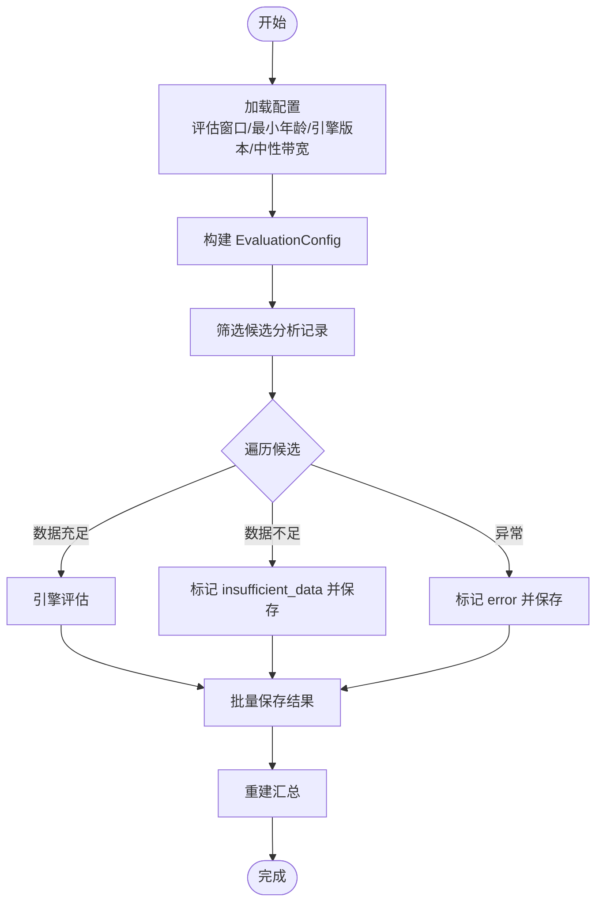

# 回测接口

<cite>
**本文引用的文件**
- [api/v1/endpoints/backtest.py](file://api/v1/endpoints/backtest.py)
- [api/v1/schemas/backtest.py](file://api/v1/schemas/backtest.py)
- [src/services/backtest_service.py](file://src/services/backtest_service.py)
- [src/repositories/backtest_repo.py](file://src/repositories/backtest_repo.py)
- [src/core/backtest_engine.py](file://src/core/backtest_engine.py)
- [src/storage.py](file://src/storage.py)
- [api/v1/router.py](file://api/v1/router.py)
- [src/config.py](file://src/config.py)
- [apps/dsa-web/src/api/backtest.ts](file://apps/dsa-web/src/api/backtest.ts)
- [apps/dsa-web/src/types/backtest.ts](file://apps/dsa-web/src/types/backtest.ts)
- [apps/dsa-web/src/pages/BacktestPage.tsx](file://apps/dsa-web/src/pages/BacktestPage.tsx)
- [tests/test_backtest_service.py](file://tests/test_backtest_service.py)
</cite>

## 目录
1. [简介](#简介)
2. [项目结构](#项目结构)
3. [核心组件](#核心组件)
4. [架构总览](#架构总览)
5. [详细组件分析](#详细组件分析)
6. [依赖分析](#依赖分析)
7. [性能考量](#性能考量)
8. [故障排查指南](#故障排查指南)
9. [结论](#结论)
10. [附录](#附录)

## 简介
本文件为回测验证API接口的完整参考文档，覆盖回测参数配置、历史数据选择、策略参数设置、回测结果查询、任务状态管理、执行流程、性能评估指标、风险控制参数、结果可视化接口、数据质量验证、参数优化策略与结果解释指南，以及使用限制、并发控制与错误处理机制。目标读者既包括后端开发者，也包括前端与产品同学，帮助快速理解与集成回测能力。

## 项目结构
回测API位于后端FastAPI应用中，采用“路由-服务-仓库-引擎-存储”的分层设计，前端Web应用通过REST接口消费回测能力。

图表来源
- [api/v1/router.py:17-53](file://api/v1/router.py#L17-L53)
- [api/v1/endpoints/backtest.py:25-25](file://api/v1/endpoints/backtest.py#L25-L25)
- [src/services/backtest_service.py:22-28](file://src/services/backtest_service.py#L22-L28)
- [src/repositories/backtest_repo.py:21-25](file://src/repositories/backtest_repo.py#L21-L25)
- [src/core/backtest_engine.py:50-51](file://src/core/backtest_engine.py#L50-L51)
- [src/storage.py:623-746](file://src/storage.py#L623-L746)

章节来源
- [api/v1/router.py:17-53](file://api/v1/router.py#L17-L53)
- [api/v1/endpoints/backtest.py:25-25](file://api/v1/endpoints/backtest.py#L25-L25)

## 核心组件
- 路由与端点：提供触发回测、查询回测结果、查询整体/单股表现等接口。
- 服务层：协调候选分析记录筛选、调用引擎评估、持久化结果与汇总、触发重新汇总。
- 仓库层：封装数据库访问，提供候选筛选、批量保存、分页查询、汇总读写。
- 引擎层：纯逻辑的回测评估与汇总计算，支持方向推断、目标价命中、模拟执行等。
- 存储层：ORM模型与数据库管理器，统一连接与事务。

章节来源
- [api/v1/endpoints/backtest.py:28-161](file://api/v1/endpoints/backtest.py#L28-L161)
- [src/services/backtest_service.py:22-447](file://src/services/backtest_service.py#L22-L447)
- [src/repositories/backtest_repo.py:21-222](file://src/repositories/backtest_repo.py#L21-L222)
- [src/core/backtest_engine.py:50-556](file://src/core/backtest_engine.py#L50-L556)
- [src/storage.py:272-393](file://src/storage.py#L272-L393)

## 架构总览
回测API的典型调用链如下：

图表来源
- [api/v1/endpoints/backtest.py:38-57](file://api/v1/endpoints/backtest.py#L38-L57)
- [src/services/backtest_service.py:30-212](file://src/services/backtest_service.py#L30-L212)
- [src/repositories/backtest_repo.py:27-58](file://src/repositories/backtest_repo.py#L27-L58)
- [src/core/backtest_engine.py:119-234](file://src/core/backtest_engine.py#L119-L234)
- [src/storage.py:623-746](file://src/storage.py#L623-L746)

## 详细组件分析

### 1) 回测请求与响应模型
- 请求体：BacktestRunRequest
  - 字段：code、force、eval_window_days、min_age_days、limit
  - 作用：限定股票、是否强制重算、评估窗口、最小分析年龄、最大处理数
- 响应体：BacktestRunResponse
  - 字段：processed、saved、completed、insufficient、errors
  - 作用：回测执行统计

章节来源
- [api/v1/schemas/backtest.py:11-25](file://api/v1/schemas/backtest.py#L11-L25)

### 2) 回测结果数据模型
- 结果项：BacktestResultItem
  - 包含：分析记录ID、股票代码、分析日期、评估窗口、引擎版本、评估状态、建议、推荐仓位、起始/结束价格、最高/最低、股票回报率、预期方向、方向正确性、结果、止盈止损、命中情况、首次命中、模拟入场/出场、模拟回报等
- 结果集合：BacktestResultsResponse
  - 字段：total、page、limit、items
- 性能指标：PerformanceMetrics
  - 字段：scope、code、eval_window_days、engine_version、computed_at、各类计数与比率、命中率、平均天数、建议拆解、诊断信息等

章节来源
- [api/v1/schemas/backtest.py:27-95](file://api/v1/schemas/backtest.py#L27-L95)

### 3) 回测执行流程
- 触发回测
  - 端点：POST /api/v1/backtest/run
  - 参数：见BacktestRunRequest
  - 行为：服务层根据配置与参数筛选候选，逐条调用引擎评估，批量保存结果，必要时重建汇总
- 查询回测结果
  - 端点：GET /api/v1/backtest/results
  - 参数：code、eval_window_days、page、limit
  - 行为：分页返回BacktestResultItem列表
- 查询整体/单股表现
  - 端点：GET /api/v1/backtest/performance、GET /api/v1/backtest/performance/{code}
  - 参数：eval_window_days
  - 行为：返回PerformanceMetrics

章节来源
- [api/v1/endpoints/backtest.py:28-161](file://api/v1/endpoints/backtest.py#L28-L161)
- [src/services/backtest_service.py:30-212](file://src/services/backtest_service.py#L30-L212)

### 4) 回测引擎与汇总
- 引擎评估
  - 输入：operation_advice、analysis_date、start_price、forward_bars、stop_loss、take_profit、EvaluationConfig
  - 输出：评估状态、方向预期、推荐仓位、价格与回报、目标命中、首次命中、模拟执行回报等
- 汇总计算
  - 输入：BacktestResult序列、scope、code、eval_window_days、engine_version
  - 输出：各类计数、准确率/胜率、平均回报、目标命中率、平均首次命中天数、建议拆解、诊断信息

章节来源
- [src/core/backtest_engine.py:119-349](file://src/core/backtest_engine.py#L119-L349)

### 5) 数据模型与存储
- BacktestResult：单条回测结果，冗余字段便于筛选
- BacktestSummary：按overall/stock维度的汇总指标
- AnalysisHistory：历史分析记录（含止盈止损等狙击点位）
- StockDaily：日线行情（用于回测窗口）

章节来源
- [src/storage.py:272-393](file://src/storage.py#L272-L393)
- [src/storage.py:208-270](file://src/storage.py#L208-L270)

### 6) 仓库与服务
- BacktestRepository
  - 候选筛选：按股票、最小年龄、评估窗口、引擎版本、是否强制
  - 批量保存：支持replace_existing
  - 分页查询：支持code、eval_window_days、days过滤
  - 汇总读写：upsert_summary
- BacktestService
  - run_backtest：整合候选、调用引擎、保存结果、重建汇总
  - get_recent_evaluations：分页查询
  - get_summary：按scope/code/窗口/版本查询汇总
  - 辅助：规范化学习指标、策略摘要

章节来源
- [src/repositories/backtest_repo.py:27-195](file://src/repositories/backtest_repo.py#L27-L195)
- [src/services/backtest_service.py:30-261](file://src/services/backtest_service.py#L30-L261)

### 7) 前端对接
- Web API封装：apps/dsa-web/src/api/backtest.ts
  - run、getResults、getOverallPerformance、getStockPerformance
- 类型定义：apps/dsa-web/src/types/backtest.ts
- 页面：apps/dsa-web/src/pages/BacktestPage.tsx
  - 支持筛选、分页、强制重跑、性能卡片展示

章节来源
- [apps/dsa-web/src/api/backtest.ts:13-102](file://apps/dsa-web/src/api/backtest.ts#L13-L102)
- [apps/dsa-web/src/types/backtest.ts:8-64](file://apps/dsa-web/src/types/backtest.ts#L8-L64)
- [apps/dsa-web/src/pages/BacktestPage.tsx:111-445](file://apps/dsa-web/src/pages/BacktestPage.tsx#L111-L445)

### 8) 回测参数配置与限制
- 配置项（来自配置中心）
  - backtest_enabled、backtest_eval_window_days、backtest_min_age_days、backtest_engine_version、backtest_neutral_band_pct
- 请求参数限制
  - eval_window_days：1~120
  - min_age_days：0~365
  - limit：1~2000（run）、1~200（results）
- 并发与限流
  - max_workers：3（系统级并发控制）
  - Gemini/OpenAI请求延时与重试配置（间接影响回测触发频率）

章节来源
- [src/config.py:386-390](file://src/config.py#L386-L390)
- [api/v1/schemas/backtest.py:14-16](file://api/v1/schemas/backtest.py#L14-L16)
- [api/v1/endpoints/backtest.py:73-74](file://api/v1/endpoints/backtest.py#L73-L74)
- [src/config.py:152-154](file://src/config.py#L152-L154)

### 9) 错误处理与状态管理
- 端点错误
  - 500：内部错误，返回ErrorResponse
  - 404：整体表现不存在时返回not_found
- 评估状态
  - completed、insufficient_data、error
- 服务层异常
  - 记录日志并包装HTTP异常
- 仓库层异常
  - 批量保存失败回滚并抛出异常

章节来源
- [api/v1/endpoints/backtest.py:52-57](file://api/v1/endpoints/backtest.py#L52-L57)
- [api/v1/endpoints/backtest.py:112-116](file://api/v1/endpoints/backtest.py#L112-L116)
- [src/services/backtest_service.py:179-193](file://src/services/backtest_service.py#L179-L193)
- [src/repositories/backtest_repo.py:90-93](file://src/repositories/backtest_repo.py#L90-L93)

### 10) 性能评估指标与可视化
- 指标
  - 方向准确率、胜率、中性率、平均股票回报、平均模拟回报、止损触发率、止盈触发率、平均首次命中天数、建议拆解、诊断信息
- 可视化
  - 前端页面提供性能卡片与表格展示，支持按股票筛选、分页、强制重跑

章节来源
- [src/core/backtest_engine.py:237-349](file://src/core/backtest_engine.py#L237-L349)
- [apps/dsa-web/src/pages/BacktestPage.tsx:64-93](file://apps/dsa-web/src/pages/BacktestPage.tsx#L64-L93)

### 11) 数据质量验证与参数优化
- 数据质量
  - 若分析日期无法解析或起始日线缺失，标记为insufficient_data或error
  - 若回测窗口不足，尝试补全日线数据
- 参数优化
  - 通过不同eval_window_days、min_age_days、force策略组合，观察胜率、方向准确率、平均回报等指标变化
  - 使用建议拆解与诊断信息定位问题

章节来源
- [src/services/backtest_service.py:76-127](file://src/services/backtest_service.py#L76-L127)
- [src/services/backtest_service.py:262-289](file://src/services/backtest_service.py#L262-L289)

### 12) 结果解释指南
- 评估状态
  - completed：成功完成
  - insufficient_data：数据不足
  - error：异常
- 方向与结果
  - direction_expected：up/down/flat/not_down
  - outcome：win/loss/neutral
  - direction_correct：布尔
- 模拟执行
  - simulated_entry_price、simulated_exit_price、simulated_exit_reason、simulated_return_pct

章节来源
- [src/core/backtest_engine.py:119-234](file://src/core/backtest_engine.py#L119-L234)
- [api/v1/schemas/backtest.py:27-56](file://api/v1/schemas/backtest.py#L27-L56)

## 依赖分析

图表来源
- [api/v1/endpoints/backtest.py:11-21](file://api/v1/endpoints/backtest.py#L11-L21)
- [src/services/backtest_service.py:13-17](file://src/services/backtest_service.py#L13-L17)
- [src/repositories/backtest_repo.py:16-25](file://src/repositories/backtest_repo.py#L16-L25)
- [src/core/backtest_engine.py:10-12](file://src/core/backtest_engine.py#L10-L12)
- [src/storage.py:623-746](file://src/storage.py#L623-L746)
- [apps/dsa-web/src/api/backtest.ts:1-10](file://apps/dsa-web/src/api/backtest.ts#L1-L10)

章节来源
- [api/v1/router.py:14-53](file://api/v1/router.py#L14-L53)

## 性能考量
- 评估窗口与最小年龄
  - 更长的评估窗口与更严格的最小年龄会减少候选数量，提升稳定性但降低样本量
- 批量保存
  - 服务层批量保存并支持replace_existing，减少多次事务开销
- 汇总重建
  - 仅在保存完成后重建，避免重复计算
- 并发控制
  - 系统最大并发为3，避免外部API限流与数据库压力

章节来源
- [src/services/backtest_service.py:65-197](file://src/services/backtest_service.py#L65-L197)
- [src/repositories/backtest_repo.py:65-93](file://src/repositories/backtest_repo.py#L65-L93)
- [src/config.py:152-154](file://src/config.py#L152-L154)

## 故障排查指南
- 常见错误
  - 404：未找到整体/单股回测汇总
  - 500：回测执行失败，检查日志
- 排查步骤
  - 确认配置项：backtest_enabled、backtest_eval_window_days、backtest_min_age_days、backtest_engine_version、backtest_neutral_band_pct
  - 检查候选筛选条件：code、min_age_days、limit
  - 查看评估状态：completed/insufficient_data/error
  - 检查数据补全：若出现insufficient_data，确认是否成功补全日线数据
- 单元测试参考
  - 测试覆盖：强制重跑语义、结果字段正确性、汇总创建、多股票汇总、最近评估查询、学习指标归一化

章节来源
- [api/v1/endpoints/backtest.py:112-116](file://api/v1/endpoints/backtest.py#L112-L116)
- [src/services/backtest_service.py:76-127](file://src/services/backtest_service.py#L76-L127)
- [tests/test_backtest_service.py:82-200](file://tests/test_backtest_service.py#L82-L200)

## 结论
回测API提供了从候选筛选、引擎评估、结果持久化到汇总计算与查询的完整闭环。通过合理的参数配置与数据质量保障，可在可控并发下稳定产出性能指标与可视化结果，支撑策略优化与风险控制决策。

## 附录

### A. 接口清单与示例

- 触发回测
  - 方法：POST
  - 路径：/api/v1/backtest/run
  - 请求体：BacktestRunRequest
  - 响应体：BacktestRunResponse
  - 示例：参见前端封装与页面交互

- 查询回测结果
  - 方法：GET
  - 路径：/api/v1/backtest/results
  - 查询参数：code、eval_window_days、page、limit
  - 响应体：BacktestResultsResponse

- 查询整体表现
  - 方法：GET
  - 路径：/api/v1/backtest/performance
  - 查询参数：eval_window_days
  - 响应体：PerformanceMetrics
  - 404：未找到汇总

- 查询单股表现
  - 方法：GET
  - 路径：/api/v1/backtest/performance/{code}
  - 查询参数：eval_window_days
  - 响应体：PerformanceMetrics
  - 404：未找到汇总

章节来源
- [api/v1/endpoints/backtest.py:28-161](file://api/v1/endpoints/backtest.py#L28-L161)
- [apps/dsa-web/src/api/backtest.ts:17-102](file://apps/dsa-web/src/api/backtest.ts#L17-L102)

### B. 关键流程图：回测执行

图表来源
- [src/services/backtest_service.py:30-212](file://src/services/backtest_service.py#L30-L212)
- [src/core/backtest_engine.py:119-234](file://src/core/backtest_engine.py#L119-L234)
- [src/repositories/backtest_repo.py:65-93](file://src/repositories/backtest_repo.py#L65-L93)