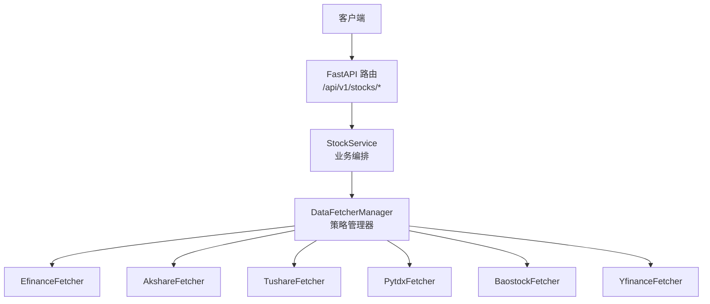
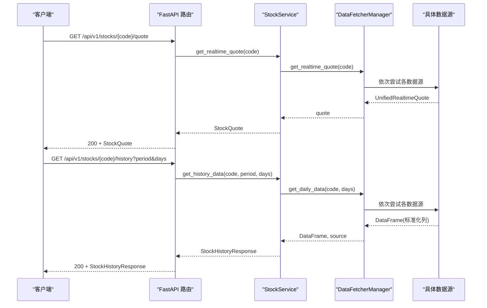
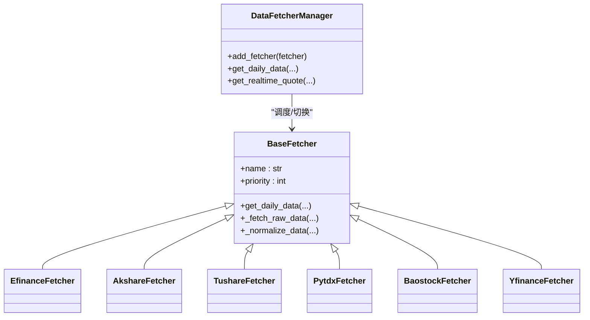
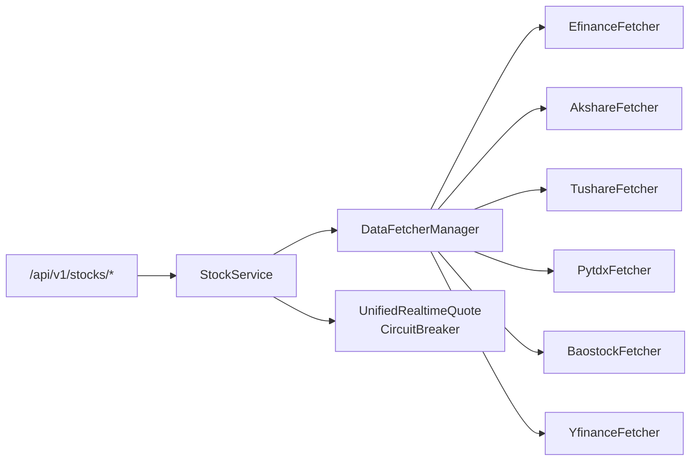

# 股票数据接口

<cite>
**本文引用的文件**
- [api/v1/endpoints/stocks.py](file://api/v1/endpoints/stocks.py)
- [api/v1/schemas/stocks.py](file://api/v1/schemas/stocks.py)
- [src/services/stock_service.py](file://src/services/stock_service.py)
- [data_provider/base.py](file://data_provider/base.py)
- [data_provider/realtime_types.py](file://data_provider/realtime_types.py)
- [data_provider/efinance_fetcher.py](file://data_provider/efinance_fetcher.py)
- [data_provider/akshare_fetcher.py](file://data_provider/akshare_fetcher.py)
- [data_provider/tushare_fetcher.py](file://data_provider/tushare_fetcher.py)
- [data_provider/pytdx_fetcher.py](file://data_provider/pytdx_fetcher.py)
- [data_provider/baostock_fetcher.py](file://data_provider/baostock_fetcher.py)
- [data_provider/yfinance_fetcher.py](file://data_provider/yfinance_fetcher.py)
- [api/middlewares/error_handler.py](file://api/middlewares/error_handler.py)
- [api/v1/router.py](file://api/v1/router.py)
</cite>

## 目录
1. [简介](#简介)
2. [项目结构](#项目结构)
3. [核心组件](#核心组件)
4. [架构总览](#架构总览)
5. [详细组件分析](#详细组件分析)
6. [依赖分析](#依赖分析)
7. [性能考虑](#性能考虑)
8. [故障排查指南](#故障排查指南)
9. [结论](#结论)
10. [附录](#附录)

## 简介
本文件为股票数据查询API接口的完整参考文档，聚焦于GET /api/v1/stocks/{stock_code}/quote（实时行情）与GET /api/v1/stocks/{stock_code}/history（历史K线）两个核心接口。内容涵盖：
- 接口参数与约束（股票代码、周期、天数）
- 响应模型（StockQuote、StockHistoryResponse、KLineData）
- 多数据源策略（6种主要数据源）、故障切换与熔断机制
- 实时/历史数据质量与更新特性
- 查询性能优化与限流策略
- 错误码与异常处理机制

## 项目结构
- API层：定义路由与端点，负责参数校验与响应序列化
- 服务层：封装业务逻辑，协调数据源获取
- 数据源层：实现统一策略接口，提供实时/历史数据获取与故障切换

图表来源
- [api/v1/router.py:17-47](file://api/v1/router.py#L17-L47)
- [api/v1/endpoints/stocks.py:242-390](file://api/v1/endpoints/stocks.py#L242-L390)
- [src/services/stock_service.py:21-187](file://src/services/stock_service.py#L21-L187)
- [data_provider/base.py:464-799](file://data_provider/base.py#L464-L799)

章节来源
- [api/v1/router.py:17-47](file://api/v1/router.py#L17-L47)
- [api/v1/endpoints/stocks.py:242-390](file://api/v1/endpoints/stocks.py#L242-L390)
- [src/services/stock_service.py:21-187](file://src/services/stock_service.py#L21-L187)

## 核心组件
- 股票数据接口端点：提供实时行情与历史K线查询
- 响应模型：StockQuote、StockHistoryResponse、KLineData
- 服务层：StockService封装数据获取与字段映射
- 数据源管理：DataFetcherManager统一调度6种数据源，实现自动切换与熔断

章节来源
- [api/v1/endpoints/stocks.py:242-390](file://api/v1/endpoints/stocks.py#L242-L390)
- [api/v1/schemas/stocks.py:17-112](file://api/v1/schemas/stocks.py#L17-L112)
- [src/services/stock_service.py:21-187](file://src/services/stock_service.py#L21-L187)
- [data_provider/base.py:464-799](file://data_provider/base.py#L464-L799)

## 架构总览
实时与历史数据的调用链如下：

图表来源
- [api/v1/endpoints/stocks.py:242-390](file://api/v1/endpoints/stocks.py#L242-L390)
- [src/services/stock_service.py:32-161](file://src/services/stock_service.py#L32-L161)
- [data_provider/base.py:785-849](file://data_provider/base.py#L785-L849)

## 详细组件分析

### 接口规范：GET /api/v1/stocks/{stock_code}/quote
- 功能：获取指定股票的实时行情
- 路径参数
  - stock_code: 股票代码（支持A股、港股、美股等）
- 响应模型：StockQuote
  - 字段：stock_code、stock_name、current_price、change、change_percent、open、high、low、prev_close、volume、amount、update_time
- 错误码
  - 404：未找到股票行情数据
  - 500：服务器内部错误
- 业务流程
  - 调用StockService.get_realtime_quote
  - 通过DataFetcherManager获取UnifiedRealtimeQuote
  - 字段映射为StockQuote返回

章节来源
- [api/v1/endpoints/stocks.py:242-308](file://api/v1/endpoints/stocks.py#L242-L308)
- [src/services/stock_service.py:32-86](file://src/services/stock_service.py#L32-L86)
- [api/v1/schemas/stocks.py:17-49](file://api/v1/schemas/stocks.py#L17-L49)

### 接口规范：GET /api/v1/stocks/{stock_code}/history
- 功能：获取指定股票的历史K线数据
- 路径参数
  - stock_code: 股票代码
- 查询参数
  - period: K线周期，支持 daily（weekly/monthly 暂未实现）
  - days: 获取天数，范围 1-365
- 响应模型：StockHistoryResponse
  - 字段：stock_code、stock_name、period、data（KLineData数组）
- 错误码
  - 422：不支持的周期参数
  - 500：服务器内部错误
- 业务流程
  - 调用StockService.get_history_data
  - 通过DataFetcherManager获取标准化DataFrame
  - 转换为KLineData列表返回

章节来源
- [api/v1/endpoints/stocks.py:311-390](file://api/v1/endpoints/stocks.py#L311-L390)
- [src/services/stock_service.py:88-161](file://src/services/stock_service.py#L88-L161)
- [api/v1/schemas/stocks.py:95-112](file://api/v1/schemas/stocks.py#L95-L112)

### 响应模型详解
- StockQuote（实时行情）
  - 关键字段：current_price、change、change_percent、open、high、low、prev_close、volume、amount、update_time
- KLineData（K线数据点）
  - 关键字段：date、open、high、low、close、volume、amount、change_percent
- StockHistoryResponse（历史行情响应）
  - 包含stock_code、stock_name、period与data列表

章节来源
- [api/v1/schemas/stocks.py:17-112](file://api/v1/schemas/stocks.py#L17-L112)

### 数据源策略与故障切换
- 策略模式：BaseFetcher定义统一接口；DataFetcherManager管理优先级与自动切换
- 默认优先级（动态调整）：
  - 0：EfinanceFetcher（最高优先级）
  - 1：AkshareFetcher
  - 2：TushareFetcher（Token有效时优先级提升为-1）
  - 2：PytdxFetcher（通达信）
  - 3：BaostockFetcher
  - 4：YfinanceFetcher（兜底）
- 切换策略
  - 逐个尝试，失败即自动切换下一个
  - 记录失败原因，全部失败时抛出异常
- 熔断机制
  - CircuitBreaker：连续失败达到阈值进入OPEN，冷却后半开试探，成功则恢复
  - 实时行情熔断：失败3次，冷却5分钟
  - 筹码接口熔断：失败2次，冷却10分钟

图表来源
- [data_provider/base.py:233-462](file://data_provider/base.py#L233-L462)
- [data_provider/base.py:464-799](file://data_provider/base.py#L464-L799)

章节来源
- [data_provider/base.py:735-778](file://data_provider/base.py#L735-L778)
- [data_provider/realtime_types.py:268-393](file://data_provider/realtime_types.py#L268-L393)

### 实时数据延迟与质量
- 缓存策略
  - EfinanceFetcher：实时行情缓存10分钟
  - AkshareFetcher：实时行情缓存20分钟
- 熔断与退避
  - 各数据源内置tenacity指数退避重试
  - CircuitBreaker避免连续失败导致的资源浪费
- 数据质量
  - Efinance/Akshare：免费、无需Token、覆盖面广
  - Tushare：高质量、需Token、有配额限制
  - 通达信：直连行情服务器，实时性强
  - Baostock：稳定、T+1更新
  - Yfinance：国际数据源，可能存在延迟或缺失

章节来源
- [data_provider/efinance_fetcher.py:122-135](file://data_provider/efinance_fetcher.py#L122-L135)
- [data_provider/akshare_fetcher.py:75-91](file://data_provider/akshare_fetcher.py#L75-L91)
- [data_provider/realtime_types.py:268-393](file://data_provider/realtime_types.py#L268-L393)

### 历史数据完整性与更新频率
- 周期支持：当前仅支持daily；weekly/monthly聚合待实现
- 日期范围：默认最近days个交易日（按日历日估算）
- 数据清洗与标准化：统一列名、数值类型转换、空值剔除、按日期排序
- 技术指标：MA5/MA10/MA20、量比（滚动5日均量）

章节来源
- [api/v1/endpoints/stocks.py:322-390](file://api/v1/endpoints/stocks.py#L322-L390)
- [src/services/stock_service.py:88-161](file://src/services/stock_service.py#L88-L161)
- [data_provider/base.py:321-450](file://data_provider/base.py#L321-L450)

### 查询性能优化建议
- 合理设置days：避免过大范围导致网络与解析压力
- 使用缓存：利用数据源内置缓存（如Efinance/Akshare）
- 降低并发：避免短时间大量并发请求，触发熔断或限流
- 选择合适数据源：高频实时场景优先考虑通达信或Tushare（Token有效时）

章节来源
- [data_provider/efinance_fetcher.py:122-135](file://data_provider/efinance_fetcher.py#L122-L135)
- [data_provider/akshare_fetcher.py:75-91](file://data_provider/akshare_fetcher.py#L75-L91)
- [data_provider/tushare_fetcher.py:213-253](file://data_provider/tushare_fetcher.py#L213-L253)

### API限流策略与异常处理
- 速率限制
  - TushareFetcher：每分钟调用计数器，超过配额强制等待至下一分钟
- 全局异常处理
  - ErrorHandlerMiddleware：捕获未处理异常，统一返回错误响应
  - FastAPI异常处理器：HTTPException、RequestValidationError、通用异常
- 错误响应
  - 统一结构：error、message、detail
  - 常见错误类型：validation_error、http_error、internal_error、not_found、unsupported_period

章节来源
- [api/middlewares/error_handler.py:24-129](file://api/middlewares/error_handler.py#L24-L129)
- [api/v1/endpoints/stocks.py:372-389](file://api/v1/endpoints/stocks.py#L372-L389)
- [api/v1/schemas/common.py:47-78](file://api/v1/schemas/common.py#L47-L78)

## 依赖分析
- 端点依赖服务层，服务层依赖数据源管理器
- 数据源管理器依赖各具体数据源实现
- 实时行情依赖统一类型与熔断器

图表来源
- [api/v1/endpoints/stocks.py:242-390](file://api/v1/endpoints/stocks.py#L242-L390)
- [src/services/stock_service.py:32-161](file://src/services/stock_service.py#L32-L161)
- [data_provider/base.py:464-799](file://data_provider/base.py#L464-L799)
- [data_provider/realtime_types.py:106-177](file://data_provider/realtime_types.py#L106-L177)

章节来源
- [api/v1/endpoints/stocks.py:242-390](file://api/v1/endpoints/stocks.py#L242-L390)
- [src/services/stock_service.py:32-161](file://src/services/stock_service.py#L32-L161)
- [data_provider/base.py:464-799](file://data_provider/base.py#L464-L799)

## 性能考虑
- 熔断与退避：减少对不可用数据源的无效请求
- 缓存：降低重复请求频率，缓解外部依赖压力
- 优先级：高可用数据源优先，提高成功率
- 参数约束：合理设置days与period，避免不必要的大数据量传输

## 故障排查指南
- 404（未找到）：确认股票代码格式与市场（A/H/K/US），检查数据源是否支持
- 422（参数不支持）：当前仅支持daily周期，weekly/monthly暂不支持
- 500（内部错误）：查看服务端日志，关注数据源异常与熔断状态
- 速率限制（Tushare）：遵循每分钟调用配额，必要时增加等待或切换数据源
- 熔断状态：实时熔断器失败3次后冷却5分钟，观察状态恢复

章节来源
- [api/v1/endpoints/stocks.py:274-308](file://api/v1/endpoints/stocks.py#L274-L308)
- [api/v1/endpoints/stocks.py:372-389](file://api/v1/endpoints/stocks.py#L372-L389)
- [api/middlewares/error_handler.py:50-67](file://api/middlewares/error_handler.py#L50-L67)
- [data_provider/realtime_types.py:268-393](file://data_provider/realtime_types.py#L268-L393)
- [data_provider/tushare_fetcher.py:213-253](file://data_provider/tushare_fetcher.py#L213-L253)

## 结论
本接口通过统一的服务层与策略化的数据源管理，实现了对多数据源的自动切换与熔断保护，兼顾实时性与稳定性。建议在生产环境中结合缓存、限流与合理的参数配置，以获得最佳性能与可靠性。

## 附录

### 数据源一览与特性
- EfinanceFetcher（优先级0）：免费、无需Token、覆盖面广
- AkshareFetcher（优先级1）：免费、增强数据（量比、换手率、估值指标）
- TushareFetcher（优先级-1或2）：高质量、需Token、有配额
- PytdxFetcher（优先级2）：直连行情服务器、实时强
- BaostockFetcher（优先级3）：稳定、T+1更新
- YfinanceFetcher（优先级4）：国际数据源、可能延迟或缺失

章节来源
- [data_provider/base.py:735-778](file://data_provider/base.py#L735-L778)
- [data_provider/efinance_fetcher.py:1-21](file://data_provider/efinance_fetcher.py#L1-L21)
- [data_provider/akshare_fetcher.py:1-24](file://data_provider/akshare_fetcher.py#L1-L24)
- [data_provider/tushare_fetcher.py:1-15](file://data_provider/tushare_fetcher.py#L1-L15)
- [data_provider/pytdx_fetcher.py:1-15](file://data_provider/pytdx_fetcher.py#L1-L15)
- [data_provider/baostock_fetcher.py:1-15](file://data_provider/baostock_fetcher.py#L1-L15)
- [data_provider/yfinance_fetcher.py:1-15](file://data_provider/yfinance_fetcher.py#L1-L15)