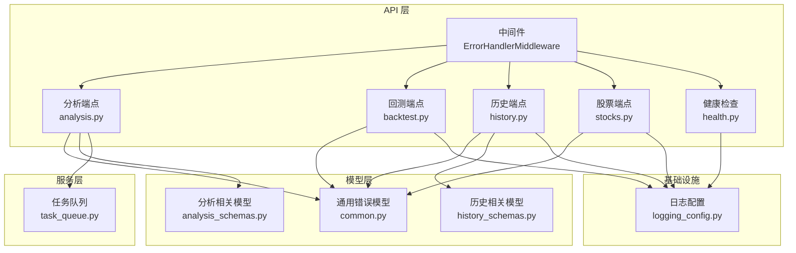
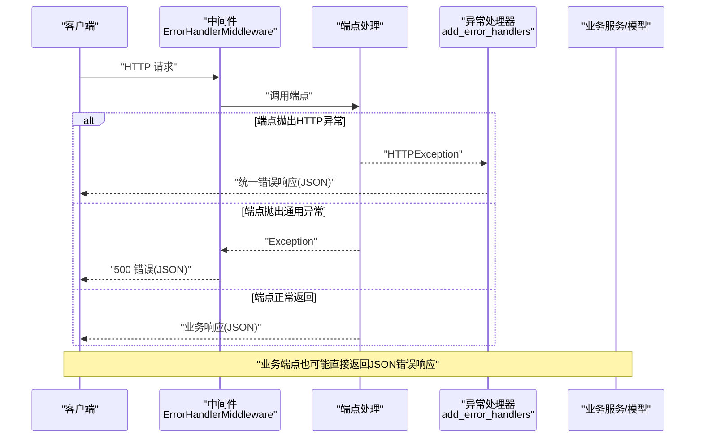
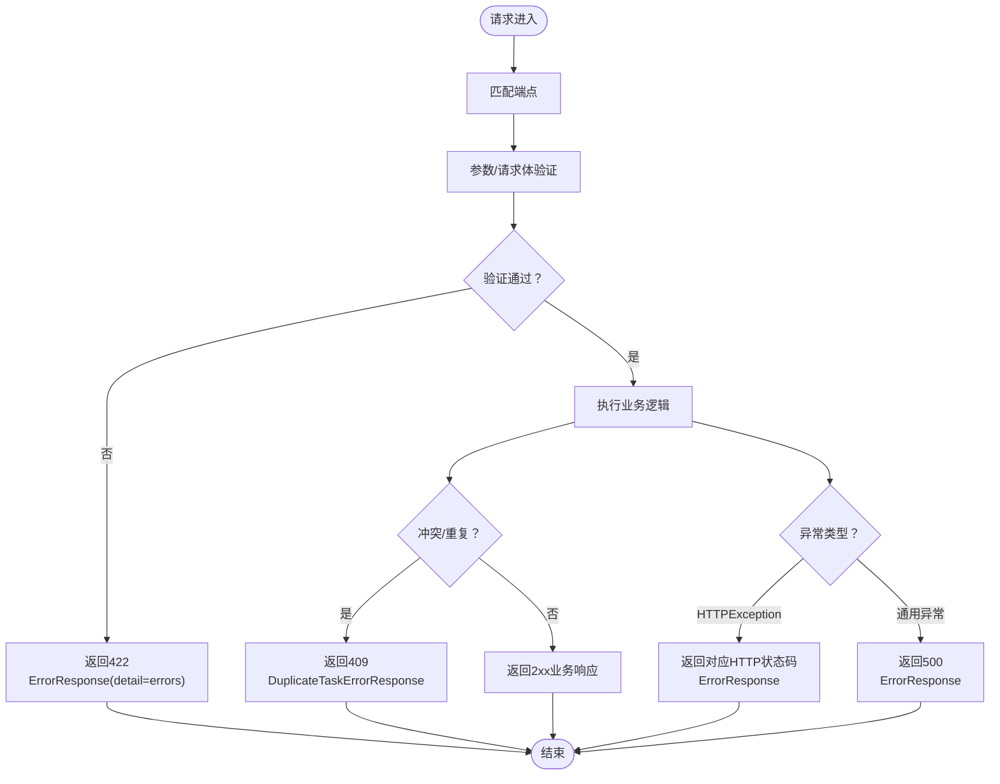
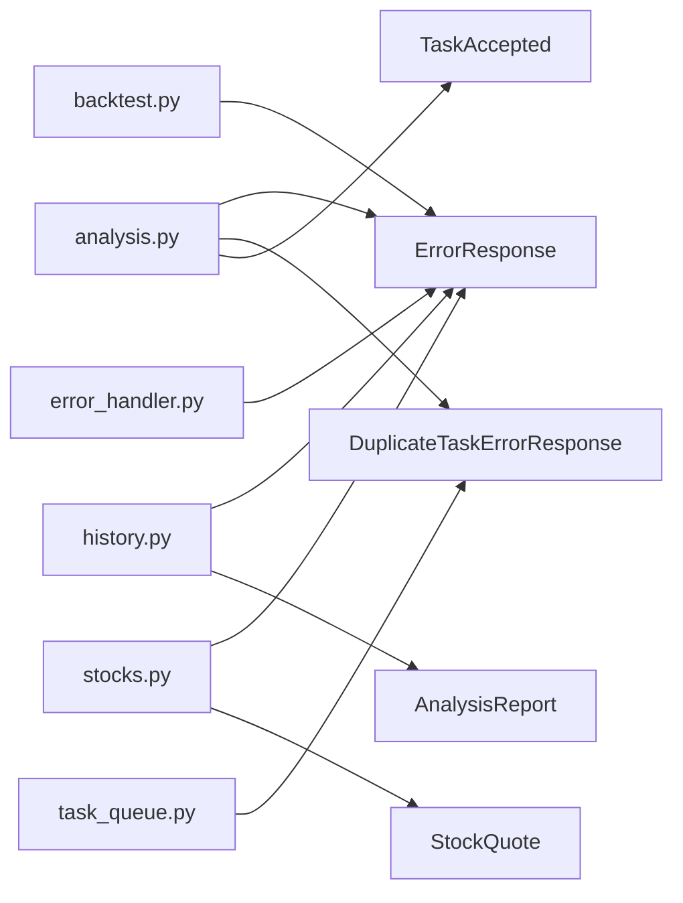

# 错误处理与状态码

<cite>
**本文档引用的文件**
- [error_handler.py](file://api/middlewares/error_handler.py)
- [analysis.py](file://api/v1/endpoints/analysis.py)
- [backtest.py](file://api/v1/endpoints/backtest.py)
- [history.py](file://api/v1/endpoints/history.py)
- [stocks.py](file://api/v1/endpoints/stocks.py)
- [common.py](file://api/v1/schemas/common.py)
- [analysis_schemas.py](file://api/v1/schemas/analysis.py)
- [history_schemas.py](file://api/v1/schemas/history.py)
- [task_queue.py](file://src/services/task_queue.py)
- [logging_config.py](file://src/logging_config.py)
- [health.py](file://api/v1/endpoints/health.py)
</cite>

## 目录
1. [简介](#简介)
2. [项目结构](#项目结构)
3. [核心组件](#核心组件)
4. [架构总览](#架构总览)
5. [详细组件分析](#详细组件分析)
6. [依赖分析](#依赖分析)
7. [性能考虑](#性能考虑)
8. [故障排查指南](#故障排查指南)
9. [结论](#结论)

## 简介
本文件系统性梳理本项目的API错误处理机制，覆盖HTTP状态码使用规范、统一错误响应格式、特定错误类型定义、异常处理流程、日志与监控告警、以及客户端重试与故障恢复策略。目标是帮助开发者与运维人员快速理解并正确处理API错误，提升系统的稳定性与可观测性。

## 项目结构
围绕错误处理的关键模块分布如下：
- 中间件层：统一捕获未处理异常，标准化错误响应
- 端点层：各业务接口在业务逻辑中抛出HTTP异常，或返回JSON响应
- 模型层：定义通用错误响应与特定错误类型（如重复任务）
- 服务层：任务队列等核心服务可能抛出特定异常（如重复任务）
- 日志层：统一日志配置，支持控制台与文件输出，便于问题定位

图表来源
- [error_handler.py:24-67](file://api/middlewares/error_handler.py#L24-L67)
- [analysis.py:68-159](file://api/v1/endpoints/analysis.py#L68-L159)
- [backtest.py:28-161](file://api/v1/endpoints/backtest.py#L28-L161)
- [history.py:49-452](file://api/v1/endpoints/history.py#L49-L452)
- [stocks.py:47-390](file://api/v1/endpoints/stocks.py#L47-L390)
- [health.py:21-34](file://api/v1/endpoints/health.py#L21-L34)
- [common.py:47-79](file://api/v1/schemas/common.py#L47-L79)
- [analysis_schemas.py:274-291](file://api/v1/schemas/analysis.py#L274-L291)
- [history_schemas.py:163-211](file://api/v1/schemas/history.py#L163-L211)
- [task_queue.py:96-106](file://src/services/task_queue.py#L96-L106)
- [logging_config.py:52-155](file://src/logging_config.py#L52-L155)

章节来源
- [error_handler.py:24-129](file://api/middlewares/error_handler.py#L24-L129)
- [analysis.py:68-694](file://api/v1/endpoints/analysis.py#L68-L694)
- [backtest.py:28-161](file://api/v1/endpoints/backtest.py#L28-L161)
- [history.py:49-452](file://api/v1/endpoints/history.py#L49-L452)
- [stocks.py:47-390](file://api/v1/endpoints/stocks.py#L47-L390)
- [health.py:21-34](file://api/v1/endpoints/health.py#L21-L34)
- [common.py:47-79](file://api/v1/schemas/common.py#L47-L79)
- [analysis_schemas.py:274-291](file://api/v1/schemas/analysis.py#L274-L291)
- [history_schemas.py:163-211](file://api/v1/schemas/history.py#L163-L211)
- [task_queue.py:96-106](file://src/services/task_queue.py#L96-L106)
- [logging_config.py:52-155](file://src/logging_config.py#L52-L155)

## 核心组件
- 全局异常处理中间件：捕获未处理异常，统一返回500错误
- FastAPI异常处理器：HTTP异常、请求验证异常、通用异常
- 业务端点错误：在业务逻辑中抛出HTTP异常或返回JSON错误响应
- 统一错误模型：ErrorResponse通用错误结构
- 特定错误模型：DuplicateTaskErrorResponse重复任务错误等
- 日志系统：统一日志格式与输出，支持控制台+文件

章节来源
- [error_handler.py:70-129](file://api/middlewares/error_handler.py#L70-L129)
- [common.py:47-79](file://api/v1/schemas/common.py#L47-L79)
- [analysis_schemas.py:274-291](file://api/v1/schemas/analysis.py#L274-L291)
- [logging_config.py:52-155](file://src/logging_config.py#L52-L155)

## 架构总览
错误处理的整体流程如下：
- 请求进入中间件，先由端点处理；若端点抛出HTTP异常，由FastAPI异常处理器统一处理
- 若端点抛出未捕获的通用异常，由中间件捕获并返回统一500错误
- 对于422验证错误，由验证异常处理器统一返回422
- 业务端点在特定场景下直接返回JSON错误响应（如409重复任务）

图表来源
- [error_handler.py:31-67](file://api/middlewares/error_handler.py#L31-L67)
- [error_handler.py:82-128](file://api/middlewares/error_handler.py#L82-L128)
- [analysis.py:179-232](file://api/v1/endpoints/analysis.py#L179-L232)

## 详细组件分析

### 1) HTTP状态码使用与含义
- 2xx 成功响应
  - 200 OK：标准成功响应，返回业务数据
  - 202 Accepted：异步任务已接受（分析端点在异步模式下返回）
- 4xx 客户端错误
  - 400 Bad Request：请求参数错误或格式不正确
  - 404 Not Found：资源不存在（任务、历史记录、股票报价等）
  - 409 Conflict：重复任务（同一股票正在分析中）
  - 422 Unprocessable Entity：请求体验证失败
- 5xx 服务器错误
  - 500 Internal Server Error：服务器内部错误

章节来源
- [analysis.py:75-84](file://api/v1/endpoints/analysis.py#L75-L84)
- [analysis.py:197-232](file://api/v1/endpoints/analysis.py#L197-L232)
- [analysis.py:464-466](file://api/v1/endpoints/analysis.py#L464-L466)
- [analysis.py:564-570](file://api/v1/endpoints/analysis.py#L564-L570)
- [backtest.py:31-34](file://api/v1/endpoints/backtest.py#L31-L34)
- [backtest.py:63-66](file://api/v1/endpoints/backtest.py#L63-L66)
- [backtest.py:98-102](file://api/v1/endpoints/backtest.py#L98-L102)
- [backtest.py:131-135](file://api/v1/endpoints/backtest.py#L131-L135)
- [history.py:52-55](file://api/v1/endpoints/history.py#L52-L55)
- [history.py:131-135](file://api/v1/endpoints/history.py#L131-L135)
- [history.py:176-180](file://api/v1/endpoints/history.py#L176-L180)
- [history.py:333-336](file://api/v1/endpoints/history.py#L333-L336)
- [history.py:393-395](file://api/v1/endpoints/history.py#L393-L395)
- [stocks.py:50-54](file://api/v1/endpoints/stocks.py#L50-L54)
- [stocks.py:128-131](file://api/v1/endpoints/stocks.py#L128-L131)
- [stocks.py:246-249](file://api/v1/endpoints/stocks.py#L246-L249)
- [stocks.py:316-318](file://api/v1/endpoints/stocks.py#L316-L318)

### 2) 统一错误响应格式
- 通用错误模型：ErrorResponse
  - 字段：error（错误类型）、message（错误描述）、detail（附加信息）
  - 用途：作为默认错误响应载体，适用于大多数4xx/5xx场景
- 特定错误模型：DuplicateTaskErrorResponse
  - 字段：error、message、stock_code、existing_task_id
  - 用途：当同一股票正在分析中时返回409，携带重复任务的现有任务ID

章节来源
- [common.py:47-61](file://api/v1/schemas/common.py#L47-L61)
- [analysis_schemas.py:274-291](file://api/v1/schemas/analysis.py#L274-L291)

### 3) 业务端点中的错误处理
- 分析端点（POST /api/v1/analysis/analyze）
  - 400：参数校验失败（如未提供股票代码、同步模式下传入多只股票）
  - 409：重复任务（同一股票正在分析中），返回DuplicateTaskErrorResponse
  - 500：分析失败或内部异常
- 回测端点
  - 500：执行失败或查询失败
  - 404：整体表现查询无汇总时返回
- 历史端点
  - 500：查询历史列表/详情/新闻失败
  - 404：历史记录不存在
- 股票端点
  - 400：图片/文件/文本解析失败、类型不支持、文件过大、JSON解析失败
  - 404：股票报价不存在
  - 422：K线周期参数不支持
  - 500：其他内部错误

章节来源
- [analysis.py:115-155](file://api/v1/endpoints/analysis.py#L115-L155)
- [analysis.py:179-232](file://api/v1/endpoints/analysis.py#L179-L232)
- [analysis.py:258-300](file://api/v1/endpoints/analysis.py#L258-L300)
- [analysis.py:464-570](file://api/v1/endpoints/analysis.py#L464-L570)
- [backtest.py:52-57](file://api/v1/endpoints/backtest.py#L52-L57)
- [backtest.py:87-92](file://api/v1/endpoints/backtest.py#L87-L92)
- [backtest.py:113-116](file://api/v1/endpoints/backtest.py#L113-L116)
- [backtest.py:147-150](file://api/v1/endpoints/backtest.py#L147-L150)
- [history.py:117-125](file://api/v1/endpoints/history.py#L117-L125)
- [history.py:156-170](file://api/v1/endpoints/history.py#L156-L170)
- [history.py:204-217](file://api/v1/endpoints/history.py#L204-L217)
- [history.py:317-327](file://api/v1/endpoints/history.py#L317-L327)
- [history.py:423-449](file://api/v1/endpoints/history.py#L423-L449)
- [stocks.py:67-121](file://api/v1/endpoints/stocks.py#L67-L121)
- [stocks.py:170-232](file://api/v1/endpoints/stocks.py#L170-L232)
- [stocks.py:274-281](file://api/v1/endpoints/stocks.py#L274-L281)
- [stocks.py:372-380](file://api/v1/endpoints/stocks.py#L372-L380)

### 4) 中间件与异常处理器
- ErrorHandlerMiddleware
  - 捕获未处理异常，记录错误日志，返回统一500错误
- add_error_handlers
  - HTTPException：将detail包装为统一错误结构或直接使用dict格式
  - RequestValidationError：返回422，detail为验证错误数组
  - Exception：通用异常，记录日志并返回500

章节来源
- [error_handler.py:24-67](file://api/middlewares/error_handler.py#L24-L67)
- [error_handler.py:70-129](file://api/middlewares/error_handler.py#L70-L129)

### 5) 任务队列与重复任务错误
- DuplicateTaskError
  - 当同一股票代码正在分析中时抛出，携带stock_code与existing_task_id
- 分析端点在批量提交时会区分accepted与duplicates，单只股票重复时返回409及DuplicateTaskErrorResponse

章节来源
- [task_queue.py:96-106](file://src/services/task_queue.py#L96-L106)
- [analysis.py:179-232](file://api/v1/endpoints/analysis.py#L179-L232)

### 6) 错误响应格式与字段定义
- ErrorResponse
  - error：字符串，错误类型标识
  - message：字符串，人类可读的错误描述
  - detail：任意类型，可选的附加信息（如验证错误数组）
- DuplicateTaskErrorResponse
  - error：固定值"duplicate_task"
  - message：字符串，重复任务的提示信息
  - stock_code：字符串，重复的股票代码
  - existing_task_id：字符串，已存在的任务ID

章节来源
- [common.py:47-61](file://api/v1/schemas/common.py#L47-L61)
- [analysis_schemas.py:274-291](file://api/v1/schemas/analysis.py#L274-L291)

### 7) 错误处理流程图

图表来源
- [error_handler.py:82-128](file://api/middlewares/error_handler.py#L82-L128)
- [analysis.py:115-155](file://api/v1/endpoints/analysis.py#L115-L155)
- [analysis.py:179-232](file://api/v1/endpoints/analysis.py#L179-L232)

## 依赖分析
- 端点对异常模型的依赖
  - 分析端点依赖DuplicateTaskErrorResponse与TaskAccepted等模型
  - 历史端点依赖ErrorResponse与AnalysisReport等模型
  - 股票端点依赖ErrorResponse与StockQuote等模型
- 服务层对异常的依赖
  - 任务队列抛出DuplicateTaskError，端点捕获并返回409
- 中间件与异常处理器
  - 中间件负责兜底未处理异常
  - FastAPI异常处理器负责HTTP异常与验证异常

图表来源
- [analysis.py:29-41](file://api/v1/endpoints/analysis.py#L29-L41)
- [analysis_schemas.py:274-291](file://api/v1/schemas/analysis.py#L274-L291)
- [history.py:18-33](file://api/v1/endpoints/history.py#L18-L33)
- [history_schemas.py:163-211](file://api/v1/schemas/history.py#L163-L211)
- [stocks.py:19-26](file://api/v1/endpoints/stocks.py#L19-L26)
- [task_queue.py:96-106](file://src/services/task_queue.py#L96-L106)
- [error_handler.py:70-129](file://api/middlewares/error_handler.py#L70-L129)

章节来源
- [analysis.py:29-41](file://api/v1/endpoints/analysis.py#L29-L41)
- [analysis_schemas.py:274-291](file://api/v1/schemas/analysis.py#L274-L291)
- [history.py:18-33](file://api/v1/endpoints/history.py#L18-L33)
- [history_schemas.py:163-211](file://api/v1/schemas/history.py#L163-L211)
- [stocks.py:19-26](file://api/v1/endpoints/stocks.py#L19-L26)
- [task_queue.py:96-106](file://src/services/task_queue.py#L96-L106)
- [error_handler.py:70-129](file://api/middlewares/error_handler.py#L70-L129)

## 性能考虑
- 异步任务与SSE：分析端点支持异步模式，避免阻塞请求；SSE用于实时推送任务状态变化
- 任务队列并发：任务队列支持动态调整并发度，避免过度占用资源
- 日志级别：统一日志配置，生产环境建议INFO级别，必要时开启DEBUG以辅助排障

章节来源
- [analysis.py:157-159](file://api/v1/endpoints/analysis.py#L157-L159)
- [analysis.py:376-440](file://api/v1/endpoints/analysis.py#L376-L440)
- [task_queue.py:184-231](file://src/services/task_queue.py#L184-L231)
- [logging_config.py:52-155](file://src/logging_config.py#L52-L155)

## 故障排查指南

### 1) 常见错误与定位
- 400/422：检查请求参数与请求体格式，查看detail中的具体验证错误
- 404：确认资源是否存在（任务ID、历史记录ID、股票代码）
- 409：同一股票重复提交，需等待现有任务完成或使用不同股票
- 500：查看服务端日志，关注堆栈信息与错误上下文

章节来源
- [error_handler.py:101-128](file://api/middlewares/error_handler.py#L101-L128)
- [analysis.py:115-155](file://api/v1/endpoints/analysis.py#L115-L155)
- [analysis.py:197-232](file://api/v1/endpoints/analysis.py#L197-L232)
- [analysis.py:464-570](file://api/v1/endpoints/analysis.py#L464-L570)

### 2) 日志记录与监控告警
- 日志配置：支持控制台与文件输出，自动轮转，降低第三方库噪声
- 建议：在生产环境启用INFO级别日志，关键错误记录DEBUG级别细节
- 监控：结合健康检查端点与错误日志，建立告警阈值

章节来源
- [logging_config.py:52-155](file://src/logging_config.py#L52-L155)
- [health.py:21-34](file://api/v1/endpoints/health.py#L21-L34)

### 3) 客户端重试策略与故障恢复
- 重试策略
  - 对幂等请求（如GET）可采用指数退避重试
  - 对非幂等请求（如POST）谨慎重试，需确保业务幂等性
  - 对400/404/409等明确错误，不应重试
- 故障恢复
  - 对500错误，建议在短期内重试并记录失败次数
  - 使用SSE监听任务状态变化，减少轮询压力
  - 对重复任务，等待现有任务完成后重试

章节来源
- [analysis.py:376-440](file://api/v1/endpoints/analysis.py#L376-L440)
- [analysis.py:197-232](file://api/v1/endpoints/analysis.py#L197-L232)

### 4) 调试工具与技巧
- 健康检查：使用/health端点确认服务可用性
- 日志：结合日志文件与控制台输出，定位异常发生位置
- 错误解析：在客户端解析错误响应，提取error与message字段进行用户提示

章节来源
- [health.py:21-34](file://api/v1/endpoints/health.py#L21-L34)
- [error_handler.py:116-120](file://api/middlewares/error_handler.py#L116-L120)

## 结论
本项目的错误处理机制通过“中间件兜底+FastAPI异常处理器+端点内联错误”的组合，实现了统一、可追踪、可恢复的错误处理体系。业务端点在关键场景下返回标准化错误响应，配合日志与健康检查，能够有效支撑生产环境的稳定性与可观测性。建议在客户端实现合理的重试与降级策略，并持续优化日志与监控告警，以进一步提升系统韧性。