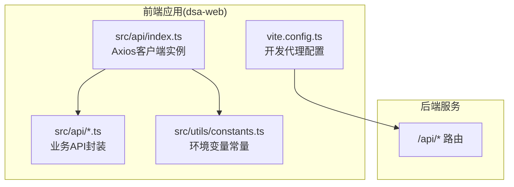
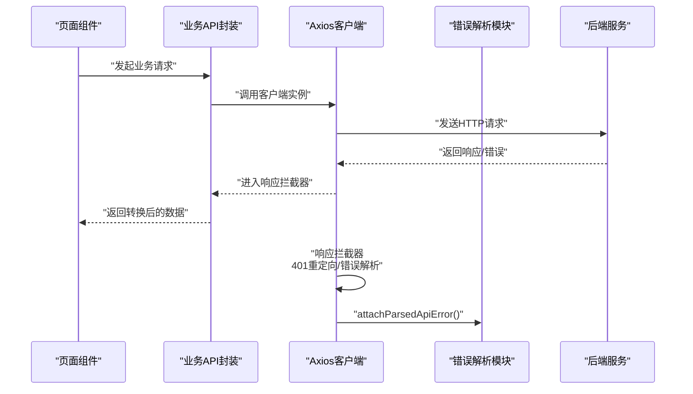
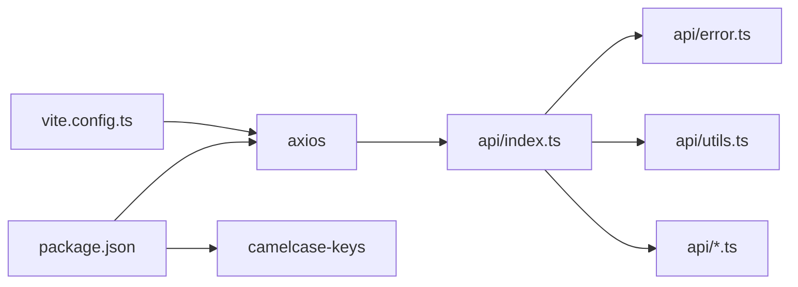

# API客户端配置

<cite>
**本文引用的文件**
- [apps/dsa-web/src/api/index.ts](file://apps/dsa-web/src/api/index.ts)
- [apps/dsa-web/src/utils/constants.ts](file://apps/dsa-web/src/utils/constants.ts)
- [apps/dsa-web/vite.config.ts](file://apps/dsa-web/vite.config.ts)
- [apps/dsa-web/src/api/error.ts](file://apps/dsa-web/src/api/error.ts)
- [apps/dsa-web/src/api/utils.ts](file://apps/dsa-web/src/api/utils.ts)
- [apps/dsa-web/src/api/analysis.ts](file://apps/dsa-web/src/api/analysis.ts)
- [apps/dsa-web/src/api/history.ts](file://apps/dsa-web/src/api/history.ts)
- [apps/dsa-web/src/api/stocks.ts](file://apps/dsa-web/src/api/stocks.ts)
- [apps/dsa-web/src/api/auth.ts](file://apps/dsa-web/src/api/auth.ts)
- [apps/dsa-web/src/api/backtest.ts](file://apps/dsa-web/src/api/backtest.ts)
- [apps/dsa-web/src/api/systemConfig.ts](file://apps/dsa-web/src/api/systemConfig.ts)
- [apps/dsa-web/src/api/portfolio.ts](file://apps/dsa-web/src/api/portfolio.ts)
- [apps/dsa-web/package.json](file://apps/dsa-web/package.json)
</cite>

## 目录
1. [简介](#简介)
2. [项目结构](#项目结构)
3. [核心组件](#核心组件)
4. [架构总览](#架构总览)
5. [详细组件分析](#详细组件分析)
6. [依赖关系分析](#依赖关系分析)
7. [性能考量](#性能考量)
8. [故障排查指南](#故障排查指南)
9. [结论](#结论)
10. [附录](#附录)

## 简介
本文件面向前端Web应用的API客户端配置，围绕基于Axios的统一客户端实例展开，系统性说明以下主题：
- Axios客户端初始化配置：基础URL、超时、凭证携带与默认请求头
- 请求/响应拦截器：认证令牌注入与请求头管理、错误处理与数据转换
- API基础URL的环境变量配置与开发/生产差异
- 请求重试、并发控制与性能优化策略
- 配置示例、最佳实践与常见问题解决方案

## 项目结构
前端Web应用采用Vite构建，API客户端位于src/api目录，统一导出一个Axios实例，并通过各业务模块API文件进行封装调用。开发服务器通过Vite代理将/api前缀转发至后端服务。

图表来源
- [apps/dsa-web/src/api/index.ts:1-30](file://apps/dsa-web/src/api/index.ts#L1-L30)
- [apps/dsa-web/src/utils/constants.ts:1-6](file://apps/dsa-web/src/utils/constants.ts#L1-L6)
- [apps/dsa-web/vite.config.ts:17-22](file://apps/dsa-web/vite.config.ts#L17-L22)

章节来源
- [apps/dsa-web/src/api/index.ts:1-30](file://apps/dsa-web/src/api/index.ts#L1-L30)
- [apps/dsa-web/src/utils/constants.ts:1-6](file://apps/dsa-web/src/utils/constants.ts#L1-L6)
- [apps/dsa-web/vite.config.ts:17-22](file://apps/dsa-web/vite.config.ts#L17-L22)

## 核心组件
- Axios客户端实例：在统一入口创建，设置baseURL、超时、withCredentials与默认Content-Type等
- 环境变量常量：从Vite环境变量读取API基础URL，支持开发/生产差异化
- 开发代理：Vite将/api前缀请求代理到后端服务，便于跨域与本地联调
- 响应拦截器：集中处理401重定向、错误解析与标准化
- 数据转换工具：统一将后端snake_case键转为camelCase，提升TS类型体验
- 业务API封装：按模块拆分，复用客户端实例，按需覆盖headers/timeout等

章节来源
- [apps/dsa-web/src/api/index.ts:5-27](file://apps/dsa-web/src/api/index.ts#L5-L27)
- [apps/dsa-web/src/utils/constants.ts:1-6](file://apps/dsa-web/src/utils/constants.ts#L1-L6)
- [apps/dsa-web/vite.config.ts:17-22](file://apps/dsa-web/vite.config.ts#L17-L22)
- [apps/dsa-web/src/api/utils.ts:8-13](file://apps/dsa-web/src/api/utils.ts#L8-L13)

## 架构总览
下图展示了从页面到后端的整体调用链路，以及关键的拦截与转换环节。

图表来源
- [apps/dsa-web/src/api/index.ts:14-27](file://apps/dsa-web/src/api/index.ts#L14-L27)
- [apps/dsa-web/src/api/error.ts:275-286](file://apps/dsa-web/src/api/error.ts#L275-L286)

## 详细组件分析

### Axios客户端初始化与配置
- 基础URL：从环境常量读取，开发时为空字符串以走代理，生产时可显式传入
- 超时：全局30秒，部分长耗时接口可按需覆盖
- 凭证：withCredentials启用，便于跨域携带Cookie
- 默认请求头：JSON Content-Type

章节来源
- [apps/dsa-web/src/api/index.ts:5-12](file://apps/dsa-web/src/api/index.ts#L5-L12)
- [apps/dsa-web/src/utils/constants.ts:1-6](file://apps/dsa-web/src/utils/constants.ts#L1-L6)

### 请求拦截器
- 认证令牌注入：当前实现未在请求拦截器中自动注入Authorization头
- 请求头管理：可通过业务API按需覆盖headers，如multipart/form-data
- 典型用法：上传文件时清空Content-Type，让浏览器自动设置边界

章节来源
- [apps/dsa-web/src/api/stocks.ts:20-28](file://apps/dsa-web/src/api/stocks.ts#L20-L28)
- [apps/dsa-web/src/api/portfolio.ts:244-246](file://apps/dsa-web/src/api/portfolio.ts#L244-L246)

### 响应拦截器
- 401处理：当响应状态为401且当前不在登录页时，自动跳转到带redirect参数的登录页
- 错误解析：统一调用错误解析模块，附加结构化错误对象，便于UI展示
- 返回值：原样透传成功响应，失败则reject并携带解析后的错误

章节来源
- [apps/dsa-web/src/api/index.ts:14-27](file://apps/dsa-web/src/api/index.ts#L14-L27)
- [apps/dsa-web/src/api/error.ts:275-286](file://apps/dsa-web/src/api/error.ts#L275-L286)

### 错误处理与数据转换
- 错误分类：根据响应状态、错误码、消息关键词等，归类为不同错误类别（如上游超时、网络异常、参数缺失等）
- 错误对象：统一包装title/message/rawMessage/status/category，便于UI呈现
- 数据转换：toCamelCase将后端snake_case键转为camelCase，提升TS类型安全与可读性

章节来源
- [apps/dsa-web/src/api/error.ts:292-476](file://apps/dsa-web/src/api/error.ts#L292-L476)
- [apps/dsa-web/src/api/utils.ts:8-13](file://apps/dsa-web/src/api/utils.ts#L8-L13)

### API基础URL与环境变量
- 开发环境：VITE_API_URL为空时，API走同源或Vite代理；可显式设置VITE_API_URL覆盖默认行为
- 生产环境：建议显式设置VITE_API_URL指向后端域名，避免静态部署时请求打到用户本机localhost
- 代理配置：Vite将/api前缀代理到后端服务，便于前后端分离联调

章节来源
- [apps/dsa-web/src/utils/constants.ts:1-6](file://apps/dsa-web/src/utils/constants.ts#L1-L6)
- [apps/dsa-web/vite.config.ts:17-22](file://apps/dsa-web/vite.config.ts#L17-L22)

### 请求重试机制
- 当前未实现自动重试逻辑
- 建议策略：对幂等GET/HEAD请求在业务层按需引入指数退避重试；对写操作谨慎重试，避免副作用
- 可结合错误分类判断是否可重试（如上游超时、网络异常）

[本节为通用建议，不直接分析具体文件]

### 并发控制与性能优化
- 并发控制：建议在业务层引入队列/信号量，限制同时进行的任务数，避免资源争用
- 超时策略：全局30秒，长耗时接口（如Vision API）单独提升超时时间
- 缓存与去重：对相同查询参数的请求进行去重与缓存，减少重复请求
- 传输优化：合理使用FormData上传文件，避免不必要的JSON序列化

章节来源
- [apps/dsa-web/src/api/stocks.ts:26](file://apps/dsa-web/src/api/stocks.ts#L26)

### 业务API封装示例
- 分析接口：支持同步/异步模式，异步模式允许202状态码，409时抛出自定义重复任务错误
- 历史接口：列表/详情/新闻/Markdown导出/批量删除，均使用toCamelCase转换
- 回测接口：运行/结果列表/整体/个股表现指标，404时返回null而非抛错
- 组合投资组合接口：账户、快照、风险、交易、现金台账、公司行动、CSV导入等

章节来源
- [apps/dsa-web/src/api/analysis.ts:51-81](file://apps/dsa-web/src/api/analysis.ts#L51-L81)
- [apps/dsa-web/src/api/history.ts:24-43](file://apps/dsa-web/src/api/history.ts#L24-L43)
- [apps/dsa-web/src/api/backtest.ts:64-80](file://apps/dsa-web/src/api/backtest.ts#L64-L80)
- [apps/dsa-web/src/api/portfolio.ts:103-266](file://apps/dsa-web/src/api/portfolio.ts#L103-L266)

## 依赖关系分析
- Axios版本：package.json声明使用较新版本，具备稳定的功能与兼容性
- camelcase-keys：用于统一键名风格，提升TS类型体验
- Vite代理：开发期通过代理解决跨域与联调问题

图表来源
- [apps/dsa-web/package.json:16](file://apps/dsa-web/package.json#L16)
- [apps/dsa-web/package.json:17](file://apps/dsa-web/package.json#L17)
- [apps/dsa-web/vite.config.ts:17-22](file://apps/dsa-web/vite.config.ts#L17-L22)
- [apps/dsa-web/src/api/index.ts:1-30](file://apps/dsa-web/src/api/index.ts#L1-L30)

章节来源
- [apps/dsa-web/package.json:14-30](file://apps/dsa-web/package.json#L14-L30)
- [apps/dsa-web/vite.config.ts:17-22](file://apps/dsa-web/vite.config.ts#L17-L22)

## 性能考量
- 合理设置超时：全局30秒适中，长耗时接口按需提升
- 控制并发：对高并发场景引入限流/队列，避免后端压力过大
- 传输优化：大文件上传使用FormData，避免手动拼装JSON
- 缓存策略：对查询类接口进行去重与缓存，减少重复请求
- 错误快速失败：对明显不可达的请求尽早取消，释放资源

[本节为通用建议，不直接分析具体文件]

## 故障排查指南
- 401未授权：确认登录状态与Cookie携带；若非登录页被重定向，检查登录流程
- 本地连接失败：检查Vite代理是否生效、后端服务是否启动、端口是否开放
- 上游超时/网络异常：检查代理/DNS/出网配置，适当延长超时或重试
- 参数缺失：确保必填字段齐全，关注错误分类中的“缺少参数”
- 重复任务：异步分析时遇到409，使用现有任务ID或等待任务结束

章节来源
- [apps/dsa-web/src/api/index.ts:17-23](file://apps/dsa-web/src/api/index.ts#L17-L23)
- [apps/dsa-web/src/api/error.ts:292-476](file://apps/dsa-web/src/api/error.ts#L292-L476)
- [apps/dsa-web/src/api/analysis.ts:70-78](file://apps/dsa-web/src/api/analysis.ts#L70-L78)

## 结论
该API客户端配置以Axios为核心，通过统一实例与拦截器实现一致的错误处理与数据转换，结合Vite代理满足开发联调需求。建议在现有基础上完善认证令牌注入、请求重试与并发控制策略，并持续优化超时与缓存机制，以提升稳定性与用户体验。

## 附录

### 配置清单与示例
- 基础URL设置
  - 开发：保持VITE_API_URL为空，走Vite代理
  - 生产：显式设置VITE_API_URL为后端域名
- 超时设置
  - 全局：30秒
  - 长耗时：按需覆盖，如Vision API设为60秒
- 请求头管理
  - 上传文件：清空Content-Type，让浏览器设置multipart边界
- 错误分类
  - 参考错误解析模块的分类逻辑，便于UI统一提示

章节来源
- [apps/dsa-web/src/utils/constants.ts:1-6](file://apps/dsa-web/src/utils/constants.ts#L1-L6)
- [apps/dsa-web/src/api/stocks.ts:26](file://apps/dsa-web/src/api/stocks.ts#L26)
- [apps/dsa-web/src/api/error.ts:292-476](file://apps/dsa-web/src/api/error.ts#L292-L476)