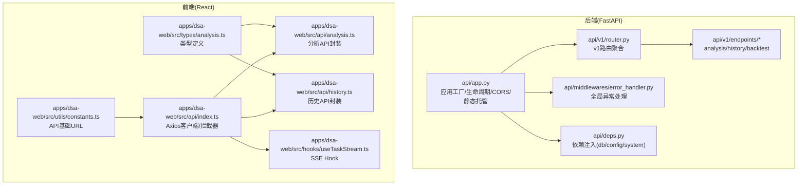
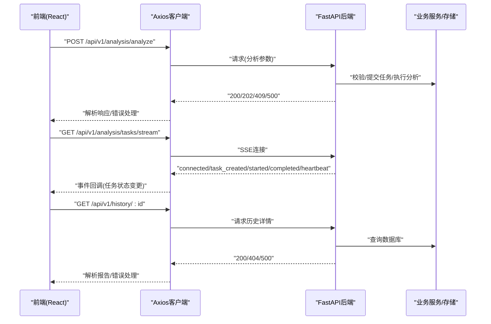
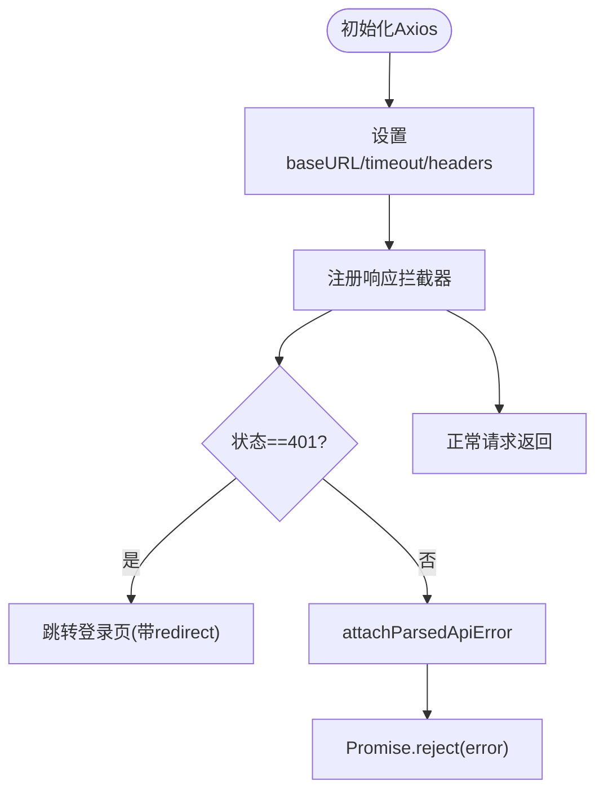
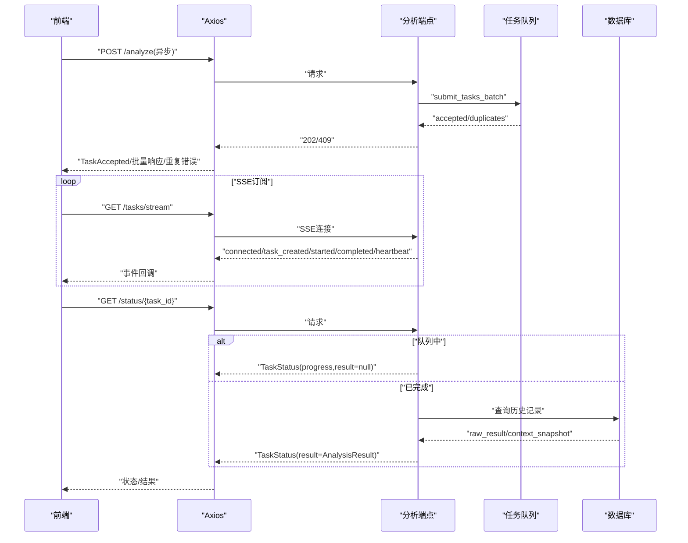
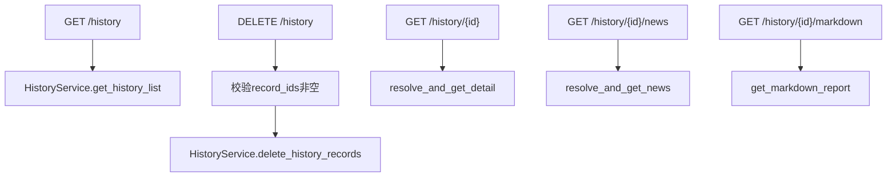
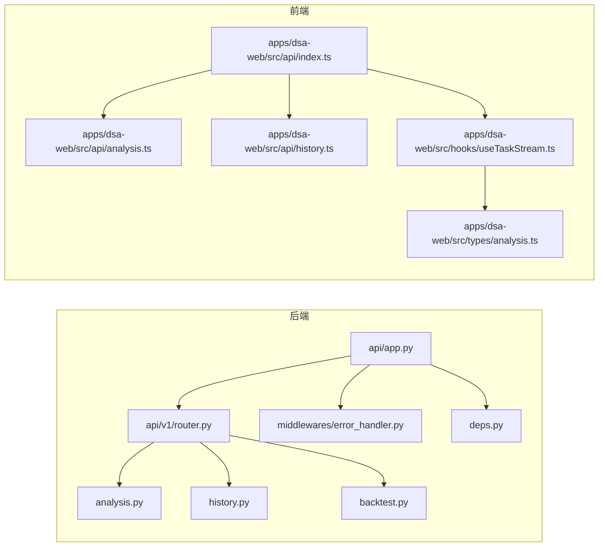

# API集成

<cite>
**本文档引用的文件**
- [api/app.py](file://api/app.py)
- [api/deps.py](file://api/deps.py)
- [api/middlewares/error_handler.py](file://api/middlewares/error_handler.py)
- [api/v1/router.py](file://api/v1/router.py)
- [api/v1/endpoints/analysis.py](file://api/v1/endpoints/analysis.py)
- [api/v1/endpoints/history.py](file://api/v1/endpoints/history.py)
- [api/v1/endpoints/backtest.py](file://api/v1/endpoints/backtest.py)
- [api/v1/schemas/analysis.py](file://api/v1/schemas/analysis.py)
- [api/v1/schemas/history.py](file://api/v1/schemas/history.py)
- [apps/dsa-web/src/api/index.ts](file://apps/dsa-web/src/api/index.ts)
- [apps/dsa-web/src/api/analysis.ts](file://apps/dsa-web/src/api/analysis.ts)
- [apps/dsa-web/src/api/history.ts](file://apps/dsa-web/src/api/history.ts)
- [apps/dsa-web/src/hooks/useTaskStream.ts](file://apps/dsa-web/src/hooks/useTaskStream.ts)
- [apps/dsa-web/src/types/analysis.ts](file://apps/dsa-web/src/types/analysis.ts)
- [apps/dsa-web/src/utils/constants.ts](file://apps/dsa-web/src/utils/constants.ts)
</cite>

## 目录
1. [简介](#简介)
2. [项目结构](#项目结构)
3. [核心组件](#核心组件)
4. [架构总览](#架构总览)
5. [详细组件分析](#详细组件分析)
6. [依赖关系分析](#依赖关系分析)
7. [性能考量](#性能考量)
8. [故障排查指南](#故障排查指南)
9. [结论](#结论)
10. [附录](#附录)

## 简介
本文件面向Web管理界面的API集成，系统性梳理后端FastAPI应用、路由与端点、请求/响应模型、中间件与异常处理，以及前端Axios客户端、SSE实时流与React Hook的集成方案。重点覆盖以下主题：
- API客户端设计模式与拦截器
- 分析、回测、历史接口的定义、参数校验与错误处理
- SSE实时数据流、WebSocket与长轮询的替代方案
- 缓存策略、重试机制与超时处理
- 认证机制、权限控制与安全考虑
- API调用示例、错误处理与性能优化
- API版本管理、向后兼容与迁移策略
- Mock数据、测试环境与开发调试方法

## 项目结构
后端采用FastAPI应用工厂模式，按v1版本聚合路由，各功能模块独立端点；前端使用Vite+React+Axios，通过统一的API客户端与后端交互。

**图表来源**
- [api/app.py:48-204](file://api/app.py#L48-L204)
- [api/v1/router.py:17-72](file://api/v1/router.py#L17-L72)
- [apps/dsa-web/src/api/index.ts:1-30](file://apps/dsa-web/src/api/index.ts#L1-L30)
- [apps/dsa-web/src/hooks/useTaskStream.ts:147-252](file://apps/dsa-web/src/hooks/useTaskStream.ts#L147-L252)

**章节来源**
- [api/app.py:48-204](file://api/app.py#L48-L204)
- [api/v1/router.py:17-72](file://api/v1/router.py#L17-L72)
- [apps/dsa-web/src/api/index.ts:1-30](file://apps/dsa-web/src/api/index.ts#L1-L30)

## 核心组件
- 应用工厂与中间件
  - 应用工厂负责CORS、认证中间件注册、路由挂载、健康检查与静态文件托管。
  - 全局异常中间件捕获未处理异常并统一返回。
- 依赖注入
  - 提供数据库会话、配置与系统配置服务的依赖，确保请求生命周期内资源正确释放。
- 前端API客户端
  - Axios实例配置baseURL、withCredentials、timeout与响应拦截器，处理401重定向与统一错误包装。

**章节来源**
- [api/app.py:48-204](file://api/app.py#L48-L204)
- [api/middlewares/error_handler.py:24-129](file://api/middlewares/error_handler.py#L24-L129)
- [api/deps.py:23-72](file://api/deps.py#L23-L72)
- [apps/dsa-web/src/api/index.ts:1-30](file://apps/dsa-web/src/api/index.ts#L1-L30)

## 架构总览
后端以APIRouter聚合各模块端点，前端通过Axios客户端访问v1接口。分析端点支持同步/异步两种模式，异步模式配合SSE实时推送任务状态；历史端点提供列表、详情、新闻与Markdown导出；回测端点提供运行与查询。

**图表来源**
- [api/v1/endpoints/analysis.py:88-570](file://api/v1/endpoints/analysis.py#L88-L570)
- [apps/dsa-web/src/api/analysis.ts:21-131](file://apps/dsa-web/src/api/analysis.ts#L21-L131)
- [apps/dsa-web/src/hooks/useTaskStream.ts:147-252](file://apps/dsa-web/src/hooks/useTaskStream.ts#L147-L252)
- [api/v1/endpoints/history.py:184-327](file://api/v1/endpoints/history.py#L184-L327)

## 详细组件分析

### API客户端设计模式与拦截器
- Axios实例
  - 基础URL、超时、withCredentials、Content-Type设置。
  - 响应拦截器统一处理401重定向至登录页，其余错误通过工具函数包装并透传。
- 前端类型与转换
  - 类型定义与toCamelCase转换保证前后端字段命名一致性。
- 基础URL来源
  - 通过环境变量VITE_API_URL动态决定，未配置时保持同源。

**图表来源**
- [apps/dsa-web/src/api/index.ts:5-27](file://apps/dsa-web/src/api/index.ts#L5-L27)
- [apps/dsa-web/src/utils/constants.ts:1-6](file://apps/dsa-web/src/utils/constants.ts#L1-L6)

**章节来源**
- [apps/dsa-web/src/api/index.ts:1-30](file://apps/dsa-web/src/api/index.ts#L1-L30)
- [apps/dsa-web/src/utils/constants.ts:1-6](file://apps/dsa-web/src/utils/constants.ts#L1-L6)

### 分析API（触发、状态、SSE）
- 接口定义
  - POST /api/v1/analysis/analyze：支持同步与异步模式；异步模式下重复提交返回409。
  - GET /api/v1/analysis/status/{task_id}：查询单个任务状态，优先队列，不存在则回退数据库。
  - GET /api/v1/analysis/tasks：列出任务并统计状态分布。
  - GET /api/v1/analysis/tasks/stream：SSE事件流，推送connected、task_created、task_started、task_completed、heartbeat。
- 参数校验与错误处理
  - 请求体模型约束stock_code与stock_codes二选一、report_type枚举、force_refresh与async_mode布尔值。
  - 400：参数缺失或非法；409：重复任务；500：内部错误。
- SSE实现要点
  - 事件类型与数据结构；心跳每30秒一次；Nginx缓冲禁用头；订阅/取消订阅队列。
- 前端集成
  - analyze/analyzeAsync区分同步/异步；getStatus支持嵌套result转换；useTaskStream封装EventSource连接、自动重连与回调。

**图表来源**
- [api/v1/endpoints/analysis.py:88-570](file://api/v1/endpoints/analysis.py#L88-L570)
- [apps/dsa-web/src/api/analysis.ts:21-131](file://apps/dsa-web/src/api/analysis.ts#L21-L131)
- [apps/dsa-web/src/hooks/useTaskStream.ts:147-252](file://apps/dsa-web/src/hooks/useTaskStream.ts#L147-L252)

**章节来源**
- [api/v1/endpoints/analysis.py:88-570](file://api/v1/endpoints/analysis.py#L88-L570)
- [api/v1/schemas/analysis.py:27-291](file://api/v1/schemas/analysis.py#L27-L291)
- [apps/dsa-web/src/api/analysis.ts:21-131](file://apps/dsa-web/src/api/analysis.ts#L21-L131)
- [apps/dsa-web/src/hooks/useTaskStream.ts:147-252](file://apps/dsa-web/src/hooks/useTaskStream.ts#L147-L252)

### 历史API（列表、详情、新闻、Markdown）
- 接口定义
  - GET /api/v1/history：分页列表，支持stock_code、start_date、end_date筛选。
  - DELETE /api/v1/history：批量删除，参数为record_ids。
  - GET /api/v1/history/{record_id}：历史详情，支持ID或query_id解析。
  - GET /api/v1/history/{record_id}/news：关联新闻列表。
  - GET /api/v1/history/{record_id}/markdown：Markdown格式报告。
- 参数校验与错误处理
  - record_ids非空校验；404：记录不存在；500：内部错误或Markdown生成失败。
- 前端集成
  - getList/getDetail/getNews/getMarkdown/deleteRecords封装；toCamelCase转换；ID优先使用主键而非query_id。

**图表来源**
- [api/v1/endpoints/history.py:59-451](file://api/v1/endpoints/history.py#L59-L451)
- [apps/dsa-web/src/api/history.ts:24-91](file://apps/dsa-web/src/api/history.ts#L24-L91)

**章节来源**
- [api/v1/endpoints/history.py:59-451](file://api/v1/endpoints/history.py#L59-L451)
- [api/v1/schemas/history.py:17-211](file://api/v1/schemas/history.py#L17-L211)
- [apps/dsa-web/src/api/history.ts:24-91](file://apps/dsa-web/src/api/history.ts#L24-L91)

### 回测API（运行、结果、性能）
- 接口定义
  - POST /api/v1/backtest/run：触发回测评估，写入结果与汇总。
  - GET /api/v1/backtest/results：分页查询回测结果，支持code与eval_window_days过滤。
  - GET /api/v1/backtest/performance：整体表现；GET /api/v1/backtest/performance/{code}：单股表现。
- 参数校验与错误处理
  - 404：无汇总；500：内部错误。
- 前端集成
  - run/getResults/getOverallPerformance/getStockPerformance封装。

**章节来源**
- [api/v1/endpoints/backtest.py:38-160](file://api/v1/endpoints/backtest.py#L38-L160)

### SSE实时数据流、WebSocket与长轮询
- SSE（推荐）
  - 后端：/api/v1/analysis/tasks/stream，事件类型包括connected、task_created、task_started、task_completed、heartbeat。
  - 前端：useTaskStream基于EventSource，支持自动重连、回调解耦与断线恢复。
- WebSocket
  - 代码库未实现WebSocket端点；如需替换SSE，可在后端新增路由并参考SSE事件结构。
- 长轮询
  - 代码库未实现长轮询端点；如需替代SSE，可在后端新增轮询接口并在前端循环拉取状态。

**章节来源**
- [api/v1/endpoints/analysis.py:384-439](file://api/v1/endpoints/analysis.py#L384-L439)
- [apps/dsa-web/src/hooks/useTaskStream.ts:147-252](file://apps/dsa-web/src/hooks/useTaskStream.ts#L147-L252)

### 缓存策略、重试机制与超时处理
- 缓存策略
  - 强制刷新开关force_refresh用于绕过缓存；历史端点从数据库读取，避免缓存污染。
- 重试机制
  - 前端SSE：useTaskStream提供autoReconnect与reconnectDelay；Axios未内置重试，可通过外层调用逻辑实现。
- 超时处理
  - Axios默认超时30秒；SSE心跳每30秒一次，用于维持连接。

**章节来源**
- [apps/dsa-web/src/api/index.ts:7](file://apps/dsa-web/src/api/index.ts#L7)
- [apps/dsa-web/src/hooks/useTaskStream.ts:86-88](file://apps/dsa-web/src/hooks/useTaskStream.ts#L86-L88)

### 认证机制、权限控制与安全考虑
- 认证中间件
  - 应用工厂注册认证中间件（具体实现位于中间件模块），可按运行时配置启用/关闭。
- CORS
  - 支持多Origin白名单，开发/演示场景可开启全允许；生产环境建议明确配置。
- 安全建议
  - 生产环境固定CORS Origins，避免通配符；启用HTTPS；对敏感接口增加鉴权与速率限制。

**章节来源**
- [api/app.py:108-106](file://api/app.py#L108-L106)
- [api/app.py:82-98](file://api/app.py#L82-L98)

### API调用示例、错误处理与性能优化
- 调用示例
  - 分析：前端调用analyze/analyzeAsync，异步模式下通过SSE或轮询获取状态。
  - 历史：getList/getDetail/getNews/getMarkdown/deleteRecords。
- 错误处理
  - 前端：401重定向登录；409重复任务抛出自定义错误；后端统一异常处理中间件。
  - 后端：HTTP异常与验证异常分别映射为标准错误响应。
- 性能优化
  - 异步分析避免阻塞；SSE心跳减少连接中断；批量任务合并与去重；数据库查询分页与索引优化。

**章节来源**
- [apps/dsa-web/src/api/analysis.ts:21-131](file://apps/dsa-web/src/api/analysis.ts#L21-L131)
- [apps/dsa-web/src/api/history.ts:24-91](file://apps/dsa-web/src/api/history.ts#L24-L91)
- [api/middlewares/error_handler.py:82-128](file://api/middlewares/error_handler.py#L82-L128)

### API版本管理、向后兼容与迁移策略
- 版本管理
  - 路由前缀/api/v1统一聚合各模块；新功能优先在v1下扩展。
- 向后兼容
  - 分析端点兼容单只股票重复提交返回409；批量响应与单任务响应并存。
- 迁移策略
  - 新增字段采用可选；变更枚举值时保留旧值并标注废弃；逐步淘汰旧字段。

**章节来源**
- [api/v1/router.py:17-72](file://api/v1/router.py#L17-L72)
- [api/v1/endpoints/analysis.py:197-232](file://api/v1/endpoints/analysis.py#L197-L232)

### Mock数据、测试环境与开发调试
- Mock数据
  - 前端类型定义与toCamelCase便于对接Mock；后端模型定义清晰，可结合单元测试。
- 测试环境
  - 健康检查接口/api/health用于探活；CORS允许本地开发端口；基础URL通过VITE_API_URL覆盖。
- 开发调试
  - 前端：useTaskStream提供onConnected/onError回调；后端：全局异常中间件记录堆栈。

**章节来源**
- [api/app.py:161-173](file://api/app.py#L161-L173)
- [apps/dsa-web/src/utils/constants.ts:1-6](file://apps/dsa-web/src/utils/constants.ts#L1-L6)
- [apps/dsa-web/src/hooks/useTaskStream.ts:157-203](file://apps/dsa-web/src/hooks/useTaskStream.ts#L157-L203)

## 依赖关系分析

**图表来源**
- [api/v1/router.py:14-71](file://api/v1/router.py#L14-L71)
- [api/app.py:30-33](file://api/app.py#L30-L33)
- [apps/dsa-web/src/api/index.ts:1-29](file://apps/dsa-web/src/api/index.ts#L1-L29)

**章节来源**
- [api/v1/router.py:14-71](file://api/v1/router.py#L14-L71)
- [api/app.py:30-33](file://api/app.py#L30-L33)

## 性能考量
- 异步化：分析与回测均采用异步执行，避免阻塞主线程。
- 流式传输：SSE事件流降低轮询开销，提升实时性。
- 数据库优化：分页查询、索引与字段裁剪；批量任务去重减少无效计算。
- 前端优化：EventSource自动重连、错误边界与状态缓存，提升用户体验。

## 故障排查指南
- 常见问题
  - 401未认证：检查withCredentials与Cookie域；确认登录状态。
  - 409重复任务：避免对同一股票重复提交；使用existing_task_id进行去重。
  - 404任务/记录不存在：确认task_id或record_id有效性与生命周期。
  - 500内部错误：查看后端日志与堆栈；检查数据源可用性。
- 建议流程
  - 前端：捕获并上报错误；必要时降级为轮询；记录请求ID与时间戳。
  - 后端：统一异常中间件记录请求路径与堆栈；对敏感信息脱敏。

**章节来源**
- [api/middlewares/error_handler.py:50-67](file://api/middlewares/error_handler.py#L50-L67)
- [apps/dsa-web/src/api/analysis.ts:70-78](file://apps/dsa-web/src/api/analysis.ts#L70-L78)

## 结论
该API集成为Web管理界面提供了完整的分析、历史与回测能力，结合Axios客户端与SSE实时流，实现了高可用与良好的用户体验。建议在生产环境中完善认证与CORS配置、引入速率限制与审计日志，并持续演进版本管理与向后兼容策略。

## 附录
- 关键类型与模型
  - 分析请求/响应、任务状态与列表、历史报告结构等模型定义清晰，便于前后端协作。
- 前端Hook与工具
  - useTaskStream提供SSE连接管理；toCamelCase统一命名；constants集中管理基础URL。

**章节来源**
- [api/v1/schemas/analysis.py:27-291](file://api/v1/schemas/analysis.py#L27-L291)
- [api/v1/schemas/history.py:17-211](file://api/v1/schemas/history.py#L17-L211)
- [apps/dsa-web/src/types/analysis.ts:8-245](file://apps/dsa-web/src/types/analysis.ts#L8-L245)