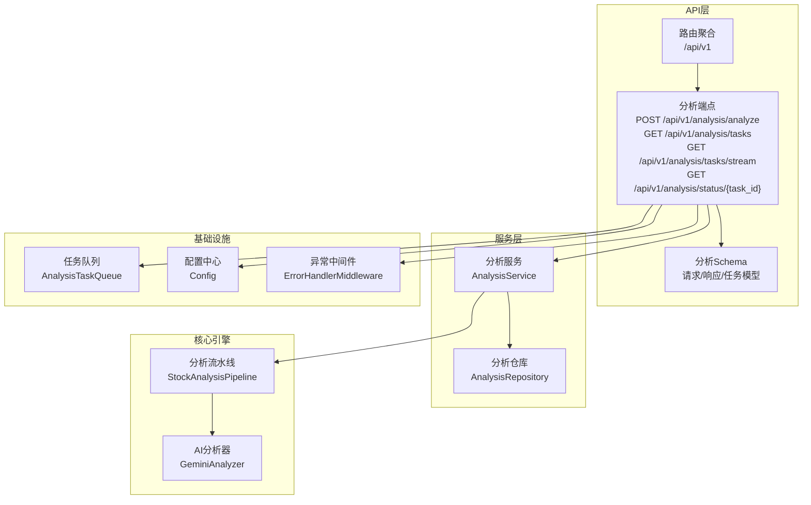
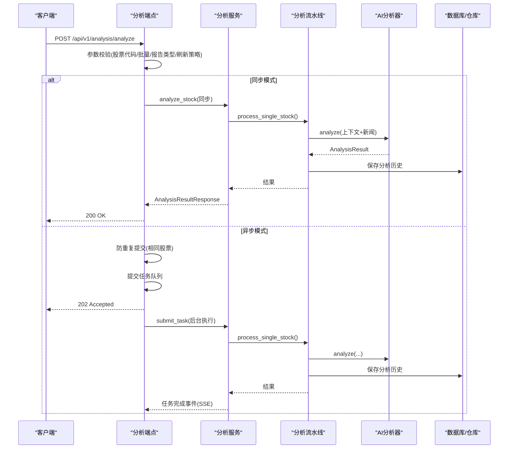
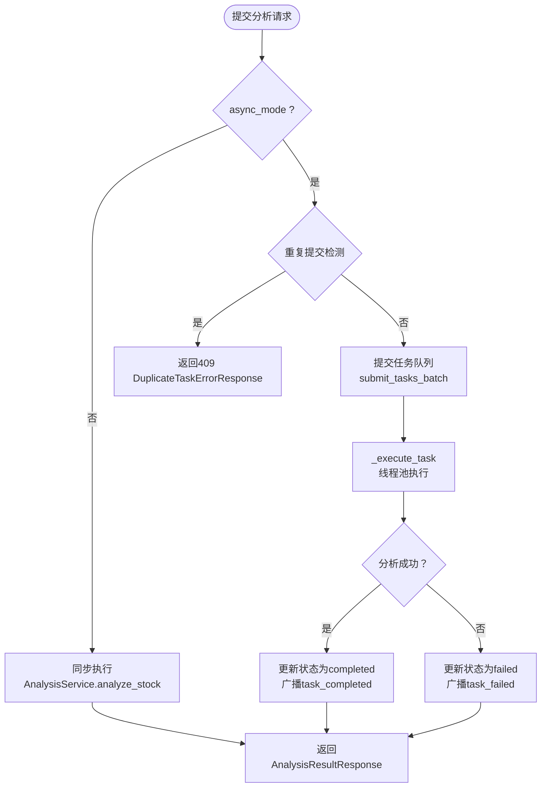
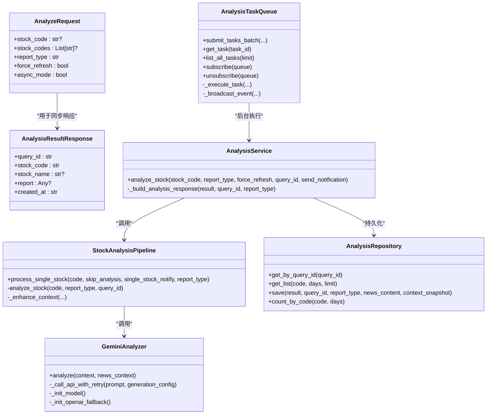

# 分析API接口

<cite>
**本文档引用的文件**
- [analysis.py](file://api/v1/endpoints/analysis.py)
- [analysis.py](file://api/v1/schemas/analysis.py)
- [analysis_service.py](file://src/services/analysis_service.py)
- [analysis_repo.py](file://src/repositories/analysis_repo.py)
- [analyzer.py](file://src/analyzer.py)
- [pipeline.py](file://src/core/pipeline.py)
- [enums.py](file://src/enums.py)
- [history.py](file://api/v1/schemas/history.py)
- [task_queue.py](file://src/services/task_queue.py)
- [error_handler.py](file://api/middlewares/error_handler.py)
- [router.py](file://api/v1/router.py)
- [config.py](file://src/config.py)
- [deps.py](file://api/deps.py)
</cite>

## 目录
1. [简介](#简介)
2. [项目结构](#项目结构)
3. [核心组件](#核心组件)
4. [架构总览](#架构总览)
5. [详细组件分析](#详细组件分析)
6. [依赖关系分析](#依赖关系分析)
7. [性能考虑](#性能考虑)
8. [故障排除指南](#故障排除指南)
9. [结论](#结论)
10. [附录](#附录)

## 简介
本文件为股票分析API接口的全面技术文档，覆盖HTTP接口定义、请求参数校验、响应数据结构、实时分析触发机制、SSE流式传输、异步任务处理、分析配置选项、技术指标参数、AI模型选择、错误码说明、异常处理与重试策略、请求示例、响应格式、调试技巧以及分析历史查询、批量分析与性能优化方法。旨在帮助开发者与运维人员快速理解并高效集成与维护该分析系统。

## 项目结构
分析API位于FastAPI应用的v1版本路由下，采用模块化设计：
- 路由聚合：统一挂载到/api/v1前缀
- 端点实现：分析相关接口集中在analysis.py
- 数据模型：请求/响应/任务状态等模型定义于schemas/analysis.py
- 服务层：分析服务封装业务逻辑
- 核心流水线：StockAnalysisPipeline协调数据获取、分析与存储
- 任务队列：AnalysisTaskQueue管理异步任务生命周期与SSE广播
- 配置中心：Config单例提供全局配置
- 中间件：统一异常处理

图表来源
- [router.py:17-35](file://api/v1/router.py#L17-L35)
- [analysis.py:65-694](file://api/v1/endpoints/analysis.py#L65-L694)
- [analysis_service.py:29-171](file://src/services/analysis_service.py#L29-L171)
- [analysis_repo.py:21-131](file://src/repositories/analysis_repo.py#L21-L131)
- [pipeline.py:48-800](file://src/core/pipeline.py#L48-L800)
- [analyzer.py:334-800](file://src/analyzer.py#L334-L800)
- [task_queue.py:108-666](file://src/services/task_queue.py#L108-L666)
- [config.py:31-580](file://src/config.py#L31-L580)
- [error_handler.py:24-129](file://api/middlewares/error_handler.py#L24-L129)

章节来源
- [router.py:17-35](file://api/v1/router.py#L17-L35)
- [analysis.py:65-694](file://api/v1/endpoints/analysis.py#L65-L694)

## 核心组件
- HTTP端点与路由
  - POST /api/v1/analysis/analyze：触发分析（支持同步与异步模式）
  - GET /api/v1/analysis/tasks：获取任务列表（支持按状态筛选与数量限制）
  - GET /api/v1/analysis/tasks/stream：SSE实时任务状态流
  - GET /api/v1/analysis/status/{task_id}：查询单个任务状态
- 数据模型
  - AnalyzeRequest：请求参数模型（股票代码/批量、报告类型、强制刷新、异步模式）
  - AnalysisResultResponse：同步分析结果模型
  - TaskStatus/TaskInfo/TaskListResponse：任务状态与列表模型
  - AnalysisReport/ReportMeta/ReportSummary/ReportStrategy/ReportDetails：完整报告结构
- 服务与流水线
  - AnalysisService：封装分析逻辑，调用流水线并构建响应
  - StockAnalysisPipeline：协调数据获取、趋势分析、新闻情报、AI分析与持久化
  - GeminiAnalyzer：AI分析器，支持Gemini与OpenAI兼容API，具备重试与模型切换
- 任务队列与SSE
  - AnalysisTaskQueue：异步任务队列，防重复提交、线程池执行、SSE事件广播、历史清理
- 配置与依赖
  - Config：单例配置中心，提供AI模型、搜索、通知、并发等配置
  - 依赖注入：get_config_dep、get_task_queue等

章节来源
- [analysis.py:72-694](file://api/v1/endpoints/analysis.py#L72-L694)
- [analysis.py:27-291](file://api/v1/schemas/analysis.py#L27-L291)
- [history.py:112-211](file://api/v1/schemas/history.py#L112-L211)
- [analysis_service.py:29-171](file://src/services/analysis_service.py#L29-L171)
- [pipeline.py:48-800](file://src/core/pipeline.py#L48-L800)
- [analyzer.py:334-800](file://src/analyzer.py#L334-L800)
- [task_queue.py:108-666](file://src/services/task_queue.py#L108-L666)
- [config.py:31-580](file://src/config.py#L31-L580)
- [deps.py:45-72](file://api/deps.py#L45-L72)

## 架构总览
分析API采用分层架构：
- 表现层：FastAPI端点负责HTTP协议与参数校验
- 业务层：AnalysisService封装分析业务，协调流水线与仓库
- 核心引擎：StockAnalysisPipeline组织数据获取、趋势分析、新闻情报与AI分析
- 存储层：AnalysisRepository与数据库交互，保存分析历史与上下文
- 异步层：AnalysisTaskQueue管理异步任务，支持SSE事件推送
- 配置层：Config单例提供全局配置，支持热更新与验证

图表来源
- [analysis.py:88-301](file://api/v1/endpoints/analysis.py#L88-L301)
- [analysis_service.py:40-105](file://src/services/analysis_service.py#L40-L105)
- [pipeline.py:183-430](file://src/core/pipeline.py#L183-L430)
- [analyzer.py:334-800](file://src/analyzer.py#L334-L800)
- [task_queue.py:260-533](file://src/services/task_queue.py#L260-L533)

## 详细组件分析

### HTTP接口与参数校验
- POST /api/v1/analysis/analyze
  - 方法：POST
  - 路径：/api/v1/analysis/analyze
  - 功能：触发股票分析，支持同步与异步模式
  - 请求参数：
    - stock_code：单只股票代码（与stock_codes二选一）
    - stock_codes：多只股票代码列表（与stock_code二选一）
    - report_type：报告类型，支持simple/detailed/full/brief
    - force_refresh：是否强制刷新（忽略缓存）
    - async_mode：是否使用异步模式
  - 响应：
    - 同步模式：200，AnalysisResultResponse
    - 异步模式：202，TaskAccepted或BatchTaskAcceptedResponse
    - 参数错误：400，ErrorResponse
    - 重复提交：409，DuplicateTaskErrorResponse
    - 分析失败：500，ErrorResponse
  - 参数校验要点：
    - 至少提供stock_code或stock_codes之一
    - 同步模式仅支持单只股票
    - 股票代码统一大小写并去重
    - report_type按正则约束
  - 重复提交防护：异步模式下相同股票代码正在分析中将返回409

- GET /api/v1/analysis/tasks
  - 方法：GET
  - 路径：/api/v1/analysis/tasks
  - 查询参数：
    - status：按状态筛选（pending/processing/completed/failed，支持逗号分隔）
    - limit：返回数量限制（1-100）
  - 响应：TaskListResponse，包含统计信息与任务列表

- GET /api/v1/analysis/tasks/stream
  - 方法：GET
  - 路径：/api/v1/analysis/tasks/stream
  - 响应：text/event-stream，SSE事件流
  - 事件类型：
    - connected：连接成功
    - task_created：新任务创建
    - task_started：任务开始执行
    - task_completed：任务完成
    - task_failed：任务失败
    - heartbeat：每30秒心跳

- GET /api/v1/analysis/status/{task_id}
  - 方法：GET
  - 路径：/api/v1/analysis/status/{task_id}
  - 响应：
    - 进行中：TaskStatus（不含result）
    - 已完成：TaskStatus（含AnalysisResultResponse）
    - 不存在：404，ErrorResponse

章节来源
- [analysis.py:72-694](file://api/v1/endpoints/analysis.py#L72-L694)
- [analysis.py:27-291](file://api/v1/schemas/analysis.py#L27-L291)
- [history.py:112-211](file://api/v1/schemas/history.py#L112-L211)

### 分析结果数据结构与业务含义
- AnalysisResultResponse
  - query_id：分析记录唯一标识
  - stock_code：股票代码
  - stock_name：股票名称
  - report：分析报告（AnalysisReport）
  - created_at：创建时间
- AnalysisReport
  - meta：ReportMeta
    - id/query_id：记录主键/分析ID
    - stock_code/name：股票代码/名称
    - report_type：报告类型
    - report_language：报告语言（zh/en）
    - created_at：创建时间
    - current_price/change_pct：分析时股价与涨跌幅
    - model_used：分析使用的模型
  - summary：ReportSummary
    - analysis_summary：关键结论
    - operation_advice：操作建议（买入/加仓/持有/减仓/卖出/观望）
    - trend_prediction：趋势预测（强烈看多/看多/震荡/看空/强烈看空）
    - sentiment_score：情绪评分（0-100）
    - sentiment_label：情绪标签（本地化）
  - strategy：ReportStrategy（可选）
    - ideal_buy：理想买入价
    - secondary_buy：次优买入价
    - stop_loss：止损价
    - take_profit：止盈价
  - details：ReportDetails（可选）
    - news_content：新闻摘要
    - raw_result：原始分析结果（JSON）
    - context_snapshot：分析时上下文快照（JSON）
    - financial_report/dividend_metrics：结构化财报与分红指标

章节来源
- [analysis.py:65-89](file://api/v1/schemas/analysis.py#L65-L89)
- [history.py:112-211](file://api/v1/schemas/history.py#L112-L211)

### 实时分析触发机制与异步任务处理
- 同步模式
  - 直接调用AnalysisService.analyze_stock，等待完成后返回AnalysisResultResponse
  - 适合短时分析与调试
- 异步模式
  - 防重复提交：相同股票代码正在分析中返回409
  - 提交任务队列：AnalysisTaskQueue.submit_tasks_batch
  - 线程池执行：AnalysisTaskQueue._execute_task
  - 任务状态变更：广播task_started/task_completed/task_failed事件
  - 历史清理：AnalysisTaskQueue._cleanup_old_tasks
- 任务状态与统计
  - TaskStatus：pending/processing/completed/failed
  - TaskInfo：包含任务ID、股票代码、状态、进度、消息、报告类型、时间戳等
  - TaskListResponse：统计total/pending/processing与任务列表

图表来源
- [analysis.py:161-232](file://api/v1/endpoints/analysis.py#L161-L232)
- [task_queue.py:296-533](file://src/services/task_queue.py#L296-L533)

章节来源
- [analysis.py:88-301](file://api/v1/endpoints/analysis.py#L88-L301)
- [task_queue.py:108-666](file://src/services/task_queue.py#L108-L666)

### SSE流式数据传输
- 事件类型与负载
  - connected：{"message": "Connected to task stream"}
  - task_created：TaskInfo.to_dict()
  - task_started：TaskInfo.to_dict()
  - task_completed：TaskInfo.to_dict()
  - task_failed：TaskInfo.to_dict()
  - heartbeat：{"timestamp": isoformat}
- 心跳机制：每30秒发送一次heartbeat事件
- 订阅与取消：subscribe/unsubscribe，使用asyncio.Queue进行事件广播
- 兼容性：设置Cache-Control: no-cache、Connection: keep-alive、X-Accel-Buffering: no

章节来源
- [analysis.py:384-440](file://api/v1/endpoints/analysis.py#L384-L440)
- [task_queue.py:570-635](file://src/services/task_queue.py#L570-L635)

### 分析配置选项、技术指标参数与AI模型选择
- 配置中心（Config）
  - AI模型：gemini_api_key/gemini_model/gemini_model_fallback/gemini_temperature
  - 备选模型：openai_api_key/openai_base_url/openai_model/openai_temperature
  - 请求重试：gemini_max_retries/gemini_retry_delay/gemini_request_delay
  - 搜索引擎：bocha_api_keys/tavily_api_keys/brave_api_keys/serpapi_keys
  - 并发与限流：max_workers/akshare_sleep_min/akshare_sleep_max/tushare_rate_limit_per_minute
  - 实时行情：enable_realtime_quote/enable_chip_distribution/realtime_source_priority
  - 通知与WebUI：各类通知渠道与webui_enabled/webui_host/webui_port
- 报告类型映射
  - API输入：simple/detailed/full/brief
  - 内部枚举：SIMPLE/FULL/BRIEF
  - detailed归一化为FULL
- 技术指标与分析
  - 均线系统：MA5/MA10/MA20，多头排列判断
  - 乖离率：(现价-MA5)/MA5*100%，追高阈值5%
  - 量比/换手率：实时行情增强
  - 筹码分布：获利比例、平均成本、集中度
  - 社交舆情：US股票支持Reddit/X/Polymarket
- AI模型选择与重试
  - 优先Gemini，失败则尝试备选模型
  - OpenAI兼容API作为最终备选
  - 指数退避重试，处理429限流与参数不支持错误

章节来源
- [config.py:53-70](file://src/config.py#L53-L70)
- [config.py:342-353](file://src/config.py#L342-L353)
- [enums.py:13-51](file://src/enums.py#L13-L51)
- [pipeline.py:48-120](file://src/core/pipeline.py#L48-L120)
- [analyzer.py:531-800](file://src/analyzer.py#L531-L800)

### 错误码说明、异常处理与重试策略
- HTTP状态码
  - 200：同步分析完成
  - 202：异步任务已接受
  - 400：请求参数错误（validation_error）
  - 409：重复提交（duplicate_task）
  - 404：任务不存在（not_found）
  - 500：服务器内部错误（internal_error）
- 异常处理中间件
  - 全局捕获未处理异常，统一返回{"error":"internal_error","message":...}
  - HTTPException：包装为ErrorResponse
  - RequestValidationError：返回422与详细错误
- 重试策略
  - AI调用：gemini_max_retries/gemini_retry_delay，指数退避
  - 模型切换：主模型失败后自动切换备选模型
  - OpenAI兼容API：参数适配（max_tokens/max_completion_tokens），失败后降级

章节来源
- [analysis.py:75-84](file://api/v1/endpoints/analysis.py#L75-L84)
- [error_handler.py:24-129](file://api/middlewares/error_handler.py#L24-L129)
- [analyzer.py:788-787](file://src/analyzer.py#L788-L787)

### 请求示例与响应格式
- 请求示例（POST /api/v1/analysis/analyze）
  - 同步模式：async_mode=false，提供stock_code或stock_codes，report_type可选（默认detailed），force_refresh可选（默认true）
  - 异步模式：async_mode=true，支持批量股票分析
- 响应格式
  - 同步：AnalysisResultResponse
  - 异步：TaskAccepted或BatchTaskAcceptedResponse
  - 任务状态：TaskStatus
  - 完整报告：AnalysisReport（meta/summary/strategy/details）

章节来源
- [analysis.py:27-180](file://api/v1/schemas/analysis.py#L27-L180)
- [history.py:163-211](file://api/v1/schemas/history.py#L163-L211)

### 调试技巧
- 同步分析便于调试，可直接查看AnalysisResultResponse
- 使用GET /api/v1/analysis/tasks/stream观察任务状态变化
- 查看GET /api/v1/analysis/status/{task_id}确认任务完成与结果
- 检查日志与异常中间件输出，定位参数错误与内部异常
- 配置验证：Config.validate()返回缺失或无效配置项的警告列表

章节来源
- [analysis.py:470-570](file://api/v1/endpoints/analysis.py#L470-L570)
- [config.py:507-546](file://src/config.py#L507-L546)
- [error_handler.py:50-67](file://api/middlewares/error_handler.py#L50-L67)

### 分析历史查询、批量分析与性能优化
- 分析历史查询
  - AnalysisRepository提供按query_id/code/days/limit查询历史记录
  - 支持统计指定股票的分析记录数
- 批量分析
  - 异步模式下支持批量提交，重复股票会被跳过并返回重复错误
  - 批量响应包含accepted与duplicates列表
- 性能优化
  - 并发控制：max_workers限制线程池大小，避免API限流与封禁
  - 断点续传：fetch_and_save_stock根据数据库已有数据决定是否拉取
  - 实时行情缓存：realtime_cache_ttl控制缓存时间
  - 限流与重试：akshare_sleep_min/akshare_sleep_max与gemini_max_retries等
  - 历史清理：AnalysisTaskQueue清理过期任务，保留最近_max_history条

章节来源
- [analysis_repo.py:37-131](file://src/repositories/analysis_repo.py#L37-L131)
- [analysis.py:161-232](file://api/v1/endpoints/analysis.py#L161-L232)
- [task_queue.py:534-566](file://src/services/task_queue.py#L534-L566)
- [config.py:182-194](file://src/config.py#L182-L194)

## 依赖关系分析

图表来源
- [analysis.py:27-180](file://api/v1/schemas/analysis.py#L27-L180)
- [analysis_service.py:29-171](file://src/services/analysis_service.py#L29-L171)
- [pipeline.py:48-800](file://src/core/pipeline.py#L48-L800)
- [analyzer.py:334-800](file://src/analyzer.py#L334-L800)
- [task_queue.py:108-666](file://src/services/task_queue.py#L108-L666)
- [analysis_repo.py:21-131](file://src/repositories/analysis_repo.py#L21-L131)

章节来源
- [analysis.py:27-180](file://api/v1/schemas/analysis.py#L27-L180)
- [analysis_service.py:29-171](file://src/services/analysis_service.py#L29-L171)
- [pipeline.py:48-800](file://src/core/pipeline.py#L48-L800)
- [analyzer.py:334-800](file://src/analyzer.py#L334-L800)
- [task_queue.py:108-666](file://src/services/task_queue.py#L108-L666)
- [analysis_repo.py:21-131](file://src/repositories/analysis_repo.py#L21-L131)

## 性能考虑
- 并发与限流
  - max_workers控制最大并发，避免API限流与封禁
  - akshare_sleep_min/akshare_sleep_max为数据源请求增加随机间隔
  - tushare_rate_limit_per_minute限制Tushare每分钟请求数
- 缓存与断点续传
  - fetch_and_save_stock根据数据库已有数据决定是否拉取，减少重复网络请求
  - realtime_cache_ttl控制实时行情缓存时间
- 任务队列优化
  - AnalysisTaskQueue清理过期任务，避免内存膨胀
  - SSE事件广播使用call_soon_threadsafe保证跨线程安全
- AI调用优化
  - 指数退避重试，处理429限流
  - 模型切换与参数适配，提升成功率

[本节为通用指导，无需特定文件引用]

## 故障排除指南
- 常见错误与处理
  - 400参数错误：检查stock_code/stock_codes/report_type/async_mode是否符合要求
  - 409重复提交：同一股票正在分析中，等待完成后重试或使用不同股票
  - 500内部错误：查看日志与异常中间件输出，定位具体异常
- 调试步骤
  - 使用同步模式快速定位参数与数据问题
  - 通过SSE流观察任务状态变化
  - 查询历史记录确认分析是否成功保存
- 配置验证
  - Config.validate()返回缺失或无效配置项的警告列表
  - 确认AI模型、搜索引擎、通知渠道等关键配置

章节来源
- [analysis.py:115-155](file://api/v1/endpoints/analysis.py#L115-L155)
- [error_handler.py:50-67](file://api/middlewares/error_handler.py#L50-L67)
- [config.py:507-546](file://src/config.py#L507-L546)

## 结论
分析API接口提供了完整的股票智能分析能力，涵盖同步与异步分析、实时SSE流、任务队列管理、丰富的报告结构与配置选项。通过严格的参数校验、完善的异常处理与重试策略、合理的性能优化与历史查询能力，系统能够稳定高效地服务于个人与企业用户。建议在生产环境中合理配置并发与限流参数，并充分利用异步模式与SSE流提升用户体验。

[本节为总结性内容，无需特定文件引用]

## 附录
- API端点一览
  - POST /api/v1/analysis/analyze：触发分析
  - GET /api/v1/analysis/tasks：获取任务列表
  - GET /api/v1/analysis/tasks/stream：SSE任务状态流
  - GET /api/v1/analysis/status/{task_id}：查询任务状态
- 关键配置项
  - AI模型与温度：gemini_api_key/gemini_model/gemini_temperature
  - 备选模型：openai_api_key/openai_model/openai_temperature
  - 搜索引擎：bocha/tavily/brave/serpapi keys
  - 并发与限流：max_workers/akshare_sleep_min/akshare_sleep_max/tushare_rate_limit_per_minute
  - 实时行情：enable_realtime_quote/enable_chip_distribution/realtime_source_priority
  - 通知与WebUI：各类通知渠道与webui_enabled/webui_host/webui_port

[本节为补充信息，无需特定文件引用]