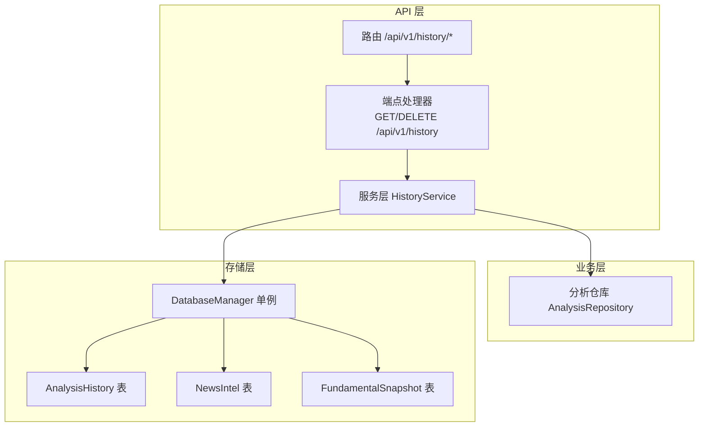
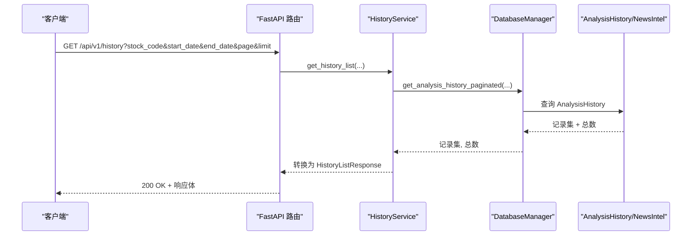
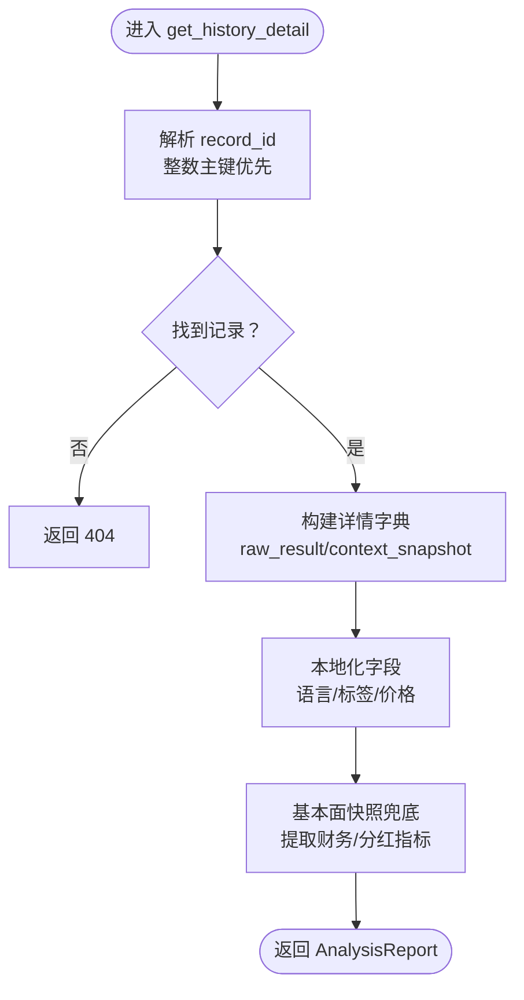
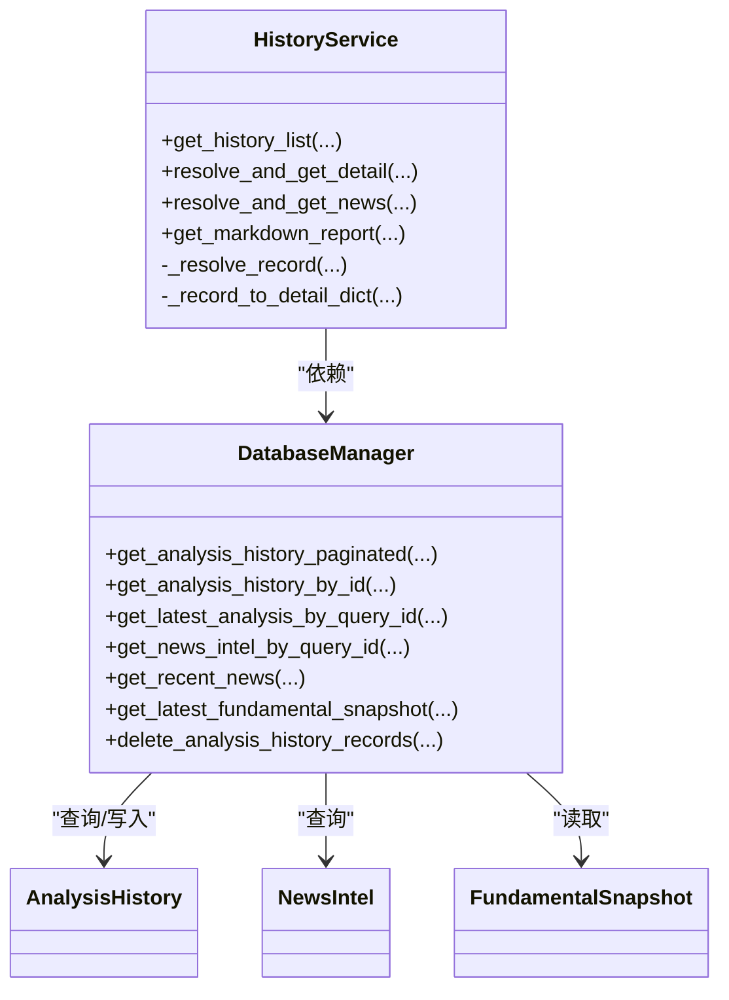

# 历史数据API

<cite>
**本文引用的文件**
- [api/v1/endpoints/history.py](file://api/v1/endpoints/history.py)
- [api/v1/schemas/history.py](file://api/v1/schemas/history.py)
- [api/v1/router.py](file://api/v1/router.py)
- [src/services/history_service.py](file://src/services/history_service.py)
- [src/storage.py](file://src/storage.py)
- [src/repositories/analysis_repo.py](file://src/repositories/analysis_repo.py)
- [tests/test_analysis_history.py](file://tests/test_analysis_history.py)
</cite>

## 目录
1. [简介](#简介)
2. [项目结构](#项目结构)
3. [核心组件](#核心组件)
4. [架构总览](#架构总览)
5. [详细组件分析](#详细组件分析)
6. [依赖关系分析](#依赖关系分析)
7. [性能考量](#性能考量)
8. [故障排查指南](#故障排查指南)
9. [结论](#结论)
10. [附录](#附录)

## 简介
本文件为“历史数据查询API”的全面技术文档，覆盖接口设计、数据模型、查询过滤、分页机制、排序规则、导出与批量操作、错误处理、性能优化与缓存策略等内容。目标读者包括后端开发者、前端集成人员以及运维工程师。

## 项目结构
历史数据API位于 FastAPI 路由体系中，采用三层架构：路由层负责HTTP接口定义与参数校验；服务层封装业务逻辑；存储层提供ORM模型与数据库操作。

图表来源
- [api/v1/router.py:17-41](file://api/v1/router.py#L17-L41)
- [api/v1/endpoints/history.py:46-46](file://api/v1/endpoints/history.py#L46-L46)
- [src/services/history_service.py:48-63](file://src/services/history_service.py#L48-L63)
- [src/storage.py:623-746](file://src/storage.py#L623-L746)
- [src/repositories/analysis_repo.py:21-36](file://src/repositories/analysis_repo.py#L21-L36)

章节来源
- [api/v1/router.py:17-41](file://api/v1/router.py#L17-L41)
- [api/v1/endpoints/history.py:46-46](file://api/v1/endpoints/history.py#L46-L46)

## 核心组件
- 路由与端点：提供历史记录列表、详情、新闻、Markdown导出、批量删除等接口。
- 服务层：封装查询、解析、本地化、Markdown生成等逻辑。
- 存储层：定义ORM模型、提供分页查询、上下文快照、基本面快照、新闻情报等数据访问方法。
- 模型与响应：Pydantic 模型定义请求/响应结构，确保类型安全与文档化。

章节来源
- [api/v1/endpoints/history.py:49-452](file://api/v1/endpoints/history.py#L49-L452)
- [api/v1/schemas/history.py:17-211](file://api/v1/schemas/history.py#L17-L211)
- [src/services/history_service.py:48-919](file://src/services/history_service.py#L48-L919)
- [src/storage.py:208-270](file://src/storage.py#L208-L270)

## 架构总览
历史数据API遵循“路由-服务-存储”分层，端点负责参数解析与异常处理，服务层负责业务编排与数据转换，存储层负责SQL查询与事务控制。

图表来源
- [api/v1/endpoints/history.py:59-126](file://api/v1/endpoints/history.py#L59-L126)
- [src/services/history_service.py:64-136](file://src/services/history_service.py#L64-L136)
- [src/storage.py:1150-1202](file://src/storage.py#L1150-L1202)

## 详细组件分析

### 接口定义与URL模式
- 历史列表查询
  - 方法：GET
  - 路径：/api/v1/history
  - 查询参数：
    - stock_code: 股票代码筛选
    - start_date: 开始日期（YYYY-MM-DD）
    - end_date: 结束日期（YYYY-MM-DD）
    - page: 页码（从 1 开始）
    - limit: 每页数量（1-100）
- 历史详情查询
  - 方法：GET
  - 路径：/api/v1/history/{record_id}
  - 参数：record_id 支持两种形式
    - 整数主键 ID
    - 字符串 query_id
- 历史关联新闻
  - 方法：GET
  - 路径：/api/v1/history/{record_id}/news
  - 查询参数：limit（1-100）
- 历史Markdown导出
  - 方法：GET
  - 路径：/api/v1/history/{record_id}/markdown
- 批量删除历史记录
  - 方法：DELETE
  - 路径：/api/v1/history
  - 请求体：DeleteHistoryRequest（record_ids）

章节来源
- [api/v1/endpoints/history.py:49-171](file://api/v1/endpoints/history.py#L49-L171)
- [api/v1/endpoints/history.py:173-385](file://api/v1/endpoints/history.py#L173-L385)
- [api/v1/endpoints/history.py:388-452](file://api/v1/endpoints/history.py#L388-L452)

### 查询参数与过滤条件
- 股票筛选：支持按 stock_code 过滤。
- 时间范围：支持按 start_date、end_date 过滤，服务层将日期字符串解析为日期对象，并对非法格式进行告警。
- 分页：page 与 limit 控制偏移与数量，服务层计算 offset = (page - 1) × limit。
- 排序：默认按 created_at 降序（最新在前）。
- 删除：仅接受非空整数 ID 列表，否则返回 400。

章节来源
- [api/v1/endpoints/history.py:59-126](file://api/v1/endpoints/history.py#L59-L126)
- [src/services/history_service.py:64-136](file://src/services/history_service.py#L64-L136)
- [src/storage.py:1150-1202](file://src/storage.py#L1150-L1202)

### 数据模型与字段定义
- 历史记录摘要（HistoryItem）
  - 字段：id、query_id、stock_code、stock_name、report_type、sentiment_score、operation_advice、created_at
- 历史列表响应（HistoryListResponse）
  - 字段：total、page、limit、items
- 删除请求/响应（DeleteHistoryRequest/DeleteHistoryResponse）
  - 字段：record_ids、deleted
- 新闻情报条目（NewsIntelItem）
  - 字段：title、snippet、url
- 分析报告（AnalysisReport）
  - 元信息（ReportMeta）、概览（ReportSummary）、策略（ReportStrategy）、详情（ReportDetails）
- Markdown 报告（MarkdownReportResponse）
  - 字段：content

章节来源
- [api/v1/schemas/history.py:17-211](file://api/v1/schemas/history.py#L17-L211)

### 数据结构与关联关系
- AnalysisHistory
  - 主键：id
  - 关联：query_id（同一批次分析可能重复）
  - 核心结论：sentiment_score、operation_advice、trend_prediction、analysis_summary
  - 详细数据：raw_result、news_content、context_snapshot
  - 狙击点位：ideal_buy、secondary_buy、stop_loss、take_profit
  - 时间：created_at
- NewsIntel
  - 关联：query_id、code、published_date
  - 去重：URL 唯一约束；无 URL 时使用哈希键兜底
- FundamentalSnapshot
  - 关联：query_id、code
  - 用途：写入型快照，用于回测/画像扩展

章节来源
- [src/storage.py:208-270](file://src/storage.py#L208-L270)
- [src/storage.py:135-181](file://src/storage.py#L135-L181)
- [src/storage.py:183-206](file://src/storage.py#L183-L206)

### 查询流程与数据转换
- 历史列表
  - 服务层调用 get_analysis_history_paginated，返回记录集与总数，再映射为 HistoryItem 列表。
- 详情查询
  - 支持 record_id 为整数主键或 query_id；优先主键精确匹配，避免批量分析时的重复 query_id 导致的歧义。
  - 从 raw_result 与 context_snapshot 中提取并本地化字段，构建 AnalysisReport。
- 新闻情报
  - 先按 query_id 直接查询；若无结果，按分析上下文兜底：同股票近期新闻 + 时间窗口过滤。
- Markdown 报告
  - 从 raw_result 重建 AnalysisResult，生成与通知一致的 Markdown 报告；失败抛出特定异常并返回 500。

图表来源
- [src/services/history_service.py:160-316](file://src/services/history_service.py#L160-L316)
- [src/services/history_service.py:292-306](file://src/services/history_service.py#L292-L306)

章节来源
- [src/services/history_service.py:137-316](file://src/services/history_service.py#L137-L316)

### 导出、批量查询与增量更新
- 批量删除：DELETE /api/v1/history，支持一次删除多个主键 ID，内部同时清理回测结果。
- Markdown 导出：GET /api/v1/history/{record_id}/markdown，生成完整报告文本。
- 增量更新：存储层提供 has_today_data 与 save_daily_data，支持断点续传与UPSERT逻辑。

章节来源
- [api/v1/endpoints/history.py:128-171](file://api/v1/endpoints/history.py#L128-L171)
- [src/services/history_service.py:443-498](file://src/services/history_service.py#L443-L498)
- [src/storage.py:747-804](file://src/storage.py#L747-L804)
- [src/storage.py:1301-1394](file://src/storage.py#L1301-L1394)

### 错误处理与状态码
- 400：请求参数无效（如删除时 record_ids 为空）
- 404：记录不存在（详情/Markdown）
- 500：服务器内部错误（查询/生成失败）
- 端点层统一捕获异常并返回标准化错误响应模型

章节来源
- [api/v1/endpoints/history.py:117-126](file://api/v1/endpoints/history.py#L117-L126)
- [api/v1/endpoints/history.py:146-171](file://api/v1/endpoints/history.py#L146-L171)
- [api/v1/endpoints/history.py:211-218](file://api/v1/endpoints/history.py#L211-L218)
- [api/v1/endpoints/history.py:423-440](file://api/v1/endpoints/history.py#L423-L440)

## 依赖关系分析

图表来源
- [src/services/history_service.py:48-63](file://src/services/history_service.py#L48-L63)
- [src/storage.py:623-746](file://src/storage.py#L623-L746)
- [src/storage.py:208-270](file://src/storage.py#L208-L270)
- [src/storage.py:135-181](file://src/storage.py#L135-L181)
- [src/storage.py:183-206](file://src/storage.py#L183-L206)

章节来源
- [src/services/history_service.py:48-919](file://src/services/history_service.py#L48-L919)
- [src/storage.py:623-1246](file://src/storage.py#L623-L1246)

## 性能考量
- 索引与查询
  - AnalysisHistory：query_id、code、created_at 索引，支持按股票与时间范围高效分页。
  - NewsIntel：query_id、code、published_date、fetched_at 索引，支持按 query_id 与时间窗口检索。
  - FundamentalSnapshot：query_id、code、created_at 索引，支持快速定位最新快照。
- 分页与总数
  - 服务层使用 COUNT(*) + LIMIT/OFFSET 的组合，确保 total 准确；注意大偏移场景下的性能影响。
- JSON 字段
  - raw_result、context_snapshot 为 TEXT JSON，查询时需解析；建议在高频路径上缓存解析结果或使用物化视图。
- 去重与兜底
  - 新闻情报按 URL 唯一；无 URL 时使用哈希键兜底；兜底新闻按分析时间窗口与发布日期严格过滤，避免脏数据。
- 本地化与格式化
  - 服务层对数值进行格式化与清洗，避免前端渲染开销；Markdown 生成在内存中完成，注意大体量报告的内存占用。

章节来源
- [src/storage.py:245-247](file://src/storage.py#L245-L247)
- [src/storage.py:174-177](file://src/storage.py#L174-L177)
- [src/storage.py:199-202](file://src/storage.py#L199-L202)
- [src/storage.py:1032-1056](file://src/storage.py#L1032-L1056)
- [src/storage.py:1011-1030](file://src/storage.py#L1011-L1030)
- [src/services/history_service.py:369-421](file://src/services/history_service.py#L369-L421)

## 故障排查指南
- 查询不到记录
  - 确认 record_id 类型：主键 ID 与 query_id 的优先级与回退逻辑。
  - 检查时间范围与股票代码过滤是否过于严格。
- 删除失败或未生效
  - 确认传入的 record_ids 非空且为整数；服务层会排序去重后再执行删除。
  - 检查是否存在外键约束导致的删除失败（内部已清理回测结果）。
- Markdown 生成失败
  - 检查 raw_result 是否为空或格式异常；服务层会抛出特定异常并返回 500。
- 新闻情报为空
  - 若直接按 query_id 未命中，系统会按分析上下文兜底；确认分析时间与股票代码是否匹配。
- 性能问题
  - 大页码偏移导致慢查询；建议减少 page 或增加 limit 下限，或在应用层做游标分页。

章节来源
- [src/services/history_service.py:137-177](file://src/services/history_service.py#L137-L177)
- [src/services/history_service.py:292-306](file://src/services/history_service.py#L292-L306)
- [src/services/history_service.py:443-498](file://src/services/history_service.py#L443-L498)
- [src/services/history_service.py:308-341](file://src/services/history_service.py#L308-L341)
- [src/storage.py:1223-1246](file://src/storage.py#L1223-L1246)

## 结论
历史数据API通过清晰的分层设计与完善的模型定义，提供了稳定的历史记录查询、详情展示、新闻关联、Markdown导出与批量删除能力。结合索引与分页策略，可在较大数据规模下保持良好性能。建议在生产环境中配合缓存与异步任务进一步优化用户体验与系统吞吐。

## 附录

### 查询示例与最佳实践
- 列表查询
  - GET /api/v1/history?stock_code=600519&start_date=2024-01-01&end_date=2024-12-31&page=1&limit=20
- 详情查询
  - GET /api/v1/history/12345 或 GET /api/v1/history?qwertyuiop
- 新闻查询
  - GET /api/v1/history/12345/news?limit=20
- Markdown 导出
  - GET /api/v1/history/12345/markdown
- 批量删除
  - DELETE /api/v1/history
  - 请求体：{"record_ids":[1,2,3]}

章节来源
- [api/v1/endpoints/history.py:59-171](file://api/v1/endpoints/history.py#L59-L171)
- [api/v1/endpoints/history.py:330-452](file://api/v1/endpoints/history.py#L330-L452)

### 数据一致性与缓存策略
- 一致性
  - AnalysisHistory 与 BacktestResult 通过外键关联；删除历史记录时自动清理回测结果，避免悬挂数据。
  - NewsIntel 通过 URL 唯一约束与兜底键保证去重，避免重复入库。
- 缓存
  - 建议对热点历史详情与Markdown报告进行短期缓存（如 Redis），结合 query_id 作为键，设置合理过期时间。
  - 对于频繁的列表查询，可在应用层缓存热门股票的时间窗口结果，降低数据库压力。

章节来源
- [src/storage.py:1223-1246](file://src/storage.py#L1223-L1246)
- [src/storage.py:805-929](file://src/storage.py#L805-L929)