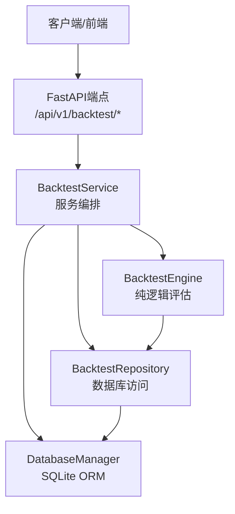
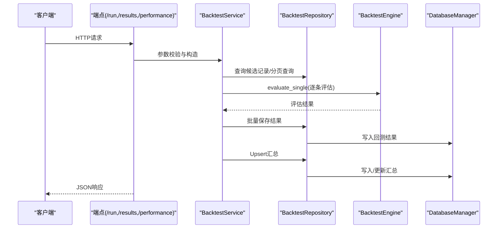
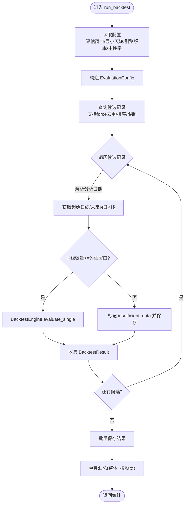
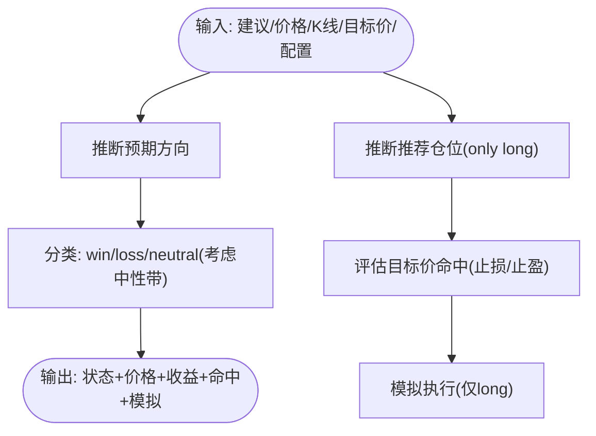
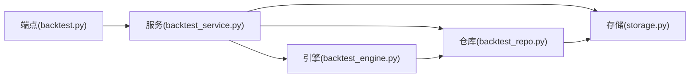

# 回测API接口

<cite>
**本文档引用的文件**
- [backtest.py](file://api/v1/endpoints/backtest.py)
- [backtest.py](file://api/v1/schemas/backtest.py)
- [backtest_service.py](file://src/services/backtest_service.py)
- [backtest_repo.py](file://src/repositories/backtest_repo.py)
- [backtest_engine.py](file://src/core/backtest_engine.py)
- [storage.py](file://src/storage.py)
- [config.py](file://src/config.py)
- [backtest.ts](file://apps/dsa-web/src/api/backtest.ts)
- [backtest.ts](file://apps/dsa-web/src/types/backtest.ts)
- [history.py](file://api/v1/endpoints/history.py)
- [history.py](file://api/v1/schemas/history.py)
- [task_queue.py](file://src/services/task_queue.py)
- [task_service.py](file://src/services/task_service.py)
</cite>

## 目录
1. [简介](#简介)
2. [项目结构](#项目结构)
3. [核心组件](#核心组件)
4. [架构总览](#架构总览)
5. [详细组件分析](#详细组件分析)
6. [依赖关系分析](#依赖关系分析)
7. [性能考虑](#性能考虑)
8. [故障排查指南](#故障排查指南)
9. [结论](#结论)
10. [附录](#附录)

## 简介
本文件为股票回测API接口的详细技术文档，覆盖以下主题：
- HTTP方法、URL模式与参数校验规则
- 回测配置参数、时间范围与策略参数定义
- 回测结果数据结构、统计指标与可视化数据格式
- 异步回测执行机制、进度跟踪与状态查询
- 回测历史查询、结果导出与性能分析
- 完整API调用示例、错误处理与最佳实践
- 回测优化策略、内存管理与并发控制方法

## 项目结构
回测API位于FastAPI应用的v1版本路由下，采用“端点-服务-仓库-引擎-存储”的分层设计：
- 端点层：负责HTTP协议、参数校验与响应封装
- 服务层：编排回测流程、协调仓库与引擎
- 仓库层：数据库访问与聚合查询
- 引擎层：纯逻辑的回测评估算法
- 存储层：ORM模型与数据库连接管理

图表来源
- [backtest.py:25-161](file://api/v1/endpoints/backtest.py#L25-L161)
- [backtest_service.py:22-447](file://src/services/backtest_service.py#L22-L447)
- [backtest_repo.py:21-222](file://src/repositories/backtest_repo.py#L21-L222)
- [backtest_engine.py:50-556](file://src/core/backtest_engine.py#L50-L556)
- [storage.py:623-746](file://src/storage.py#L623-L746)

章节来源
- [backtest.py:25-161](file://api/v1/endpoints/backtest.py#L25-L161)
- [backtest_service.py:22-447](file://src/services/backtest_service.py#L22-L447)
- [backtest_repo.py:21-222](file://src/repositories/backtest_repo.py#L21-L222)
- [backtest_engine.py:50-556](file://src/core/backtest_engine.py#L50-L556)
- [storage.py:623-746](file://src/storage.py#L623-L746)

## 核心组件
- 端点控制器：提供触发回测、查询回测结果、获取整体/单股表现等接口
- 服务编排器：解析配置、构建评估配置、拉取候选记录、驱动引擎、批量落库、重算汇总
- 仓库层：查询候选记录、分页查询回测结果、保存结果、Upsert汇总
- 引擎：基于操作建议与目标价，推演未来N日收益与命中情况
- 存储层：定义回测结果与汇总的ORM模型，提供数据库连接与事务管理

章节来源
- [backtest.py:28-161](file://api/v1/endpoints/backtest.py#L28-L161)
- [backtest_service.py:30-233](file://src/services/backtest_service.py#L30-L233)
- [backtest_repo.py:27-195](file://src/repositories/backtest_repo.py#L27-L195)
- [backtest_engine.py:119-234](file://src/core/backtest_engine.py#L119-L234)
- [storage.py:272-393](file://src/storage.py#L272-L393)

## 架构总览
回测API的调用链路如下：

图表来源
- [backtest.py:38-161](file://api/v1/endpoints/backtest.py#L38-L161)
- [backtest_service.py:30-233](file://src/services/backtest_service.py#L30-L233)
- [backtest_repo.py:65-195](file://src/repositories/backtest_repo.py#L65-L195)
- [backtest_engine.py:119-234](file://src/core/backtest_engine.py#L119-L234)
- [storage.py:623-746](file://src/storage.py#L623-L746)

## 详细组件分析

### HTTP端点与路由
- 触发回测
  - 方法：POST
  - 路径：/api/v1/backtest/run
  - 请求体：BacktestRunRequest（见下节Schema）
  - 响应：BacktestRunResponse
  - 错误：500时返回统一错误响应
- 获取回测结果
  - 方法：GET
  - 路径：/api/v1/backtest/results
  - 查询参数：code、eval_window_days、page、limit
  - 响应：BacktestResultsResponse
  - 错误：500时返回统一错误响应
- 获取整体回测表现
  - 方法：GET
  - 路径：/api/v1/backtest/performance
  - 查询参数：eval_window_days
  - 响应：PerformanceMetrics
  - 错误：404无汇总时返回统一错误响应；500时返回统一错误响应
- 获取单股回测表现
  - 方法：GET
  - 路径：/api/v1/backtest/performance/{code}
  - 查询参数：eval_window_days
  - 响应：PerformanceMetrics
  - 错误：404无汇总时返回统一错误响应；500时返回统一错误响应

章节来源
- [backtest.py:28-161](file://api/v1/endpoints/backtest.py#L28-L161)

### Schema定义与参数校验
- BacktestRunRequest
  - code: 可选，仅回测指定股票
  - force: 布尔，强制重新计算（覆盖同窗口版本）
  - eval_window_days: 可选，评估窗口（交易日），默认来自配置
  - min_age_days: 可选，分析记录最小天龄（0表示不限），默认来自配置
  - limit: 整数，最多处理的分析记录数，默认200
- BacktestRunResponse
  - processed: 候选记录数
  - saved: 写入回测结果数
  - completed: 完成回测数
  - insufficient: 数据不足数
  - errors: 错误数
- BacktestResultItem
  - analysis_history_id: 关联的历史分析ID
  - code: 股票代码
  - analysis_date: 分析日期
  - eval_window_days: 评估窗口
  - engine_version: 引擎版本
  - eval_status: 评估状态（pending/completed/insufficient_data/error）
  - evaluated_at: 评估时间
  - operation_advice: 操作建议快照
  - position_recommendation: 推荐仓位（long/cash）
  - start_price: 入场价
  - end_close: 窗口末收盘价
  - max_high/min_low: 窗口最高/最低
  - stock_return_pct: 股票收益%
  - direction_expected: 预期方向（up/down/flat/not_down）
  - direction_correct: 方向判断是否正确
  - outcome: 结果（win/loss/neutral）
  - stop_loss/take_profit: 止损/止盈
  - hit_stop_loss/hit_take_profit: 是否命中止损/止盈
  - first_hit: 首次命中（stop_loss/take_profit/ambiguous/neither/not_applicable）
  - first_hit_date/first_hit_trading_days: 首次命中日期与交易日数
  - simulated_entry_price/simulated_exit_price/simulated_exit_reason/simulated_return_pct: 模拟执行结果
- BacktestResultsResponse
  - total/page/limit/items
- PerformanceMetrics
  - scope/code/eval_window_days/engine_version/computed_at
  - 计数：total_evaluations/completed_count/insufficient_count/long_count/cash_count/win_count/loss_count/neutral_count
  - 准确率/胜率：direction_accuracy_pct/win_rate_pct/neutral_rate_pct
  - 收益：avg_stock_return_pct/avg_simulated_return_pct
  - 目标价触发统计：stop_loss_trigger_rate/take_profit_trigger_rate/ambiguous_rate/avg_days_to_first_hit
  - 诊断：advice_breakdown/diagnostics

章节来源
- [backtest.py:11-95](file://api/v1/schemas/backtest.py#L11-L95)

### 服务编排与执行流程
- run_backtest
  - 读取配置：评估窗口、最小天龄、引擎版本、中性带百分比
  - 构造EvaluationConfig
  - 查询候选记录（支持force去重、按创建时间倒序、limit限制）
  - 逐条评估：
    - 解析分析日期
    - 获取起始日线与未来N日K线
    - 调用BacktestEngine.evaluate_single
    - 归档结果至BacktestResult列表
  - 批量保存（支持replace_existing）
  - 重算汇总（整体+按股票）
  - 返回统计
- get_recent_evaluations
  - 分页查询回测结果，支持按code与eval_window_days过滤
- get_summary/get_global_summary/get_stock_summary/get_strategy_summary
  - 读取汇总并归一化（将百分制转比例）

图表来源
- [backtest_service.py:30-212](file://src/services/backtest_service.py#L30-L212)
- [backtest_engine.py:119-234](file://src/core/backtest_engine.py#L119-L234)
- [backtest_repo.py:65-94](file://src/repositories/backtest_repo.py#L65-L94)

章节来源
- [backtest_service.py:30-233](file://src/services/backtest_service.py#L30-L233)

### 引擎逻辑与策略参数
- 输入
  - operation_advice: 操作建议文本（支持中英文关键词与否定词）
  - analysis_date: 分析日期
  - start_price: 入场价
  - forward_bars: 未来N日K线序列
  - stop_loss/take_profit: 止损/止盈
  - config: EvaluationConfig（eval_window_days、neutral_band_pct、engine_version）
- 输出
  - 评估状态（completed/insufficient_data/error）
  - 价格与收益：start_price/end_close/max_high/min_low/stock_return_pct
  - 方向与结果：direction_expected/direction_correct/outcome
  - 目标价命中：hit_stop_loss/hit_take_profit/first_hit/first_hit_date/first_hit_trading_days
  - 模拟执行：simulated_entry_price/simulated_exit_price/simulated_exit_reason/simulated_return_pct

图表来源
- [backtest_engine.py:91-234](file://src/core/backtest_engine.py#L91-L234)

章节来源
- [backtest_engine.py:91-350](file://src/core/backtest_engine.py#L91-L350)

### 数据模型与存储
- 回测结果模型（backtest_results）
  - 唯一索引：(analysis_history_id, eval_window_days, engine_version)
  - 关键字段：code/analysis_date/eval_status/evaluated_at/operation_advice/position_recommendation/价格与收益/方向与结果/目标价命中/模拟执行
- 回测汇总模型（backtest_summaries）
  - 唯一索引：(scope, code, eval_window_days, engine_version)
  - 关键字段：计数、准确率/胜率、收益、目标价触发统计、诊断JSON

章节来源
- [storage.py:272-393](file://src/storage.py#L272-L393)

### 异步回测执行机制与进度跟踪
- 回测API本身为同步接口，但系统具备通用异步任务队列能力：
  - AnalysisTaskQueue：线程池并发、SSE事件广播、任务状态持久化
  - 任务状态：pending/processing/completed/failed
  - SSE事件：task_created/task_started/task_completed/task_failed/heartbeat
- 回测结果查询与性能汇总接口可用于异步任务的进度与结果获取

章节来源
- [task_queue.py:108-666](file://src/services/task_queue.py#L108-L666)
- [backtest.py:60-161](file://api/v1/endpoints/backtest.py#L60-L161)

### 历史查询与结果导出
- 历史记录接口（历史分析与报告）
  - 列表查询：支持按股票代码、日期范围、分页
  - 详情查询：支持按ID或query_id
  - 新闻情报：关联新闻列表
  - Markdown报告：生成Markdown格式报告
- 回测结果导出
  - 通过/results接口分页获取，前端可自行导出为CSV/Excel
  - 性能汇总接口(performance/performance/{code})可作为报表数据源

章节来源
- [history.py:49-452](file://api/v1/endpoints/history.py#L49-L452)
- [history.py:17-211](file://api/v1/schemas/history.py#L17-L211)

## 依赖关系分析

图表来源
- [backtest.py:25-161](file://api/v1/endpoints/backtest.py#L25-L161)
- [backtest_service.py:22-447](file://src/services/backtest_service.py#L22-L447)
- [backtest_repo.py:21-222](file://src/repositories/backtest_repo.py#L21-L222)
- [backtest_engine.py:50-556](file://src/core/backtest_engine.py#L50-L556)
- [storage.py:623-746](file://src/storage.py#L623-L746)

章节来源
- [backtest.py:25-161](file://api/v1/endpoints/backtest.py#L25-L161)
- [backtest_service.py:22-447](file://src/services/backtest_service.py#L22-L447)
- [backtest_repo.py:21-222](file://src/repositories/backtest_repo.py#L21-L222)
- [backtest_engine.py:50-556](file://src/core/backtest_engine.py#L50-L556)
- [storage.py:623-746](file://src/storage.py#L623-L746)

## 性能考虑
- 并发与限流
  - 配置项max_workers控制线程池大小，影响回测吞吐
  - 建议结合数据源API限流策略，避免触发风控
- 批量写入
  - 服务层使用批量保存减少事务开销
- 数据填充
  - 缺少K线时自动从数据源抓取并入库，避免重复请求
- 内存管理
  - 任务历史保留上限（默认100），定期清理过期任务
- I/O优化
  - 分页查询与条件过滤，避免一次性加载大量数据

章节来源
- [config.py:152-156](file://src/config.py#L152-L156)
- [backtest_service.py:65-94](file://src/services/backtest_service.py#L65-L94)
- [task_queue.py:534-566](file://src/services/task_queue.py#L534-L566)

## 故障排查指南
- 常见错误
  - 404：无回测汇总时查询性能接口
  - 500：回测执行/查询异常，查看服务端日志
- 建议排查步骤
  - 确认参数范围：eval_window_days(1-120)、limit(1-200)、min_age_days(0-365)
  - 检查候选记录是否存在且满足最小天龄要求
  - 若force=false，确认同窗口版本是否已存在结果
  - 关注数据源可用性与网络代理配置
- 前端调用参考
  - 前端API封装示例：run/getResults/getOverallPerformance/getStockPerformance

章节来源
- [backtest.py:31-125](file://api/v1/endpoints/backtest.py#L31-L125)
- [backtest.ts:17-102](file://apps/dsa-web/src/api/backtest.ts#L17-L102)
- [backtest.ts:8-96](file://apps/dsa-web/src/types/backtest.ts#L8-L96)

## 结论
回测API提供了从触发、执行、落库到汇总的完整闭环，配合历史查询与性能接口，能够支撑回测结果的可视化与报表生成。通过合理的参数配置、批量写入与内存清理策略，可在保证稳定性的同时提升吞吐。

## 附录

### API调用示例（路径引用）
- 触发回测
  - POST /api/v1/backtest/run
  - 请求体字段：code、force、eval_window_days、min_age_days、limit
  - 响应：processed/saved/completed/insufficient/errors
  - 参考：[backtest.py:28-58](file://api/v1/endpoints/backtest.py#L28-L58)
- 查询回测结果
  - GET /api/v1/backtest/results?code=&eval_window_days=&page=&limit=
  - 响应：total/page/limit/items[]
  - 参考：[backtest.py:60-93](file://api/v1/endpoints/backtest.py#L60-L93)
- 获取整体表现
  - GET /api/v1/backtest/performance?eval_window_days=
  - 响应：PerformanceMetrics
  - 参考：[backtest.py:95-126](file://api/v1/endpoints/backtest.py#L95-L126)
- 获取单股表现
  - GET /api/v1/backtest/performance/{code}?eval_window_days=
  - 响应：PerformanceMetrics
  - 参考：[backtest.py:128-160](file://api/v1/endpoints/backtest.py#L128-L160)

### 前端类型定义（路径引用）
- BacktestRunRequest/BacktestRunResponse
  - 参考：[backtest.ts:8-22](file://apps/dsa-web/src/types/backtest.ts#L8-L22)
- BacktestResultItem/BacktestResultsResponse
  - 参考：[backtest.ts:26-62](file://apps/dsa-web/src/types/backtest.ts#L26-L62)
- PerformanceMetrics
  - 参考：[backtest.ts:66-95](file://apps/dsa-web/src/types/backtest.ts#L66-L95)

### 前端API封装（路径引用）
- backtestApi.run/backtestApi.getResults/backtestApi.getOverallPerformance/backtestApi.getStockPerformance
  - 参考：[backtest.ts:17-102](file://apps/dsa-web/src/api/backtest.ts#L17-L102)