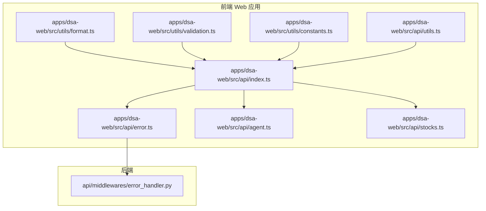
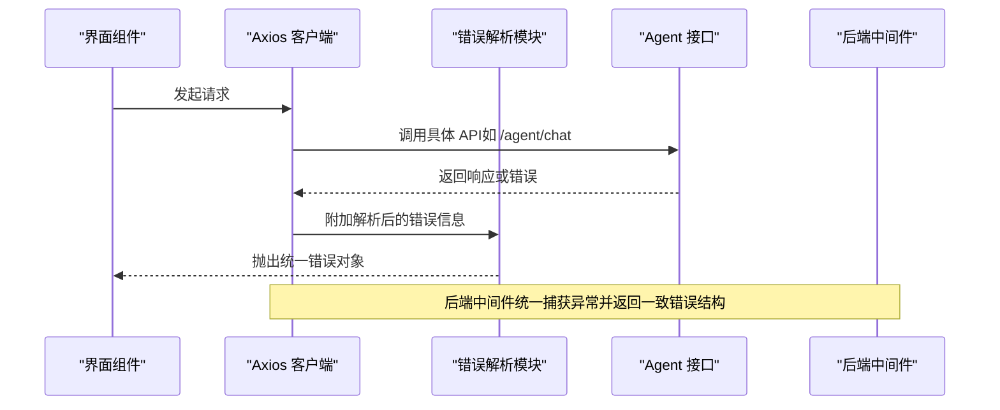
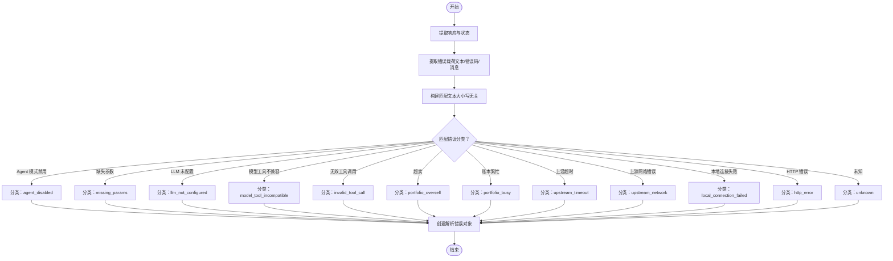
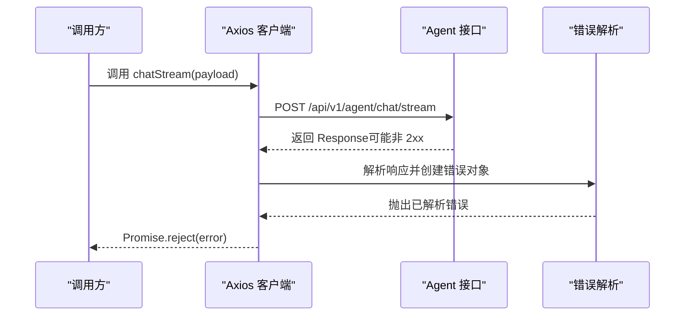
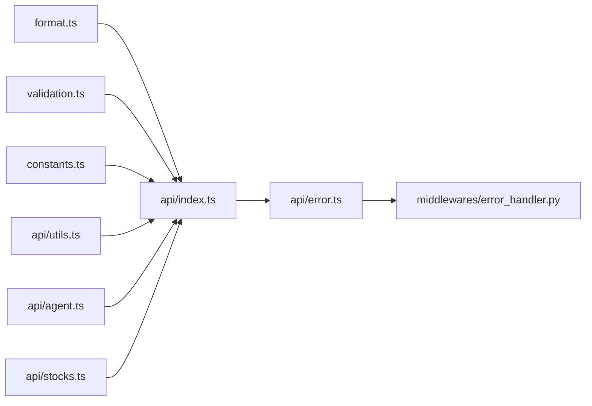

# 通用工具函数

<cite>
**本文引用的文件**
- [apps/dsa-web/src/api/utils.ts](file://apps/dsa-web/src/api/utils.ts)
- [apps/dsa-web/src/utils/format.ts](file://apps/dsa-web/src/utils/format.ts)
- [apps/dsa-web/src/utils/validation.ts](file://apps/dsa-web/src/utils/validation.ts)
- [apps/dsa-web/src/utils/constants.ts](file://apps/dsa-web/src/utils/constants.ts)
- [apps/dsa-web/src/api/index.ts](file://apps/dsa-web/src/api/index.ts)
- [apps/dsa-web/src/api/error.ts](file://apps/dsa-web/src/api/error.ts)
- [apps/dsa-web/src/api/agent.ts](file://apps/dsa-web/src/api/agent.ts)
- [apps/dsa-web/src/api/stocks.ts](file://apps/dsa-web/src/api/stocks.ts)
- [api/middlewares/error_handler.py](file://api/middlewares/error_handler.py)
</cite>

## 目录
1. [简介](#简介)
2. [项目结构](#项目结构)
3. [核心组件](#核心组件)
4. [架构总览](#架构总览)
5. [详细组件分析](#详细组件分析)
6. [依赖分析](#依赖分析)
7. [性能考虑](#性能考虑)
8. [故障排查指南](#故障排查指南)
9. [结论](#结论)
10. [附录](#附录)

## 简介
本文件聚焦于前端 Web 应用中的“通用工具函数”，涵盖以下主题：
- 错误处理工具：统一解析与分类 API 错误、生成可读错误消息、标记错误类别
- 数据格式化函数：日期时间格式化、输入值标准化、时区一致性保障
- 类型转换工具：键名风格转换（snake_case → camelCase）
- 参数校验工具：股票代码格式校验与归一化
- API 响应处理：Axios 客户端配置、拦截器、401 自动跳转、错误透传
- 状态码映射与错误消息解析：基于响应体与状态码的智能识别
- URL 构建与基础地址：环境变量驱动的基础地址
- 缓存、本地存储与会话管理：概念性说明与最佳实践
- 网络状态检测、离线处理与重连机制：概念性说明与最佳实践
- 使用示例、最佳实践与性能优化建议
- 扩展点、自定义配置与测试方法

## 项目结构
该工具函数体系主要分布在前端应用的 utils 与 api 目录中，并辅以后端的全局异常处理中间件。整体组织方式为“按功能域分层”：工具函数位于 utils，API 客户端与错误解析位于 api。

图表来源
- [apps/dsa-web/src/api/index.ts:1-30](file://apps/dsa-web/src/api/index.ts#L1-L30)
- [apps/dsa-web/src/api/error.ts:1-487](file://apps/dsa-web/src/api/error.ts#L1-L487)
- [apps/dsa-web/src/api/agent.ts:1-139](file://apps/dsa-web/src/api/agent.ts#L1-L139)
- [apps/dsa-web/src/api/stocks.ts:1-55](file://apps/dsa-web/src/api/stocks.ts#L1-L55)
- [apps/dsa-web/src/utils/format.ts:1-59](file://apps/dsa-web/src/utils/format.ts#L1-L59)
- [apps/dsa-web/src/utils/validation.ts:1-32](file://apps/dsa-web/src/utils/validation.ts#L1-L32)
- [apps/dsa-web/src/utils/constants.ts:1-6](file://apps/dsa-web/src/utils/constants.ts#L1-L6)
- [api/middlewares/error_handler.py:1-129](file://api/middlewares/error_handler.py#L1-L129)

章节来源
- [apps/dsa-web/src/api/index.ts:1-30](file://apps/dsa-web/src/api/index.ts#L1-L30)
- [apps/dsa-web/src/api/error.ts:1-487](file://apps/dsa-web/src/api/error.ts#L1-L487)
- [apps/dsa-web/src/api/agent.ts:1-139](file://apps/dsa-web/src/api/agent.ts#L1-L139)
- [apps/dsa-web/src/api/stocks.ts:1-55](file://apps/dsa-web/src/api/stocks.ts#L1-L55)
- [apps/dsa-web/src/utils/format.ts:1-59](file://apps/dsa-web/src/utils/format.ts#L1-L59)
- [apps/dsa-web/src/utils/validation.ts:1-32](file://apps/dsa-web/src/utils/validation.ts#L1-L32)
- [apps/dsa-web/src/utils/constants.ts:1-6](file://apps/dsa-web/src/utils/constants.ts#L1-L6)
- [api/middlewares/error_handler.py:1-129](file://api/middlewares/error_handler.py#L1-L129)

## 核心组件
- Axios 客户端与拦截器：统一配置基础地址、超时、凭据、JSON 头；对 401 进行自动重定向；对所有响应错误附加解析后的错误信息
- 错误解析与分类：从响应体、状态码、错误消息等多维度提取并分类，输出统一的可读错误消息
- 数据格式化：日期时间格式化、日期输入值生成、上海时区一致性保障、报告类型映射
- 键名转换：将 snake_case 键递归转换为 camelCase
- 参数校验：股票代码格式校验与归一化
- API 接口封装：Agent 对话、策略查询、会话与消息管理、图片/文本导入解析
- 后端异常处理：FastAPI 中间件统一捕获异常并返回一致的错误结构

章节来源
- [apps/dsa-web/src/api/index.ts:1-30](file://apps/dsa-web/src/api/index.ts#L1-L30)
- [apps/dsa-web/src/api/error.ts:1-487](file://apps/dsa-web/src/api/error.ts#L1-L487)
- [apps/dsa-web/src/utils/format.ts:1-59](file://apps/dsa-web/src/utils/format.ts#L1-L59)
- [apps/dsa-web/src/api/utils.ts:1-14](file://apps/dsa-web/src/api/utils.ts#L1-L14)
- [apps/dsa-web/src/utils/validation.ts:1-32](file://apps/dsa-web/src/utils/validation.ts#L1-L32)
- [apps/dsa-web/src/api/agent.ts:1-139](file://apps/dsa-web/src/api/agent.ts#L1-L139)
- [apps/dsa-web/src/api/stocks.ts:1-55](file://apps/dsa-web/src/api/stocks.ts#L1-L55)
- [api/middlewares/error_handler.py:1-129](file://api/middlewares/error_handler.py#L1-L129)

## 架构总览
下图展示从前端工具函数到 API 客户端、错误解析再到后端中间件的整体流程。

图表来源
- [apps/dsa-web/src/api/index.ts:1-30](file://apps/dsa-web/src/api/index.ts#L1-L30)
- [apps/dsa-web/src/api/error.ts:1-487](file://apps/dsa-web/src/api/error.ts#L1-L487)
- [apps/dsa-web/src/api/agent.ts:1-139](file://apps/dsa-web/src/api/agent.ts#L1-L139)
- [api/middlewares/error_handler.py:1-129](file://api/middlewares/error_handler.py#L1-L129)

## 详细组件分析

### 错误处理工具
- 统一错误载体与解析
  - 定义错误分类枚举与解析结果结构，支持标题、消息、原始消息、状态码与分类
  - 提供解析函数，从响应体、状态码、错误消息、原因链等多源提取并分类
  - 支持将任意错误附加到 ErrorCarrier，形成可读的错误消息
- 分类规则
  - 基于关键词匹配与错误码识别，覆盖 Agent 模式禁用、缺失参数、LLM 未配置、模型工具不兼容、无效工具调用、超卖、账本繁忙、上游超时、网络错误、本地连接失败、HTTP 错误、未知错误等
- 使用要点
  - 在拦截器中统一附加解析后的错误，便于上层 UI 展示
  - 可通过 isApiRequestError 判断是否为已解析的 API 请求错误
  - 通过 toApiErrorMessage 获取可读错误字符串

图表来源
- [apps/dsa-web/src/api/error.ts:292-476](file://apps/dsa-web/src/api/error.ts#L292-L476)

章节来源
- [apps/dsa-web/src/api/error.ts:1-487](file://apps/dsa-web/src/api/error.ts#L1-L487)

### API 响应处理与状态码映射
- Axios 客户端
  - 配置基础地址、超时、凭据、JSON 头
  - 响应拦截器：401 自动跳转至登录页（保留当前路径），并对所有错误附加解析后的错误信息
- 状态码映射与错误消息解析
  - 优先从响应体提取详细信息；若无，则回退到状态码与状态文本
  - 对上游 LLM 400、502/503、超时、网络错误、本地连接失败等进行专门识别
- 最佳实践
  - 在业务层捕获 isApiRequestError 并根据 category 决策 UI 行为
  - 使用 toApiErrorMessage 输出统一提示

章节来源
- [apps/dsa-web/src/api/index.ts:1-30](file://apps/dsa-web/src/api/index.ts#L1-L30)
- [apps/dsa-web/src/api/error.ts:484-487](file://apps/dsa-web/src/api/error.ts#L484-L487)

### 数据格式化函数
- 日期时间格式化
  - formatDateTime：将字符串解析为本地化日期时间（年-月-日 时:分）
  - formatDate：将字符串解析为本地化日期（年-月-日）
  - 当输入为空或无效时，返回占位符或原值
- 输入值与时区
  - toDateInputValue：生成 YYYY-MM-DD 的输入值
  - getRecentStartDate / getTodayInShanghai：以 Asia/Shanghai 时区生成日期范围，确保前后端时区一致
- 报告类型映射
  - formatReportType：将英文类型映射为中文显示

章节来源
- [apps/dsa-web/src/utils/format.ts:1-59](file://apps/dsa-web/src/utils/format.ts#L1-L59)

### 类型转换工具（键名风格转换）
- toCamelCase：将 snake_case 键递归转换为 camelCase，支持空值与 undefined 直接返回
- 适用场景：后端返回 snake_case 字段，前端需要 camelCase 结构时

章节来源
- [apps/dsa-web/src/api/utils.ts:1-14](file://apps/dsa-web/src/api/utils.ts#L1-L14)

### 参数校验工具
- validateStockCode：对股票代码进行基础校验与归一化
  - 归一化：去除空白并转为大写
  - 校验：支持 A 股 6 位/带交易所前缀、港股 5 位/带 HK 前缀/.HK 后缀、美股 Ticker 等
  - 返回值包含 valid、message、normalized，便于 UI 提示与后续处理

章节来源
- [apps/dsa-web/src/utils/validation.ts:1-32](file://apps/dsa-web/src/utils/validation.ts#L1-L32)

### URL 构建与基础地址
- API_BASE_URL：从环境变量 VITE_API_URL 获取基础地址，未配置时默认空字符串（同源）
- 用途：Axios 客户端与部分 fetch 请求使用该基础地址拼接最终 URL

章节来源
- [apps/dsa-web/src/utils/constants.ts:1-6](file://apps/dsa-web/src/utils/constants.ts#L1-L6)
- [apps/dsa-web/src/api/index.ts:1-30](file://apps/dsa-web/src/api/index.ts#L1-L30)
- [apps/dsa-web/src/api/agent.ts:89-90](file://apps/dsa-web/src/api/agent.ts#L89-L90)

### API 接口封装示例
- Agent 对话
  - chat：发送消息并等待结果
  - chatStream：流式对话，处理非 2xx 响应并抛出已解析错误
  - getStrategies / getChatSessions / getChatSessionMessages / deleteChatSession：策略与会话相关操作
- 股票导入
  - extractFromImage：上传图片识别股票代码
  - parseImport：支持文件或文本两种输入

图表来源
- [apps/dsa-web/src/api/agent.ts:85-137](file://apps/dsa-web/src/api/agent.ts#L85-L137)
- [apps/dsa-web/src/api/index.ts:14-27](file://apps/dsa-web/src/api/index.ts#L14-L27)
- [apps/dsa-web/src/api/error.ts:292-476](file://apps/dsa-web/src/api/error.ts#L292-L476)

章节来源
- [apps/dsa-web/src/api/agent.ts:1-139](file://apps/dsa-web/src/api/agent.ts#L1-L139)
- [apps/dsa-web/src/api/stocks.ts:1-55](file://apps/dsa-web/src/api/stocks.ts#L1-L55)

### 后端异常处理（中间件）
- 全局捕获未处理异常，记录日志并返回统一错误结构
- 处理 HTTPException 与 RequestValidationError，分别包装为统一错误格式
- 通用异常处理器统一返回 500 与一致的错误字段

章节来源
- [api/middlewares/error_handler.py:1-129](file://api/middlewares/error_handler.py#L1-L129)

## 依赖分析
- 前端工具函数之间低耦合，通过导出独立函数被 API 层复用
- Axios 客户端集中配置与拦截器，统一错误处理
- 错误解析模块作为“横切关注点”，被所有 API 调用共享
- 后端中间件与前端错误解析相互配合，保证前后端错误语义一致

图表来源
- [apps/dsa-web/src/api/index.ts:1-30](file://apps/dsa-web/src/api/index.ts#L1-L30)
- [apps/dsa-web/src/api/error.ts:1-487](file://apps/dsa-web/src/api/error.ts#L1-L487)
- [apps/dsa-web/src/api/agent.ts:1-139](file://apps/dsa-web/src/api/agent.ts#L1-L139)
- [apps/dsa-web/src/api/stocks.ts:1-55](file://apps/dsa-web/src/api/stocks.ts#L1-L55)
- [apps/dsa-web/src/utils/format.ts:1-59](file://apps/dsa-web/src/utils/format.ts#L1-L59)
- [apps/dsa-web/src/utils/validation.ts:1-32](file://apps/dsa-web/src/utils/validation.ts#L1-L32)
- [apps/dsa-web/src/utils/constants.ts:1-6](file://apps/dsa-web/src/utils/constants.ts#L1-L6)
- [api/middlewares/error_handler.py:1-129](file://api/middlewares/error_handler.py#L1-L129)

## 性能考虑
- 请求超时与重试
  - Axios 客户端设置合理超时；对长耗时任务（如流式对话）可在调用侧设置更长超时
  - 对于易失败的上游接口，可在业务层实现指数退避重试
- 错误解析成本
  - 错误解析涉及字符串匹配与 JSON 解析，建议在高频错误场景下缓存解析结果或减少重复解析
- 数据格式化
  - 日期格式化使用本地化 API，注意在大量渲染场景下避免重复创建格式化器
- 键名转换
  - 深度转换在大对象上会有额外开销，建议仅在必要时执行

## 故障排查指南
- 常见问题定位
  - 401 未认证：检查凭据与登录态；确认拦截器是否正确触发重定向
  - 参数校验失败：使用 validateStockCode 获取归一化结果与错误提示
  - 上游超时/网络错误：查看错误分类 upstream_timeout / upstream_network
  - 本地连接失败：检查本地服务是否启动、监听地址与端口
- 日志与调试
  - 前端：利用 attachParsedApiError 附加解析错误，结合 isApiRequestError 判断
  - 后端：全局中间件记录异常堆栈与请求上下文，便于定位

章节来源
- [apps/dsa-web/src/api/index.ts:14-27](file://apps/dsa-web/src/api/index.ts#L14-L27)
- [apps/dsa-web/src/api/error.ts:288-487](file://apps/dsa-web/src/api/error.ts#L288-L487)
- [api/middlewares/error_handler.py:50-67](file://api/middlewares/error_handler.py#L50-L67)

## 结论
该工具函数体系以“统一错误解析 + 通用格式化 + 参数校验 + API 封装”为核心，配合 Axios 客户端与后端中间件，实现了前后端一致的错误语义与良好的用户体验。通过分类化的错误消息与可读提示，开发者可以快速定位问题并采取针对性措施。

## 附录

### 使用示例与最佳实践
- 错误处理
  - 在业务层捕获错误并判断 isApiRequestError，依据 category 决策 UI 行为（如引导用户登录、提示补齐参数、建议更换模型等）
  - 使用 toApiErrorMessage 输出统一提示，避免直接展示原始错误
- 数据格式化
  - 使用 formatDateTime/formatDate 统一日期展示；使用 toDateInputValue 生成表单默认值
  - 使用 getRecentStartDate / getTodayInShanghai 生成日期范围，确保与后端时区一致
- 键名转换
  - 在接收后端响应后，使用 toCamelCase 将 snake_case 字段转换为 camelCase，便于前端消费
- 参数校验
  - 在提交前调用 validateStockCode，获得归一化结果与错误提示，提升交互体验
- API 调用
  - 优先使用封装好的 API 模块（如 agentApi、stocksApi），遵循统一的错误处理与超时策略

### 扩展点与自定义配置
- 错误分类扩展
  - 在 parseApiError 中新增分类分支，结合关键词与错误码识别新场景
- 错误消息定制
  - 通过 createParsedApiError 自定义标题与消息，满足不同业务场景
- 基础地址配置
  - 通过 VITE_API_URL 自定义基础地址，支持跨域或反向代理部署
- Axios 客户端扩展
  - 可在现有拦截器基础上增加请求头注入、请求签名、速率限制等

### 测试方法
- 单元测试
  - 对 format.ts 的日期函数进行边界值测试（空值、无效日期、时区差异）
  - 对 validation.ts 的 validateStockCode 进行多组输入测试（A/H/美股、带前缀/后缀、大小写混合）
  - 对 error.ts 的 parseApiError 进行分类覆盖测试（关键词匹配、错误码、状态码）
- 集成测试
  - 使用 mock 服务器模拟不同状态码与响应体，验证错误分类与 UI 提示
  - 验证 Axios 拦截器在 401 场景下的重定向逻辑