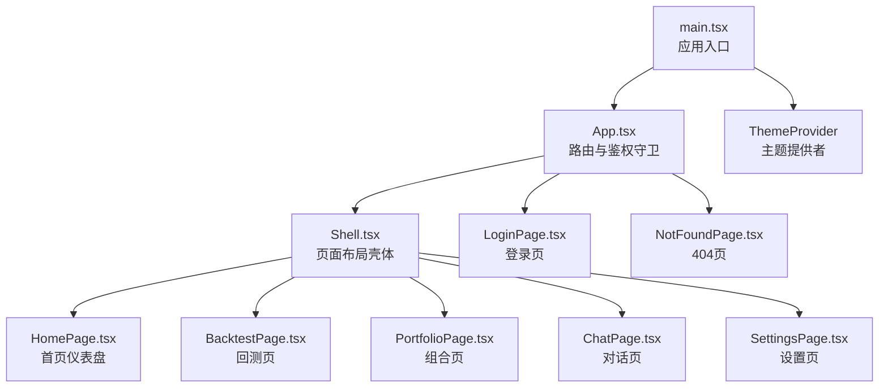
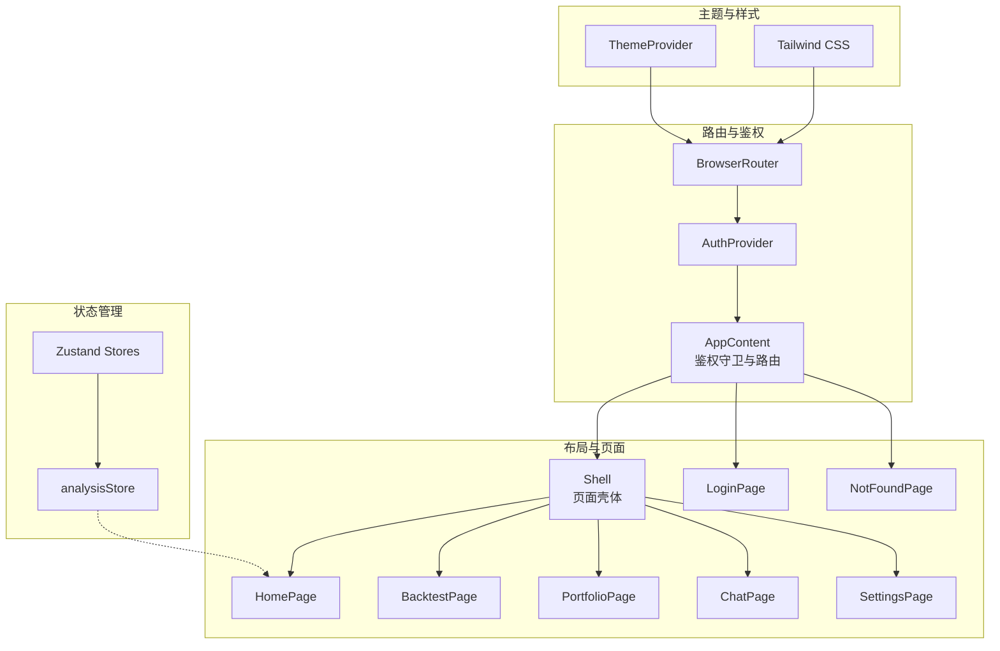
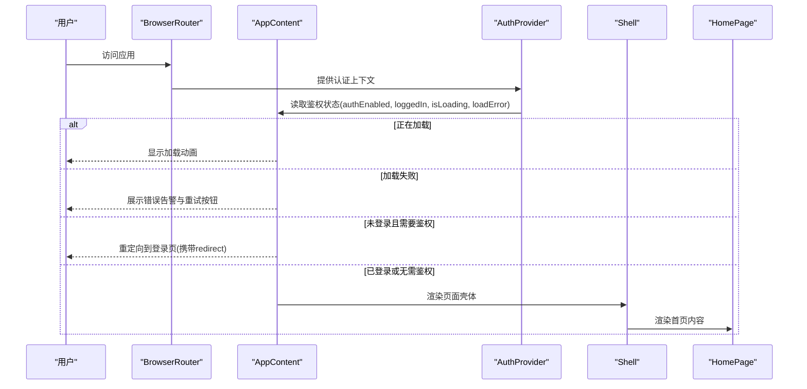
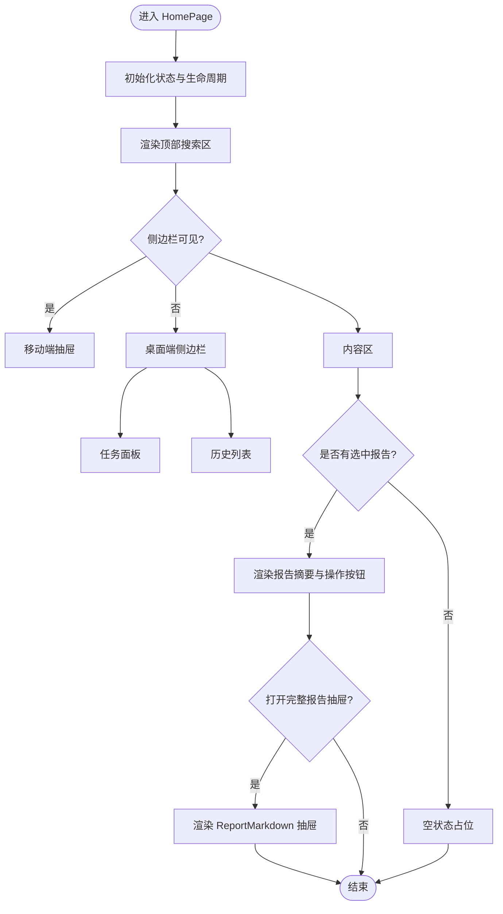
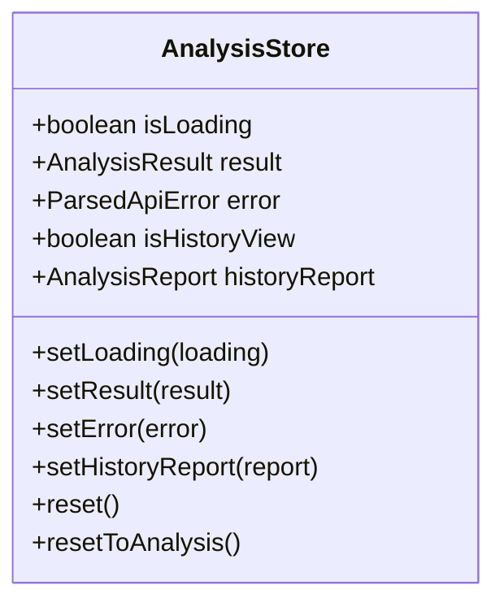
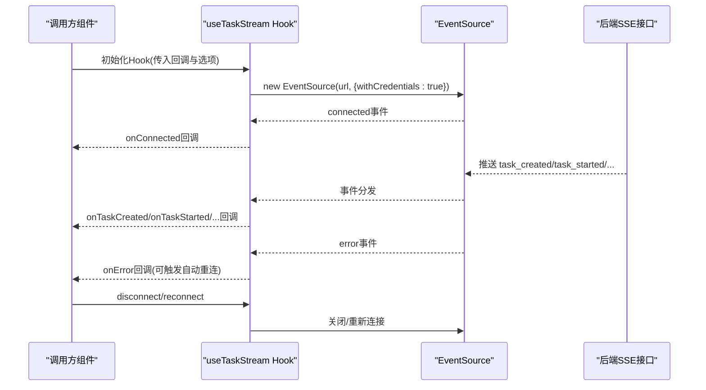
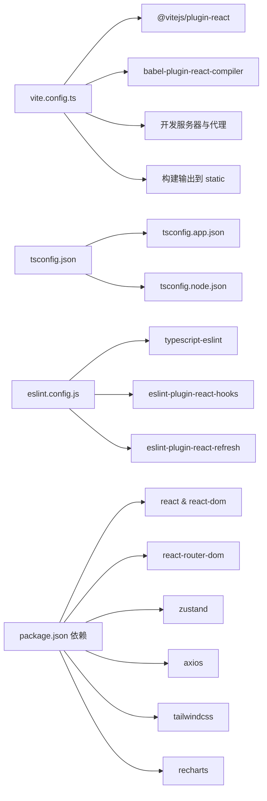

# React架构设计

<cite>
**本文档引用的文件**
- [apps/dsa-web/src/App.tsx](file://apps/dsa-web/src/App.tsx)
- [apps/dsa-web/src/main.tsx](file://apps/dsa-web/src/main.tsx)
- [apps/dsa-web/vite.config.ts](file://apps/dsa-web/vite.config.ts)
- [apps/dsa-web/tsconfig.json](file://apps/dsa-web/tsconfig.json)
- [apps/dsa-web/tsconfig.app.json](file://apps/dsa-web/tsconfig.app.json)
- [apps/dsa-web/package.json](file://apps/dsa-web/package.json)
- [apps/dsa-web/tailwind.config.js](file://apps/dsa-web/tailwind.config.js)
- [apps/dsa-web/postcss.config.js](file://apps/dsa-web/postcss.config.js)
- [apps/dsa-web/eslint.config.js](file://apps/dsa-web/eslint.config.js)
- [apps/dsa-web/src/components/common/index.ts](file://apps/dsa-web/src/components/common/index.ts)
- [apps/dsa-web/src/stores/index.ts](file://apps/dsa-web/src/stores/index.ts)
- [apps/dsa-web/src/stores/analysisStore.ts](file://apps/dsa-web/src/stores/analysisStore.ts)
- [apps/dsa-web/src/hooks/useTaskStream.ts](file://apps/dsa-web/src/hooks/useTaskStream.ts)
- [apps/dsa-web/src/pages/HomePage.tsx](file://apps/dsa-web/src/pages/HomePage.tsx)
</cite>

## 目录
1. [引言](#引言)
2. [项目结构](#项目结构)
3. [核心组件](#核心组件)
4. [架构总览](#架构总览)
5. [详细组件分析](#详细组件分析)
6. [依赖关系分析](#依赖关系分析)
7. [性能考量](#性能考量)
8. [故障排查指南](#故障排查指南)
9. [结论](#结论)
10. [附录](#附录)

## 引言
本文件面向React + TypeScript Web管理界面，系统化梳理应用的整体架构模式、路由与导航体系、组件层次结构、状态管理与数据流、构建与开发环境配置，以及性能优化策略。文档以实际源码为依据，结合可视化图表帮助读者快速理解系统的组织方式与运行机制。

## 项目结构
应用位于apps/dsa-web目录，采用前端工程化的标准分层组织：
- 源码入口与主题包装：main.tsx负责挂载应用并包裹主题提供者
- 应用根组件：App.tsx集中定义路由、鉴权守卫与页面布局壳体
- 页面与组件：pages目录存放页面组件；components目录按功能域拆分通用组件与布局组件
- 状态管理：stores目录使用Zustand实现轻量状态容器
- 工具与钩子：hooks目录封装SSE任务流等横切能力
- 构建与配置：vite.config.ts、tsconfig.*、tailwind.config.js、postcss.config.js、eslint.config.js等

**图表来源**
- [apps/dsa-web/src/main.tsx:1-14](file://apps/dsa-web/src/main.tsx#L1-L14)
- [apps/dsa-web/src/App.tsx:16-87](file://apps/dsa-web/src/App.tsx#L16-L87)

**章节来源**
- [apps/dsa-web/src/main.tsx:1-14](file://apps/dsa-web/src/main.tsx#L1-L14)
- [apps/dsa-web/src/App.tsx:16-87](file://apps/dsa-web/src/App.tsx#L16-L87)

## 核心组件
- 应用入口与主题包装：在main.tsx中通过StrictMode包裹应用，并注入ThemeProvider，确保主题系统在整个应用范围内生效。
- 应用根组件：App.tsx作为路由与鉴权守卫的核心，负责根据鉴权状态与路由路径动态渲染页面。
- 页面布局壳体：Shell组件作为所有受保护页面的外层容器，统一承载侧边栏、头部与内容区域。
- 页面组件：HomePage、BacktestPage、PortfolioPage、ChatPage、SettingsPage等页面组件按功能划分。
- 通用组件与布局：Button、Card、Input、ApiErrorAlert、Pagination等在components/common中统一导出，便于复用。
- 状态管理：analysisStore等Zustand存储容器管理分析结果、历史报告与视图状态。

**章节来源**
- [apps/dsa-web/src/main.tsx:1-14](file://apps/dsa-web/src/main.tsx#L1-L14)
- [apps/dsa-web/src/App.tsx:16-87](file://apps/dsa-web/src/App.tsx#L16-L87)
- [apps/dsa-web/src/components/common/index.ts:1-32](file://apps/dsa-web/src/components/common/index.ts#L1-L32)
- [apps/dsa-web/src/stores/analysisStore.ts:1-69](file://apps/dsa-web/src/stores/analysisStore.ts#L1-L69)

## 架构总览
应用采用“路由驱动 + 鉴权守卫 + 布局壳体”的架构模式：
- 路由层：BrowserRouter包裹，使用react-router-dom v7的Routes与Route组织页面映射。
- 鉴权层：AuthProvider提供认证上下文，AppContent根据authEnabled、loggedIn、isLoading、loadError等状态控制登录与重定向。
- 布局层：Shell作为受保护路由的外层容器，统一承载侧边栏与内容区。
- 页面层：各页面组件负责具体业务逻辑与UI展示。
- 状态层：Zustand轻量状态容器管理分析与历史视图状态，减少全局状态复杂度。
- 主题层：ThemeProvider与Tailwind CSS提供暗/亮主题切换与样式体系。

**图表来源**
- [apps/dsa-web/src/App.tsx:16-87](file://apps/dsa-web/src/App.tsx#L16-L87)
- [apps/dsa-web/src/main.tsx:1-14](file://apps/dsa-web/src/main.tsx#L1-L14)
- [apps/dsa-web/src/stores/analysisStore.ts:1-69](file://apps/dsa-web/src/stores/analysisStore.ts#L1-L69)
- [apps/dsa-web/tailwind.config.js:1-171](file://apps/dsa-web/tailwind.config.js#L1-L171)

## 详细组件分析

### 路由与鉴权守卫（App.tsx）
- 鉴权守卫逻辑：
  - 加载态：显示骨架动画，避免白屏与闪烁。
  - 加载失败：展示ApiErrorAlert并提供刷新按钮。
  - 鉴权开启且未登录：非登录页则重定向至登录页并携带redirect参数。
  - 登录页特殊处理：若已登录则重定向至首页。
- 路由配置：
  - 受保护路由：以Shell为父路由，包含首页、聊天、组合、回测、设置等。
  - 公共路由：独立的登录页与404页。
- 路由联动：通过useLocation监听当前路径，同步至agentChatStore的当前路由状态，便于聊天模块感知页面上下文。

**图表来源**
- [apps/dsa-web/src/App.tsx:16-87](file://apps/dsa-web/src/App.tsx#L16-L87)

**章节来源**
- [apps/dsa-web/src/App.tsx:16-87](file://apps/dsa-web/src/App.tsx#L16-L87)

### 页面布局与导航（Shell与HomePage）
- Shell作为受保护路由的外层容器，统一承载侧边栏与内容区。
- HomePage实现仪表盘式布局：
  - 顶部搜索区：支持输入查询、提交分析、错误提示与加载态。
  - 侧边栏：移动端抽屉与桌面端固定面板，展示任务面板与历史列表。
  - 报告区：根据选中历史项渲染报告摘要与操作按钮（AI追问、查看完整报告）。
  - 对话抽屉：通过ReportMarkdown组件展示完整报告内容。
  - 删除确认：批量删除历史记录的确认对话框。

**图表来源**
- [apps/dsa-web/src/pages/HomePage.tsx:12-280](file://apps/dsa-web/src/pages/HomePage.tsx#L12-L280)

**章节来源**
- [apps/dsa-web/src/pages/HomePage.tsx:12-280](file://apps/dsa-web/src/pages/HomePage.tsx#L12-L280)

### 状态管理（Zustand）
- analysisStore：
  - 状态字段：isLoading、result、error、isHistoryView、historyReport。
  - 行为方法：设置加载态、设置结果、设置错误、设置历史报告、重置状态等。
  - 视图切换：在分析结果与历史报告之间切换，同时清理无关状态，保证UI一致性。

**图表来源**
- [apps/dsa-web/src/stores/analysisStore.ts:1-69](file://apps/dsa-web/src/stores/analysisStore.ts#L1-L69)

**章节来源**
- [apps/dsa-web/src/stores/analysisStore.ts:1-69](file://apps/dsa-web/src/stores/analysisStore.ts#L1-L69)

### 实时任务流（SSE Hook）
- useTaskStream：
  - 支持连接建立、事件监听（connected、task_created、task_started、task_completed、task_failed、heartbeat）、错误处理与自动重连。
  - 使用EventSource与withCredentials确保会话保持。
  - 通过ref存储回调，避免频繁重连；提供手动重连与断开接口。
  - 生命周期内自动管理EventSource的创建、关闭与超时清理。

**图表来源**
- [apps/dsa-web/src/hooks/useTaskStream.ts:78-255](file://apps/dsa-web/src/hooks/useTaskStream.ts#L78-L255)

**章节来源**
- [apps/dsa-web/src/hooks/useTaskStream.ts:78-255](file://apps/dsa-web/src/hooks/useTaskStream.ts#L78-L255)

### 主题与样式体系
- Tailwind CSS：通过tailwind.config.js定义深色模式、颜色系统、阴影、圆角、动画与渐变等设计令牌，形成统一视觉语言。
- PostCSS：集成@tailwindcss/postcss与autoprefixer，确保CSS预处理与浏览器兼容。
- 主题提供者：ThemeProvider在应用入口注入，配合Tailwind类名实现明暗主题切换。

**章节来源**
- [apps/dsa-web/tailwind.config.js:1-171](file://apps/dsa-web/tailwind.config.js#L1-L171)
- [apps/dsa-web/postcss.config.js:1-7](file://apps/dsa-web/postcss.config.js#L1-L7)
- [apps/dsa-web/src/main.tsx:1-14](file://apps/dsa-web/src/main.tsx#L1-L14)

## 依赖关系分析
- 构建与打包：Vite作为构建工具，Babel插件react-compiler用于编译优化；开发服务器代理/api到后端服务；构建输出到项目根目录的static目录。
- 类型与严格性：tsconfig.json通过references聚合tsconfig.app.json与tsconfig.node.json；tsconfig.app.json启用严格模式与bundler解析，确保类型安全与模块解析正确。
- 代码质量：ESLint配置基于typescript-eslint与react-hooks规则集，结合react-refresh与vite插件，提升开发体验与代码规范性。
- 依赖生态：React 19、React Router DOM v7、Zustand、Axios、Tailwind CSS、Recharts、Lucide等库构成技术栈。

**图表来源**
- [apps/dsa-web/vite.config.ts:1-30](file://apps/dsa-web/vite.config.ts#L1-L30)
- [apps/dsa-web/tsconfig.json:1-8](file://apps/dsa-web/tsconfig.json#L1-L8)
- [apps/dsa-web/tsconfig.app.json:1-29](file://apps/dsa-web/tsconfig.app.json#L1-L29)
- [apps/dsa-web/eslint.config.js:1-24](file://apps/dsa-web/eslint.config.js#L1-L24)
- [apps/dsa-web/package.json:1-56](file://apps/dsa-web/package.json#L1-L56)

**章节来源**
- [apps/dsa-web/vite.config.ts:1-30](file://apps/dsa-web/vite.config.ts#L1-L30)
- [apps/dsa-web/tsconfig.json:1-8](file://apps/dsa-web/tsconfig.json#L1-L8)
- [apps/dsa-web/tsconfig.app.json:1-29](file://apps/dsa-web/tsconfig.app.json#L1-L29)
- [apps/dsa-web/eslint.config.js:1-24](file://apps/dsa-web/eslint.config.js#L1-L24)
- [apps/dsa-web/package.json:1-56](file://apps/dsa-web/package.json#L1-L56)

## 性能考量
- 代码分割与懒加载：建议对大型页面组件（如BacktestPage、ChatPage）采用React.lazy与Suspense进行按需加载，减少首屏体积。
- 图表与富文本：Recharts与react-markdown在大数据场景下可能带来渲染压力，建议结合虚拟滚动与分页加载优化。
- 状态粒度：Zustand单仓库管理多业务域状态时，建议按页面或功能域进一步拆分store，降低订阅范围与更新成本。
- 编译优化：保留babel-plugin-react-compiler以获得更优的编译产物；在生产构建中启用压缩与Tree Shaking。
- 样式体积：Tailwind按需扫描content路径，确保未使用的类名被移除；避免在组件内动态拼接大量类名字符串。

[本节为通用性能指导，不直接分析特定文件，故无“章节来源”]

## 故障排查指南
- 路由与鉴权问题：
  - 若出现循环重定向，检查登录页与受保护路由的条件分支与redirect参数传递。
  - 鉴权加载失败时，确认后端健康状态与代理配置是否正确。
- SSE任务流异常：
  - 检查EventSource连接URL与withCredentials设置；关注onerror回调与自动重连逻辑。
  - 确认后端SSE事件命名与数据格式一致（snake_case转camelCase）。
- 构建与开发问题：
  - 开发服务器无法代理/api：核对vite.server.proxy配置与后端监听地址。
  - 构建产物未生成：确认脚本顺序（先tsc -b再vite build），并检查outDir路径。
- 样式与主题问题：
  - Tailwind类名不生效：检查content扫描路径与postcss插件顺序。
  - 主题切换无效：确认ThemeProvider包裹范围与Tailwind暗色模式配置。

**章节来源**
- [apps/dsa-web/src/App.tsx:16-87](file://apps/dsa-web/src/App.tsx#L16-L87)
- [apps/dsa-web/src/hooks/useTaskStream.ts:78-255](file://apps/dsa-web/src/hooks/useTaskStream.ts#L78-L255)
- [apps/dsa-web/vite.config.ts:14-28](file://apps/dsa-web/vite.config.ts#L14-L28)
- [apps/dsa-web/tailwind.config.js:1-171](file://apps/dsa-web/tailwind.config.js#L1-L171)

## 结论
该React + TypeScript Web管理界面以清晰的路由与鉴权守卫为核心，结合Zustand轻量状态管理与Tailwind CSS主题体系，实现了高可维护性的前端架构。通过SSE任务流实现异步任务的实时反馈，配合合理的构建与开发配置，满足了日常分析与回测场景的交互需求。未来可在代码分割、状态域拆分与性能监控方面持续优化，以提升用户体验与可扩展性。

[本节为总结性内容，不直接分析特定文件，故无“章节来源”]

## 附录
- 开发工具链与命令：
  - dev：启动Vite开发服务器
  - build：先增量编译TS，再构建静态资源
  - lint：运行ESLint检查
  - test/test:smoke：单元测试与端到端测试
  - preview：本地预览构建产物
- 构建输出：构建产物输出至项目根目录的static文件夹，便于与后端统一部署。

**章节来源**
- [apps/dsa-web/package.json:6-12](file://apps/dsa-web/package.json#L6-L12)
- [apps/dsa-web/vite.config.ts:24-28](file://apps/dsa-web/vite.config.ts#L24-L28)