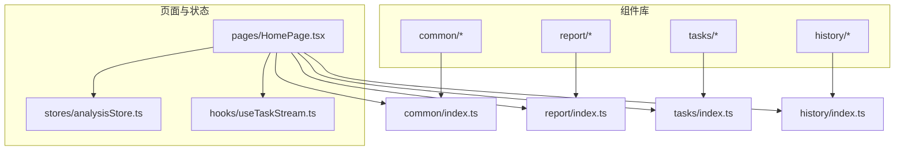
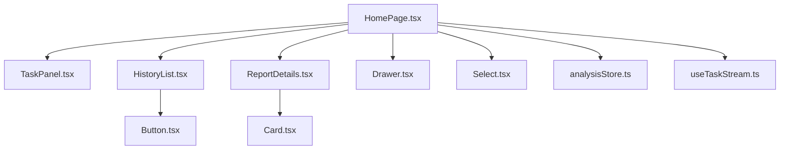
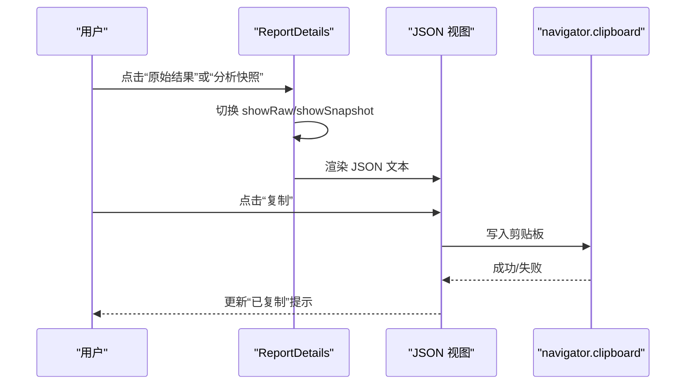
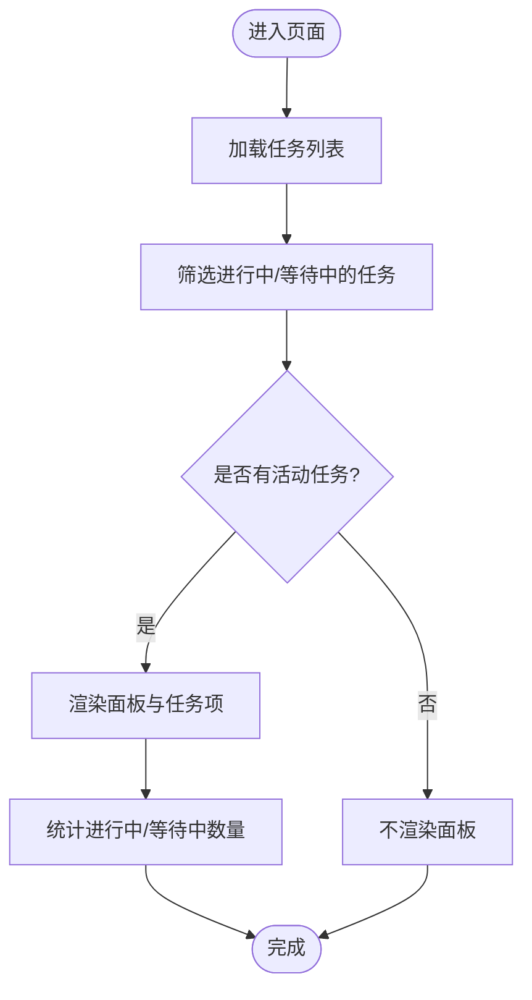
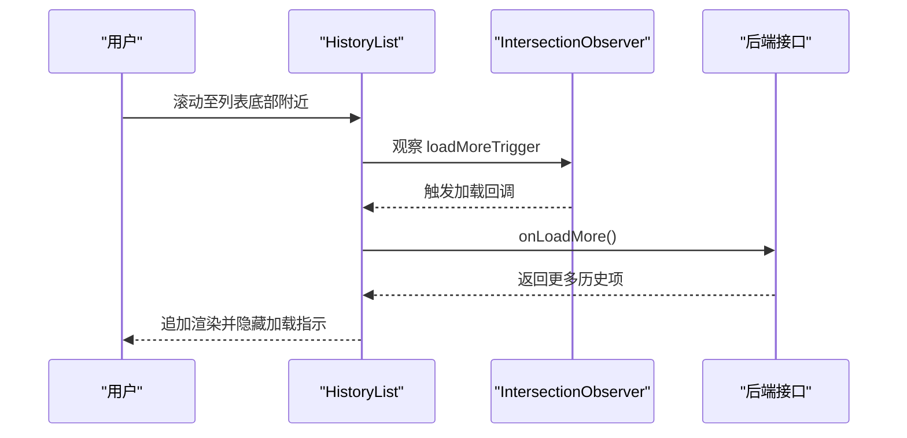
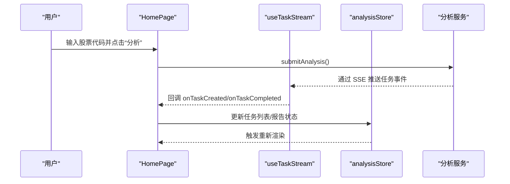
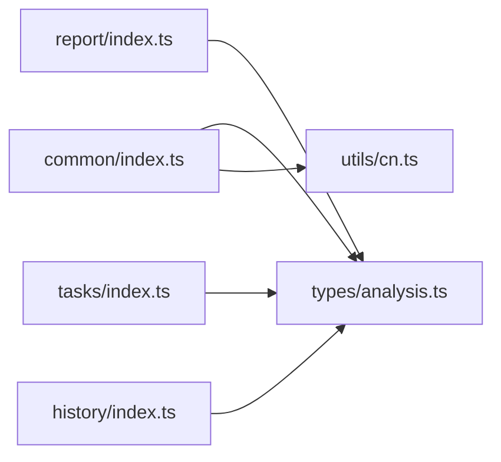

# UI组件库

<cite>
**本文档引用的文件**
- [apps/dsa-web/src/components/common/Button.tsx](file://apps/dsa-web/src/components/common/Button.tsx)
- [apps/dsa-web/src/components/common/Card.tsx](file://apps/dsa-web/src/components/common/Card.tsx)
- [apps/dsa-web/src/components/common/Drawer.tsx](file://apps/dsa-web/src/components/common/Drawer.tsx)
- [apps/dsa-web/src/components/common/Select.tsx](file://apps/dsa-web/src/components/common/Select.tsx)
- [apps/dsa-web/src/components/report/ReportDetails.tsx](file://apps/dsa-web/src/components/report/ReportDetails.tsx)
- [apps/dsa-web/src/components/tasks/TaskPanel.tsx](file://apps/dsa-web/src/components/tasks/TaskPanel.tsx)
- [apps/dsa-web/src/components/history/HistoryList.tsx](file://apps/dsa-web/src/components/history/HistoryList.tsx)
- [apps/dsa-web/src/components/common/index.ts](file://apps/dsa-web/src/components/common/index.ts)
- [apps/dsa-web/src/components/report/index.ts](file://apps/dsa-web/src/components/report/index.ts)
- [apps/dsa-web/src/components/tasks/index.ts](file://apps/dsa-web/src/components/tasks/index.ts)
- [apps/dsa-web/src/components/history/index.ts](file://apps/dsa-web/src/components/history/index.ts)
- [apps/dsa-web/src/utils/cn.ts](file://apps/dsa-web/src/utils/cn.ts)
- [apps/dsa-web/src/types/analysis.ts](file://apps/dsa-web/src/types/analysis.ts)
- [apps/dsa-web/src/hooks/useTaskStream.ts](file://apps/dsa-web/src/hooks/useTaskStream.ts)
- [apps/dsa-web/src/stores/analysisStore.ts](file://apps/dsa-web/src/stores/analysisStore.ts)
- [apps/dsa-web/src/pages/HomePage.tsx](file://apps/dsa-web/src/pages/HomePage.tsx)
</cite>

## 目录
1. [引言](#引言)
2. [项目结构](#项目结构)
3. [核心组件](#核心组件)
4. [架构总览](#架构总览)
5. [详细组件分析](#详细组件分析)
6. [依赖关系分析](#依赖关系分析)
7. [性能考量](#性能考量)
8. [故障排查指南](#故障排查指南)
9. [结论](#结论)
10. [附录](#附录)

## 引言
本文件面向Web管理界面的UI组件库，聚焦通用组件、报告组件、任务组件与历史组件的设计理念与实现方式。内容涵盖组件属性接口、事件处理、样式定制、数据展示与交互流程，并结合实际页面使用场景，给出可复用性设计、主题系统与响应式布局建议、性能优化策略、无障碍支持与浏览器兼容性提示，以及扩展与最佳实践指南。

## 项目结构
组件库位于前端应用目录 apps/dsa-web/src/components 下，按功能域划分为 common（通用）、report（报告）、tasks（任务）、history（历史），并通过统一导出入口集中管理。样式采用 Tailwind CSS 与自定义变量，配合 cn 工具函数合并与去重类名，确保一致的终端风格与主题一致性。

**图表来源**
- [apps/dsa-web/src/components/common/index.ts](file://apps/dsa-web/src/components/common/index.ts)
- [apps/dsa-web/src/components/report/index.ts](file://apps/dsa-web/src/components/report/index.ts)
- [apps/dsa-web/src/components/tasks/index.ts](file://apps/dsa-web/src/components/tasks/index.ts)
- [apps/dsa-web/src/components/history/index.ts](file://apps/dsa-web/src/components/history/index.ts)
- [apps/dsa-web/src/pages/HomePage.tsx](file://apps/dsa-web/src/pages/HomePage.tsx)
- [apps/dsa-web/src/stores/analysisStore.ts](file://apps/dsa-web/src/stores/analysisStore.ts)
- [apps/dsa-web/src/hooks/useTaskStream.ts](file://apps/dsa-web/src/hooks/useTaskStream.ts)

**章节来源**
- [apps/dsa-web/src/components/common/index.ts](file://apps/dsa-web/src/components/common/index.ts)
- [apps/dsa-web/src/components/report/index.ts](file://apps/dsa-web/src/components/report/index.ts)
- [apps/dsa-web/src/components/tasks/index.ts](file://apps/dsa-web/src/components/tasks/index.ts)
- [apps/dsa-web/src/components/history/index.ts](file://apps/dsa-web/src/components/history/index.ts)

## 核心组件
本节对通用组件与关键业务组件进行接口与行为说明，便于快速理解与复用。

- 通用组件
  - Button：多变体、多尺寸、加载态与发光效果，支持无障碍与键盘交互。
  - Card：标题/副标题、多种变体（默认/带边框/渐变）、悬停态与内边距控制。
  - Drawer：侧边抽屉，支持左右位置、Esc 关闭、遮罩与滚动区域。
  - Select：下拉选择，支持占位、禁用、可搜索占位与空文本。
- 报告组件
  - ReportDetails：透明度与追溯区，支持原始结果与上下文快照的 JSON 折叠查看与复制。
- 任务组件
  - TaskPanel：任务面板，展示进行中与等待中的任务，统计数量与状态标签。
- 历史组件
  - HistoryList：历史记录列表，支持批量选择、删除、滚动加载与“已到底部”提示。

**章节来源**
- [apps/dsa-web/src/components/common/Button.tsx](file://apps/dsa-web/src/components/common/Button.tsx)
- [apps/dsa-web/src/components/common/Card.tsx](file://apps/dsa-web/src/components/common/Card.tsx)
- [apps/dsa-web/src/components/common/Drawer.tsx](file://apps/dsa-web/src/components/common/Drawer.tsx)
- [apps/dsa-web/src/components/common/Select.tsx](file://apps/dsa-web/src/components/common/Select.tsx)
- [apps/dsa-web/src/components/report/ReportDetails.tsx](file://apps/dsa-web/src/components/report/ReportDetails.tsx)
- [apps/dsa-web/src/components/tasks/TaskPanel.tsx](file://apps/dsa-web/src/components/tasks/TaskPanel.tsx)
- [apps/dsa-web/src/components/history/HistoryList.tsx](file://apps/dsa-web/src/components/history/HistoryList.tsx)

## 架构总览
组件库与页面、状态管理、Hook 的协作关系如下：

**图表来源**
- [apps/dsa-web/src/pages/HomePage.tsx](file://apps/dsa-web/src/pages/HomePage.tsx)
- [apps/dsa-web/src/components/tasks/TaskPanel.tsx](file://apps/dsa-web/src/components/tasks/TaskPanel.tsx)
- [apps/dsa-web/src/components/history/HistoryList.tsx](file://apps/dsa-web/src/components/history/HistoryList.tsx)
- [apps/dsa-web/src/components/report/ReportDetails.tsx](file://apps/dsa-web/src/components/report/ReportDetails.tsx)
- [apps/dsa-web/src/components/common/Button.tsx](file://apps/dsa-web/src/components/common/Button.tsx)
- [apps/dsa-web/src/components/common/Card.tsx](file://apps/dsa-web/src/components/common/Card.tsx)
- [apps/dsa-web/src/components/common/Drawer.tsx](file://apps/dsa-web/src/components/common/Drawer.tsx)
- [apps/dsa-web/src/components/common/Select.tsx](file://apps/dsa-web/src/components/common/Select.tsx)
- [apps/dsa-web/src/stores/analysisStore.ts](file://apps/dsa-web/src/stores/analysisStore.ts)
- [apps/dsa-web/src/hooks/useTaskStream.ts](file://apps/dsa-web/src/hooks/useTaskStream.ts)

## 详细组件分析

### 通用组件

#### Button（按钮）
- 属性接口
  - variant：主色、次色、描边、幽灵、渐变、危险、柔和危险、设置主/次、首页动作等变体。
  - size：小/中/大/超大。
  - isLoading：加载态开关。
  - loadingText：加载文案。
  - glow：发光效果。
  - 其余继承原生 button 属性（type、disabled、aria-* 等）。
- 事件处理
  - 支持原生点击事件；加载态禁用交互。
  - 无障碍：设置 aria-busy；焦点可见环与禁用态样式。
- 样式定制
  - 基于常量映射的尺寸与变体样式，支持 CSS 变量与 Tailwind 类组合。
  - 提供 className 扩展。
- 使用示例路径
  - [apps/dsa-web/src/pages/HomePage.tsx](file://apps/dsa-web/src/pages/HomePage.tsx)
  - [apps/dsa-web/src/components/history/HistoryList.tsx](file://apps/dsa-web/src/components/history/HistoryList.tsx)

**章节来源**
- [apps/dsa-web/src/components/common/Button.tsx](file://apps/dsa-web/src/components/common/Button.tsx)
- [apps/dsa-web/src/pages/HomePage.tsx](file://apps/dsa-web/src/pages/HomePage.tsx)
- [apps/dsa-web/src/components/history/HistoryList.tsx](file://apps/dsa-web/src/components/history/HistoryList.tsx)

#### Card（卡片）
- 属性接口
  - title/subtitle：标题与副标题。
  - variant：默认/带边框/渐变。
  - hoverable：悬停态。
  - padding：无/小/中/大。
  - className：扩展类名。
- 样式定制
  - 渐变卡片外层包裹与内层边框类，统一终端风格。
- 使用示例路径
  - [apps/dsa-web/src/components/report/ReportDetails.tsx](file://apps/dsa-web/src/components/report/ReportDetails.tsx)

**章节来源**
- [apps/dsa-web/src/components/common/Card.tsx](file://apps/dsa-web/src/components/common/Card.tsx)
- [apps/dsa-web/src/components/report/ReportDetails.tsx](file://apps/dsa-web/src/components/report/ReportDetails.tsx)

#### Drawer（抽屉）
- 属性接口
  - isOpen/onClose：打开/关闭。
  - title：标题。
  - width：宽度约束。
  - zIndex/side：层级与位置（左/右）。
- 行为特性
  - Esc 键关闭。
  - 多抽屉计数与 body 滚动锁定/恢复。
  - 角落动画与阴影。
- 无障碍
  - role/dialog、aria-modal、aria-labelledby。
- 使用示例路径
  - [apps/dsa-web/src/pages/HomePage.tsx](file://apps/dsa-web/src/pages/HomePage.tsx)

**章节来源**
- [apps/dsa-web/src/components/common/Drawer.tsx](file://apps/dsa-web/src/components/common/Drawer.tsx)
- [apps/dsa-web/src/pages/HomePage.tsx](file://apps/dsa-web/src/pages/HomePage.tsx)

#### Select（下拉选择）
- 属性接口
  - value、onChange、options、label、placeholder、disabled、className、searchable、searchPlaceholder、emptyText。
- 行为特性
  - 自动 ID 分配；禁用态与焦点态样式；下拉箭头装饰。
- 使用示例路径
  - [apps/dsa-web/src/components/common/Select.tsx](file://apps/dsa-web/src/components/common/Select.tsx)

**章节来源**
- [apps/dsa-web/src/components/common/Select.tsx](file://apps/dsa-web/src/components/common/Select.tsx)

### 报告组件

#### ReportDetails（透明度与追溯区）
- 功能要点
  - 支持显示记录 ID、原始分析结果与上下文快照。
  - 折叠/展开查看 JSON 内容，支持一键复制到剪贴板。
  - 国际化文案由语言归一化与文本映射提供。
- 交互流程（点击查看 JSON 区域）

**图表来源**
- [apps/dsa-web/src/components/report/ReportDetails.tsx](file://apps/dsa-web/src/components/report/ReportDetails.tsx)

**章节来源**
- [apps/dsa-web/src/components/report/ReportDetails.tsx](file://apps/dsa-web/src/components/report/ReportDetails.tsx)

### 任务组件

#### TaskPanel（任务面板）
- 功能要点
  - 展示进行中与等待中的任务列表。
  - 统计“进行中/等待中”数量，状态标签随状态切换。
  - 任务项包含股票名称/代码、消息与状态图标。
- 实时更新机制
  - 通过 useTaskStream Hook 订阅任务状态变更事件，实现面板数据的实时刷新。
- 交互流程（任务面板渲染）

**图表来源**
- [apps/dsa-web/src/components/tasks/TaskPanel.tsx](file://apps/dsa-web/src/components/tasks/TaskPanel.tsx)
- [apps/dsa-web/src/hooks/useTaskStream.ts](file://apps/dsa-web/src/hooks/useTaskStream.ts)

**章节来源**
- [apps/dsa-web/src/components/tasks/TaskPanel.tsx](file://apps/dsa-web/src/components/tasks/TaskPanel.tsx)
- [apps/dsa-web/src/hooks/useTaskStream.ts](file://apps/dsa-web/src/hooks/useTaskStream.ts)

### 历史组件

#### HistoryList（历史记录列表）
- 功能要点
  - 支持批量选择、删除、滚动加载更多。
  - 顶部“全选当前”与“删除所选”操作区。
  - 底部“已到底部”提示与加载指示。
- 性能特性
  - 使用 IntersectionObserver 检测滚动到底部触发加载。
  - 通过 ref 与受控状态维护全选半选态。
- 交互流程（滚动加载）

**图表来源**
- [apps/dsa-web/src/components/history/HistoryList.tsx](file://apps/dsa-web/src/components/history/HistoryList.tsx)

**章节来源**
- [apps/dsa-web/src/components/history/HistoryList.tsx](file://apps/dsa-web/src/components/history/HistoryList.tsx)

### 页面集成与状态联动

#### HomePage（首页）
- 集成点
  - 侧边栏包含任务面板与历史列表。
  - 中部区域根据选中历史报告渲染报告摘要与操作按钮。
  - 顶部输入区支持回车提交分析请求。
- 状态与 Hook
  - 使用 useTaskStream 订阅任务流，同步任务状态。
  - 使用 analysisStore 管理分析结果与历史视图状态。
- 交互流程（分析提交）

**图表来源**
- [apps/dsa-web/src/pages/HomePage.tsx](file://apps/dsa-web/src/pages/HomePage.tsx)
- [apps/dsa-web/src/hooks/useTaskStream.ts](file://apps/dsa-web/src/hooks/useTaskStream.ts)
- [apps/dsa-web/src/stores/analysisStore.ts](file://apps/dsa-web/src/stores/analysisStore.ts)

**章节来源**
- [apps/dsa-web/src/pages/HomePage.tsx](file://apps/dsa-web/src/pages/HomePage.tsx)
- [apps/dsa-web/src/hooks/useTaskStream.ts](file://apps/dsa-web/src/hooks/useTaskStream.ts)
- [apps/dsa-web/src/stores/analysisStore.ts](file://apps/dsa-web/src/stores/analysisStore.ts)

## 依赖关系分析
- 组件间依赖
  - HistoryList 依赖 Badge、Button、ScrollArea 等通用组件。
  - ReportDetails 依赖 Card 与国际化工具。
  - TaskPanel 依赖 useTaskStream 以获取实时任务状态。
- 工具与类型
  - cn 工具函数用于类名合并与冲突修复。
  - analysis.ts 定义了报告、任务、历史等核心类型，被各组件与页面广泛引用。
- 导出聚合
  - 各域通过 index.ts 统一导出，便于页面按需引入。

**图表来源**
- [apps/dsa-web/src/utils/cn.ts](file://apps/dsa-web/src/utils/cn.ts)
- [apps/dsa-web/src/types/analysis.ts](file://apps/dsa-web/src/types/analysis.ts)
- [apps/dsa-web/src/components/common/index.ts](file://apps/dsa-web/src/components/common/index.ts)
- [apps/dsa-web/src/components/report/index.ts](file://apps/dsa-web/src/components/report/index.ts)
- [apps/dsa-web/src/components/tasks/index.ts](file://apps/dsa-web/src/components/tasks/index.ts)
- [apps/dsa-web/src/components/history/index.ts](file://apps/dsa-web/src/components/history/index.ts)

**章节来源**
- [apps/dsa-web/src/utils/cn.ts](file://apps/dsa-web/src/utils/cn.ts)
- [apps/dsa-web/src/types/analysis.ts](file://apps/dsa-web/src/types/analysis.ts)
- [apps/dsa-web/src/components/common/index.ts](file://apps/dsa-web/src/components/common/index.ts)
- [apps/dsa-web/src/components/report/index.ts](file://apps/dsa-web/src/components/report/index.ts)
- [apps/dsa-web/src/components/tasks/index.ts](file://apps/dsa-web/src/components/tasks/index.ts)
- [apps/dsa-web/src/components/history/index.ts](file://apps/dsa-web/src/components/history/index.ts)

## 性能考量
- 列表虚拟化与懒加载
  - HistoryList 已使用 IntersectionObserver 控制滚动加载，减少一次性渲染压力。
- 事件源生命周期管理
  - useTaskStream 在启用/禁用与组件卸载时正确关闭 EventSource，避免内存泄漏与重复连接。
- 样式与类名合并
  - 通过 cn 合并 Tailwind 类，避免重复与冲突，提升样式计算效率。
- 状态最小化
  - analysisStore 将分析结果与历史视图状态分离，避免无关状态导致的重渲染。
- 建议
  - 对长列表可考虑分页或虚拟滚动进一步优化。
  - 对频繁切换的语言文案可做缓存与防抖处理。

[本节为通用指导，无需列出具体文件来源]

## 故障排查指南
- 任务流无法连接
  - 检查 useTaskStream 的 enabled/autoReconnect/reconnectDelay 配置是否符合预期。
  - 查看 onConnected/onError 回调日志，确认 EventSource 是否正常建立。
- 抽屉无法关闭或背景滚动异常
  - 确认 isOpen 状态与 Esc 键监听是否生效；检查 activeDrawerCount 与 body 滚动锁定逻辑。
- 历史列表加载无响应
  - 检查 IntersectionObserver 的 root、rootMargin、threshold 设置与容器高度。
  - 确认 hasMore、isLoading、isLoadingMore 状态是否正确传递。
- 按钮加载态无效
  - 确认 isLoading 与 disabled 的联动逻辑；检查 aria-busy 是否正确设置。
- 报告 JSON 复制失败
  - 检查浏览器剪贴板权限与 HTTPS 环境；观察控制台错误并反馈用户提示。

**章节来源**
- [apps/dsa-web/src/hooks/useTaskStream.ts](file://apps/dsa-web/src/hooks/useTaskStream.ts)
- [apps/dsa-web/src/components/common/Drawer.tsx](file://apps/dsa-web/src/components/common/Drawer.tsx)
- [apps/dsa-web/src/components/history/HistoryList.tsx](file://apps/dsa-web/src/components/history/HistoryList.tsx)
- [apps/dsa-web/src/components/common/Button.tsx](file://apps/dsa-web/src/components/common/Button.tsx)
- [apps/dsa-web/src/components/report/ReportDetails.tsx](file://apps/dsa-web/src/components/report/ReportDetails.tsx)

## 结论
该组件库围绕终端风格与主题系统，提供了高内聚、低耦合的通用组件与业务组件，配合状态管理与实时流 Hook，实现了从输入、分析、任务追踪到历史浏览的完整闭环。通过统一的导出入口与类型定义，组件具备良好的可复用性与可扩展性。建议在后续迭代中引入虚拟列表、国际化文案缓存与更完善的无障碍覆盖，持续提升性能与可用性。

[本节为总结性内容，无需列出具体文件来源]

## 附录

### 组件属性与事件速查
- Button
  - 变体：primary/secondary/outline/ghost/gradient/danger/danger-subtle/settings-primary/settings-secondary/home-action-ai/home-action-report
  - 尺寸：sm/md/lg/xl
  - 事件：onClick、onFocus、onBlur；支持原生 button 属性
- Card
  - 变体：default/bordered/gradient
  - 选项：title/subtitle/padding/hoverable/className
- Drawer
  - 选项：isOpen/onClose/title/width/zIndex/side(children)
  - 行为：Esc 关闭、遮罩点击关闭、滚动锁定
- Select
  - 选项：value/onChange/options/label/placeholder/disabled/searchable/searchPlaceholder/emptyText
- ReportDetails
  - 选项：details/recordId/language
  - 交互：展开/收起、复制 JSON
- TaskPanel
  - 选项：tasks/visible/title/className
  - 行为：统计进行中/等待中数量、状态标签
- HistoryList
  - 选项：items/isLoading/isLoadingMore/hasMore/selectedId/selectedIds/isDeleting/onItemClick/onLoadMore/onToggleItemSelection/onToggleSelectAll/onDeleteSelected
  - 行为：批量选择、删除、滚动加载、底部提示

**章节来源**
- [apps/dsa-web/src/components/common/Button.tsx](file://apps/dsa-web/src/components/common/Button.tsx)
- [apps/dsa-web/src/components/common/Card.tsx](file://apps/dsa-web/src/components/common/Card.tsx)
- [apps/dsa-web/src/components/common/Drawer.tsx](file://apps/dsa-web/src/components/common/Drawer.tsx)
- [apps/dsa-web/src/components/common/Select.tsx](file://apps/dsa-web/src/components/common/Select.tsx)
- [apps/dsa-web/src/components/report/ReportDetails.tsx](file://apps/dsa-web/src/components/report/ReportDetails.tsx)
- [apps/dsa-web/src/components/tasks/TaskPanel.tsx](file://apps/dsa-web/src/components/tasks/TaskPanel.tsx)
- [apps/dsa-web/src/components/history/HistoryList.tsx](file://apps/dsa-web/src/components/history/HistoryList.tsx)

### 主题系统与响应式布局
- 主题系统
  - 使用 CSS 变量与 Tailwind 类组合，支持主题切换与动态色值。
- 响应式布局
  - 通过 Tailwind 断点类与 Flex/Grid 组合，适配移动端与桌面端。
- 可访问性
  - 为交互元素提供 aria-* 属性与键盘可达性；为加载态提供 aria-busy。

**章节来源**
- [apps/dsa-web/src/components/common/Button.tsx](file://apps/dsa-web/src/components/common/Button.tsx)
- [apps/dsa-web/src/components/common/Drawer.tsx](file://apps/dsa-web/src/components/common/Drawer.tsx)
- [apps/dsa-web/src/pages/HomePage.tsx](file://apps/dsa-web/src/pages/HomePage.tsx)

### 最佳实践与扩展指南
- 最佳实践
  - 使用 cn 合并类名，避免重复与冲突。
  - 通过统一导出入口按需引入，降低打包体积。
  - 对异步数据与实时流使用状态管理与 Hook，保持组件纯净。
- 扩展指南
  - 新增组件遵循现有命名与导出规范；优先复用 common 组件。
  - 对复杂交互拆分子组件，保持单一职责。
  - 为关键流程补充测试与可视化回归。

**章节来源**
- [apps/dsa-web/src/utils/cn.ts](file://apps/dsa-web/src/utils/cn.ts)
- [apps/dsa-web/src/components/common/index.ts](file://apps/dsa-web/src/components/common/index.ts)
- [apps/dsa-web/src/hooks/useTaskStream.ts](file://apps/dsa-web/src/hooks/useTaskStream.ts)