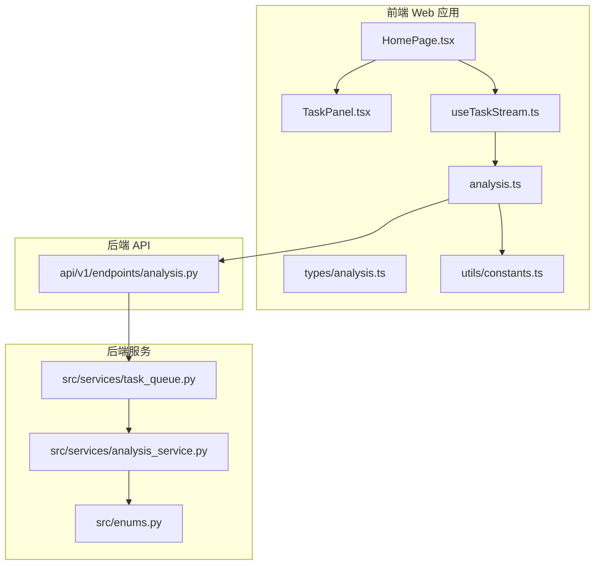
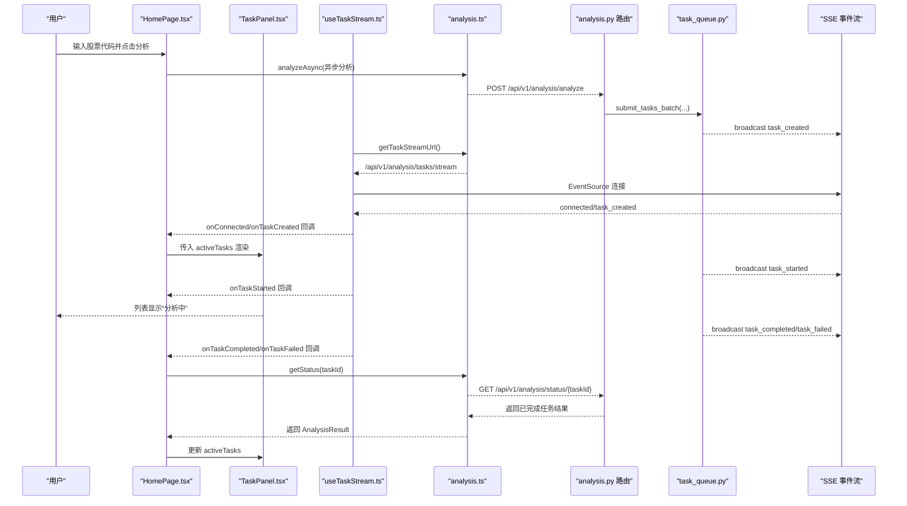
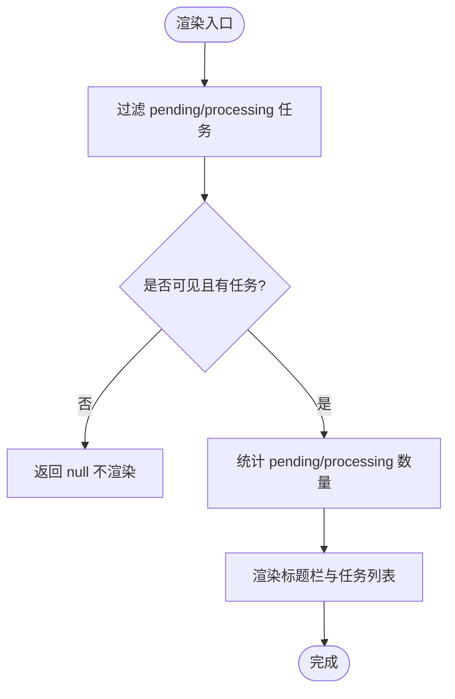
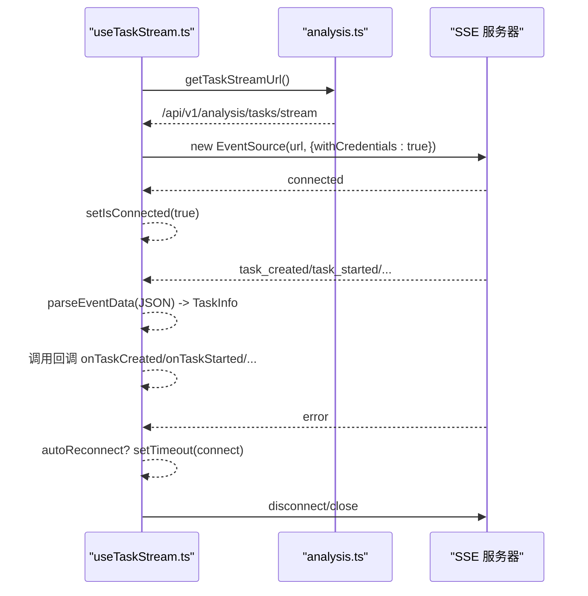
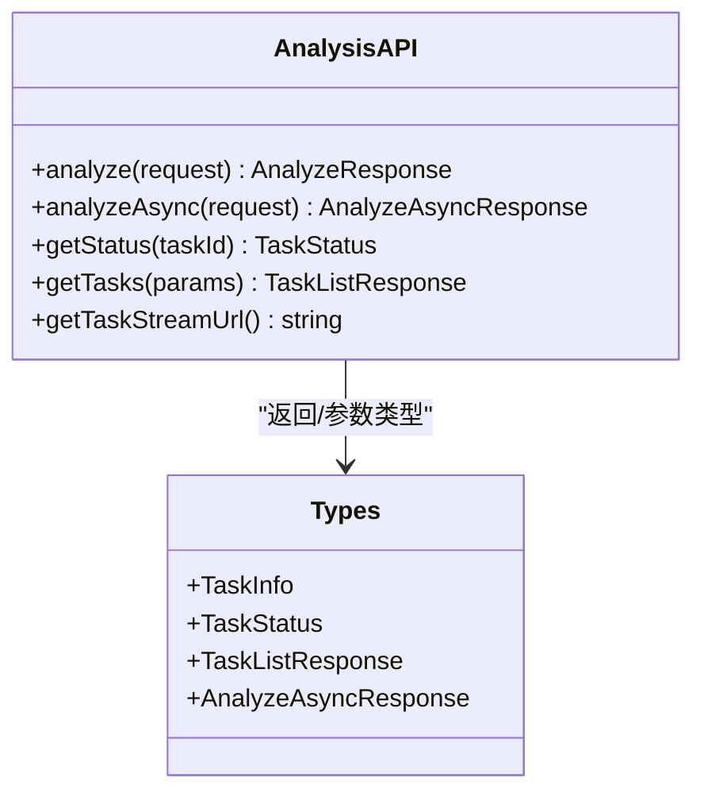
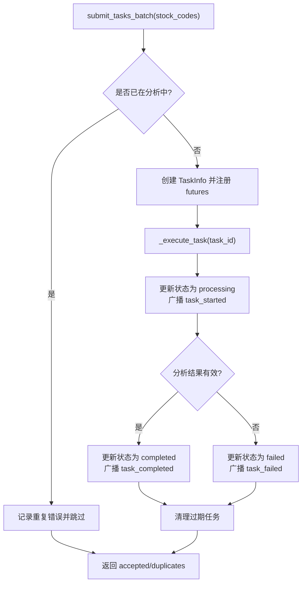
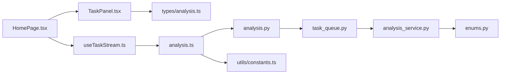

# 任务组件

<cite>
**本文档引用的文件**
- [apps/dsa-web/src/components/tasks/TaskPanel.tsx](file://apps/dsa-web/src/components/tasks/TaskPanel.tsx)
- [apps/dsa-web/src/hooks/useTaskStream.ts](file://apps/dsa-web/src/hooks/useTaskStream.ts)
- [apps/dsa-web/src/api/analysis.ts](file://apps/dsa-web/src/api/analysis.ts)
- [apps/dsa-web/src/types/analysis.ts](file://apps/dsa-web/src/types/analysis.ts)
- [apps/dsa-web/src/pages/HomePage.tsx](file://apps/dsa-web/src/pages/HomePage.tsx)
- [apps/dsa-web/src/utils/constants.ts](file://apps/dsa-web/src/utils/constants.ts)
- [api/v1/endpoints/analysis.py](file://api/v1/endpoints/analysis.py)
- [src/services/task_queue.py](file://src/services/task_queue.py)
- [src/services/analysis_service.py](file://src/services/analysis_service.py)
- [src/enums.py](file://src/enums.py)
</cite>

## 目录
1. [简介](#简介)
2. [项目结构](#项目结构)
3. [核心组件](#核心组件)
4. [架构总览](#架构总览)
5. [组件详细分析](#组件详细分析)
6. [依赖关系分析](#依赖关系分析)
7. [性能考量](#性能考量)
8. [故障排除指南](#故障排除指南)
9. [结论](#结论)
10. [附录](#附录)

## 简介
本文件面向“任务管理组件”，聚焦于前端 TaskPanel 组件与后端任务队列、SSE 实时推送、API 通信协议之间的协作机制。内容涵盖：
- 设计理念与实现细节：任务状态管理、实时更新机制、用户交互。
- 异步任务队列：任务进度跟踪、状态反馈、重复提交防护。
- 与后端 API 的通信协议：SSE 实时推送、错误重试机制。
- 状态管理模式、数据缓存策略与性能优化技巧。
- 使用示例、集成指南、扩展开发方案。
- 监控指标、调试工具与故障排除方法。

## 项目结构
任务组件由前端 React 组件与 Hook、API 层以及后端 FastAPI 路由、Python 任务队列共同组成。整体采用“前端发起分析 → 后端异步队列执行 → SSE 推送状态 → 前端实时渲染”的闭环设计。

**图表来源**
- [apps/dsa-web/src/pages/HomePage.tsx:12-106](file://apps/dsa-web/src/pages/HomePage.tsx#L12-L106)
- [apps/dsa-web/src/components/tasks/TaskPanel.tsx:103-158](file://apps/dsa-web/src/components/tasks/TaskPanel.tsx#L103-L158)
- [apps/dsa-web/src/hooks/useTaskStream.ts:78-252](file://apps/dsa-web/src/hooks/useTaskStream.ts#L78-L252)
- [apps/dsa-web/src/api/analysis.ts:15-132](file://apps/dsa-web/src/api/analysis.ts#L15-L132)
- [api/v1/endpoints/analysis.py:68-440](file://api/v1/endpoints/analysis.py#L68-L440)
- [src/services/task_queue.py:108-666](file://src/services/task_queue.py#L108-L666)
- [src/services/analysis_service.py:29-171](file://src/services/analysis_service.py#L29-L171)
- [src/enums.py:13-51](file://src/enums.py#L13-L51)
- [apps/dsa-web/src/utils/constants.ts:1-6](file://apps/dsa-web/src/utils/constants.ts#L1-L6)

**章节来源**
- [apps/dsa-web/src/pages/HomePage.tsx:12-106](file://apps/dsa-web/src/pages/HomePage.tsx#L12-L106)
- [apps/dsa-web/src/components/tasks/TaskPanel.tsx:103-158](file://apps/dsa-web/src/components/tasks/TaskPanel.tsx#L103-L158)
- [apps/dsa-web/src/hooks/useTaskStream.ts:78-252](file://apps/dsa-web/src/hooks/useTaskStream.ts#L78-L252)
- [apps/dsa-web/src/api/analysis.ts:15-132](file://apps/dsa-web/src/api/analysis.ts#L15-L132)
- [api/v1/endpoints/analysis.py:68-440](file://api/v1/endpoints/analysis.py#L68-L440)
- [src/services/task_queue.py:108-666](file://src/services/task_queue.py#L108-L666)
- [src/services/analysis_service.py:29-171](file://src/services/analysis_service.py#L29-L171)
- [src/enums.py:13-51](file://src/enums.py#L13-L51)
- [apps/dsa-web/src/utils/constants.ts:1-6](file://apps/dsa-web/src/utils/constants.ts#L1-L6)

## 核心组件
- TaskPanel：渲染“进行中/等待中”任务列表，提供标题栏与任务项卡片，支持可见性控制与自定义样式。
- useTaskStream：封装 SSE 连接、事件解析、自动重连与断开逻辑，暴露连接状态与控制方法。
- analysis API：封装分析触发、任务状态查询、任务列表与 SSE 流 URL 获取。
- 任务队列与分析服务：后端负责任务提交、执行、状态变更广播与历史持久化。

**章节来源**
- [apps/dsa-web/src/components/tasks/TaskPanel.tsx:103-158](file://apps/dsa-web/src/components/tasks/TaskPanel.tsx#L103-L158)
- [apps/dsa-web/src/hooks/useTaskStream.ts:78-252](file://apps/dsa-web/src/hooks/useTaskStream.ts#L78-L252)
- [apps/dsa-web/src/api/analysis.ts:15-132](file://apps/dsa-web/src/api/analysis.ts#L15-L132)
- [src/services/task_queue.py:108-666](file://src/services/task_queue.py#L108-L666)

## 架构总览
从前端到后端的数据流与事件流如下：

**图表来源**
- [apps/dsa-web/src/pages/HomePage.tsx:12-106](file://apps/dsa-web/src/pages/HomePage.tsx#L12-L106)
- [apps/dsa-web/src/components/tasks/TaskPanel.tsx:103-158](file://apps/dsa-web/src/components/tasks/TaskPanel.tsx#L103-L158)
- [apps/dsa-web/src/hooks/useTaskStream.ts:78-252](file://apps/dsa-web/src/hooks/useTaskStream.ts#L78-L252)
- [apps/dsa-web/src/api/analysis.ts:15-132](file://apps/dsa-web/src/api/analysis.ts#L15-L132)
- [api/v1/endpoints/analysis.py:68-440](file://api/v1/endpoints/analysis.py#L68-L440)
- [src/services/task_queue.py:108-666](file://src/services/task_queue.py#L108-L666)

## 组件详细分析

### TaskPanel 组件
- 职责：渲染“进行中/等待中”的任务列表，显示任务名称、代码、状态标签与进度提示。
- 关键点：
  - 仅渲染 status 为 pending 或 processing 的任务。
  - 标题栏显示“进行中/等待中”任务数量。
  - 任务项根据状态显示不同图标与标签。
- 性能：列表使用固定高度与滚动容器，避免 DOM 节点过多导致卡顿。

**图表来源**
- [apps/dsa-web/src/components/tasks/TaskPanel.tsx:109-121](file://apps/dsa-web/src/components/tasks/TaskPanel.tsx#L109-L121)
- [apps/dsa-web/src/components/tasks/TaskPanel.tsx:122-157](file://apps/dsa-web/src/components/tasks/TaskPanel.tsx#L122-L157)

**章节来源**
- [apps/dsa-web/src/components/tasks/TaskPanel.tsx:103-158](file://apps/dsa-web/src/components/tasks/TaskPanel.tsx#L103-L158)

### useTaskStream Hook
- 职责：建立与维护 SSE 连接，解析事件数据，提供自动重连与手动断开/重连能力。
- 关键点：
  - 事件类型：connected、task_created、task_started、task_completed、task_failed、heartbeat。
  - 数据转换：将 snake_case 字段转为 camelCase。
  - 自动重连：基于配置的 delay 与开关，异常时自动重连。
  - 生命周期：effect 控制连接启停，ref 存储回调以避免闭包问题。
- 错误处理：onError 回调与自动重连结合，断开时清理定时器与 EventSource。

**图表来源**
- [apps/dsa-web/src/hooks/useTaskStream.ts:78-252](file://apps/dsa-web/src/hooks/useTaskStream.ts#L78-L252)
- [apps/dsa-web/src/api/analysis.ts:123-131](file://apps/dsa-web/src/api/analysis.ts#L123-L131)

**章节来源**
- [apps/dsa-web/src/hooks/useTaskStream.ts:78-252](file://apps/dsa-web/src/hooks/useTaskStream.ts#L78-L252)
- [apps/dsa-web/src/api/analysis.ts:123-131](file://apps/dsa-web/src/api/analysis.ts#L123-L131)

### 前端与后端 API 协议
- 触发分析：POST /api/v1/analysis/analyze，支持同步与异步模式；异步模式返回 202，并携带 taskId 或批量任务信息。
- 查询任务状态：GET /api/v1/analysis/status/{taskId}，优先从队列查询，不存在则从历史记录查询。
- 任务列表：GET /api/v1/analysis/tasks，支持按状态筛选与数量限制。
- SSE 实时流：GET /api/v1/analysis/tasks/stream，事件类型包括 connected、task_created、task_started、task_completed、task_failed、heartbeat。

**图表来源**
- [apps/dsa-web/src/api/analysis.ts:15-132](file://apps/dsa-web/src/api/analysis.ts#L15-L132)
- [apps/dsa-web/src/types/analysis.ts:132-152](file://apps/dsa-web/src/types/analysis.ts#L132-L152)

**章节来源**
- [apps/dsa-web/src/api/analysis.ts:15-132](file://apps/dsa-web/src/api/analysis.ts#L15-L132)
- [apps/dsa-web/src/types/analysis.ts:132-152](file://apps/dsa-web/src/types/analysis.ts#L132-L152)

### 后端任务队列与执行流程
- 任务模型：TaskInfo 包含 taskId、stockCode、status、progress、message、reportType、时间戳与错误信息等。
- 队列特性：防止重复提交、线程池执行、SSE 事件广播、任务完成后清理过期任务。
- 执行流程：submit_tasks_batch → _execute_task → 广播 task_started → 成功/失败 → 广播 task_completed/task_failed → 清理过期任务。

**图表来源**
- [src/services/task_queue.py:296-532](file://src/services/task_queue.py#L296-L532)

**章节来源**
- [src/services/task_queue.py:108-666](file://src/services/task_queue.py#L108-L666)

### 与分析服务的协作
- AnalysisService 负责调用 Pipeline 执行单只股票分析，构建标准化报告结构。
- 任务队列在执行前后更新 TaskInfo 状态与进度，并通过 SSE 广播事件。
- 报告语言与本地化在服务层处理，保证多语言一致性。

**章节来源**
- [src/services/analysis_service.py:29-171](file://src/services/analysis_service.py#L29-L171)
- [src/enums.py:13-51](file://src/enums.py#L13-L51)

## 依赖关系分析
- 前端依赖：
  - TaskPanel 依赖 TaskInfo 类型与 activeTasks 数据。
  - useTaskStream 依赖 analysis API 的 getTaskStreamUrl 与 EventSource。
  - HomePage 将 activeTasks 传递给 TaskPanel，并通过 Hook 管理任务事件。
- 后端依赖：
  - FastAPI 路由依赖任务队列与分析服务。
  - 任务队列依赖分析服务与线程池执行器。
  - 常量 API_BASE_URL 决定前端 API 基础地址。

**图表来源**
- [apps/dsa-web/src/components/tasks/TaskPanel.tsx:103-158](file://apps/dsa-web/src/components/tasks/TaskPanel.tsx#L103-L158)
- [apps/dsa-web/src/hooks/useTaskStream.ts:78-252](file://apps/dsa-web/src/hooks/useTaskStream.ts#L78-L252)
- [apps/dsa-web/src/pages/HomePage.tsx:12-106](file://apps/dsa-web/src/pages/HomePage.tsx#L12-L106)
- [apps/dsa-web/src/api/analysis.ts:15-132](file://apps/dsa-web/src/api/analysis.ts#L15-L132)
- [api/v1/endpoints/analysis.py:68-440](file://api/v1/endpoints/analysis.py#L68-L440)
- [src/services/task_queue.py:108-666](file://src/services/task_queue.py#L108-L666)
- [src/services/analysis_service.py:29-171](file://src/services/analysis_service.py#L29-L171)
- [src/enums.py:13-51](file://src/enums.py#L13-L51)
- [apps/dsa-web/src/utils/constants.ts:1-6](file://apps/dsa-web/src/utils/constants.ts#L1-L6)

**章节来源**
- [apps/dsa-web/src/components/tasks/TaskPanel.tsx:103-158](file://apps/dsa-web/src/components/tasks/TaskPanel.tsx#L103-L158)
- [apps/dsa-web/src/hooks/useTaskStream.ts:78-252](file://apps/dsa-web/src/hooks/useTaskStream.ts#L78-L252)
- [apps/dsa-web/src/pages/HomePage.tsx:12-106](file://apps/dsa-web/src/pages/HomePage.tsx#L12-L106)
- [apps/dsa-web/src/api/analysis.ts:15-132](file://apps/dsa-web/src/api/analysis.ts#L15-L132)
- [api/v1/endpoints/analysis.py:68-440](file://api/v1/endpoints/analysis.py#L68-L440)
- [src/services/task_queue.py:108-666](file://src/services/task_queue.py#L108-L666)
- [src/services/analysis_service.py:29-171](file://src/services/analysis_service.py#L29-L171)
- [src/enums.py:13-51](file://src/enums.py#L13-L51)
- [apps/dsa-web/src/utils/constants.ts:1-6](file://apps/dsa-web/src/utils/constants.ts#L1-L6)

## 性能考量
- 前端渲染优化
  - 列表固定高度与滚动容器，减少重排与重绘。
  - 仅渲染 pending/processing 任务，降低 DOM 负担。
- SSE 连接管理
  - 使用 withCredentials 保持会话，避免跨域认证问题。
  - 自动重连与心跳事件维持长连接稳定性。
- 后端并发与内存
  - 线程池并发度可动态调整，繁忙时延迟生效。
  - 任务历史上限控制内存占用，定期清理过期任务。
- API 基础地址
  - 通过环境变量配置 API_BASE_URL，避免跨域与本地回环问题。

[本节为通用性能建议，无需特定文件引用]

## 故障排除指南
- SSE 连接失败
  - 确认 getTaskStreamUrl 返回的 URL 与 API_BASE_URL 一致。
  - 检查 withCredentials 是否正确传递 Cookie/Session。
  - 查看 onError 回调与自动重连日志。
- 任务重复提交
  - 异步模式下相同股票会返回 409，需捕获 DuplicateTaskError 并提示用户。
- 任务状态查询
  - 若任务已过期，getStatus 可能从历史记录返回已完成结果。
- 前端无任务显示
  - 确认 activeTasks 中 status 为 pending/processing。
  - 检查 TaskPanel 的 visible 与 className 传参。

**章节来源**
- [apps/dsa-web/src/hooks/useTaskStream.ts:191-203](file://apps/dsa-web/src/hooks/useTaskStream.ts#L191-L203)
- [apps/dsa-web/src/api/analysis.ts:140-150](file://apps/dsa-web/src/api/analysis.ts#L140-L150)
- [api/v1/endpoints/analysis.py:470-570](file://api/v1/endpoints/analysis.py#L470-L570)
- [apps/dsa-web/src/components/tasks/TaskPanel.tsx:114-117](file://apps/dsa-web/src/components/tasks/TaskPanel.tsx#L114-L117)

## 结论
任务管理组件通过前端 TaskPanel 与 useTaskStream Hook 实现了对后端异步任务的实时可视化与交互体验。后端任务队列保障了任务的并发执行、状态广播与历史持久化。整体架构清晰、职责分离明确，具备良好的扩展性与可维护性。

[本节为总结性内容，无需特定文件引用]

## 附录

### 使用示例与集成指南
- 在页面中引入 TaskPanel 并传入 activeTasks：
  - 参考路径：[apps/dsa-web/src/pages/HomePage.tsx:71](file://apps/dsa-web/src/pages/HomePage.tsx#L71)
- 在组件挂载时使用 useTaskStream 订阅任务事件：
  - 参考路径：[apps/dsa-web/src/hooks/useTaskStream.ts:235-245](file://apps/dsa-web/src/hooks/useTaskStream.ts#L235-L245)
- 触发异步分析并处理 202/409：
  - 参考路径：[apps/dsa-web/src/api/analysis.ts:51-81](file://apps/dsa-web/src/api/analysis.ts#L51-L81)
- 获取 SSE 流 URL：
  - 参考路径：[apps/dsa-web/src/api/analysis.ts:127-131](file://apps/dsa-web/src/api/analysis.ts#L127-L131)

**章节来源**
- [apps/dsa-web/src/pages/HomePage.tsx:71](file://apps/dsa-web/src/pages/HomePage.tsx#L71)
- [apps/dsa-web/src/hooks/useTaskStream.ts:235-245](file://apps/dsa-web/src/hooks/useTaskStream.ts#L235-L245)
- [apps/dsa-web/src/api/analysis.ts:51-81](file://apps/dsa-web/src/api/analysis.ts#L51-L81)
- [apps/dsa-web/src/api/analysis.ts:127-131](file://apps/dsa-web/src/api/analysis.ts#L127-L131)

### 扩展开发方案
- 增加任务筛选与排序：在前端 Store 中维护过滤条件，后端路由支持更丰富的查询参数。
- 增强错误提示：在 useTaskStream 中区分网络错误与业务错误，提供更友好的用户提示。
- 支持任务取消：后端队列增加取消逻辑，前端提供取消按钮并更新状态。
- 多语言支持：沿用 AnalysisService 的本地化策略，统一情绪标签与报告文本。

[本节为扩展建议，无需特定文件引用]

### 监控指标与调试工具
- 前端
  - 连接状态 isConnected、事件回调 onConnected/onTaskCreated/onTaskStarted/onTaskCompleted/onTaskFailed。
  - 日志：console.error 与 onError 回调。
- 后端
  - 任务统计：total/pending/processing/completed/failed。
  - 事件广播：_broadcast_event 调用次数与异常日志。
  - 清理策略：_cleanup_old_tasks 移除数量与频率。

**章节来源**
- [apps/dsa-web/src/hooks/useTaskStream.ts:52-59](file://apps/dsa-web/src/hooks/useTaskStream.ts#L52-L59)
- [src/services/task_queue.py:419-436](file://src/services/task_queue.py#L419-L436)
- [src/services/task_queue.py:602-635](file://src/services/task_queue.py#L602-L635)
- [src/services/task_queue.py:534-566](file://src/services/task_queue.py#L534-L566)