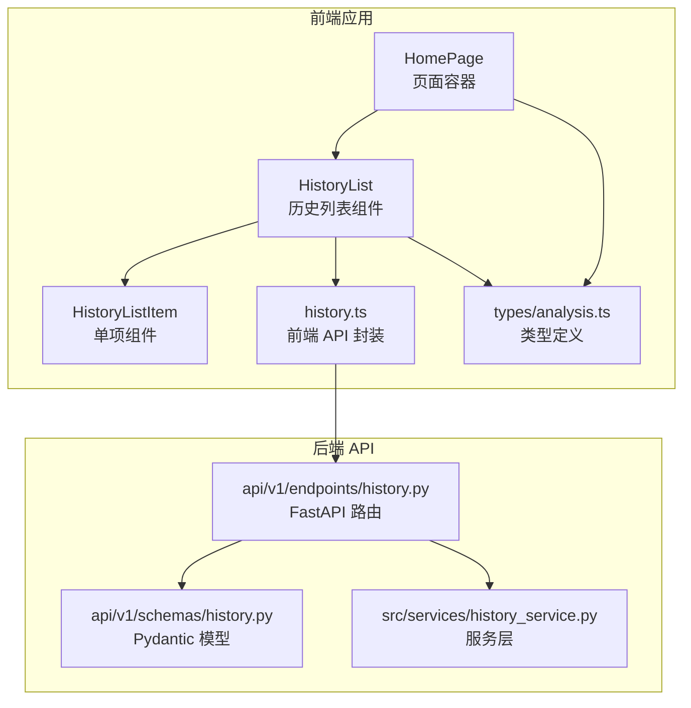
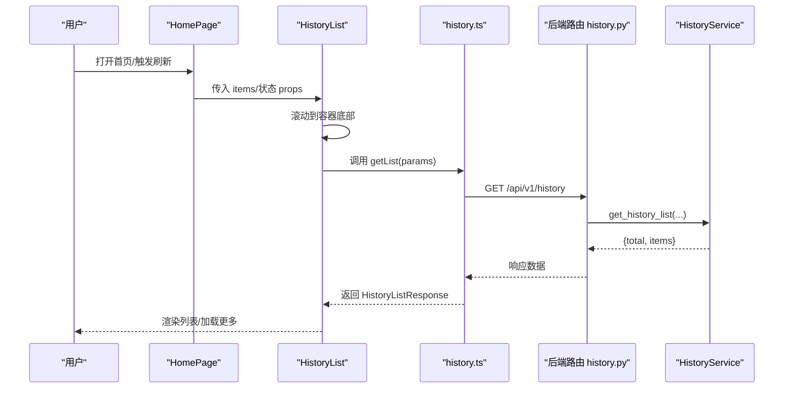
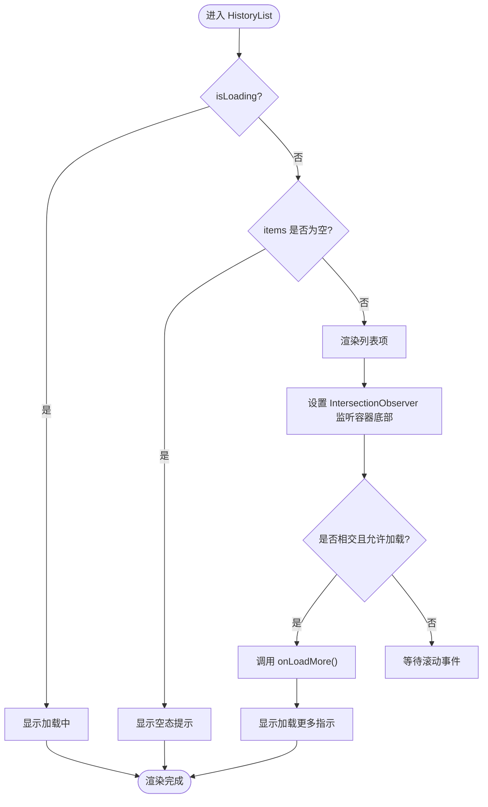
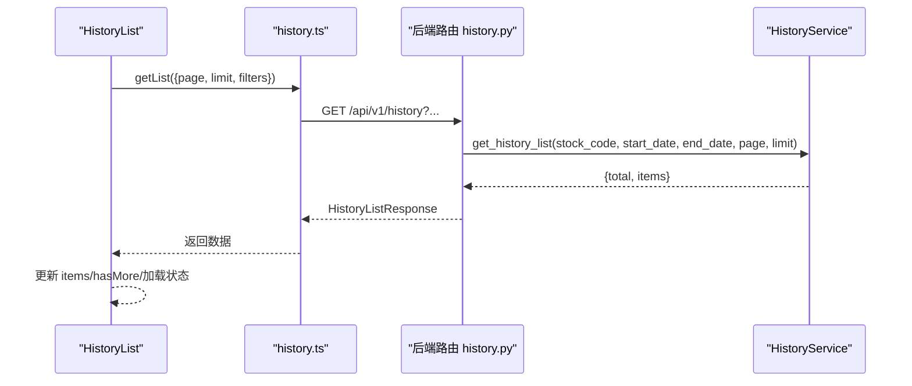
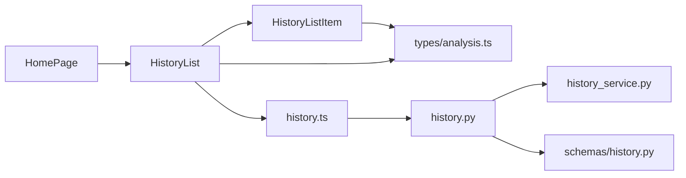

# 历史记录组件

<cite>
**本文引用的文件**   
- [apps/dsa-web/src/components/history/HistoryList.tsx](file://apps/dsa-web/src/components/history/HistoryList.tsx)
- [apps/dsa-web/src/components/history/HistoryListItem.tsx](file://apps/dsa-web/src/components/history/HistoryListItem.tsx)
- [apps/dsa-web/src/components/history/index.ts](file://apps/dsa-web/src/components/history/index.ts)
- [apps/dsa-web/src/api/history.ts](file://apps/dsa-web/src/api/history.ts)
- [apps/dsa-web/src/types/analysis.ts](file://apps/dsa-web/src/types/analysis.ts)
- [apps/dsa-web/src/pages/HomePage.tsx](file://apps/dsa-web/src/pages/HomePage.tsx)
- [api/v1/endpoints/history.py](file://api/v1/endpoints/history.py)
- [api/v1/schemas/history.py](file://api/v1/schemas/history.py)
- [src/services/history_service.py](file://src/services/history_service.py)
</cite>

## 目录
1. [简介](#简介)
2. [项目结构](#项目结构)
3. [核心组件](#核心组件)
4. [架构总览](#架构总览)
5. [组件详细分析](#组件详细分析)
6. [依赖关系分析](#依赖关系分析)
7. [性能考量](#性能考量)
8. [故障排查指南](#故障排查指南)
9. [结论](#结论)
10. [附录](#附录)

## 简介
本文件为“历史记录组件”的技术文档，聚焦 HistoryList 组件的设计架构与数据展示逻辑，涵盖以下主题：
- 历史分析记录的获取、排序与筛选
- 分页加载、搜索过滤与数据刷新机制
- 与历史 API 的集成方式、数据缓存策略与性能优化
- 用户交互设计、批量操作与导出能力
- 使用示例、配置项与扩展开发指南
- 错误处理、加载状态与用户体验优化

## 项目结构
历史记录组件位于前端应用的组件层，配合页面容器与状态管理共同工作，并通过 API 层对接后端服务。

图表来源
- [apps/dsa-web/src/pages/HomePage.tsx:72-89](file://apps/dsa-web/src/pages/HomePage.tsx#L72-L89)
- [apps/dsa-web/src/components/history/HistoryList.tsx:27-41](file://apps/dsa-web/src/components/history/HistoryList.tsx#L27-L41)
- [apps/dsa-web/src/api/history.ts:19-43](file://apps/dsa-web/src/api/history.ts#L19-L43)
- [api/v1/endpoints/history.py:49-126](file://api/v1/endpoints/history.py#L49-L126)
- [api/v1/schemas/history.py:17-66](file://api/v1/schemas/history.py#L17-L66)
- [src/services/history_service.py:64-136](file://src/services/history_service.py#L64-L136)

章节来源
- [apps/dsa-web/src/pages/HomePage.tsx:72-89](file://apps/dsa-web/src/pages/HomePage.tsx#L72-L89)
- [apps/dsa-web/src/components/history/HistoryList.tsx:27-41](file://apps/dsa-web/src/components/history/HistoryList.tsx#L27-L41)
- [apps/dsa-web/src/api/history.ts:19-43](file://apps/dsa-web/src/api/history.ts#L19-L43)
- [api/v1/endpoints/history.py:49-126](file://api/v1/endpoints/history.py#L49-L126)
- [api/v1/schemas/history.py:17-66](file://api/v1/schemas/history.py#L17-L66)
- [src/services/history_service.py:64-136](file://src/services/history_service.py#L64-L136)

## 核心组件
- HistoryList：负责渲染历史记录列表、处理滚动触底加载、批量选择与删除、空态与加载态展示。
- HistoryListItem：单条历史记录项，包含股票名称、代码、情绪分数、操作建议与创建时间等信息。
- 前端 API(history.ts)：封装历史列表、详情、新闻、Markdown 导出与批量删除等接口。
- 页面容器(HomePage)：将历史数据与交互行为注入 HistoryList，协调加载、刷新与删除流程。
- 后端路由与服务(history.py、history_service.py)：提供分页查询、筛选、详情解析、新闻情报与 Markdown 报告生成。

章节来源
- [apps/dsa-web/src/components/history/HistoryList.tsx:27-41](file://apps/dsa-web/src/components/history/HistoryList.tsx#L27-L41)
- [apps/dsa-web/src/components/history/HistoryListItem.tsx:35-42](file://apps/dsa-web/src/components/history/HistoryListItem.tsx#L35-L42)
- [apps/dsa-web/src/api/history.ts:19-43](file://apps/dsa-web/src/api/history.ts#L19-L43)
- [apps/dsa-web/src/pages/HomePage.tsx:72-89](file://apps/dsa-web/src/pages/HomePage.tsx#L72-L89)
- [api/v1/endpoints/history.py:49-126](file://api/v1/endpoints/history.py#L49-L126)
- [src/services/history_service.py:64-136](file://src/services/history_service.py#L64-L136)

## 架构总览
历史记录组件采用“组件-页面-API-后端服务”分层架构，数据流自下而上：

图表来源
- [apps/dsa-web/src/pages/HomePage.tsx:57-64](file://apps/dsa-web/src/pages/HomePage.tsx#L57-L64)
- [apps/dsa-web/src/components/history/HistoryList.tsx:52-78](file://apps/dsa-web/src/components/history/HistoryList.tsx#L52-L78)
- [apps/dsa-web/src/api/history.ts:24-43](file://apps/dsa-web/src/api/history.ts#L24-L43)
- [api/v1/endpoints/history.py:59-116](file://api/v1/endpoints/history.py#L59-L116)
- [src/services/history_service.py:64-136](file://src/services/history_service.py#L64-L136)

## 组件详细分析

### HistoryList 设计与数据流
- 职责边界
  - 列表渲染：遍历 items 并逐项交由 HistoryListItem 渲染。
  - 分页加载：基于 IntersectionObserver 监听滚动到底部，触发 onLoadMore。
  - 批量操作：全选/反选可见项、删除选中项；禁用状态下保持 UI 一致性。
  - 加载与空态：isLoading 显示旋转加载；空列表显示提示；加载更多时显示加载指示。
- 关键交互
  - 滚动加载：容器作为根节点，阈值与 margin 控制提前触发时机，避免频繁触发。
  - 选择状态：根据 visible items 计算全选/半选状态，联动复选框 indeterminate。
  - 删除流程：isDeleting 控制按钮状态与禁用，防止并发删除。
- 数据结构
  - 输入 props 包含 items、isLoading、isLoadingMore、hasMore、selectedId、selectedIds、isDeleting。
  - 输出回调包括 onItemClick、onLoadMore、onToggleItemSelection、onToggleSelectAll、onDeleteSelected。

图表来源
- [apps/dsa-web/src/components/history/HistoryList.tsx:52-78](file://apps/dsa-web/src/components/history/HistoryList.tsx#L52-L78)
- [apps/dsa-web/src/components/history/HistoryList.tsx:140-184](file://apps/dsa-web/src/components/history/HistoryList.tsx#L140-L184)

章节来源
- [apps/dsa-web/src/components/history/HistoryList.tsx:27-41](file://apps/dsa-web/src/components/history/HistoryList.tsx#L27-L41)
- [apps/dsa-web/src/components/history/HistoryList.tsx:52-78](file://apps/dsa-web/src/components/history/HistoryList.tsx#L52-L78)
- [apps/dsa-web/src/components/history/HistoryList.tsx:140-184](file://apps/dsa-web/src/components/history/HistoryList.tsx#L140-L184)

### HistoryListItem 渲染细节
- 情绪可视化：根据情绪分数映射颜色与阴影，增强可读性。
- 操作建议标签：对“减仓/卖出/观望/买入/布局”等关键词进行归类显示。
- 交互行为：点击项触发 onItemClick；复选框触发 onToggleChecked；删除期间禁用交互。

章节来源
- [apps/dsa-web/src/components/history/HistoryListItem.tsx:35-42](file://apps/dsa-web/src/components/history/HistoryListItem.tsx#L35-L42)
- [apps/dsa-web/src/components/history/HistoryListItem.tsx:15-33](file://apps/dsa-web/src/components/history/HistoryListItem.tsx#L15-L33)

### 前端 API 与后端集成
- 历史列表
  - 参数：stockCode、startDate、endDate、page、limit。
  - 返回：HistoryListResponse（total/page/limit/items）。
- 历史详情
  - 支持按 record_id（整数主键或 query_id 字符串）解析并返回完整报告。
- 新闻情报
  - 按 record_id 获取关联新闻，支持 limit。
- Markdown 报告
  - 生成与推送通知一致的 Markdown 内容。
- 批量删除
  - 传入 record_ids 数组，返回 deleted 计数。

图表来源
- [apps/dsa-web/src/api/history.ts:24-43](file://apps/dsa-web/src/api/history.ts#L24-L43)
- [api/v1/endpoints/history.py:59-116](file://api/v1/endpoints/history.py#L59-L116)
- [src/services/history_service.py:64-136](file://src/services/history_service.py#L64-L136)

章节来源
- [apps/dsa-web/src/api/history.ts:19-92](file://apps/dsa-web/src/api/history.ts#L19-L92)
- [api/v1/endpoints/history.py:49-126](file://api/v1/endpoints/history.py#L49-L126)
- [api/v1/schemas/history.py:17-66](file://api/v1/schemas/history.py#L17-L66)
- [src/services/history_service.py:64-136](file://src/services/history_service.py#L64-L136)

### 页面容器与状态注入
- HomePage 将历史数据与交互行为注入 HistoryList：
  - items、isLoading、isLoadingMore、hasMore、selectedId、selectedIds、isDeleting。
  - 回调：onItemClick、onLoadMore、onToggleItemSelection、onToggleSelectAll、onDeleteSelected。
- 通过 useDashboardLifecycle 钩子在挂载时加载初始历史并支持刷新。

章节来源
- [apps/dsa-web/src/pages/HomePage.tsx:57-64](file://apps/dsa-web/src/pages/HomePage.tsx#L57-L64)
- [apps/dsa-web/src/pages/HomePage.tsx:72-89](file://apps/dsa-web/src/pages/HomePage.tsx#L72-L89)

### 数据模型与类型定义
- 历史列表项与响应：HistoryItem、HistoryListResponse。
- 历史筛选与分页：HistoryFilters、HistoryPagination。
- 前端类型与工具：getSentimentLabel、getSentimentColor。

章节来源
- [apps/dsa-web/src/types/analysis.ts:164-182](file://apps/dsa-web/src/types/analysis.ts#L164-L182)
- [apps/dsa-web/src/types/analysis.ts:197-208](file://apps/dsa-web/src/types/analysis.ts#L197-L208)
- [apps/dsa-web/src/types/analysis.ts:220-245](file://apps/dsa-web/src/types/analysis.ts#L220-L245)

## 依赖关系分析
- 组件耦合
  - HistoryList 依赖 HistoryListItem、通用组件（Badge、Button、ScrollArea）与类型定义。
  - HomePage 作为容器，依赖 Zustand 状态与 Hook，向 HistoryList 注入 props 与回调。
- 外部依赖
  - 前端 API history.ts 依赖统一的 apiClient 与工具 toCamelCase。
  - 后端路由 history.py 依赖 HistoryService 与 Pydantic 模型。
- 可能的循环依赖
  - 组件间无直接循环导入；页面-组件-API-服务分层清晰，避免循环。

图表来源
- [apps/dsa-web/src/components/history/HistoryList.tsx:4-5](file://apps/dsa-web/src/components/history/HistoryList.tsx#L4-L5)
- [apps/dsa-web/src/components/history/HistoryListItem.tsx:2](file://apps/dsa-web/src/components/history/HistoryListItem.tsx#L2)
- [apps/dsa-web/src/api/history.ts:1-10](file://apps/dsa-web/src/api/history.ts#L1-L10)
- [apps/dsa-web/src/pages/HomePage.tsx:4-6](file://apps/dsa-web/src/pages/HomePage.tsx#L4-L6)
- [api/v1/endpoints/history.py:17-41](file://api/v1/endpoints/history.py#L17-L41)
- [api/v1/schemas/history.py:14-31](file://api/v1/schemas/history.py#L14-L31)
- [src/services/history_service.py:18-31](file://src/services/history_service.py#L18-L31)

章节来源
- [apps/dsa-web/src/components/history/HistoryList.tsx:4-5](file://apps/dsa-web/src/components/history/HistoryList.tsx#L4-L5)
- [apps/dsa-web/src/components/history/HistoryListItem.tsx:2](file://apps/dsa-web/src/components/history/HistoryListItem.tsx#L2)
- [apps/dsa-web/src/api/history.ts:1-10](file://apps/dsa-web/src/api/history.ts#L1-L10)
- [apps/dsa-web/src/pages/HomePage.tsx:4-6](file://apps/dsa-web/src/pages/HomePage.tsx#L4-L6)
- [api/v1/endpoints/history.py:17-41](file://api/v1/endpoints/history.py#L17-L41)
- [api/v1/schemas/history.py:14-31](file://api/v1/schemas/history.py#L14-L31)
- [src/services/history_service.py:18-31](file://src/services/history_service.py#L18-L31)

## 性能考量
- 滚动加载
  - 使用 IntersectionObserver，root 设置为容器，rootMargin 与 threshold 控制提前触发，减少频繁 IO。
  - 仅当 hasMore 且非 isLoading/isLoadingMore 时触发加载，避免重复请求。
- 列表渲染
  - 单项组件内尽量避免不必要的重渲染；利用 memo 化（如 useMemo）在容器侧稳定 props。
- API 调用
  - 合理设置 limit（默认 20），避免单次返回过大；分页参数 page/limit 严格校验。
- 服务层
  - 历史查询使用数据库分页方法，避免一次性拉取全部数据。
- 缓存策略
  - 前端可结合请求去重与本地缓存（如按 page/limit+filters 维度缓存）降低重复请求。
  - 后端可考虑热点数据缓存与索引优化（按 stock_code、created_at 排序）。

章节来源
- [apps/dsa-web/src/components/history/HistoryList.tsx:52-78](file://apps/dsa-web/src/components/history/HistoryList.tsx#L52-L78)
- [apps/dsa-web/src/api/history.ts:24-43](file://apps/dsa-web/src/api/history.ts#L24-L43)
- [src/services/history_service.py:64-136](file://src/services/history_service.py#L64-L136)

## 故障排查指南
- 常见问题
  - 列表不加载：检查 hasMore、isLoading、isLoadingMore 三者状态；确认 onLoadMore 是否被调用。
  - 滚动无效：检查容器是否正确设置 viewportRef，IntersectionObserver 是否成功连接。
  - 删除异常：isDeleting 为真时禁用交互；确认 onDeleteSelected 回调与后端批量删除接口一致。
  - 空数据：确认后端返回 total/items 正确；前端空态分支逻辑。
- 错误处理
  - 前端：history.ts 对响应进行 toCamelCase 转换，确保字段命名一致。
  - 后端：history.py 对异常进行 HTTPException 包装，返回统一错误结构。
- 用户体验
  - 加载态：isLoading 与 isLoadingMore 区分首屏与追加加载。
  - 底部提示：无更多数据时显示“已到底部”。

章节来源
- [apps/dsa-web/src/components/history/HistoryList.tsx:140-184](file://apps/dsa-web/src/components/history/HistoryList.tsx#L140-L184)
- [apps/dsa-web/src/api/history.ts:36-42](file://apps/dsa-web/src/api/history.ts#L36-L42)
- [api/v1/endpoints/history.py:117-125](file://api/v1/endpoints/history.py#L117-L125)

## 结论
HistoryList 组件通过清晰的分层设计与完善的交互控制，实现了高效的历史记录浏览、筛选与批量操作。前端与后端接口契约明确，服务层承担查询与数据转换职责，整体具备良好的可维护性与扩展性。建议在现有基础上进一步引入请求去重与本地缓存策略，以提升复杂场景下的性能表现。

## 附录

### 使用示例与配置项
- 基本用法
  - 在页面容器中传入 items、isLoading、isLoadingMore、hasMore、selectedId、selectedIds、isDeleting。
  - 绑定回调：onItemClick、onLoadMore、onToggleItemSelection、onToggleSelectAll、onDeleteSelected。
- 筛选与分页
  - 通过 HistoryFilters 与 HistoryPagination 控制查询参数。
- 批量操作
  - 全选/反选可见项；删除选中项时弹出二次确认。
- 导出能力
  - 通过 getMarkdown(recordId) 获取 Markdown 报告内容，用于导出或预览。

章节来源
- [apps/dsa-web/src/pages/HomePage.tsx:72-89](file://apps/dsa-web/src/pages/HomePage.tsx#L72-L89)
- [apps/dsa-web/src/types/analysis.ts:197-208](file://apps/dsa-web/src/types/analysis.ts#L197-L208)
- [apps/dsa-web/src/api/history.ts:76-79](file://apps/dsa-web/src/api/history.ts#L76-L79)

### 扩展开发指南
- 新增筛选维度
  - 在 HistoryFilters 增加字段并在前端 API 与后端路由同步扩展。
- 自定义渲染
  - 在 HistoryListItem 中扩展展示字段或样式，注意与 getSentimentColor 保持一致。
- 缓存与去重
  - 在 history.ts 中按 page/limit/过滤条件缓存响应；在调用前进行去重判断。
- 错误与回退
  - 在前端捕获 HTTP 异常并降级为空列表；在后端对异常进行日志记录与统一响应。

章节来源
- [apps/dsa-web/src/types/analysis.ts:197-208](file://apps/dsa-web/src/types/analysis.ts#L197-L208)
- [apps/dsa-web/src/api/history.ts:19-43](file://apps/dsa-web/src/api/history.ts#L19-L43)
- [api/v1/endpoints/history.py:59-116](file://api/v1/endpoints/history.py#L59-L116)