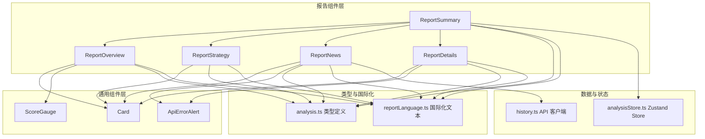
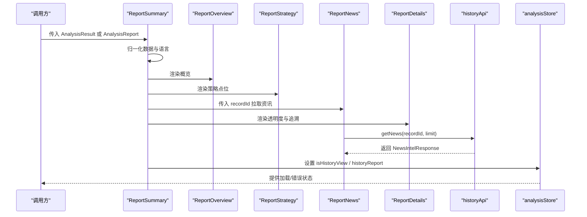
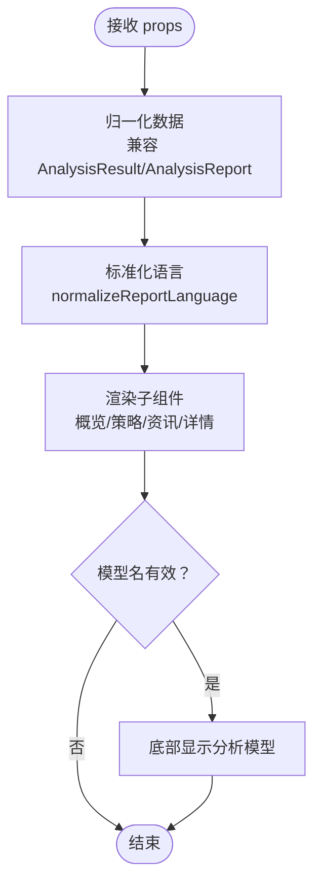
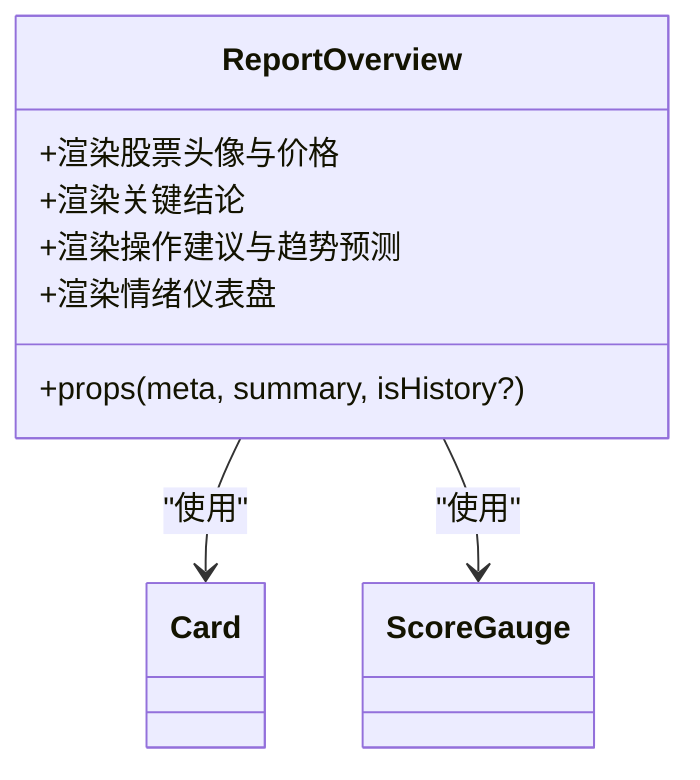
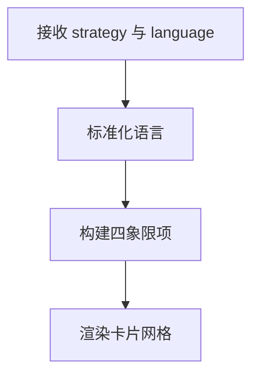
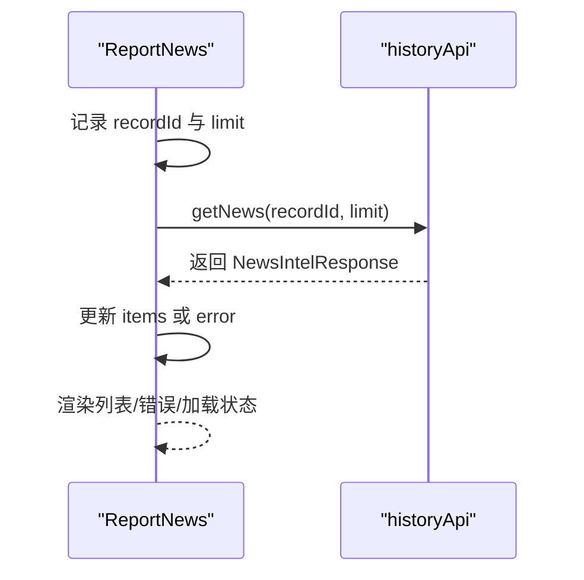
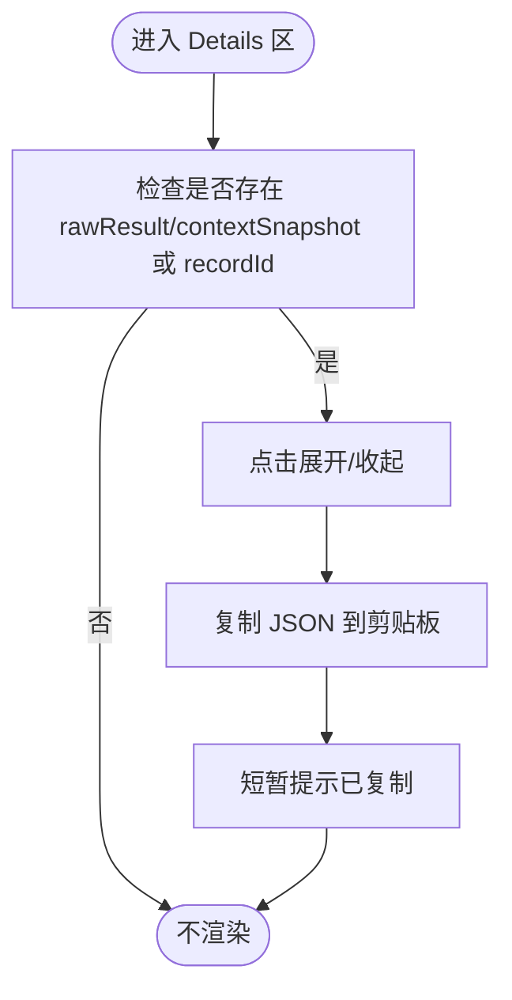
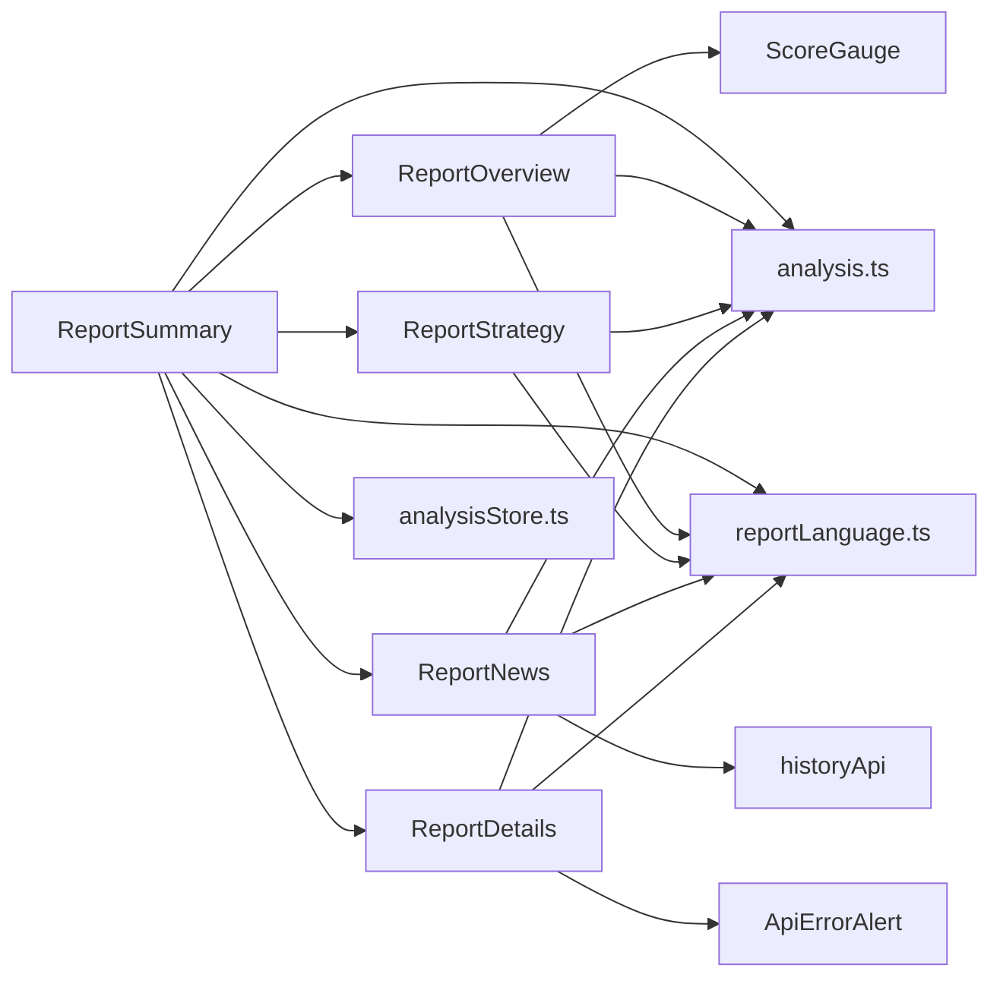

# 报告组件

<cite>
**本文引用的文件**
- [apps/dsa-web/src/components/report/ReportSummary.tsx](file://apps/dsa-web/src/components/report/ReportSummary.tsx)
- [apps/dsa-web/src/components/report/ReportOverview.tsx](file://apps/dsa-web/src/components/report/ReportOverview.tsx)
- [apps/dsa-web/src/components/report/ReportStrategy.tsx](file://apps/dsa-web/src/components/report/ReportStrategy.tsx)
- [apps/dsa-web/src/components/report/ReportNews.tsx](file://apps/dsa-web/src/components/report/ReportNews.tsx)
- [apps/dsa-web/src/components/report/ReportDetails.tsx](file://apps/dsa-web/src/components/report/ReportDetails.tsx)
- [apps/dsa-web/src/types/analysis.ts](file://apps/dsa-web/src/types/analysis.ts)
- [apps/dsa-web/src/utils/reportLanguage.ts](file://apps/dsa-web/src/utils/reportLanguage.ts)
- [apps/dsa-web/src/api/history.ts](file://apps/dsa-web/src/api/history.ts)
- [apps/dsa-web/src/components/common/Card.tsx](file://apps/dsa-web/src/components/common/Card.tsx)
- [apps/dsa-web/src/components/common/ScoreGauge.tsx](file://apps/dsa-web/src/components/common/ScoreGauge.tsx)
- [apps/dsa-web/src/components/common/ApiErrorAlert.tsx](file://apps/dsa-web/src/components/common/ApiErrorAlert.tsx)
- [apps/dsa-web/src/stores/analysisStore.ts](file://apps/dsa-web/src/stores/analysisStore.ts)
</cite>

## 目录
1. [简介](#简介)
2. [项目结构](#项目结构)
3. [核心组件](#核心组件)
4. [架构总览](#架构总览)
5. [组件详解](#组件详解)
6. [依赖关系分析](#依赖关系分析)
7. [性能考量](#性能考量)
8. [故障排查指南](#故障排查指南)
9. [结论](#结论)
10. [附录](#附录)

## 简介
本文件面向“报告展示组件”的技术文档，系统性解析以下组件的设计架构与数据展示逻辑：
- ReportSummary：完整报告聚合容器，整合概览、策略、资讯、详情四大区域，并在末尾标注分析模型。
- ReportOverview：终端风格的报告首屏，展示股票基础信息、关键结论、操作建议、趋势预测与市场情绪仪表盘。
- ReportStrategy：策略点位区，以四象限卡片形式呈现理想买入、二次买入、止损、止盈等关键价位。
- ReportNews：资讯区，按记录 ID 动态拉取并展示相关新闻，支持刷新、加载状态与错误提示。
- ReportDetails：透明度与追溯区，可折叠查看原始分析结果与上下文快照，支持一键复制。

组件围绕统一的分析报告数据模型进行渲染，具备响应式布局、主题变量适配、国际化文本切换能力，并通过 Store 管理异步加载与历史视图状态。

## 项目结构
报告组件位于前端 Web 应用的组件层，与类型定义、国际化工具、API 客户端、通用组件库以及状态管理共同协作，形成清晰的分层架构。

**图表来源**
- [apps/dsa-web/src/components/report/ReportSummary.tsx:1-62](file://apps/dsa-web/src/components/report/ReportSummary.tsx#L1-L62)
- [apps/dsa-web/src/components/report/ReportOverview.tsx:1-144](file://apps/dsa-web/src/components/report/ReportOverview.tsx#L1-L144)
- [apps/dsa-web/src/components/report/ReportStrategy.tsx:1-87](file://apps/dsa-web/src/components/report/ReportStrategy.tsx#L1-L87)
- [apps/dsa-web/src/components/report/ReportNews.tsx:1-141](file://apps/dsa-web/src/components/report/ReportNews.tsx#L1-L141)
- [apps/dsa-web/src/components/report/ReportDetails.tsx:1-133](file://apps/dsa-web/src/components/report/ReportDetails.tsx#L1-L133)
- [apps/dsa-web/src/components/common/Card.tsx:1-71](file://apps/dsa-web/src/components/common/Card.tsx#L1-L71)
- [apps/dsa-web/src/components/common/ScoreGauge.tsx:1-216](file://apps/dsa-web/src/components/common/ScoreGauge.tsx#L1-L216)
- [apps/dsa-web/src/components/common/ApiErrorAlert.tsx:1-59](file://apps/dsa-web/src/components/common/ApiErrorAlert.tsx#L1-L59)
- [apps/dsa-web/src/types/analysis.ts:1-245](file://apps/dsa-web/src/types/analysis.ts#L1-L245)
- [apps/dsa-web/src/utils/reportLanguage.ts:1-84](file://apps/dsa-web/src/utils/reportLanguage.ts#L1-L84)
- [apps/dsa-web/src/api/history.ts:1-93](file://apps/dsa-web/src/api/history.ts#L1-L93)
- [apps/dsa-web/src/stores/analysisStore.ts:1-69](file://apps/dsa-web/src/stores/analysisStore.ts#L1-L69)

**章节来源**
- [apps/dsa-web/src/components/report/ReportSummary.tsx:1-62](file://apps/dsa-web/src/components/report/ReportSummary.tsx#L1-L62)
- [apps/dsa-web/src/components/report/ReportOverview.tsx:1-144](file://apps/dsa-web/src/components/report/ReportOverview.tsx#L1-L144)
- [apps/dsa-web/src/components/report/ReportStrategy.tsx:1-87](file://apps/dsa-web/src/components/report/ReportStrategy.tsx#L1-L87)
- [apps/dsa-web/src/components/report/ReportNews.tsx:1-141](file://apps/dsa-web/src/components/report/ReportNews.tsx#L1-L141)
- [apps/dsa-web/src/components/report/ReportDetails.tsx:1-133](file://apps/dsa-web/src/components/report/ReportDetails.tsx#L1-L133)

## 核心组件
- ReportSummary：作为顶层聚合容器，负责数据归一化（兼容同步/异步返回）、语言选择、模型标识显示，并串联其他子组件。
- ReportOverview：首屏信息展示，包含股票名称/代码、当前价与涨跌幅、创建时间、关键结论、操作建议、趋势预测与市场情绪仪表盘。
- ReportStrategy：策略点位展示，使用带渐变色条的卡片，突出不同价位的视觉层次。
- ReportNews：基于 recordId 的资讯拉取与展示，支持刷新、加载动画、错误弹窗与无数据占位。
- ReportDetails：可折叠的透明度与追溯面板，支持复制 JSON 内容到剪贴板。

**章节来源**
- [apps/dsa-web/src/components/report/ReportSummary.tsx:1-62](file://apps/dsa-web/src/components/report/ReportSummary.tsx#L1-L62)
- [apps/dsa-web/src/components/report/ReportOverview.tsx:1-144](file://apps/dsa-web/src/components/report/ReportOverview.tsx#L1-L144)
- [apps/dsa-web/src/components/report/ReportStrategy.tsx:1-87](file://apps/dsa-web/src/components/report/ReportStrategy.tsx#L1-L87)
- [apps/dsa-web/src/components/report/ReportNews.tsx:1-141](file://apps/dsa-web/src/components/report/ReportNews.tsx#L1-L141)
- [apps/dsa-web/src/components/report/ReportDetails.tsx:1-133](file://apps/dsa-web/src/components/report/ReportDetails.tsx#L1-L133)

## 架构总览
下图展示了 ReportSummary 如何协调各子组件，并通过 API 与 Store 进行数据交互。

**图表来源**
- [apps/dsa-web/src/components/report/ReportSummary.tsx:18-61](file://apps/dsa-web/src/components/report/ReportSummary.tsx#L18-L61)
- [apps/dsa-web/src/components/report/ReportNews.tsx:27-49](file://apps/dsa-web/src/components/report/ReportNews.tsx#L27-L49)
- [apps/dsa-web/src/api/history.ts:59-69](file://apps/dsa-web/src/api/history.ts#L59-L69)
- [apps/dsa-web/src/stores/analysisStore.ts:24-68](file://apps/dsa-web/src/stores/analysisStore.ts#L24-L68)

## 组件详解

### ReportSummary：完整报告聚合容器
- 数据兼容：自动识别 AnalysisResult 与 AnalysisReport，提取 report.meta、report.summary、report.strategy、report.details。
- 语言与文案：根据 meta.reportLanguage 选择中文/英文文案；对模型名进行白名单过滤后在底部展示。
- 区域编排：依次渲染 ReportOverview、ReportStrategy、ReportNews、ReportDetails，并在末尾追加模型标识。
- 历史模式：通过 isHistory 参数控制是否进入历史视图，配合 Store 管理状态。

**图表来源**
- [apps/dsa-web/src/components/report/ReportSummary.tsx:18-61](file://apps/dsa-web/src/components/report/ReportSummary.tsx#L18-L61)
- [apps/dsa-web/src/utils/reportLanguage.ts:3-4](file://apps/dsa-web/src/utils/reportLanguage.ts#L3-L4)

**章节来源**
- [apps/dsa-web/src/components/report/ReportSummary.tsx:1-62](file://apps/dsa-web/src/components/report/ReportSummary.tsx#L1-L62)

### ReportOverview：终端风格概览区
- 布局：三栏网格（移动端单列），左侧为主信息区，右侧为情绪仪表盘。
- 价格与涨跌幅：根据涨跌幅动态设置颜色；为空时显示占位符。
- 关键结论、操作建议、趋势预测：从 summary 中读取，缺失时回退至默认文案。
- 情绪仪表盘：使用 ScoreGauge 渲染 Fear-Greed 指数，支持尺寸与标签开关。

**图表来源**
- [apps/dsa-web/src/components/report/ReportOverview.tsx:16-143](file://apps/dsa-web/src/components/report/ReportOverview.tsx#L16-L143)
- [apps/dsa-web/src/components/common/Card.tsx:17-70](file://apps/dsa-web/src/components/common/Card.tsx#L17-L70)
- [apps/dsa-web/src/components/common/ScoreGauge.tsx:19-215](file://apps/dsa-web/src/components/common/ScoreGauge.tsx#L19-L215)

**章节来源**
- [apps/dsa-web/src/components/report/ReportOverview.tsx:1-144](file://apps/dsa-web/src/components/report/ReportOverview.tsx#L1-L144)

### ReportStrategy：策略点位区
- 结构：四宫格卡片，分别对应理想买入、二次买入、止损、止盈。
- 视觉：每张卡片包含标签、数值与底部渐变色条，数值为空时显示占位符。
- 文案：根据语言映射为中文或英文标签。

**图表来源**
- [apps/dsa-web/src/components/report/ReportStrategy.tsx:42-86](file://apps/dsa-web/src/components/report/ReportStrategy.tsx#L42-L86)
- [apps/dsa-web/src/utils/reportLanguage.ts:83-84](file://apps/dsa-web/src/utils/reportLanguage.ts#L83-L84)

**章节来源**
- [apps/dsa-web/src/components/report/ReportStrategy.tsx:1-87](file://apps/dsa-web/src/components/report/ReportStrategy.tsx#L1-L87)

### ReportNews：资讯区
- 数据来源：通过 historyApi.getNews(recordId, limit) 拉取新闻列表。
- 状态管理：isLoading、items、error 三态控制，支持手动刷新。
- 展示细节：标题、摘要、链接；无数据时显示提示；错误时弹出 ApiErrorAlert 并提供重试按钮。
- 性能注意：使用 useCallback 避免重复订阅；useEffect 在 recordId 变更时触发请求。

**图表来源**
- [apps/dsa-web/src/components/report/ReportNews.tsx:27-49](file://apps/dsa-web/src/components/report/ReportNews.tsx#L27-L49)
- [apps/dsa-web/src/api/history.ts:59-69](file://apps/dsa-web/src/api/history.ts#L59-L69)

**章节来源**
- [apps/dsa-web/src/components/report/ReportNews.tsx:1-141](file://apps/dsa-web/src/components/report/ReportNews.tsx#L1-L141)
- [apps/dsa-web/src/components/common/ApiErrorAlert.tsx:13-58](file://apps/dsa-web/src/components/common/ApiErrorAlert.tsx#L13-L58)

### ReportDetails：透明度与追溯区
- 功能：可折叠查看原始分析结果与上下文快照，支持一键复制 JSON。
- 状态：showRaw、showSnapshot 控制展开状态；copied 控制复制反馈。
- 数据：当 details.rawResult 或 details.contextSnapshot 存在或 recordId 存在时渲染。
- 交互：点击按钮切换折叠状态；复制按钮写入剪贴板并短暂提示。

**图表来源**
- [apps/dsa-web/src/components/report/ReportDetails.tsx:16-132](file://apps/dsa-web/src/components/report/ReportDetails.tsx#L16-L132)

**章节来源**
- [apps/dsa-web/src/components/report/ReportDetails.tsx:1-133](file://apps/dsa-web/src/components/report/ReportDetails.tsx#L1-L133)

## 依赖关系分析
- 组件间耦合：ReportSummary 作为编排者，向下依赖各子组件；子组件之间低耦合，仅共享类型与国际化工具。
- 外部依赖：ReportNews 依赖 historyApi；ReportOverview 依赖 ScoreGauge；错误弹窗依赖 ApiErrorAlert。
- 类型与国际化：analysis.ts 提供统一的数据契约；reportLanguage.ts 提供文案与语言标准化。
- 状态管理：analysisStore.ts 提供异步加载、历史视图切换与错误状态管理。

**图表来源**
- [apps/dsa-web/src/components/report/ReportSummary.tsx:1-62](file://apps/dsa-web/src/components/report/ReportSummary.tsx#L1-L62)
- [apps/dsa-web/src/components/report/ReportOverview.tsx:1-144](file://apps/dsa-web/src/components/report/ReportOverview.tsx#L1-L144)
- [apps/dsa-web/src/components/report/ReportStrategy.tsx:1-87](file://apps/dsa-web/src/components/report/ReportStrategy.tsx#L1-L87)
- [apps/dsa-web/src/components/report/ReportNews.tsx:1-141](file://apps/dsa-web/src/components/report/ReportNews.tsx#L1-L141)
- [apps/dsa-web/src/components/report/ReportDetails.tsx:1-133](file://apps/dsa-web/src/components/report/ReportDetails.tsx#L1-L133)
- [apps/dsa-web/src/components/common/ScoreGauge.tsx:1-216](file://apps/dsa-web/src/components/common/ScoreGauge.tsx#L1-L216)
- [apps/dsa-web/src/api/history.ts:1-93](file://apps/dsa-web/src/api/history.ts#L1-L93)
- [apps/dsa-web/src/components/common/ApiErrorAlert.tsx:1-59](file://apps/dsa-web/src/components/common/ApiErrorAlert.tsx#L1-L59)
- [apps/dsa-web/src/types/analysis.ts:1-245](file://apps/dsa-web/src/types/analysis.ts#L1-L245)
- [apps/dsa-web/src/utils/reportLanguage.ts:1-84](file://apps/dsa-web/src/utils/reportLanguage.ts#L1-L84)
- [apps/dsa-web/src/stores/analysisStore.ts:1-69](file://apps/dsa-web/src/stores/analysisStore.ts#L1-L69)

**章节来源**
- [apps/dsa-web/src/types/analysis.ts:1-245](file://apps/dsa-web/src/types/analysis.ts#L1-L245)
- [apps/dsa-web/src/utils/reportLanguage.ts:1-84](file://apps/dsa-web/src/utils/reportLanguage.ts#L1-L84)
- [apps/dsa-web/src/api/history.ts:1-93](file://apps/dsa-web/src/api/history.ts#L1-L93)
- [apps/dsa-web/src/stores/analysisStore.ts:1-69](file://apps/dsa-web/src/stores/analysisStore.ts#L1-L69)

## 性能考量
- 渲染优化
  - 使用 CSS Grid/Flex 实现响应式布局，减少复杂计算。
  - 情绪仪表盘采用 SVG 渐变与滤镜，避免额外图片资源。
- 数据加载
  - ReportNews 使用 useCallback 缓解重复订阅；useEffect 仅在 recordId 变化时触发请求。
  - Store 管理加载与错误状态，避免重复请求与无效渲染。
- 交互体验
  - ScoreGauge 使用 requestAnimationFrame 实现平滑过渡动画，降低主线程压力。
  - 折叠面板使用 CSS 动画与条件渲染，避免不必要的 DOM 更新。
- 可访问性
  - 使用语义化标签与合适的对比度，确保在浅/深色主题下均清晰可见。

[本节为通用性能建议，无需特定文件来源]

## 故障排查指南
- 资讯加载失败
  - 现象：显示错误弹窗，提供“重试”按钮。
  - 处理：点击重试触发重新请求；若仍失败，检查网络与后端服务。
- 无相关资讯
  - 现象：显示“暂无相关资讯”提示。
  - 处理：确认 recordId 是否正确；检查后端接口返回。
- 复制 JSON 失败
  - 现象：复制按钮无反应或报错。
  - 处理：检查浏览器权限与安全策略；尝试在 HTTPS 环境下使用。
- 模型名未显示
  - 现象：报告末尾未显示分析模型。
  - 处理：确认 meta.modelUsed 是否为有效值；检查白名单过滤逻辑。

**章节来源**
- [apps/dsa-web/src/components/report/ReportNews.tsx:76-83](file://apps/dsa-web/src/components/report/ReportNews.tsx#L76-L83)
- [apps/dsa-web/src/components/report/ReportDetails.tsx:31-39](file://apps/dsa-web/src/components/report/ReportDetails.tsx#L31-L39)
- [apps/dsa-web/src/components/report/ReportSummary.tsx:31-33](file://apps/dsa-web/src/components/report/ReportSummary.tsx#L31-L33)

## 结论
报告组件通过清晰的分层设计与统一的数据契约，实现了从概览到策略、资讯与追溯的完整展示链路。组件具备良好的国际化与主题适配能力，结合 Store 与 API 客户端，提供了稳定的异步加载与错误处理机制。建议在扩展新功能时遵循现有类型定义与命名规范，保持组件间的低耦合与高内聚。

[本节为总结性内容，无需特定文件来源]

## 附录

### 使用示例与数据格式要求
- 传入数据
  - 支持 AnalysisResult 或 AnalysisReport 两种形态；优先使用 AnalysisReport。
  - 必填字段：meta.stockCode、meta.stockName、meta.reportLanguage、meta.createdAt。
  - 可选字段：meta.currentPrice、meta.changePct、summary.*、strategy.*、details.*。
- 组件调用
  - ReportSummary：传入 data 与可选 isHistory。
  - ReportNews：传入 recordId 与可选 limit。
  - ReportDetails：传入 details 与 recordId（用于显示记录 ID）。
- 国际化
  - 通过 meta.reportLanguage 或 props.language 指定语言，支持 zh/en。
- 主题适配
  - 使用 CSS 变量控制颜色与尺寸，可在全局样式中覆盖。
- 响应式设计
  - 使用 Tailwind 响应式断点，确保在移动端与桌面端的良好体验。

**章节来源**
- [apps/dsa-web/src/types/analysis.ts:20-90](file://apps/dsa-web/src/types/analysis.ts#L20-L90)
- [apps/dsa-web/src/utils/reportLanguage.ts:3-84](file://apps/dsa-web/src/utils/reportLanguage.ts#L3-L84)
- [apps/dsa-web/src/components/report/ReportNews.tsx:20-15](file://apps/dsa-web/src/components/report/ReportNews.tsx#L20-L15)
- [apps/dsa-web/src/components/report/ReportDetails.tsx:7-11](file://apps/dsa-web/src/components/report/ReportDetails.tsx#L7-L11)

### 扩展开发指南
- 新增展示区域
  - 在 ReportSummary 中新增区域并传入必要数据。
  - 若涉及外部数据，新增对应 API 方法并在组件中调用。
- 新增策略指标
  - 在 ReportStrategy 中添加新的指标项，更新文案映射与颜色配置。
- 新增语言支持
  - 在 reportLanguage.ts 中扩展文案字典，并在组件中使用 getReportText。
- 性能优化建议
  - 对长列表使用虚拟滚动或分页。
  - 对大 JSON 复制场景，考虑分段复制或导出为文件。
  - 对频繁更新的状态，使用防抖/节流策略。

[本节为通用指导，无需特定文件来源]