# 通用组件

<cite>
**本文引用的文件**
- [apps/dsa-web/src/components/common/Button.tsx](file://apps/dsa-web/src/components/common/Button.tsx)
- [apps/dsa-web/src/components/common/Card.tsx](file://apps/dsa-web/src/components/common/Card.tsx)
- [apps/dsa-web/src/components/common/Drawer.tsx](file://apps/dsa-web/src/components/common/Drawer.tsx)
- [apps/dsa-web/src/components/common/Select.tsx](file://apps/dsa-web/src/components/common/Select.tsx)
- [apps/dsa-web/src/components/common/Badge.tsx](file://apps/dsa-web/src/components/common/Badge.tsx)
- [apps/dsa-web/src/components/common/Collapsible.tsx](file://apps/dsa-web/src/components/common/Collapsible.tsx)
- [apps/dsa-web/src/components/common/JsonViewer.tsx](file://apps/dsa-web/src/components/common/JsonViewer.tsx)
- [apps/dsa-web/src/components/common/Loading.tsx](file://apps/dsa-web/src/components/common/Loading.tsx)
- [apps/dsa-web/src/components/common/Pagination.tsx](file://apps/dsa-web/src/components/common/Pagination.tsx)
- [apps/dsa-web/src/components/common/ScoreGauge.tsx](file://apps/dsa-web/src/components/common/ScoreGauge.tsx)
- [apps/dsa-web/src/components/common/index.ts](file://apps/dsa-web/src/components/common/index.ts)
- [apps/dsa-web/src/utils/cn.ts](file://apps/dsa-web/src/utils/cn.ts)
- [apps/dsa-web/src/types/analysis.ts](file://apps/dsa-web/src/types/analysis.ts)
- [apps/dsa-web/src/utils/reportLanguage.ts](file://apps/dsa-web/src/utils/reportLanguage.ts)
</cite>

## 目录
1. [简介](#简介)
2. [项目结构](#项目结构)
3. [核心组件](#核心组件)
4. [架构总览](#架构总览)
5. [详细组件分析](#详细组件分析)
6. [依赖关系分析](#依赖关系分析)
7. [性能考量](#性能考量)
8. [故障排查指南](#故障排查指南)
9. [结论](#结论)
10. [附录](#附录)

## 简介
本文件为通用UI组件的技术文档，覆盖 Button、Card、Drawer、Select、Badge、Collapsible、JsonViewer、Loading、Pagination、ScoreGauge 等组件的设计理念、实现细节与使用方法。文档从 props 接口、事件回调、样式定制与主题支持、可复用性设计原则、状态管理与生命周期、性能优化、无障碍访问与浏览器兼容性、以及组件组合模式等方面进行系统阐述，并提供最佳实践与扩展指南。

## 项目结构
通用组件集中位于前端应用的公共组件目录，采用按功能模块划分的组织方式，便于在页面与布局组件中复用。组件通过统一的导出入口集中暴露，便于按需引入与维护。

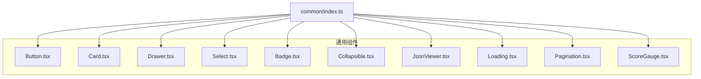

图表来源
- [apps/dsa-web/src/components/common/index.ts:1-32](file://apps/dsa-web/src/components/common/index.ts#L1-L32)

章节来源
- [apps/dsa-web/src/components/common/index.ts:1-32](file://apps/dsa-web/src/components/common/index.ts#L1-L32)

## 核心组件
本节概述各组件的核心职责与典型用法，帮助快速定位与选择合适的组件。

- Button：终端风格多变体按钮，支持尺寸、加载态、发光效果与无障碍属性。
- Card：卡片容器，支持标题/副标题、多种变体与悬停交互。
- Drawer：侧边抽屉，支持左右位置、Esc 关闭、背景遮罩与滚动区域。
- Select：下拉选择器，支持占位、禁用、可选搜索与无障碍标签。
- Badge：徽标，支持多语义变体、尺寸与发光效果。
- Collapsible：可折叠面板，支持默认展开、图标与动画收合。
- JsonViewer：JSON 可视化与复制，支持最大高度与语法高亮。
- Loading：加载提示，支持自定义文案与容器样式。
- Pagination：分页导航，支持省略号与页码切换。
- ScoreGauge：情绪分数仪表盘，支持动画过渡、多尺寸与多语言标签。

章节来源
- [apps/dsa-web/src/components/common/Button.tsx:1-98](file://apps/dsa-web/src/components/common/Button.tsx#L1-L98)
- [apps/dsa-web/src/components/common/Card.tsx:1-71](file://apps/dsa-web/src/components/common/Card.tsx#L1-L71)
- [apps/dsa-web/src/components/common/Drawer.tsx:1-109](file://apps/dsa-web/src/components/common/Drawer.tsx#L1-L109)
- [apps/dsa-web/src/components/common/Select.tsx:1-82](file://apps/dsa-web/src/components/common/Select.tsx#L1-L82)
- [apps/dsa-web/src/components/common/Badge.tsx:1-58](file://apps/dsa-web/src/components/common/Badge.tsx#L1-L58)
- [apps/dsa-web/src/components/common/Collapsible.tsx:1-61](file://apps/dsa-web/src/components/common/Collapsible.tsx#L1-L61)
- [apps/dsa-web/src/components/common/JsonViewer.tsx:1-93](file://apps/dsa-web/src/components/common/JsonViewer.tsx#L1-L93)
- [apps/dsa-web/src/components/common/Loading.tsx:1-21](file://apps/dsa-web/src/components/common/Loading.tsx#L1-L21)
- [apps/dsa-web/src/components/common/Pagination.tsx:1-111](file://apps/dsa-web/src/components/common/Pagination.tsx#L1-L111)
- [apps/dsa-web/src/components/common/ScoreGauge.tsx:1-216](file://apps/dsa-web/src/components/common/ScoreGauge.tsx#L1-L216)

## 架构总览
通用组件遵循“单一职责、最小依赖”的设计原则，通过工具函数与类型定义实现跨组件的一致性与可维护性。组件间不直接耦合，通过 props 与事件回调进行协作；主题与样式通过 Tailwind 类名与 CSS 变量实现可配置。

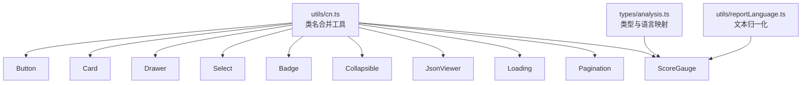

图表来源
- [apps/dsa-web/src/utils/cn.ts:1-7](file://apps/dsa-web/src/utils/cn.ts#L1-L7)
- [apps/dsa-web/src/types/analysis.ts:1-245](file://apps/dsa-web/src/types/analysis.ts#L1-L245)
- [apps/dsa-web/src/utils/reportLanguage.ts:1-84](file://apps/dsa-web/src/utils/reportLanguage.ts#L1-L84)
- [apps/dsa-web/src/components/common/ScoreGauge.tsx:1-216](file://apps/dsa-web/src/components/common/ScoreGauge.tsx#L1-L216)

## 详细组件分析

### Button 组件
- 设计理念
  - 提供多种视觉变体与尺寸，满足不同业务场景；支持加载态与发光效果，增强反馈。
  - 使用无障碍属性标记加载状态，提升可访问性。
- Props 接口
  - 继承原生 button 属性，新增 variant、size、isLoading、loadingText、glow 等。
- 事件与状态
  - 通过内部状态控制加载态显示；禁用态与加载态同时生效。
- 样式与主题
  - 通过常量表维护尺寸与变体样式，结合 cn 工具合并类名；支持 CSS 变量与主题色。
- 最佳实践
  - 优先使用语义化变体；在异步操作中启用加载态与不可点击状态。
- 扩展指南
  - 新增变体时，扩展变体样式表并保持命名一致性。

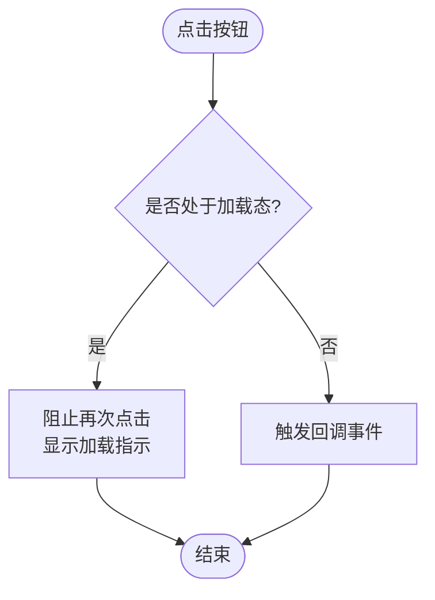

图表来源
- [apps/dsa-web/src/components/common/Button.tsx:37-97](file://apps/dsa-web/src/components/common/Button.tsx#L37-L97)

章节来源
- [apps/dsa-web/src/components/common/Button.tsx:1-98](file://apps/dsa-web/src/components/common/Button.tsx#L1-L98)

### Card 组件
- 设计理念
  - 提供终端风格卡片容器，支持标题/副标题、内边距与悬停交互。
- Props 接口
  - 支持 title、subtitle、children、variant、hoverable、padding 等。
- 样式与主题
  - 通过变体与内边距映射生成类名；梯度卡片使用额外的内外层结构。
- 最佳实践
  - 在需要强调或突出内容时使用梯度卡片；在列表项中使用默认卡片。

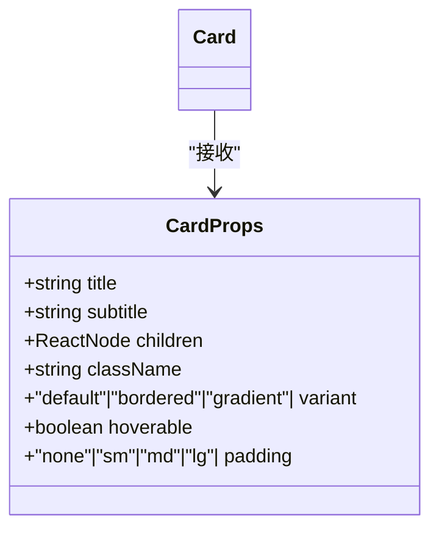

图表来源
- [apps/dsa-web/src/components/common/Card.tsx:4-12](file://apps/dsa-web/src/components/common/Card.tsx#L4-L12)

章节来源
- [apps/dsa-web/src/components/common/Card.tsx:1-71](file://apps/dsa-web/src/components/common/Card.tsx#L1-L71)

### Drawer 组件
- 设计理念
  - 侧边抽屉，支持左右位置、Esc 关闭、背景遮罩与滚动区域；通过全局计数控制 body 滚动锁定。
- Props 接口
  - isOpen、onClose、title、children、width、zIndex、side。
- 生命周期与状态
  - 打开时注册键盘事件与滚动锁定；关闭时清理事件与恢复滚动。
- 最佳实践
  - 合理设置宽度与层级；确保标题具备可访问性标识。

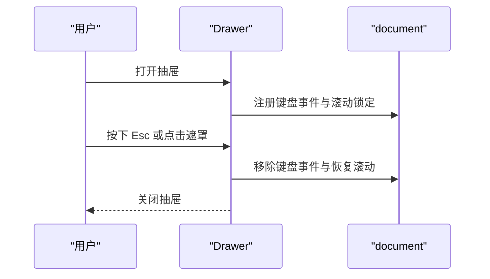

图表来源
- [apps/dsa-web/src/components/common/Drawer.tsx:20-108](file://apps/dsa-web/src/components/common/Drawer.tsx#L20-L108)

章节来源
- [apps/dsa-web/src/components/common/Drawer.tsx:1-109](file://apps/dsa-web/src/components/common/Drawer.tsx#L1-L109)

### Select 组件
- 设计理念
  - 下拉选择器，支持占位、禁用、可选搜索与无障碍标签；使用唯一 id 保证 label 关联。
- Props 接口
  - id、value、onChange、options、label、placeholder、disabled、className、searchable、searchPlaceholder、emptyText。
- 最佳实践
  - 为必选项提供占位；在复杂场景考虑搜索能力。

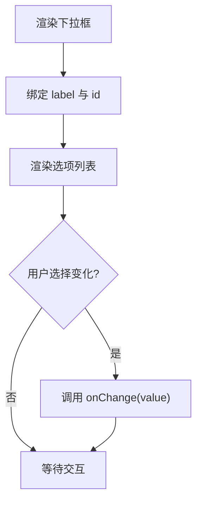

图表来源
- [apps/dsa-web/src/components/common/Select.tsx:26-81](file://apps/dsa-web/src/components/common/Select.tsx#L26-L81)

章节来源
- [apps/dsa-web/src/components/common/Select.tsx:1-82](file://apps/dsa-web/src/components/common/Select.tsx#L1-L82)

### Badge 组件
- 设计理念
  - 徽标用于标注状态或标签，支持多语义变体、尺寸与发光效果。
- Props 接口
  - children、variant、size、glow、className。
- 最佳实践
  - 使用语义化变体表达状态；在需要强调时启用发光。

章节来源
- [apps/dsa-web/src/components/common/Badge.tsx:1-58](file://apps/dsa-web/src/components/common/Badge.tsx#L1-L58)

### Collapsible 组件
- 设计理念
  - 可折叠面板，支持默认展开、图标与动画收合，适合详情块与设置面板。
- Props 接口
  - title、children、defaultOpen、icon、className。
- 最佳实践
  - 将长内容放入折叠面板，减少初始渲染压力。

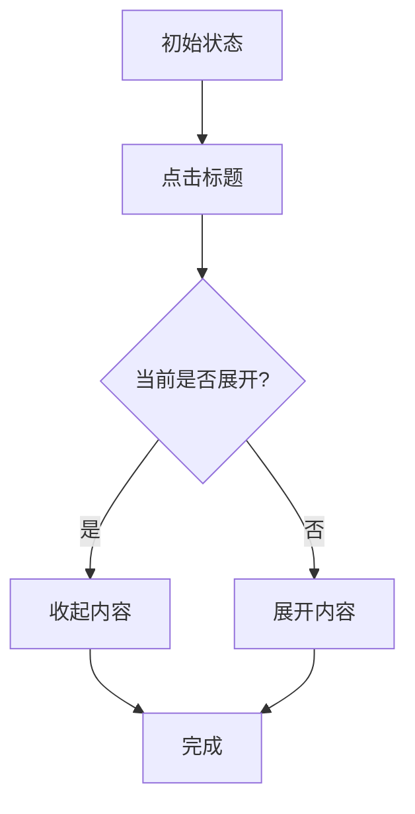

图表来源
- [apps/dsa-web/src/components/common/Collapsible.tsx:15-59](file://apps/dsa-web/src/components/common/Collapsible.tsx#L15-L59)

章节来源
- [apps/dsa-web/src/components/common/Collapsible.tsx:1-61](file://apps/dsa-web/src/components/common/Collapsible.tsx#L1-L61)

### JsonViewer 组件
- 设计理念
  - JSON 可视化与复制，支持最大高度与语法高亮；在无数据时显示提示。
- Props 接口
  - data、maxHeight、className。
- 最佳实践
  - 为大数据集设置合理最大高度；提供复制能力提升调试效率。

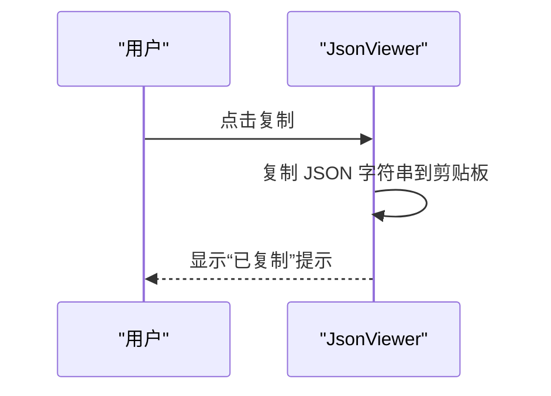

图表来源
- [apps/dsa-web/src/components/common/JsonViewer.tsx:13-92](file://apps/dsa-web/src/components/common/JsonViewer.tsx#L13-L92)

章节来源
- [apps/dsa-web/src/components/common/JsonViewer.tsx:1-93](file://apps/dsa-web/src/components/common/JsonViewer.tsx#L1-L93)

### Loading 组件
- 设计理念
  - 加载提示，支持自定义文案与容器样式，常用于异步数据加载。
- Props 接口
  - label、className。
- 最佳实践
  - 在关键路径上提供明确的加载提示，避免用户困惑。

章节来源
- [apps/dsa-web/src/components/common/Loading.tsx:1-21](file://apps/dsa-web/src/components/common/Loading.tsx#L1-L21)

### Pagination 组件
- 设计理念
  - 分页导航，支持省略号与页码切换，适合大量数据分页浏览。
- Props 接口
  - currentPage、totalPages、onPageChange、className。
- 最佳实践
  - 当页数较多时启用省略号；确保边界状态（首页/末页）禁用。

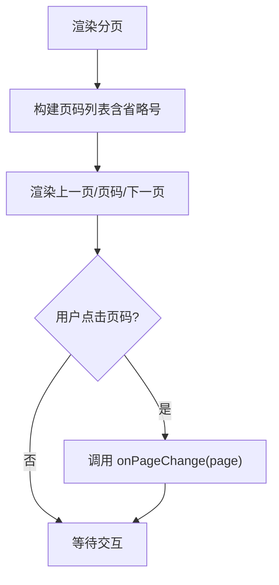

图表来源
- [apps/dsa-web/src/components/common/Pagination.tsx:47-109](file://apps/dsa-web/src/components/common/Pagination.tsx#L47-L109)

章节来源
- [apps/dsa-web/src/components/common/Pagination.tsx:1-111](file://apps/dsa-web/src/components/common/Pagination.tsx#L1-L111)

### ScoreGauge 组件
- 设计理念
  - 情绪分数仪表盘，支持动画过渡、多尺寸与多语言标签；根据分数动态计算颜色与标签。
- Props 接口
  - score、size、showLabel、className、language。
- 状态与生命周期
  - 使用 requestAnimationFrame 实现平滑动画过渡；清理动画资源。
- 语言与文本
  - 通过语言归一化与文本映射提供中英文标签。
- 最佳实践
  - 在展示市场情绪或分析结果时使用；注意动画性能与可读性平衡。

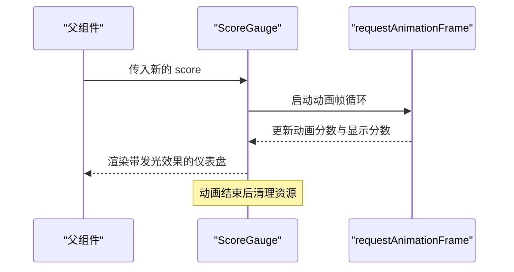

图表来源
- [apps/dsa-web/src/components/common/ScoreGauge.tsx:19-64](file://apps/dsa-web/src/components/common/ScoreGauge.tsx#L19-L64)
- [apps/dsa-web/src/utils/reportLanguage.ts:1-84](file://apps/dsa-web/src/utils/reportLanguage.ts#L1-L84)
- [apps/dsa-web/src/types/analysis.ts:220-235](file://apps/dsa-web/src/types/analysis.ts#L220-L235)

章节来源
- [apps/dsa-web/src/components/common/ScoreGauge.tsx:1-216](file://apps/dsa-web/src/components/common/ScoreGauge.tsx#L1-L216)
- [apps/dsa-web/src/utils/reportLanguage.ts:1-84](file://apps/dsa-web/src/utils/reportLanguage.ts#L1-L84)
- [apps/dsa-web/src/types/analysis.ts:220-235](file://apps/dsa-web/src/types/analysis.ts#L220-L235)

## 依赖关系分析
- 组件依赖
  - 所有组件均依赖 cn 工具进行类名合并，确保样式一致性与可维护性。
  - ScoreGauge 依赖类型与语言工具，实现多语言标签与颜色映射。
- 导出与复用
  - 通过 common/index.ts 统一导出，便于在页面与布局组件中按需引入。

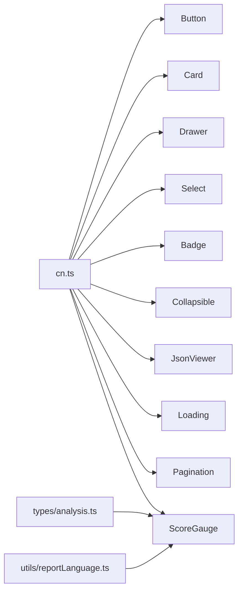

图表来源
- [apps/dsa-web/src/utils/cn.ts:1-7](file://apps/dsa-web/src/utils/cn.ts#L1-L7)
- [apps/dsa-web/src/types/analysis.ts:1-245](file://apps/dsa-web/src/types/analysis.ts#L1-L245)
- [apps/dsa-web/src/utils/reportLanguage.ts:1-84](file://apps/dsa-web/src/utils/reportLanguage.ts#L1-L84)

章节来源
- [apps/dsa-web/src/utils/cn.ts:1-7](file://apps/dsa-web/src/utils/cn.ts#L1-L7)
- [apps/dsa-web/src/components/common/index.ts:1-32](file://apps/dsa-web/src/components/common/index.ts#L1-L32)

## 性能考量
- 动画与渲染
  - ScoreGauge 使用 requestAnimationFrame 控制动画，避免阻塞主线程；建议在频繁更新时限制更新频率。
- DOM 与滚动
  - Drawer 打开时锁定 body 滚动，关闭时恢复；避免多次打开导致的事件累积。
- 样式合并
  - 使用 cn 工具合并类名，减少无效样式叠加；在高频组件中避免频繁拼接字符串。
- 数据处理
  - JsonViewer 对大对象进行 JSON 序列化与高亮处理，建议对超大数据集进行分页或懒加载。

## 故障排查指南
- 无障碍问题
  - Button 与 Drawer 正确设置 aria 属性与键盘事件；如出现可访问性异常，检查 aria-* 与 role 的一致性。
- 样式冲突
  - 若出现样式错乱，检查 cn 合并顺序与 Tailwind 类名冲突；确认主题变量未被覆盖。
- 动画卡顿
  - ScoreGauge 动画卡顿时，检查是否有过多并发动画；适当降低动画时长或减少更新频率。
- 事件泄漏
  - Drawer 未正确清理键盘事件与滚动锁定时，可能导致页面无法滚动；确保在关闭时执行清理逻辑。

章节来源
- [apps/dsa-web/src/components/common/Drawer.tsx:39-55](file://apps/dsa-web/src/components/common/Drawer.tsx#L39-L55)
- [apps/dsa-web/src/components/common/ScoreGauge.tsx:59-64](file://apps/dsa-web/src/components/common/ScoreGauge.tsx#L59-L64)

## 结论
通用组件通过清晰的接口设计、一致的样式体系与良好的可访问性支持，实现了高复用性与易维护性。在实际项目中，建议遵循本文档的最佳实践与扩展指南，结合具体业务场景进行定制与优化。

## 附录
- 组件组合使用场景
  - 报表详情：ScoreGauge + Card + Collapsible，用于展示情绪指数与折叠详情。
  - 设置页面：Badge + Select + Button，用于状态标注与配置切换。
  - 列表分页：Pagination + Loading，用于数据分页与加载提示。
  - 抽屉详情：Drawer + JsonViewer，用于侧边查看结构化数据。
- 浏览器兼容性
  - 组件基于现代浏览器特性实现；如需兼容旧环境，建议添加必要的 polyfill 与降级方案。
- 主题与样式定制
  - 通过 CSS 变量与 Tailwind 类名实现主题切换；在新增变体时保持命名规范与样式一致性。