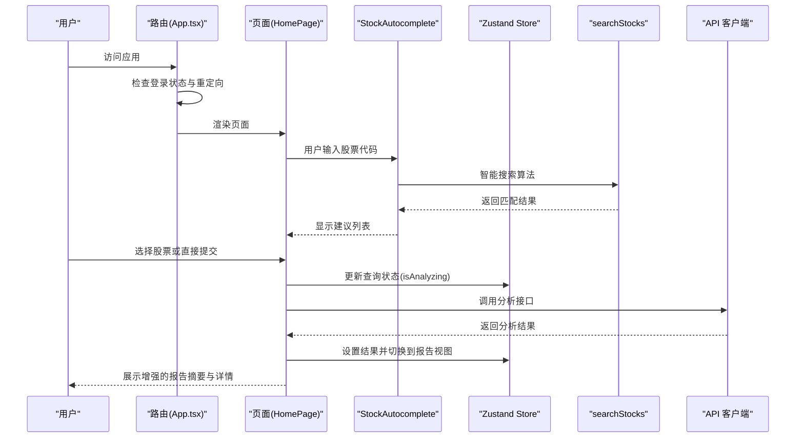
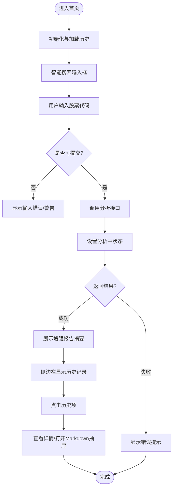
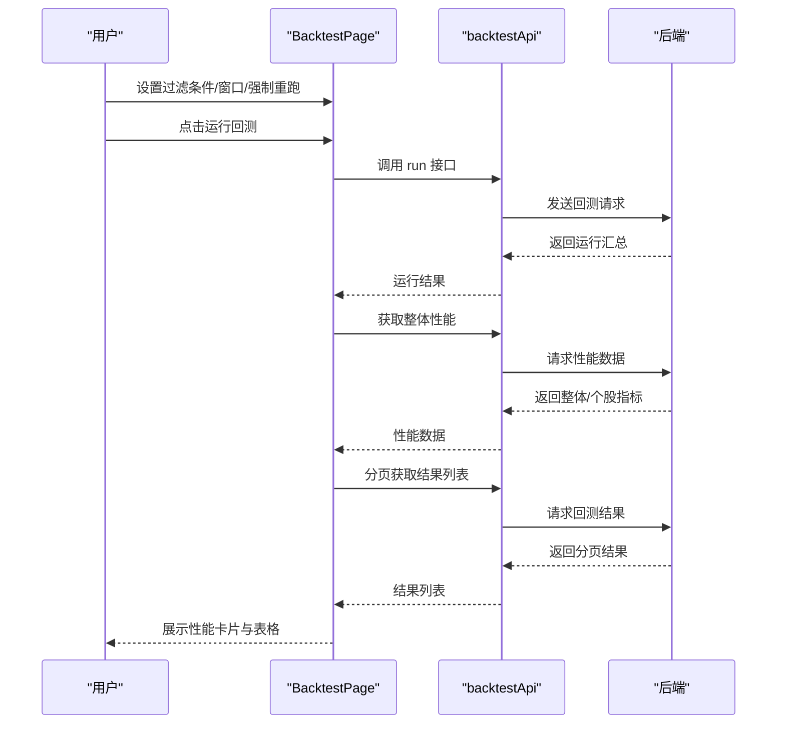
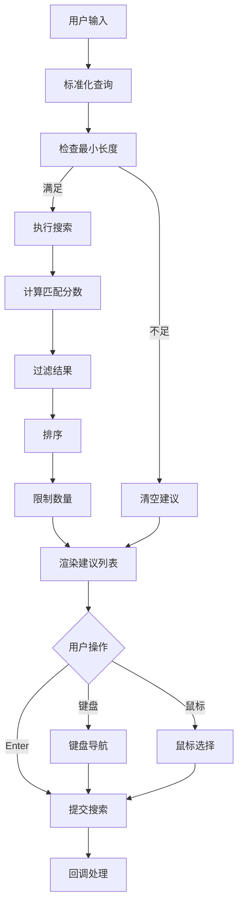
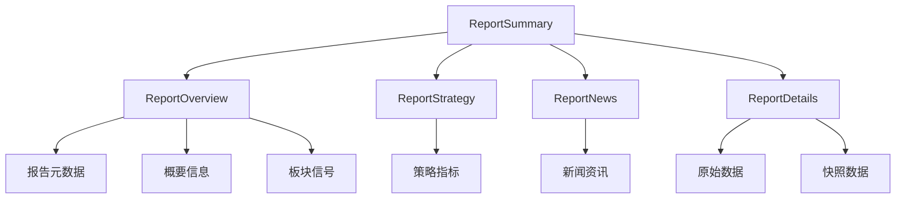
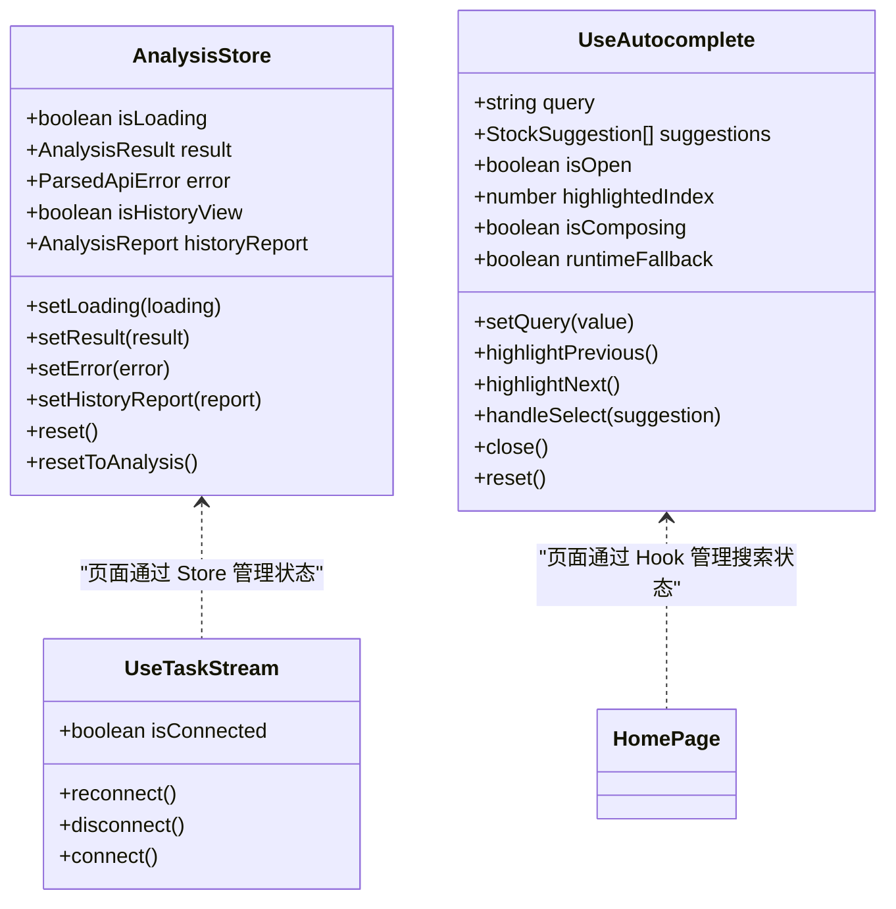
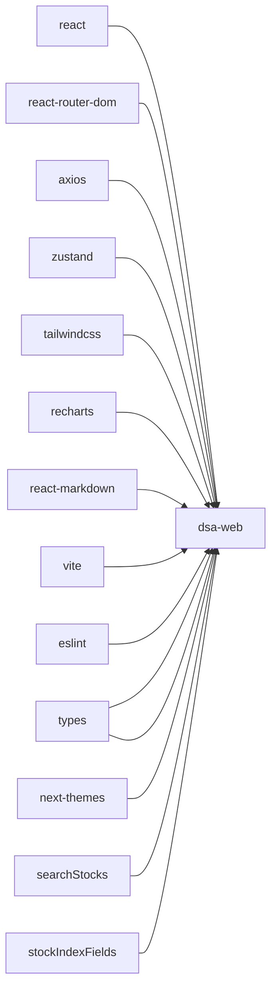

# Web管理界面

<cite>
**本文档引用的文件**
- [apps/dsa-web/src/App.tsx](file://apps/dsa-web/src/App.tsx)
- [apps/dsa-web/src/main.tsx](file://apps/dsa-web/src/main.tsx)
- [apps/dsa-web/src/pages/HomePage.tsx](file://apps/dsa-web/src/pages/HomePage.tsx)
- [apps/dsa-web/src/pages/BacktestPage.tsx](file://apps/dsa-web/src/pages/BacktestPage.tsx)
- [apps/dsa-web/src/pages/NotFoundPage.tsx](file://apps/dsa-web/src/pages/NotFoundPage.tsx)
- [apps/dsa-web/src/stores/index.ts](file://apps/dsa-web/src/stores/index.ts)
- [apps/dsa-web/src/stores/analysisStore.ts](file://apps/dsa-web/src/stores/analysisStore.ts)
- [apps/dsa-web/src/api/index.ts](file://apps/dsa-web/src/api/index.ts)
- [apps/dsa-web/src/components/common/index.ts](file://apps/dsa-web/src/components/common/index.ts)
- [apps/dsa-web/src/components/common/Button.tsx](file://apps/dsa-web/src/components/common/Button.tsx)
- [apps/dsa-web/src/components/history/HistoryList.tsx](file://apps/dsa-web/src/components/history/HistoryList.tsx)
- [apps/dsa-web/src/components/report/ReportSummary.tsx](file://apps/dsa-web/src/components/report/ReportSummary.tsx)
- [apps/dsa-web/src/components/report/ReportOverview.tsx](file://apps/dsa-web/src/components/report/ReportOverview.tsx)
- [apps/dsa-web/src/components/report/ReportStrategy.tsx](file://apps/dsa-web/src/components/report/ReportStrategy.tsx)
- [apps/dsa-web/src/components/report/ReportNews.tsx](file://apps/dsa-web/src/components/report/ReportNews.tsx)
- [apps/dsa-web/src/components/report/ReportDetails.tsx](file://apps/dsa-web/src/components/report/ReportDetails.tsx)
- [apps/dsa-web/src/components/report/ReportMarkdown.tsx](file://apps/dsa-web/src/components/report/ReportMarkdown.tsx)
- [apps/dsa-web/src/components/dashboard/DashboardStateBlock.tsx](file://apps/dsa-web/src/components/dashboard/DashboardStateBlock.tsx)
- [apps/dsa-web/src/components/dashboard/DashboardPanelHeader.tsx](file://apps/dsa-web/src/components/dashboard/DashboardPanelHeader.tsx)
- [apps/dsa-web/src/components/StockAutocomplete/StockAutocomplete.tsx](file://apps/dsa-web/src/components/StockAutocomplete/StockAutocomplete.tsx)
- [apps/dsa-web/src/components/StockAutocomplete/SuggestionsList.tsx](file://apps/dsa-web/src/components/StockAutocomplete/SuggestionsList.tsx)
- [apps/dsa-web/src/hooks/useAutocomplete.ts](file://apps/dsa-web/src/hooks/useAutocomplete.ts)
- [apps/dsa-web/src/hooks/useTaskStream.ts](file://apps/dsa-web/src/hooks/useTaskStream.ts)
- [apps/dsa-web/src/utils/searchStocks.ts](file://apps/dsa-web/src/utils/searchStocks.ts)
- [apps/dsa-web/src/utils/stockIndexFields.ts](file://apps/dsa-web/src/utils/stockIndexFields.ts)
- [apps/dsa-web/src/types/stockIndex.ts](file://apps/dsa-web/src/types/stockIndex.ts)
- [apps/dsa-web/vite.config.ts](file://apps/dsa-web/vite.config.ts)
- [apps/dsa-web/package.json](file://apps/dsa-web/package.json)
</cite>

## 更新摘要
**变更内容**
- 新增股票自动完成系统组件，提供智能搜索和建议功能
- 仪表板重新设计，引入新的状态块和面板头部组件
- 报告系统增强，包含概览、策略、资讯、详情四个区域的终端风格展示
- 改进的搜索算法和匹配评分系统
- 增强的无障碍支持和运行时降级机制

## 目录
1. [简介](#简介)
2. [项目结构](#项目结构)
3. [核心组件](#核心组件)
4. [架构总览](#架构总览)
5. [详细组件分析](#详细组件分析)
6. [依赖关系分析](#依赖关系分析)
7. [性能考量](#性能考量)
8. [故障排查指南](#故障排查指南)
9. [结论](#结论)
10. [附录](#附录)

## 简介
本项目为基于 React + TypeScript 的 Web 管理界面，采用现代化前端技术栈，结合 Zustand 状态管理、Axios API 客户端、TailwindCSS 样式系统与 Vite 构建工具，提供股票分析与回测的可视化管理平台。系统包含首页仪表盘、回测页面、404 页面等核心页面，支持任务流实时推送、历史记录管理、报告展示与 Markdown 查看器、分页与筛选等功能。

**重大改进**：
- **股票自动完成系统**：全新的智能搜索组件，支持代码、名称、拼音等多种匹配方式
- **仪表板重新设计**：引入状态块和面板头部组件，提供更好的用户体验
- **报告增强功能**：完整的报告展示系统，包含概览、策略、资讯、详情四个区域

## 项目结构
前端位于 apps/dsa-web 目录，采用按功能域划分的组织方式：
- pages：页面级组件（首页、回测、404 等）
- components：可复用 UI 组件（通用组件、历史记录、报告、任务面板、股票自动完成等）
- stores：Zustand 状态存储（分析、代理聊天、股票池等）
- api：API 客户端与错误处理
- hooks：自定义 Hook（如任务流 SSE、股票索引、自动完成等）
- utils：工具函数与常量（搜索算法、索引字段定义等）
- 配置：Vite、TailwindCSS、TypeScript 等

```mermaid
graph TB
subgraph "应用入口"
MAIN["main.tsx"]
APP["App.tsx"]
end
subgraph "路由与壳层"
ROUTER["react-router-dom 路由"]
SHELL["Shell 壳层"]
end
subgraph "页面"
HOME["HomePage"]
BACKTEST["BacktestPage"]
NOTFOUND["NotFoundPage"]
end
subgraph "组件"
COMMON["common 组件库"]
HISTORY["history 组件"]
REPORT["report 组件"]
AUTOCOMPLETE["StockAutocomplete 组件"]
DASHBOARD["dashboard 组件"]
TASKS["tasks 组件"]
end
subgraph "状态管理"
ZUSTAND["Zustand stores"]
ANALYSIS_STORE["analysisStore"]
END
subgraph "API"
AXIOS["Axios 客户端"]
ERR["错误处理"]
end
subgraph "工具函数"
SEARCH["searchStocks 搜索算法"]
STOCKINDEX["stockIndexFields 索引配置"]
TYPES["stockIndex 类型定义"]
end
MAIN --> APP
APP --> ROUTER
ROUTER --> SHELL
SHELL --> HOME
SHELL --> BACKTEST
ROUTER --> NOTFOUND
HOME --> COMMON
HOME --> HISTORY
HOME --> REPORT
HOME --> AUTOCOMPLETE
HOME --> DASHBOARD
HOME --> TASKS
BACKTEST --> COMMON
BACKTEST --> AXIOS
AXIOS --> ERR
REPORT --> SEARCH
REPORT --> STOCKINDEX
REPORT --> TYPES
AUTOCOMPLETE --> SEARCH
AUTOCOMPLETE --> STOCKINDEX
AUTOCOMPLETE --> TYPES
```

**图表来源**
- [apps/dsa-web/src/main.tsx:1-14](file://apps/dsa-web/src/main.tsx#L1-L14)
- [apps/dsa-web/src/App.tsx:16-74](file://apps/dsa-web/src/App.tsx#L16-L74)
- [apps/dsa-web/src/pages/HomePage.tsx:12-280](file://apps/dsa-web/src/pages/HomePage.tsx#L12-L280)
- [apps/dsa-web/src/pages/BacktestPage.tsx:111-445](file://apps/dsa-web/src/pages/BacktestPage.tsx#L111-L445)
- [apps/dsa-web/src/pages/NotFoundPage.tsx:1-45](file://apps/dsa-web/src/pages/NotFoundPage.tsx#L1-L45)
- [apps/dsa-web/src/stores/analysisStore.ts:1-69](file://apps/dsa-web/src/stores/analysisStore.ts#L1-L69)
- [apps/dsa-web/src/api/index.ts:1-30](file://apps/dsa-web/src/api/index.ts#L1-L30)
- [apps/dsa-web/src/components/StockAutocomplete/StockAutocomplete.tsx:1-306](file://apps/dsa-web/src/components/StockAutocomplete/StockAutocomplete.tsx#L1-L306)
- [apps/dsa-web/src/components/report/ReportSummary.tsx:1-62](file://apps/dsa-web/src/components/report/ReportSummary.tsx#L1-L62)
- [apps/dsa-web/src/components/dashboard/DashboardStateBlock.tsx:1-60](file://apps/dsa-web/src/components/dashboard/DashboardStateBlock.tsx#L1-L60)

**章节来源**
- [apps/dsa-web/src/main.tsx:1-14](file://apps/dsa-web/src/main.tsx#L1-L14)
- [apps/dsa-web/src/App.tsx:16-74](file://apps/dsa-web/src/App.tsx#L16-L74)

## 核心组件
- 应用入口与主题包装：在 main.tsx 中通过 ThemeProvider 包裹应用，统一主题上下文。
- 路由与认证：App.tsx 使用 react-router-dom 进行路由配置，结合 AuthProvider 实现登录态与重定向逻辑；当未登录时对非登录路径进行重定向。
- 页面容器：Shell 作为页面壳层，承载导航与内容区域，HomePage 与 BacktestPage 在其下渲染。
- **股票自动完成系统**：全新的 StockAutocomplete 组件，提供智能搜索、键盘导航、IME 支持和运行时降级功能。
- **增强的报告系统**：ReportSummary 组件整合概览、策略、资讯、详情四个区域，提供终端风格的报告展示。
- **仪表板组件**：DashboardStateBlock 和 DashboardPanelHeader 提供统一的状态显示和面板头部样式。
- 通用组件库：Button、Card、Badge、Pagination、ApiErrorAlert 等，提供一致的视觉与交互体验。
- 状态管理：analysisStore 管理分析结果与历史视图状态；useTaskStream 提供任务流订阅能力。
- API 客户端：基于 Axios，统一拦截 401 并跳转登录，封装解析后的错误对象。

**章节来源**
- [apps/dsa-web/src/main.tsx:1-14](file://apps/dsa-web/src/main.tsx#L1-L14)
- [apps/dsa-web/src/App.tsx:16-74](file://apps/dsa-web/src/App.tsx#L16-L74)
- [apps/dsa-web/src/components/common/index.ts:1-32](file://apps/dsa-web/src/components/common/index.ts#L1-L32)
- [apps/dsa-web/src/stores/analysisStore.ts:1-69](file://apps/dsa-web/src/stores/analysisStore.ts#L1-L69)
- [apps/dsa-web/src/hooks/useTaskStream.ts:1-255](file://apps/dsa-web/src/hooks/useTaskStream.ts#L1-L255)
- [apps/dsa-web/src/api/index.ts:1-30](file://apps/dsa-web/src/api/index.ts#L1-L30)

## 架构总览
系统采用"页面 + 组件 + 状态 + API"的分层架构：
- 页面层：负责用户交互与业务编排（如首页的分析输入、历史列表、报告展示；回测页的参数输入、运行回测、结果表格）。
- 组件层：提供可复用 UI 与复合组件（如 HistoryList、ReportSummary、Button 等）。
- **增强的组件层**：新增 StockAutocomplete 提供智能搜索，Dashboard 组件提供状态显示，Report 组件提供报告展示。
- 状态层：Zustand Store 管理分析状态、历史视图与聊天路由状态；useTaskStream 通过 SSE 订阅任务流。
- 工具层：searchStocks 提供智能搜索算法，stockIndexFields 提供索引配置，types 提供类型定义。



**图表来源**
- [apps/dsa-web/src/App.tsx:16-74](file://apps/dsa-web/src/App.tsx#L16-L74)
- [apps/dsa-web/src/pages/HomePage.tsx:12-280](file://apps/dsa-web/src/pages/HomePage.tsx#L12-L280)
- [apps/dsa-web/src/components/StockAutocomplete/StockAutocomplete.tsx:94-305](file://apps/dsa-web/src/components/StockAutocomplete/StockAutocomplete.tsx#L94-L305)
- [apps/dsa-web/src/utils/searchStocks.ts:29-187](file://apps/dsa-web/src/utils/searchStocks.ts#L29-L187)
- [apps/dsa-web/src/stores/analysisStore.ts:1-69](file://apps/dsa-web/src/stores/analysisStore.ts#L1-L69)
- [apps/dsa-web/src/api/index.ts:1-30](file://apps/dsa-web/src/api/index.ts#L1-L30)

## 详细组件分析

### 首页（HomePage）
- 功能概述
  - **全新股票自动完成系统**：用户输入股票代码触发智能搜索，支持 Enter 键快速提交。
  - 展示任务面板与历史记录侧边栏，支持多选、全选、删除。
  - 历史记录点击后进入报告视图，支持打开 Markdown 抽屉查看完整报告。
  - 集成 AI 追问按钮，跳转至聊天页面并携带股票与记录信息。
- 关键交互
  - **智能搜索**：输入校验、实时建议、键盘导航、IME 输入法支持。
  - 历史加载与分页：滚动触底加载更多、全选/反选、批量删除。
  - **增强报告视图**：根据语言环境显示不同文案，展示概览、策略、新闻与详情。
- 状态管理
  - 使用 useStockPoolStore（通过 Zustand）管理查询、历史、任务与报告状态。
  - 生命周期钩子 useDashboardLifecycle 负责初始化与任务同步。
- UI 组件
  - **新增 StockAutocomplete**：智能搜索输入框，支持多种匹配方式。
  - **新增 DashboardStateBlock**：状态显示块，提供统一的视觉样式。
  - Button、ApiErrorAlert、HistoryList、ReportSummary、ReportMarkdown 等。



**图表来源**
- [apps/dsa-web/src/pages/HomePage.tsx:12-280](file://apps/dsa-web/src/pages/HomePage.tsx#L12-L280)
- [apps/dsa-web/src/components/StockAutocomplete/StockAutocomplete.tsx:94-305](file://apps/dsa-web/src/components/StockAutocomplete/StockAutocomplete.tsx#L94-L305)
- [apps/dsa-web/src/components/dashboard/DashboardStateBlock.tsx:17-60](file://apps/dsa-web/src/components/dashboard/DashboardStateBlock.tsx#L17-L60)
- [apps/dsa-web/src/components/history/HistoryList.tsx:1-190](file://apps/dsa-web/src/components/history/HistoryList.tsx#L1-L190)
- [apps/dsa-web/src/components/report/ReportSummary.tsx:18-62](file://apps/dsa-web/src/components/report/ReportSummary.tsx#L18-L62)

**章节来源**
- [apps/dsa-web/src/pages/HomePage.tsx:12-280](file://apps/dsa-web/src/pages/HomePage.tsx#L12-L280)
- [apps/dsa-web/src/components/StockAutocomplete/StockAutocomplete.tsx:1-306](file://apps/dsa-web/src/components/StockAutocomplete/StockAutocomplete.tsx#L1-L306)
- [apps/dsa-web/src/components/dashboard/DashboardStateBlock.tsx:1-60](file://apps/dsa-web/src/components/dashboard/DashboardStateBlock.tsx#L1-L60)
- [apps/dsa-web/src/components/history/HistoryList.tsx:1-190](file://apps/dsa-web/src/components/history/HistoryList.tsx#L1-L190)
- [apps/dsa-web/src/components/report/ReportSummary.tsx:1-62](file://apps/dsa-web/src/components/report/ReportSummary.tsx#L1-L62)

### 回测页面（BacktestPage）
- 功能概述
  - 支持按股票代码过滤、评估窗口天数设置、强制重跑选项。
  - 运行回测后展示整体与个股的性能指标卡片，结果以表格形式呈现。
  - 支持分页加载与键盘回车筛选。
- 关键交互
  - 性能指标：方向准确率、胜率、平均回报、止损/止盈触发率等。
  - 状态徽章：根据 outcome/status 显示不同颜色与提示。
  - 运行状态：运行中显示加载动画，错误时弹出解析后的错误提示。
- 数据流
  - 初始化先获取最新性能摘要，再据此过滤结果列表。
  - 运行回测后刷新结果与性能数据，保持 eval_window_days 一致性。



**图表来源**
- [apps/dsa-web/src/pages/BacktestPage.tsx:111-445](file://apps/dsa-web/src/pages/BacktestPage.tsx#L111-L445)

**章节来源**
- [apps/dsa-web/src/pages/BacktestPage.tsx:111-445](file://apps/dsa-web/src/pages/BacktestPage.tsx#L111-L445)

### 404 页面（NotFoundPage）
- 功能概述
  - 页面标题设置为"页面未找到"，提供返回首页按钮。
  - 使用渐变背景文字"404"增强视觉提示。
- 交互流程
  - 点击返回首页按钮，使用路由导航回到首页。

**章节来源**
- [apps/dsa-web/src/pages/NotFoundPage.tsx:1-45](file://apps/dsa-web/src/pages/NotFoundPage.tsx#L1-L45)

### 股票自动完成系统（StockAutocomplete）
- **新增功能**：智能股票搜索和建议系统
- 核心特性
  - **多匹配算法**：支持精确匹配、前缀匹配、包含匹配和模糊匹配
  - **智能评分**：基于匹配类型和字段的综合评分系统
  - **键盘导航**：ArrowUp/ArrowDown 键导航，Enter 键选择
  - **IME 支持**：完整的输入法组合键处理
  - **运行时降级**：组件错误时自动降级为普通输入框
  - **无障碍支持**：完整的 ARIA 属性和键盘操作支持
- 搜索算法
  - **精确匹配**：代码、显示代码、中文名称、别名、拼音缩写
  - **前缀匹配**：代码前缀、名称前缀、拼音缩写前缀
  - **包含匹配**：代码包含、名称包含、全拼包含、别名包含
  - **评分规则**：精确匹配最高分，前缀次之，包含再次之
- 组件架构
  - **StockAutocomplete**：主组件，处理输入和建议显示
  - **SuggestionsList**：建议列表组件，支持市场徽章和匹配类型标识
  - **useAutocomplete**：自定义 Hook，管理搜索状态和逻辑
  - **边界处理**：运行时错误时的降级机制



**图表来源**
- [apps/dsa-web/src/components/StockAutocomplete/StockAutocomplete.tsx:94-305](file://apps/dsa-web/src/components/StockAutocomplete/StockAutocomplete.tsx#L94-L305)
- [apps/dsa-web/src/components/StockAutocomplete/SuggestionsList.tsx:26-128](file://apps/dsa-web/src/components/StockAutocomplete/SuggestionsList.tsx#L26-L128)
- [apps/dsa-web/src/hooks/useAutocomplete.ts:61-200](file://apps/dsa-web/src/hooks/useAutocomplete.ts#L61-L200)
- [apps/dsa-web/src/utils/searchStocks.ts:29-187](file://apps/dsa-web/src/utils/searchStocks.ts#L29-L187)

**章节来源**
- [apps/dsa-web/src/components/StockAutocomplete/StockAutocomplete.tsx:1-306](file://apps/dsa-web/src/components/StockAutocomplete/StockAutocomplete.tsx#L1-L306)
- [apps/dsa-web/src/components/StockAutocomplete/SuggestionsList.tsx:1-128](file://apps/dsa-web/src/components/StockAutocomplete/SuggestionsList.tsx#L1-L128)
- [apps/dsa-web/src/hooks/useAutocomplete.ts:1-200](file://apps/dsa-web/src/hooks/useAutocomplete.ts#L1-L200)
- [apps/dsa-web/src/utils/searchStocks.ts:1-187](file://apps/dsa-web/src/utils/searchStocks.ts#L1-L187)
- [apps/dsa-web/src/utils/stockIndexFields.ts:1-55](file://apps/dsa-web/src/utils/stockIndexFields.ts#L1-L55)
- [apps/dsa-web/src/types/stockIndex.ts:1-78](file://apps/dsa-web/src/types/stockIndex.ts#L1-L78)

### 增强的报告系统
- **新增功能**：完整的报告展示系统，包含四个核心区域
- 报告区域组成
  - **ReportOverview**：报告概览区，展示基本信息和板块信号
  - **ReportStrategy**：策略点位区，展示关键策略指标
  - **ReportNews**：资讯区，展示相关新闻和情报
  - **ReportDetails**：透明度与追溯区，展示详细数据和 JSON 面板
- 终端风格设计
  - **统一配色**：基于 CSS 变量的主题系统
  - **响应式布局**：适配不同屏幕尺寸
  - **交互增强**：支持复制、展开、折叠等操作
- 语言支持
  - **多语言文本**：支持中文、英文等语言的文本显示
  - **动态切换**：根据报告语言自动切换文本内容



**图表来源**
- [apps/dsa-web/src/components/report/ReportSummary.tsx:18-62](file://apps/dsa-web/src/components/report/ReportSummary.tsx#L18-L62)
- [apps/dsa-web/src/components/report/ReportOverview.tsx:76-102](file://apps/dsa-web/src/components/report/ReportOverview.tsx#L76-L102)
- [apps/dsa-web/src/components/report/ReportStrategy.tsx:40-46](file://apps/dsa-web/src/components/report/ReportStrategy.tsx#L40-L46)
- [apps/dsa-web/src/components/report/ReportNews.tsx:20-40](file://apps/dsa-web/src/components/report/ReportNews.tsx#L20-L40)
- [apps/dsa-web/src/components/report/ReportDetails.tsx:17-44](file://apps/dsa-web/src/components/report/ReportDetails.tsx#L17-L44)

**章节来源**
- [apps/dsa-web/src/components/report/ReportSummary.tsx:1-62](file://apps/dsa-web/src/components/report/ReportSummary.tsx#L1-L62)
- [apps/dsa-web/src/components/report/ReportOverview.tsx:1-102](file://apps/dsa-web/src/components/report/ReportOverview.tsx#L1-L102)
- [apps/dsa-web/src/components/report/ReportStrategy.tsx:1-46](file://apps/dsa-web/src/components/report/ReportStrategy.tsx#L1-L46)
- [apps/dsa-web/src/components/report/ReportNews.tsx:1-40](file://apps/dsa-web/src/components/report/ReportNews.tsx#L1-L40)
- [apps/dsa-web/src/components/report/ReportDetails.tsx:1-44](file://apps/dsa-web/src/components/report/ReportDetails.tsx#L1-L44)
- [apps/dsa-web/src/components/report/ReportMarkdown.tsx:1-37](file://apps/dsa-web/src/components/report/ReportMarkdown.tsx#L1-L37)

### 仪表板组件
- **DashboardStateBlock**：状态显示块
  - **统一设计**：提供一致的状态显示样式
  - **灵活配置**：支持图标、标题、描述、操作按钮
  - **加载状态**：内置旋转指示器
  - **紧凑模式**：支持紧凑布局以节省空间
- **DashboardPanelHeader**：面板头部
  - **层次结构**：支持眉题、标题、动作按钮
  - **强调样式**：可选的强调眉题样式
  - **灵活布局**：左右对齐的动作按钮区域

**章节来源**
- [apps/dsa-web/src/components/dashboard/DashboardStateBlock.tsx:1-60](file://apps/dsa-web/src/components/dashboard/DashboardStateBlock.tsx#L1-L60)
- [apps/dsa-web/src/components/dashboard/DashboardPanelHeader.tsx:1-46](file://apps/dsa-web/src/components/dashboard/DashboardPanelHeader.tsx#L1-L46)

### 通用组件与样式系统
- Button 组件
  - 支持多种变体与尺寸，内置加载态与发光效果。
  - 通过 className 合并与 Tailwind 类实现一致风格。
- HistoryList 组件
  - 支持批量选择、全选、删除、滚动触底加载更多。
  - 使用 IntersectionObserver 与 ScrollArea 实现高性能滚动。
- **新增 Dashboard 组件**：提供统一的状态显示和面板头部样式。

**章节来源**
- [apps/dsa-web/src/components/common/Button.tsx:1-98](file://apps/dsa-web/src/components/common/Button.tsx#L1-L98)
- [apps/dsa-web/src/components/history/HistoryList.tsx:1-190](file://apps/dsa-web/src/components/history/HistoryList.tsx#L1-L190)
- [apps/dsa-web/src/components/dashboard/DashboardStateBlock.tsx:1-60](file://apps/dsa-web/src/components/dashboard/DashboardStateBlock.tsx#L1-L60)
- [apps/dsa-web/src/components/dashboard/DashboardPanelHeader.tsx:1-46](file://apps/dsa-web/src/components/dashboard/DashboardPanelHeader.tsx#L1-L46)

### 状态管理与组件通信
- Zustand Store
  - analysisStore 管理分析加载、结果、错误与历史视图状态，提供重置与切换视图的方法。
- 自定义 Hook
  - useTaskStream 通过 EventSource 订阅任务流，支持自动重连、回调解耦与连接状态管理。
  - **新增 useAutocomplete**：管理股票自动完成的状态和逻辑。
- 页面与组件通信
  - 页面通过 Store 读写状态，组件通过 props 与回调进行交互，形成单向数据流与事件驱动的双向通信。



**图表来源**
- [apps/dsa-web/src/stores/analysisStore.ts:1-69](file://apps/dsa-web/src/stores/analysisStore.ts#L1-L69)
- [apps/dsa-web/src/hooks/useAutocomplete.ts:21-200](file://apps/dsa-web/src/hooks/useAutocomplete.ts#L21-L200)
- [apps/dsa-web/src/hooks/useTaskStream.ts:1-255](file://apps/dsa-web/src/hooks/useTaskStream.ts#L1-L255)

**章节来源**
- [apps/dsa-web/src/stores/analysisStore.ts:1-69](file://apps/dsa-web/src/stores/analysisStore.ts#L1-L69)
- [apps/dsa-web/src/hooks/useAutocomplete.ts:1-200](file://apps/dsa-web/src/hooks/useAutocomplete.ts#L1-L200)
- [apps/dsa-web/src/hooks/useTaskStream.ts:1-255](file://apps/dsa-web/src/hooks/useTaskStream.ts#L1-L255)

### API 集成与错误处理
- Axios 客户端
  - 统一基础地址、超时、凭证与请求头。
  - 响应拦截器处理 401 并跳转登录，同时附加解析后的错误对象。
- 错误展示
  - 使用 ApiErrorAlert 组件统一展示错误信息，支持一键重试与关闭。

**章节来源**
- [apps/dsa-web/src/api/index.ts:1-30](file://apps/dsa-web/src/api/index.ts#L1-L30)

## 依赖关系分析
- 外部依赖
  - React 生态：react、react-router-dom、react-dom
  - 状态管理：zustand
  - 网络请求：axios
  - 样式系统：tailwindcss、clsx、tailwind-merge
  - 图表：recharts
  - Markdown：react-markdown、remark-gfm
  - 主题：next-themes
  - 开发工具：@vitejs/plugin-react、typescript、eslint、vitest、playwright
- **新增依赖**：增强的搜索和报告功能所需的额外依赖
- 构建与开发
  - Vite 提供开发服务器与代理，构建输出到项目根目录 static 文件夹。
  - babel-plugin-react-compiler 用于生产编译优化。



**图表来源**
- [apps/dsa-web/package.json:14-56](file://apps/dsa-web/package.json#L14-L56)
- [apps/dsa-web/vite.config.ts:1-30](file://apps/dsa-web/vite.config.ts#L1-L30)
- [apps/dsa-web/src/utils/searchStocks.ts:10](file://apps/dsa-web/src/utils/searchStocks.ts#L10)
- [apps/dsa-web/src/utils/stockIndexFields.ts:6](file://apps/dsa-web/src/utils/stockIndexFields.ts#L6)
- [apps/dsa-web/src/types/stockIndex.ts:7](file://apps/dsa-web/src/types/stockIndex.ts#L7)

**章节来源**
- [apps/dsa-web/package.json:14-56](file://apps/dsa-web/package.json#L14-L56)
- [apps/dsa-web/vite.config.ts:1-30](file://apps/dsa-web/vite.config.ts#L1-L30)

## 性能考量
- 组件渲染优化
  - 使用 React.memo 与 useMemo 缓存计算结果，减少不必要的重渲染（例如首页侧边栏内容的 memo 化）。
  - Button 组件内置加载态与禁用态，避免无效交互导致的重复请求。
  - **新增 StockAutocomplete**：使用防抖机制减少搜索频率，提升性能。
- 网络请求优化
  - Axios 统一超时与凭证，减少无效请求与重复加载。
  - 回测页面按 eval_window_days 保持数据一致性，避免重复计算。
- 滚动与分页
  - HistoryList 使用 IntersectionObserver 与虚拟滚动容器，提升长列表性能。
  - BacktestPage 使用分页与懒加载，降低初始渲染压力。
- **搜索性能优化**
  - **防抖机制**：useAutocomplete 中的 200ms 防抖延迟
  - **智能过滤**：searchStocks 中的活跃股票过滤
  - **评分排序**：基于匹配分数和流行度的排序算法
- 构建优化
  - Vite 与 React Compiler 结合，提升打包与运行效率。
  - TailwindCSS 按需生成样式，减少体积。

## 故障排查指南
- 登录态问题
  - 若出现 401，Axios 拦截器会自动跳转登录页；可在 App.tsx 中重试加载状态。
- API 错误展示
  - 使用 ApiErrorAlert 组件展示错误，支持点击重试；检查网络面板与后端日志定位问题。
- 任务流连接
  - useTaskStream 提供 isConnected、reconnect、disconnect；若连接异常，尝试手动重连或检查后端 SSE 服务。
- 回测数据为空
  - 确认 eval_window_days 设置与过滤条件；先获取整体性能摘要再加载结果列表。
- **股票自动完成问题**
  - **降级机制**：组件错误时自动降级为普通输入框
  - **搜索失败**：检查索引数据加载和搜索算法
  - **键盘导航**：确认 IME 状态和组合键处理
- **报告显示问题**
  - **语言切换**：确认 reportLanguage 参数正确传递
  - **数据缺失**：检查 API 响应和数据格式

**章节来源**
- [apps/dsa-web/src/App.tsx:16-74](file://apps/dsa-web/src/App.tsx#L16-L74)
- [apps/dsa-web/src/api/index.ts:14-27](file://apps/dsa-web/src/api/index.ts#L14-L27)
- [apps/dsa-web/src/hooks/useTaskStream.ts:147-252](file://apps/dsa-web/src/hooks/useTaskStream.ts#L147-L252)
- [apps/dsa-web/src/components/StockAutocomplete/StockAutocomplete.tsx:75-92](file://apps/dsa-web/src/components/StockAutocomplete/StockAutocomplete.tsx#L75-L92)
- [apps/dsa-web/src/utils/searchStocks.ts:87-117](file://apps/dsa-web/src/utils/searchStocks.ts#L87-L117)

## 结论
本项目通过清晰的分层架构与模块化组件，实现了从页面交互到状态管理、从 API 集成到样式系统的完整闭环。**重大改进**包括全新的股票自动完成系统、增强的报告展示功能和重新设计的仪表板组件，显著提升了用户体验和功能完整性。首页与回测页面覆盖核心业务场景，配合通用组件库与状态管理，具备良好的可维护性与扩展性。建议后续在权限控制、国际化与测试覆盖率方面进一步完善。

## 附录

### 用户认证与权限控制
- 认证流程
  - App.tsx 中根据 authEnabled 与 loggedIn 状态决定是否重定向至登录页。
  - Axios 拦截器在 401 时自动跳转登录，并保留原路径参数。
- 权限控制
  - 当前实现以登录态为主；如需细粒度权限，可在 AuthContext 中扩展角色与资源访问控制。

**章节来源**
- [apps/dsa-web/src/App.tsx:16-74](file://apps/dsa-web/src/App.tsx#L16-L74)
- [apps/dsa-web/src/api/index.ts:14-27](file://apps/dsa-web/src/api/index.ts#L14-L27)

### 组件使用示例与最佳实践
- Button
  - 通过 variant/size/glow 控制外观与尺寸；isLoading 时禁用交互。
- HistoryList
  - 传入 items、selectedIds、回调函数与加载状态；使用 IntersectionObserver 实现无限滚动。
- ReportSummary
  - 传入 AnalysisResult 或 AnalysisReport；根据语言环境自动切换文案。
- **StockAutocomplete**
  - 传入 value、onChange、onSubmit 回调；支持 placeholder 和 disabled 状态。
  - 内置智能搜索和键盘导航功能。

**章节来源**
- [apps/dsa-web/src/components/common/Button.tsx:1-98](file://apps/dsa-web/src/components/common/Button.tsx#L1-L98)
- [apps/dsa-web/src/components/history/HistoryList.tsx:1-190](file://apps/dsa-web/src/components/history/HistoryList.tsx#L1-L190)
- [apps/dsa-web/src/components/report/ReportSummary.tsx:1-62](file://apps/dsa-web/src/components/report/ReportSummary.tsx#L1-L62)
- [apps/dsa-web/src/components/StockAutocomplete/StockAutocomplete.tsx:20-33](file://apps/dsa-web/src/components/StockAutocomplete/StockAutocomplete.tsx#L20-L33)

### API 集成方法
- Axios 客户端
  - 在 api/index.ts 中配置 baseURL、withCredentials、超时与拦截器。
- 错误处理
  - 使用 getParsedApiError 获取结构化错误；在页面中通过 ApiErrorAlert 展示。

**章节来源**
- [apps/dsa-web/src/api/index.ts:1-30](file://apps/dsa-web/src/api/index.ts#L1-L30)

### 构建配置与部署流程
- 开发与预览
  - dev：启动 Vite 开发服务器，支持代理到后端 8000 端口。
  - preview：本地预览构建产物。
- 构建输出
  - 构建输出到项目根目录 static 文件夹，便于后端统一托管。
- 部署建议
  - 将 static 目录部署至 Nginx/Apache 等静态服务器；确保 /api 前缀代理到后端服务。

**章节来源**
- [apps/dsa-web/vite.config.ts:14-29](file://apps/dsa-web/vite.config.ts#L14-L29)
- [apps/dsa-web/package.json:6-13](file://apps/dsa-web/package.json#L6-L13)

### 调试工具使用
- 测试
  - 单元测试：vitest run
  - 端到端测试：playwright test
- 代码质量
  - ESLint：npm run lint
- 开发体验
  - Vite HMR 提升热更新速度；浏览器 DevTools 检查网络与状态。

**章节来源**
- [apps/dsa-web/package.json:6-13](file://apps/dsa-web/package.json#L6-L13)

### 组件扩展与功能定制
- 新增页面
  - 在 pages 下新增组件并在 App.tsx 的路由中注册；如需登录保护，遵循现有重定向逻辑。
- 新增通用组件
  - 在 components/common 下新增组件并通过 index.ts 导出；统一命名与样式规范。
- **新增搜索组件**
  - 在 components/StockAutocomplete 下新增组件并通过 index.ts 导出。
  - 实现 useAutocomplete Hook 管理搜索状态。
  - 在 utils 下添加搜索算法和配置文件。
- 状态扩展
  - 在 stores 下新增 Store 并通过 stores/index.ts 汇总导出；在页面中通过 selector 读取。
- API 扩展
  - 在 api 下新增模块并导出方法；在页面中注入错误处理与加载状态。

**章节来源**
- [apps/dsa-web/src/App.tsx:62-73](file://apps/dsa-web/src/App.tsx#L62-L73)
- [apps/dsa-web/src/stores/index.ts:1-4](file://apps/dsa-web/src/stores/index.ts#L1-L4)
- [apps/dsa-web/src/components/common/index.ts:1-32](file://apps/dsa-web/src/components/common/index.ts#L1-L32)
- [apps/dsa-web/src/components/StockAutocomplete/index.ts:1-8](file://apps/dsa-web/src/components/StockAutocomplete/index.ts#L1-L8)
- [apps/dsa-web/src/hooks/useAutocomplete.ts:61-200](file://apps/dsa-web/src/hooks/useAutocomplete.ts#L61-L200)
- [apps/dsa-web/src/utils/searchStocks.ts:29-187](file://apps/dsa-web/src/utils/searchStocks.ts#L29-L187)
- [apps/dsa-web/src/utils/stockIndexFields.ts:49-55](file://apps/dsa-web/src/utils/stockIndexFields.ts#L49-L55)
- [apps/dsa-web/src/types/stockIndex.ts:13-78](file://apps/dsa-web/src/types/stockIndex.ts#L13-L78)