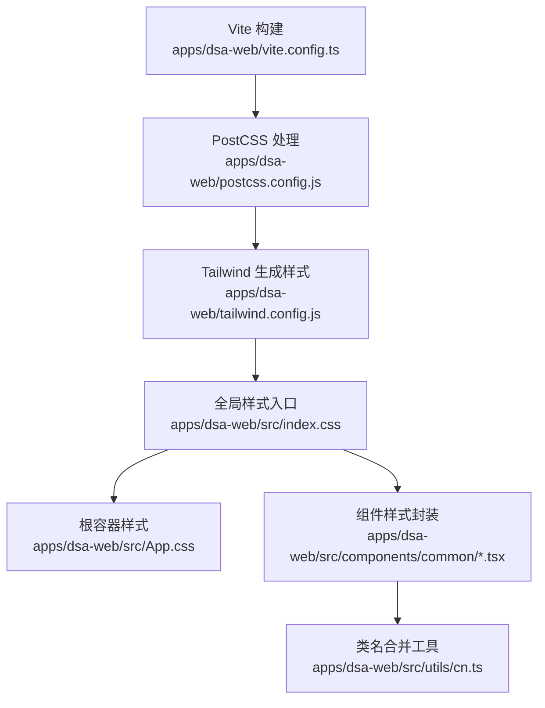
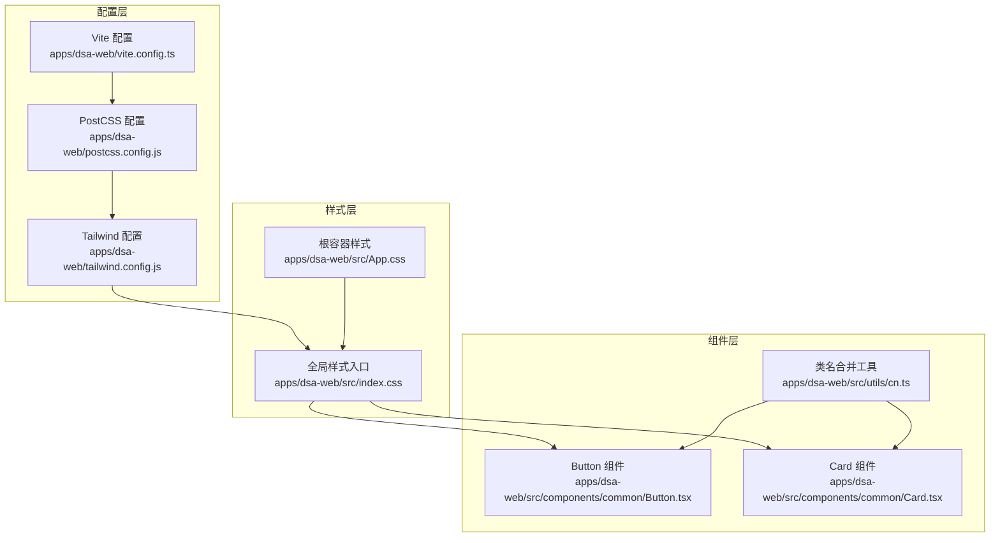
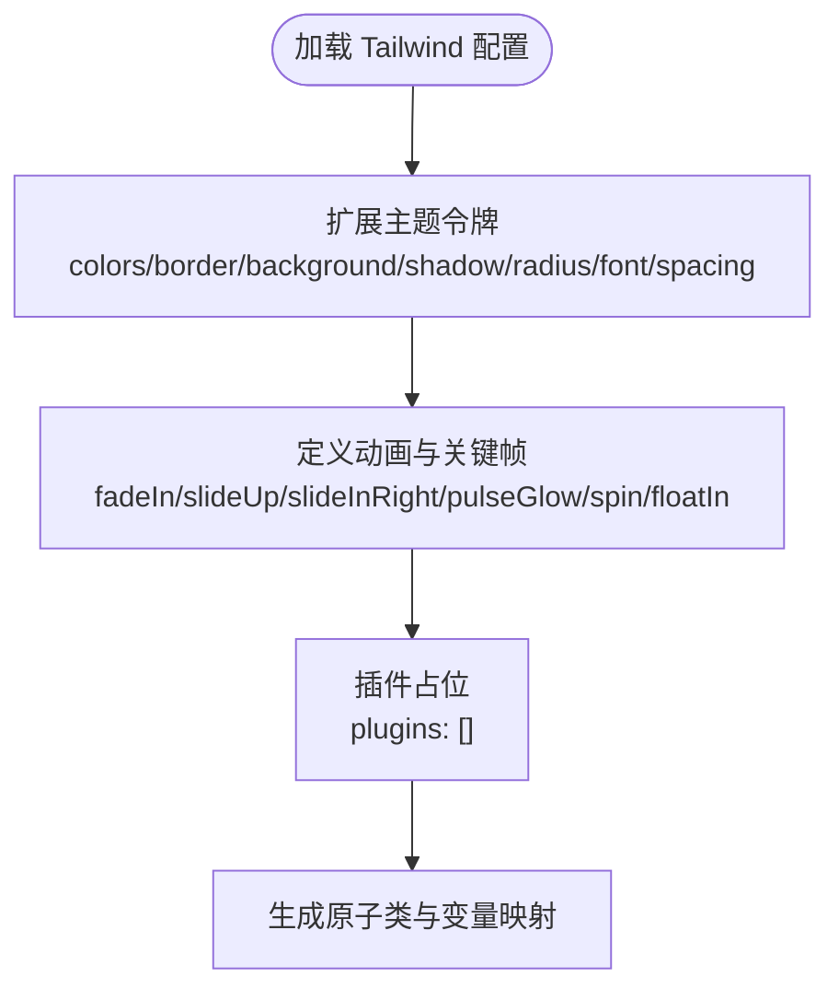
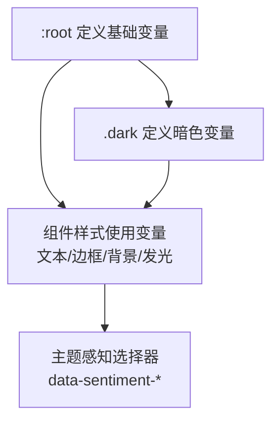
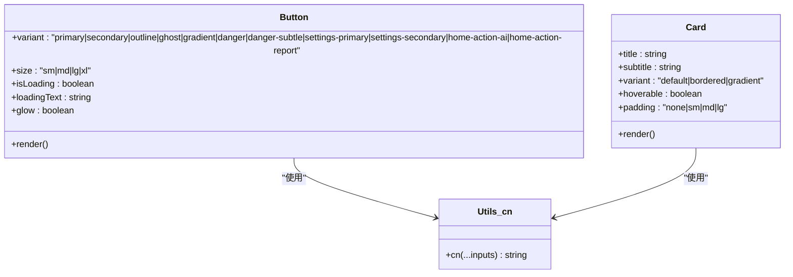
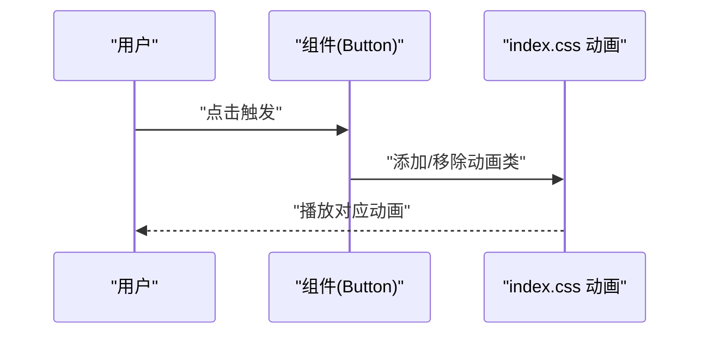
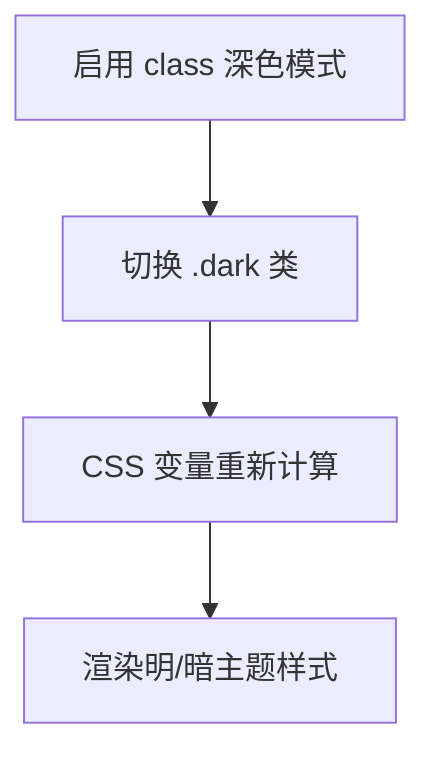
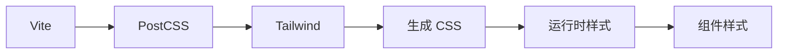

# 样式与主题

<cite>
**本文引用的文件**   
- [apps/dsa-web/tailwind.config.js](file://apps/dsa-web/tailwind.config.js)
- [apps/dsa-web/postcss.config.js](file://apps/dsa-web/postcss.config.js)
- [apps/dsa-web/vite.config.ts](file://apps/dsa-web/vite.config.ts)
- [apps/dsa-web/src/index.css](file://apps/dsa-web/src/index.css)
- [apps/dsa-web/src/App.css](file://apps/dsa-web/src/App.css)
- [apps/dsa-web/src/components/common/Button.tsx](file://apps/dsa-web/src/components/common/Button.tsx)
- [apps/dsa-web/src/components/common/Card.tsx](file://apps/dsa-web/src/components/common/Card.tsx)
- [apps/dsa-web/src/utils/cn.ts](file://apps/dsa-web/src/utils/cn.ts)
- [apps/dsa-web/package.json](file://apps/dsa-web/package.json)
</cite>

## 目录
1. [简介](#简介)
2. [项目结构](#项目结构)
3. [核心组件](#核心组件)
4. [架构总览](#架构总览)
5. [详细组件分析](#详细组件分析)
6. [依赖关系分析](#依赖关系分析)
7. [性能考量](#性能考量)
8. [故障排查指南](#故障排查指南)
9. [结论](#结论)
10. [附录](#附录)

## 简介
本文件面向 Web 管理界面的样式系统与主题设计，系统性阐述 Tailwind CSS 配置、自定义主题与响应式实现；详解 CSS 模块化、样式隔离与组件样式封装；说明深色主题支持、动态主题切换与用户偏好持久化；解释动画与过渡效果、交互反馈；给出样式性能优化、打包策略与 CDN 部署建议；提供主题定制指南、颜色系统与字体排版规范；记录调试工具、浏览器兼容性与无障碍支持；最后解释 PostCSS 配置、预处理器使用与构建优化。

## 项目结构
Web 管理界面位于 apps/dsa-web，样式体系围绕 Tailwind 4、PostCSS 与 Vite 构建链路组织，采用 CSS 变量驱动的主题系统，并通过类名与组件封装实现样式模块化与复用。

**图表来源**
- [apps/dsa-web/vite.config.ts:1-30](file://apps/dsa-web/vite.config.ts#L1-L30)
- [apps/dsa-web/postcss.config.js:1-7](file://apps/dsa-web/postcss.config.js#L1-L7)
- [apps/dsa-web/tailwind.config.js:1-171](file://apps/dsa-web/tailwind.config.js#L1-L171)
- [apps/dsa-web/src/index.css:1-1491](file://apps/dsa-web/src/index.css#L1-L1491)
- [apps/dsa-web/src/App.css:1-5](file://apps/dsa-web/src/App.css#L1-L5)
- [apps/dsa-web/src/components/common/Button.tsx:1-98](file://apps/dsa-web/src/components/common/Button.tsx#L1-L98)
- [apps/dsa-web/src/components/common/Card.tsx:1-71](file://apps/dsa-web/src/components/common/Card.tsx#L1-L71)
- [apps/dsa-web/src/utils/cn.ts:1-7](file://apps/dsa-web/src/utils/cn.ts#L1-L7)

**章节来源**
- [apps/dsa-web/vite.config.ts:1-30](file://apps/dsa-web/vite.config.ts#L1-L30)
- [apps/dsa-web/postcss.config.js:1-7](file://apps/dsa-web/postcss.config.js#L1-L7)
- [apps/dsa-web/tailwind.config.js:1-171](file://apps/dsa-web/tailwind.config.js#L1-L171)
- [apps/dsa-web/src/index.css:1-1491](file://apps/dsa-web/src/index.css#L1-L1491)
- [apps/dsa-web/src/App.css:1-5](file://apps/dsa-web/src/App.css#L1-L5)

## 核心组件
- Tailwind 主题与变量：通过 Tailwind 配置扩展颜色、阴影、圆角、动画与背景图，统一设计令牌（Design Tokens）并通过 CSS 变量在 :root 与 .dark 中落地。
- PostCSS 插件链：启用 Tailwind 插件与 autoprefixer，确保原子类与浏览器兼容。
- Vite 构建：React 插件、代理、输出目录指向项目根 static，便于静态托管。
- 组件样式封装：Button、Card 等组件以类名组合与 CSS 变量实现终端风格与主题感知。
- 类名合并工具：cn 工具整合 clsx 与 tailwind-merge，保证冲突类名正确合并。

**章节来源**
- [apps/dsa-web/tailwind.config.js:1-171](file://apps/dsa-web/tailwind.config.js#L1-L171)
- [apps/dsa-web/postcss.config.js:1-7](file://apps/dsa-web/postcss.config.js#L1-L7)
- [apps/dsa-web/vite.config.ts:1-30](file://apps/dsa-web/vite.config.ts#L1-L30)
- [apps/dsa-web/src/components/common/Button.tsx:1-98](file://apps/dsa-web/src/components/common/Button.tsx#L1-L98)
- [apps/dsa-web/src/components/common/Card.tsx:1-71](file://apps/dsa-web/src/components/common/Card.tsx#L1-L71)
- [apps/dsa-web/src/utils/cn.ts:1-7](file://apps/dsa-web/src/utils/cn.ts#L1-L7)

## 架构总览
样式系统以“配置 → 处理 → 生成 → 应用”为主线，贯穿设计令牌、主题变量、原子类与组件封装。

**图表来源**
- [apps/dsa-web/tailwind.config.js:1-171](file://apps/dsa-web/tailwind.config.js#L1-L171)
- [apps/dsa-web/postcss.config.js:1-7](file://apps/dsa-web/postcss.config.js#L1-L7)
- [apps/dsa-web/vite.config.ts:1-30](file://apps/dsa-web/vite.config.ts#L1-L30)
- [apps/dsa-web/src/index.css:1-1491](file://apps/dsa-web/src/index.css#L1-L1491)
- [apps/dsa-web/src/App.css:1-5](file://apps/dsa-web/src/App.css#L1-L5)
- [apps/dsa-web/src/components/common/Button.tsx:1-98](file://apps/dsa-web/src/components/common/Button.tsx#L1-L98)
- [apps/dsa-web/src/components/common/Card.tsx:1-71](file://apps/dsa-web/src/components/common/Card.tsx#L1-L71)
- [apps/dsa-web/src/utils/cn.ts:1-7](file://apps/dsa-web/src/utils/cn.ts#L1-L7)

## 详细组件分析

### Tailwind 配置与主题令牌
- 深色模式：通过 class 策略启用暗色主题，配合 CSS 变量在 :root 与 .dark 中切换。
- 设计令牌：集中于扩展 colors、borderColor、backgroundColor、boxShadow、borderRadius、fontSize、spacing、animation 与 keyframes。
- 背景与渐变：提供多种渐变卡片边框与主色调渐变，适配终端风格。
- 动画系统：内置淡入、上滑、右入、脉冲发光、慢速旋转、浮动等动画，结合 keyframes 实现。

**图表来源**
- [apps/dsa-web/tailwind.config.js:8-171](file://apps/dsa-web/tailwind.config.js#L8-L171)

**章节来源**
- [apps/dsa-web/tailwind.config.js:1-171](file://apps/dsa-web/tailwind.config.js#L1-L171)

### CSS 变量与双主题系统
- 基础变量：在 :root 定义字体族、HSL 主题令牌与设计令牌，如 --background、--foreground、--primary、--accent、--success、--warning、--danger 等。
- 暗色变量：在 .dark 中重定义上述变量，形成对比度更高的暗色方案，并调整发光强度与阴影。
- 主题感知组件：通过 data-* 属性选择器与 CSS 变量联动，实现情绪指标（恐惧/贪婪/中性）的颜色与发光效果。
- 输入与按钮：提供输入框与按钮的终端风格样式，包含悬停、聚焦、禁用状态与发光效果。

**图表来源**
- [apps/dsa-web/src/index.css:6-397](file://apps/dsa-web/src/index.css#L6-L397)

**章节来源**
- [apps/dsa-web/src/index.css:1-1491](file://apps/dsa-web/src/index.css#L1-L1491)

### 组件样式封装与类名合并
- Button：多变体（primary、secondary、outline、ghost、gradient、danger、danger-subtle、settings-primary、settings-secondary、home-action-ai、home-action-report）、多尺寸、加载态、发光效果；通过 cn 合并类名并应用焦点环与禁用态。
- Card：终端卡片、渐变边框卡片、可悬停；支持标题/副标题与内边距控制。
- cn 工具：基于 clsx 与 tailwind-merge，确保原子类冲突被正确合并。

**图表来源**
- [apps/dsa-web/src/components/common/Button.tsx:1-98](file://apps/dsa-web/src/components/common/Button.tsx#L1-L98)
- [apps/dsa-web/src/components/common/Card.tsx:1-71](file://apps/dsa-web/src/components/common/Card.tsx#L1-L71)
- [apps/dsa-web/src/utils/cn.ts:1-7](file://apps/dsa-web/src/utils/cn.ts#L1-L7)

**章节来源**
- [apps/dsa-web/src/components/common/Button.tsx:1-98](file://apps/dsa-web/src/components/common/Button.tsx#L1-L98)
- [apps/dsa-web/src/components/common/Card.tsx:1-71](file://apps/dsa-web/src/components/common/Card.tsx#L1-L71)
- [apps/dsa-web/src/utils/cn.ts:1-7](file://apps/dsa-web/src/utils/cn.ts#L1-L7)

### 动画与过渡效果
- 内置动画：fade-in、slide-up、slide-in-right、pulse-glow、spin-slow、float-in。
- 关键帧：fadeIn、slideUp、slideInRight、floatIn、pulseGlow。
- 使用方式：通过类名或动画名称类直接应用，或在组件中结合状态切换。

**图表来源**
- [apps/dsa-web/src/components/common/Button.tsx:49](file://apps/dsa-web/src/components/common/Button.tsx#L49)
- [apps/dsa-web/src/index.css:667-780](file://apps/dsa-web/src/index.css#L667-L780)

**章节来源**
- [apps/dsa-web/src/index.css:667-780](file://apps/dsa-web/src/index.css#L667-L780)
- [apps/dsa-web/src/components/common/Button.tsx:49](file://apps/dsa-web/src/components/common/Button.tsx#L49)

### 深色主题支持与动态切换
- 深色模式：tailwind.config.js 设置 darkMode: ['class']，通过 .dark 切换。
- 变量切换：:root 与 .dark 分别定义 HSL 主题令牌，实现明暗两套色彩体系。
- 主题感知：data-sentiment-* 选择器根据数据属性应用不同颜色与发光效果，确保在两种主题下均一致呈现。

**图表来源**
- [apps/dsa-web/tailwind.config.js:3](file://apps/dsa-web/tailwind.config.js#L3)
- [apps/dsa-web/src/index.css:212-397](file://apps/dsa-web/src/index.css#L212-L397)

**章节来源**
- [apps/dsa-web/tailwind.config.js:1-171](file://apps/dsa-web/tailwind.config.js#L1-L171)
- [apps/dsa-web/src/index.css:1-1491](file://apps/dsa-web/src/index.css#L1-L1491)

### 响应式设计与布局
- 容器与断点：container 配置中心对齐与内边距，2xl 屏幕断点；Tailwind 默认断点在构建时生效。
- 组件级响应：Button/ Card 等组件通过原子类实现响应式尺寸与间距。

**章节来源**
- [apps/dsa-web/tailwind.config.js:8-15](file://apps/dsa-web/tailwind.config.js#L8-L15)
- [apps/dsa-web/src/components/common/Button.tsx:13-18](file://apps/dsa-web/src/components/common/Button.tsx#L13-L18)
- [apps/dsa-web/src/components/common/Card.tsx:26-31](file://apps/dsa-web/src/components/common/Card.tsx#L26-L31)

### 样式隔离与模块化
- 全局入口：index.css 作为全局样式入口，集中定义变量、主题与通用组件样式。
- 组件封装：Button/ Card 通过 props 控制变体与尺寸，减少全局污染。
- 类名合并：cn 工具避免重复与冲突类名，提升可维护性。

**章节来源**
- [apps/dsa-web/src/index.css:1-1491](file://apps/dsa-web/src/index.css#L1-L1491)
- [apps/dsa-web/src/components/common/Button.tsx:1-98](file://apps/dsa-web/src/components/common/Button.tsx#L1-L98)
- [apps/dsa-web/src/components/common/Card.tsx:1-71](file://apps/dsa-web/src/components/common/Card.tsx#L1-L71)
- [apps/dsa-web/src/utils/cn.ts:1-7](file://apps/dsa-web/src/utils/cn.ts#L1-L7)

## 依赖关系分析
- 构建链路：Vite → PostCSS(@tailwindcss/postcss, autoprefixer) → Tailwind → 生成 CSS → 注入页面。
- 运行时依赖：next-themes 用于 React 环境下的主题切换（可在应用层引入），clsx 与 tailwind-merge 提升类名合并质量。
- 开发依赖：tailwindcss、postcss、autoprefixer、@vitejs/plugin-react 等。

**图表来源**
- [apps/dsa-web/vite.config.ts:1-30](file://apps/dsa-web/vite.config.ts#L1-L30)
- [apps/dsa-web/postcss.config.js:1-7](file://apps/dsa-web/postcss.config.js#L1-L7)
- [apps/dsa-web/package.json:14-56](file://apps/dsa-web/package.json#L14-L56)

**章节来源**
- [apps/dsa-web/package.json:14-56](file://apps/dsa-web/package.json#L14-L56)
- [apps/dsa-web/vite.config.ts:1-30](file://apps/dsa-web/vite.config.ts#L1-L30)
- [apps/dsa-web/postcss.config.js:1-7](file://apps/dsa-web/postcss.config.js#L1-L7)

## 性能考量
- 原子类优先：Tailwind 原子类减少重复样式，降低 CSS 体积。
- 变量驱动：CSS 变量减少重复颜色与阴影定义，便于主题切换且体积可控。
- 渐进增强：动画与发光效果通过 CSS 实现，避免复杂 JS 动画带来的性能开销。
- 构建优化：PostCSS 自动前缀与 Tailwind 按需扫描内容，减少未使用样式。
- 打包输出：Vite 输出至项目根 static，利于静态托管与 CDN 缓存。

**章节来源**
- [apps/dsa-web/tailwind.config.js:1-171](file://apps/dsa-web/tailwind.config.js#L1-L171)
- [apps/dsa-web/src/index.css:1-1491](file://apps/dsa-web/src/index.css#L1-L1491)
- [apps/dsa-web/vite.config.ts:24-29](file://apps/dsa-web/vite.config.ts#L24-L29)

## 故障排查指南
- 样式不生效
  - 检查 Tailwind 内容扫描路径是否包含组件文件。
  - 确认 PostCSS 插件顺序与版本兼容。
  - 确保 index.css 在入口中被正确引入。
- 深色主题异常
  - 确认 .dark 类是否正确挂载到根元素。
  - 检查 :root 与 .dark 的变量值是否完整。
- 动画无效
  - 确认动画类名拼写与 keyframes 是否存在。
  - 检查组件是否正确传递类名。
- 类名冲突
  - 使用 cn 工具合并类名，避免重复与覆盖。

**章节来源**
- [apps/dsa-web/tailwind.config.js:4-7](file://apps/dsa-web/tailwind.config.js#L4-L7)
- [apps/dsa-web/postcss.config.js:1-7](file://apps/dsa-web/postcss.config.js#L1-L7)
- [apps/dsa-web/src/index.css:1-1491](file://apps/dsa-web/src/index.css#L1-L1491)
- [apps/dsa-web/src/utils/cn.ts:1-7](file://apps/dsa-web/src/utils/cn.ts#L1-L7)

## 结论
该样式系统以 Tailwind 4 为核心，结合 PostCSS 与 Vite，形成“配置 → 处理 → 生成 → 应用”的高效链路。通过 CSS 变量与设计令牌实现统一主题，组件封装与类名合并保障样式模块化与可维护性。动画与渐变强化交互体验，按需构建与静态输出便于部署与性能优化。建议在应用层引入 next-themes 实现动态主题切换与用户偏好持久化，进一步完善主题生态。

## 附录

### 主题定制指南
- 颜色系统
  - 基础色板：background、foreground、primary、secondary、accent、muted、destructive。
  - 语义色：success、warning、danger；辅助色：cyan、purple。
  - 边框与背景：dim/subtle/subtle-hover/soft/active；表面层：surface-1/2/3；覆盖层：overlay-hover/selected。
- 字体排版
  - 字体族：Inter、SF Pro Display、Segoe UI、system-ui、-apple-system。
  - 行高与字重：line-height 与 font-weight 已在 :root 定义。
  - 尺寸：xxs、label 等细粒度字号；间距：18、22 等扩展间距。
- 阴影与圆角
  - 圆角：lg/md/sm 与扩展值；阴影：soft-card、glow-* 系列。
- 渐变与装饰
  - gradient-purple-cyan、gradient-card-border、gradient-cyan、primary-gradient。
- 动画与过渡
  - fade-in、slide-up、slide-in-right、pulse-glow、spin-slow、float-in。

**章节来源**
- [apps/dsa-web/tailwind.config.js:16-167](file://apps/dsa-web/tailwind.config.js#L16-L167)
- [apps/dsa-web/src/index.css:6-397](file://apps/dsa-web/src/index.css#L6-L397)

### 浏览器兼容性与无障碍
- 兼容性
  - PostCSS autoprefixer 自动添加厂商前缀，确保主流浏览器支持。
- 无障碍
  - 按钮提供 focus-visible 轮廓与禁用态；文本与对比度遵循主题变量，保证可读性。

**章节来源**
- [apps/dsa-web/postcss.config.js:1-7](file://apps/dsa-web/postcss.config.js#L1-L7)
- [apps/dsa-web/src/components/common/Button.tsx:57-64](file://apps/dsa-web/src/components/common/Button.tsx#L57-L64)

### 打包策略与 CDN 部署
- 构建输出
  - Vite 输出目录设置为项目根 static，便于静态托管。
- CDN 部署
  - 将 static 下产物部署至 CDN，结合缓存策略与版本号提升加载速度。
- 优化建议
  - 启用压缩与 Gzip/Brotli；拆分第三方包；利用浏览器缓存与长缓存策略。

**章节来源**
- [apps/dsa-web/vite.config.ts:24-29](file://apps/dsa-web/vite.config.ts#L24-L29)