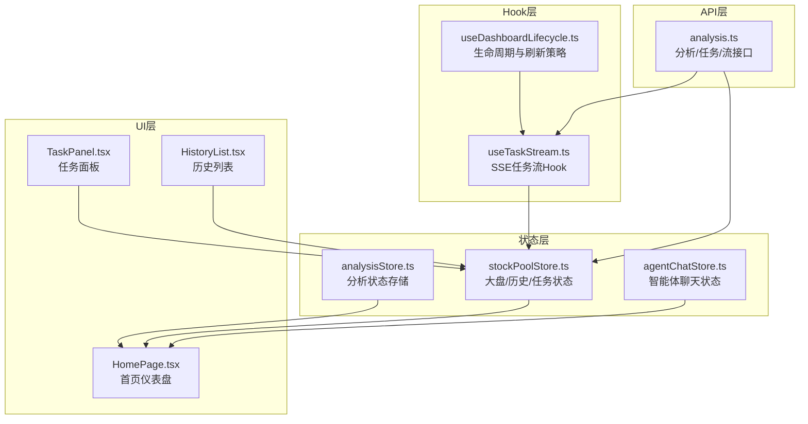
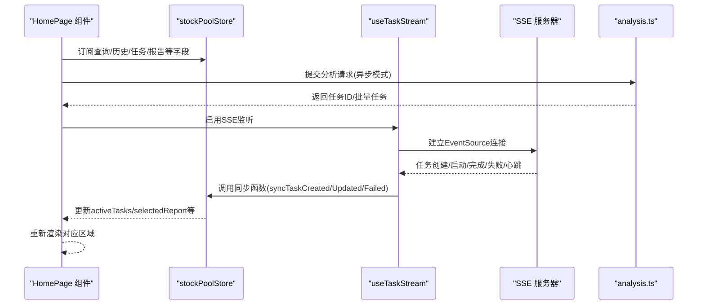
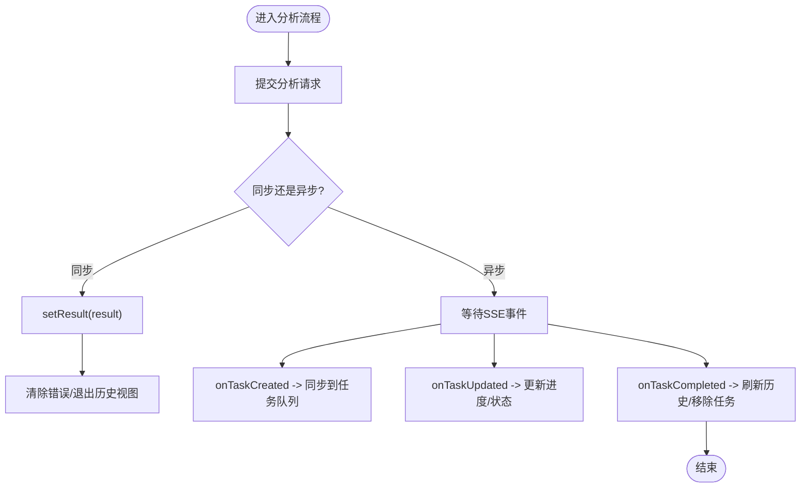
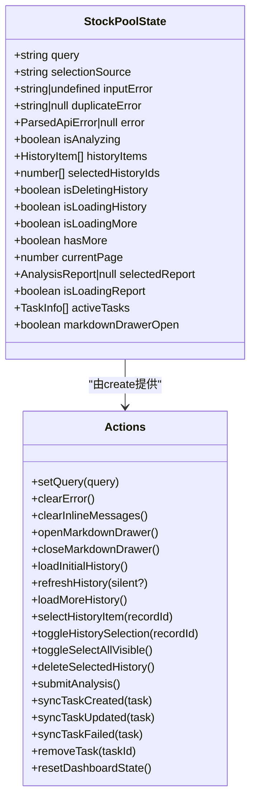
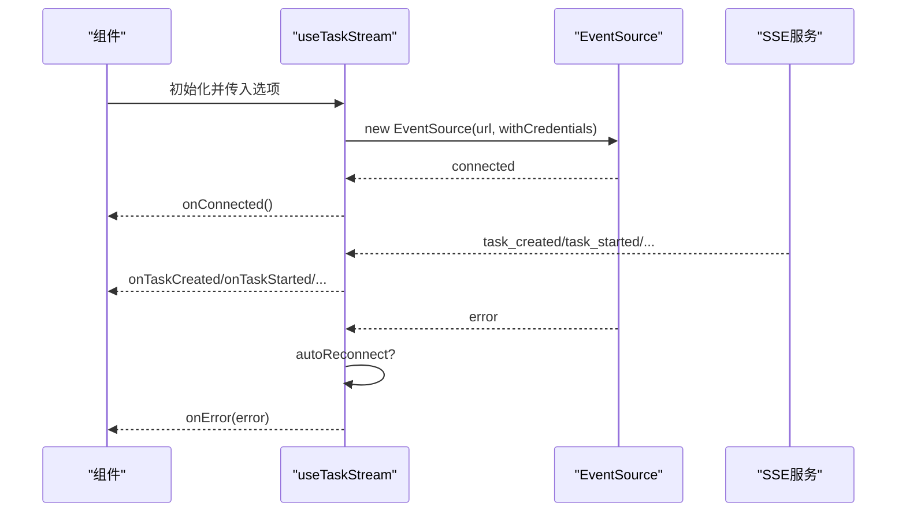
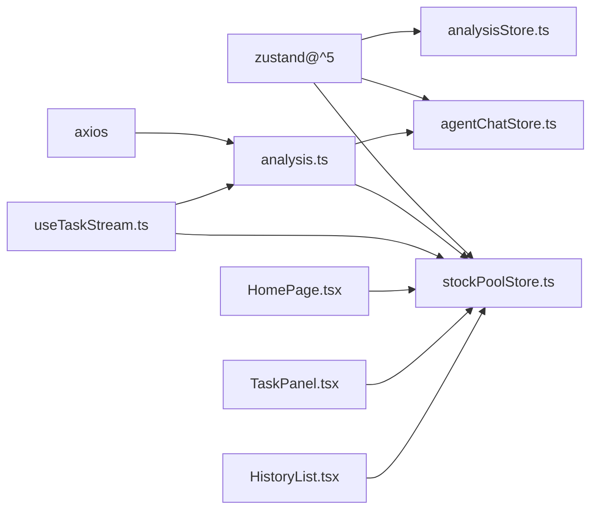

# 状态管理

<cite>
**本文引用的文件**
- [apps/dsa-web/src/stores/analysisStore.ts](file://apps/dsa-web/src/stores/analysisStore.ts)
- [apps/dsa-web/src/stores/stockPoolStore.ts](file://apps/dsa-web/src/stores/stockPoolStore.ts)
- [apps/dsa-web/src/stores/agentChatStore.ts](file://apps/dsa-web/src/stores/agentChatStore.ts)
- [apps/dsa-web/src/stores/index.ts](file://apps/dsa-web/src/stores/index.ts)
- [apps/dsa-web/src/hooks/useTaskStream.ts](file://apps/dsa-web/src/hooks/useTaskStream.ts)
- [apps/dsa-web/src/hooks/useDashboardLifecycle.ts](file://apps/dsa-web/src/hooks/useDashboardLifecycle.ts)
- [apps/dsa-web/src/hooks/index.ts](file://apps/dsa-web/src/hooks/index.ts)
- [apps/dsa-web/src/api/analysis.ts](file://apps/dsa-web/src/api/analysis.ts)
- [apps/dsa-web/src/types/analysis.ts](file://apps/dsa-web/src/types/analysis.ts)
- [apps/dsa-web/src/components/tasks/TaskPanel.tsx](file://apps/dsa-web/src/components/tasks/TaskPanel.tsx)
- [apps/dsa-web/src/components/history/HistoryList.tsx](file://apps/dsa-web/src/components/history/HistoryList.tsx)
- [apps/dsa-web/src/pages/HomePage.tsx](file://apps/dsa-web/src/pages/HomePage.tsx)
- [apps/dsa-web/src/App.tsx](file://apps/dsa-web/src/App.tsx)
- [apps/dsa-web/package.json](file://apps/dsa-web/package.json)
- [apps/dsa-web/src/utils/constants.ts](file://apps/dsa-web/src/utils/constants.ts)
</cite>

## 目录
1. [引言](#引言)
2. [项目结构](#项目结构)
3. [核心组件](#核心组件)
4. [架构总览](#架构总览)
5. [详细组件分析](#详细组件分析)
6. [依赖关系分析](#依赖关系分析)
7. [性能考量](#性能考量)
8. [故障排查指南](#故障排查指南)
9. [结论](#结论)
10. [附录](#附录)

## 引言
本文件面向Web管理界面的状态管理系统，聚焦于Zustand状态管理库的使用方式、store设计模式与订阅机制，系统性阐述analysisStore的状态结构、action定义与副作用处理；详解自定义Hook的设计模式，尤其是useTaskStream如何驱动实时任务流与状态同步；明确全局状态与组件局部状态的边界划分，并给出状态持久化与恢复策略；最后总结最佳实践、性能优化、调试工具使用、扩展方法、中间件集成与测试策略，并记录状态变更追踪、时间旅行调试与生产监控建议。

## 项目结构
本项目采用“按功能域组织”的前端工程布局，状态管理位于apps/dsa-web/src/stores目录，配套的自定义Hook位于apps/dsa-web/src/hooks，API封装位于apps/dsa-web/src/api，类型定义位于apps/dsa-web/src/types，页面与组件消费状态位于apps/dsa-web/src/pages与apps/dsa-web/src/components。

图表来源
- [apps/dsa-web/src/stores/analysisStore.ts:1-69](file://apps/dsa-web/src/stores/analysisStore.ts#L1-L69)
- [apps/dsa-web/src/stores/stockPoolStore.ts:1-378](file://apps/dsa-web/src/stores/stockPoolStore.ts#L1-L378)
- [apps/dsa-web/src/stores/agentChatStore.ts:1-330](file://apps/dsa-web/src/stores/agentChatStore.ts#L1-L330)
- [apps/dsa-web/src/hooks/useTaskStream.ts:1-255](file://apps/dsa-web/src/hooks/useTaskStream.ts#L1-L255)
- [apps/dsa-web/src/hooks/useDashboardLifecycle.ts:1-97](file://apps/dsa-web/src/hooks/useDashboardLifecycle.ts#L1-L97)
- [apps/dsa-web/src/api/analysis.ts:1-151](file://apps/dsa-web/src/api/analysis.ts#L1-L151)
- [apps/dsa-web/src/pages/HomePage.tsx:1-280](file://apps/dsa-web/src/pages/HomePage.tsx#L1-L280)
- [apps/dsa-web/src/components/tasks/TaskPanel.tsx:1-161](file://apps/dsa-web/src/components/tasks/TaskPanel.tsx#L1-L161)
- [apps/dsa-web/src/components/history/HistoryList.tsx:1-190](file://apps/dsa-web/src/components/history/HistoryList.tsx#L1-L190)

章节来源
- [apps/dsa-web/src/stores/index.ts:1-4](file://apps/dsa-web/src/stores/index.ts#L1-L4)
- [apps/dsa-web/package.json:1-56](file://apps/dsa-web/package.json#L1-L56)

## 核心组件
- analysisStore：面向单一分析结果的全局状态，负责同步/异步分析结果、历史报告视图切换与错误状态管理。
- stockPoolStore：聚合大盘搜索、历史记录、任务队列、报告详情与交互状态，是页面的主要状态源。
- agentChatStore：智能体聊天会话与流式输出状态，包含会话持久化与流式解析逻辑。
- useTaskStream：基于EventSource的SSE Hook，统一处理任务创建、启动、完成、失败与心跳事件，提供自动重连与手动控制。
- useDashboardLifecycle：仪表盘生命周期管理，结合定时刷新、页面可见性与SSE事件，驱动历史与任务状态同步。

章节来源
- [apps/dsa-web/src/stores/analysisStore.ts:1-69](file://apps/dsa-web/src/stores/analysisStore.ts#L1-L69)
- [apps/dsa-web/src/stores/stockPoolStore.ts:1-378](file://apps/dsa-web/src/stores/stockPoolStore.ts#L1-L378)
- [apps/dsa-web/src/stores/agentChatStore.ts:1-330](file://apps/dsa-web/src/stores/agentChatStore.ts#L1-L330)
- [apps/dsa-web/src/hooks/useTaskStream.ts:1-255](file://apps/dsa-web/src/hooks/useTaskStream.ts#L1-L255)
- [apps/dsa-web/src/hooks/useDashboardLifecycle.ts:1-97](file://apps/dsa-web/src/hooks/useDashboardLifecycle.ts#L1-L97)

## 架构总览
Zustand以函数式store为核心，action内部通过set/setPartial原子更新状态，避免不必要的重渲染。全局状态通过store实例暴露给组件订阅；实时任务流通过useTaskStream建立SSE连接，事件回调映射到store的同步函数，实现“事件驱动的状态变更”。页面组件通过selector订阅所需字段，降低订阅范围，提升性能。

图表来源
- [apps/dsa-web/src/pages/HomePage.tsx:1-280](file://apps/dsa-web/src/pages/HomePage.tsx#L1-L280)
- [apps/dsa-web/src/stores/stockPoolStore.ts:1-378](file://apps/dsa-web/src/stores/stockPoolStore.ts#L1-L378)
- [apps/dsa-web/src/hooks/useTaskStream.ts:1-255](file://apps/dsa-web/src/hooks/useTaskStream.ts#L1-L255)
- [apps/dsa-web/src/api/analysis.ts:1-151](file://apps/dsa-web/src/api/analysis.ts#L1-L151)

## 详细组件分析

### analysisStore：分析状态与历史视图
- 状态结构
  - isLoading：是否处于分析请求中
  - result：AnalysisResult（同步分析结果）
  - error：ParsedApiError（错误信息）
  - isHistoryView：是否切换到历史报告视图
  - historyReport：AnalysisReport（历史报告详情）
- Action定义
  - setLoading/setResult/setError：设置分析状态与结果
  - setHistoryReport/reset/resetToAnalysis：历史视图切换与状态重置
- 副作用处理
  - setResult会清除错误并退出历史视图，reset系列方法清理所有状态
  - 适合独立模块化的分析结果展示，不直接耦合任务流

图表来源
- [apps/dsa-web/src/stores/analysisStore.ts:1-69](file://apps/dsa-web/src/stores/analysisStore.ts#L1-L69)
- [apps/dsa-web/src/stores/stockPoolStore.ts:338-376](file://apps/dsa-web/src/stores/stockPoolStore.ts#L338-L376)
- [apps/dsa-web/src/hooks/useTaskStream.ts:1-255](file://apps/dsa-web/src/hooks/useTaskStream.ts#L1-L255)

章节来源
- [apps/dsa-web/src/stores/analysisStore.ts:1-69](file://apps/dsa-web/src/stores/analysisStore.ts#L1-L69)

### stockPoolStore：全局状态聚合与边界划分
- 状态边界
  - 局部状态：组件内临时UI状态（如输入框、侧边栏开关、抽屉开关）
  - 全局状态：查询条件、历史列表、选中项、活动任务、当前报告、错误与加载态
- 关键Action与副作用
  - 历史加载：fetchHistory带请求序列号防竞态，支持静默刷新与追加
  - 报告选择：selectHistoryItem带请求序列号，避免跨请求覆盖
  - 分析提交：submitAnalysis校验股票代码，调用analysisApi.analyzeAsync，捕获重复任务错误
  - 任务同步：syncTaskCreated/Updated/Failed/Remove，配合useTaskStream事件回调
  - 删除历史：deleteSelectedHistory，删除后刷新列表并处理选中项变更
- 性能要点
  - 使用请求序列号避免竞态
  - 通过selector订阅减少重渲染
  - 任务移除采用延时清理，避免闪烁

图表来源
- [apps/dsa-web/src/stores/stockPoolStore.ts:25-61](file://apps/dsa-web/src/stores/stockPoolStore.ts#L25-L61)

章节来源
- [apps/dsa-web/src/stores/stockPoolStore.ts:1-378](file://apps/dsa-web/src/stores/stockPoolStore.ts#L1-L378)

### agentChatStore：流式状态与持久化
- 状态与动作
  - messages/progressSteps/loading/sessions/chatError/sessionId/currentRoute/completionBadge/abortController
  - loadSessions/loadInitialSession/switchSession/startNewChat/startStream
- 流式解析与错误处理
  - 读取ReadableStream，逐行解析事件，累积进度步骤，最终注入assistant消息
  - 错误分类处理，支持非路由场景下显示完成徽章
- 持久化
  - 会话ID本地持久化，支持跨页签恢复

章节来源
- [apps/dsa-web/src/stores/agentChatStore.ts:1-330](file://apps/dsa-web/src/stores/agentChatStore.ts#L1-L330)

### useTaskStream：SSE Hook与实时同步
- 设计要点
  - 使用ref存储EventSource与回调，避免频繁重连
  - 支持自动重连、手动重连/断开、启用/禁用
  - 事件解析与snake_case到camelCase转换
- 生命周期
  - 连接成功/错误/心跳/任务事件均通过回调暴露给上层
  - 错误时自动重连，连接关闭时清理定时器与状态

图表来源
- [apps/dsa-web/src/hooks/useTaskStream.ts:1-255](file://apps/dsa-web/src/hooks/useTaskStream.ts#L1-L255)

章节来源
- [apps/dsa-web/src/hooks/useTaskStream.ts:1-255](file://apps/dsa-web/src/hooks/useTaskStream.ts#L1-L255)

### useDashboardLifecycle：生命周期与刷新策略
- 行为
  - 首次挂载加载初始历史
  - 页面可见时刷新历史
  - 30秒周期静默刷新
  - 任务完成后延迟移除，失败时更长延迟
- 与SSE联动
  - 将SSE事件映射为store同步函数，驱动历史与任务状态更新

章节来源
- [apps/dsa-web/src/hooks/useDashboardLifecycle.ts:1-97](file://apps/dsa-web/src/hooks/useDashboardLifecycle.ts#L1-L97)

### 类型与API：一致性与契约
- 类型对齐
  - AnalysisRequest/AnalysisResult/AnalysisReport/TaskInfo等类型与API规范一致
- API封装
  - analyze/analyzeAsync/getStatus/getTasks/getTaskStreamUrl统一暴露
  - DuplicateTaskError用于重复任务场景

章节来源
- [apps/dsa-web/src/types/analysis.ts:1-245](file://apps/dsa-web/src/types/analysis.ts#L1-L245)
- [apps/dsa-web/src/api/analysis.ts:1-151](file://apps/dsa-web/src/api/analysis.ts#L1-L151)

### 页面与组件：状态消费与边界
- HomePage
  - 订阅stockPoolStore，组合历史列表、任务面板、报告展示
  - 通过useDashboardLifecycle接入SSE与刷新策略
- TaskPanel
  - 仅消费activeTasks，渲染进行中/等待中任务
- HistoryList
  - 仅消费历史列表与选中集合，负责滚动加载与批量操作

章节来源
- [apps/dsa-web/src/pages/HomePage.tsx:1-280](file://apps/dsa-web/src/pages/HomePage.tsx#L1-L280)
- [apps/dsa-web/src/components/tasks/TaskPanel.tsx:1-161](file://apps/dsa-web/src/components/tasks/TaskPanel.tsx#L1-L161)
- [apps/dsa-web/src/components/history/HistoryList.tsx:1-190](file://apps/dsa-web/src/components/history/HistoryList.tsx#L1-L190)

## 依赖关系分析
- Zustand版本
  - package.json声明zustand ^5.0.11，具备最新API能力
- 组件间依赖
  - HomePage依赖stockPoolStore与useDashboardLifecycle
  - TaskPanel/HistoryList依赖类型与store字段
  - useTaskStream依赖analysisApi提供的SSE URL
- 外部依赖
  - axios用于HTTP请求
  - camelcase-keys用于API字段转换

图表来源
- [apps/dsa-web/package.json:14-30](file://apps/dsa-web/package.json#L14-L30)
- [apps/dsa-web/src/stores/analysisStore.ts:1-69](file://apps/dsa-web/src/stores/analysisStore.ts#L1-L69)
- [apps/dsa-web/src/stores/stockPoolStore.ts:1-378](file://apps/dsa-web/src/stores/stockPoolStore.ts#L1-L378)
- [apps/dsa-web/src/stores/agentChatStore.ts:1-330](file://apps/dsa-web/src/stores/agentChatStore.ts#L1-L330)
- [apps/dsa-web/src/api/analysis.ts:1-151](file://apps/dsa-web/src/api/analysis.ts#L1-L151)
- [apps/dsa-web/src/hooks/useTaskStream.ts:1-255](file://apps/dsa-web/src/hooks/useTaskStream.ts#L1-L255)
- [apps/dsa-web/src/pages/HomePage.tsx:1-280](file://apps/dsa-web/src/pages/HomePage.tsx#L1-L280)

章节来源
- [apps/dsa-web/package.json:1-56](file://apps/dsa-web/package.json#L1-L56)

## 性能考量
- 订阅粒度
  - 通过selector订阅最小必要字段，避免无关重渲染
- 请求去抖与竞态
  - 使用请求序列号防止跨请求覆盖
- 渲染优化
  - 使用useMemo/useCallback稳定props，减少子组件重渲染
- SSE连接管理
  - 使用ref存储EventSource与回调，避免闭包导致的频繁重连
  - 错误时自动重连，但限制重连频率，避免资源浪费
- 本地持久化
  - 会话ID与部分UI状态本地保存，提升用户体验

## 故障排查指南
- SSE连接断开
  - 查看onError回调日志，确认自动重连是否生效
  - 检查API基础URL配置，确保SSE URL正确
- 任务状态不同步
  - 确认useTaskStream启用状态与回调映射
  - 检查store中syncTaskCreated/Updated/Failed是否被调用
- 历史记录不刷新
  - 检查useDashboardLifecycle的定时刷新与可见性刷新
  - 确认silent刷新逻辑与请求序列号
- 分析重复提交
  - 捕获DuplicateTaskError并提示用户等待现有任务完成
- 错误显示
  - 使用ParsedApiError统一解析错误，避免裸错误对象

章节来源
- [apps/dsa-web/src/hooks/useTaskStream.ts:191-203](file://apps/dsa-web/src/hooks/useTaskStream.ts#L191-L203)
- [apps/dsa-web/src/stores/stockPoolStore.ts:323-335](file://apps/dsa-web/src/stores/stockPoolStore.ts#L323-L335)
- [apps/dsa-web/src/hooks/useDashboardLifecycle.ts:89-93](file://apps/dsa-web/src/hooks/useDashboardLifecycle.ts#L89-L93)
- [apps/dsa-web/src/api/analysis.ts:140-150](file://apps/dsa-web/src/api/analysis.ts#L140-L150)

## 结论
本状态管理方案以Zustand为核心，通过清晰的store边界、严格的action设计与事件驱动的SSE同步，实现了从分析请求到实时任务反馈再到历史记录展示的完整闭环。通过请求序列号、自动重连、本地持久化与细粒度订阅等手段，兼顾了可靠性与性能。建议在生产环境中引入调试工具与监控埋点，持续优化用户体验与系统稳定性。

## 附录

### 最佳实践清单
- 使用selector精确订阅，避免全局广播
- 通过请求序列号与防抖策略避免竞态
- 将UI局部状态与全局状态分离，明确职责边界
- 对SSE连接进行统一管理，提供手动/自动控制
- 对错误进行统一解析与展示，增强可观测性

### 性能优化建议
- 优先使用浅比较的selector，减少深拷贝
- 对高频更新的字段拆分为多个store，降低耦合
- 在SSE事件处理中批量更新，减少多次set调用
- 对历史列表使用虚拟滚动与懒加载

### 调试与监控
- 开发期使用React DevTools与Zustand Devtools观察状态变更
- 生产期埋点记录关键action与SSE事件，便于回溯
- 对异常路径增加上报与告警

### 扩展与中间件
- 中间件：可引入日志、快照、重放等中间件，支持时间旅行调试
- 插件生态：结合React DevTools/Zustand Devtools完善开发体验
- 测试策略：为store编写单元测试，为Hook编写集成测试，覆盖SSE事件与错误分支

### 状态持久化与恢复
- 会话ID与聊天记录：agentChatStore已实现本地持久化
- UI状态：可对筛选、分页、抽屉开关等进行轻量持久化
- 注意：敏感数据不应持久化到本地