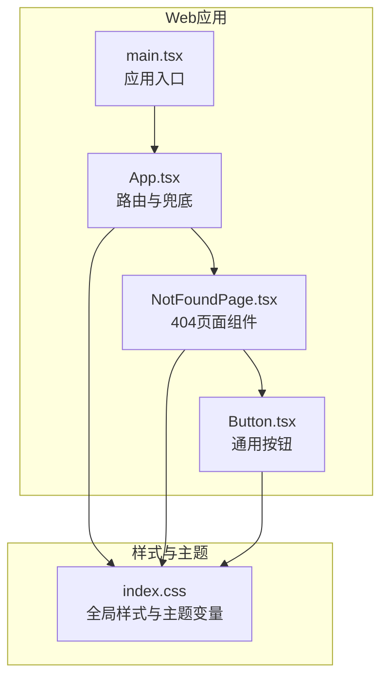
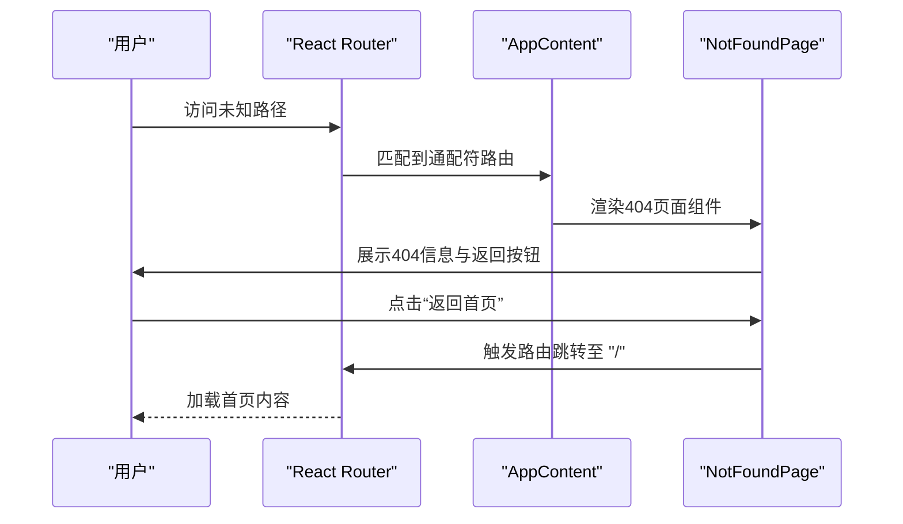
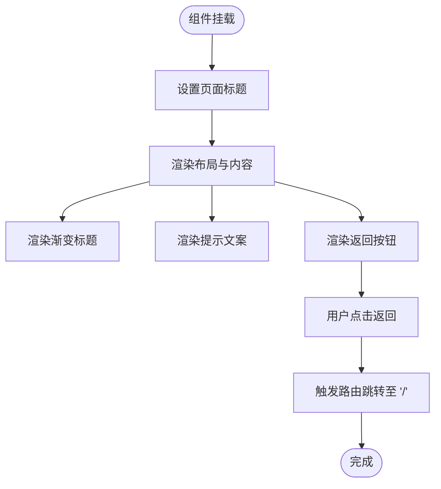
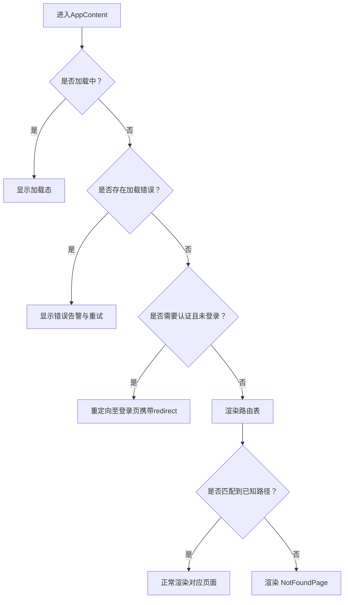
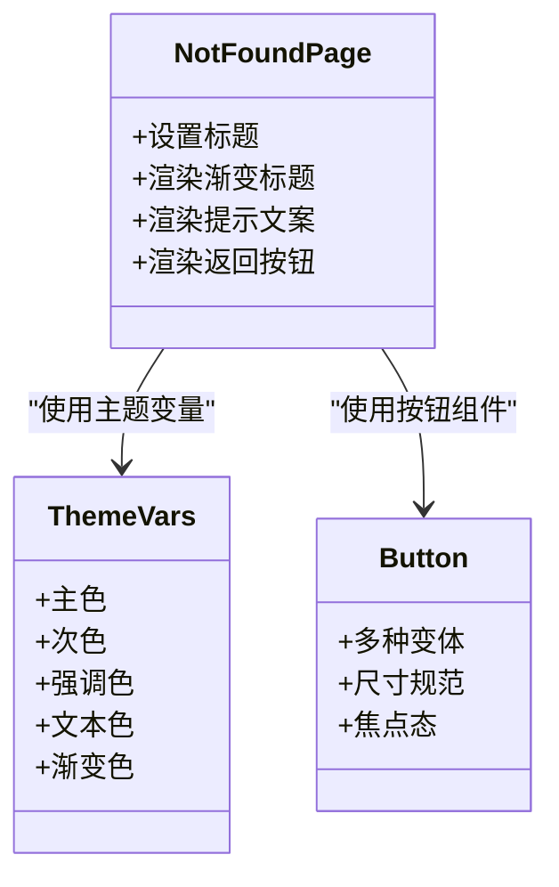
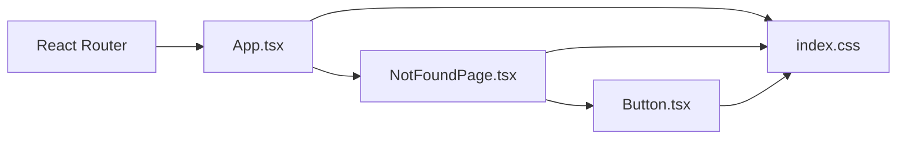

# 404页面

<cite>
**本文引用的文件**
- [apps/dsa-web/src/pages/NotFoundPage.tsx](file://apps/dsa-web/src/pages/NotFoundPage.tsx)
- [apps/dsa-web/src/App.tsx](file://apps/dsa-web/src/App.tsx)
- [apps/dsa-web/src/main.tsx](file://apps/dsa-web/src/main.tsx)
- [apps/dsa-web/src/index.css](file://apps/dsa-web/src/index.css)
- [apps/dsa-web/src/components/common/Button.tsx](file://apps/dsa-web/src/components/common/Button.tsx)
</cite>

## 目录
1. [简介](#简介)
2. [项目结构](#项目结构)
3. [核心组件](#核心组件)
4. [架构总览](#架构总览)
5. [详细组件分析](#详细组件分析)
6. [依赖关系分析](#依赖关系分析)
7. [性能考量](#性能考量)
8. [故障排查指南](#故障排查指南)
9. [结论](#结论)
10. [附录](#附录)

## 简介
本章节面向404页面组件的技术文档目标，系统化阐述该组件在本仓库中的实现与设计理念，覆盖以下方面：
- 设计理念与用户体验：通过简洁明确的信息传达、品牌一致性的视觉表达与直观的返回引导，帮助用户快速定位正确路径，降低认知负担。
- 页面布局与视觉设计：采用居中布局、渐变色标题与语义化文案，确保在不同设备上具备良好的可读性与辨识度。
- 品牌一致性：统一使用项目主题变量与颜色体系（主色、次色、强调色），保证404页面与整体UI风格一致。
- 错误信息展示、导航引导与用户恢复机制：以“返回首页”为主要恢复动作，结合路由跳转能力，提升用户回到可用功能区的概率。
- 响应式设计、可访问性与国际化：基于Tailwind类名与CSS变量，实现响应式布局；通过语义化标签与可聚焦元素，满足基础可访问性；国际化需在文案层面扩展。
- 性能优化、缓存策略与SEO优化：减少不必要的资源加载，利用浏览器缓存与静态化策略；通过动态设置页面标题提升SEO友好度。
- 自定义404页面、错误追踪与用户体验改进：提供可扩展的入口与建议实践，便于后续迭代。

## 项目结构
404页面位于前端Web应用中，作为路由兜底组件存在。其所在目录与关键文件如下：
- 页面组件：apps/dsa-web/src/pages/NotFoundPage.tsx
- 路由与兜底：apps/dsa-web/src/App.tsx
- 应用入口与主题包裹：apps/dsa-web/src/main.tsx
- 全局样式与主题变量：apps/dsa-web/src/index.css
- 按钮组件（用于返回按钮）：apps/dsa-web/src/components/common/Button.tsx

**图表来源**
- [apps/dsa-web/src/main.tsx:1-14](file://apps/dsa-web/src/main.tsx#L1-L14)
- [apps/dsa-web/src/App.tsx:69](file://apps/dsa-web/src/App.tsx#L69)
- [apps/dsa-web/src/pages/NotFoundPage.tsx:13-41](file://apps/dsa-web/src/pages/NotFoundPage.tsx#L13-L41)
- [apps/dsa-web/src/components/common/Button.tsx:1-98](file://apps/dsa-web/src/components/common/Button.tsx#L1-L98)
- [apps/dsa-web/src/index.css:1-210](file://apps/dsa-web/src/index.css#L1-L210)

**章节来源**
- [apps/dsa-web/src/main.tsx:1-14](file://apps/dsa-web/src/main.tsx#L1-L14)
- [apps/dsa-web/src/App.tsx:69](file://apps/dsa-web/src/App.tsx#L69)
- [apps/dsa-web/src/pages/NotFoundPage.tsx:13-41](file://apps/dsa-web/src/pages/NotFoundPage.tsx#L13-L41)
- [apps/dsa-web/src/components/common/Button.tsx:1-98](file://apps/dsa-web/src/components/common/Button.tsx#L1-L98)
- [apps/dsa-web/src/index.css:1-210](file://apps/dsa-web/src/index.css#L1-L210)

## 核心组件
- NotFoundPage：负责渲染404页面内容，包含渐变标题、提示文案与返回首页按钮，并在挂载时设置页面标题。
- App（含AppContent）：集中管理认证状态、加载态与错误态，最终通过通配符路由将未匹配路径交由NotFoundPage处理。
- Button：提供多形态按钮样式，404页面的返回按钮使用了项目内置的“primary”变体与尺寸规范。
- index.css：提供主题变量与全局样式，支撑404页面的颜色、字体与动画等视觉表现。

**章节来源**
- [apps/dsa-web/src/pages/NotFoundPage.tsx:5-45](file://apps/dsa-web/src/pages/NotFoundPage.tsx#L5-L45)
- [apps/dsa-web/src/App.tsx:16-74](file://apps/dsa-web/src/App.tsx#L16-L74)
- [apps/dsa-web/src/components/common/Button.tsx:20-32](file://apps/dsa-web/src/components/common/Button.tsx#L20-L32)
- [apps/dsa-web/src/index.css:24-62](file://apps/dsa-web/src/index.css#L24-L62)

## 架构总览
404页面在前端路由体系中的位置与交互流程如下：

**图表来源**
- [apps/dsa-web/src/App.tsx:69](file://apps/dsa-web/src/App.tsx#L69)
- [apps/dsa-web/src/pages/NotFoundPage.tsx:30-39](file://apps/dsa-web/src/pages/NotFoundPage.tsx#L30-L39)

## 详细组件分析

### NotFoundPage 组件
- 功能职责
  - 设置页面标题，提升SEO友好度。
  - 渲染404数字标题（带渐变背景）、提示文案与返回首页按钮。
  - 使用useNavigate进行路由跳转，实现用户恢复。
- 设计要点
  - 布局：最小高度容器、垂直居中、水平居中与文本居中，确保在各视口下保持良好对齐。
  - 视觉：404数字采用线性渐变背景，突出品牌主色与次色；文案使用语义化颜色变量，保证对比度与可读性。
  - 交互：返回按钮使用项目内置按钮组件，具备焦点态与悬停态反馈。
- 可扩展性
  - 可增加“联系支持”“查看常见问题”等辅助链接。
  - 可引入多语言文案映射，配合国际化方案。

**图表来源**
- [apps/dsa-web/src/pages/NotFoundPage.tsx:9-11](file://apps/dsa-web/src/pages/NotFoundPage.tsx#L9-L11)
- [apps/dsa-web/src/pages/NotFoundPage.tsx:13-41](file://apps/dsa-web/src/pages/NotFoundPage.tsx#L13-L41)
- [apps/dsa-web/src/pages/NotFoundPage.tsx:30-39](file://apps/dsa-web/src/pages/NotFoundPage.tsx#L30-L39)

**章节来源**
- [apps/dsa-web/src/pages/NotFoundPage.tsx:5-45](file://apps/dsa-web/src/pages/NotFoundPage.tsx#L5-L45)

### App 路由与兜底
- 责任边界
  - 统一处理认证状态、加载态与错误态，避免在404页面重复逻辑。
  - 通过通配符路由将所有未匹配路径交由NotFoundPage处理，形成清晰的兜底策略。
- 关键点
  - 通配符路由位于嵌套路由结构末尾，确保优先匹配已知路径。
  - 在登录态与非登录态切换时，保持对未知路径的一致处理。

**图表来源**
- [apps/dsa-web/src/App.tsx:16-74](file://apps/dsa-web/src/App.tsx#L16-L74)

**章节来源**
- [apps/dsa-web/src/App.tsx:69](file://apps/dsa-web/src/App.tsx#L69)

### 主题与样式一致性
- 主题变量
  - 项目通过CSS变量定义主色、次色、强调色与文本色等，404页面直接复用这些变量，确保与整体UI一致。
  - 渐变标题使用主色与次色组合，按钮使用“primary”变体，均来自主题变量体系。
- 响应式与可访问性
  - 布局采用Flex居中与最小高度，适配移动端与桌面端。
  - 按钮具备焦点态样式，满足键盘可达性基础要求。
- 国际化
  - 当前文案为中文，若需国际化，可在组件内引入翻译函数或上下文，将文案替换为可配置值。

**图表来源**
- [apps/dsa-web/src/index.css:24-62](file://apps/dsa-web/src/index.css#L24-L62)
- [apps/dsa-web/src/pages/NotFoundPage.tsx:17-24](file://apps/dsa-web/src/pages/NotFoundPage.tsx#L17-L24)
- [apps/dsa-web/src/components/common/Button.tsx:20-32](file://apps/dsa-web/src/components/common/Button.tsx#L20-L32)

**章节来源**
- [apps/dsa-web/src/index.css:24-62](file://apps/dsa-web/src/index.css#L24-L62)
- [apps/dsa-web/src/components/common/Button.tsx:20-32](file://apps/dsa-web/src/components/common/Button.tsx#L20-L32)

## 依赖关系分析
- 组件耦合
  - NotFoundPage依赖useNavigate进行路由跳转，依赖Button组件提供一致的交互反馈。
  - App通过通配符路由将控制权交给NotFoundPage，形成清晰的解耦。
- 外部依赖
  - React Router用于路由匹配与跳转。
  - Tailwind类名与CSS变量用于样式与主题一致性。
- 潜在循环依赖
  - 当前结构无明显循环依赖，路由与页面组件单向依赖。

**图表来源**
- [apps/dsa-web/src/App.tsx:69](file://apps/dsa-web/src/App.tsx#L69)
- [apps/dsa-web/src/pages/NotFoundPage.tsx:30-39](file://apps/dsa-web/src/pages/NotFoundPage.tsx#L30-L39)
- [apps/dsa-web/src/components/common/Button.tsx:1-98](file://apps/dsa-web/src/components/common/Button.tsx#L1-L98)
- [apps/dsa-web/src/index.css:1-210](file://apps/dsa-web/src/index.css#L1-L210)

**章节来源**
- [apps/dsa-web/src/App.tsx:69](file://apps/dsa-web/src/App.tsx#L69)
- [apps/dsa-web/src/pages/NotFoundPage.tsx:30-39](file://apps/dsa-web/src/pages/NotFoundPage.tsx#L30-L39)
- [apps/dsa-web/src/components/common/Button.tsx:1-98](file://apps/dsa-web/src/components/common/Button.tsx#L1-L98)
- [apps/dsa-web/src/index.css:1-210](file://apps/dsa-web/src/index.css#L1-L210)

## 性能考量
- 静态化与缓存
  - 将404页面作为静态资源部署，利用CDN缓存与浏览器缓存，减少服务器压力。
  - 对渐变背景与图标等静态资源进行缓存优化。
- 资源加载
  - 404页面仅包含必要UI与少量交互，避免引入重型依赖，缩短首屏渲染时间。
- SEO优化
  - 动态设置页面标题，有助于搜索引擎识别页面语义。
  - 提供清晰的面包屑或站点地图链接（可在后续扩展）。
- 可访问性
  - 确保返回按钮具备可聚焦样式与键盘操作支持。
  - 文案简洁明确，避免使用仅凭图像传达的信息。

[本节为通用性能建议，不直接分析具体文件，故无“章节来源”]

## 故障排查指南
- 页面无法显示
  - 检查路由配置是否包含通配符兜底。
  - 确认NotFoundPage组件未被其他路由规则拦截。
- 样式异常
  - 检查主题变量是否正确加载，确认index.css已生效。
  - 确认渐变色与文本色变量在当前主题下有效。
- 交互无效
  - 检查useNavigate是否正确导入与调用。
  - 确认按钮组件的事件绑定与路由跳转逻辑。
- SEO问题
  - 确认页面标题已在挂载时设置。
  - 如需更丰富的SEO元数据，可在路由层或SSR层补充。

**章节来源**
- [apps/dsa-web/src/App.tsx:69](file://apps/dsa-web/src/App.tsx#L69)
- [apps/dsa-web/src/pages/NotFoundPage.tsx:9-11](file://apps/dsa-web/src/pages/NotFoundPage.tsx#L9-L11)
- [apps/dsa-web/src/pages/NotFoundPage.tsx:30-39](file://apps/dsa-web/src/pages/NotFoundPage.tsx#L30-L39)
- [apps/dsa-web/src/index.css:1-210](file://apps/dsa-web/src/index.css#L1-L210)

## 结论
本仓库的404页面以简洁、一致与易用为核心设计原则：通过主题变量与通用组件保持品牌一致性，通过居中布局与渐变标题强化视觉识别，通过“返回首页”的明确引导提升用户恢复效率。当前实现轻量、稳定，具备良好的可扩展性，适合在后续版本中加入国际化、增强文案与辅助链接等改进措施。

[本节为总结性内容，不直接分析具体文件，故无“章节来源”]

## 附录
- 自定义404页面建议
  - 引入多语言文案映射，支持不同语言环境下的本地化展示。
  - 增加“搜索历史”“常用功能入口”等辅助导航，降低用户迷航成本。
  - 在服务端或构建阶段生成静态404页面，提升首屏性能与稳定性。
- 错误追踪与用户体验改进
  - 在返回按钮点击处埋点，统计404后回流率与用户行为。
  - 建立404日志收集机制，定期分析高频错误路径，优化导航与URL结构。
  - 考虑在404页面增加“自动跳转”或“智能推荐”功能，进一步提升体验。

[本节为概念性建议，不直接分析具体文件，故无“章节来源”]