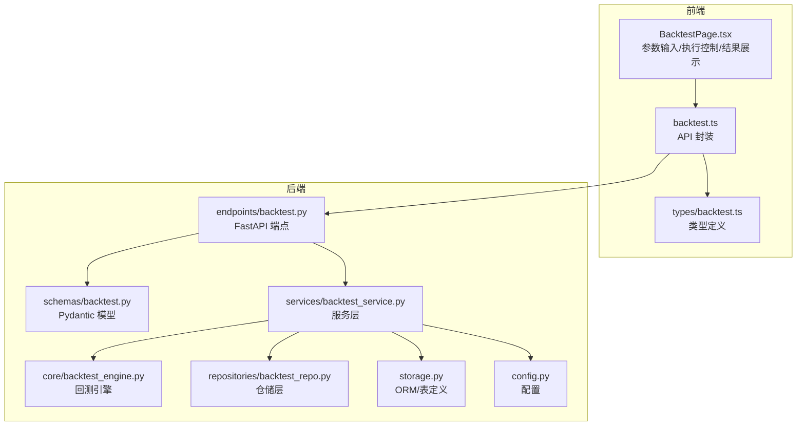
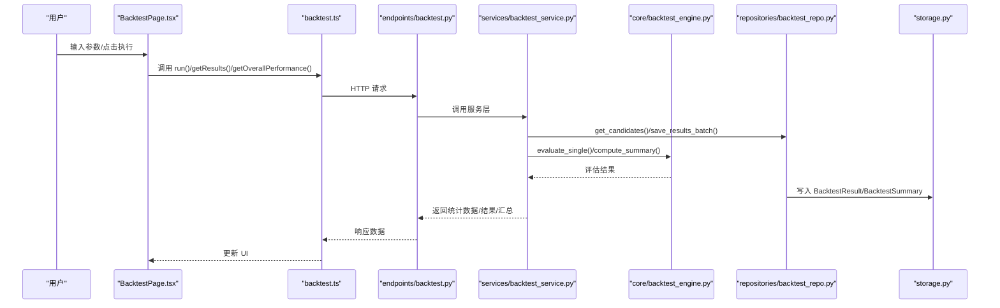
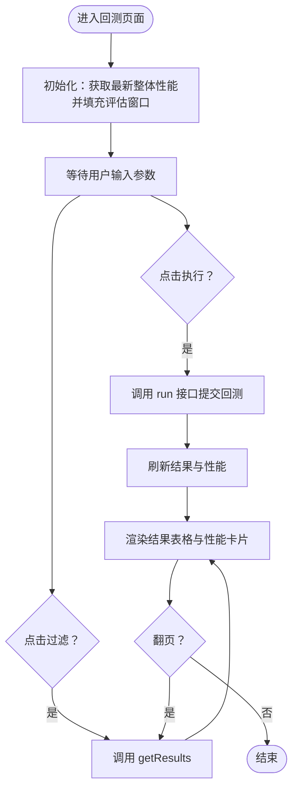
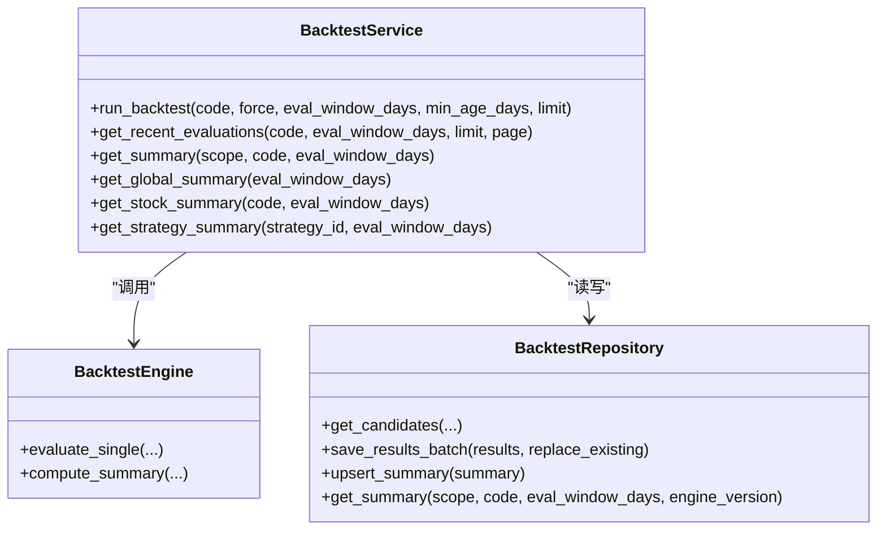
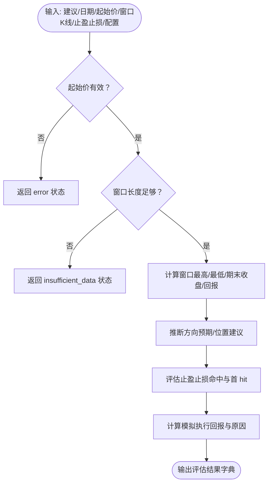
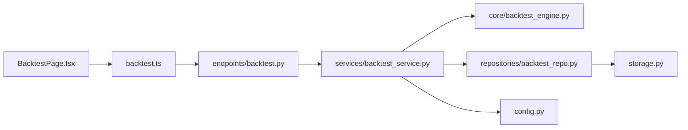

# 回测页面

<cite>
**本文引用的文件**
- [apps/dsa-web/src/pages/BacktestPage.tsx](file://apps/dsa-web/src/pages/BacktestPage.tsx)
- [apps/dsa-web/src/api/backtest.ts](file://apps/dsa-web/src/api/backtest.ts)
- [apps/dsa-web/src/types/backtest.ts](file://apps/dsa-web/src/types/backtest.ts)
- [api/v1/endpoints/backtest.py](file://api/v1/endpoints/backtest.py)
- [api/v1/schemas/backtest.py](file://api/v1/schemas/backtest.py)
- [src/services/backtest_service.py](file://src/services/backtest_service.py)
- [src/core/backtest_engine.py](file://src/core/backtest_engine.py)
- [src/repositories/backtest_repo.py](file://src/repositories/backtest_repo.py)
- [src/storage.py](file://src/storage.py)
- [src/config.py](file://src/config.py)
- [tests/test_backtest_service.py](file://tests/test_backtest_service.py)
</cite>

## 目录
1. [简介](#简介)
2. [项目结构](#项目结构)
3. [核心组件](#核心组件)
4. [架构总览](#架构总览)
5. [详细组件分析](#详细组件分析)
6. [依赖分析](#依赖分析)
7. [性能考虑](#性能考虑)
8. [故障排查指南](#故障排查指南)
9. [结论](#结论)
10. [附录](#附录)

## 简介
本文件面向回测页面组件，系统性阐述其用户界面设计、参数配置、执行控制与结果展示；详解回测参数设置、历史数据选择、分析周期配置与性能指标计算；说明回测任务提交流程、进度监控、结果可视化与数据导出能力；解释回测结果的图表展示、统计分析与对比功能；并给出性能优化、数据缓存策略与错误处理机制，以及参数调优、结果解读与扩展开发指导。

## 项目结构
回测页面位于前端 Web 应用中，通过 API 层对接后端服务与数据库。核心交互路径如下：
- 前端页面 BacktestPage.tsx 负责参数输入、执行控制与结果展示
- 前端 API 模块 backtest.ts 封装回测相关请求
- 后端 FastAPI 端点 backtest.py 提供 /run、/results、/performance 接口
- 服务层 backtest_service.py 组织回测执行、汇总与查询
- 引擎 backtest_engine.py 实现纯逻辑的回测评估
- 仓储 backtest_repo.py 提供数据库访问
- 存储 storage.py 定义 ORM 表结构
- 配置 config.py 提供回测默认参数与开关

**图示来源**
- [apps/dsa-web/src/pages/BacktestPage.tsx:111-445](file://apps/dsa-web/src/pages/BacktestPage.tsx#L111-L445)
- [apps/dsa-web/src/api/backtest.ts:13-103](file://apps/dsa-web/src/api/backtest.ts#L13-L103)
- [apps/dsa-web/src/types/backtest.ts:1-96](file://apps/dsa-web/src/types/backtest.ts#L1-L96)
- [api/v1/endpoints/backtest.py:28-161](file://api/v1/endpoints/backtest.py#L28-L161)
- [api/v1/schemas/backtest.py:11-95](file://api/v1/schemas/backtest.py#L11-L95)
- [src/services/backtest_service.py:22-447](file://src/services/backtest_service.py#L22-L447)
- [src/core/backtest_engine.py:50-556](file://src/core/backtest_engine.py#L50-L556)
- [src/repositories/backtest_repo.py:21-222](file://src/repositories/backtest_repo.py#L21-L222)
- [src/storage.py:272-393](file://src/storage.py#L272-L393)
- [src/config.py:386-390](file://src/config.py#L386-L390)

**章节来源**
- [apps/dsa-web/src/pages/BacktestPage.tsx:111-445](file://apps/dsa-web/src/pages/BacktestPage.tsx#L111-L445)
- [apps/dsa-web/src/api/backtest.ts:13-103](file://apps/dsa-web/src/api/backtest.ts#L13-L103)
- [api/v1/endpoints/backtest.py:28-161](file://api/v1/endpoints/backtest.py#L28-L161)

## 核心组件
- 页面组件 BacktestPage.tsx
  - 参数输入：股票代码过滤、评估窗口天数、强制重跑开关
  - 执行控制：触发回测、过滤结果、分页导航
  - 结果展示：整体与个股性能卡片、回测结果表格、运行摘要与错误提示
- API 模块 backtest.ts
  - run：提交回测任务
  - getResults：分页获取回测结果
  - getOverallPerformance / getStockPerformance：获取整体/个股性能指标
- 类型定义 types/backtest.ts
  - BacktestRunRequest/Response、BacktestResultItem、PerformanceMetrics
- 后端端点 endpoints/backtest.py
  - /run、/results、/performance、/performance/{code}
- 服务层 services/backtest_service.py
  - run_backtest：组织候选、执行评估、落库、重算汇总
  - get_recent_evaluations / get_summary：查询结果与汇总
- 引擎 core/backtest_engine.py
  - evaluate_single：基于建议与目标价对历史分析进行回测
  - compute_summary：聚合统计指标
- 仓储 repositories/backtest_repo.py
  - get_candidates/save_results_batch/upsert_summary/get_summary
- 存储 storage.py
  - BacktestResult/BacktestSummary 表与唯一索引
- 配置 config.py
  - backtest_* 相关默认参数

**章节来源**
- [apps/dsa-web/src/pages/BacktestPage.tsx:111-445](file://apps/dsa-web/src/pages/BacktestPage.tsx#L111-L445)
- [apps/dsa-web/src/api/backtest.ts:13-103](file://apps/dsa-web/src/api/backtest.ts#L13-L103)
- [apps/dsa-web/src/types/backtest.ts:6-96](file://apps/dsa-web/src/types/backtest.ts#L6-L96)
- [api/v1/endpoints/backtest.py:28-161](file://api/v1/endpoints/backtest.py#L28-L161)
- [src/services/backtest_service.py:30-244](file://src/services/backtest_service.py#L30-L244)
- [src/core/backtest_engine.py:118-350](file://src/core/backtest_engine.py#L118-L350)
- [src/repositories/backtest_repo.py:27-195](file://src/repositories/backtest_repo.py#L27-L195)
- [src/storage.py:272-393](file://src/storage.py#L272-L393)
- [src/config.py:386-390](file://src/config.py#L386-L390)

## 架构总览
回测页面采用前后端分离架构：
- 前端负责参数与交互，调用后端 API 获取回测结果与性能指标
- 后端接收请求，委派服务层执行回测或查询汇总
- 服务层协调引擎与仓储，持久化结果与汇总
- 配置模块提供默认参数与开关

**图示来源**
- [apps/dsa-web/src/pages/BacktestPage.tsx:194-216](file://apps/dsa-web/src/pages/BacktestPage.tsx#L194-L216)
- [apps/dsa-web/src/api/backtest.ts:17-101](file://apps/dsa-web/src/api/backtest.ts#L17-L101)
- [api/v1/endpoints/backtest.py:38-159](file://api/v1/endpoints/backtest.py#L38-L159)
- [src/services/backtest_service.py:30-244](file://src/services/backtest_service.py#L30-L244)
- [src/core/backtest_engine.py:118-350](file://src/core/backtest_engine.py#L118-L350)
- [src/repositories/backtest_repo.py:27-195](file://src/repositories/backtest_repo.py#L27-L195)
- [src/storage.py:272-393](file://src/storage.py#L272-L393)

## 详细组件分析

### 页面组件 BacktestPage.tsx
- 参数与状态
  - codeFilter：股票代码过滤
  - evalDays：评估窗口天数
  - forceRerun：强制重跑开关
  - isRunning：执行中状态
  - runResult/runError/pageError：执行结果与错误
  - results/totalResults/currentPage/loading：结果列表与分页
  - overallPerf/stockPerf/loadingPerf：性能指标卡片
- 关键交互
  - handleRun：构造请求参数（code/force/evalWindowDays/minAgeDays），调用 run 接口，随后刷新结果与性能
  - handleFilter：按过滤条件刷新结果与性能
  - fetchResults/fetchPerformance：分页获取结果与性能
  - 分页处理：handlePageChange
- 结果展示
  - 性能卡片：方向准确率、胜率、平均回报、止盈止损触发率、首 hit 平均天数等
  - 结果表格：代码、日期、建议、方向、结果、回报、是否触停/止盈、状态
  - 运行摘要：已处理/已保存/已完成/数据不足/错误数
  - 错误提示：ApiErrorAlert

**图示来源**
- [apps/dsa-web/src/pages/BacktestPage.tsx:177-238](file://apps/dsa-web/src/pages/BacktestPage.tsx#L177-L238)

**章节来源**
- [apps/dsa-web/src/pages/BacktestPage.tsx:111-445](file://apps/dsa-web/src/pages/BacktestPage.tsx#L111-L445)

### API 模块 backtest.ts
- run(params)
  - code/force/evalWindowDays/minAgeDays/limit 映射为请求体
  - POST /api/v1/backtest/run
- getResults({code, evalWindowDays, page, limit})
  - GET /api/v1/backtest/results
- getOverallPerformance(evalWindowDays?)
  - GET /api/v1/backtest/performance
- getStockPerformance(code, evalWindowDays?)
  - GET /api/v1/backtest/performance/{code}

**章节来源**
- [apps/dsa-web/src/api/backtest.ts:13-103](file://apps/dsa-web/src/api/backtest.ts#L13-L103)

### 后端端点 endpoints/backtest.py
- POST /run
  - 调用 BacktestService.run_backtest，返回 processed/saved/completed/insufficient/errors
- GET /results
  - 分页返回 BacktestResultItem 列表
- GET /performance
  - 返回整体 PerformanceMetrics，未找到返回 404
- GET /performance/{code}
  - 返回个股 PerformanceMetrics，未找到返回 404

**章节来源**
- [api/v1/endpoints/backtest.py:28-161](file://api/v1/endpoints/backtest.py#L28-L161)

### 服务层 BacktestService
- run_backtest
  - 读取配置默认值（评估窗口、最小年龄、引擎版本、中性带宽）
  - 通过仓储获取候选分析记录（支持 force 与去重）
  - 对每个候选执行引擎评估，写入结果，批量保存
  - 重算整体与个股汇总
  - 返回统计摘要
- get_recent_evaluations
  - 分页查询回测结果
- get_summary/get_global_summary/get_stock_summary/get_strategy_summary
  - 查询汇总并做归一化（Agent 内存消费）

**图示来源**
- [src/services/backtest_service.py:30-244](file://src/services/backtest_service.py#L30-L244)
- [src/core/backtest_engine.py:50-350](file://src/core/backtest_engine.py#L50-L350)
- [src/repositories/backtest_repo.py:27-195](file://src/repositories/backtest_repo.py#L27-L195)

**章节来源**
- [src/services/backtest_service.py:30-244](file://src/services/backtest_service.py#L30-L244)

### 引擎 BacktestEngine
- evaluate_single
  - 输入：operation_advice、analysis_date、start_price、forward_bars、stop_loss、take_profit、EvaluationConfig
  - 输出：包含方向预期、位置建议、回报、命中情况、首 hit 时间与原因等
- compute_summary
  - 聚合计数与比率：完成数、胜/负/中性数、方向准确率、胜率、中性率、平均回报、目标价触发率、首 hit 平均天数、建议拆解与诊断

**图示来源**
- [src/core/backtest_engine.py:118-234](file://src/core/backtest_engine.py#L118-L234)

**章节来源**
- [src/core/backtest_engine.py:118-350](file://src/core/backtest_engine.py#L118-L350)

### 仓储与存储
- BacktestRepository
  - get_candidates：按代码、最小年龄、限制、评估窗口、引擎版本与 force 控制候选集
  - save_results_batch：支持 replace_existing 的批量写入
  - upsert_summary：按唯一键更新或新增汇总
  - get_summary：按作用域/代码/窗口/版本查询最新汇总
- Storage 表
  - BacktestResult：单次回测结果
  - BacktestSummary：整体/个股汇总指标

**章节来源**
- [src/repositories/backtest_repo.py:27-195](file://src/repositories/backtest_repo.py#L27-L195)
- [src/storage.py:272-393](file://src/storage.py#L272-L393)

### 类型与 Schema
- 前端类型 types/backtest.ts
  - BacktestRunRequest/Response、BacktestResultItem、PerformanceMetrics
- 后端 Pydantic 模型
  - BacktestRunRequest、BacktestRunResponse、BacktestResultItem、BacktestResultsResponse、PerformanceMetrics

**章节来源**
- [apps/dsa-web/src/types/backtest.ts:6-96](file://apps/dsa-web/src/types/backtest.ts#L6-L96)
- [api/v1/schemas/backtest.py:11-95](file://api/v1/schemas/backtest.py#L11-L95)

## 依赖分析
- 前端到后端
  - BacktestPage.tsx 依赖 backtest.ts 的 run/getResults/getOverallPerformance/getStockPerformance
  - backtest.ts 依赖 FastAPI 端点 endpoints/backtest.py
- 后端到服务层
  - endpoints/backtest.py 依赖 services/backtest_service.py
- 服务层到引擎与仓储
  - services/backtest_service.py 依赖 core/backtest_engine.py 与 repositories/backtest_repo.py
- 服务层到存储
  - repositories/backtest_repo.py 依赖 storage.py 的 ORM 表
- 配置
  - services/backtest_service.py 与 endpoints/backtest.py 读取 src/config.py 的回测默认参数

**图示来源**
- [apps/dsa-web/src/pages/BacktestPage.tsx:111-445](file://apps/dsa-web/src/pages/BacktestPage.tsx#L111-L445)
- [apps/dsa-web/src/api/backtest.ts:13-103](file://apps/dsa-web/src/api/backtest.ts#L13-L103)
- [api/v1/endpoints/backtest.py:28-161](file://api/v1/endpoints/backtest.py#L28-L161)
- [src/services/backtest_service.py:30-244](file://src/services/backtest_service.py#L30-L244)
- [src/core/backtest_engine.py:50-350](file://src/core/backtest_engine.py#L50-L350)
- [src/repositories/backtest_repo.py:27-195](file://src/repositories/backtest_repo.py#L27-L195)
- [src/storage.py:272-393](file://src/storage.py#L272-L393)
- [src/config.py:386-390](file://src/config.py#L386-L390)

**章节来源**
- [apps/dsa-web/src/pages/BacktestPage.tsx:111-445](file://apps/dsa-web/src/pages/BacktestPage.tsx#L111-L445)
- [api/v1/endpoints/backtest.py:28-161](file://api/v1/endpoints/backtest.py#L28-L161)
- [src/services/backtest_service.py:30-244](file://src/services/backtest_service.py#L30-L244)

## 性能考虑
- 批量写入
  - 服务层使用 save_results_batch 批量写入，减少事务开销
- 去重与幂等
  - 非 force 模式下，按 analysis_history_id + eval_window_days + engine_version 去重，避免重复计算
- 汇总重算
  - 仅在保存后对受影响的 code 与整体进行汇总重算，降低全表扫描成本
- 数据源补充
  - 当缺失窗口数据时，尝试从数据源拉取补齐，保证评估完整性
- 配置默认值
  - 通过 config.py 提供默认评估窗口、最小年龄、引擎版本与中性带宽，兼顾性能与准确性

**章节来源**
- [src/services/backtest_service.py:60-205](file://src/services/backtest_service.py#L60-L205)
- [src/repositories/backtest_repo.py:65-93](file://src/repositories/backtest_repo.py#L65-L93)
- [src/config.py:386-390](file://src/config.py#L386-L390)

## 故障排查指南
- 常见错误与处理
  - 404 未找到整体/个股汇总：前端 getOverallPerformance/getStockPerformance 捕获 404 并返回空，避免阻塞页面
  - 服务器内部错误：后端端点捕获异常并返回 500，前端通过 ApiErrorAlert 展示
- 数据不足
  - 若窗口长度不足或起始价缺失，评估状态为 insufficient_data 或 error，服务层记录并写入结果
- 强制重跑
  - force=true 时，先删除同窗口/版本下的既有结果再写入，确保覆盖
- 建议拆解与诊断
  - 性能指标包含 advice_breakdown 与 diagnostics，可用于定位问题

**章节来源**
- [apps/dsa-web/src/api/backtest.ts:64-101](file://apps/dsa-web/src/api/backtest.ts#L64-L101)
- [api/v1/endpoints/backtest.py:105-159](file://api/v1/endpoints/backtest.py#L105-L159)
- [src/services/backtest_service.py:76-194](file://src/services/backtest_service.py#L76-L194)

## 结论
回测页面通过清晰的参数配置、可靠的执行流程与丰富的结果展示，实现了从历史分析到回测评估的闭环。服务层与引擎解耦，仓储与存储明确，配合配置驱动的默认参数与幂等策略，既保证了性能也提升了可维护性。建议在生产环境中结合缓存与限流策略进一步优化响应速度，并持续完善指标体系与可视化能力。

## 附录

### 回测参数与配置
- 参数来源
  - 前端：股票代码、评估窗口天数、强制重跑
  - 配置：默认评估窗口、最小年龄、引擎版本、中性带宽
- 请求映射
  - run 接口接收 code/force/evalWindowDays/minAgeDays/limit
  - results/performance 接口接收 evalWindowDays 过滤

**章节来源**
- [apps/dsa-web/src/pages/BacktestPage.tsx:194-216](file://apps/dsa-web/src/pages/BacktestPage.tsx#L194-L216)
- [apps/dsa-web/src/api/backtest.ts:17-59](file://apps/dsa-web/src/api/backtest.ts#L17-L59)
- [src/config.py:386-390](file://src/config.py#L386-L390)

### 回测任务提交与进度监控
- 提交流程
  - 前端构造参数 → 调用 run → 后端服务层执行 → 写入结果与汇总 → 前端刷新
- 进度提示
  - runResult 展示 processed/saved/completed/insufficient/errors
  - 加载态与错误态分别通过 UI 与 ApiErrorAlert 呈现

**章节来源**
- [apps/dsa-web/src/pages/BacktestPage.tsx:194-216](file://apps/dsa-web/src/pages/BacktestPage.tsx#L194-L216)
- [apps/dsa-web/src/api/backtest.ts:17-30](file://apps/dsa-web/src/api/backtest.ts#L17-L30)

### 结果可视化与统计分析
- 性能卡片
  - 整体与个股：方向准确率、胜率、中性率、平均回报、止盈/止损触发率、首 hit 平均天数、建议拆解与诊断
- 结果表格
  - 代码、日期、建议、方向、结果、回报、是否触停/止盈、状态
- 对比功能
  - 通过过滤代码与评估窗口，对比不同策略/个股在相同窗口内的表现

**章节来源**
- [apps/dsa-web/src/pages/BacktestPage.tsx:64-107](file://apps/dsa-web/src/pages/BacktestPage.tsx#L64-L107)
- [apps/dsa-web/src/pages/BacktestPage.tsx:374-437](file://apps/dsa-web/src/pages/BacktestPage.tsx#L374-L437)

### 数据导出与扩展开发
- 导出
  - 前端当前未内置导出按钮；可通过 getResults 分页拉取全量数据并在前端拼装导出
- 扩展
  - 引擎支持自定义 EvaluationConfig（如中性带宽、引擎版本）
  - 服务层可扩展策略汇总（如策略级摘要）以适配 Agent 内存消费

**章节来源**
- [src/core/backtest_engine.py:44-47](file://src/core/backtest_engine.py#L44-L47)
- [src/services/backtest_service.py:246-260](file://src/services/backtest_service.py#L246-L260)

### 测试参考
- 单测覆盖
  - 强制/非强制幂等、结果字段正确性、汇总创建、分页查询、多股票汇总与整体聚合
- 测试文件
  - tests/test_backtest_service.py

**章节来源**
- [tests/test_backtest_service.py:82-277](file://tests/test_backtest_service.py#L82-L277)