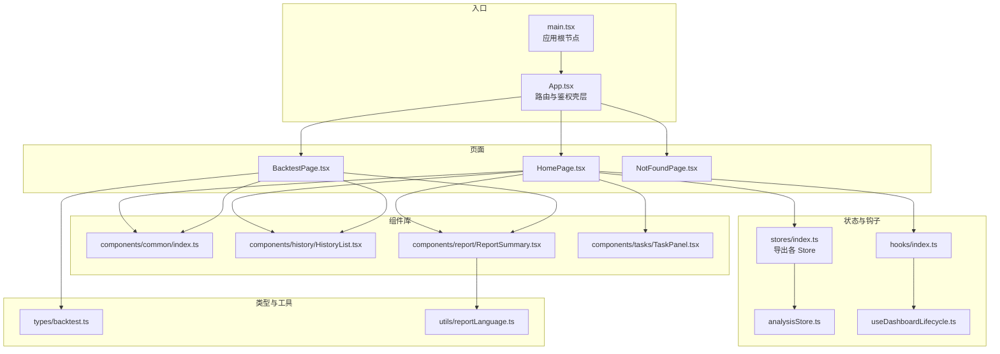
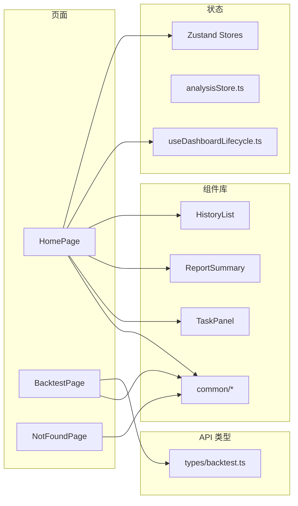
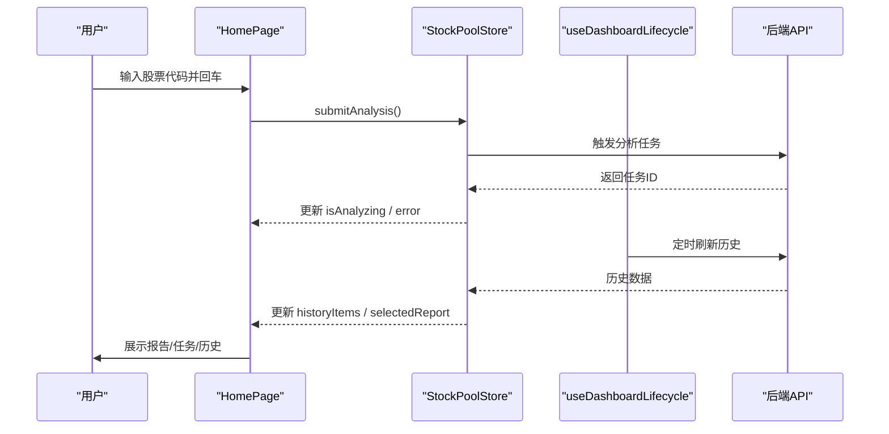
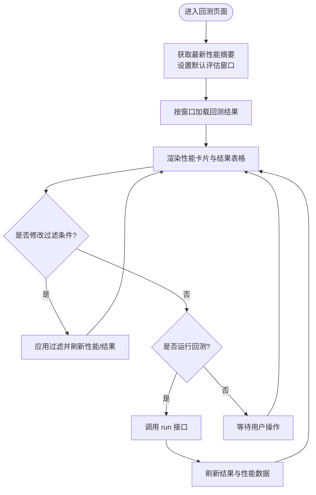
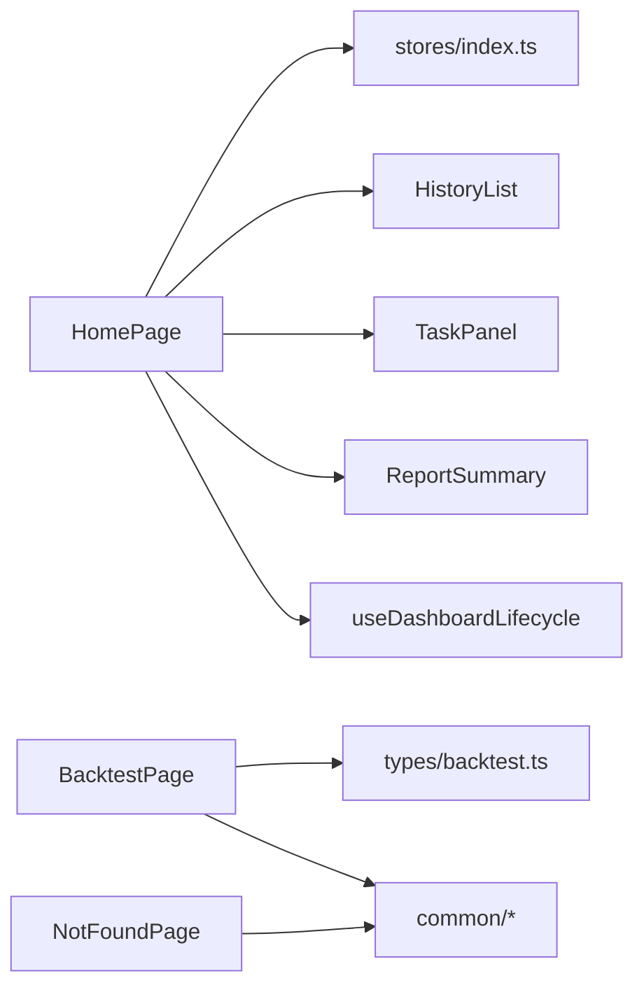

# 页面组件

<cite>
**本文引用的文件**
- [apps/dsa-web/src/pages/HomePage.tsx](file://apps/dsa-web/src/pages/HomePage.tsx)
- [apps/dsa-web/src/pages/BacktestPage.tsx](file://apps/dsa-web/src/pages/BacktestPage.tsx)
- [apps/dsa-web/src/pages/NotFoundPage.tsx](file://apps/dsa-web/src/pages/NotFoundPage.tsx)
- [apps/dsa-web/src/App.tsx](file://apps/dsa-web/src/App.tsx)
- [apps/dsa-web/src/main.tsx](file://apps/dsa-web/src/main.tsx)
- [apps/dsa-web/src/stores/index.ts](file://apps/dsa-web/src/stores/index.ts)
- [apps/dsa-web/src/hooks/index.ts](file://apps/dsa-web/src/hooks/index.ts)
- [apps/dsa-web/src/hooks/useDashboardLifecycle.ts](file://apps/dsa-web/src/hooks/useDashboardLifecycle.ts)
- [apps/dsa-web/src/stores/analysisStore.ts](file://apps/dsa-web/src/stores/analysisStore.ts)
- [apps/dsa-web/src/components/common/index.ts](file://apps/dsa-web/src/components/common/index.ts)
- [apps/dsa-web/src/components/history/HistoryList.tsx](file://apps/dsa-web/src/components/history/HistoryList.tsx)
- [apps/dsa-web/src/components/report/ReportSummary.tsx](file://apps/dsa-web/src/components/report/ReportSummary.tsx)
- [apps/dsa-web/src/components/tasks/TaskPanel.tsx](file://apps/dsa-web/src/components/tasks/TaskPanel.tsx)
- [apps/dsa-web/src/utils/reportLanguage.ts](file://apps/dsa-web/src/utils/reportLanguage.ts)
- [apps/dsa-web/src/types/backtest.ts](file://apps/dsa-web/src/types/backtest.ts)
</cite>

## 目录
1. [引言](#引言)
2. [项目结构](#项目结构)
3. [核心组件](#核心组件)
4. [架构总览](#架构总览)
5. [详细组件分析](#详细组件分析)
6. [依赖关系分析](#依赖关系分析)
7. [性能考量](#性能考量)
8. [故障排查指南](#故障排查指南)
9. [结论](#结论)
10. [附录](#附录)

## 引言
本技术文档聚焦于 Web 管理界面的页面组件，深入解析主页、回测页面与 404 页面的功能实现、用户交互流程、组件结构、状态管理与数据获取逻辑，并阐述页面间导航机制、参数传递与状态同步方式；同时覆盖页面级错误处理、加载状态与用户体验优化策略，以及性能优化、SEO 与无障碍支持建议、使用示例、扩展与定制指导，以及生命周期管理与内存优化策略。

## 项目结构
Web 管理界面基于 React + TypeScript 构建，采用模块化组织：页面位于 pages 目录，通用组件与布局位于 components 目录，状态管理通过 Zustand 存储，路由由 React Router 驱动，主题切换由 ThemeProvider 提供。

图表来源
- [apps/dsa-web/src/main.tsx:1-14](file://apps/dsa-web/src/main.tsx#L1-L14)
- [apps/dsa-web/src/App.tsx:1-87](file://apps/dsa-web/src/App.tsx#L1-L87)
- [apps/dsa-web/src/pages/HomePage.tsx:1-280](file://apps/dsa-web/src/pages/HomePage.tsx#L1-L280)
- [apps/dsa-web/src/pages/BacktestPage.tsx:1-445](file://apps/dsa-web/src/pages/BacktestPage.tsx#L1-L445)
- [apps/dsa-web/src/pages/NotFoundPage.tsx:1-45](file://apps/dsa-web/src/pages/NotFoundPage.tsx#L1-L45)
- [apps/dsa-web/src/stores/index.ts:1-4](file://apps/dsa-web/src/stores/index.ts#L1-L4)
- [apps/dsa-web/src/stores/analysisStore.ts:1-69](file://apps/dsa-web/src/stores/analysisStore.ts#L1-L69)
- [apps/dsa-web/src/hooks/index.ts:1-11](file://apps/dsa-web/src/hooks/index.ts#L1-L11)
- [apps/dsa-web/src/hooks/useDashboardLifecycle.ts:1-97](file://apps/dsa-web/src/hooks/useDashboardLifecycle.ts#L1-L97)
- [apps/dsa-web/src/components/common/index.ts:1-32](file://apps/dsa-web/src/components/common/index.ts#L1-L32)
- [apps/dsa-web/src/components/history/HistoryList.tsx:1-190](file://apps/dsa-web/src/components/history/HistoryList.tsx#L1-L190)
- [apps/dsa-web/src/components/report/ReportSummary.tsx:1-62](file://apps/dsa-web/src/components/report/ReportSummary.tsx#L1-L62)
- [apps/dsa-web/src/components/tasks/TaskPanel.tsx:1-161](file://apps/dsa-web/src/components/tasks/TaskPanel.tsx#L1-L161)
- [apps/dsa-web/src/utils/reportLanguage.ts:1-84](file://apps/dsa-web/src/utils/reportLanguage.ts#L1-L84)
- [apps/dsa-web/src/types/backtest.ts:1-96](file://apps/dsa-web/src/types/backtest.ts#L1-L96)

章节来源
- [apps/dsa-web/src/main.tsx:1-14](file://apps/dsa-web/src/main.tsx#L1-L14)
- [apps/dsa-web/src/App.tsx:1-87](file://apps/dsa-web/src/App.tsx#L1-L87)

## 核心组件
- 主页（HomePage）：负责分析输入、历史记录侧边栏、任务面板、报告展示、Markdown 抽屉与批量删除确认对话框；通过 useStockPoolStore 管理状态；通过 useDashboardLifecycle 实现自动刷新与任务流同步。
- 回测页面（BacktestPage）：负责策略回测运行、性能指标卡片、结果表格、分页与过滤；通过 backtestApi 获取数据；内置页面级错误处理与加载状态。
- 404 页面（NotFoundPage）：统一的未找到页面，提供返回首页按钮。
- 应用壳层（App.tsx）：集中处理鉴权、登录重定向、路由与全局错误提示。
- 入口（main.tsx）：应用根节点，包裹 ThemeProvider 与 App。

章节来源
- [apps/dsa-web/src/pages/HomePage.tsx:1-280](file://apps/dsa-web/src/pages/HomePage.tsx#L1-L280)
- [apps/dsa-web/src/pages/BacktestPage.tsx:1-445](file://apps/dsa-web/src/pages/BacktestPage.tsx#L1-L445)
- [apps/dsa-web/src/pages/NotFoundPage.tsx:1-45](file://apps/dsa-web/src/pages/NotFoundPage.tsx#L1-L45)
- [apps/dsa-web/src/App.tsx:1-87](file://apps/dsa-web/src/App.tsx#L1-L87)
- [apps/dsa-web/src/main.tsx:1-14](file://apps/dsa-web/src/main.tsx#L1-L14)

## 架构总览
页面组件与状态管理、API 访问、通用组件的关系如下：

图表来源
- [apps/dsa-web/src/pages/HomePage.tsx:1-280](file://apps/dsa-web/src/pages/HomePage.tsx#L1-L280)
- [apps/dsa-web/src/pages/BacktestPage.tsx:1-445](file://apps/dsa-web/src/pages/BacktestPage.tsx#L1-L445)
- [apps/dsa-web/src/pages/NotFoundPage.tsx:1-45](file://apps/dsa-web/src/pages/NotFoundPage.tsx#L1-L45)
- [apps/dsa-web/src/stores/analysisStore.ts:1-69](file://apps/dsa-web/src/stores/analysisStore.ts#L1-L69)
- [apps/dsa-web/src/hooks/useDashboardLifecycle.ts:1-97](file://apps/dsa-web/src/hooks/useDashboardLifecycle.ts#L1-L97)
- [apps/dsa-web/src/components/history/HistoryList.tsx:1-190](file://apps/dsa-web/src/components/history/HistoryList.tsx#L1-L190)
- [apps/dsa-web/src/components/report/ReportSummary.tsx:1-62](file://apps/dsa-web/src/components/report/ReportSummary.tsx#L1-L62)
- [apps/dsa-web/src/components/tasks/TaskPanel.tsx:1-161](file://apps/dsa-web/src/components/tasks/TaskPanel.tsx#L1-L161)
- [apps/dsa-web/src/types/backtest.ts:1-96](file://apps/dsa-web/src/types/backtest.ts#L1-L96)

## 详细组件分析

### 主页（HomePage）
- 功能与交互
  - 顶部输入框支持回车触发分析；根据 isAnalyzing 禁用状态控制交互。
  - 历史记录侧边栏：支持滚动加载、批量选择、全选、删除确认对话框。
  - 任务面板：展示进行中与等待中的分析任务。
  - 报告展示：根据 selectedReport 渲染 ReportSummary；支持打开 Markdown 抽屉与跳转聊天页面。
  - 错误处理：顶部 ApiErrorAlert 展示错误，支持一键清除。
- 组件结构
  - 使用 useStockPoolStore 管理查询、历史、报告、任务等状态。
  - useDashboardLifecycle 自动初始化历史、定时刷新、可见性刷新与任务流同步。
  - HistoryList、TaskPanel、ReportSummary、ConfirmDialog、ApiErrorAlert 等通用组件组合。
- 数据获取与状态管理
  - 通过 loadInitialHistory、refreshHistory、loadMoreHistory、selectHistoryItem、deleteSelectedHistory 等动作更新状态。
  - 通过 syncTaskCreated/Updated/Failed/removeTask 与 SSE 事件同步任务状态。
- 用户体验
  - 移动端侧边栏抽屉、加载指示器、空态占位、批量操作反馈。
- 导航与参数传递
  - 点击“追问 AI”按钮，携带 stock、name、recordId 参数跳转至聊天页面。
- SEO 与无障碍
  - 设置 document.title；输入框与按钮具备可访问性属性（aria-*）。
- 性能与内存
  - 使用 useMemo 缓存侧边栏内容；useEffect 清理定时器与超时队列；HistoryList 使用 IntersectionObserver 懒加载。

图表来源
- [apps/dsa-web/src/pages/HomePage.tsx:1-280](file://apps/dsa-web/src/pages/HomePage.tsx#L1-L280)
- [apps/dsa-web/src/hooks/useDashboardLifecycle.ts:1-97](file://apps/dsa-web/src/hooks/useDashboardLifecycle.ts#L1-L97)

章节来源
- [apps/dsa-web/src/pages/HomePage.tsx:1-280](file://apps/dsa-web/src/pages/HomePage.tsx#L1-L280)
- [apps/dsa-web/src/hooks/useDashboardLifecycle.ts:1-97](file://apps/dsa-web/src/hooks/useDashboardLifecycle.ts#L1-L97)
- [apps/dsa-web/src/components/history/HistoryList.tsx:1-190](file://apps/dsa-web/src/components/history/HistoryList.tsx#L1-L190)
- [apps/dsa-web/src/components/tasks/TaskPanel.tsx:1-161](file://apps/dsa-web/src/components/tasks/TaskPanel.tsx#L1-L161)
- [apps/dsa-web/src/components/report/ReportSummary.tsx:1-62](file://apps/dsa-web/src/components/report/ReportSummary.tsx#L1-L62)

### 回测页面（BacktestPage）
- 功能与交互
  - 输入过滤条件（股票代码、评估窗口天数）、强制重跑开关、运行回测按钮。
  - 性能卡片：总体与个股性能指标；支持加载中与空态。
  - 结果表格：展示回测结果，含方向正确率、胜率、回报率、止盈止损命中率等；支持按 Enter 过滤。
  - 分页：每页固定条目数，计算总页数并支持页码切换。
  - 页面级错误：runError（运行错误）、pageError（列表/性能获取错误）。
- 数据获取与状态管理
  - 初始化：先获取最新性能摘要以确定默认评估窗口，再按窗口过滤结果。
  - 运行回测：调用 run 接口，成功后刷新结果与性能数据。
  - 列表与性能：分别独立加载，互不影响。
- 用户体验
  - 加载指示器、空态占位、状态徽标、布尔值可视化图标。
- 导航与参数传递
  - 通过 backtestApi 的请求参数传递 code、evalWindowDays、force 等。
- 性能与内存
  - useCallback 包装异步函数避免重复创建；分页与过滤时仅重新拉取对应数据。

图表来源
- [apps/dsa-web/src/pages/BacktestPage.tsx:1-445](file://apps/dsa-web/src/pages/BacktestPage.tsx#L1-L445)
- [apps/dsa-web/src/types/backtest.ts:1-96](file://apps/dsa-web/src/types/backtest.ts#L1-L96)

章节来源
- [apps/dsa-web/src/pages/BacktestPage.tsx:1-445](file://apps/dsa-web/src/pages/BacktestPage.tsx#L1-L445)
- [apps/dsa-web/src/types/backtest.ts:1-96](file://apps/dsa-web/src/types/backtest.ts#L1-L96)

### 404 页面（NotFoundPage）
- 功能与交互
  - 展示 404 文案与返回首页按钮；点击后使用 useNavigate 跳转到主页。
  - 设置页面标题。
- 用户体验
  - 简洁视觉与明确的操作指引。

章节来源
- [apps/dsa-web/src/pages/NotFoundPage.tsx:1-45](file://apps/dsa-web/src/pages/NotFoundPage.tsx#L1-L45)

### 应用壳层与导航（App.tsx）
- 功能与交互
  - 鉴权：根据 authEnabled 与 loggedIn 决定是否重定向到登录页或直接渲染页面。
  - 登录页保护：当已登录时将 /login 重定向到首页。
  - 全局错误：加载鉴权状态失败时展示错误与重试按钮。
  - 路由：在 Shell 包裹下渲染各页面；通配符 * 映射到 404。
  - 路由变更：通过 useAgentChatStore 同步当前路由路径。
- 用户体验
  - 加载态、错误态与正常态的清晰区分。

章节来源
- [apps/dsa-web/src/App.tsx:1-87](file://apps/dsa-web/src/App.tsx#L1-L87)

## 依赖关系分析
- 页面到状态
  - HomePage 依赖 stores/index.ts 中导出的 stockPoolStore（通过 useStockPoolStore），间接使用 analysisStore 与 agentChatStore。
  - BacktestPage 依赖 types/backtest.ts 的类型定义与 backtestApi。
- 页面到组件
  - HomePage 复用 HistoryList、TaskPanel、ReportSummary、ApiErrorAlert、ConfirmDialog 等组件。
  - BacktestPage 复用 Card、Badge、Pagination、ApiErrorAlert 等组件。
- 页面到钩子
  - HomePage 使用 useDashboardLifecycle 管理生命周期与任务流。
  - hooks/index.ts 汇总导出 useAuth、useDashboardLifecycle、useTaskStream 等。
- 页面到工具
  - HomePage 使用 reportLanguage 工具进行报告文案本地化。

图表来源
- [apps/dsa-web/src/pages/HomePage.tsx:1-280](file://apps/dsa-web/src/pages/HomePage.tsx#L1-L280)
- [apps/dsa-web/src/pages/BacktestPage.tsx:1-445](file://apps/dsa-web/src/pages/BacktestPage.tsx#L1-L445)
- [apps/dsa-web/src/pages/NotFoundPage.tsx:1-45](file://apps/dsa-web/src/pages/NotFoundPage.tsx#L1-L45)
- [apps/dsa-web/src/stores/index.ts:1-4](file://apps/dsa-web/src/stores/index.ts#L1-L4)
- [apps/dsa-web/src/hooks/index.ts:1-11](file://apps/dsa-web/src/hooks/index.ts#L1-L11)
- [apps/dsa-web/src/types/backtest.ts:1-96](file://apps/dsa-web/src/types/backtest.ts#L1-L96)

章节来源
- [apps/dsa-web/src/stores/index.ts:1-4](file://apps/dsa-web/src/stores/index.ts#L1-L4)
- [apps/dsa-web/src/hooks/index.ts:1-11](file://apps/dsa-web/src/hooks/index.ts#L1-L11)
- [apps/dsa-web/src/components/common/index.ts:1-32](file://apps/dsa-web/src/components/common/index.ts#L1-L32)

## 性能考量
- 加载与懒加载
  - HomePage 的 HistoryList 使用 IntersectionObserver 触发“加载更多”，避免一次性渲染大量历史项。
  - BacktestPage 对结果与性能分别加载，减少单次请求压力。
- 状态与渲染优化
  - HomePage 使用 useMemo 缓存侧边栏内容，降低不必要的重渲染。
  - BacktestPage 使用 useCallback 包装异步函数，避免闭包导致的重复订阅。
- 定时与可见性
  - useDashboardLifecycle 在页面可见时刷新，减少后台消耗；定时器在组件卸载时清理。
- 内存优化
  - 生命周期钩子中清理定时器与超时队列；长列表组件使用受控滚动容器与惰性渲染。
- 可访问性与 SEO
  - 设置页面标题；输入框与按钮具备 aria-* 属性；表格与徽标语义化良好。
- 无障碍建议
  - 为按钮添加 aria-label；为表格添加 caption 或标题；为加载状态提供屏幕阅读器友好的文本。
- SEO 建议
  - 为每个页面设置唯一标题与描述；确保静态资源可缓存；对动态内容提供 SSR/预渲染方案（如需）。

## 故障排查指南
- 页面级错误
  - HomePage：顶部 ApiErrorAlert 展示错误，支持 clearError 清除。
  - BacktestPage：runError（运行错误）、pageError（列表/性能获取错误）分别处理。
- 加载状态
  - HomePage：isLoadingReport、isLoadingHistory、isLoadingMore、isDeletingHistory 控制加载与禁用状态。
  - BacktestPage：isLoadingResults、isLoadingPerf 控制加载状态。
- 任务流问题
  - useDashboardLifecycle 通过 SSE 事件同步任务状态；若断连会自动重连并记录日志。
- 导航与参数
  - App.tsx 中登录保护与重定向逻辑；BacktestPage 的过滤参数通过输入框与键盘事件驱动。
- 常见问题定位
  - 检查网络面板与控制台错误；确认鉴权状态与路由路径；验证 IntersectionObserver 支持与滚动容器高度。

章节来源
- [apps/dsa-web/src/pages/HomePage.tsx:1-280](file://apps/dsa-web/src/pages/HomePage.tsx#L1-L280)
- [apps/dsa-web/src/pages/BacktestPage.tsx:1-445](file://apps/dsa-web/src/pages/BacktestPage.tsx#L1-L445)
- [apps/dsa-web/src/hooks/useDashboardLifecycle.ts:1-97](file://apps/dsa-web/src/hooks/useDashboardLifecycle.ts#L1-L97)
- [apps/dsa-web/src/App.tsx:1-87](file://apps/dsa-web/src/App.tsx#L1-L87)

## 结论
主页、回测页面与 404 页面共同构成 Web 管理界面的核心交互层。它们通过统一的组件库、状态管理与路由体系实现一致的用户体验与可维护性。HomePage 注重实时任务与历史联动，BacktestPage 强调数据可视化与性能指标，NotFoundPage 提供一致的兜底体验。整体设计在性能、可访问性与可扩展性方面均有良好基础，适合进一步增强与定制。

## 附录
- 使用示例
  - 在 HomePage 中新增一个历史记录操作：通过 HistoryList 的 onItemClick 回调更新 selectedReport 并关闭移动端侧边栏。
  - 在 BacktestPage 中扩展过滤条件：增加时间范围筛选字段并通过 backtestApi.getResults 传参。
- 扩展与定制指导
  - 新增页面：在 App.tsx 的路由中注册新页面，并在 Shell 下方渲染；为新页面设置 document.title。
  - 自定义组件：复用 components/common 与 components/layout 下的通用组件，保持设计一致性。
  - 状态扩展：在 stores/index.ts 中导出新的 Store，并在页面中通过 useXxxStore 访问。
- 生命周期与内存优化
  - 在页面卸载时清理定时器与 SSE 连接；对长列表使用虚拟化或分页；对高频事件使用防抖/节流。
- SEO 与无障碍
  - 为每个页面设置语义化标题；为关键交互元素提供 aria-label；为表格与图表提供可读性描述。