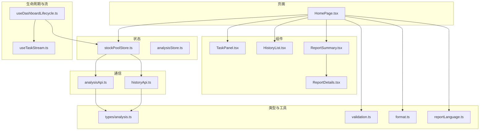
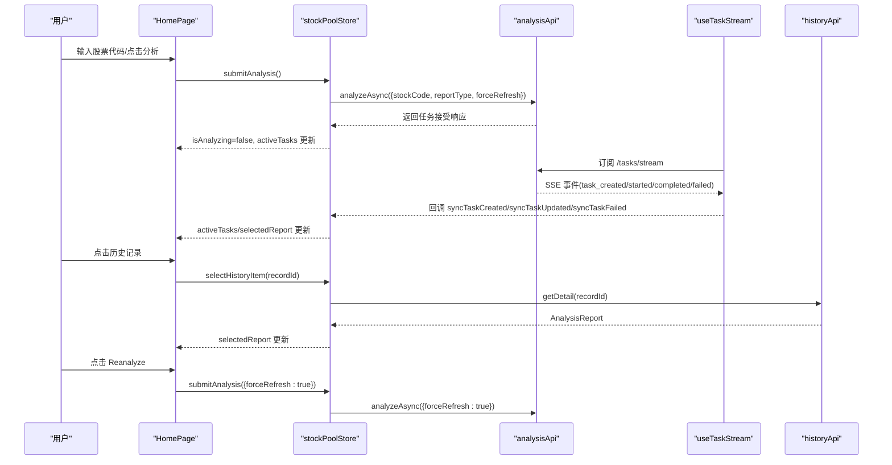
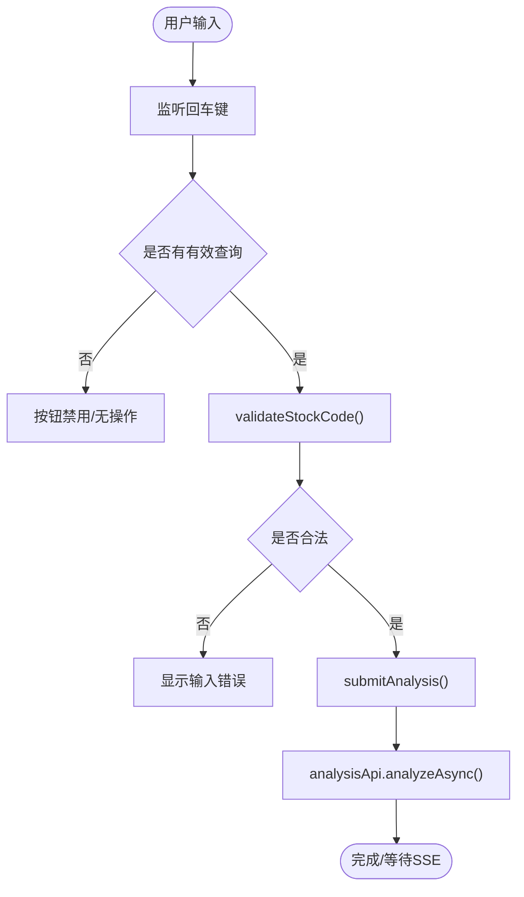
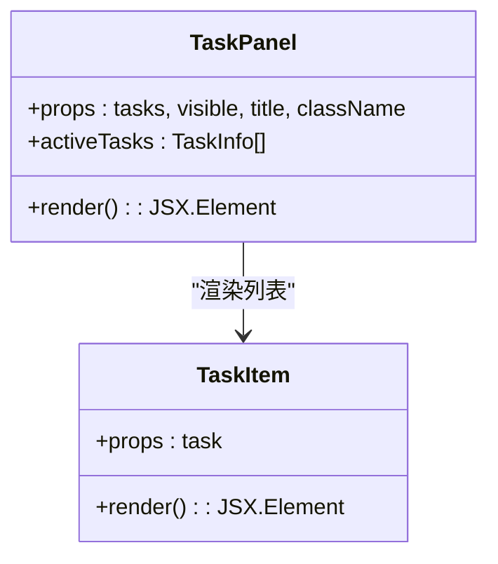
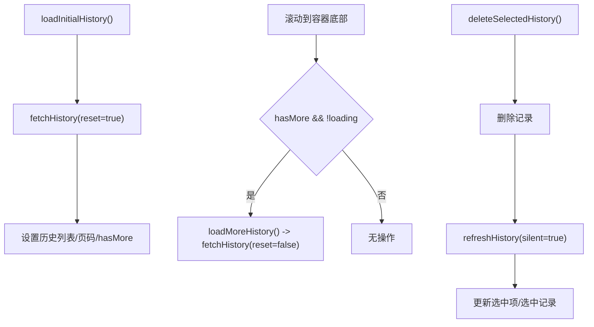
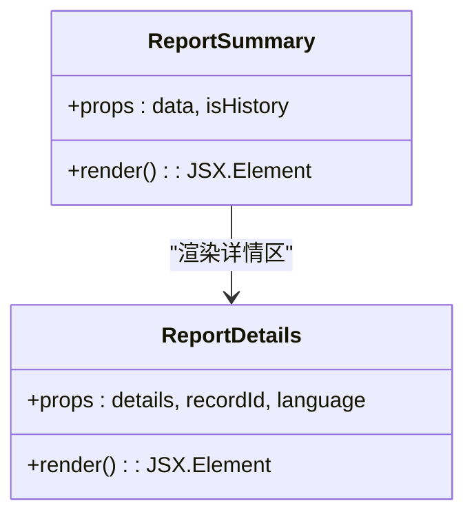
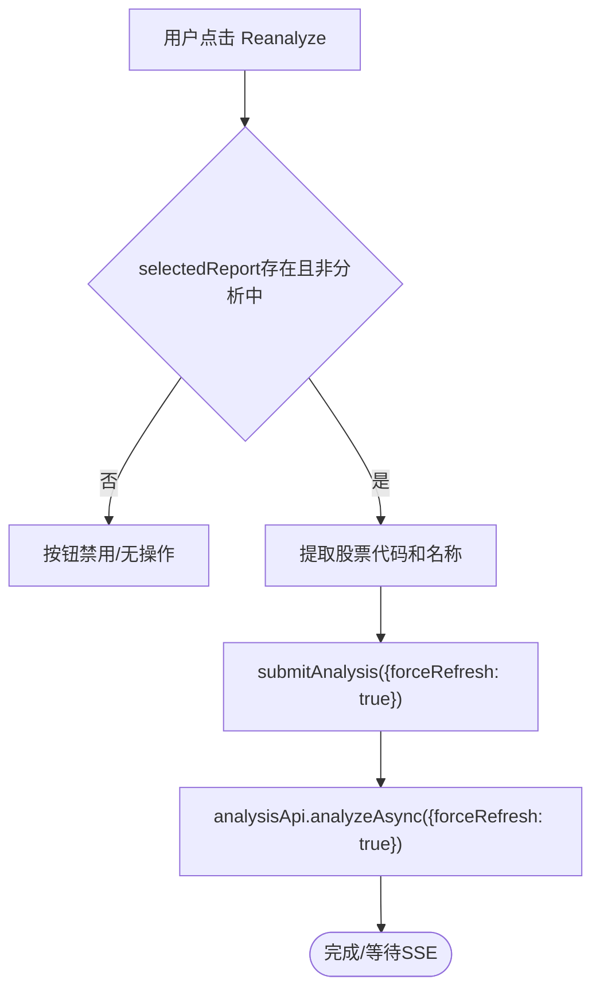
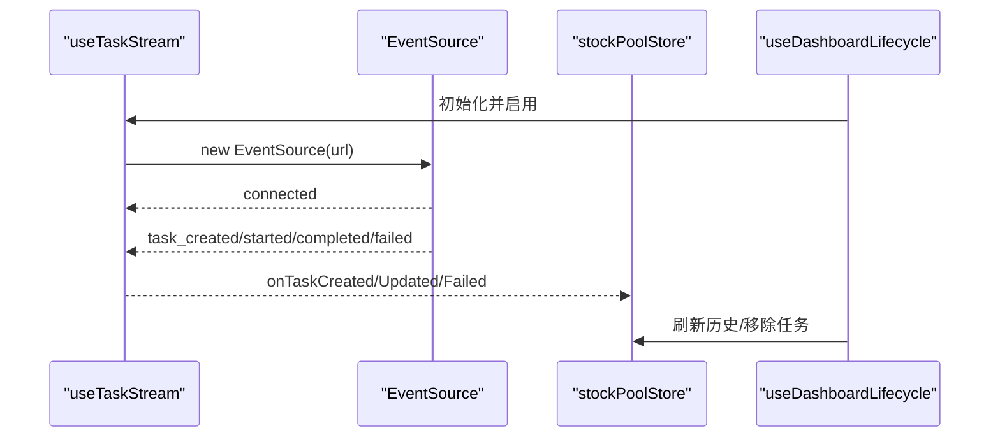
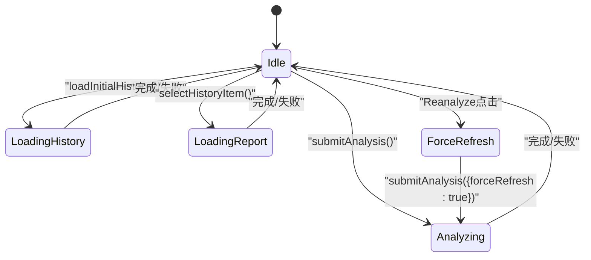
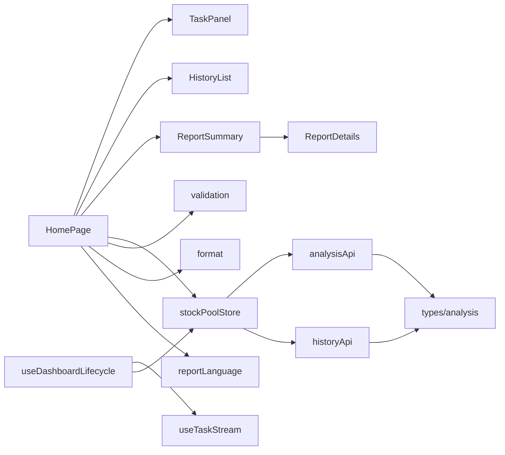

# 首页组件

<cite>
**本文引用的文件**
- [apps/dsa-web/src/pages/HomePage.tsx](file://apps/dsa-web/src/pages/HomePage.tsx)
- [apps/dsa-web/src/components/tasks/TaskPanel.tsx](file://apps/dsa-web/src/components/tasks/TaskPanel.tsx)
- [apps/dsa-web/src/components/report/ReportDetails.tsx](file://apps/dsa-web/src/components/report/ReportDetails.tsx)
- [apps/dsa-web/src/components/report/ReportSummary.tsx](file://apps/dsa-web/src/components/report/ReportSummary.tsx)
- [apps/dsa-web/src/components/history/HistoryList.tsx](file://apps/dsa-web/src/components/history/HistoryList.tsx)
- [apps/dsa-web/src/stores/stockPoolStore.ts](file://apps/dsa-web/src/stores/stockPoolStore.ts)
- [apps/dsa-web/src/stores/analysisStore.ts](file://apps/dsa-web/src/stores/analysisStore.ts)
- [apps/dsa-web/src/hooks/useTaskStream.ts](file://apps/dsa-web/src/hooks/useTaskStream.ts)
- [apps/dsa-web/src/hooks/useDashboardLifecycle.ts](file://apps/dsa-web/src/hooks/useDashboardLifecycle.ts)
- [apps/dsa-web/src/api/analysis.ts](file://apps/dsa-web/src/api/analysis.ts)
- [apps/dsa-web/src/api/history.ts](file://apps/dsa-web/src/api/history.ts)
- [apps/dsa-web/src/types/analysis.ts](file://apps/dsa-web/src/types/analysis.ts)
- [apps/dsa-web/src/utils/validation.ts](file://apps/dsa-web/src/utils/validation.ts)
- [apps/dsa-web/src/utils/format.ts](file://apps/dsa-web/src/utils/format.ts)
- [apps/dsa-web/src/utils/reportLanguage.ts](file://apps/dsa-web/src/utils/reportLanguage.ts)
</cite>

## 更新摘要
**变更内容**
- 新增'Reanalyze'按钮功能，支持用户手动触发强制重新分析
- 实现状态管理和重复提交防护机制
- 提供中英文本地化支持
- 增强用户交互体验和错误处理

## 目录
1. [简介](#简介)
2. [项目结构](#项目结构)
3. [核心组件](#核心组件)
4. [架构总览](#架构总览)
5. [详细组件分析](#详细组件分析)
6. [依赖关系分析](#依赖关系分析)
7. [性能考量](#性能考量)
8. [故障排查指南](#故障排查指南)
9. [结论](#结论)
10. [附录](#附录)

## 简介
本文件为"首页组件"的技术文档，聚焦于单页设计架构与交互体验，涵盖顶部输入栏、左侧任务面板、右侧报告详情的布局实现；详述股票代码验证、异步分析任务提交、SSE 实时任务流处理机制；阐述历史记录加载、分页机制、竞态条件处理与状态管理策略；解释用户交互流程（键盘快捷键、错误处理、加载状态与体验优化）；并提供性能优化、内存管理与可访问性支持建议，以及扩展功能、定制化选项与最佳实践。

**更新** 新增'Reanalyze'按钮功能，支持用户手动触发强制重新分析，包含状态管理和重复提交防护机制，提供中英文本地化支持。

## 项目结构
首页组件位于 Web 前端应用中，采用模块化组织方式：
- 页面层：HomePage 负责整体布局与交互编排
- 组件层：左侧任务面板、历史记录列表、报告详情等
- 状态层：Zustand 状态管理（stockPoolStore、analysisStore）
- 通信层：analysisApi、historyApi
- 生命周期与流：useDashboardLifecycle、useTaskStream
- 类型与工具：types/analysis、validation、format、reportLanguage

**图表来源**
- [apps/dsa-web/src/pages/HomePage.tsx:12-280](file://apps/dsa-web/src/pages/HomePage.tsx#L12-L280)
- [apps/dsa-web/src/components/tasks/TaskPanel.tsx:103-161](file://apps/dsa-web/src/components/tasks/TaskPanel.tsx#L103-L161)
- [apps/dsa-web/src/components/history/HistoryList.tsx:27-190](file://apps/dsa-web/src/components/history/HistoryList.tsx#L27-L190)
- [apps/dsa-web/src/components/report/ReportSummary.tsx:18-62](file://apps/dsa-web/src/components/report/ReportSummary.tsx#L18-L62)
- [apps/dsa-web/src/components/report/ReportDetails.tsx:16-133](file://apps/dsa-web/src/components/report/ReportDetails.tsx#L16-L133)
- [apps/dsa-web/src/stores/stockPoolStore.ts:165-378](file://apps/dsa-web/src/stores/stockPoolStore.ts#L165-L378)
- [apps/dsa-web/src/stores/analysisStore.ts:24-69](file://apps/dsa-web/src/stores/analysisStore.ts#L24-L69)
- [apps/dsa-web/src/hooks/useDashboardLifecycle.ts:15-97](file://apps/dsa-web/src/hooks/useDashboardLifecycle.ts#L15-L97)
- [apps/dsa-web/src/hooks/useTaskStream.ts:78-255](file://apps/dsa-web/src/hooks/useTaskStream.ts#L78-L255)
- [apps/dsa-web/src/api/analysis.ts:15-132](file://apps/dsa-web/src/api/analysis.ts#L15-L132)
- [apps/dsa-web/src/api/history.ts:19-93](file://apps/dsa-web/src/api/history.ts#L19-L93)
- [apps/dsa-web/src/types/analysis.ts:1-245](file://apps/dsa-web/src/types/analysis.ts#L1-L245)
- [apps/dsa-web/src/utils/validation.ts:8-32](file://apps/dsa-web/src/utils/validation.ts#L8-L32)
- [apps/dsa-web/src/utils/format.ts:39-59](file://apps/dsa-web/src/utils/format.ts#L39-L59)
- [apps/dsa-web/src/utils/reportLanguage.ts:1-102](file://apps/dsa-web/src/utils/reportLanguage.ts#L1-L102)

**章节来源**
- [apps/dsa-web/src/pages/HomePage.tsx:12-280](file://apps/dsa-web/src/pages/HomePage.tsx#L12-L280)

## 核心组件
- 顶部输入栏：支持股票代码输入、回车提交、禁用态与错误提示
- 左侧任务面板：展示进行中/等待中的分析任务，含状态指示与计数
- 历史记录列表：支持滚动触底加载、批量选择、删除、静默刷新
- 报告详情：整合概览、策略、新闻、透明度与追溯区，并支持 Markdown 查看器
- **新增** Reanalyze按钮：支持用户手动触发强制重新分析，包含状态管理和重复提交防护机制

**章节来源**
- [apps/dsa-web/src/pages/HomePage.tsx:114-244](file://apps/dsa-web/src/pages/HomePage.tsx#L114-L244)
- [apps/dsa-web/src/components/tasks/TaskPanel.tsx:103-161](file://apps/dsa-web/src/components/tasks/TaskPanel.tsx#L103-L161)
- [apps/dsa-web/src/components/history/HistoryList.tsx:27-190](file://apps/dsa-web/src/components/history/HistoryList.tsx#L27-L190)
- [apps/dsa-web/src/components/report/ReportSummary.tsx:18-62](file://apps/dsa-web/src/components/report/ReportSummary.tsx#L18-L62)
- [apps/dsa-web/src/components/report/ReportDetails.tsx:16-133](file://apps/dsa-web/src/components/report/ReportDetails.tsx#L16-L133)

## 架构总览
首页组件采用"页面编排 + 组件拆分 + 状态集中 + 通信抽象 + 生命周期钩子"的架构模式：
- 页面负责布局与交互编排，调用 store 的动作以驱动状态变更
- 组件层职责单一，通过 props 传递数据与回调
- store 使用 Zustand 管理分析状态、历史记录、任务列表与 UI 状态
- API 层封装分析与历史接口，统一数据转换
- 生命周期钩子负责初始化、定时刷新、可见性刷新与 SSE 任务流接入

**图表来源**
- [apps/dsa-web/src/pages/HomePage.tsx:130-164](file://apps/dsa-web/src/pages/HomePage.tsx#L130-L164)
- [apps/dsa-web/src/stores/stockPoolStore.ts:289-336](file://apps/dsa-web/src/stores/stockPoolStore.ts#L289-L336)
- [apps/dsa-web/src/api/analysis.ts:51-81](file://apps/dsa-web/src/api/analysis.ts#L51-L81)
- [apps/dsa-web/src/hooks/useTaskStream.ts:147-209](file://apps/dsa-web/src/hooks/useTaskStream.ts#L147-L209)
- [apps/dsa-web/src/api/history.ts:49-52](file://apps/dsa-web/src/api/history.ts#L49-L52)

## 详细组件分析

### 顶部输入栏与交互流程
- 输入框绑定 query，支持回车提交，禁用态防止重复提交
- 提交前进行股票代码基础校验，错误时显示 inline 提示
- 成功提交后清空输入并进入分析中状态
- 支持从历史记录点击直接打开报告详情

**图表来源**
- [apps/dsa-web/src/pages/HomePage.tsx:125-164](file://apps/dsa-web/src/pages/HomePage.tsx#L125-L164)
- [apps/dsa-web/src/stores/stockPoolStore.ts:289-336](file://apps/dsa-web/src/stores/stockPoolStore.ts#L289-L336)
- [apps/dsa-web/src/utils/validation.ts:8-32](file://apps/dsa-web/src/utils/validation.ts#L8-L32)
- [apps/dsa-web/src/api/analysis.ts:51-81](file://apps/dsa-web/src/api/analysis.ts#L51-L81)

**章节来源**
- [apps/dsa-web/src/pages/HomePage.tsx:125-164](file://apps/dsa-web/src/pages/HomePage.tsx#L125-L164)
- [apps/dsa-web/src/stores/stockPoolStore.ts:289-336](file://apps/dsa-web/src/stores/stockPoolStore.ts#L289-L336)
- [apps/dsa-web/src/utils/validation.ts:8-32](file://apps/dsa-web/src/utils/validation.ts#L8-L32)

### 左侧任务面板
- 仅展示状态为 pending/processing 的任务
- 展示任务名称、代码、消息与状态标签
- 提供进行中/等待中计数，便于快速感知

**图表来源**
- [apps/dsa-web/src/components/tasks/TaskPanel.tsx:103-161](file://apps/dsa-web/src/components/tasks/TaskPanel.tsx#L103-L161)

**章节来源**
- [apps/dsa-web/src/components/tasks/TaskPanel.tsx:103-161](file://apps/dsa-web/src/components/tasks/TaskPanel.tsx#L103-L161)

### 历史记录列表与分页机制
- 使用 IntersectionObserver 检测滚动到底部，触发加载更多
- 支持批量选择、全选当前、删除所选
- 静默刷新：页面可见或定时器触发时刷新，避免阻塞用户
- 删除后自动清理选中项并尝试选中下一个记录

**图表来源**
- [apps/dsa-web/src/stores/stockPoolStore.ts:184-198](file://apps/dsa-web/src/stores/stockPoolStore.ts#L184-L198)
- [apps/dsa-web/src/stores/stockPoolStore.ts:255-287](file://apps/dsa-web/src/stores/stockPoolStore.ts#L255-L287)
- [apps/dsa-web/src/components/history/HistoryList.tsx:51-78](file://apps/dsa-web/src/components/history/HistoryList.tsx#L51-L78)
- [apps/dsa-web/src/hooks/useDashboardLifecycle.ts:34-59](file://apps/dsa-web/src/hooks/useDashboardLifecycle.ts#L34-L59)

**章节来源**
- [apps/dsa-web/src/components/history/HistoryList.tsx:27-190](file://apps/dsa-web/src/components/history/HistoryList.tsx#L27-L190)
- [apps/dsa-web/src/stores/stockPoolStore.ts:92-163](file://apps/dsa-web/src/stores/stockPoolStore.ts#L92-L163)
- [apps/dsa-web/src/stores/stockPoolStore.ts:184-198](file://apps/dsa-web/src/stores/stockPoolStore.ts#L184-L198)
- [apps/dsa-web/src/stores/stockPoolStore.ts:255-287](file://apps/dsa-web/src/stores/stockPoolStore.ts#L255-L287)
- [apps/dsa-web/src/hooks/useDashboardLifecycle.ts:34-59](file://apps/dsa-web/src/hooks/useDashboardLifecycle.ts#L34-L59)

### 报告详情与多区组合
- ReportSummary 整合概览、策略、新闻、详情四个区域
- ReportDetails 提供原始结果与上下文快照的可折叠 JSON 查看
- 支持复制 JSON、记录 ID 展示与语言文本本地化

**图表来源**
- [apps/dsa-web/src/components/report/ReportSummary.tsx:18-62](file://apps/dsa-web/src/components/report/ReportSummary.tsx#L18-L62)
- [apps/dsa-web/src/components/report/ReportDetails.tsx:16-133](file://apps/dsa-web/src/components/report/ReportDetails.tsx#L16-L133)

**章节来源**
- [apps/dsa-web/src/components/report/ReportSummary.tsx:18-62](file://apps/dsa-web/src/components/report/ReportSummary.tsx#L18-L62)
- [apps/dsa-web/src/components/report/ReportDetails.tsx:16-133](file://apps/dsa-web/src/components/report/ReportDetails.tsx#L16-L133)

### Reanalyze按钮功能
- **新增** 支持用户手动触发强制重新分析
- 从当前选中的报告中提取股票代码和名称
- 设置forceRefresh参数为true，强制刷新缓存
- 包含状态管理和重复提交防护机制
- 提供中英文本地化支持

**图表来源**
- [apps/dsa-web/src/pages/HomePage.tsx:102-114](file://apps/dsa-web/src/pages/HomePage.tsx#L102-L114)
- [apps/dsa-web/src/stores/stockPoolStore.ts:304-379](file://apps/dsa-web/src/stores/stockPoolStore.ts#L304-L379)
- [apps/dsa-web/src/api/analysis.ts:54-88](file://apps/dsa-web/src/api/analysis.ts#L54-L88)

**章节来源**
- [apps/dsa-web/src/pages/HomePage.tsx:102-114](file://apps/dsa-web/src/pages/HomePage.tsx#L102-L114)
- [apps/dsa-web/src/stores/stockPoolStore.ts:304-379](file://apps/dsa-web/src/stores/stockPoolStore.ts#L304-L379)
- [apps/dsa-web/src/api/analysis.ts:54-88](file://apps/dsa-web/src/api/analysis.ts#L54-L88)

### SSE 实时任务流处理机制
- useTaskStream 建立 EventSource 连接，订阅任务生命周期事件
- 自动重连与错误回调，保持连接稳定性
- 生命周期钩子 useDashboardLifecycle 统一接入，处理任务完成/失败后的清理与刷新

**图表来源**
- [apps/dsa-web/src/hooks/useTaskStream.ts:78-255](file://apps/dsa-web/src/hooks/useTaskStream.ts#L78-L255)
- [apps/dsa-web/src/hooks/useDashboardLifecycle.ts:77-93](file://apps/dsa-web/src/hooks/useDashboardLifecycle.ts#L77-L93)

**章节来源**
- [apps/dsa-web/src/hooks/useTaskStream.ts:78-255](file://apps/dsa-web/src/hooks/useTaskStream.ts#L78-L255)
- [apps/dsa-web/src/hooks/useDashboardLifecycle.ts:77-93](file://apps/dsa-web/src/hooks/useDashboardLifecycle.ts#L77-L93)

### 状态管理策略
- stockPoolStore：集中管理查询、历史、任务、报告与 UI 状态
- analysisStore：独立管理分析结果与历史视图状态
- 通过序列号（requestId）避免竞态，确保请求与响应一一对应
- dismissedTaskIds 集合避免重复渲染与抖动
- **新增** forceRefresh参数支持强制重新分析

**图表来源**
- [apps/dsa-web/src/stores/stockPoolStore.ts:289-336](file://apps/dsa-web/src/stores/stockPoolStore.ts#L289-L336)
- [apps/dsa-web/src/stores/stockPoolStore.ts:200-229](file://apps/dsa-web/src/stores/stockPoolStore.ts#L200-L229)
- [apps/dsa-web/src/stores/stockPoolStore.ts:184-198](file://apps/dsa-web/src/stores/stockPoolStore.ts#L184-L198)

**章节来源**
- [apps/dsa-web/src/stores/stockPoolStore.ts:20-81](file://apps/dsa-web/src/stores/stockPoolStore.ts#L20-L81)
- [apps/dsa-web/src/stores/stockPoolStore.ts:92-163](file://apps/dsa-web/src/stores/stockPoolStore.ts#L92-L163)
- [apps/dsa-web/src/stores/analysisStore.ts:24-69](file://apps/dsa-web/src/stores/analysisStore.ts#L24-L69)

### 中英文本地化支持
- reportLanguage工具提供中英文文本支持
- Reanalyze按钮显示对应语言的文本
- 支持根据报告语言自动切换界面文本

**章节来源**
- [apps/dsa-web/src/utils/reportLanguage.ts:1-102](file://apps/dsa-web/src/utils/reportLanguage.ts#L1-L102)
- [apps/dsa-web/src/pages/HomePage.tsx:279](file://apps/dsa-web/src/pages/HomePage.tsx#L279)

## 依赖关系分析
- 组件依赖：HomePage 依赖 TaskPanel、HistoryList、ReportSummary；ReportSummary 依赖 ReportDetails
- 状态依赖：HomePage 通过 stockPoolStore 驱动 UI；analysisStore 独立维护分析视图
- 通信依赖：analysisApi、historyApi 提供统一接口；types/analysis 定义数据契约
- 生命周期依赖：useDashboardLifecycle 统一接入 SSE 与定时刷新；useTaskStream 提供 SSE 事件解析与重连
- **新增** 本地化依赖：reportLanguage 提供多语言支持

**图表来源**
- [apps/dsa-web/src/pages/HomePage.tsx:1-11](file://apps/dsa-web/src/pages/HomePage.tsx#L1-L11)
- [apps/dsa-web/src/components/tasks/TaskPanel.tsx:1-10](file://apps/dsa-web/src/components/tasks/TaskPanel.tsx#L1-L10)
- [apps/dsa-web/src/components/history/HistoryList.tsx:1-5](file://apps/dsa-web/src/components/history/HistoryList.tsx#L1-L5)
- [apps/dsa-web/src/components/report/ReportSummary.tsx:1-7](file://apps/dsa-web/src/components/report/ReportSummary.tsx#L1-L7)
- [apps/dsa-web/src/components/report/ReportDetails.tsx:1-5](file://apps/dsa-web/src/components/report/ReportDetails.tsx#L1-L5)
- [apps/dsa-web/src/stores/stockPoolStore.ts:1-8](file://apps/dsa-web/src/stores/stockPoolStore.ts#L1-L8)
- [apps/dsa-web/src/hooks/useDashboardLifecycle.ts:1-3](file://apps/dsa-web/src/hooks/useDashboardLifecycle.ts#L1-L3)
- [apps/dsa-web/src/hooks/useTaskStream.ts:1-3](file://apps/dsa-web/src/hooks/useTaskStream.ts#L1-L3)
- [apps/dsa-web/src/api/analysis.ts:1-11](file://apps/dsa-web/src/api/analysis.ts#L1-L11)
- [apps/dsa-web/src/api/history.ts:1-10](file://apps/dsa-web/src/api/history.ts#L1-L10)
- [apps/dsa-web/src/types/analysis.ts:1-4](file://apps/dsa-web/src/types/analysis.ts#L1-L4)
- [apps/dsa-web/src/utils/validation.ts:1-5](file://apps/dsa-web/src/utils/validation.ts#L1-L5)
- [apps/dsa-web/src/utils/format.ts:1-5](file://apps/dsa-web/src/utils/format.ts#L1-L5)
- [apps/dsa-web/src/utils/reportLanguage.ts:1-102](file://apps/dsa-web/src/utils/reportLanguage.ts#L1-L102)

**章节来源**
- [apps/dsa-web/src/pages/HomePage.tsx:1-11](file://apps/dsa-web/src/pages/HomePage.tsx#L1-L11)
- [apps/dsa-web/src/stores/stockPoolStore.ts:1-8](file://apps/dsa-web/src/stores/stockPoolStore.ts#L1-L8)
- [apps/dsa-web/src/api/analysis.ts:1-11](file://apps/dsa-web/src/api/analysis.ts#L1-L11)
- [apps/dsa-web/src/api/history.ts:1-10](file://apps/dsa-web/src/api/history.ts#L1-L10)
- [apps/dsa-web/src/types/analysis.ts:1-4](file://apps/dsa-web/src/types/analysis.ts#L1-L4)

## 性能考量
- 滚动触底加载：使用 IntersectionObserver 减少不必要的渲染与计算
- 请求去重：通过序列号（requestId）避免竞态，减少无效渲染
- 任务移除延时：任务完成后延迟移除，避免闪烁与重复渲染
- 状态最小化：store 中仅保存必要状态，避免大对象深拷贝
- SSE 自动重连：在网络波动时自动恢复，提升稳定性
- 可访问性：为复选框、按钮提供语义化标签与键盘可达性
- **新增** Reanalyze按钮防抖：分析中状态下禁用按钮，避免重复提交

## 故障排查指南
- 提交失败
  - 检查输入是否符合 validateStockCode 规则
  - 若出现重复任务错误，等待现有任务完成后再试
- 历史记录不刷新
  - 确认 useDashboardLifecycle 是否启用与定时刷新是否生效
  - 检查 SSE 连接状态与错误回调
- 报告详情空白
  - 确认 selectedReport 是否存在，检查 recordId 是否正确
  - 检查 historyApi.getDetail 的返回数据结构
- 任务状态异常
  - 检查 useTaskStream 的事件解析与回调是否正确
  - 确认 dismissedTaskIds 是否意外阻止了任务显示
- **新增** Reanalyze按钮无效
  - 检查selectedReport是否存在且包含meta.id
  - 确认isAnalyzing状态是否为false
  - 验证forceRefresh参数是否正确传递到API层

**章节来源**
- [apps/dsa-web/src/utils/validation.ts:8-32](file://apps/dsa-web/src/utils/validation.ts#L8-L32)
- [apps/dsa-web/src/api/analysis.ts:140-150](file://apps/dsa-web/src/api/analysis.ts#L140-L150)
- [apps/dsa-web/src/hooks/useDashboardLifecycle.ts:77-93](file://apps/dsa-web/src/hooks/useDashboardLifecycle.ts#L77-L93)
- [apps/dsa-web/src/stores/stockPoolStore.ts:200-229](file://apps/dsa-web/src/stores/stockPoolStore.ts#L200-L229)
- [apps/dsa-web/src/hooks/useTaskStream.ts:136-144](file://apps/dsa-web/src/hooks/useTaskStream.ts#L136-L144)
- [apps/dsa-web/src/pages/HomePage.tsx:102-114](file://apps/dsa-web/src/pages/HomePage.tsx#L102-L114)

## 结论
首页组件通过清晰的分层与职责划分，实现了稳定、可扩展的分析工作台。顶部输入栏、左侧任务面板与右侧报告详情的布局简洁直观；结合 SSE 实时任务流与完善的分页/删除/刷新机制，提供了良好的用户体验。通过状态管理与生命周期钩子的协同，系统具备较强的抗干扰能力与可维护性。

**更新** 新增的'Reanalyze'按钮功能进一步增强了用户控制能力，支持强制重新分析现有报告，配合本地化支持提升了国际化用户体验。重复提交防护机制确保了系统的稳定性和数据一致性。

## 附录
- 扩展功能建议
  - 支持批量分析与导入
  - 增加报告导出（PDF/Markdown）
  - 历史记录筛选与排序
  - 主题与语言切换
  - **新增** Reanalyze历史记录功能
- 定制化选项
  - 任务面板显示项自定义
  - 报告区域折叠/展开
  - 加载动画与主题色系
  - **新增** Reanalyze按钮显示选项
- 最佳实践
  - 严格区分同步/异步分析场景
  - 使用序列号避免竞态
  - SSE 连接失败时提供明确反馈
  - 保持 UI 加载态与错误态一致的视觉反馈
  - **新增** Reanalyze按钮状态管理与用户体验优化