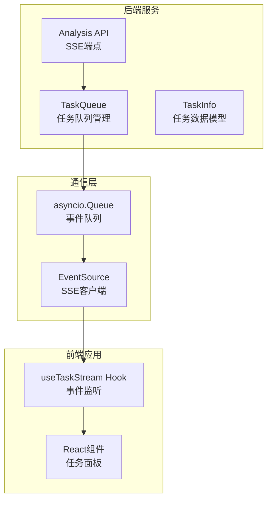
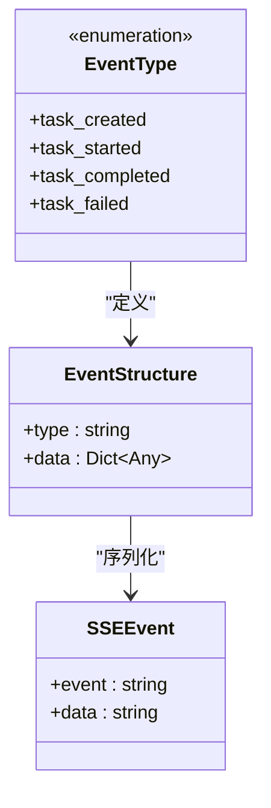
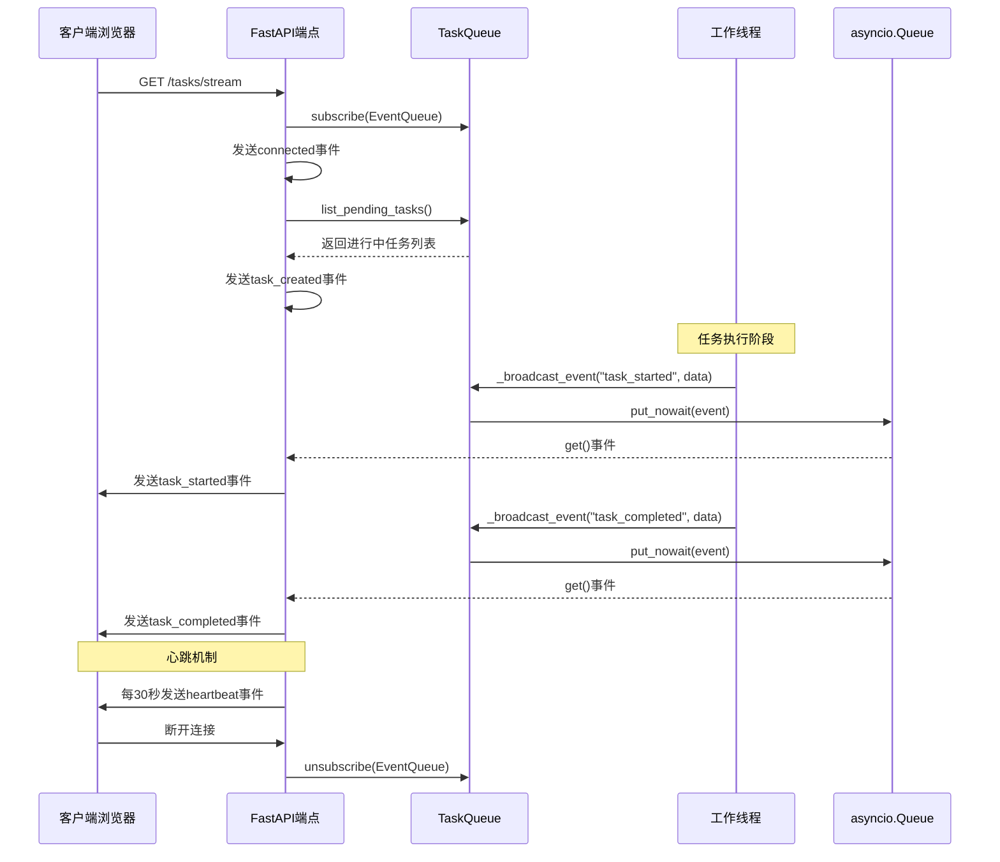
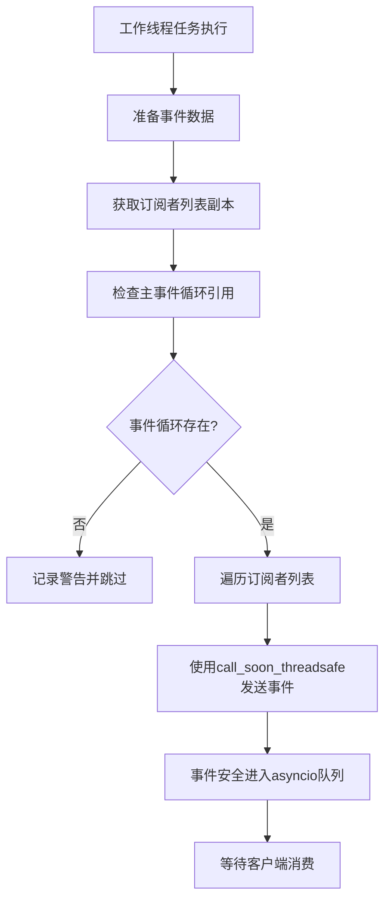
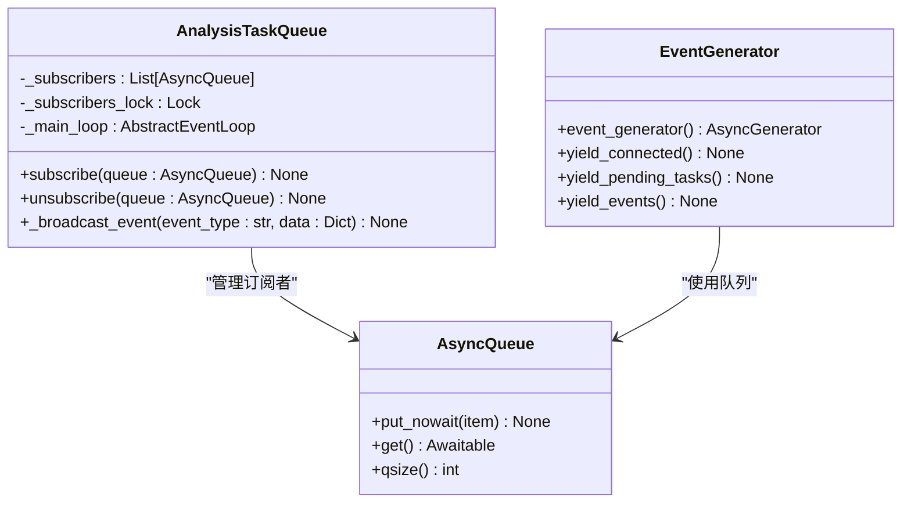
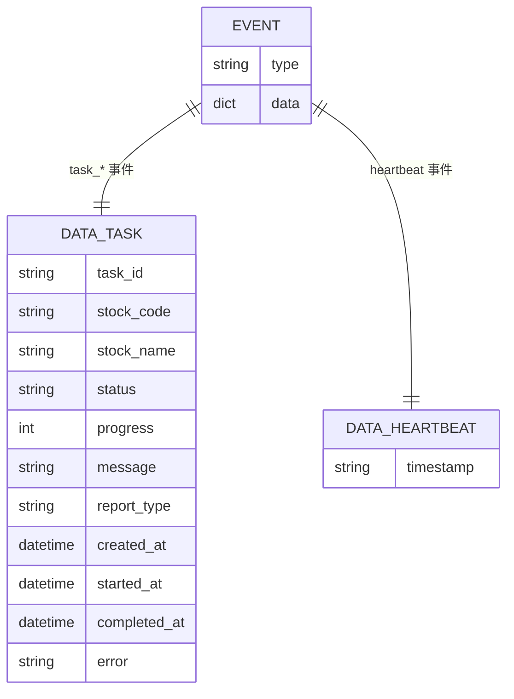
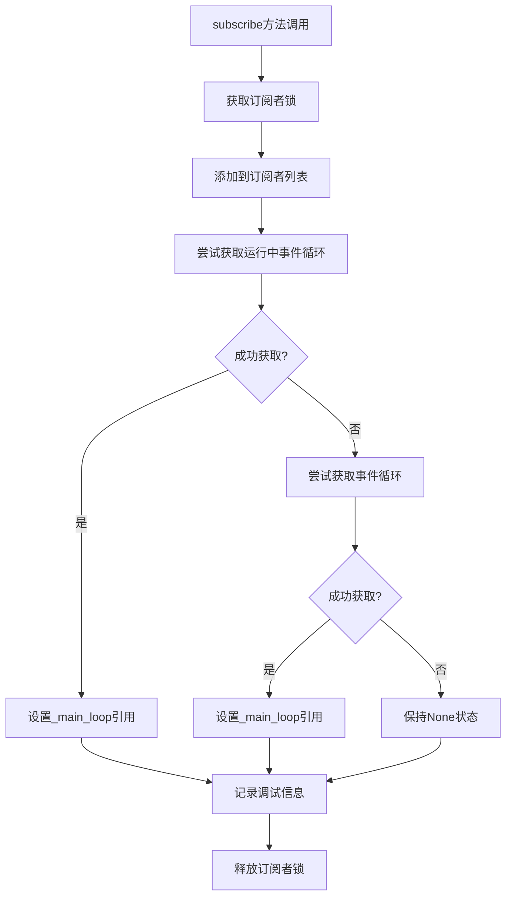
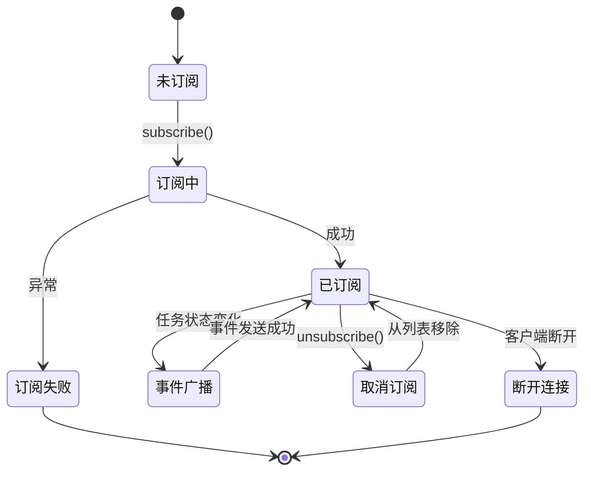
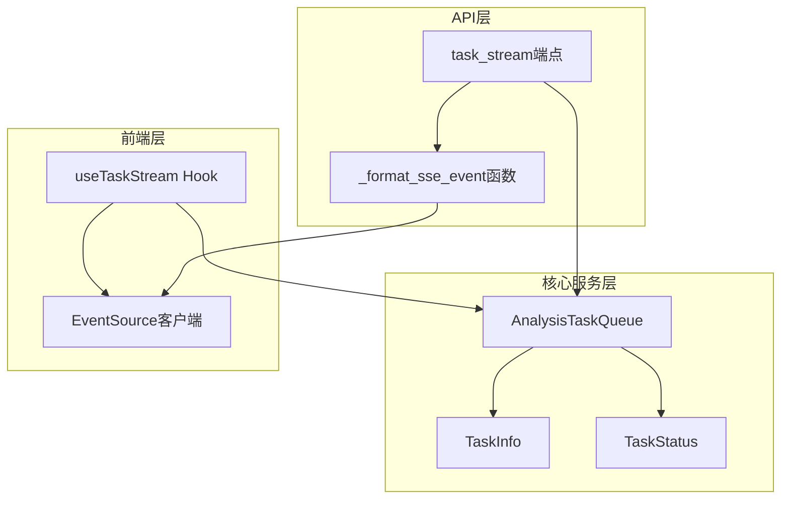
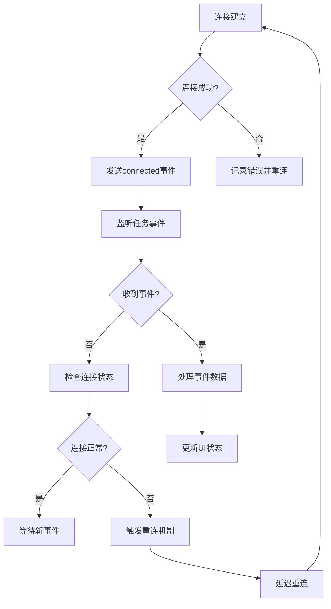

# SSE事件广播

<cite>
**本文档引用的文件**
- [task_queue.py](file://src/services/task_queue.py)
- [analysis.py](file://api/v1/endpoints/analysis.py)
- [useTaskStream.ts](file://apps/dsa-web/src/hooks/useTaskStream.ts)
</cite>

## 目录
1. [简介](#简介)
2. [项目结构](#项目结构)
3. [核心组件](#核心组件)
4. [架构概览](#架构概览)
5. [详细组件分析](#详细组件分析)
6. [依赖关系分析](#依赖关系分析)
7. [性能考虑](#性能考虑)
8. [故障排除指南](#故障排除指南)
9. [结论](#结论)

## 简介

SSE（Server-Sent Events）事件广播系统是本项目的核心实时通信组件，负责将任务状态变化实时推送给前端客户端。该系统实现了跨线程事件广播机制，确保在多线程环境下的一致性和安全性。

系统主要功能包括：
- 实时任务状态推送（创建、开始、完成、失败）
- 跨线程事件广播（使用call_soon_threadsafe确保线程安全）
- 订阅者管理模式（基于asyncio.Queue的事件订阅和取消订阅）
- 心跳机制维持连接活跃
- 自动重连和错误处理

## 项目结构

SSE事件广播系统涉及以下关键文件：

**图表来源**
- [task_queue.py:568-635](file://src/services/task_queue.py#L568-L635)
- [analysis.py:384-439](file://api/v1/endpoints/analysis.py#L384-L439)
- [useTaskStream.ts:147-252](file://apps/dsa-web/src/hooks/useTaskStream.ts#L147-L252)

**章节来源**
- [task_queue.py:108-158](file://src/services/task_queue.py#L108-L158)
- [analysis.py:376-439](file://api/v1/endpoints/analysis.py#L376-L439)
- [useTaskStream.ts:78-252](file://apps/dsa-web/src/hooks/useTaskStream.ts#L78-L252)

## 核心组件

### AnalysisTaskQueue类

AnalysisTaskQueue是SSE事件广播系统的核心组件，实现了单例模式和完整的事件广播机制。

**主要特性：**
- 单例模式确保全局唯一实例
- 线程池执行分析任务
- SSE事件广播机制
- 任务完成后自动持久化

**关键属性：**
- `_subscribers`: 订阅者列表（asyncio.Queue实例）
- `_main_loop`: 主事件循环引用
- `_subscribers_lock`: 订阅者管理锁
- `_data_lock`: 数据访问锁

**章节来源**
- [task_queue.py:108-158](file://src/services/task_queue.py#L108-L158)

### 事件类型定义

系统定义了四种标准事件类型：

**图表来源**
- [task_queue.py:355-359](file://src/services/task_queue.py#L355-L359)
- [analysis.py:388-394](file://api/v1/endpoints/analysis.py#L388-L394)

**章节来源**
- [task_queue.py:355-359](file://src/services/task_queue.py#L355-L359)
- [analysis.py:388-394](file://api/v1/endpoints/analysis.py#L388-L394)

## 架构概览

SSE事件广播系统的整体架构如下：

**图表来源**
- [analysis.py:384-439](file://api/v1/endpoints/analysis.py#L384-L439)
- [task_queue.py:570-635](file://src/services/task_queue.py#L570-L635)

## 详细组件分析

### 跨线程事件广播机制

#### call_soon_threadsafe方法的使用

系统使用`call_soon_threadsafe`方法确保跨线程安全的事件广播：

**图表来源**
- [task_queue.py:602-635](file://src/services/task_queue.py#L602-L635)

**关键实现细节：**
- 使用`loop.call_soon_threadsafe()`确保从工作线程向主事件循环发送消息
- 通过`queue.put_nowait(event)`将事件放入队列
- 捕获`RuntimeError`异常处理事件循环关闭情况

**章节来源**
- [task_queue.py:602-635](file://src/services/task_queue.py#L602-L635)

### 订阅者管理模式

#### AsyncQueue实现的事件订阅

系统采用`asyncio.Queue`实现高效的事件订阅和取消订阅机制：

**图表来源**
- [task_queue.py:570-600](file://src/services/task_queue.py#L570-L600)
- [analysis.py:399-430](file://api/v1/endpoints/analysis.py#L399-L430)

**订阅流程：**
1. 客户端发起SSE连接请求
2. 后端创建`asyncio.Queue`实例
3. 调用`task_queue.subscribe(event_queue)`
4. 系统捕获当前事件循环引用
5. 发送连接成功事件和历史任务状态

**取消订阅流程：**
1. 客户端断开连接或显式取消订阅
2. 调用`task_queue.unsubscribe(event_queue)`
3. 从订阅者列表中移除对应队列
4. 清理资源释放

**章节来源**
- [task_queue.py:570-600](file://src/services/task_queue.py#L570-L600)
- [analysis.py:414-430](file://api/v1/endpoints/analysis.py#L414-L430)

### 事件数据格式和结构

#### 事件数据组织方式

系统采用统一的事件数据格式：

**图表来源**
- [task_queue.py:612](file://src/services/task_queue.py#L612)
- [analysis.py:422-424](file://api/v1/endpoints/analysis.py#L422-L424)

**事件数据结构：**
- `type`: 事件类型标识符
- `data`: 具体事件内容（JSON序列化）

**章节来源**
- [task_queue.py:612](file://src/services/task_queue.py#L612)
- [analysis.py:442-453](file://api/v1/endpoints/analysis.py#L442-L453)

### 事件循环管理

#### _main_loop的获取和维护策略

系统实现了智能的事件循环管理策略：

**图表来源**
- [task_queue.py:577-588](file://src/services/task_queue.py#L577-L588)

**策略特点：**
- 优先使用`asyncio.get_running_loop()`获取当前运行的事件循环
- 在非异步上下文中使用`asyncio.get_event_loop()`
- 优雅处理事件循环不可用的情况

**章节来源**
- [task_queue.py:577-588](file://src/services/task_queue.py#L577-L588)

### 订阅者生命周期管理

#### 从subscribe到unsubscribe的完整流程

**图表来源**
- [task_queue.py:570-600](file://src/services/task_queue.py#L570-L600)
- [analysis.py:425-430](file://api/v1/endpoints/analysis.py#L425-L430)

**生命周期管理要点：**
- 订阅时自动捕获事件循环引用
- 支持动态添加和移除订阅者
- 自动清理断开连接的订阅者
- 线程安全的订阅者管理

**章节来源**
- [task_queue.py:570-600](file://src/services/task_queue.py#L570-L600)
- [analysis.py:425-430](file://api/v1/endpoints/analysis.py#L425-L430)

## 依赖关系分析

### 组件耦合和内聚性

**图表来源**
- [task_queue.py:108-158](file://src/services/task_queue.py#L108-L158)
- [analysis.py:384-453](file://api/v1/endpoints/analysis.py#L384-L453)
- [useTaskStream.ts:78-252](file://apps/dsa-web/src/hooks/useTaskStream.ts#L78-L252)

**依赖关系特点：**
- 低耦合高内聚的设计模式
- 明确的职责分离
- 清晰的数据流向
- 异步非阻塞的通信机制

**章节来源**
- [task_queue.py:108-158](file://src/services/task_queue.py#L108-L158)
- [analysis.py:384-453](file://api/v1/endpoints/analysis.py#L384-L453)
- [useTaskStream.ts:78-252](file://apps/dsa-web/src/hooks/useTaskStream.ts#L78-L252)

## 性能考虑

### 批量事件处理

系统实现了高效的批量事件处理机制：

**内存优化策略：**
- 任务历史保留数量限制（默认100个）
- 按时间顺序清理过期任务
- 使用`copy()`方法避免数据共享问题

**性能优化技巧：**
- 订阅者列表使用副本避免迭代时修改
- 使用`call_soon_threadsafe`避免阻塞主线程
- 心跳机制每30秒触发一次，平衡连接保持和性能

**章节来源**
- [task_queue.py:534-566](file://src/services/task_queue.py#L534-L566)
- [task_queue.py:154-155](file://src/services/task_queue.py#L154-L155)

### 内存使用控制

**内存管理策略：**
- 限制任务历史数量防止内存泄漏
- 及时清理已完成和失败的任务
- 使用弱引用避免循环引用

**监控指标：**
- 订阅者数量跟踪
- 事件队列长度监控
- 任务队列状态统计

## 故障排除指南

### 常见问题和解决方案

#### 事件循环未设置问题

**症状：** 无法广播事件，日志显示"主事件循环未设置"

**原因：** 订阅时未能正确捕获事件循环引用

**解决方案：**
- 确保在异步上下文中调用`subscribe()`
- 检查FastAPI应用的事件循环配置
- 验证`asyncio.get_running_loop()`可用性

#### 心跳机制失效

**症状：** 客户端连接超时断开

**原因：** 心跳事件发送间隔过长或网络问题

**解决方案：**
- 检查SSE端点的超时设置
- 验证Nginx缓冲配置
- 确认客户端的心跳处理逻辑

#### 订阅者管理问题

**症状：** 内存泄漏或事件丢失

**原因：** 未正确取消订阅或订阅者状态不一致

**解决方案：**
- 确保在finally块中调用`unsubscribe()`
- 检查异常处理逻辑
- 监控订阅者数量变化

**章节来源**
- [task_queue.py:621-635](file://src/services/task_queue.py#L621-L635)
- [analysis.py:420-429](file://api/v1/endpoints/analysis.py#L420-L429)

### 错误处理和连接恢复机制

#### 前端错误处理最佳实践

**图表来源**
- [useTaskStream.ts:191-203](file://apps/dsa-web/src/hooks/useTaskStream.ts#L191-L203)

**最佳实践：**
- 实现指数退避重连算法
- 设置最大重连次数限制
- 提供用户友好的错误提示
- 支持手动重连操作

**章节来源**
- [useTaskStream.ts:191-203](file://apps/dsa-web/src/hooks/useTaskStream.ts#L191-L203)

## 结论

SSE事件广播系统通过精心设计的架构实现了高效、可靠的实时通信机制。系统的主要优势包括：

**技术优势：**
- 完善的跨线程安全保证
- 高效的事件队列管理
- 智能的订阅者生命周期管理
- 优雅的错误处理和恢复机制

**性能特点：**
- 低延迟的事件传输
- 内存使用控制
- 可扩展的并发处理能力
- 心跳机制维持连接稳定性

**应用场景：**
- 实时任务状态监控
- 多用户协作界面
- 实时数据分析展示
- 动态内容更新

该系统为整个股票分析平台提供了强大的实时通信基础，支持复杂的业务场景和高并发需求。