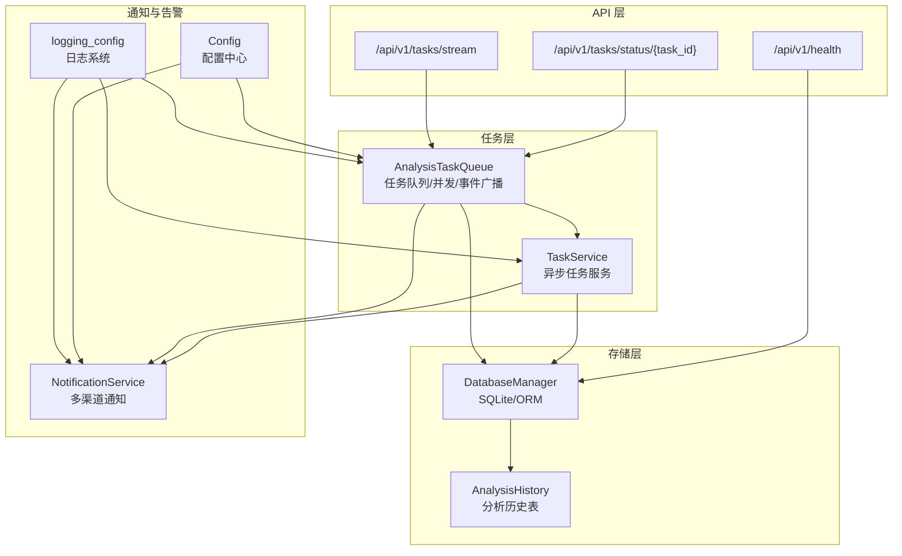
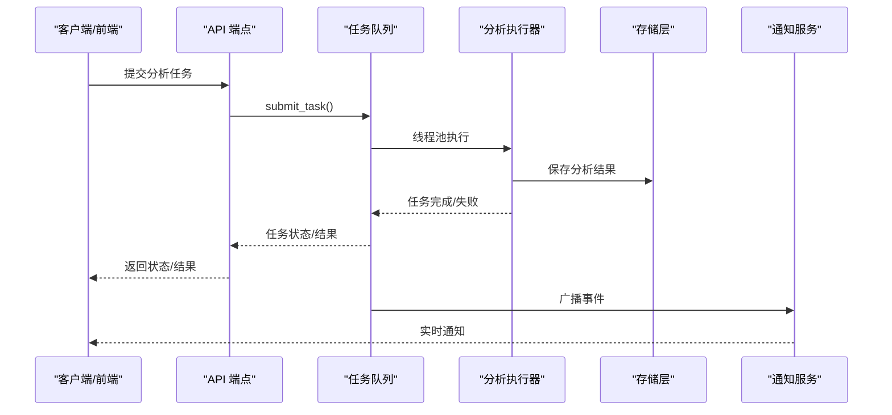
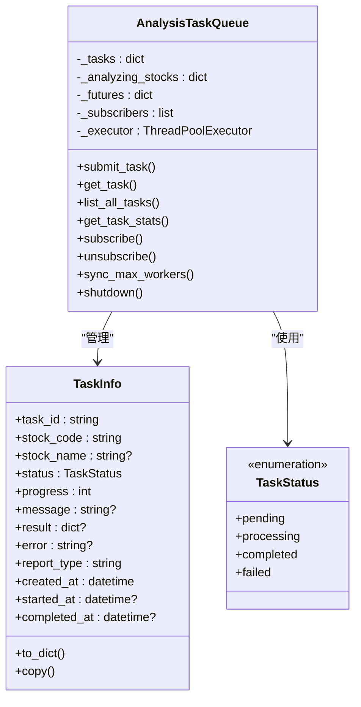
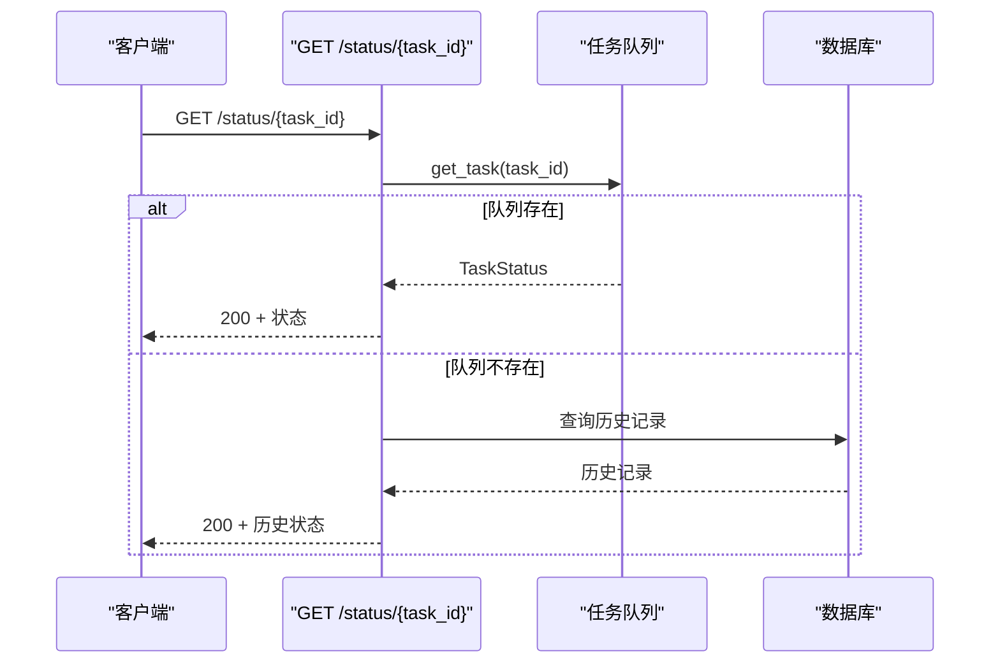
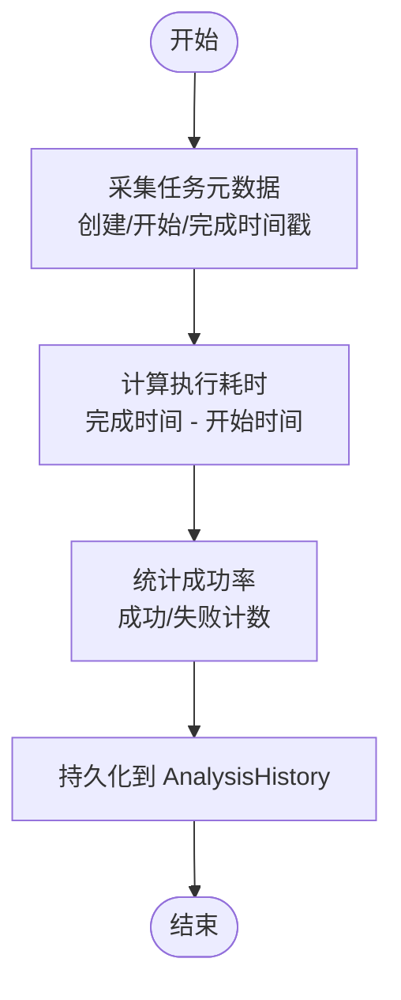
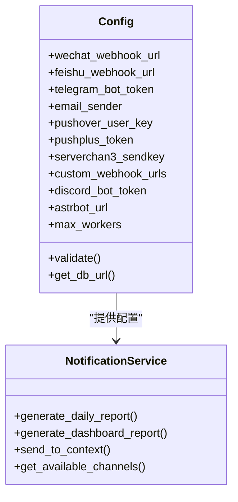
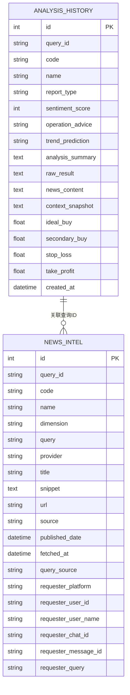
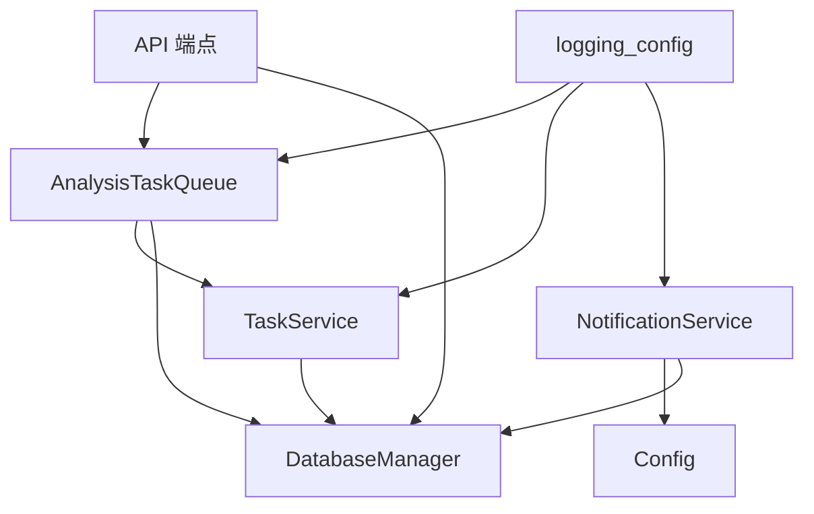

# 任务监控告警

<cite>
**本文档引用的文件**
- [src/services/task_queue.py](file://src/services/task_queue.py)
- [src/services/task_service.py](file://src/services/task_service.py)
- [api/v1/endpoints/analysis.py](file://api/v1/endpoints/analysis.py)
- [api/v1/endpoints/health.py](file://api/v1/endpoints/health.py)
- [src/storage.py](file://src/storage.py)
- [src/services/history_service.py](file://src/services/history_service.py)
- [src/repositories/analysis_repo.py](file://src/repositories/analysis_repo.py)
- [src/config.py](file://src/config.py)
- [src/logging_config.py](file://src/logging_config.py)
- [src/notification.py](file://src/notification.py)
- [src/scheduler.py](file://src/scheduler.py)
- [bot/platforms/base.py](file://bot/platforms/base.py)
- [bot/models.py](file://bot/models.py)
- [src/core/config_registry.py](file://src/core/config_registry.py)
</cite>

## 目录
1. [简介](#简介)
2. [项目结构](#项目结构)
3. [核心组件](#核心组件)
4. [架构总览](#架构总览)
5. [详细组件分析](#详细组件分析)
6. [依赖分析](#依赖分析)
7. [性能考虑](#性能考虑)
8. [故障排查指南](#故障排查指南)
9. [结论](#结论)
10. [附录](#附录)

## 简介
本技术文档围绕任务监控告警系统展开，聚焦以下目标：
- 任务状态监控：提供实时状态跟踪与异常检测能力，覆盖任务提交、执行、完成与失败全流程。
- 性能指标采集与统计：围绕任务执行时间、成功率、并发度、资源使用等维度进行采集与统计。
- 告警规则与触发：基于阈值与规则的告警策略，结合通知渠道实现告警下发。
- 监控数据存储与查询：基于 SQLite 的历史数据持久化与查询接口，支撑历史回溯与可视化。
- 扩展性设计：支持自定义监控指标与告警策略，兼容多种通知渠道与外部系统对接。
- 集成方案：与外部监控系统对接与数据同步，提供健康检查与可观测性接口。
- 配置管理：集中化的配置注册与校验，支持运行时参数调整与规则更新。
- 维护与优化：日志体系、优雅停机、任务队列并发调整等运维策略。

## 项目结构
本项目采用分层架构，监控告警相关的关键模块包括：
- 任务队列与服务层：负责任务生命周期管理、并发控制与事件广播。
- API 层：提供任务状态查询、SSE 实时流、健康检查等接口。
- 存储层：基于 SQLAlchemy 的 ORM 模型与数据库管理器，提供历史数据持久化与查询。
- 通知与告警：统一的通知服务与多渠道推送，支持告警触发与消息分发。
- 配置与日志：集中配置管理、配置注册表、日志系统，支撑可观测性与运维。

图表来源
- [api/v1/endpoints/analysis.py:460-502](file://api/v1/endpoints/analysis.py#L460-L502)
- [api/v1/endpoints/health.py:21-34](file://api/v1/endpoints/health.py#L21-L34)
- [src/services/task_queue.py:108-158](file://src/services/task_queue.py#L108-L158)
- [src/services/task_service.py:30-56](file://src/services/task_service.py#L30-L56)
- [src/storage.py:623-746](file://src/storage.py#L623-L746)
- [src/notification.py:113-206](file://src/notification.py#L113-L206)
- [src/config.py:32-580](file://src/config.py#L32-L580)
- [src/logging_config.py:52-155](file://src/logging_config.py#L52-L155)

章节来源
- [src/services/task_queue.py:108-158](file://src/services/task_queue.py#L108-L158)
- [api/v1/endpoints/analysis.py:460-502](file://api/v1/endpoints/analysis.py#L460-L502)
- [src/storage.py:623-746](file://src/storage.py#L623-L746)
- [src/notification.py:113-206](file://src/notification.py#L113-L206)
- [src/config.py:32-580](file://src/config.py#L32-L580)
- [src/logging_config.py:52-155](file://src/logging_config.py#L52-L155)

## 核心组件
- 任务队列 AnalysisTaskQueue：单例模式，负责任务提交、并发控制、事件广播与历史清理；支持 SSE 事件推送。
- 异步任务服务 TaskService：封装线程池执行流程，提供任务状态查询与历史记录查询。
- API 端点 analysis.py：提供任务状态查询与 SSE 实时流，支持按 task_id 查询与历史记录检索。
- 存储层 storage.py：定义 AnalysisHistory 等模型，提供数据库管理器与历史查询接口。
- 通知服务 notification.py：统一多渠道通知（企业微信、飞书、Telegram、邮件、Pushover、PushPlus、Server酱、Discord、AstrBot 等）。
- 配置中心 config.py：集中配置管理，提供单例访问与热读取能力。
- 日志系统 logging_config.py：三层日志输出（控制台/常规/调试），统一格式与轮转策略。
- 健康检查 health.py：对外暴露健康检查接口，便于外部监控系统探测。
- 机器人平台适配 base.py 与消息模型 models.py：统一消息与响应模型，支撑多平台接入。

章节来源
- [src/services/task_queue.py:108-158](file://src/services/task_queue.py#L108-L158)
- [src/services/task_service.py:30-56](file://src/services/task_service.py#L30-L56)
- [api/v1/endpoints/analysis.py:460-502](file://api/v1/endpoints/analysis.py#L460-L502)
- [src/storage.py:208-270](file://src/storage.py#L208-L270)
- [src/notification.py:113-206](file://src/notification.py#L113-L206)
- [src/config.py:32-580](file://src/config.py#L32-L580)
- [src/logging_config.py:52-155](file://src/logging_config.py#L52-L155)
- [api/v1/endpoints/health.py:21-34](file://api/v1/endpoints/health.py#L21-L34)
- [bot/platforms/base.py:16-102](file://bot/platforms/base.py#L16-L102)
- [bot/models.py:32-153](file://bot/models.py#L32-L153)

## 架构总览
监控告警系统围绕“任务状态—事件广播—历史存储—通知告警—配置与日志”的闭环构建，支持实时与历史数据的统一查询与可视化。

图表来源
- [src/services/task_queue.py:260-361](file://src/services/task_queue.py#L260-L361)
- [src/services/task_queue.py:440-533](file://src/services/task_queue.py#L440-L533)
- [src/storage.py:1098-1107](file://src/storage.py#L1098-L1107)
- [src/notification.py:540-538](file://src/notification.py#L540-L538)

## 详细组件分析

### 任务队列与状态监控
- 任务状态枚举与数据结构：TaskStatus 与 TaskInfo，统一任务状态、进度、消息与时间戳。
- 并发控制与动态调整：支持 max_workers 动态调整，繁忙时延迟应用，保证一致性。
- 事件广播与 SSE：通过 asyncio 队列与 call_soon_threadsafe 实现跨线程安全广播，支持客户端实时订阅。
- 历史清理：超过阈值的历史任务自动清理，避免内存膨胀。

图表来源
- [src/services/task_queue.py:34-94](file://src/services/task_queue.py#L34-L94)
- [src/services/task_queue.py:108-158](file://src/services/task_queue.py#L108-L158)

章节来源
- [src/services/task_queue.py:34-94](file://src/services/task_queue.py#L34-L94)
- [src/services/task_queue.py:170-231](file://src/services/task_queue.py#L170-L231)
- [src/services/task_queue.py:568-635](file://src/services/task_queue.py#L568-L635)

### API 端点与实时状态跟踪
- 任务状态查询：支持按 task_id 查询，优先从队列查询，不存在则回退到历史记录。
- SSE 实时流：订阅任务事件，客户端可实时接收任务状态变更。
- 健康检查：对外暴露 /api/v1/health，便于外部监控系统探测。

图表来源
- [api/v1/endpoints/analysis.py:460-502](file://api/v1/endpoints/analysis.py#L460-L502)

章节来源
- [api/v1/endpoints/analysis.py:460-502](file://api/v1/endpoints/analysis.py#L460-L502)
- [api/v1/endpoints/health.py:21-34](file://api/v1/endpoints/health.py#L21-L34)

### 性能指标采集与统计
- 任务执行时间：记录 created_at、started_at、completed_at，支持计算任务耗时。
- 成功率统计：基于任务状态统计 total/pending/processing/completed/failed。
- 并发度与资源：max_workers 与线程池大小影响吞吐与资源占用。
- 历史数据统计：AnalysisHistory 模型包含 sentiment_score、operation_advice、trend_prediction 等可用于统计分析。

图表来源
- [src/services/task_queue.py:440-533](file://src/services/task_queue.py#L440-L533)
- [src/storage.py:208-270](file://src/storage.py#L208-L270)

章节来源
- [src/services/task_queue.py:440-533](file://src/services/task_queue.py#L440-L533)
- [src/storage.py:208-270](file://src/storage.py#L208-L270)

### 告警规则配置与触发机制
- 配置中心：集中管理通知渠道、消息长度限制、最大并发等参数。
- 通知渠道：企业微信、飞书、Telegram、邮件、Pushover、PushPlus、Server酱、Discord、AstrBot 等。
- 告警触发：通过任务状态变更事件触发通知，支持按渠道并发推送与消息分片。
- 配置注册表：提供字段元数据、类别、校验规则与 UI 控件映射，便于统一配置管理。

图表来源
- [src/config.py:32-580](file://src/config.py#L32-L580)
- [src/notification.py:113-206](file://src/notification.py#L113-L206)

章节来源
- [src/config.py:32-580](file://src/config.py#L32-L580)
- [src/notification.py:113-206](file://src/notification.py#L113-L206)
- [src/core/config_registry.py:66-200](file://src/core/config_registry.py#L66-L200)

### 监控数据存储与查询接口
- 数据模型：AnalysisHistory 记录每次分析结果，支持按 query_id/code/时间范围查询。
- 查询接口：支持按 query_id 精确查询与按 days 窗口查询，支持分页与总数统计。
- 历史服务：封装历史记录查询、详情转换与新闻情报关联。

图表来源
- [src/storage.py:208-270](file://src/storage.py#L208-L270)
- [src/storage.py:135-181](file://src/storage.py#L135-L181)

章节来源
- [src/storage.py:1098-1221](file://src/storage.py#L1098-L1221)
- [src/services/history_service.py:296-336](file://src/services/history_service.py#L296-L336)
- [src/repositories/analysis_repo.py:21-69](file://src/repositories/analysis_repo.py#L21-L69)

### 扩展性设计与集成方案
- 自定义监控指标：通过配置注册表扩展字段元数据，支持新增监控参数与校验规则。
- 告警策略扩展：在通知服务中增加新的渠道或策略，统一通过配置中心管理。
- 外部系统对接：健康检查接口与日志系统为外部监控系统提供可观测性；通知服务支持 Webhook 与机器人通道。
- 机器人平台适配：统一消息模型与平台适配器抽象，便于接入新平台。

章节来源
- [src/core/config_registry.py:66-200](file://src/core/config_registry.py#L66-L200)
- [src/notification.py:113-206](file://src/notification.py#L113-L206)
- [api/v1/endpoints/health.py:21-34](file://api/v1/endpoints/health.py#L21-L34)
- [bot/platforms/base.py:16-102](file://bot/platforms/base.py#L16-L102)
- [bot/models.py:32-153](file://bot/models.py#L32-L153)

### 配置管理与规则更新
- 配置单例：Config 提供单例访问与热读取 STOCK_LIST，支持运行时调整。
- 配置校验：validate 方法输出缺失或无效配置项的警告，便于运维发现。
- 通知配置：支持多种渠道组合，满足不同场景下的告警需求。
- 定时任务配置：支持启用定时任务与执行时间设置，配合调度器实现自动化。

章节来源
- [src/config.py:32-580](file://src/config.py#L32-L580)
- [src/scheduler.py:56-169](file://src/scheduler.py#L56-L169)

### 维护与优化策略
- 日志体系：三层日志输出（控制台/常规/调试），统一格式与轮转，便于问题定位。
- 优雅停机：调度器捕获信号，等待当前任务完成后退出，保障任务完整性。
- 任务队列并发调整：在空闲时即时应用，繁忙时延迟应用，避免中断正在进行的任务。
- 历史清理：定期清理过期任务，控制内存占用。

章节来源
- [src/logging_config.py:52-155](file://src/logging_config.py#L52-L155)
- [src/scheduler.py:27-54](file://src/scheduler.py#L27-L54)
- [src/services/task_queue.py:184-231](file://src/services/task_queue.py#L184-L231)
- [src/services/task_queue.py:534-566](file://src/services/task_queue.py#L534-L566)

## 依赖分析
- 组件耦合：任务队列与任务服务通过 AnalysisService 间接耦合，避免循环依赖；存储层通过 DatabaseManager 单例提供统一访问。
- 外部依赖：通知服务依赖多种第三方渠道（Webhook、SMTP、Pushover 等），通过配置中心集中管理。
- 并发与线程安全：任务队列使用线程池与锁保护共享状态，SSE 使用 asyncio 队列与跨线程安全广播。

图表来源
- [src/services/task_queue.py:108-158](file://src/services/task_queue.py#L108-L158)
- [src/services/task_service.py:30-56](file://src/services/task_service.py#L30-L56)
- [src/storage.py:623-746](file://src/storage.py#L623-L746)
- [src/notification.py:113-206](file://src/notification.py#L113-L206)
- [src/config.py:32-580](file://src/config.py#L32-L580)
- [src/logging_config.py:52-155](file://src/logging_config.py#L52-L155)

章节来源
- [src/services/task_queue.py:108-158](file://src/services/task_queue.py#L108-L158)
- [src/services/task_service.py:30-56](file://src/services/task_service.py#L30-L56)
- [src/storage.py:623-746](file://src/storage.py#L623-L746)
- [src/notification.py:113-206](file://src/notification.py#L113-L206)
- [src/config.py:32-580](file://src/config.py#L32-L580)
- [src/logging_config.py:52-155](file://src/logging_config.py#L52-L155)

## 性能考虑
- 并发与吞吐：通过 max_workers 控制线程池大小，平衡吞吐与资源占用；在繁忙时延迟应用并发调整。
- I/O 与阻塞：分析执行器在独立线程池中运行，避免阻塞主线程；SSE 广播使用跨线程安全方法。
- 存储与索引：AnalysisHistory 与 StockDaily 等模型建立索引，提升查询效率；历史记录按时间排序清理。
- 日志开销：三层日志输出，常规与调试日志分离，避免生产环境日志过大。

## 故障排查指南
- 健康检查：通过 /api/v1/health 快速确认服务状态。
- 日志定位：利用统一日志格式与轮转策略，定位任务状态变更、异常与通知失败原因。
- 配置校验：使用 Config.validate 输出缺失或无效配置项，及时修正。
- 优雅停机：关注调度器信号处理，确保任务在退出前完成。
- 通知失败：检查通知渠道配置与网络连通性，必要时启用调试日志。

章节来源
- [api/v1/endpoints/health.py:21-34](file://api/v1/endpoints/health.py#L21-L34)
- [src/logging_config.py:52-155](file://src/logging_config.py#L52-L155)
- [src/config.py:507-546](file://src/config.py#L507-L546)
- [src/scheduler.py:27-54](file://src/scheduler.py#L27-L54)
- [src/notification.py:113-206](file://src/notification.py#L113-L206)

## 结论
本监控告警系统以任务队列为中枢，结合 API 层实时状态查询、存储层历史数据持久化、通知层多渠道告警与配置/日志体系，形成完整的可观测性闭环。通过可扩展的配置注册表与通知策略，系统能够灵活适配不同业务场景，并通过健康检查与日志体系保障运维稳定性。

## 附录
- 配置字段与类别：参考配置注册表，涵盖基础设置、AI 模型、数据源、通知、系统、Agent、回测等类别。
- 机器人平台适配：统一消息模型与平台适配器抽象，便于接入新平台。
- 历史数据查询：支持按 query_id 精确查询与按 days 窗口查询，满足不同回溯需求。

章节来源
- [src/core/config_registry.py:15-64](file://src/core/config_registry.py#L15-L64)
- [bot/platforms/base.py:16-102](file://bot/platforms/base.py#L16-L102)
- [bot/models.py:32-153](file://bot/models.py#L32-L153)
- [src/storage.py:1108-1221](file://src/storage.py#L1108-L1221)