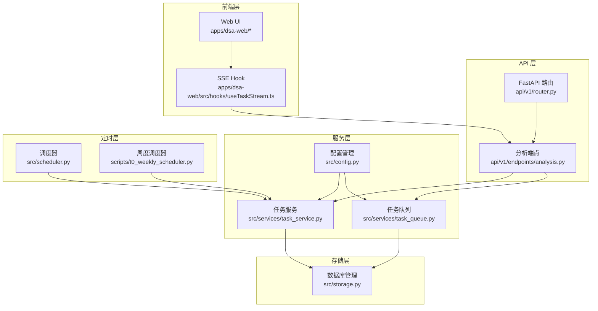
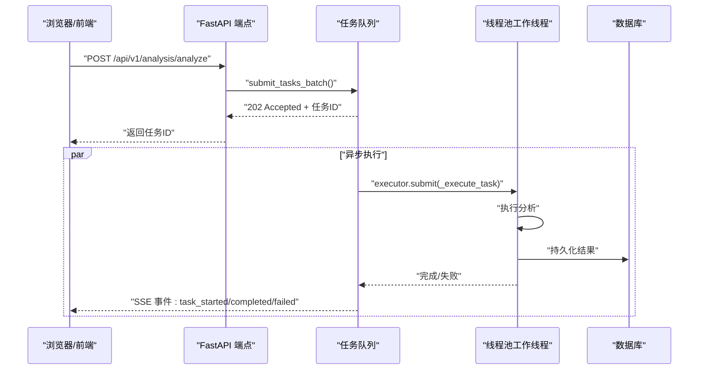
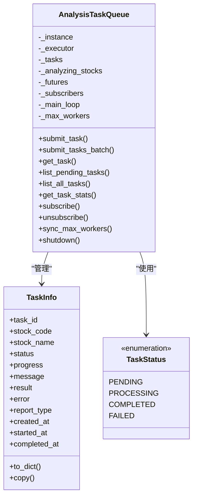
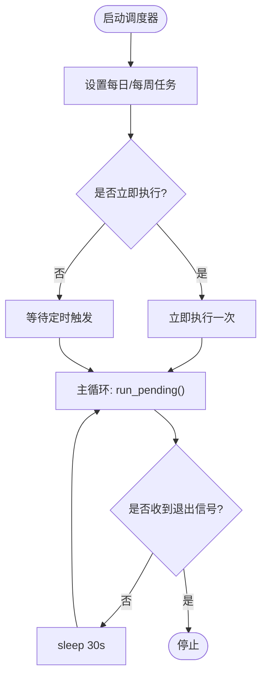
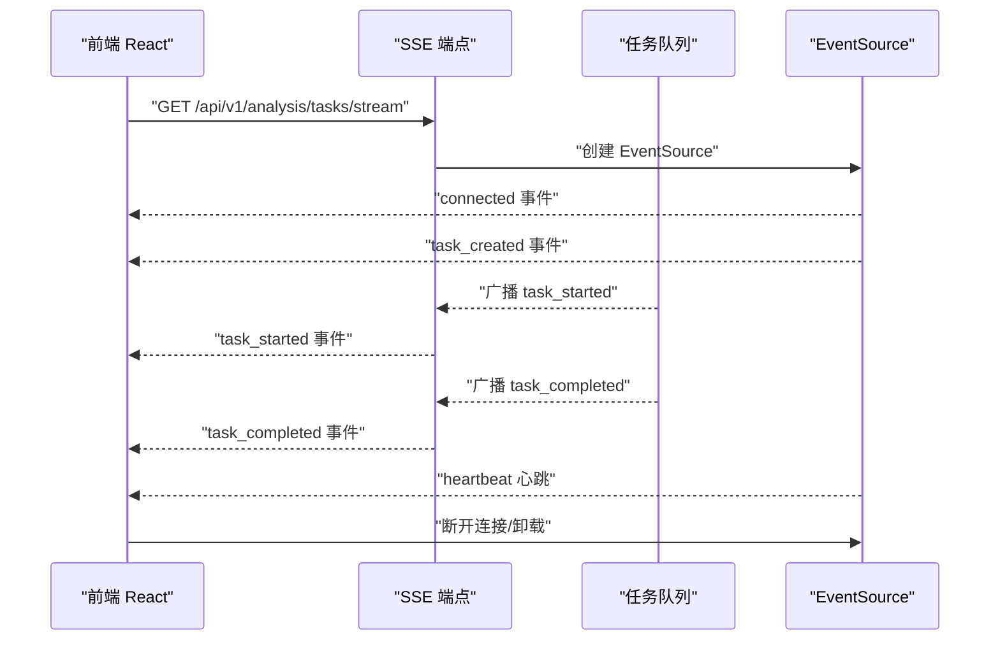
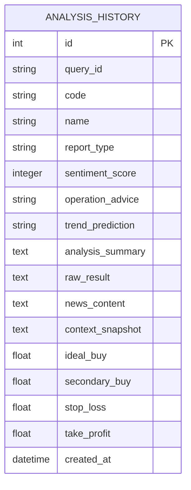
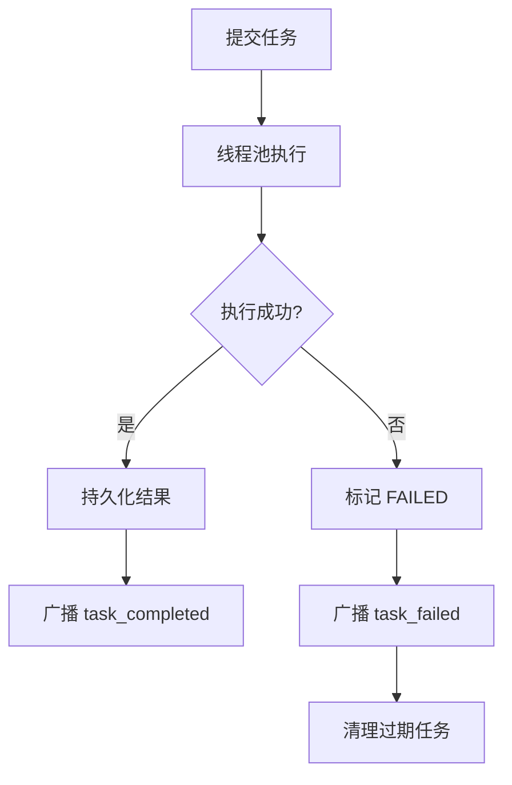
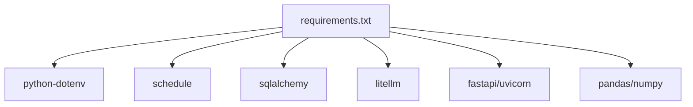

# 任务调度系统

<cite>
**本文档引用的文件**
- [src/services/task_queue.py](file://src/services/task_queue.py)
- [src/services/task_service.py](file://src/services/task_service.py)
- [src/scheduler.py](file://src/scheduler.py)
- [src/enums.py](file://src/enums.py)
- [src/config.py](file://src/config.py)
- [api/v1/endpoints/analysis.py](file://api/v1/endpoints/analysis.py)
- [api/v1/router.py](file://api/v1/router.py)
- [src/storage.py](file://src/storage.py)
- [scripts/t0_weekly_scheduler.py](file://scripts/t0_weekly_scheduler.py)
- [apps/dsa-web/src/hooks/useTaskStream.ts](file://apps/dsa-web/src/hooks/useTaskStream.ts)
- [apps/dsa-web/src/hooks/useDashboardLifecycle.ts](file://apps/dsa-web/src/hooks/useDashboardLifecycle.ts)
- [README.md](file://README.md)
- [docs/T0_WEEKLY_DEPLOYMENT_CHECKLIST.md](file://docs/T0_WEEKLY_DEPLOYMENT_CHECKLIST.md)
- [requirements.txt](file://requirements.txt)
</cite>

## 目录
1. [简介](#简介)
2. [项目结构](#项目结构)
3. [核心组件](#核心组件)
4. [架构总览](#架构总览)
5. [详细组件分析](#详细组件分析)
6. [依赖分析](#依赖分析)
7. [性能考虑](#性能考虑)
8. [故障排查指南](#故障排查指南)
9. [结论](#结论)
10. [附录](#附录)

## 简介
本系统是一个面向 A 股/港股/美股的智能股票分析任务调度平台，提供异步任务队列、SSE 实时推送、定时任务调度、任务状态管理、持久化存储与历史查询、WebUI 任务监控与告警、以及可扩展的任务类型与批量处理能力。系统通过 FastAPI 提供 REST 接口，前端通过 SSE 实时接收任务状态变更；后端采用线程池并发执行分析任务，并通过单例任务队列统一管理任务生命周期。

## 项目结构
系统采用分层架构：
- API 层：FastAPI 路由与端点，提供分析触发、状态查询、SSE 实时流等接口
- 服务层：任务队列与任务服务，负责任务提交、执行、状态广播与持久化
- 定时层：基于 schedule 的轻量级调度器，支持每日/每周定时任务
- 存储层：SQLite + SQLAlchemy，提供分析历史、回测结果等数据模型
- 前端层：React + TypeScript，通过 SSE 订阅任务状态，提供任务面板与历史查看

**图表来源**
- [api/v1/router.py:1-72](file://api/v1/router.py#L1-L72)
- [api/v1/endpoints/analysis.py:1-694](file://api/v1/endpoints/analysis.py#L1-L694)
- [src/services/task_queue.py:1-666](file://src/services/task_queue.py#L1-L666)
- [src/services/task_service.py:1-244](file://src/services/task_service.py#L1-L244)
- [src/scheduler.py:1-185](file://src/scheduler.py#L1-L185)
- [scripts/t0_weekly_scheduler.py:1-227](file://scripts/t0_weekly_scheduler.py#L1-L227)
- [src/storage.py:1-800](file://src/storage.py#L1-L800)
- [apps/dsa-web/src/hooks/useTaskStream.ts:1-213](file://apps/dsa-web/src/hooks/useTaskStream.ts#L1-L213)

**章节来源**
- [api/v1/router.py:1-72](file://api/v1/router.py#L1-L72)
- [api/v1/endpoints/analysis.py:1-694](file://api/v1/endpoints/analysis.py#L1-L694)
- [src/services/task_queue.py:1-666](file://src/services/task_queue.py#L1-L666)
- [src/services/task_service.py:1-244](file://src/services/task_service.py#L1-L244)
- [src/scheduler.py:1-185](file://src/scheduler.py#L1-L185)
- [scripts/t0_weekly_scheduler.py:1-227](file://scripts/t0_weekly_scheduler.py#L1-L227)
- [src/storage.py:1-800](file://src/storage.py#L1-L800)
- [apps/dsa-web/src/hooks/useTaskStream.ts:1-213](file://apps/dsa-web/src/hooks/useTaskStream.ts#L1-L213)

## 核心组件
- 任务队列 AnalysisTaskQueue：单例线程池任务队列，支持重复任务防抖、SSE 事件广播、任务历史清理、并发动态调整
- 任务服务 TaskService：独立线程池任务服务，提供任务提交、状态查询、历史记录查询
- 定时调度器 Scheduler：每日定时任务调度，支持优雅退出与异常保护
- 周度调度器 WeeklyScheduler：每周定时任务调度，支持自定义执行时间与立即执行
- 配置管理 Config：单例配置中心，提供环境变量加载、校验与运行时热读取
- 存储层 DatabaseManager：SQLite + SQLAlchemy，提供分析历史、回测结果等模型与会话管理
- API 端点 analysis：提供分析触发、状态查询、SSE 实时流
- 前端 SSE Hook：React Hook，封装 EventSource，提供自动重连与回调处理

**章节来源**
- [src/services/task_queue.py:108-666](file://src/services/task_queue.py#L108-L666)
- [src/services/task_service.py:30-244](file://src/services/task_service.py#L30-L244)
- [src/scheduler.py:56-185](file://src/scheduler.py#L56-L185)
- [scripts/t0_weekly_scheduler.py:67-227](file://scripts/t0_weekly_scheduler.py#L67-L227)
- [src/config.py:31-580](file://src/config.py#L31-L580)
- [src/storage.py:623-800](file://src/storage.py#L623-L800)
- [api/v1/endpoints/analysis.py:68-694](file://api/v1/endpoints/analysis.py#L68-L694)
- [apps/dsa-web/src/hooks/useTaskStream.ts:1-213](file://apps/dsa-web/src/hooks/useTaskStream.ts#L1-L213)

## 架构总览
系统通过 FastAPI 提供 REST 接口，前端通过 SSE 订阅任务状态变更。任务队列在后台线程池中执行分析，完成后通过 SSE 广播事件，同时持久化到数据库。定时调度器负责周期性任务的触发与优雅退出。

**图表来源**
- [api/v1/endpoints/analysis.py:72-301](file://api/v1/endpoints/analysis.py#L72-L301)
- [src/services/task_queue.py:260-533](file://src/services/task_queue.py#L260-L533)
- [src/storage.py:208-270](file://src/storage.py#L208-L270)

**章节来源**
- [api/v1/endpoints/analysis.py:72-301](file://api/v1/endpoints/analysis.py#L72-L301)
- [src/services/task_queue.py:260-533](file://src/services/task_queue.py#L260-L533)
- [src/storage.py:208-270](file://src/storage.py#L208-L270)

## 详细组件分析

### 任务队列设计与架构
- 单例模式：AnalysisTaskQueue 保证全局唯一实例，避免并发冲突
- 线程池并发：懒加载 ThreadPoolExecutor，支持动态调整最大并发
- 重复任务防抖：通过 analyzing_stocks 集合避免同一股票重复提交
- SSE 广播：subscribe/unsubscribe 管理订阅者队列，call_soon_threadsafe 跨线程安全广播
- 任务生命周期：PENDING -> PROCESSING -> COMPLETED/FAILED，完成后清理过期任务
- 持久化：任务完成后写入数据库，支持历史查询

**图表来源**
- [src/services/task_queue.py:108-666](file://src/services/task_queue.py#L108-L666)

**章节来源**
- [src/services/task_queue.py:108-666](file://src/services/task_queue.py#L108-L666)

### 定时任务调度策略
- 每日定时：Scheduler 基于 schedule，支持每日固定时间执行与立即执行
- 优雅退出：GracefulShutdown 捕获 SIGTERM/SIGINT，等待当前任务完成
- 周度定时：WeeklyScheduler 支持每周固定时间执行，可自定义星期与时间
- 任务包装：run_with_schedule/WeeklyScheduler.set_weekly_task 提供安全执行包装

**图表来源**
- [src/scheduler.py:85-169](file://src/scheduler.py#L85-L169)
- [scripts/t0_weekly_scheduler.py:103-172](file://scripts/t0_weekly_scheduler.py#L103-L172)

**章节来源**
- [src/scheduler.py:56-185](file://src/scheduler.py#L56-L185)
- [scripts/t0_weekly_scheduler.py:67-227](file://scripts/t0_weekly_scheduler.py#L67-L227)

### SSE 实时推送与客户端连接管理
- 服务端：task_stream 生成 connected、task_created、task_started、task_completed、task_failed、heartbeat 事件
- 客户端：useTaskStream Hook 封装 EventSource，提供自动重连、回调注册、错误处理
- 生命周期：前端在可见性变化时刷新历史，任务完成后延迟移除

**图表来源**
- [api/v1/endpoints/analysis.py:384-454](file://api/v1/endpoints/analysis.py#L384-L454)
- [apps/dsa-web/src/hooks/useTaskStream.ts:78-213](file://apps/dsa-web/src/hooks/useTaskStream.ts#L78-L213)

**章节来源**
- [api/v1/endpoints/analysis.py:376-458](file://api/v1/endpoints/analysis.py#L376-L458)
- [apps/dsa-web/src/hooks/useTaskStream.ts:1-213](file://apps/dsa-web/src/hooks/useTaskStream.ts#L1-L213)
- [apps/dsa-web/src/hooks/useDashboardLifecycle.ts:77-96](file://apps/dsa-web/src/hooks/useDashboardLifecycle.ts#L77-L96)

### 任务状态管理与持久化
- 状态枚举：TaskStatus(PENDING/PROCESSING/COMPLETED/FAILED)
- 任务信息：TaskInfo 包含任务 ID、股票代码、进度、消息、结果、错误、时间戳等
- 统计接口：get_task_stats 提供总数与各状态计数
- 历史清理：按最大历史数量清理已完成/失败任务
- 数据持久化：AnalysisHistory 模型保存分析结果与上下文快照

**图表来源**
- [src/storage.py:208-270](file://src/storage.py#L208-L270)

**章节来源**
- [src/services/task_queue.py:34-94](file://src/services/task_queue.py#L34-L94)
- [src/services/task_queue.py:419-437](file://src/services/task_queue.py#L419-L437)
- [src/services/task_queue.py:534-567](file://src/services/task_queue.py#L534-L567)
- [src/storage.py:208-270](file://src/storage.py#L208-L270)

### 任务重试机制、失败处理与超时控制
- 线程池执行：任务在工作线程中执行，异常被捕获并标记为 FAILED
- SSE 广播：失败时广播 task_failed 事件，前端可据此展示错误
- 历史查询：已完成任务可在数据库中查询，支持按 query_id 检索
- 超时控制：底层数据提供器具备超时与重试机制（与任务队列协同）

**图表来源**
- [src/services/task_queue.py:440-533](file://src/services/task_queue.py#L440-L533)
- [src/storage.py:208-270](file://src/storage.py#L208-L270)

**章节来源**
- [src/services/task_queue.py:440-533](file://src/services/task_queue.py#L440-L533)
- [src/storage.py:208-270](file://src/storage.py#L208-L270)

### 扩展机制与批量处理策略
- 扩展任务类型：通过 AnalysisTaskQueue.submit_tasks_batch 支持批量提交，重复任务返回 DuplicateTaskError
- 报告类型：ReportType(SIMPLE/FULL/BRIEF) 控制推送报告格式
- 并发控制：sync_max_workers 动态调整线程池大小，繁忙时延迟应用
- 批量处理：前端 useTaskStream 支持多任务监听，Dashboard 生命周期 Hook 统一管理任务状态

**章节来源**
- [src/services/task_queue.py:296-362](file://src/services/task_queue.py#L296-L362)
- [src/enums.py:13-51](file://src/enums.py#L13-L51)
- [src/services/task_queue.py:184-231](file://src/services/task_queue.py#L184-L231)
- [apps/dsa-web/src/hooks/useTaskStream.ts:78-213](file://apps/dsa-web/src/hooks/useTaskStream.ts#L78-L213)
- [apps/dsa-web/src/hooks/useDashboardLifecycle.ts:77-96](file://apps/dsa-web/src/hooks/useDashboardLifecycle.ts#L77-L96)

## 依赖分析
- 核心依赖：python-dotenv、schedule、sqlalchemy、litellm、fastapi/uvicorn、pandas/numpy、requests/markdown2 等
- 数据源：多数据源策略（efinance、akshare、tushare、pytdx、baostock、yfinance）
- 通知渠道：飞书、企业微信、Telegram、Discord、邮件、Pushover、PushPlus、Server酱等
- 前端依赖：React + TypeScript + TailwindCSS + Vite

**图表来源**
- [requirements.txt:1-65](file://requirements.txt#L1-L65)

**章节来源**
- [requirements.txt:1-65](file://requirements.txt#L1-L65)

## 性能考虑
- 并发控制：max_workers 限制线程池大小，避免 API 限流与资源争用
- 心跳与缓冲：SSE 心跳每 30 秒一次，Nginx 禁用缓冲以提升实时性
- 任务清理：内存中保留有限历史任务，避免内存膨胀
- 数据库连接：SQLAlchemy 连接池与 pre_ping，确保连接健康
- 代理与 NO_PROXY：自动设置 NO_PROXY 排除国内数据源，避免网络异常

[本节为通用性能建议，不直接分析具体文件]

## 故障排查指南
- SSE 连接问题：检查 Nginx 缓冲设置、心跳超时、EventSource 支持
- 任务重复提交：确认 analyzing_stocks 集合，避免同一股票重复提交
- 定时任务未执行：检查 schedule 库安装、weekday/time 参数、信号处理
- 数据库连接：确认数据库路径与权限，查看 atexit 清理日志
- 通知渠道：逐一验证 Webhook URL、Token、网络连通性
- 周度调度：systemd 服务状态、journalctl 日志、依赖安装

**章节来源**
- [api/v1/endpoints/analysis.py:376-458](file://api/v1/endpoints/analysis.py#L376-L458)
- [src/services/task_queue.py:320-323](file://src/services/task_queue.py#L320-L323)
- [src/scheduler.py:27-54](file://src/scheduler.py#L27-L54)
- [src/storage.py:677-712](file://src/storage.py#L677-L712)
- [docs/T0_WEEKLY_DEPLOYMENT_CHECKLIST.md:265-354](file://docs/T0_WEEKLY_DEPLOYMENT_CHECKLIST.md#L265-L354)

## 结论
本系统通过清晰的分层架构与完善的异步任务调度机制，实现了从任务提交、执行、状态广播到持久化的全链路闭环。配合定时调度器与 SSE 实时推送，为用户提供高效、可观测、可扩展的任务执行体验。通过合理的并发控制、错误处理与资源管理，系统在保证稳定性的同时兼顾性能与可维护性。

[本节为总结性内容，不直接分析具体文件]

## 附录
- 配置参数：max_workers、schedule_enabled、schedule_time、report_type、single_stock_notify、通知渠道等
- 执行日志：INFO/ERROR 级别日志，建议结合 DEBUG 模式定位问题
- 调试方法：前端 EventSource 断点、后端线程池状态、数据库连接状态
- 优化建议：合理设置并发、启用心跳、使用 NO_PROXY、定期清理历史任务

**章节来源**
- [src/config.py:31-580](file://src/config.py#L31-L580)
- [README.md:1-284](file://README.md#L1-L284)
- [docs/T0_WEEKLY_DEPLOYMENT_CHECKLIST.md:1-429](file://docs/T0_WEEKLY_DEPLOYMENT_CHECKLIST.md#L1-L429)