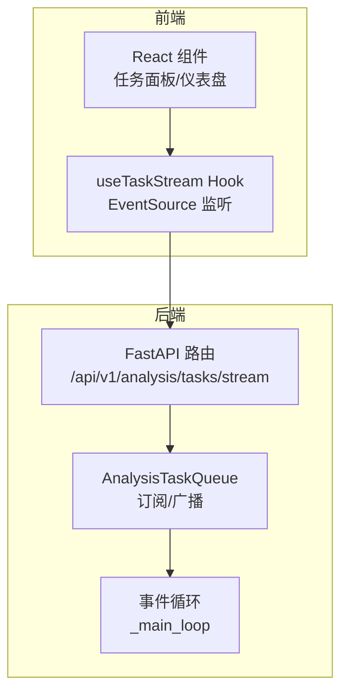
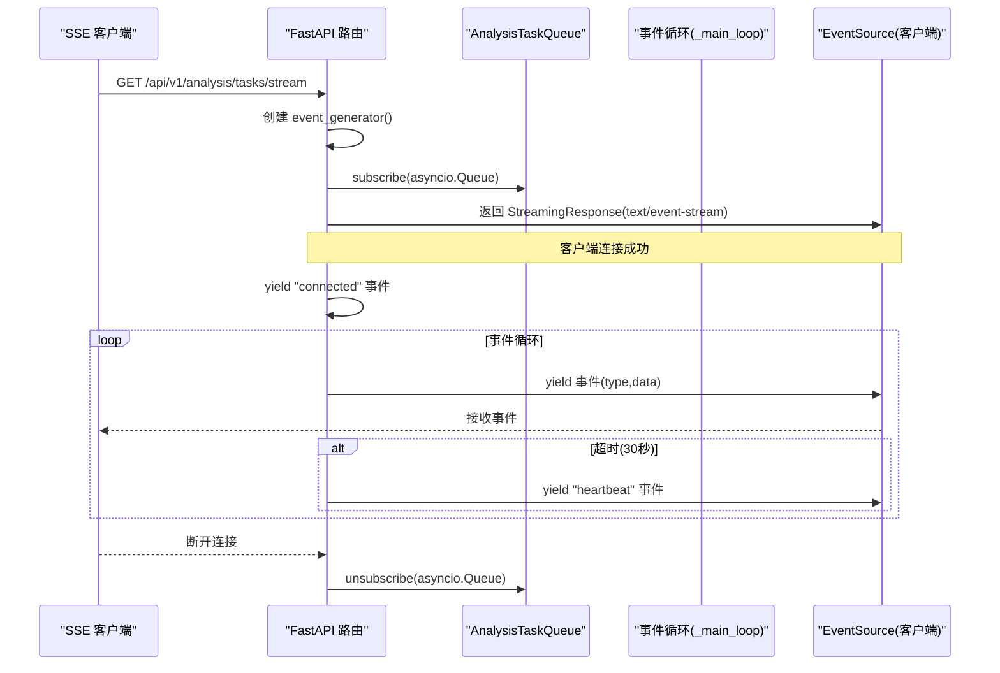
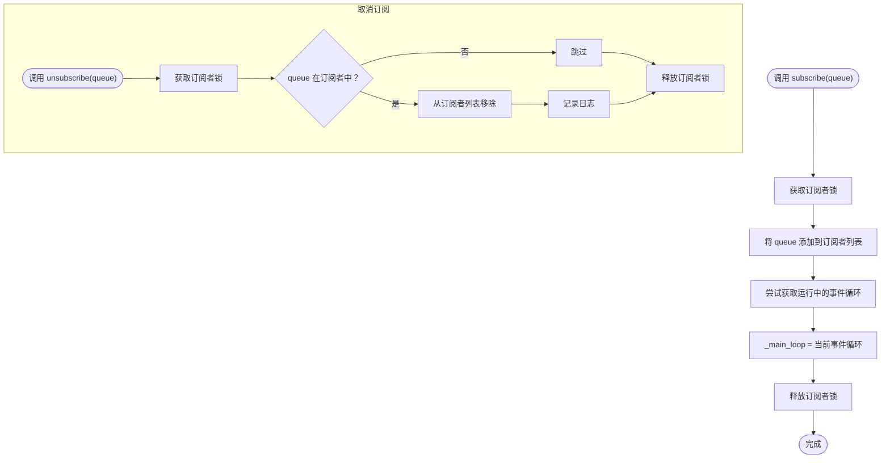
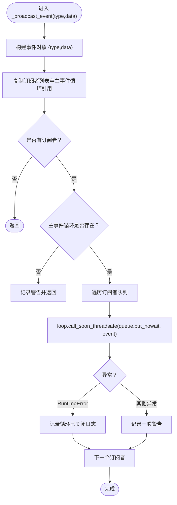
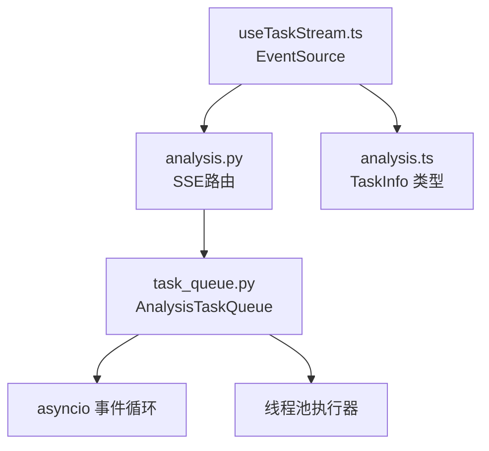

# SSE事件广播机制

<cite>
**本文档引用的文件**
- [task_queue.py](file://src/services/task_queue.py)
- [analysis.py](file://api/v1/endpoints/analysis.py)
- [useTaskStream.ts](file://apps/dsa-web/src/hooks/useTaskStream.ts)
- [analysis.py](file://api/v1/schemas/analysis.py)
- [analysis.ts](file://apps/dsa-web/src/types/analysis.ts)
</cite>

## 目录
1. [简介](#简介)
2. [项目结构](#项目结构)
3. [核心组件](#核心组件)
4. [架构总览](#架构总览)
5. [详细组件分析](#详细组件分析)
6. [依赖关系分析](#依赖关系分析)
7. [性能考虑](#性能考虑)
8. [故障排除指南](#故障排除指南)
9. [结论](#结论)
10. [附录](#附录)

## 简介
本文件针对系统中的Server-Sent Events（SSE）事件广播机制进行深入技术文档编写，重点覆盖以下方面：
- subscribe()与unsubscribe()方法的订阅管理，包括AsyncQueue实例的注册与注销机制
- _broadcast_event()方法的事件广播实现，包括call_soon_threadsafe的跨线程安全调用机制
- 事件类型的定义与处理，包括task_created、task_started、task_completed、task_failed四种标准事件
- 事件数据的格式与结构，包括type字段与data字段的组织方式
- 主事件循环的管理，包括_asyncio.get_running_loop()的获取与_main_loop属性的维护
- SSE客户端集成示例，包括事件监听、连接管理与错误处理
- 事件广播的性能优化与可靠性保障措施，如订阅者数量限制与事件丢失处理

## 项目结构
SSE事件广播机制涉及后端FastAPI路由、任务队列服务以及前端React Hook三部分协作：
- 后端：FastAPI路由提供SSE流接口，使用asyncio.Queue作为事件通道
- 服务层：AnalysisTaskQueue负责任务生命周期管理与事件广播
- 前端：React Hook封装EventSource连接，处理事件监听与自动重连

图表来源
- [analysis.py:376-439](file://api/v1/endpoints/analysis.py#L376-L439)
- [task_queue.py:568-635](file://src/services/task_queue.py#L568-L635)
- [useTaskStream.ts:146-245](file://apps/dsa-web/src/hooks/useTaskStream.ts#L146-L245)

章节来源
- [analysis.py:376-439](file://api/v1/endpoints/analysis.py#L376-L439)
- [task_queue.py:568-635](file://src/services/task_queue.py#L568-L635)
- [useTaskStream.ts:146-245](file://apps/dsa-web/src/hooks/useTaskStream.ts#L146-L245)

## 核心组件
- AnalysisTaskQueue：单例任务队列，负责任务提交、执行与SSE事件广播
- FastAPI SSE路由：提供/text-event-stream媒体类型输出，封装事件生成器
- React Hook useTaskStream：封装EventSource连接，处理事件监听与自动重连

章节来源
- [task_queue.py:108-158](file://src/services/task_queue.py#L108-L158)
- [analysis.py:376-439](file://api/v1/endpoints/analysis.py#L376-L439)
- [useTaskStream.ts:78-252](file://apps/dsa-web/src/hooks/useTaskStream.ts#L78-L252)

## 架构总览
SSE事件广播采用“后端事件生产者 + 前端事件消费者”的模式：
- 后端在任务状态变更时调用_broadcast_event()，将事件推送到各订阅者的asyncio.Queue
- SSE路由为每个客户端创建独立的asyncio.Queue，并通过subscribe()注册
- 事件生成器从队列取出事件，格式化为SSE文本流，定时发送心跳保持连接

图表来源
- [analysis.py:384-439](file://api/v1/endpoints/analysis.py#L384-L439)
- [task_queue.py:570-635](file://src/services/task_queue.py#L570-L635)

章节来源
- [analysis.py:384-439](file://api/v1/endpoints/analysis.py#L384-L439)
- [task_queue.py:570-635](file://src/services/task_queue.py#L570-L635)

## 详细组件分析

### 订阅管理：subscribe()与unsubscribe()
- subscribe(queue: AsyncQueue)：将新的asyncio.Queue加入订阅者列表，并捕获当前运行的事件循环，保存到_main_loop属性，以便后续广播使用
- unsubscribe(queue: AsyncQueue)：从订阅者列表中移除指定队列，减少广播目标

图表来源
- [task_queue.py:570-600](file://src/services/task_queue.py#L570-L600)

章节来源
- [task_queue.py:570-600](file://src/services/task_queue.py#L570-L600)

### 事件广播：_broadcast_event()与call_soon_threadsafe
- 事件结构：{"type": 事件类型, "data": 事件数据}
- 广播流程：
  - 复制当前订阅者列表与主事件循环引用
  - 若无订阅者或主事件循环未设置，直接返回
  - 对每个订阅者，使用loop.call_soon_threadsafe将事件放入队列，保证跨线程安全
  - 捕获RuntimeError（事件循环已关闭）与一般异常，记录警告日志

图表来源
- [task_queue.py:602-635](file://src/services/task_queue.py#L602-L635)

章节来源
- [task_queue.py:602-635](file://src/services/task_queue.py#L602-L635)

### 事件类型与数据结构
- 标准事件类型：
  - task_created：任务创建
  - task_started：任务开始执行
  - task_completed：任务完成
  - task_failed：任务失败
  - heartbeat：心跳（每30秒）
  - connected：连接成功
- 事件数据结构：data字段为TaskInfo.to_dict()序列化后的字典，包含任务ID、状态、进度、消息、报告类型、时间戳等字段

章节来源
- [analysis.py:388-394](file://api/v1/endpoints/analysis.py#L388-L394)
- [task_queue.py:62-93](file://src/services/task_queue.py#L62-L93)

### 主事件循环管理：_main_loop与_asyncio.get_running_loop()
- subscribe()在注册订阅者时尝试获取当前运行的事件循环，保存到_analysis_task_queue._main_loop
- _broadcast_event()使用该主事件循环引用，通过call_soon_threadsafe将事件安全地放入队列
- 若在非异步上下文中，会尝试获取事件循环；若仍不可用，广播将被跳过并记录警告

章节来源
- [task_queue.py:579-587](file://src/services/task_queue.py#L579-L587)
- [task_queue.py:621-623](file://src/services/task_queue.py#L621-L623)

### SSE客户端集成：useTaskStream Hook
- 连接建立：通过EventSource连接后端SSE流，监听connected事件
- 事件处理：分别监听task_created、task_started、task_completed、task_failed事件，解析data为TaskInfo并调用对应回调
- 心跳处理：监听heartbeat事件，用于保持连接
- 错误处理：onerror回调中设置isConnected=false，并根据autoReconnect配置自动重连

章节来源
- [useTaskStream.ts:146-203](file://apps/dsa-web/src/hooks/useTaskStream.ts#L146-L203)
- [useTaskStream.ts:162-184](file://apps/dsa-web/src/hooks/useTaskStream.ts#L162-L184)

### 事件生成器与心跳机制
- 事件生成器在首次连接时发送connected事件
- 生成器会先列举当前进行中的任务，逐个发送task_created事件
- 订阅任务队列后，持续从队列获取事件并格式化为SSE事件
- 每30秒超时一次，发送heartbeat事件保持连接
- 客户端断开或取消时，finally块中调用unsubscribe()注销队列

章节来源
- [analysis.py:399-429](file://api/v1/endpoints/analysis.py#L399-L429)

## 依赖关系分析
- 后端路由依赖AnalysisTaskQueue单例，通过get_task_queue()获取
- AnalysisTaskQueue依赖asyncio事件循环与线程池执行器
- 前端Hook依赖后端SSE流URL与TaskInfo类型定义

图表来源
- [analysis.py:376-439](file://api/v1/endpoints/analysis.py#L376-L439)
- [task_queue.py:131-168](file://src/services/task_queue.py#L131-L168)
- [useTaskStream.ts:1-255](file://apps/dsa-web/src/hooks/useTaskStream.ts#L1-L255)
- [analysis.ts:131-144](file://apps/dsa-web/src/types/analysis.ts#L131-L144)

章节来源
- [analysis.py:376-439](file://api/v1/endpoints/analysis.py#L376-L439)
- [task_queue.py:131-168](file://src/services/task_queue.py#L131-L168)
- [useTaskStream.ts:1-255](file://apps/dsa-web/src/hooks/useTaskStream.ts#L1-L255)
- [analysis.ts:131-144](file://apps/dsa-web/src/types/analysis.ts#L131-L144)

## 性能考虑
- 订阅者数量控制：当前实现未对订阅者数量进行硬性限制，建议在高并发场景下增加订阅者上限与配额管理，防止广播风暴
- 事件丢失处理：心跳机制（每30秒）有助于检测连接异常；建议在客户端侧实现事件去重与状态恢复逻辑
- 广播性能：使用call_soon_threadsafe确保跨线程安全，避免阻塞事件循环；建议对高频事件进行节流或合并
- 内存管理：任务历史清理策略（保留最近N条）有助于控制内存占用，建议结合业务需求调整_max_history

章节来源
- [task_queue.py:534-566](file://src/services/task_queue.py#L534-L566)
- [analysis.py:420-424](file://api/v1/endpoints/analysis.py#L420-L424)

## 故障排除指南
- 无法广播事件：检查主事件循环是否正确捕获；若_main_loop为None，广播会被跳过并记录警告
- 连接断开：前端onerror回调会触发自动重连；检查网络与代理配置，确认SSE路由可达
- 心跳无效：确认后端SSE路由的timeout参数与前端心跳间隔一致
- 事件解析失败：前端parseEventData会尝试JSON解析，失败时记录错误并忽略该事件

章节来源
- [task_queue.py:621-634](file://src/services/task_queue.py#L621-L634)
- [analysis.py:417-424](file://api/v1/endpoints/analysis.py#L417-L424)
- [useTaskStream.ts:135-144](file://apps/dsa-web/src/hooks/useTaskStream.ts#L135-L144)

## 结论
SSE事件广播机制通过AnalysisTaskQueue与FastAPI路由的协同，实现了任务状态的实时推送。subscribe()/unsubscribe()提供了灵活的订阅管理，_broadcast_event()结合call_soon_threadsafe确保了跨线程安全。前端useTaskStream Hook完善了连接管理与错误处理。为进一步提升可靠性与性能，建议引入订阅者数量限制、事件去重与状态恢复、高频事件节流等优化措施。

## 附录

### API定义与事件格式
- SSE事件类型：connected、task_created、task_started、task_completed、task_failed、heartbeat
- 事件数据：TaskInfo.to_dict()序列化后的字典，包含任务ID、状态、进度、消息、报告类型、时间戳等字段

章节来源
- [analysis.py:388-394](file://api/v1/endpoints/analysis.py#L388-L394)
- [analysis.py:442-453](file://api/v1/endpoints/analysis.py#L442-L453)
- [task_queue.py:62-93](file://src/services/task_queue.py#L62-L93)