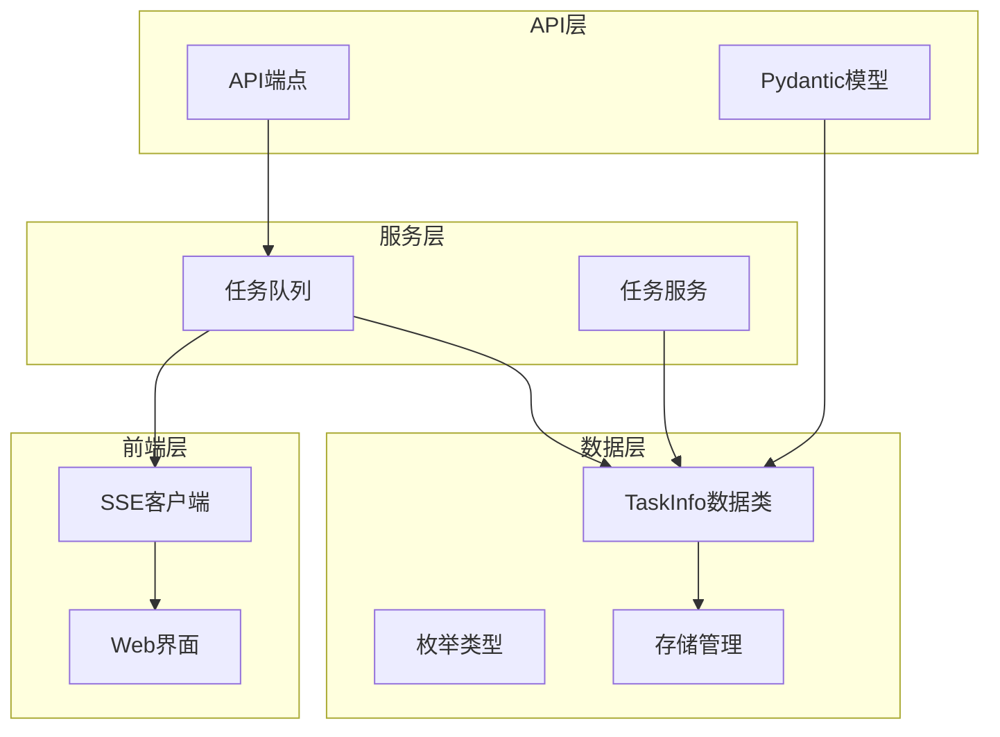
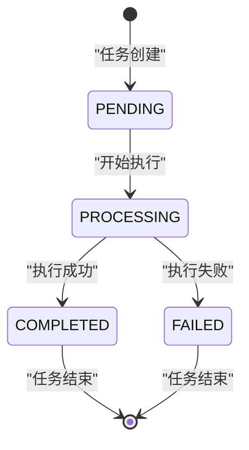
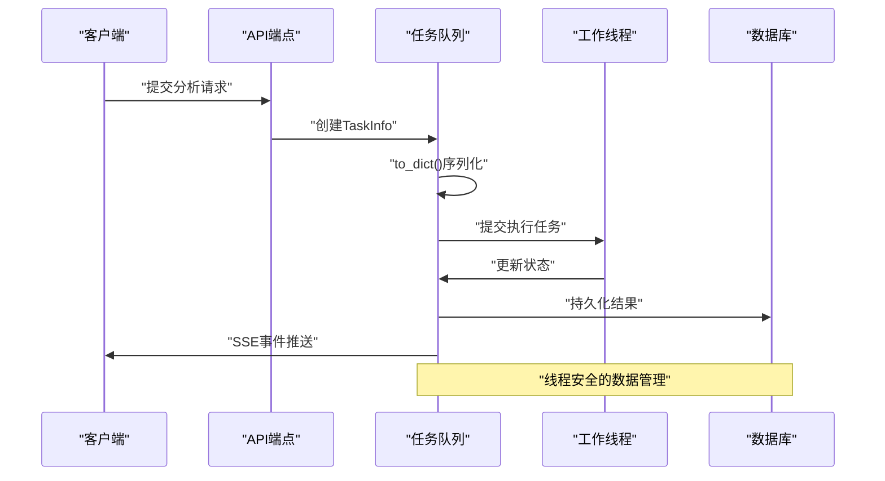
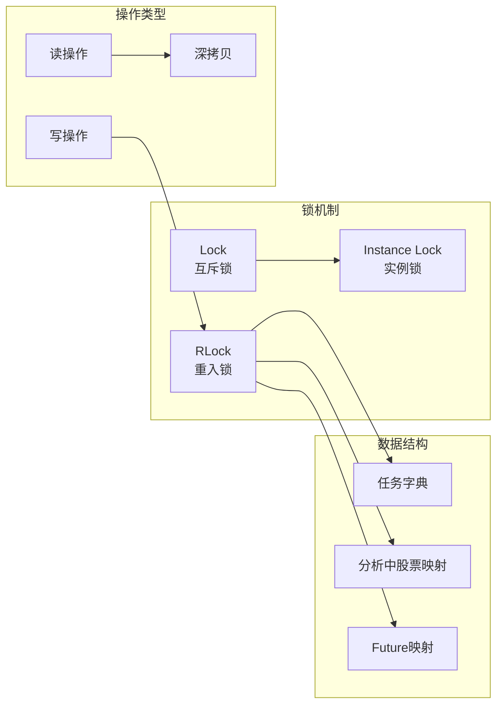
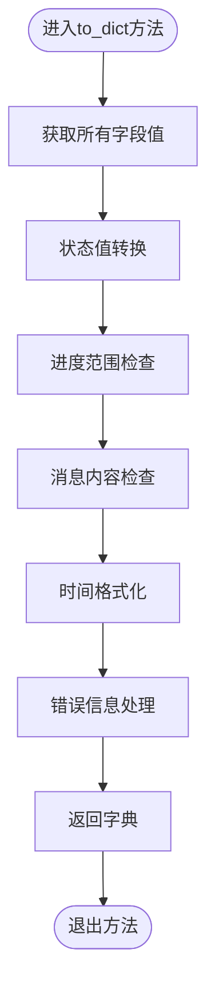
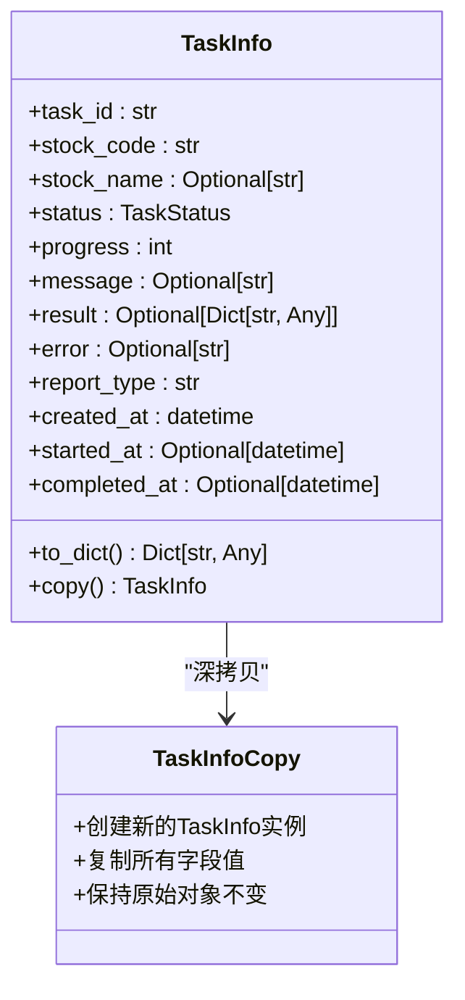
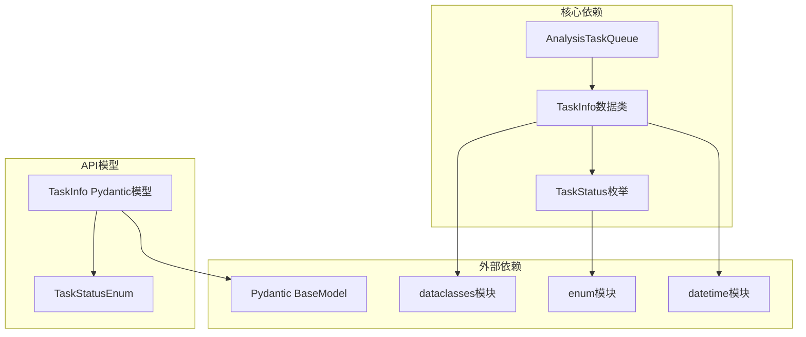

# 任务数据模型

<cite>
**本文档引用的文件**
- [task_queue.py](file://src/services/task_queue.py)
- [analysis.py](file://api/v1/schemas/analysis.py)
- [enums.py](file://src/enums.py)
- [analysis.py](file://api/v1/endpoints/analysis.py)
</cite>

## 目录
1. [简介](#简介)
2. [项目结构](#项目结构)
3. [核心组件](#核心组件)
4. [架构概览](#架构概览)
5. [详细组件分析](#详细组件分析)
6. [依赖关系分析](#依赖关系分析)
7. [性能考虑](#性能考虑)
8. [故障排除指南](#故障排除指南)
9. [结论](#结论)

## 简介

本文档详细介绍了A股自选股智能分析系统中的任务数据模型设计架构，重点分析TaskInfo数据类的设计理念、字段定义、序列化机制和线程安全特性。TaskInfo作为系统的核心数据载体，负责管理异步分析任务的完整生命周期状态，包括任务标识符、股票信息、执行状态、进度跟踪和结果数据等关键要素。

该数据模型采用Python数据类（dataclass）实现，结合线程安全的锁机制和深拷贝策略，确保在高并发环境下任务状态的一致性和可靠性。同时，通过to_dict()方法提供标准化的API响应格式，支持实时SSE事件推送和历史数据查询。

## 项目结构

任务数据模型在整个系统中的位置和作用：



**图表来源**
- [task_queue.py:1-666](file://src/services/task_queue.py#L1-L666)
- [analysis.py:1-291](file://api/v1/schemas/analysis.py#L1-L291)

**章节来源**
- [task_queue.py:1-666](file://src/services/task_queue.py#L1-L666)
- [analysis.py:1-291](file://api/v1/schemas/analysis.py#L1-L291)

## 核心组件

### TaskInfo数据类设计

TaskInfo是系统的核心数据载体，采用Python数据类实现，具有以下核心特性：

- **类型安全**：所有字段都声明了明确的数据类型
- **可选字段**：部分字段允许为空值，适应不同的业务场景
- **默认值**：关键字段设置了合理的默认值
- **序列化支持**：内置to_dict()方法支持API响应转换
- **深拷贝机制**：copy()方法确保线程安全的数据访问

**章节来源**
- [task_queue.py:42-93](file://src/services/task_queue.py#L42-L93)

### 任务状态枚举

系统定义了完整的任务状态生命周期：



**图表来源**
- [task_queue.py:34-40](file://src/services/task_queue.py#L34-L40)

**章节来源**
- [task_queue.py:34-40](file://src/services/task_queue.py#L34-L40)

## 架构概览

### 数据流架构



**图表来源**
- [task_queue.py:260-532](file://src/services/task_queue.py#L260-L532)
- [analysis.py:400-439](file://api/v1/endpoints/analysis.py#L400-L439)

### 线程安全架构

系统采用多层次的线程安全保障：



**图表来源**
- [task_queue.py:152-152](file://src/services/task_queue.py#L152-L152)
- [task_queue.py:121-129](file://src/services/task_queue.py#L121-L129)

**章节来源**
- [task_queue.py:121-158](file://src/services/task_queue.py#L121-L158)

## 详细组件分析

### 字段定义与用途详解

#### 基础标识字段

| 字段名 | 类型 | 默认值 | 描述 | 数据格式 |
|--------|------|--------|------|----------|
| task_id | str | 必填 | 任务唯一标识符 | UUID十六进制字符串 |
| stock_code | str | 必填 | 股票代码 | 标准化股票代码 |
| stock_name | Optional[str] | None | 股票名称 | UTF-8编码字符串 |

**章节来源**
- [task_queue.py:49-52](file://src/services/task_queue.py#L49-L52)

#### 状态管理字段

| 字段名 | 类型 | 默认值 | 描述 | 数据格式 |
|--------|------|--------|------|----------|
| status | TaskStatus | TaskStatus.PENDING | 任务执行状态 | 枚举值 |
| progress | int | 0 | 任务执行进度百分比 | 0-100整数 |
| message | Optional[str] | None | 状态描述信息 | UTF-8编码字符串 |

**章节来源**
- [task_queue.py:52-54](file://src/services/task_queue.py#L52-L54)

#### 结果与错误字段

| 字段名 | 类型 | 默认值 | 描述 | 数据格式 |
|--------|------|--------|------|----------|
| result | Optional[Dict[str, Any]] | None | 分析结果数据 | JSON兼容字典 |
| error | Optional[str] | None | 错误信息描述 | UTF-8编码字符串 |

**章节来源**
- [task_queue.py:55-56](file://src/services/task_queue.py#L55-L56)

#### 报告配置字段

| 字段名 | 类型 | 默认值 | 描述 | 数据格式 |
|--------|------|--------|------|----------|
| report_type | str | "detailed" | 报告类型配置 | 枚举值 |

系统支持的报告类型：
- `simple`: 精简报告
- `detailed`: 完整报告  
- `full`: 完整报告
- `brief`: 简洁报告

**章节来源**
- [task_queue.py:57-57](file://src/services/task_queue.py#L57-L57)
- [enums.py:13-50](file://src/enums.py#L13-L50)

#### 时间戳字段

| 字段名 | 类型 | 默认值 | 描述 | 数据格式 |
|--------|------|--------|------|----------|
| created_at | datetime | 当前时间 | 任务创建时间 | ISO 8601格式 |
| started_at | Optional[datetime] | None | 任务开始执行时间 | ISO 8601格式 |
| completed_at | Optional[datetime] | None | 任务完成时间 | ISO 8601格式 |

**章节来源**
- [task_queue.py:58-60](file://src/services/task_queue.py#L58-L60)

### 序列化机制分析

#### to_dict()方法实现

to_dict()方法提供了标准化的API响应格式转换：



**图表来源**
- [task_queue.py:62-76](file://src/services/task_queue.py#L62-L76)

**章节来源**
- [task_queue.py:62-76](file://src/services/task_queue.py#L62-L76)

#### copy()方法深拷贝实现

copy()方法确保线程安全的数据访问：



**图表来源**
- [task_queue.py:78-93](file://src/services/task_queue.py#L78-L93)

**章节来源**
- [task_queue.py:78-93](file://src/services/task_queue.py#L78-L93)

### 使用示例与最佳实践

#### 创建任务实例

```python
# 基本任务创建
task = TaskInfo(
    task_id="task_12345",
    stock_code="600519",
    stock_name="贵州茅台",
    status=TaskStatus.PENDING,
    report_type="detailed"
)

# 序列化为API响应格式
task_dict = task.to_dict()
```

#### 更新任务状态

```python
# 在执行过程中更新状态
with task_queue._data_lock:
    task.status = TaskStatus.PROCESSING
    task.started_at = datetime.now()
    task.progress = 10
    task.message = "正在分析中..."
```

#### 查询任务信息

```python
# 获取任务副本确保线程安全
task_copy = task_queue.get_task(task_id)
if task_copy:
    task_info = task_copy.to_dict()
```

**章节来源**
- [task_queue.py:260-532](file://src/services/task_queue.py#L260-L532)

## 依赖关系分析

### 组件间依赖关系



**图表来源**
- [task_queue.py:14-31](file://src/services/task_queue.py#L14-L31)
- [analysis.py:14-25](file://api/v1/schemas/analysis.py#L14-L25)

### 数据一致性保障

系统通过以下机制确保数据一致性：

1. **原子性操作**：所有状态更新都在锁保护下进行
2. **事务性回滚**：批量提交失败时自动回滚已创建的任务
3. **深拷贝隔离**：对外提供任务副本，避免并发修改
4. **时间戳追踪**：精确记录每个状态变更的时间点

**章节来源**
- [task_queue.py:363-373](file://src/services/task_queue.py#L363-L373)
- [task_queue.py:384-386](file://src/services/task_queue.py#L384-L386)

## 性能考虑

### 内存管理优化

- **任务历史限制**：默认保留最近100个已完成任务
- **过期清理机制**：自动清理超出限制的历史任务
- **内存回收策略**：及时释放已完成任务的引用

### 并发性能优化

- **读写分离**：读操作使用共享锁，写操作使用独占锁
- **批量操作**：支持批量任务提交和查询
- **事件驱动**：基于SSE的事件推送减少轮询开销

### 序列化性能

- **延迟序列化**：仅在需要时进行to_dict()转换
- **格式化优化**：使用ISO格式化减少转换开销
- **缓存策略**：对常用数据进行缓存

## 故障排除指南

### 常见问题诊断

#### 任务状态异常

**症状**：任务状态长时间停留在PENDING或PROCESSING
**排查步骤**：
1. 检查线程池是否正常工作
2. 验证任务队列锁状态
3. 查看工作线程日志

#### 数据不一致问题

**症状**：不同查询返回不一致的任务状态
**解决方案**：
1. 确保使用get_task()方法获取任务副本
2. 验证深拷贝机制是否正常工作
3. 检查锁的使用是否正确

#### 内存泄漏问题

**症状**：系统运行时间越长内存占用越大
**排查步骤**：
1. 检查任务历史清理机制
2. 验证过期任务的删除逻辑
3. 监控任务队列大小

**章节来源**
- [task_queue.py:534-566](file://src/services/task_queue.py#L534-L566)

### 调试工具和技巧

1. **日志监控**：利用系统日志追踪任务状态变化
2. **状态检查**：定期检查任务队列统计信息
3. **性能监控**：监控线程池和内存使用情况
4. **错误追踪**：记录详细的错误信息和堆栈跟踪

## 结论

TaskInfo数据模型作为A股自选股智能分析系统的核心组件，展现了现代异步任务系统的最佳实践。其设计充分考虑了：

- **类型安全**：通过明确的字段类型和默认值确保数据完整性
- **线程安全**：采用多层次锁机制和深拷贝策略保障并发安全
- **可扩展性**：支持灵活的任务状态管理和报告类型配置
- **性能优化**：通过内存管理和序列化优化提升系统性能

该数据模型不仅满足了当前业务需求，还为未来的功能扩展奠定了坚实基础。通过标准化的API接口和完善的错误处理机制，系统能够稳定可靠地处理大量并发任务，为用户提供高质量的股票分析服务。