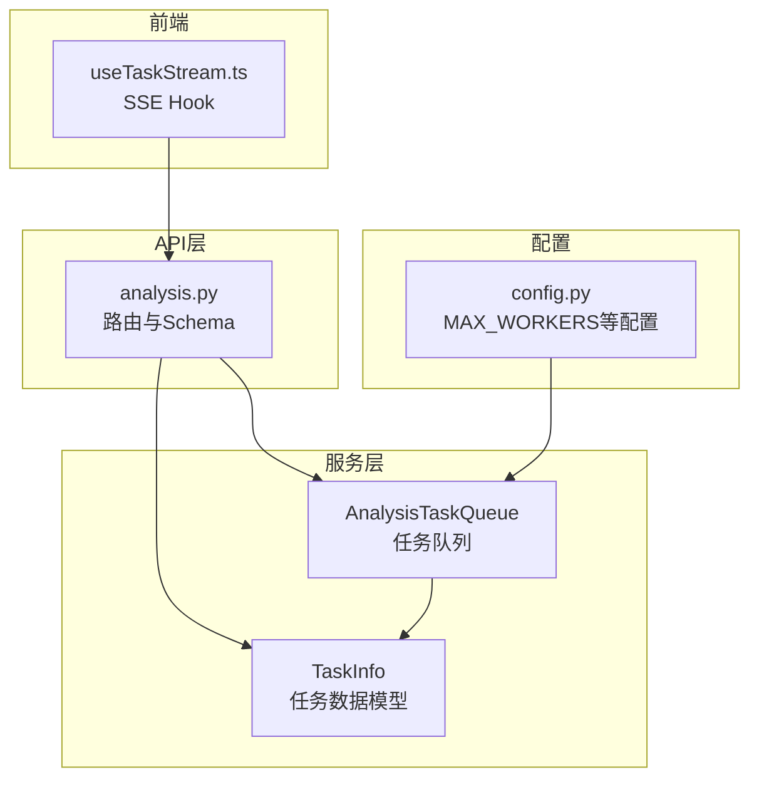
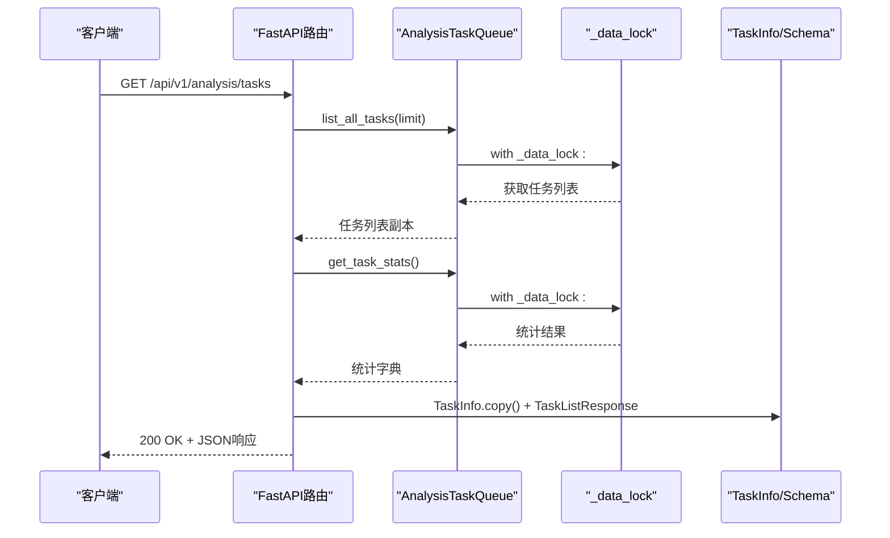
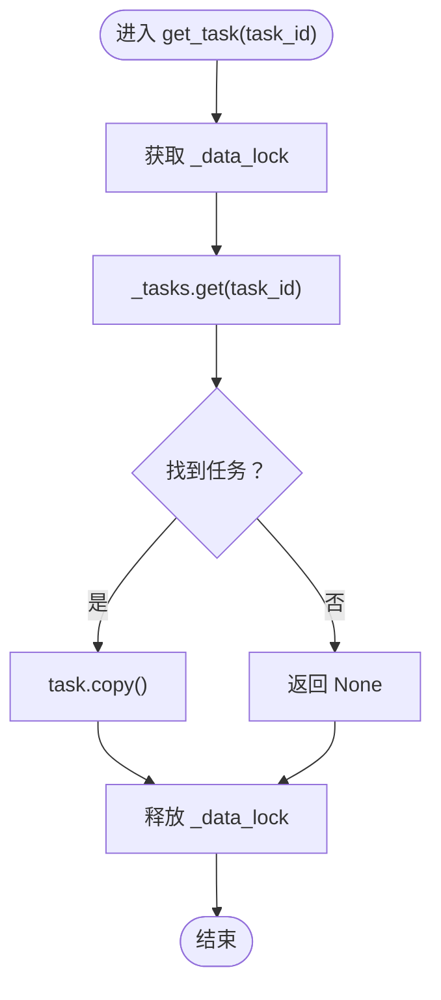
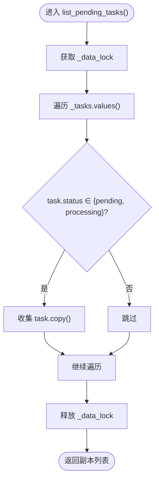
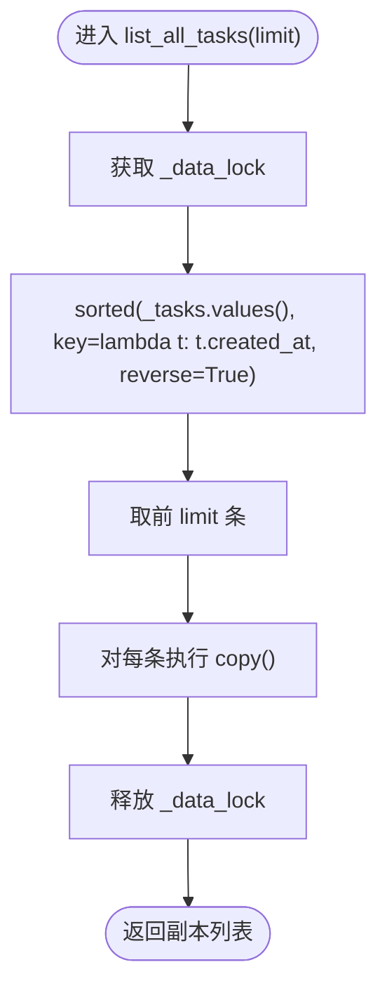
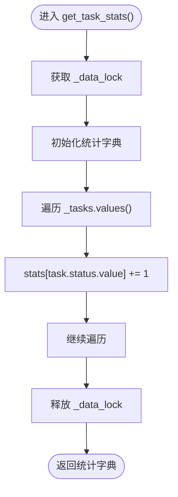
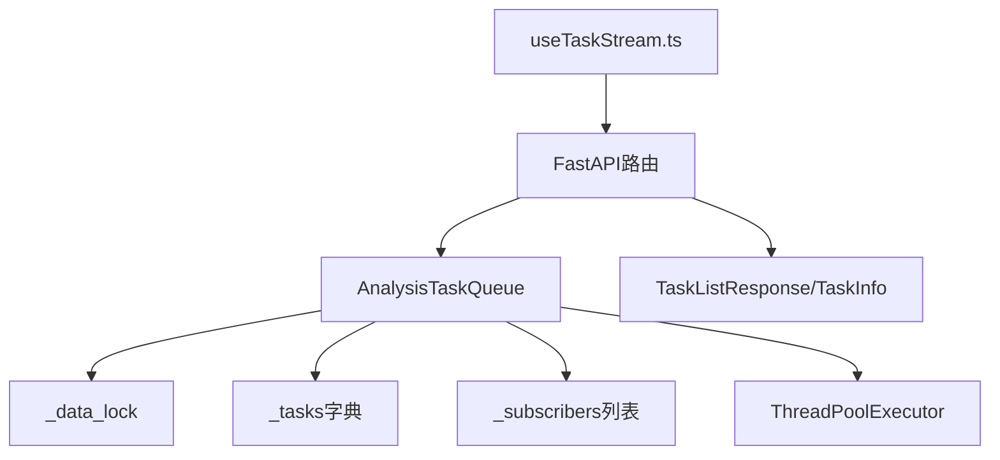

# 任务查询接口

<cite>
**本文档引用的文件**
- [task_queue.py](file://src/services/task_queue.py)
- [analysis.py](file://api/v1/endpoints/analysis.py)
- [analysis.py](file://api/v1/schemas/analysis.py)
- [useTaskStream.ts](file://apps/dsa-web/src/hooks/useTaskStream.ts)
- [config.py](file://src/config.py)
- [test_analysis_api_contract.py](file://tests/test_analysis_api_contract.py)
</cite>

## 目录
1. [简介](#简介)
2. [项目结构](#项目结构)
3. [核心组件](#核心组件)
4. [架构概览](#架构概览)
5. [详细组件分析](#详细组件分析)
6. [依赖分析](#依赖分析)
7. [性能考虑](#性能考虑)
8. [故障排查指南](#故障排查指南)
9. [结论](#结论)
10. [附录](#附录)

## 简介
本文件面向任务查询接口的技术文档，重点解析以下四个核心方法：
- get_task(): 单任务查询，基于任务ID精确查找并返回TaskInfo副本
- list_pending_tasks(): 进行中任务查询，按状态过滤返回进行中任务列表
- list_all_tasks(): 全部任务查询，支持limit参数分页控制并按时间排序
- get_task_stats(): 统计信息查询，计算各类状态任务的数量统计

文档还涵盖线程安全实现（_data_lock）、数据一致性保证、使用示例与最佳实践、性能优化建议以及API响应结构说明。

## 项目结构
任务查询接口位于后端服务层，主要涉及以下模块：
- 服务层：AnalysisTaskQueue（任务队列与查询实现）
- API层：FastAPI路由与Schema定义
- 前端：SSE实时流Hook（useTaskStream.ts）

图表来源
- [analysis.py:307-374](file://api/v1/endpoints/analysis.py#L307-L374)
- [task_queue.py:108-666](file://src/services/task_queue.py#L108-L666)
- [analysis.py:218-272](file://api/v1/schemas/analysis.py#L218-L272)
- [useTaskStream.ts:1-255](file://apps/dsa-web/src/hooks/useTaskStream.ts#L1-L255)
- [config.py:393-393](file://src/config.py#L393-L393)

章节来源
- [analysis.py:307-374](file://api/v1/endpoints/analysis.py#L307-L374)
- [task_queue.py:108-666](file://src/services/task_queue.py#L108-L666)
- [analysis.py:218-272](file://api/v1/schemas/analysis.py#L218-L272)
- [useTaskStream.ts:1-255](file://apps/dsa-web/src/hooks/useTaskStream.ts#L1-L255)
- [config.py:393-393](file://src/config.py#L393-L393)

## 核心组件
- AnalysisTaskQueue：单例任务队列，提供线程安全的任务查询与状态管理
- TaskInfo：任务信息数据类，支持复制（copy）以确保外部访问不破坏内部状态
- FastAPI路由与Schema：定义查询接口、参数校验与响应模型
- SSE事件流：实时推送任务状态变更，辅助前端展示

章节来源
- [task_queue.py:108-666](file://src/services/task_queue.py#L108-L666)
- [analysis.py:218-272](file://api/v1/schemas/analysis.py#L218-L272)
- [analysis.py:307-374](file://api/v1/endpoints/analysis.py#L307-L374)

## 架构概览
任务查询接口采用“API层-服务层-数据层”的分层设计：
- API层负责请求解析、参数校验与响应封装
- 服务层负责业务逻辑与数据操作（线程安全）
- 数据层为内存中的任务字典与状态集合

图表来源
- [analysis.py:316-369](file://api/v1/endpoints/analysis.py#L316-L369)
- [task_queue.py:401-436](file://src/services/task_queue.py#L401-L436)

## 详细组件分析

### get_task() 方法：单任务查询
- 功能：根据任务ID精确查找任务，并返回TaskInfo副本
- 线程安全：使用_RLock保护内部字典访问
- 返回机制：返回TaskInfo.copy()，确保外部修改不影响内部状态
- 时间复杂度：O(1)，基于字典键查找

图表来源
- [task_queue.py:374-386](file://src/services/task_queue.py#L374-L386)

章节来源
- [task_queue.py:374-386](file://src/services/task_queue.py#L374-L386)

### list_pending_tasks() 方法：进行中任务查询
- 功能：筛选并返回状态为pending或processing的任务列表
- 线程安全：使用_RLock保护遍历过程
- 过滤逻辑：状态集合包含PENDING与PROCESSING
- 返回机制：对每个匹配任务执行copy()，返回副本列表

图表来源
- [task_queue.py:388-399](file://src/services/task_queue.py#L388-L399)

章节来源
- [task_queue.py:388-399](file://src/services/task_queue.py#L388-L399)

### list_all_tasks() 方法：全部任务查询
- 功能：返回所有任务，按创建时间created_at降序排列
- 参数：limit（默认50），用于分页控制
- 线程安全：使用_RLock保护排序与切片过程
- 排序机制：sorted(key=lambda t: t.created_at, reverse=True)
- 返回机制：对排序后的前limit条任务执行copy()

图表来源
- [task_queue.py:401-417](file://src/services/task_queue.py#L401-L417)

章节来源
- [task_queue.py:401-417](file://src/services/task_queue.py#L401-L417)

### get_task_stats() 方法：统计信息查询
- 功能：计算总任务数与各状态任务数量（pending/processing/completed/failed）
- 线程安全：使用_RLock保护遍历过程
- 统计逻辑：遍历所有任务，按task.status.value累加计数
- 返回机制：返回包含total/pending/processing/completed/failed的字典

图表来源
- [task_queue.py:419-436](file://src/services/task_queue.py#L419-L436)

章节来源
- [task_queue.py:419-436](file://src/services/task_queue.py#L419-L436)

### 线程安全与数据一致性
- 锁机制：AnalysisTaskQueue内部使用threading.RLock（_data_lock）保护所有读写操作
- 一致性保证：所有查询方法均在with _data_lock:块内执行，确保：
  - 查询期间数据不会被并发修改
  - 返回对象均为副本（copy），避免外部修改影响内部状态
- 并发同步：通过sync_max_workers在空闲状态下动态调整线程池大小，避免运行中替换实例导致的竞态

章节来源
- [task_queue.py:152-152](file://src/services/task_queue.py#L152-L152)
- [task_queue.py:207-230](file://src/services/task_queue.py#L207-L230)

### API响应结构与数据格式
- TaskInfo模型字段（部分）：task_id、stock_code、stock_name、status、progress、message、report_type、created_at、started_at、completed_at、error
- TaskListResponse模型：total、pending、processing、tasks（TaskInfo列表）
- 响应示例：见analysis.py中的Schema注释示例

章节来源
- [analysis.py:218-272](file://api/v1/schemas/analysis.py#L218-L272)

### 使用示例与最佳实践
- 单任务查询：通过任务ID调用get_task()，注意返回可能为None
- 进行中任务：调用list_pending_tasks()获取当前排队与执行中的任务
- 全部任务：调用list_all_tasks(limit)进行分页查询，limit建议10-100之间
- 统计信息：调用get_task_stats()获取总数与各状态分布
- 批量查询优化：前端使用SSE实时流（useTaskStream.ts）监听任务状态变化，减少轮询频率
- 缓存策略：结合前端缓存与SSE事件，避免重复拉取相同数据

章节来源
- [analysis.py:316-369](file://api/v1/endpoints/analysis.py#L316-L369)
- [useTaskStream.ts:1-255](file://apps/dsa-web/src/hooks/useTaskStream.ts#L1-L255)

## 依赖分析
- AnalysisTaskQueue依赖：
  - threading.RLock（线程安全）
  - dataclasses.dataclass（TaskInfo）
  - enum.Enum（TaskStatus）
  - datetime（时间戳）
- FastAPI路由依赖：
  - get_task_queue()（获取AnalysisTaskQueue单例）
  - TaskListResponse/TaskInfo（Pydantic模型）
- 前端依赖：
  - useTaskStream.ts通过EventSource订阅SSE事件流

图表来源
- [task_queue.py:108-666](file://src/services/task_queue.py#L108-L666)
- [analysis.py:316-369](file://api/v1/endpoints/analysis.py#L316-L369)
- [analysis.py:218-272](file://api/v1/schemas/analysis.py#L218-L272)
- [useTaskStream.ts:1-255](file://apps/dsa-web/src/hooks/useTaskStream.ts#L1-L255)

章节来源
- [task_queue.py:108-666](file://src/services/task_queue.py#L108-L666)
- [analysis.py:316-369](file://api/v1/endpoints/analysis.py#L316-L369)
- [analysis.py:218-272](file://api/v1/schemas/analysis.py#L218-L272)
- [useTaskStream.ts:1-255](file://apps/dsa-web/src/hooks/useTaskStream.ts#L1-L255)

## 性能考虑
- 查询复杂度
  - get_task(): O(1) 字典查找
  - list_pending_tasks(): O(n) 遍历+过滤
  - list_all_tasks(): O(n log n) 排序+切片
  - get_task_stats(): O(n) 遍历计数
- 分页与限制
  - list_all_tasks(limit)通过切片限制返回数量，避免一次性传输大量数据
  - API层Query参数limit默认20，最大100，前端可根据需要调整
- 线程池与并发
  - MAX_WORKERS由配置决定，默认3；可通过sync_max_workers在空闲时动态调整
- 建议
  - 对高频查询场景，前端使用SSE事件流替代轮询
  - 合理设置limit，避免过大数据传输
  - 在高并发环境下，适当增加MAX_WORKERS以提升吞吐

章节来源
- [task_queue.py:401-417](file://src/services/task_queue.py#L401-L417)
- [analysis.py:316-322](file://api/v1/endpoints/analysis.py#L316-L322)
- [config.py:393-393](file://src/config.py#L393-L393)

## 故障排查指南
- 现象：查询返回空列表
  - 检查任务是否已创建或已被清理（超过历史保留上限）
  - 确认任务状态是否符合预期（pending/processing/completed/failed）
- 现象：线程安全相关异常
  - 确认所有查询均在with _data_lock:块内执行
  - 避免直接修改返回对象的内部状态
- 现象：SSE连接断开
  - 检查前端useTaskStream.ts的自动重连配置
  - 确认后端订阅者列表与事件循环状态正常

章节来源
- [task_queue.py:152-152](file://src/services/task_queue.py#L152-L152)
- [useTaskStream.ts:147-209](file://apps/dsa-web/src/hooks/useTaskStream.ts#L147-L209)

## 结论
任务查询接口通过AnalysisTaskQueue实现了线程安全、高性能的任务数据访问与统计能力。配合FastAPI的Schema与SSE事件流，提供了清晰的API响应结构与实时状态推送。建议在生产环境中合理设置MAX_WORKERS与limit参数，并采用SSE降低轮询压力，以获得更优的用户体验与系统性能。

## 附录
- 关键实现参考路径
  - get_task(): [task_queue.py:374-386](file://src/services/task_queue.py#L374-L386)
  - list_pending_tasks(): [task_queue.py:388-399](file://src/services/task_queue.py#L388-L399)
  - list_all_tasks(): [task_queue.py:401-417](file://src/services/task_queue.py#L401-L417)
  - get_task_stats(): [task_queue.py:419-436](file://src/services/task_queue.py#L419-L436)
  - API路由与Schema: [analysis.py:316-369](file://api/v1/endpoints/analysis.py#L316-L369), [analysis.py:218-272](file://api/v1/schemas/analysis.py#L218-L272)
  - SSE Hook: [useTaskStream.ts:1-255](file://apps/dsa-web/src/hooks/useTaskStream.ts#L1-L255)
  - 配置与并发: [config.py:393-393](file://src/config.py#L393-L393)