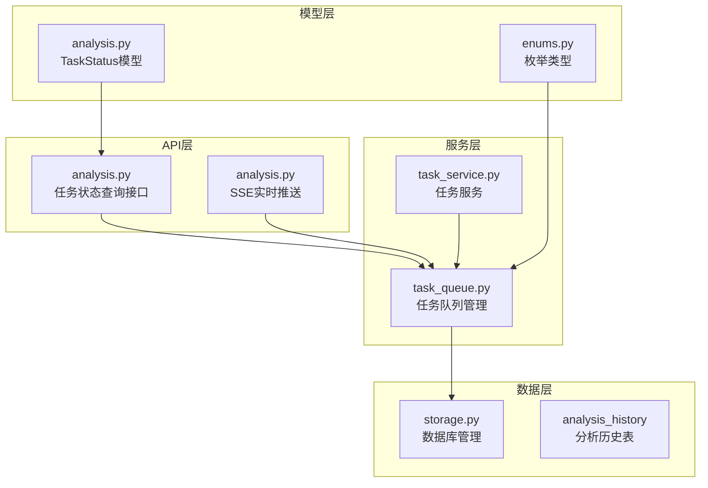
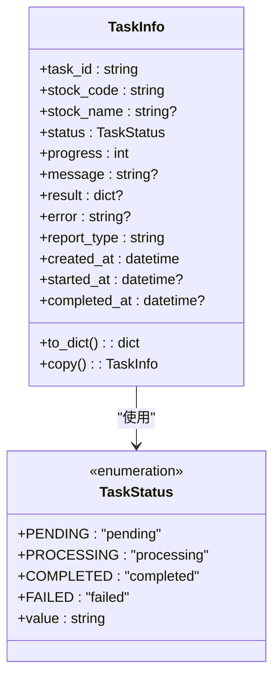
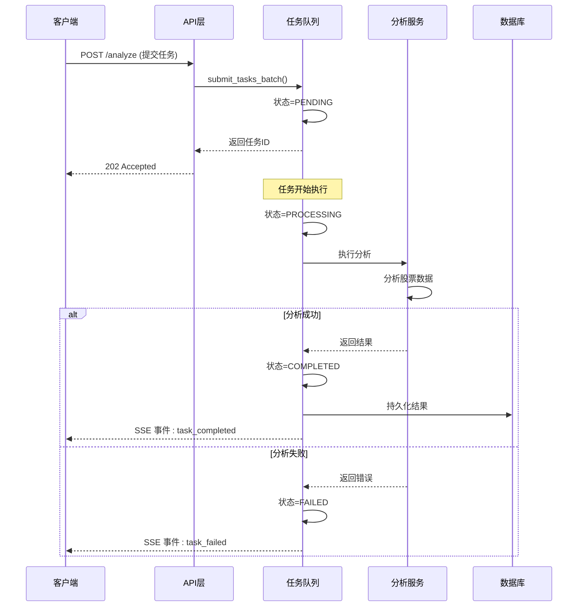
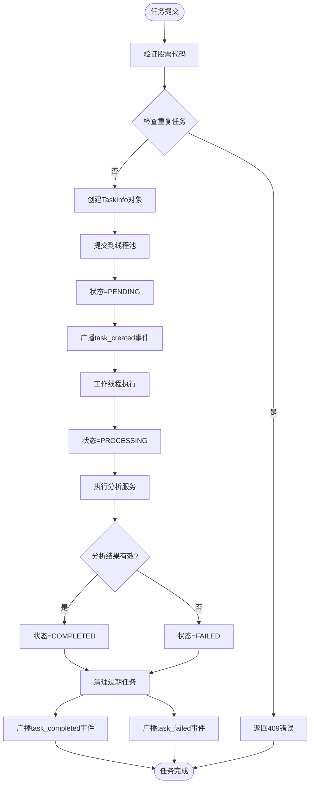
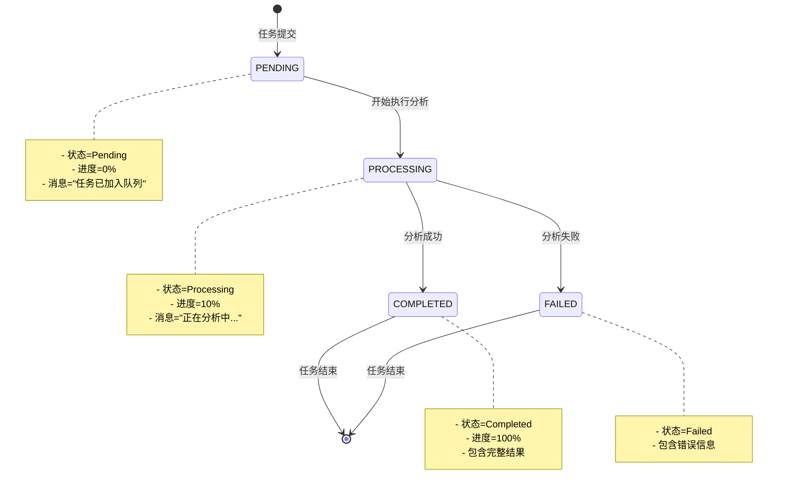
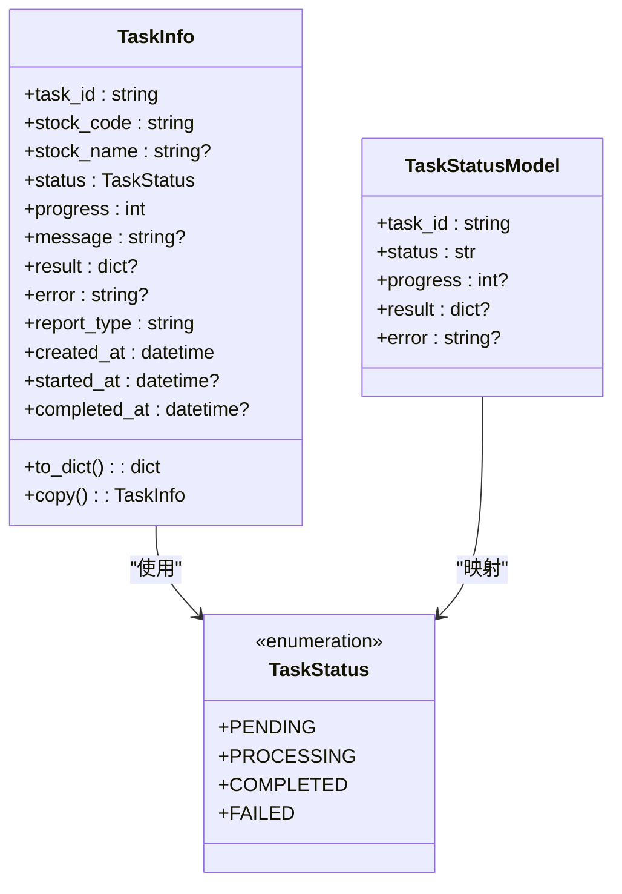
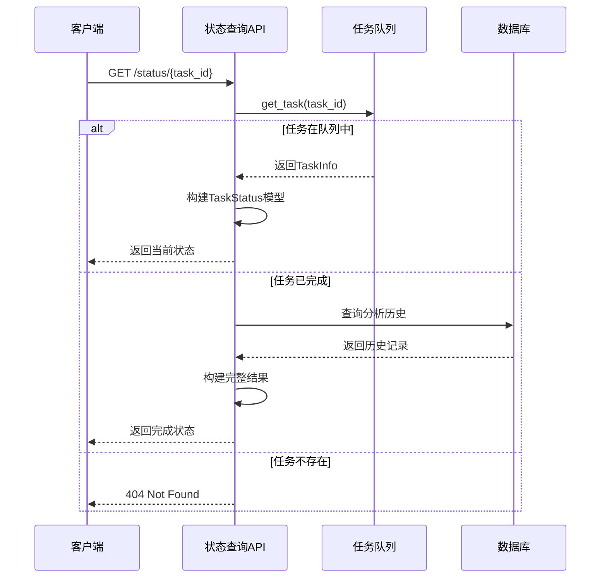
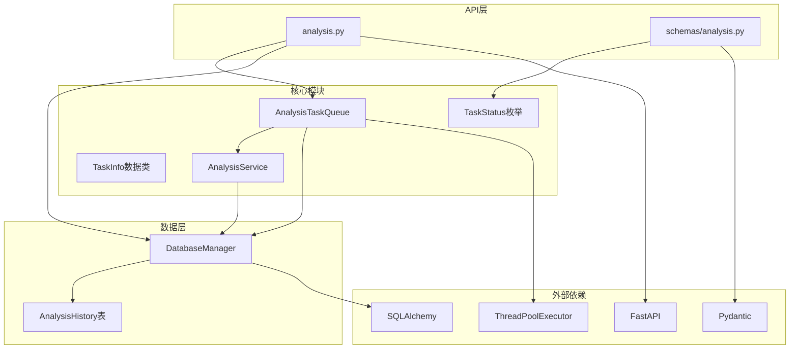

# 任务状态管理

<cite>
**本文档引用的文件**
- [src/enums.py](file://src/enums.py)
- [src/services/task_queue.py](file://src/services/task_queue.py)
- [api/v1/endpoints/analysis.py](file://api/v1/endpoints/analysis.py)
- [api/v1/schemas/analysis.py](file://api/v1/schemas/analysis.py)
- [src/storage.py](file://src/storage.py)
</cite>

## 目录
1. [简介](#简介)
2. [项目结构](#项目结构)
3. [核心组件](#核心组件)
4. [架构概览](#架构概览)
5. [详细组件分析](#详细组件分析)
6. [依赖关系分析](#依赖关系分析)
7. [性能考虑](#性能考虑)
8. [故障排除指南](#故障排除指南)
9. [结论](#结论)

## 简介

本文档详细介绍了任务状态管理系统的设计与实现，重点分析了TaskStatus枚举类的设计理念、状态转换逻辑、触发条件以及在系统中的应用。该系统采用异步任务队列机制，支持实时状态监控和SSE事件推送，为用户提供完整的任务生命周期管理能力。

## 项目结构

任务状态管理系统主要分布在以下模块中：

**图表来源**
- [api/v1/endpoints/analysis.py:1-694](file://api/v1/endpoints/analysis.py#L1-L694)
- [src/services/task_queue.py:1-666](file://src/services/task_queue.py#L1-L666)
- [api/v1/schemas/analysis.py:182-215](file://api/v1/schemas/analysis.py#L182-L215)

**章节来源**
- [api/v1/endpoints/analysis.py:1-694](file://api/v1/endpoints/analysis.py#L1-L694)
- [src/services/task_queue.py:1-666](file://src/services/task_queue.py#L1-L666)

## 核心组件

### TaskStatus枚举类设计

TaskStatus枚举类是整个任务状态管理系统的核心，定义了四种标准状态：

**图表来源**
- [src/services/task_queue.py:34-40](file://src/services/task_queue.py#L34-L40)
- [src/services/task_queue.py:42-94](file://src/services/task_queue.py#L42-L94)

### 状态定义与用途

| 状态 | 值 | 描述 | 用途 |
|------|----|------|------|
| PENDING | "pending" | 等待执行 | 任务刚提交时的状态，表示任务已加入队列但尚未开始执行 |
| PROCESSING | "processing" | 执行中 | 任务正在分析过程中，可能包含进度信息 |
| COMPLETED | "completed" | 已完成 | 任务成功完成，包含完整的分析结果 |
| FAILED | "failed" | 失败 | 任务执行过程中发生错误，包含错误信息 |

**章节来源**
- [src/services/task_queue.py:34-40](file://src/services/task_queue.py#L34-L40)

## 架构概览

系统采用分层架构设计，实现了任务状态的完整生命周期管理：

**图表来源**
- [api/v1/endpoints/analysis.py:161-232](file://api/v1/endpoints/analysis.py#L161-L232)
- [src/services/task_queue.py:440-532](file://src/services/task_queue.py#L440-L532)

## 详细组件分析

### 任务队列管理器

AnalysisTaskQueue是系统的核心组件，负责管理任务的完整生命周期：

**图表来源**
- [src/services/task_queue.py:260-361](file://src/services/task_queue.py#L260-L361)
- [src/services/task_queue.py:440-532](file://src/services/task_queue.py#L440-L532)

### 状态转换逻辑

系统实现了严格的有限状态机转换：

**图表来源**
- [src/services/task_queue.py:460-532](file://src/services/task_queue.py#L460-L532)

### 状态变更触发条件

| 触发条件 | 触发时机 | 状态变更 | 相关代码 |
|----------|----------|----------|----------|
| 任务提交 | 用户提交分析请求 | PENDING | submit_tasks_batch() |
| 开始执行 | 线程池调度任务 | PROCESSING | _execute_task() |
| 分析成功 | 分析服务返回有效结果 | COMPLETED | _execute_task() |
| 分析失败 | 分析服务抛出异常或返回空结果 | FAILED | _execute_task() |
| 重复提交 | 同一股票正在分析中 | 409错误 | submit_tasks_batch() |

**章节来源**
- [src/services/task_queue.py:260-361](file://src/services/task_queue.py#L260-L361)
- [src/services/task_queue.py:440-532](file://src/services/task_queue.py#L440-L532)

### 状态信息存储与传递

TaskInfo数据类提供了完整的状态信息存储机制：

**图表来源**
- [src/services/task_queue.py:42-94](file://src/services/task_queue.py#L42-L94)
- [api/v1/schemas/analysis.py:182-215](file://api/v1/schemas/analysis.py#L182-L215)

**章节来源**
- [src/services/task_queue.py:42-94](file://src/services/task_queue.py#L42-L94)
- [api/v1/schemas/analysis.py:182-215](file://api/v1/schemas/analysis.py#L182-L215)

### API接口设计

系统提供了多种API接口来查询和监控任务状态：

#### 状态查询接口

| 接口 | 方法 | 路径 | 功能描述 |
|------|------|------|----------|
| 触发分析 | POST | /api/v1/analysis/analyze | 提交分析任务，支持同步和异步模式 |
| 任务状态 | GET | /api/v1/analysis/status/{task_id} | 查询单个任务状态 |
| 任务列表 | GET | /api/v1/analysis/tasks | 获取任务列表和统计信息 |
| SSE流 | GET | /api/v1/analysis/tasks/stream | 实时推送任务状态变化 |

#### 状态查询流程

**图表来源**
- [api/v1/endpoints/analysis.py:470-570](file://api/v1/endpoints/analysis.py#L470-L570)

**章节来源**
- [api/v1/endpoints/analysis.py:470-570](file://api/v1/endpoints/analysis.py#L470-L570)

## 依赖关系分析

系统各组件之间的依赖关系如下：

**图表来源**
- [src/services/task_queue.py:14-31](file://src/services/task_queue.py#L14-L31)
- [api/v1/endpoints/analysis.py:25-61](file://api/v1/endpoints/analysis.py#L25-L61)

**章节来源**
- [src/services/task_queue.py:14-31](file://src/services/task_queue.py#L14-L31)
- [api/v1/endpoints/analysis.py:25-61](file://api/v1/endpoints/analysis.py#L25-L61)

## 性能考虑

### 并发控制

系统通过线程池管理并发执行，支持动态调整最大工作线程数：

- **最大并发限制**: 默认3个线程，可通过配置动态调整
- **防重复提交**: 防止同一股票代码的重复分析任务
- **内存管理**: 限制历史任务数量，避免内存泄漏

### 状态持久化

- **实时状态**: 内存中维护任务状态，保证查询性能
- **历史记录**: 完成的任务结果持久化到数据库
- **清理策略**: 自动清理过期的历史任务记录

### SSE事件推送

- **事件类型**: connected, task_created, task_started, task_completed, task_failed, heartbeat
- **心跳机制**: 每30秒发送一次心跳，保持连接活跃
- **跨线程安全**: 使用call_soon_threadsafe确保事件广播的线程安全

## 故障排除指南

### 常见问题及解决方案

#### 1. 重复任务提交错误

**现象**: 返回409状态码，提示"股票正在分析中"

**原因**: 同一股票代码的任务已经在执行中

**解决方法**:
- 等待现有任务完成后再提交新任务
- 使用不同的股票代码
- 检查任务状态确认任务是否仍在执行

#### 2. 任务状态查询失败

**现象**: 查询任务状态返回404

**原因**:
- 任务ID不存在
- 任务已完成但已过期被清理
- 系统重启后内存中的任务丢失

**解决方法**:
- 确认任务ID的正确性
- 检查数据库中的历史记录
- 重新提交分析任务

#### 3. SSE连接中断

**现象**: 实时状态推送中断

**原因**:
- 客户端断开连接
- 服务器负载过高
- 网络连接不稳定

**解决方法**:
- 检查客户端SSE连接状态
- 增加服务器资源
- 优化网络环境

### 调试方法

#### 1. 日志分析

系统提供了详细的日志记录：

- **任务状态变更**: 记录每个状态转换的时间和原因
- **错误信息**: 记录分析过程中的异常和错误
- **性能监控**: 记录任务执行时间和资源使用情况

#### 2. 状态监控

**API监控**:
- 使用GET /api/v1/analysis/tasks获取任务列表
- 使用GET /api/v1/analysis/tasks/stream获取实时状态
- 监控不同状态的任务数量变化

**数据库监控**:
- 查询analysis_history表确认已完成任务
- 检查任务执行时间和成功率

#### 3. 性能优化建议

- **合理设置并发**: 根据系统资源调整最大工作线程数
- **任务批处理**: 合理安排批量任务的执行时间
- **内存管理**: 定期清理过期的历史任务记录

**章节来源**
- [src/services/task_queue.py:602-635](file://src/services/task_queue.py#L602-L635)
- [api/v1/endpoints/analysis.py:384-439](file://api/v1/endpoints/analysis.py#L384-L439)

## 结论

任务状态管理系统通过精心设计的枚举类、严格的状态转换逻辑和完善的API接口，为用户提供了可靠的异步任务管理能力。系统的主要优势包括：

1. **类型安全**: 使用枚举类确保状态值的有效性和一致性
2. **实时监控**: 通过SSE提供实时状态推送
3. **完整生命周期**: 支持从提交到完成的完整任务管理
4. **错误处理**: 完善的错误捕获和状态标记机制
5. **性能优化**: 合理的并发控制和内存管理策略

该系统为股票分析任务提供了稳定可靠的状态管理基础，用户可以通过多种接口查询和监控任务状态，确保分析流程的透明性和可控性。