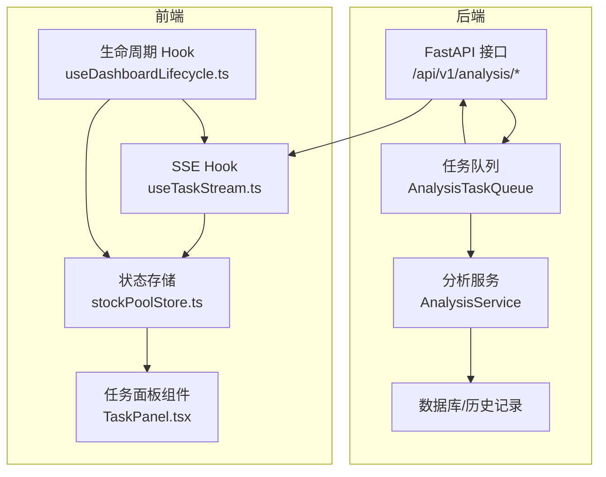
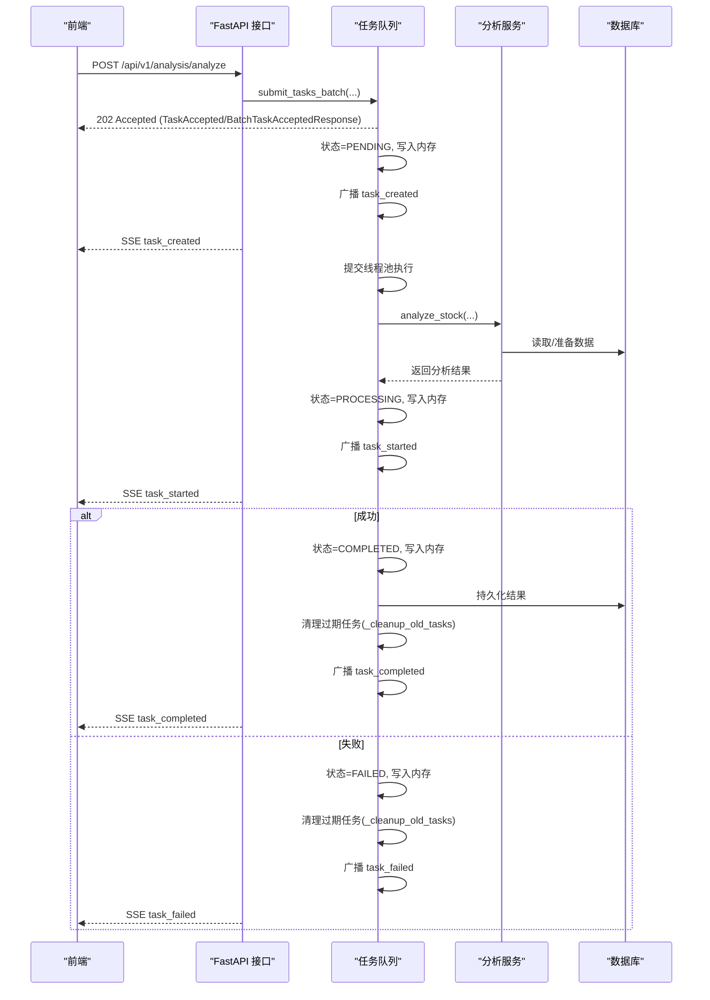
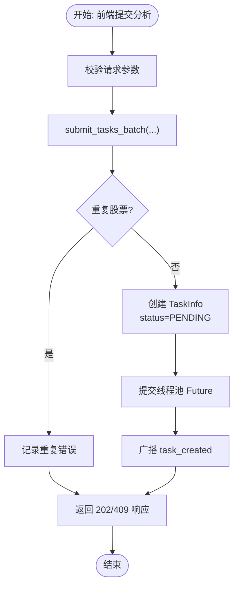
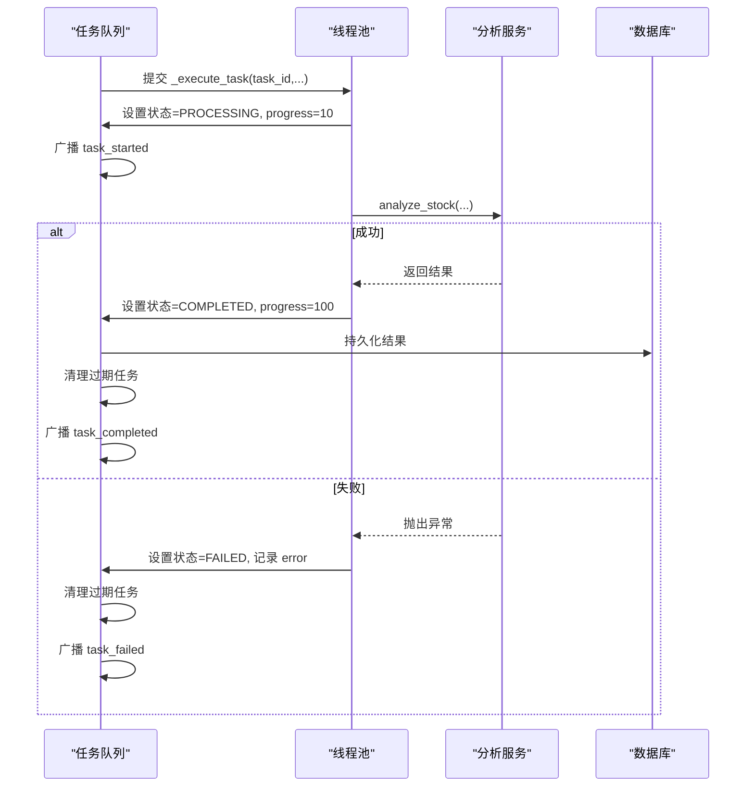
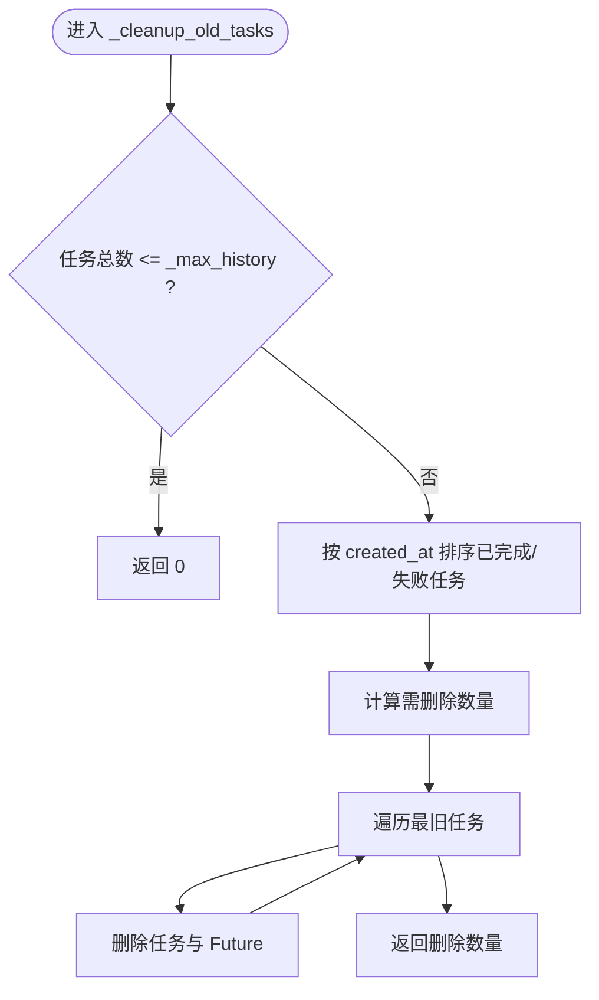
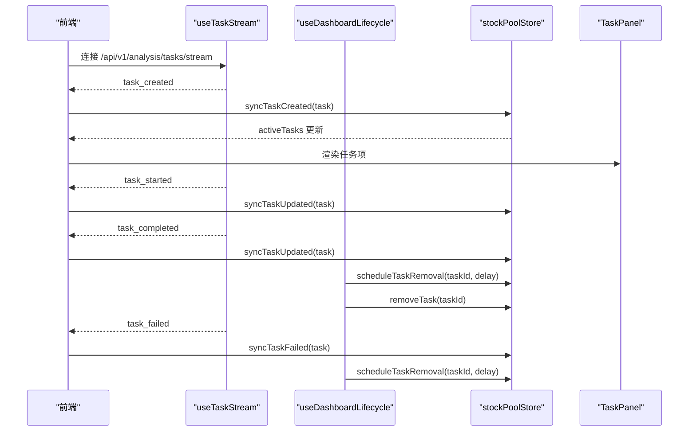
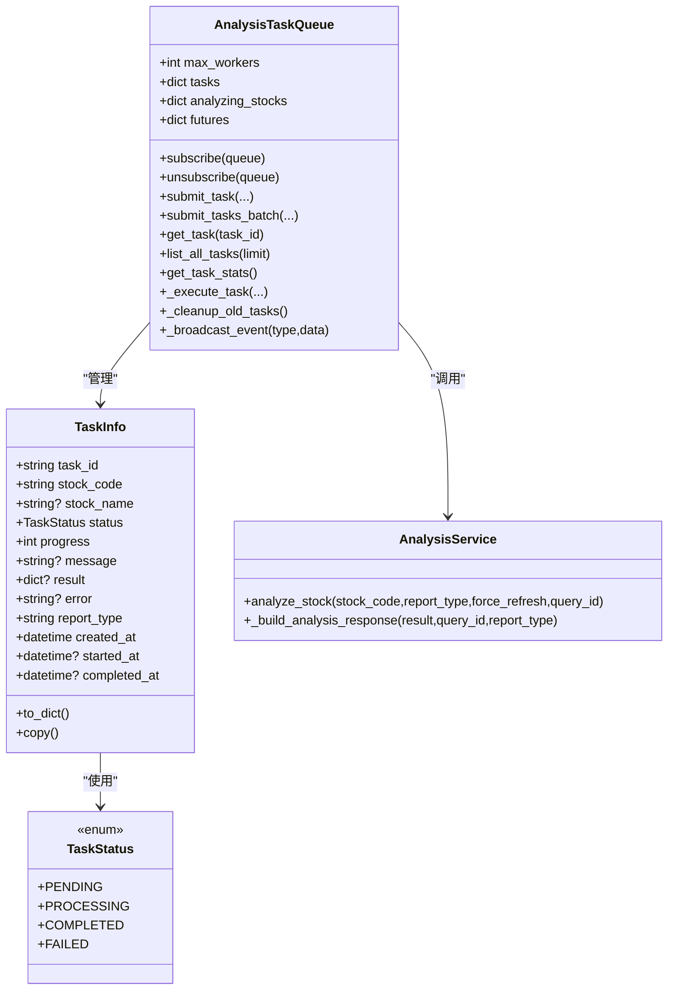
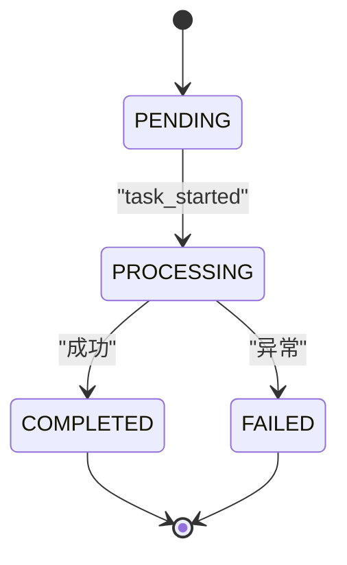

# 任务生命周期管理

<cite>
**本文引用的文件**
- [task_queue.py](file://src/services/task_queue.py)
- [analysis.py](file://api/v1/endpoints/analysis.py)
- [analysis.ts](file://apps/dsa-web/src/types/analysis.ts)
- [stockPoolStore.ts](file://apps/dsa-web/src/stores/stockPoolStore.ts)
- [useTaskStream.ts](file://apps/dsa-web/src/hooks/useTaskStream.ts)
- [useDashboardLifecycle.ts](file://apps/dsa-web/src/hooks/useDashboardLifecycle.ts)
- [TaskPanel.tsx](file://apps/dsa-web/src/components/tasks/TaskPanel.tsx)
- [analysis_service.py](file://src/services/analysis_service.py)
- [enums.py](file://src/enums.py)
- [analysis.py](file://api/v1/schemas/analysis.py)
</cite>

## 目录
1. [简介](#简介)
2. [项目结构](#项目结构)
3. [核心组件](#核心组件)
4. [架构总览](#架构总览)
5. [详细组件分析](#详细组件分析)
6. [依赖关系分析](#依赖关系分析)
7. [性能考量](#性能考量)
8. [故障排查指南](#故障排查指南)
9. [结论](#结论)
10. [附录](#附录)

## 简介
本文档围绕“任务生命周期管理”主题，系统梳理从任务创建、执行、完成/失败到清理的全过程，覆盖后端任务队列、API 层、前端状态管理与实时事件流等关键环节。重点解释以下内容：
- 任务状态：PENDING、PROCESSING、COMPLETED、FAILED 的定义与流转
- 任务创建：TaskInfo 初始化、任务 ID 生成、初始状态设置
- 执行监控：进度更新、状态消息、异常处理
- 完成/失败处理：结果持久化、状态更新、资源清理
- 清理机制：_max_history 内存管理策略与过期任务处理
- 可视化图表：状态转换图与时序流程图
- 最佳实践：日志记录与性能分析建议

## 项目结构
本项目采用前后端分离架构，任务生命周期贯穿后端任务队列、FastAPI 接口、SSE 实时事件流以及前端状态存储与 UI 组件。

**图表来源**
- [analysis.py:68-694](file://api/v1/endpoints/analysis.py#L68-L694)
- [task_queue.py:108-666](file://src/services/task_queue.py#L108-L666)
- [analysis_service.py:29-171](file://src/services/analysis_service.py#L29-L171)
- [stockPoolStore.ts:165-378](file://apps/dsa-web/src/stores/stockPoolStore.ts#L165-L378)
- [useTaskStream.ts:78-213](file://apps/dsa-web/src/hooks/useTaskStream.ts#L78-L213)
- [useDashboardLifecycle.ts:15-96](file://apps/dsa-web/src/hooks/useDashboardLifecycle.ts#L15-L96)
- [TaskPanel.tsx:1-50](file://apps/dsa-web/src/components/tasks/TaskPanel.tsx#L1-L50)

**章节来源**
- [analysis.py:68-694](file://api/v1/endpoints/analysis.py#L68-L694)
- [task_queue.py:108-666](file://src/services/task_queue.py#L108-L666)
- [stockPoolStore.ts:165-378](file://apps/dsa-web/src/stores/stockPoolStore.ts#L165-L378)

## 核心组件
- 任务状态枚举与数据模型
  - 后端：TaskStatus 枚举与 TaskInfo 数据类
  - 前端：TaskInfo 类型与 TaskStatus 类型
- 任务队列：AnalysisTaskQueue，负责任务提交、执行、事件广播、清理
- API 接口：触发分析、查询任务状态、SSE 事件流
- 前端状态与事件流：store、SSE Hook、生命周期 Hook、UI 组件
- 分析服务：封装分析逻辑与结果构建

**章节来源**
- [task_queue.py:34-94](file://src/services/task_queue.py#L34-L94)
- [analysis.ts:132-144](file://apps/dsa-web/src/types/analysis.ts#L132-L144)
- [analysis.py:182-215](file://api/v1/schemas/analysis.py#L182-L215)

## 架构总览
后端以 AnalysisTaskQueue 为核心，统一管理任务生命周期；API 层负责对外暴露接口与 SSE 事件流；前端通过 useTaskStream.ts 订阅事件，stockPoolStore.ts 维护活动任务列表，useDashboardLifecycle.ts 控制刷新与清理时机，TaskPanel.tsx 展示任务状态。

**图表来源**
- [analysis.py:88-301](file://api/v1/endpoints/analysis.py#L88-L301)
- [task_queue.py:296-533](file://src/services/task_queue.py#L296-L533)
- [analysis_service.py:40-105](file://src/services/analysis_service.py#L40-L105)

## 详细组件分析

### 任务状态与数据模型
- 后端状态枚举与 TaskInfo 字段
  - 状态：PENDING、PROCESSING、COMPLETED、FAILED
  - 关键字段：task_id、stock_code、stock_name、status、progress、message、result、error、report_type、created_at、started_at、completed_at
  - to_dict() 用于 API 响应序列化
- 前端类型
  - TaskInfo：与后端一致的关键字段
  - TaskStatus：用于查询任务状态的简化模型

**章节来源**
- [task_queue.py:34-94](file://src/services/task_queue.py#L34-L94)
- [analysis.ts:132-144](file://apps/dsa-web/src/types/analysis.ts#L132-L144)
- [analysis.py:182-215](file://api/v1/schemas/analysis.py#L182-L215)

### 任务创建与提交
- 前端提交分析请求
  - stockPoolStore.ts 调用 analysisApi.analyzeAsync，触发异步分析
- 后端提交任务
  - API 接口解析请求，校验参数，调用 AnalysisTaskQueue.submit_tasks_batch
  - 批量提交时，对重复股票进行去重并返回 duplicates
  - 任务创建后立即广播 task_created 事件，保证顺序一致性
- 任务 ID 生成
  - 使用 uuid.uuid4() 生成唯一 task_id
- 初始状态设置
  - TaskInfo.status 设置为 PENDING，message 设置为“任务已加入队列”

**图表来源**
- [analysis.py:161-232](file://api/v1/endpoints/analysis.py#L161-L232)
- [task_queue.py:296-361](file://src/services/task_queue.py#L296-L361)

**章节来源**
- [analysis.py:88-159](file://api/v1/endpoints/analysis.py#L88-L159)
- [task_queue.py:296-361](file://src/services/task_queue.py#L296-L361)

### 任务执行与监控
- 线程池执行
  - AnalysisTaskQueue.executor 提交 _execute_task，设置状态为 PROCESSING，message=“正在分析中...”，progress=10
  - 广播 task_started 事件
- 进度与消息
  - 前端通过 SSE 接收 task_started，更新 UI
  - 分析服务执行完成后，任务队列将状态设为 COMPLETED 或 FAILED，并广播对应事件
- 异常处理
  - 任何异常被捕获，设置状态为 FAILED，记录 error，广播 task_failed

**图表来源**
- [task_queue.py:440-533](file://src/services/task_queue.py#L440-L533)
- [analysis_service.py:40-105](file://src/services/analysis_service.py#L40-L105)

**章节来源**
- [task_queue.py:440-533](file://src/services/task_queue.py#L440-L533)
- [analysis_service.py:40-105](file://src/services/analysis_service.py#L40-L105)

### 任务完成与失败处理
- 完成处理
  - 设置 status=COMPLETED，progress=100，completed_at，result，更新 stock_name
  - 从“分析中”映射中移除该股票
  - 广播 task_completed
  - 调用 _cleanup_old_tasks 清理过期任务
- 失败处理
  - 设置 status=FAILED，completed_at，error（截断至 200 字符），message
  - 从“分析中”映射中移除该股票
  - 广播 task_failed
  - 调用 _cleanup_old_tasks 清理过期任务
- 结果持久化
  - 完成后写入数据库（由分析服务与存储层协作实现）

**章节来源**
- [task_queue.py:484-532](file://src/services/task_queue.py#L484-L532)
- [analysis_service.py:106-171](file://src/services/analysis_service.py#L106-L171)

### 任务清理机制
- _max_history 配置
  - 默认保留最近 100 个任务（内存中）
- _cleanup_old_tasks 策略
  - 仅清理已完成或失败的任务
  - 按 created_at 升序排序，删除最旧的部分，直到剩余数量不超过 _max_history
  - 删除时同时清理对应的 Future，避免悬挂引用

**图表来源**
- [task_queue.py:534-566](file://src/services/task_queue.py#L534-L566)

**章节来源**
- [task_queue.py:154-158](file://src/services/task_queue.py#L154-L158)
- [task_queue.py:534-566](file://src/services/task_queue.py#L534-L566)

### 前端任务生命周期与 UI
- SSE 订阅与事件处理
  - useTaskStream.ts 订阅 /api/v1/analysis/tasks/stream，监听 task_created/task_started/task_completed/task_failed/heartbeat
  - 生命周期 Hook useDashboardLifecycle.ts 在任务完成后定时移除 UI 中的任务项
- 状态存储与 UI 组件
  - stockPoolStore.ts 维护 activeTasks，提供 syncTaskCreated/syncTaskUpdated/syncTaskFailed/removeTask/resetDashboardState
  - TaskPanel.tsx 根据状态渲染不同图标与提示

**图表来源**
- [useTaskStream.ts:78-213](file://apps/dsa-web/src/hooks/useTaskStream.ts#L78-L213)
- [useDashboardLifecycle.ts:68-93](file://apps/dsa-web/src/hooks/useDashboardLifecycle.ts#L68-L93)
- [stockPoolStore.ts:338-376](file://apps/dsa-web/src/stores/stockPoolStore.ts#L338-L376)
- [TaskPanel.tsx:14-50](file://apps/dsa-web/src/components/tasks/TaskPanel.tsx#L14-L50)

**章节来源**
- [useTaskStream.ts:78-213](file://apps/dsa-web/src/hooks/useTaskStream.ts#L78-L213)
- [useDashboardLifecycle.ts:68-93](file://apps/dsa-web/src/hooks/useDashboardLifecycle.ts#L68-L93)
- [stockPoolStore.ts:338-376](file://apps/dsa-web/src/stores/stockPoolStore.ts#L338-L376)
- [TaskPanel.tsx:14-50](file://apps/dsa-web/src/components/tasks/TaskPanel.tsx#L14-L50)

### API 与类型定义
- 触发分析接口
  - 支持同步与异步模式；异步模式下相同股票禁止重复提交
  - 返回 202 与 TaskAccepted/BatchTaskAcceptedResponse
- 查询任务状态
  - 优先从队列查询；若不存在则从数据库查询历史记录
- SSE 事件流
  - 事件类型：connected、task_created、task_started、task_completed、task_failed、heartbeat

**章节来源**
- [analysis.py:88-571](file://api/v1/endpoints/analysis.py#L88-L571)
- [analysis.py:182-215](file://api/v1/schemas/analysis.py#L182-L215)

## 依赖关系分析

**图表来源**
- [task_queue.py:34-94](file://src/services/task_queue.py#L34-L94)
- [task_queue.py:108-666](file://src/services/task_queue.py#L108-L666)
- [analysis_service.py:29-171](file://src/services/analysis_service.py#L29-L171)

**章节来源**
- [task_queue.py:108-666](file://src/services/task_queue.py#L108-L666)
- [analysis_service.py:29-171](file://src/services/analysis_service.py#L29-L171)

## 性能考量
- 并发控制
  - AnalysisTaskQueue.executor 的 max_workers 可动态调整（sync_max_workers），空闲时即时生效，繁忙时延迟应用
- 内存占用
  - _max_history 控制内存中保留的任务数量，默认 100；清理策略按创建时间排序删除最旧已完成/失败任务
- 线程安全
  - 使用 RLock 保护共享数据结构；跨线程广播使用 asyncio.call_soon_threadsafe 确保事件安全传递
- SSE 压力
  - 心跳事件每 30 秒一次，避免长连接超时；Nginx 缓冲禁用以保证实时性

[本节为通用性能建议，无需特定文件引用]

## 故障排查指南
- 常见问题与定位
  - 重复提交：后端抛出 DuplicateTaskError，前端收到 409；检查 stockPoolStore 的 duplicateError 与 dismissedTaskIds
  - 任务未出现：确认 SSE 连接状态（useTaskStream.ts），检查 useDashboardLifecycle.ts 的自动重连逻辑
  - 任务长时间停留在 PENDING：检查线程池是否饱和、max_workers 是否合理
  - 任务完成后未持久化：确认分析服务返回非空结果，查看数据库写入路径
- 日志与追踪
  - 后端：AnalysisTaskQueue、AnalysisService、API 层均有日志输出，便于定位异常
  - 前端：useTaskStream.ts 记录连接状态与错误；store 中记录任务状态变更
- 资源清理
  - 确认 _cleanup_old_tasks 是否按预期执行；如内存持续增长，检查 _max_history 设置与任务完成率

**章节来源**
- [stockPoolStore.ts:323-335](file://apps/dsa-web/src/stores/stockPoolStore.ts#L323-L335)
- [useTaskStream.ts:191-203](file://apps/dsa-web/src/hooks/useTaskStream.ts#L191-L203)
- [task_queue.py:534-566](file://src/services/task_queue.py#L534-L566)

## 结论
本系统通过 AnalysisTaskQueue 统一管理任务生命周期，结合 FastAPI 的 SSE 事件流与前端状态存储，实现了从任务创建到销毁的完整闭环。PENDING/PROCESSING/COMPLETED/FAILED 四种状态清晰划分，配合 _max_history 内存清理策略与线程池并发控制，兼顾了实时性与稳定性。前端通过 Hook 与组件实现任务状态的可视化与交互，整体架构清晰、扩展性强。

[本节为总结性内容，无需特定文件引用]

## 附录
- 状态转换图（概念示意）

[本图为概念图，无需图表来源]